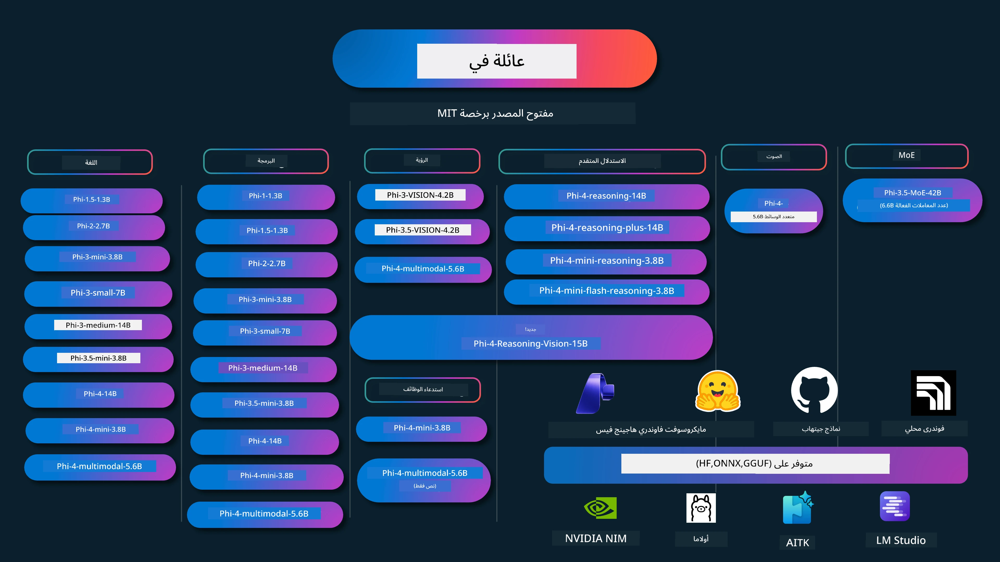

# كتاب طبخ Phi: أمثلة تطبيقية مع نماذج Phi من مايكروسوفت

[](https://codespaces.new/microsoft/phicookbook)
[](https://vscode.dev/redirect?url=vscode://ms-vscode-remote.remote-containers/cloneInVolume?url=https://github.com/microsoft/phicookbook)

[](https://GitHub.com/microsoft/phicookbook/graphs/contributors/?WT.mc_id=aiml-137032-kinfeylo)
[](https://GitHub.com/microsoft/phicookbook/issues/?WT.mc_id=aiml-137032-kinfeylo)
[](https://GitHub.com/microsoft/phicookbook/pulls/?WT.mc_id=aiml-137032-kinfeylo)
[](http://makeapullrequest.com?WT.mc_id=aiml-137032-kinfeylo)

[](https://GitHub.com/microsoft/phicookbook/watchers/?WT.mc_id=aiml-137032-kinfeylo)
[](https://GitHub.com/microsoft/phicookbook/network/?WT.mc_id=aiml-137032-kinfeylo)
[](https://GitHub.com/microsoft/phicookbook/stargazers/?WT.mc_id=aiml-137032-kinfeylo)

[](https://discord.com/invite/ByRwuEEgH4)

Phi هي سلسلة من نماذج الذكاء الاصطناعي مفتوحة المصدر تم تطويرها من قبل مايكروسوفت.

Phi حالياً هو أقوى وأكفأ نموذج لغة صغير (SLM)، مع مؤشرات أداء جيدة جداً في دعم لغات متعددة، والتفكير، وتوليد النصوص/الدردشة، والبرمجة، والصور، والصوت وسيناريوهات أخرى.

يمكنك نشر Phi على السحابة أو على أجهزة الطرف النهائي، ويمكنك بسهولة بناء تطبيقات ذكاء اصطناعي توليدية مع قدرة حسابية محدودة.

اتبع هذه الخطوات للبدء باستخدام هذه الموارد:
1. **افتح نسخة من المستودع**: انقر [](https://GitHub.com/microsoft/phicookbook/network/?WT.mc_id=aiml-137032-kinfeylo)
2. **انسخ المستودع محليًا**: `git clone https://github.com/microsoft/PhiCookBook.git`
3. [**انضم إلى مجتمع Microsoft AI على Discord وتعرف على الخبراء والمطورين الآخرين**](https://discord.com/invite/ByRwuEEgH4?WT.mc_id=aiml-137032-kinfeylo)



### 🌐 دعم متعدد اللغات

#### مدعوم عبر GitHub Action (آلي ومحدث دائماً)

<!-- CO-OP TRANSLATOR LANGUAGES TABLE START -->
[العربية](./README.md) | [البنغالية](../bn/README.md) | [البلغارية](../bg/README.md) | [البورمية (ميانمار)](../my/README.md) | [الصينية (مبسطة)](../zh-CN/README.md) | [الصينية (تقليدية، هونغ كونغ)](../zh-HK/README.md) | [الصينية (تقليدية، ماكاو)](../zh-MO/README.md) | [الصينية (تقليدية، تايوان)](../zh-TW/README.md) | [الكرواتية](../hr/README.md) | [التشيكية](../cs/README.md) | [الدانماركية](../da/README.md) | [الهولندية](../nl/README.md) | [الإستونية](../et/README.md) | [الفنلندية](../fi/README.md) | [الفرنسية](../fr/README.md) | [الألمانية](../de/README.md) | [اليونانية](../el/README.md) | [العبرية](../he/README.md) | [الهندية](../hi/README.md) | [الهنغارية](../hu/README.md) | [الإندونيسية](../id/README.md) | [الإيطالية](../it/README.md) | [اليابانية](../ja/README.md) | [الكانادا](../kn/README.md) | [الخميرية](../km/README.md) | [الكورية](../ko/README.md) | [اللتوانية](../lt/README.md) | [الماليزية](../ms/README.md) | [المالايالامية](../ml/README.md) | [الماراثية](../mr/README.md) | [النيبالية](../ne/README.md) | [البيجدين النيجيرية](../pcm/README.md) | [النرويجية](../no/README.md) | [الفارسية (اللغة الفارسية)](../fa/README.md) | [البولندية](../pl/README.md) | [البرتغالية (البرازيل)](../pt-BR/README.md) | [البرتغالية (البرتغال)](../pt-PT/README.md) | [البنجابية (غرمخي)](../pa/README.md) | [الرومانية](../ro/README.md) | [الروسية](../ru/README.md) | [الصربية (السيريلية)](../sr/README.md) | [السلوفاكية](../sk/README.md) | [السلوفينية](../sl/README.md) | [الإسبانية](../es/README.md) | [السواحيلية](../sw/README.md) | [السويدية](../sv/README.md) | [التاغالوج (الفلبينية)](../tl/README.md) | [التاميلية](../ta/README.md) | [التيلوغو](../te/README.md) | [التايلاندية](../th/README.md) | [التركية](../tr/README.md) | [الأوكرانية](../uk/README.md) | [الأردية](../ur/README.md) | [الفيتنامية](../vi/README.md)

> **هل تفضل النسخ محليًا؟**
>
> يحتوي هذا المستودع على أكثر من 50 ترجمة للغات مختلفة مما يزيد بشكل كبير من حجم التنزيل. للنسخ بدون الترجمات، استخدم السحب الانتقائي:
>
> **باش / ماك / لينكس:**
> ```bash
> git clone --filter=blob:none --sparse https://github.com/microsoft/PhiCookBook.git
> cd PhiCookBook
> git sparse-checkout set --no-cone '/*' '!translations' '!translated_images'
> ```
>
> **CMD (ويندوز):**
> ```cmd
> git clone --filter=blob:none --sparse https://github.com/microsoft/PhiCookBook.git
> cd PhiCookBook
> git sparse-checkout set --no-cone "/*" "!translations" "!translated_images"
> ```
>
> هذا يمنحك كل ما تحتاجه لإتمام الدورة مع تنزيل أسرع بكثير.
<!-- CO-OP TRANSLATOR LANGUAGES TABLE END -->

## جدول المحتويات

- المقدمة
  - [مرحبًا بك في عائلة Phi](./md/01.Introduction/01/01.PhiFamily.md)
  - [إعداد بيئتك](./md/01.Introduction/01/01.EnvironmentSetup.md)
  - [فهم التقنيات الرئيسية](./md/01.Introduction/01/01.Understandingtech.md)
  - [أمان الذكاء الاصطناعي لنماذج Phi](./md/01.Introduction/01/01.AISafety.md)
  - [دعم العتاد لنماذج Phi](./md/01.Introduction/01/01.Hardwaresupport.md)
  - [نماذج Phi وتوفرها عبر المنصات](./md/01.Introduction/01/01.Edgeandcloud.md)
  - [استخدام Guidance-ai و Phi](./md/01.Introduction/01/01.Guidance.md)
  - [نماذج سوق GitHub](https://github.com/marketplace/models)
  - [كتالوج نماذج Azure AI](https://ai.azure.com)

- استدلال Phi في بيئات مختلفة
    -  [Hugging face](./md/01.Introduction/02/01.HF.md)
    -  [نماذج GitHub](./md/01.Introduction/02/02.GitHubModel.md)
    -  [كتالوج نماذج Microsoft Foundry](./md/01.Introduction/02/03.AzureAIFoundry.md)
    -  [Ollama](./md/01.Introduction/02/04.Ollama.md)
    -  [أدوات AI لـ VSCode (AITK)](./md/01.Introduction/02/05.AITK.md)
    -  [NVIDIA NIM](./md/01.Introduction/02/06.NVIDIA.md)
    -  [Foundry Local](./md/01.Introduction/02/07.FoundryLocal.md)

- استدلال عائلة Phi
    - [استدلال Phi في iOS](./md/01.Introduction/03/iOS_Inference.md)
    - [استدلال Phi في Android](./md/01.Introduction/03/Android_Inference.md)
    - [استدلال Phi في Jetson](./md/01.Introduction/03/Jetson_Inference.md)
    - [استدلال Phi في AI PC](./md/01.Introduction/03/AIPC_Inference.md)
    - [استدلال Phi مع إطار عمل Apple MLX](./md/01.Introduction/03/MLX_Inference.md)
    - [استدلال Phi في الخادم المحلي](./md/01.Introduction/03/Local_Server_Inference.md)
    - [استدلال Phi في الخادم البعيد باستخدام أدوات AI Toolkit](./md/01.Introduction/03/Remote_Interence.md)
    - [استدلال Phi باستخدام Rust](./md/01.Introduction/03/Rust_Inference.md)
    - [استدلال Phi-Vision في المحلي](./md/01.Introduction/03/Vision_Inference.md)
    - [استدلال Phi مع Kaito AKS، حاويات Azure (الدعم الرسمي)](./md/01.Introduction/03/Kaito_Inference.md)
-  [كمية عائلة Phi](./md/01.Introduction/04/QuantifyingPhi.md)
    - [تكميم Phi-3.5 / 4 باستخدام llama.cpp](./md/01.Introduction/04/UsingLlamacppQuantifyingPhi.md)
    - [تكميم Phi-3.5 / 4 باستخدام امتدادات Generative AI لـ onnxruntime](./md/01.Introduction/04/UsingORTGenAIQuantifyingPhi.md)
    - [تكميم Phi-3.5 / 4 باستخدام Intel OpenVINO](./md/01.Introduction/04/UsingIntelOpenVINOQuantifyingPhi.md)
    - [تكميم Phi-3.5 / 4 باستخدام إطار عمل Apple MLX](./md/01.Introduction/04/UsingAppleMLXQuantifyingPhi.md)

-  تقييم Phi
    - [الذكاء الاصطناعي المسؤول](./md/01.Introduction/05/ResponsibleAI.md)
    - [Microsoft Foundry للتقييم](./md/01.Introduction/05/AIFoundry.md)
    - [استخدام Promptflow للتقييم](./md/01.Introduction/05/Promptflow.md)
 
- استرجاع المعرفة مع بحث Azure AI
    - [كيفية استخدام Phi-4-mini و Phi-4-multimodal (RAG) مع بحث Azure AI](https://github.com/microsoft/PhiCookBook/blob/main/code/06.E2E/E2E_Phi-4-RAG-Azure-AI-Search.ipynb)

- عينات تطوير تطبيقات Phi
  - تطبيقات النص والدردشة
    - عينات Phi-4
      - [📓] [الدردشة مع نموذج Phi-4-mini ONNX](./md/02.Application/01.TextAndChat/Phi4/ChatWithPhi4ONNX/README.md)
      - [الدردشة مع نموذج Phi-4 المحلي ONNX .NET](../../md/04.HOL/dotnet/src/LabsPhi4-Chat-01OnnxRuntime)
      - [تطبيق الدردشة .NET Console مع Phi-4 ONNX باستخدام Sementic Kernel](../../md/04.HOL/dotnet/src/LabsPhi4-Chat-02SK)
    - عينات Phi-3 / 3.5
      - [روبوت دردشة محلي في المتصفح باستخدام Phi3، ONNX Runtime Web و WebGPU](https://github.com/microsoft/onnxruntime-inference-examples/tree/main/js/chat)
      - [دردشة OpenVino](./md/02.Application/01.TextAndChat/Phi3/E2E_OpenVino_Chat.md)
      - [النموذج المتعدد - Phi-3-mini التفاعلي و OpenAI Whisper](./md/02.Application/01.TextAndChat/Phi3/E2E_Phi-3-mini_with_whisper.md)
      - [MLFlow - بناء مغلف واستخدام Phi-3 مع MLFlow](./md//02.Application/01.TextAndChat/Phi3/E2E_Phi-3-MLflow.md)
      - [تحسين النموذج - كيفية تحسين نموذج Phi-3-min لـ ONNX Runtime Web باستخدام Olive](https://github.com/microsoft/Olive/tree/main/examples/phi3)
      - [تطبيق WinUI3 مع Phi-3 mini-4k-instruct-onnx](https://github.com/microsoft/Phi3-Chat-WinUI3-Sample/)
      -[مثال تطبيق ملاحظات AI متعدد النماذج مع WinUI3](https://github.com/microsoft/ai-powered-notes-winui3-sample)
      - [تحسين دقيق ودمج نماذج Phi-3 المخصصة مع Prompt flow](./md/02.Application/01.TextAndChat/Phi3/E2E_Phi-3-FineTuning_PromptFlow_Integration.md)
      - [تحسين دقيق ودمج نماذج Phi-3 المخصصة مع Prompt flow في Microsoft Foundry](./md/02.Application/01.TextAndChat/Phi3/E2E_Phi-3-FineTuning_PromptFlow_Integration_AIFoundry.md)
      - [تقييم نموذج Phi-3 / Phi-3.5 المحسن بدقة في Microsoft Foundry مع التركيز على مبادئ الذكاء الاصطناعي المسؤول من مايكروسوفت](./md/02.Application/01.TextAndChat/Phi3/E2E_Phi-3-Evaluation_AIFoundry.md)
      - [📓] [نموذج توقع اللغة Phi-3.5-mini-instruct (صيني/إنجليزي)](./md/02.Application/01.TextAndChat/Phi3/phi3-instruct-demo.ipynb)
      - [روبوت الدردشة Phi-3.5-Instruct WebGPU RAG](./md/02.Application/01.TextAndChat/Phi3/WebGPUWithPhi35Readme.md)
      - [استخدام GPU ويندوز لإنشاء حل Prompt flow مع Phi-3.5-Instruct ONNX](./md/02.Application/01.TextAndChat/Phi3/UsingPromptFlowWithONNX.md)
      - [استخدام Microsoft Phi-3.5 tflite لإنشاء تطبيق أندرويد](./md/02.Application/01.TextAndChat/Phi3/UsingPhi35TFLiteCreateAndroidApp.md)
      - [مثال سؤال وجواب .NET باستخدام نموذج ONNX محلي Phi-3 مع Microsoft.ML.OnnxRuntime](../../md/04.HOL/dotnet/src/LabsPhi301)
      - [تطبيق دردشة وحدة تحكم .NET مع Semantic Kernel و Phi-3](../../md/04.HOL/dotnet/src/LabsPhi302)

  - عينات SDK استنتاج Azure AI المعتمدة على الكود
    - عينات Phi-4
      - [📓] [إنشاء كود مشروع باستخدام Phi-4-multimodal](./md/02.Application/02.Code/Phi4/GenProjectCode/README.md)
    - عينات Phi-3 / 3.5
      - [بناء مساعد دردشة GitHub في Visual Studio Code باستخدام عائلة Microsoft Phi-3](./md/02.Application/02.Code/Phi3/VSCodeExt/README.md)
      - [إنشاء وكيل دردشة مساعد في Visual Studio Code مع Phi-3.5 بواسطة نماذج GitHub](/md/02.Application/02.Code/Phi3/CreateVSCodeChatAgentWithGitHubModels.md)

  - عينات الاستدلال المتقدمة
    - عينات Phi-4
      - [📓] [عينات Phi-4-mini-reasoning أو Phi-4-reasoning](./md/02.Application/03.AdvancedReasoning/Phi4/AdvancedResoningPhi4mini/README.md)
      - [📓] [تحسين دقيق لـ Phi-4-mini-reasoning مع Microsoft Olive](./md/02.Application/03.AdvancedReasoning/Phi4/AdvancedResoningPhi4mini/olive_ft_phi_4_reasoning_with_medicaldata.ipynb)
      - [📓] [تحسين دقيق لـ Phi-4-mini-reasoning مع Apple MLX](./md/02.Application/03.AdvancedReasoning/Phi4/AdvancedResoningPhi4mini/mlx_ft_phi_4_reasoning_with_medicaldata.ipynb)
      - [📓] [Phi-4-mini-reasoning مع نماذج GitHub](./md/02.Application/02.Code/Phi4r/github_models_inference.ipynb)
      - [📓] [Phi-4-mini-reasoning مع نماذج Microsoft Foundry](./md/02.Application/02.Code/Phi4r/azure_models_inference.ipynb)
  - العروض التوضيحية
      - [عروض Phi-4-mini مستضافة على Hugging Face Spaces](https://huggingface.co/spaces/microsoft/phi-4-mini?WT.mc_id=aiml-137032-kinfeylo)
      - [عروض Phi-4-multimodal مستضافة على Hugging Face Spaces](https://huggingface.co/spaces/microsoft/phi-4-multimodal?WT.mc_id=aiml-137032-kinfeylo)
  - عينات الرؤية
    - عينات Phi-4
      - [📓] [استخدام Phi-4-multimodal لقراءة الصور وإنشاء الكود](./md/02.Application/04.Vision/Phi4/CreateFrontend/README.md)
    - عينات Phi-3 / 3.5
      -  [📓][Phi-3-vision-نص الصورة إلى نص](./md/02.Application/04.Vision/Phi3/E2E_Phi-3-vision-image-text-to-text-online-endpoint.ipynb)
      - [Phi-3-vision-ONNX](https://onnxruntime.ai/docs/genai/tutorials/phi3-v.html)
      - [📓][Phi-3-vision تشفير CLIP](./md/02.Application/04.Vision/Phi3/E2E_Phi-3-vision-image-text-to-text-online-endpoint.ipynb)
      - [تجريبي: إعادة تدوير Phi-3](https://github.com/jennifermarsman/PhiRecycling/)
      - [Phi-3-vision - مساعد اللغة البصرية - مع Phi3-Vision و OpenVINO](https://docs.openvino.ai/nightly/notebooks/phi-3-vision-with-output.html)
      - [Phi-3 Vision Nvidia NIM](./md/02.Application/04.Vision/Phi3/E2E_Nvidia_NIM_Vision.md)
      - [Phi-3 Vision OpenVino](./md/02.Application/04.Vision/Phi3/E2E_OpenVino_Phi3Vision.md)
      - [📓][عينة رؤية متعددة الإطارات أو متعددة الصور Phi-3.5 Vision](./md/02.Application/04.Vision/Phi3/phi3-vision-demo.ipynb)
      - [نموذج ONNX المحلي لرؤية Phi-3 باستخدام Microsoft.ML.OnnxRuntime .NET](../../md/04.HOL/dotnet/src/LabsPhi303)
      - [نموذج ONNX المحلي لرؤية Phi-3 مع قائمة باستخدام Microsoft.ML.OnnxRuntime .NET](../../md/04.HOL/dotnet/src/LabsPhi304)

  - عينات الرؤية والاستدلال
    - Phi-4-Reasoning-Vision-15B
      - [📓] [استخدام Phi-4-Reasoning-Vision-15B للكشف عن عبور المارة بشكل غير قانوني](./md/02.Application/10.ReasoningVision/Phi_4_reasoning_vision_15b_Jaywalking.ipynb)
      - [📓] [استخدام Phi-4-Reasoning-Vision-15B في الرياضيات](./md/02.Application/10.ReasoningVision/Phi_4_reasoning_vision_15b_Math.ipynb)
      - [📓] [استخدام Phi-4-Reasoning-Vision-15B للكشف عن واجهة المستخدم](./md/02.Application/10.ReasoningVision/Phi_4_reasoning_vision_15b_ui.ipynb)

  - عينات الرياضيات
    - عينات Phi-4-Mini-Flash-Reasoning-Instruct  [عرض توضيحي رياضي باستخدام Phi-4-Mini-Flash-Reasoning-Instruct](./md/02.Application/09.Math/MathDemo.ipynb)

  - عينات الصوت
    - عينات Phi-4
      - [📓] [استخراج نصوص الصوت باستخدام Phi-4-multimodal](./md/02.Application/05.Audio/Phi4/Transciption/README.md)
      - [📓] [عينة صوت Phi-4-multimodal](./md/02.Application/05.Audio/Phi4/Siri/demo.ipynb)
      - [📓] [عينة ترجمة الكلام Phi-4-multimodal](./md/02.Application/05.Audio/Phi4/Translate/demo.ipynb)
      - [تطبيق وحدة تحكم .NET باستخدام Phi-4-multimodal لتحليل ملف صوتي وإنشاء النص](../../md/04.HOL/dotnet/src/LabsPhi4-MultiModal-02Audio)

  - عينات MOE
    - عينات Phi-3 / 3.5
      - [📓] [نماذج مزيج الخبراء Phi-3.5 (MoEs) لعينة وسائل التواصل الاجتماعي](./md/02.Application/06.MoE/Phi3/phi3_moe_demo.ipynb)
      - [📓] [بناء خط أنابيب توليد معزّز بالاستدعاء (RAG) مع NVIDIA NIM Phi-3 MOE، Azure AI Search، و LlamaIndex](./md/02.Application/06.MoE/Phi3/azure-ai-search-nvidia-rag.ipynb)
      - 
  - عينات استدعاء الوظائف
    - عينات Phi-4 🆕
      -  [📓] [استخدام استدعاء الوظائف مع Phi-4-mini](./md/02.Application/07.FunctionCalling/Phi4/FunctionCallingBasic/README.md)
      -  [📓] [استخدام استدعاء الوظائف لإنشاء وكلاء متعددين مع Phi-4-mini](./md/02.Application/07.FunctionCalling/Phi4/Multiagents/Phi_4_mini_multiagent.ipynb)
      -  [📓] [استخدام استدعاء الوظائف مع Ollama](./md/02.Application/07.FunctionCalling/Phi4/Ollama/ollama_functioncalling.ipynb)
      -  [📓] [استخدام استدعاء الوظائف مع ONNX](./md/02.Application/07.FunctionCalling/Phi4/ONNX/onnx_parallel_functioncalling.ipynb)
  - عينات المزج المتعدد الوسائط
    - عينات Phi-4 🆕
      -  [📓] [استخدام Phi-4-multimodal كصحفي تقني](./md/02.Application/08.Multimodel/Phi4/TechJournalist/phi_4_mm_audio_text_publish_news.ipynb)
      - [تطبيق وحدة تحكم .NET باستخدام Phi-4-multimodal لتحليل الصور](../../md/04.HOL/dotnet/src/LabsPhi4-MultiModal-01Images)

- عينات التحسين الدقيق Phi
  - [سيناريوهات التحسين الدقيق](./md/03.FineTuning/FineTuning_Scenarios.md)
  - [التحسين الدقيق مقابل RAG](./md/03.FineTuning/FineTuning_vs_RAG.md)
  - [دع Phi-3 يصبح خبيرًا صناعيًا - تحسين دقيق](./md/03.FineTuning/LetPhi3gotoIndustriy.md)
  - [التحسين الدقيق لـ Phi-3 باستخدام AI Toolkit لـ VS Code](./md/03.FineTuning/Finetuning_VSCodeaitoolkit.md)
  - [التحسين الدقيق لـ Phi-3 باستخدام خدمة تعلم الآلة Azure](./md/03.FineTuning/Introduce_AzureML.md)
  - [التحسين الدقيق لـ Phi-3 باستخدام Lora](./md/03.FineTuning/FineTuning_Lora.md)
  - [التحسين الدقيق لـ Phi-3 باستخدام QLora](./md/03.FineTuning/FineTuning_Qlora.md)
  - [التحسين الدقيق لـ Phi-3 باستخدام Microsoft Foundry](./md/03.FineTuning/FineTuning_AIFoundry.md)
  - [التحسين الدقيق لـ Phi-3 باستخدام Azure ML CLI/SDK](./md/03.FineTuning/FineTuning_MLSDK.md)
  - [التحسين الدقيق باستخدام Microsoft Olive](./md/03.FineTuning/FineTuning_MicrosoftOlive.md)
  - [مختبر عملي للتحسين الدقيق باستخدام Microsoft Olive](./md/03.FineTuning/olive-lab/readme.md)
  - [التحسين الدقيق لـ Phi-3-vision باستخدام Weights and Bias](./md/03.FineTuning/FineTuning_Phi-3-visionWandB.md)
  - [التحسين الدقيق لـ Phi-3 باستخدام إطار عمل Apple MLX](./md/03.FineTuning/FineTuning_MLX.md)
  - [التحسين الدقيق لـ Phi-3-vision (الدعم الرسمي)](./md/03.FineTuning/FineTuning_Vision.md)
  - [ضبط دقيق لـ Phi-3 باستخدام Kaito AKS وحاويات Azure (الدعم الرسمي)](./md/03.FineTuning/FineTuning_Kaito.md)
  - [ضبط دقيق لـ Phi-3 و Phi-3.5 Vision](https://github.com/2U1/Phi3-Vision-Finetune)

- مختبر عملي
  - [استكشاف أحدث النماذج المتقدمة: LLMs، SLMs، التطوير المحلي والمزيد](https://github.com/microsoft/aitour-exploring-cutting-edge-models)
  - [فتح إمكانيات معالجة اللغة الطبيعية: الضبط الدقيق باستخدام Microsoft Olive](https://github.com/azure/Ignite_FineTuning_workshop)

- الأبحاث الأكاديمية والأوراق المنشورة
  - [الكتب الدراسية هي كل ما تحتاجه II: تقرير فني عن phi-1.5](https://arxiv.org/abs/2309.05463)
  - [تقرير فني عن Phi-3: نموذج لغة عالي القدرة يعمل محليًا على هاتفك](https://arxiv.org/abs/2404.14219)
  - [تقرير فني عن Phi-4](https://arxiv.org/abs/2412.08905)
  - [تقرير فني عن Phi-4-Mini: نماذج لغوية متعددة الوسائط مدمجة لكنها قوية عبر مزيج LoRAs](https://arxiv.org/abs/2503.01743)
  - [تحسين نماذج اللغة الصغيرة لاستدعاء الوظائف داخل المركبة](https://arxiv.org/abs/2501.02342)
  - [(لماذا PHI) ضبط دقيق لـ PHI-3 للإجابة على أسئلة اختيار من متعدد: المنهجية، النتائج، والتحديات](https://arxiv.org/abs/2501.01588)
  - [تقرير فني عن استدلال Phi-4](https://www.microsoft.com/en-us/research/wp-content/uploads/2025/04/phi_4_reasoning.pdf)
  - [تقرير فني عن استدلال Phi-4-mini](https://huggingface.co/microsoft/Phi-4-mini-reasoning/blob/main/Phi-4-Mini-Reasoning.pdf)

## استخدام نماذج Phi

### Phi على Microsoft Foundry

يمكنك تعلم كيفية استخدام Microsoft Phi وكيفية بناء حلول شاملة في أجهزتك المختلفة. لتجربة Phi بنفسك، ابدأ بالتعامل مع النماذج وتخصيص Phi لسيناريوهاتك باستخدام [كتالوج نماذج Azure AI من Microsoft Foundry](https://aka.ms/phi3-azure-ai) ويمكنك معرفة المزيد في البدء مع [Microsoft Foundry](/md/02.QuickStart/AzureAIFoundry_QuickStart.md)

**ساحة اللعب**
لكل نموذج ساحة لعب مخصصة لاختبار النموذج على [ساحة لعب Azure AI](https://aka.ms/try-phi3).

### Phi على نماذج GitHub

يمكنك تعلم كيفية استخدام Microsoft Phi وكيفية بناء حلول شاملة في أجهزتك المختلفة. لتجربة Phi بنفسك، ابدأ بالتعامل مع النموذج وتخصيص Phi لسيناريوهاتك باستخدام [كتالوج نماذج GitHub](https://github.com/marketplace/models?WT.mc_id=aiml-137032-kinfeylo) ويمكنك معرفة المزيد في البدء مع [كتالوج نماذج GitHub](/md/02.QuickStart/GitHubModel_QuickStart.md)

**ساحة اللعب**
لكل نموذج ساحة لعب مخصصة لاختبار النموذج [ساحة اللعب]( /md/02.QuickStart/GitHubModel_QuickStart.md).

### Phi على Hugging Face

يمكنك أيضًا العثور على النموذج على [Hugging Face](https://huggingface.co/microsoft)

**ساحة اللعب**
 [ساحة لعب Hugging Chat](https://huggingface.co/chat/models/microsoft/Phi-3-mini-4k-instruct)

## 🎒 دورات أخرى

فريقنا ينتج دورات أخرى! تفقد:

<!-- CO-OP TRANSLATOR OTHER COURSES START -->
### LangChain
[](https://aka.ms/langchain4j-for-beginners)
[](https://aka.ms/langchainjs-for-beginners?WT.mc_id=m365-94501-dwahlin)
[](https://github.com/microsoft/langchain-for-beginners?WT.mc_id=m365-94501-dwahlin)
---

### Azure / Edge / MCP / الوكلاء
[](https://github.com/microsoft/AZD-for-beginners?WT.mc_id=academic-105485-koreyst)
[](https://github.com/microsoft/edgeai-for-beginners?WT.mc_id=academic-105485-koreyst)
[](https://github.com/microsoft/mcp-for-beginners?WT.mc_id=academic-105485-koreyst)
[](https://github.com/microsoft/ai-agents-for-beginners?WT.mc_id=academic-105485-koreyst)

---
 
### سلسلة الذكاء الاصطناعي التوليدي
[](https://github.com/microsoft/generative-ai-for-beginners?WT.mc_id=academic-105485-koreyst)
[-9333EA?style=for-the-badge&labelColor=E5E7EB&color=9333EA)](https://github.com/microsoft/Generative-AI-for-beginners-dotnet?WT.mc_id=academic-105485-koreyst)
[-C084FC?style=for-the-badge&labelColor=E5E7EB&color=C084FC)](https://github.com/microsoft/generative-ai-for-beginners-java?WT.mc_id=academic-105485-koreyst)
[-E879F9?style=for-the-badge&labelColor=E5E7EB&color=E879F9)](https://github.com/microsoft/generative-ai-with-javascript?WT.mc_id=academic-105485-koreyst)

---
 
### التعلم الأساسي
[](https://aka.ms/ml-beginners?WT.mc_id=academic-105485-koreyst)
[](https://aka.ms/datascience-beginners?WT.mc_id=academic-105485-koreyst)
[](https://aka.ms/ai-beginners?WT.mc_id=academic-105485-koreyst)
[](https://github.com/microsoft/Security-101?WT.mc_id=academic-96948-sayoung)
[](https://aka.ms/webdev-beginners?WT.mc_id=academic-105485-koreyst)
[](https://aka.ms/iot-beginners?WT.mc_id=academic-105485-koreyst)
[](https://github.com/microsoft/xr-development-for-beginners?WT.mc_id=academic-105485-koreyst)

---
 
### سلسلة المساعد الذكي
[](https://aka.ms/GitHubCopilotAI?WT.mc_id=academic-105485-koreyst)
[](https://github.com/microsoft/mastering-github-copilot-for-dotnet-csharp-developers?WT.mc_id=academic-105485-koreyst)
[](https://github.com/microsoft/CopilotAdventures?WT.mc_id=academic-105485-koreyst)
<!-- CO-OP TRANSLATOR OTHER COURSES END -->

## الذكاء الاصطناعي المسؤول 

تلتزم مايكروسوفت بمساعدة عملائنا على استخدام منتجات الذكاء الاصطناعي الخاصة بنا بمسؤولية، ومشاركة ما تعلمناه، وبناء شراكات مبنية على الثقة من خلال أدوات مثل ملاحظات الشفافية وتقييمات التأثير. يمكن العثور على العديد من هذه الموارد في [https://aka.ms/RAI](https://aka.ms/RAI).
تعتمد منهجية مايكروسوفت تجاه الذكاء الاصطناعي المسؤول على مبادئ الذكاء الاصطناعي لدينا التي تشمل العدالة، والموثوقية والسلامة، والخصوصية والأمان، والشمولية، والشفافية، والمساءلة.

يمكن لنماذج اللغة الطبيعية واسعة النطاق، والنماذج القائمة على الصور والصوت - مثل تلك المستخدمة في هذا المثال - أن تتصرف بطرق قد تكون غير عادلة أو غير موثوقة أو مسيئة، مما قد يسبب أضرارًا. يرجى مراجعة [مذكرة الشفافية لخدمة Azure OpenAI](https://learn.microsoft.com/legal/cognitive-services/openai/transparency-note?tabs=text) للاطلاع على المخاطر والقيود.
النهج الموصى به للتخفيف من هذه المخاطر هو تضمين نظام أمان في هندستك المعمارية يمكنه الكشف عن السلوك الضار ومنعه. يوفر [Azure AI Content Safety](https://learn.microsoft.com/azure/ai-services/content-safety/overview) طبقة حماية مستقلة، قادرة على الكشف عن المحتوى الضار الذي ينشئه المستخدم أو الذكاء الاصطناعي في التطبيقات والخدمات. يتضمن Azure AI Content Safety واجهات برمجة تطبيقات للنصوص والصور تتيح لك الكشف عن المواد الضارة. ضمن Microsoft Foundry، تتيح لك خدمة Content Safety عرض واستكشاف وتجربة أمثلة التعليمات البرمجية للكشف عن المحتوى الضار عبر أنماط مختلفة. يوجهك [وثائق البداية السريعة التالية](https://learn.microsoft.com/azure/ai-services/content-safety/quickstart-text?tabs=visual-studio%2Clinux&pivots=programming-language-rest) لكيفية إجراء الطلبات إلى الخدمة.

جانب آخر يجب أخذه في الاعتبار هو الأداء العام للتطبيق. مع التطبيقات متعددة الأنماط والنماذج، نعتبر الأداء يعني أن النظام يعمل كما تتوقع أنت ومستخدموك، بما في ذلك عدم توليد مخرجات ضارة. من المهم تقييم أداء تطبيقك العام باستخدام [مقاييس التقييم للأداء والجودة والمخاطر والسلامة](https://learn.microsoft.com/azure/ai-studio/concepts/evaluation-metrics-built-in). لديك أيضًا القدرة على إنشاء وتقييم باستخدام [مقاييس تقييم مخصصة](https://learn.microsoft.com/azure/ai-studio/how-to/develop/evaluate-sdk#custom-evaluators).

يمكنك تقييم تطبيق الذكاء الاصطناعي الخاص بك في بيئة التطوير باستخدام [Azure AI Evaluation SDK](https://microsoft.github.io/promptflow/index.html). بالنظر إلى مجموعة بيانات اختبار أو هدف، يتم قياس أجيال تطبيقك التوليدي للذكاء الاصطناعي كميةً باستخدام مقاييس مدمجة أو مقاييس مخصصة من اختيارك. للبدء مع azure ai evaluation sdk لتقييم نظامك، يمكنك اتباع [دليل البداية السريعة](https://learn.microsoft.com/azure/ai-studio/how-to/develop/flow-evaluate-sdk). بمجرد تنفيذ تشغيل التقييم، يمكنك [عرض النتائج في Microsoft Foundry](https://learn.microsoft.com/azure/ai-studio/how-to/evaluate-flow-results).

## العلامات التجارية

قد يحتوي هذا المشروع على علامات تجارية أو شعارات لمشاريع أو منتجات أو خدمات. يخضع الاستخدام المصرح به لعلامات Microsoft التجارية أو شعاراتها ويجب أن يتبع [إرشادات العلامات التجارية والعلامات التجارية الخاصة بـ Microsoft](https://www.microsoft.com/legal/intellectualproperty/trademarks/usage/general).
يجب ألا يسبب استخدام علامات Microsoft التجارية أو شعاراتها في نسخ معدلة من هذا المشروع أي لبس أو يوحي برعاية من Microsoft. وأي استخدام لعلامات تجارية أو شعارات لأطراف ثالثة يخضع لسياسات تلك الأطراف.

## الحصول على المساعدة

إذا علقت أو كان لديك أي أسئلة حول بناء تطبيقات الذكاء الاصطناعي، انضم إلى:

[](https://aka.ms/foundry/discord)

إذا كان لديك ملاحظات على المنتج أو أخطاء أثناء البناء، قم بزيارة:

[](https://aka.ms/foundry/forum)

---

<!-- CO-OP TRANSLATOR DISCLAIMER START -->
**تنويه**:  
تمت ترجمة هذا المستند باستخدام خدمة الترجمة الآلية [Co-op Translator](https://github.com/Azure/co-op-translator). بينما نسعى للجودة والدقة، يرجى ملاحظة أن الترجمات الآلية قد تحتوي على أخطاء أو عدم دقة. يجب اعتبار المستند الأصلي بلغته الأصلية المصدر الموثوق به. للمعلومات الهامة أو الحساسة، يُنصح بالترجمة المحترفة بواسطة مترجم بشري. نحن غير مسؤولين عن أي سوء فهم أو تفسير خاطئ قد ينشأ عن استخدام هذه الترجمة.
<!-- CO-OP TRANSLATOR DISCLAIMER END -->