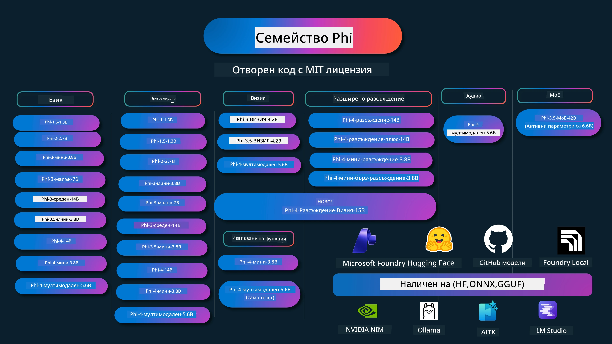

# Рецептурник Phi: Практически примери с Phi моделите на Microsoft

[](https://codespaces.new/microsoft/phicookbook)
[](https://vscode.dev/redirect?url=vscode://ms-vscode-remote.remote-containers/cloneInVolume?url=https://github.com/microsoft/phicookbook)

[](https://GitHub.com/microsoft/phicookbook/graphs/contributors/?WT.mc_id=aiml-137032-kinfeylo)
[](https://GitHub.com/microsoft/phicookbook/issues/?WT.mc_id=aiml-137032-kinfeylo)
[](https://GitHub.com/microsoft/phicookbook/pulls/?WT.mc_id=aiml-137032-kinfeylo)
[](http://makeapullrequest.com?WT.mc_id=aiml-137032-kinfeylo)

[](https://GitHub.com/microsoft/phicookbook/watchers/?WT.mc_id=aiml-137032-kinfeylo)
[](https://GitHub.com/microsoft/phicookbook/network/?WT.mc_id=aiml-137032-kinfeylo)
[](https://GitHub.com/microsoft/phicookbook/stargazers/?WT.mc_id=aiml-137032-kinfeylo)

[](https://discord.com/invite/ByRwuEEgH4)

Phi е серия от отворени AI модели, разработени от Microsoft.

В момента Phi е най-мощният и икономичен малък езиков модел (SLM), с много добри показатели в многоезични, логически, текстови/чат генериращи, кодиращи, изображения, аудио и други сценарии.

Можете да разположите Phi в облака или на крайни устройства, и лесно да изграждате генеративни AI приложения с ограничени изчислителни ресурси.

Следвайте тези стъпки, за да започнете да използвате тези ресурси:
1. **Форкирайте хранилището**: Натиснете [](https://GitHub.com/microsoft/phicookbook/network/?WT.mc_id=aiml-137032-kinfeylo)
2. **Клонирайте хранилището**: `git clone https://github.com/microsoft/PhiCookBook.git`
3. [**Присъединете се към Discord общността на Microsoft AI и срещнете експерти и други разработчици**](https://discord.com/invite/ByRwuEEgH4?WT.mc_id=aiml-137032-kinfeylo)



### 🌐 Многоезична поддръжка

#### Поддържана чрез GitHub Action (Автоматизирано и винаги актуално)

<!-- CO-OP TRANSLATOR LANGUAGES TABLE START -->
[Арабски](../ar/README.md) | [Бенгалски](../bn/README.md) | [Български](./README.md) | [Бирмански (Мианмар)](../my/README.md) | [Китайски (опростен)](../zh-CN/README.md) | [Китайски (традиционен, Хонг Конг)](../zh-HK/README.md) | [Китайски (традиционен, Макао)](../zh-MO/README.md) | [Китайски (традиционен, Тайван)](../zh-TW/README.md) | [Хърватски](../hr/README.md) | [Чешки](../cs/README.md) | [Датски](../da/README.md) | [Холандски](../nl/README.md) | [Естонски](../et/README.md) | [Фински](../fi/README.md) | [Френски](../fr/README.md) | [Немски](../de/README.md) | [Гръцки](../el/README.md) | [Иврит](../he/README.md) | [Хинди](../hi/README.md) | [Унгарски](../hu/README.md) | [Индонезийски](../id/README.md) | [Италиански](../it/README.md) | [Японски](../ja/README.md) | [Каннада](../kn/README.md) | [Кхмер](../km/README.md) | [Корейски](../ko/README.md) | [Литовски](../lt/README.md) | [Малайски](../ms/README.md) | [Малаялам](../ml/README.md) | [Маратхи](../mr/README.md) | [Непалски](../ne/README.md) | [Нигерийски пиджин](../pcm/README.md) | [Норвежки](../no/README.md) | [Персийски (фарси)](../fa/README.md) | [Полски](../pl/README.md) | [Португалски (Бразилия)](../pt-BR/README.md) | [Португалски (Португалия)](../pt-PT/README.md) | [Пенджабски (гурмукхи)](../pa/README.md) | [Румънски](../ro/README.md) | [Руски](../ru/README.md) | [Сръбски (кирилица)](../sr/README.md) | [Словашки](../sk/README.md) | [Словенски](../sl/README.md) | [Испански](../es/README.md) | [Суахили](../sw/README.md) | [Шведски](../sv/README.md) | [Тагалог (Филипински)](../tl/README.md) | [Тамилски](../ta/README.md) | [Телугу](../te/README.md) | [Тайски](../th/README.md) | [Турски](../tr/README.md) | [Украински](../uk/README.md) | [Урду](../ur/README.md) | [Виетнамски](../vi/README.md)

> **Предпочитате да клонирате локално?**
>
> Това хранилище включва над 50 езикови превода, което значително увеличава размера за сваляне. За да клонирате без преводи, използвайте sparse checkout:
>
> **Bash / macOS / Linux:**
> ```bash
> git clone --filter=blob:none --sparse https://github.com/microsoft/PhiCookBook.git
> cd PhiCookBook
> git sparse-checkout set --no-cone '/*' '!translations' '!translated_images'
> ```
>
> **CMD (Windows):**
> ```cmd
> git clone --filter=blob:none --sparse https://github.com/microsoft/PhiCookBook.git
> cd PhiCookBook
> git sparse-checkout set --no-cone "/*" "!translations" "!translated_images"
> ```
>
> Това ви дава всичко необходимо за завършване на курса с много по-бързо сваляне.
<!-- CO-OP TRANSLATOR LANGUAGES TABLE END -->

## Съдържание

- Въведение
  - [Добре дошли във фамилията Phi](./md/01.Introduction/01/01.PhiFamily.md)
  - [Настройване на вашата среда](./md/01.Introduction/01/01.EnvironmentSetup.md)
  - [Разбиране на ключови технологии](./md/01.Introduction/01/01.Understandingtech.md)
  - [AI безопасност за Phi модели](./md/01.Introduction/01/01.AISafety.md)
  - [Поддръжка на хардуер Phi](./md/01.Introduction/01/01.Hardwaresupport.md)
  - [Phi модели и наличност на платформи](./md/01.Introduction/01/01.Edgeandcloud.md)
  - [Използване на Guidance-ai и Phi](./md/01.Introduction/01/01.Guidance.md)
  - [GitHub Marketplace модели](https://github.com/marketplace/models)
  - [Каталог на Azure AI модели](https://ai.azure.com)

- Инференция на Phi в различни среди
    -  [Hugging face](./md/01.Introduction/02/01.HF.md)
    -  [GitHub модели](./md/01.Introduction/02/02.GitHubModel.md)
    -  [Каталог Microsoft Foundry Model](./md/01.Introduction/02/03.AzureAIFoundry.md)
    -  [Ollama](./md/01.Introduction/02/04.Ollama.md)
    -  [AI Toolkit VSCode (AITK)](./md/01.Introduction/02/05.AITK.md)
    -  [NVIDIA NIM](./md/01.Introduction/02/06.NVIDIA.md)
    -  [Foundry Local](./md/01.Introduction/02/07.FoundryLocal.md)

- Инференция Phi фамилия
    - [Инференция Phi в iOS](./md/01.Introduction/03/iOS_Inference.md)
    - [Инференция Phi в Android](./md/01.Introduction/03/Android_Inference.md)
    - [Инференция Phi в Jetson](./md/01.Introduction/03/Jetson_Inference.md)
    - [Инференция Phi в AI PC](./md/01.Introduction/03/AIPC_Inference.md)
    - [Инференция Phi с Apple MLX Framework](./md/01.Introduction/03/MLX_Inference.md)
    - [Инференция Phi в локален сървър](./md/01.Introduction/03/Local_Server_Inference.md)
    - [Инференция Phi в отдалечен сървър с AI Toolkit](./md/01.Introduction/03/Remote_Interence.md)
    - [Инференция Phi с Rust](./md/01.Introduction/03/Rust_Inference.md)
    - [Инференция Phi - Vision локално](./md/01.Introduction/03/Vision_Inference.md)
    - [Инференция Phi с Kaito AKS, Azure Контейнери (официална поддръжка)](./md/01.Introduction/03/Kaito_Inference.md)
-  [Квантоване Phi фамилия](./md/01.Introduction/04/QuantifyingPhi.md)
    - [Квантоване Phi-3.5 / 4 с llama.cpp](./md/01.Introduction/04/UsingLlamacppQuantifyingPhi.md)
    - [Квантоване Phi-3.5 / 4 с разширения за генеративен AI за onnxruntime](./md/01.Introduction/04/UsingORTGenAIQuantifyingPhi.md)
    - [Квантоване Phi-3.5 / 4 с Intel OpenVINO](./md/01.Introduction/04/UsingIntelOpenVINOQuantifyingPhi.md)
    - [Квантоване Phi-3.5 / 4 с Apple MLX Framework](./md/01.Introduction/04/UsingAppleMLXQuantifyingPhi.md)

-  Оценка Phi
    - [Отговорствен AI](./md/01.Introduction/05/ResponsibleAI.md)
    - [Microsoft Foundry за оценка](./md/01.Introduction/05/AIFoundry.md)
    - [Използване на Promptflow за оценка](./md/01.Introduction/05/Promptflow.md)
 
- RAG с Azure AI Търсене
    - [Как да използваме Phi-4-mini и Phi-4-мултимодален (RAG) с Azure AI Търсене](https://github.com/microsoft/PhiCookBook/blob/main/code/06.E2E/E2E_Phi-4-RAG-Azure-AI-Search.ipynb)

- Примери за разработка на приложения с Phi
  - Текстови и чат приложения
    - Примери Phi-4
      - [📓] [Чат с Phi-4-mini ONNX модел](./md/02.Application/01.TextAndChat/Phi4/ChatWithPhi4ONNX/README.md)
      - [Чат с Phi-4 локален ONNX модел на .NET](../../md/04.HOL/dotnet/src/LabsPhi4-Chat-01OnnxRuntime)
      - [Чат .NET конзолно приложение с Phi-4 ONNX използвайки Semantic Kernel](../../md/04.HOL/dotnet/src/LabsPhi4-Chat-02SK)
    - Примери Phi-3 / 3.5
      - [Локален чатбот в браузър с Phi3, ONNX Runtime Web и WebGPU](https://github.com/microsoft/onnxruntime-inference-examples/tree/main/js/chat)
      - [OpenVino Chat](./md/02.Application/01.TextAndChat/Phi3/E2E_OpenVino_Chat.md)
      - [Мулти Модел - Интерактивен Phi-3-mini и OpenAI Whisper](./md/02.Application/01.TextAndChat/Phi3/E2E_Phi-3-mini_with_whisper.md)
      - [MLFlow - Създаване на обвивка и използване на Phi-3 с MLFlow](./md//02.Application/01.TextAndChat/Phi3/E2E_Phi-3-MLflow.md)
      - [Оптимизация на модел - Как да оптимизирате модел Phi-3-min за ONNX Runtime Web с Olive](https://github.com/microsoft/Olive/tree/main/examples/phi3)
      - [WinUI3 приложение с Phi-3 mini-4k-instruct-onnx](https://github.com/microsoft/Phi3-Chat-WinUI3-Sample/)
      -[WinUI3 Мулти Модел AI Захранван Пример за Бележки приложение](https://github.com/microsoft/ai-powered-notes-winui3-sample)
      - [Фина настройка и интеграция на персонализирани Phi-3 модели с Prompt flow](./md/02.Application/01.TextAndChat/Phi3/E2E_Phi-3-FineTuning_PromptFlow_Integration.md)
      - [Фина настройка и интеграция на персонализирани Phi-3 модели с Prompt flow в Microsoft Foundry](./md/02.Application/01.TextAndChat/Phi3/E2E_Phi-3-FineTuning_PromptFlow_Integration_AIFoundry.md)
      - [Оценка на фината настройка на Phi-3 / Phi-3.5 модел в Microsoft Foundry с акцент върху отговорните принципи на AI на Microsoft](./md/02.Application/01.TextAndChat/Phi3/E2E_Phi-3-Evaluation_AIFoundry.md)
      - [📓] [Phi-3.5-mini-instruct пример за предсказване на език (китайски/английски)](./md/02.Application/01.TextAndChat/Phi3/phi3-instruct-demo.ipynb)
      - [Phi-3.5-Instruct WebGPU RAG чатбот](./md/02.Application/01.TextAndChat/Phi3/WebGPUWithPhi35Readme.md)
      - [Използване на Windows GPU за създаване на Prompt flow решение с Phi-3.5-Instruct ONNX](./md/02.Application/01.TextAndChat/Phi3/UsingPromptFlowWithONNX.md)
      - [Използване на Microsoft Phi-3.5 tflite за създаване на Android приложение](./md/02.Application/01.TextAndChat/Phi3/UsingPhi35TFLiteCreateAndroidApp.md)
      - [Въпроси и отговори .NET пример използващ локален ONNX Phi-3 модел с Microsoft.ML.OnnxRuntime](../../md/04.HOL/dotnet/src/LabsPhi301)
      - [Конзолно чат .NET приложение с Semantic Kernel и Phi-3](../../md/04.HOL/dotnet/src/LabsPhi302)

  - Примери за код с Azure AI Inference SDK
    - Примери Phi-4
      - [📓] [Генериране на код на проект използвайки Phi-4-multimodal](./md/02.Application/02.Code/Phi4/GenProjectCode/README.md)
    - Примери Phi-3 / 3.5
      - [Създайте собствен Visual Studio Code GitHub Copilot Chat с Microsoft Phi-3 Семейство](./md/02.Application/02.Code/Phi3/VSCodeExt/README.md)
      - [Създаване на собствен Visual Studio Code Chat Copilot агент с Phi-3.5 чрез GitHub модели](/md/02.Application/02.Code/Phi3/CreateVSCodeChatAgentWithGitHubModels.md)

  - Примери за разширено разсъждение
    - Примери Phi-4
      - [📓] [Phi-4-mini-reasoning или Phi-4-reasoning примери](./md/02.Application/03.AdvancedReasoning/Phi4/AdvancedResoningPhi4mini/README.md)
      - [📓] [Фина настройка на Phi-4-mini-reasoning с Microsoft Olive](./md/02.Application/03.AdvancedReasoning/Phi4/AdvancedResoningPhi4mini/olive_ft_phi_4_reasoning_with_medicaldata.ipynb)
      - [📓] [Фина настройка на Phi-4-mini-reasoning с Apple MLX](./md/02.Application/03.AdvancedReasoning/Phi4/AdvancedResoningPhi4mini/mlx_ft_phi_4_reasoning_with_medicaldata.ipynb)
      - [📓] [Phi-4-mini-reasoning с GitHub Модели](./md/02.Application/02.Code/Phi4r/github_models_inference.ipynb)
      - [📓] [Phi-4-mini-reasoning с Microsoft Foundry Модели](./md/02.Application/02.Code/Phi4r/azure_models_inference.ipynb)
  - Демонстрации
      - [Phi-4-mini демонстрации хоствани на Hugging Face Spaces](https://huggingface.co/spaces/microsoft/phi-4-mini?WT.mc_id=aiml-137032-kinfeylo)
      - [Phi-4-multimodal демонстрации хоствани на Hugging Face Spaces](https://huggingface.co/spaces/microsoft/phi-4-multimodal?WT.mc_id=aiml-137032-kinfeylo)
  - Примери за визия
    - Примери Phi-4
      - [📓] [Използване на Phi-4-multimodal за четене на изображения и генериране на код](./md/02.Application/04.Vision/Phi4/CreateFrontend/README.md) 
    - Примери Phi-3 / 3.5
      -  [📓][Phi-3-видение - превод от текст на изображение към текст](./md/02.Application/04.Vision/Phi3/E2E_Phi-3-vision-image-text-to-text-online-endpoint.ipynb)
      - [Phi-3-видение-ONNX](https://onnxruntime.ai/docs/genai/tutorials/phi3-v.html)
      - [📓][Phi-3-видение CLIP Вграждане](./md/02.Application/04.Vision/Phi3/E2E_Phi-3-vision-image-text-to-text-online-endpoint.ipynb)
      - [ДЕМО: Phi-3 Рециклиране](https://github.com/jennifermarsman/PhiRecycling/)
      - [Phi-3-видение - Визуален езиков асистент - с Phi3-Vision и OpenVINO](https://docs.openvino.ai/nightly/notebooks/phi-3-vision-with-output.html)
      - [Phi-3 Vision Nvidia NIM](./md/02.Application/04.Vision/Phi3/E2E_Nvidia_NIM_Vision.md)
      - [Phi-3 Vision OpenVino](./md/02.Application/04.Vision/Phi3/E2E_OpenVino_Phi3Vision.md)
      - [📓][Phi-3.5 Видение мулти-фрейм или мулти-изображение пример](./md/02.Application/04.Vision/Phi3/phi3-vision-demo.ipynb)
      - [Phi-3 Vision локален ONNX модел с Microsoft.ML.OnnxRuntime .NET](../../md/04.HOL/dotnet/src/LabsPhi303)
      - [Меню базиран Phi-3 Vision локален ONNX модел с Microsoft.ML.OnnxRuntime .NET](../../md/04.HOL/dotnet/src/LabsPhi304)

  - Примери за разсъждение с визия
    - Phi-4-Reasoning-Vision-15B
      - [📓] [Използване на Phi-4-Reasoning-Vision-15B за детекция на jaywalking](./md/02.Application/10.ReasoningVision/Phi_4_reasoning_vision_15b_Jaywalking.ipynb)
      - [📓] [Използване на Phi-4-Reasoning-Vision-15B за математика](./md/02.Application/10.ReasoningVision/Phi_4_reasoning_vision_15b_Math.ipynb)
      - [📓] [Използване на Phi-4-Reasoning-Vision-15B за детекция на UI](./md/02.Application/10.ReasoningVision/Phi_4_reasoning_vision_15b_ui.ipynb)

  - Примери за математика
    - Phi-4-Mini-Flash-Reasoning-Instruct Примери [Демонстрация на математика с Phi-4-Mini-Flash-Reasoning-Instruct](./md/02.Application/09.Math/MathDemo.ipynb)

  - Примери за аудио
    - Примери Phi-4
      - [📓] [Извличане на аудио транскрипции с Phi-4-multimodal](./md/02.Application/05.Audio/Phi4/Transciption/README.md)
      - [📓] [Phi-4-multimodal аудио пример](./md/02.Application/05.Audio/Phi4/Siri/demo.ipynb)
      - [📓] [Phi-4-multimodal пример за превод на реч](./md/02.Application/05.Audio/Phi4/Translate/demo.ipynb)
      - [.NET конзолно приложение използващо Phi-4-multimodal аудио за анализ на аудио файл и генериране на транскрипция](../../md/04.HOL/dotnet/src/LabsPhi4-MultiModal-02Audio)

  - Примери за MOE
    - Примери Phi-3 / 3.5
      - [📓] [Phi-3.5 смес от експерти (MoEs) пример с социални медии](./md/02.Application/06.MoE/Phi3/phi3_moe_demo.ipynb)
      - [📓] [Създаване на Retrieval-Augmented Generation (RAG) pipeline с NVIDIA NIM Phi-3 MOE, Azure AI Search и LlamaIndex](./md/02.Application/06.MoE/Phi3/azure-ai-search-nvidia-rag.ipynb)
      - 
  - Примери за повикване на функции
    - Примери Phi-4 🆕
      -  [📓] [Използване на Function Calling с Phi-4-mini](./md/02.Application/07.FunctionCalling/Phi4/FunctionCallingBasic/README.md)
      -  [📓] [Използване на Function Calling за създаване на мулти-агенти с Phi-4-mini](./md/02.Application/07.FunctionCalling/Phi4/Multiagents/Phi_4_mini_multiagent.ipynb)
      -  [📓] [Използване на Function Calling с Ollama](./md/02.Application/07.FunctionCalling/Phi4/Ollama/ollama_functioncalling.ipynb)
      -  [📓] [Използване на Function Calling с ONNX](./md/02.Application/07.FunctionCalling/Phi4/ONNX/onnx_parallel_functioncalling.ipynb)
  - Примери за мултимодално смесване
    - Примери Phi-4 🆕
      -  [📓] [Използване на Phi-4-multimodal като технологичен журналист](./md/02.Application/08.Multimodel/Phi4/TechJournalist/phi_4_mm_audio_text_publish_news.ipynb)
      - [.NET конзолно приложение използващо Phi-4-multimodal за анализ на изображения](../../md/04.HOL/dotnet/src/LabsPhi4-MultiModal-01Images)

- Фина настройка на Phi Примери
  - [Сценарии за фина настройка](./md/03.FineTuning/FineTuning_Scenarios.md)
  - [Фина настройка срещу RAG](./md/03.FineTuning/FineTuning_vs_RAG.md)
  - [Фина настройка: Нека Phi-3 стане индустриален експерт](./md/03.FineTuning/LetPhi3gotoIndustriy.md)
  - [Фина настройка на Phi-3 с AI Toolkit за VS Code](./md/03.FineTuning/Finetuning_VSCodeaitoolkit.md)
  - [Фина настройка на Phi-3 с Azure Machine Learning Service](./md/03.FineTuning/Introduce_AzureML.md)
  - [Фина настройка на Phi-3 с Lora](./md/03.FineTuning/FineTuning_Lora.md)
  - [Фина настройка на Phi-3 с QLora](./md/03.FineTuning/FineTuning_Qlora.md)
  - [Фина настройка на Phi-3 с Microsoft Foundry](./md/03.FineTuning/FineTuning_AIFoundry.md)
  - [Фина настройка на Phi-3 с Azure ML CLI/SDK](./md/03.FineTuning/FineTuning_MLSDK.md)
  - [Фина настройка с Microsoft Olive](./md/03.FineTuning/FineTuning_MicrosoftOlive.md)
  - [Практическа лаборатория за фина настройка с Microsoft Olive](./md/03.FineTuning/olive-lab/readme.md)
  - [Фина настройка на Phi-3-vision с Weights and Bias](./md/03.FineTuning/FineTuning_Phi-3-visionWandB.md)
  - [Фина настройка на Phi-3 с Apple MLX Framework](./md/03.FineTuning/FineTuning_MLX.md)
  - [Фина настройка на Phi-3-vision (официална поддръжка)](./md/03.FineTuning/FineTuning_Vision.md)
  - [Фино настройване на Phi-3 с Kaito AKS, Azure контейнери (официална поддръжка)](./md/03.FineTuning/FineTuning_Kaito.md)
  - [Фино настройване на Phi-3 и 3.5 Vision](https://github.com/2U1/Phi3-Vision-Finetune)

- Практически лабораторен курс
  - [Изследване на най-съвременните модели: LLM, SLM, локална разработка и още](https://github.com/microsoft/aitour-exploring-cutting-edge-models)
  - [Отваряне на потенциала на NLP: Фино настройване с Microsoft Olive](https://github.com/azure/Ignite_FineTuning_workshop)

- Академични изследователски статии и публикации
  - [Учебници са всичко, от което се нуждаете II: технически доклад phi-1.5](https://arxiv.org/abs/2309.05463)
  - [Технически доклад Phi-3: Високо способен езиков модел локално на вашия телефон](https://arxiv.org/abs/2404.14219)
  - [Технически доклад Phi-4](https://arxiv.org/abs/2412.08905)
  - [Технически доклад Phi-4-Mini: Компактни, но мощни мултимодални езикови модели чрез Mixture-of-LoRAs](https://arxiv.org/abs/2503.01743)
  - [Оптимизиране на малки езикови модели за извикване на функции в автомобил](https://arxiv.org/abs/2501.02342)
  - [(WhyPHI) Фино настройване на PHI-3 за отговор на въпроси с множествен избор: методология, резултати и предизвикателства](https://arxiv.org/abs/2501.01588)
  - [Технически доклад Phi-4-reasoning](https://www.microsoft.com/en-us/research/wp-content/uploads/2025/04/phi_4_reasoning.pdf)
  - [Технически доклад Phi-4-mini-reasoning](https://huggingface.co/microsoft/Phi-4-mini-reasoning/blob/main/Phi-4-Mini-Reasoning.pdf)

## Използване на Phi модели

### Phi в Microsoft Foundry

Можете да научите как да използвате Microsoft Phi и как да изграждате крайни края решения на различни хардуерни устройства. За да изпитате Phi лично, започнете с експериментиране с моделите и персонализиране на Phi за вашите сценарии, като използвате [Microsoft Foundry Azure AI Model Catalog](https://aka.ms/phi3-azure-ai). Можете да научите повече от Ръководството за започване с [Microsoft Foundry](/md/02.QuickStart/AzureAIFoundry_QuickStart.md)

**Пясъчник**
Всеки модел има специален пясъчник, където можете да тествате модела в [Azure AI Playground](https://aka.ms/try-phi3).

### Phi в GitHub модели

Можете да научите как да използвате Microsoft Phi и как да изграждате крайно решения на различни хардуерни устройства. За да изпитате Phi лично, започнете с експериментиране с модела и персонализиране на Phi за вашите сценарии, като използвате [GitHub Model Catalog](https://github.com/marketplace/models?WT.mc_id=aiml-137032-kinfeylo). Можете да научите повече от Ръководството за започване с [GitHub Model Catalog](/md/02.QuickStart/GitHubModel_QuickStart.md)

**Пясъчник**
Всеки модел има специален [пясъчник за тестване](/md/02.QuickStart/GitHubModel_QuickStart.md).

### Phi в Hugging Face

Моделът също може да бъде намерен в [Hugging Face](https://huggingface.co/microsoft)

**Пясъчник**
[Hugging Chat пясъчник](https://huggingface.co/chat/models/microsoft/Phi-3-mini-4k-instruct)

## 🎒 Други курсове

Нашият екип произвежда и други курсове! Разгледайте:

<!-- CO-OP TRANSLATOR OTHER COURSES START -->
### LangChain
[](https://aka.ms/langchain4j-for-beginners)
[](https://aka.ms/langchainjs-for-beginners?WT.mc_id=m365-94501-dwahlin)
[](https://github.com/microsoft/langchain-for-beginners?WT.mc_id=m365-94501-dwahlin)
---

### Azure / Edge / MCP / Агенти
[](https://github.com/microsoft/AZD-for-beginners?WT.mc_id=academic-105485-koreyst)
[](https://github.com/microsoft/edgeai-for-beginners?WT.mc_id=academic-105485-koreyst)
[](https://github.com/microsoft/mcp-for-beginners?WT.mc_id=academic-105485-koreyst)
[](https://github.com/microsoft/ai-agents-for-beginners?WT.mc_id=academic-105485-koreyst)

---
 
### Серия за генеративен AI
[](https://github.com/microsoft/generative-ai-for-beginners?WT.mc_id=academic-105485-koreyst)
[-9333EA?style=for-the-badge&labelColor=E5E7EB&color=9333EA)](https://github.com/microsoft/Generative-AI-for-beginners-dotnet?WT.mc_id=academic-105485-koreyst)
[-C084FC?style=for-the-badge&labelColor=E5E7EB&color=C084FC)](https://github.com/microsoft/generative-ai-for-beginners-java?WT.mc_id=academic-105485-koreyst)
[-E879F9?style=for-the-badge&labelColor=E5E7EB&color=E879F9)](https://github.com/microsoft/generative-ai-with-javascript?WT.mc_id=academic-105485-koreyst)

---
 
### Основно обучение
[](https://aka.ms/ml-beginners?WT.mc_id=academic-105485-koreyst)
[](https://aka.ms/datascience-beginners?WT.mc_id=academic-105485-koreyst)
[](https://aka.ms/ai-beginners?WT.mc_id=academic-105485-koreyst)
[](https://github.com/microsoft/Security-101?WT.mc_id=academic-96948-sayoung)
[](https://aka.ms/webdev-beginners?WT.mc_id=academic-105485-koreyst)
[](https://aka.ms/iot-beginners?WT.mc_id=academic-105485-koreyst)
[](https://github.com/microsoft/xr-development-for-beginners?WT.mc_id=academic-105485-koreyst)

---
 
### Серия Copilot
[](https://aka.ms/GitHubCopilotAI?WT.mc_id=academic-105485-koreyst)
[](https://github.com/microsoft/mastering-github-copilot-for-dotnet-csharp-developers?WT.mc_id=academic-105485-koreyst)
[](https://github.com/microsoft/CopilotAdventures?WT.mc_id=academic-105485-koreyst)
<!-- CO-OP TRANSLATOR OTHER COURSES END -->

## Отговорен AI

Microsoft е ангажиран да помага на клиентите си да използват AI продуктите ни отговорно, споделяйки нашите знания и изграждайки партньорства базирани на доверие чрез инструменти като Transparency Notes и Impact Assessments. Много от тези ресурси могат да бъдат намерени на [https://aka.ms/RAI](https://aka.ms/RAI).
Подходът на Microsoft към отговорния AI се основава на нашите AI принципи за справедливост, надеждност и безопасност, поверителност и сигурност, приобщаване, прозрачност и отчетност.

Големи модели за естествен език, изображения и реч — като тези, използвани в този пример — потенциално могат да се държат несправедливо, ненадеждно или обидно, причинявайки вреди. Моля, прегледайте [Azure OpenAI service Transparency note](https://learn.microsoft.com/legal/cognitive-services/openai/transparency-note?tabs=text), за да бъдете информирани за рисковете и ограниченията.
Препоръчителният подход за намаляване на тези рискове е да включите система за безопасност във вашата архитектура, която може да открива и предотвратява вредно поведение. [Azure AI Content Safety](https://learn.microsoft.com/azure/ai-services/content-safety/overview) предоставя независим слой на защита, който може да открива вредно съдържание, генерирано от потребители и AI, в приложения и услуги. Azure AI Content Safety включва текстови и графични API, които ви позволяват да откривате материал, който е вреден. В Microsoft Foundry, услугата Content Safety ви позволява да преглеждате, изследвате и изпробвате примерен код за откриване на вредно съдържание в различни модалности. Следващата [документация за бърз старт](https://learn.microsoft.com/azure/ai-services/content-safety/quickstart-text?tabs=visual-studio%2Clinux&pivots=programming-language-rest) ви насочва през процеса на изпращане на заявки към услугата.

Друг аспект, който трябва да се вземе предвид, е цялостната производителност на приложението. При мултимодални и мултимоделни приложения, считаме производителността за това, че системата работи както вие и вашите потребители очаквате, включително и да не генерира вредни изходи. Важно е да оцените производителността на вашето цялостно приложение, използвайки [оценители за производителност, качество, риск и безопасност](https://learn.microsoft.com/azure/ai-studio/concepts/evaluation-metrics-built-in). Също така имате възможност да създавате и оценявате с [персонализирани оценители](https://learn.microsoft.com/azure/ai-studio/how-to/develop/evaluate-sdk#custom-evaluators).

Можете да оцените вашето AI приложение в средата за разработка, използвайки [Azure AI Evaluation SDK](https://microsoft.github.io/promptflow/index.html). След предоставяне на тестов набор от данни или цел, генерирането на вашето генеративно AI приложение се измерва количествено с вградени оценители или персонализирани оценители по ваш избор. За да започнете с azure ai evaluation sdk за оценка на вашата система, можете да следвате [ръководството за бърз старт](https://learn.microsoft.com/azure/ai-studio/how-to/develop/flow-evaluate-sdk). След като изпълните оценъчно изпълнение, можете да [визуализирате резултатите в Microsoft Foundry](https://learn.microsoft.com/azure/ai-studio/how-to/evaluate-flow-results).

## Търговски марки

Този проект може да съдържа търговски марки или лога за проекти, продукти или услуги. Употребата на търговски марки или лога на Microsoft е разрешена и подлежи на спазване на [Правилата за търговски марки и бранд на Microsoft](https://www.microsoft.com/legal/intellectualproperty/trademarks/usage/general).
Използването на търговски марки или лога на Microsoft в модифицирани версии на този проект не трябва да предизвиква объркване или да подразбира спонсорство на Microsoft. Всяко използване на търговски марки или лога на трети страни подлежи на политиките на тези трети страни.

## Получаване на помощ

Ако срещнете затруднения или имате въпроси относно създаването на AI приложения, присъединете се към:

[](https://aka.ms/foundry/discord)

Ако имате обратна връзка за продукта или грешки по време на разработка, посетете:

[](https://aka.ms/foundry/forum)

---

<!-- CO-OP TRANSLATOR DISCLAIMER START -->
**Отказ от отговорност**:  
Този документ е преведен с помощта на AI преводаческа услуга [Co-op Translator](https://github.com/Azure/co-op-translator). Въпреки че се стремим към точност, моля, имайте предвид, че автоматизираните преводи могат да съдържат грешки или неточности. Оригиналният документ на неговия първичен език трябва да се счита за авторитетен източник. За критична информация се препоръчва професионален човешки превод. Не носим отговорност за никакви недоразумения или неправилни интерпретации, произтичащи от използването на този превод.
<!-- CO-OP TRANSLATOR DISCLAIMER END -->