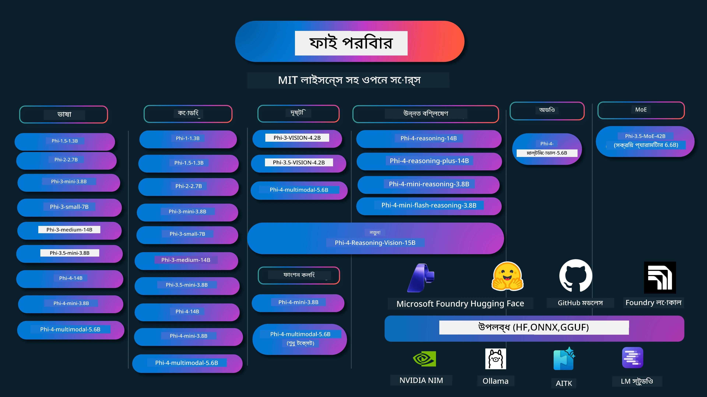

# Phi কুকবুক: মাইক্রোসফটের Phi মডেল নিয়ে হাতে কলমে উদাহরণ

[](https://codespaces.new/microsoft/phicookbook)
[](https://vscode.dev/redirect?url=vscode://ms-vscode-remote.remote-containers/cloneInVolume?url=https://github.com/microsoft/phicookbook)

[](https://GitHub.com/microsoft/phicookbook/graphs/contributors/?WT.mc_id=aiml-137032-kinfeylo)
[](https://GitHub.com/microsoft/phicookbook/issues/?WT.mc_id=aiml-137032-kinfeylo)
[](https://GitHub.com/microsoft/phicookbook/pulls/?WT.mc_id=aiml-137032-kinfeylo)
[](http://makeapullrequest.com?WT.mc_id=aiml-137032-kinfeylo)

[](https://GitHub.com/microsoft/phicookbook/watchers/?WT.mc_id=aiml-137032-kinfeylo)
[](https://GitHub.com/microsoft/phicookbook/network/?WT.mc_id=aiml-137032-kinfeylo)
[](https://GitHub.com/microsoft/phicookbook/stargazers/?WT.mc_id=aiml-137032-kinfeylo)

[](https://discord.com/invite/ByRwuEEgH4)

Phi হলো মাইক্রোসফট কর্তৃক উন্নত একটি সিরিজ ওপেন সোর্স এআই মডেল। 

Phi বর্তমানে সবচেয়ে শক্তিশালী এবং খরচ-সাশ্রয়ী ছোট ভাষার মডেল (SLM), যার মাল্টি-ল্যাঙ্গুয়েজ, যুক্তি, টেক্সট/চ্যাট জেনারেশন, কোডিং, ইমেজ, অডিও এবং অন্যান্য ক্ষেত্রে খুব ভালো বেঞ্চমার্ক রয়েছে। 

আপনি Phi কে ক্লাউডে বা এজ ডিভাইসে স্থাপন করতে পারেন, এবং সীমিত কম্পিউটিং শক্তি দিয়ে সহজেই জেনারেটিভ এআই অ্যাপ্লিকেশন তৈরি করতে পারেন।

এই রিসোর্সগুলি ব্যবহার শুরু করার জন্য নিচের ধাপগুলি অনুসরণ করুন:
1. **রিপোজিটরি ফর্ক করুন**: ক্লিক করুন [](https://GitHub.com/microsoft/phicookbook/network/?WT.mc_id=aiml-137032-kinfeylo)
2. **রিপোজিটরি ক্লোন করুন**: `git clone https://github.com/microsoft/PhiCookBook.git`
3. [**মাইক্রোসফট AI ডিকর্ড কমিউনিটিতে যোগ দিন এবং বিশেষজ্ঞ ও অন্যান্য ডেভেলপারদের সাথে পরিচিত হন**](https://discord.com/invite/ByRwuEEgH4?WT.mc_id=aiml-137032-kinfeylo)



### 🌐 বহু-ভাষার সমর্থন

#### GitHub অ্যাকশনের মাধ্যমে সমর্থিত (স্বয়ংক্রিয় ও সর্বদা আপ-টু-ডেট)

<!-- CO-OP TRANSLATOR LANGUAGES TABLE START -->
[Arabic](../ar/README.md) | [বাংলা](./README.md) | [বুলগেরিয়ান](../bg/README.md) | [বর্মি (মায়ানমার)](../my/README.md) | [চীনা (সহজীকৃত)](../zh-CN/README.md) | [চীনা (প্রথাগত, হংকং)](../zh-HK/README.md) | [চীনা (প্রথাগত, ম্যাকাও)](../zh-MO/README.md) | [চীনা (প্রথাগত, তাইওয়ান)](../zh-TW/README.md) | [ক্রোয়েশীয়](../hr/README.md) | [চেক](../cs/README.md) | [ড্যানিশ](../da/README.md) | [ডাচ](../nl/README.md) | [এস্তোনিয়ান](../et/README.md) | [ফিনিশ](../fi/README.md) | [ফরাসি](../fr/README.md) | [জার্মান](../de/README.md) | [গ্রিক](../el/README.md) | [হিব্রু](../he/README.md) | [হিন্দি](../hi/README.md) | [হাঙ্গেরিয়ান](../hu/README.md) | [ইন্দোনেশিয়ান](../id/README.md) | [ইতালিয়ান](../it/README.md) | [জাপানি](../ja/README.md) | [কন্নড়](../kn/README.md) | [কোরিয়ান](../ko/README.md) | [লিথুয়ানিয়ান](../lt/README.md) | [মালয়](../ms/README.md) | [মালয়ালাম](../ml/README.md) | [মরাঠি](../mr/README.md) | [নেপালি](../ne/README.md) | [নাইজেরিয়ান পিডগিন](../pcm/README.md) | [নরওয়েজিয়ান](../no/README.md) | [ফার্সি](../fa/README.md) | [পোলিশ](../pl/README.md) | [পর্তুগিজ (ব্রাজিল)](../pt-BR/README.md) | [পর্তুগিজ (পর্তুগাল)](../pt-PT/README.md) | [পাঞ্জাবি (গুরমুখী)](../pa/README.md) | [রোমানিয়ান](../ro/README.md) | [রাশিয়ান](../ru/README.md) | [সার্বিয়ান (সিরিলিক)](../sr/README.md) | [স্লোভাক](../sk/README.md) | [স্লোভেনীয়](../sl/README.md) | [স্প্যানিশ](../es/README.md) | [সোয়াহিলি](../sw/README.md) | [সুইডিশ](../sv/README.md) | [টাগালগ (ফিলিপিনো)](../tl/README.md) | [তামিল](../ta/README.md) | [তেলুগু](../te/README.md) | [থাই](../th/README.md) | [তুর্কি](../tr/README.md) | [ইউক্রেনীয়](../uk/README.md) | [উর্দু](../ur/README.md) | [ভিয়েতনামী](../vi/README.md)

> **লোকালি ক্লোন করতে চান?**
>
> এই রিপোজিটরিতে ৫০+ ভাষার অনুবাদ রয়েছে যা ডাউনলোড সাইজ অনেক বাড়িয়ে দেয়। অনুবাদ বাদ দিয়ে ক্লোন করতে স্পার্স চেক আউট ব্যবহার করুন:
>
> **Bash / macOS / Linux:**
> ```bash
> git clone --filter=blob:none --sparse https://github.com/microsoft/PhiCookBook.git
> cd PhiCookBook
> git sparse-checkout set --no-cone '/*' '!translations' '!translated_images'
> ```
>
> **CMD (Windows):**
> ```cmd
> git clone --filter=blob:none --sparse https://github.com/microsoft/PhiCookBook.git
> cd PhiCookBook
> git sparse-checkout set --no-cone "/*" "!translations" "!translated_images"
> ```
>
> এর মাধ্যমে আপনি দ্রুত ডাউনলোড সহ কোর্স সম্পন্ন করার জন্য সবকিছু পাবেন।
<!-- CO-OP TRANSLATOR LANGUAGES TABLE END -->

## বিষয়সূচি
- পরিচিতি - [Phi পরিবারে স্বাগতম](./md/01.Introduction/01/01.PhiFamily.md) - [আপনার পরিবেশ সেট আপ করা](./md/01.Introduction/01/01.EnvironmentSetup.md) - [মুখ্য প্রযুক্তিগুলো বোঝা](./md/01.Introduction/01/01.Understandingtech.md) - [Phi মডেলগুলির জন্য AI নিরাপত্তা](./md/01.Introduction/01/01.AISafety.md) - [Phi হার্ডওয়্যার সমর্থন](./md/01.Introduction/01/01.Hardwaresupport.md) - [প্ল্যাটফর্ম জুড়ে Phi মডেল এবং প্রাপ্যতা](./md/01.Introduction/01/01.Edgeandcloud.md) - [Guidance-ai এবং Phi ব্যবহার](./md/01.Introduction/01/01.Guidance.md) - [GitHub মার্কেটপ্লেস মডেল](https://github.com/marketplace/models) - [Azure AI মডেল ক্যাটালোগ](https://ai.azure.com) - বিভিন্ন পরিবেশে Phi ইনফারেন্স - [Hugging face](./md/01.Introduction/02/01.HF.md) - [GitHub মডেল](./md/01.Introduction/02/02.GitHubModel.md) - [Microsoft Foundry মডেল ক্যাটালোগ](./md/01.Introduction/02/03.AzureAIFoundry.md) - [Ollama](./md/01.Introduction/02/04.Ollama.md) - [AI Toolkit VSCode (AITK)](./md/01.Introduction/02/05.AITK.md) - [NVIDIA NIM](./md/01.Introduction/02/06.NVIDIA.md) - [Foundry Local](./md/01.Introduction/02/07.FoundryLocal.md) - Phi পরিবারে ইনফারেন্স - [iOS এ Phi ইনফারেন্স](./md/01.Introduction/03/iOS_Inference.md) - [Android এ Phi ইনফারেন্স](./md/01.Introduction/03/Android_Inference.md) - [Jetson এ Phi ইনফারেন্স](./md/01.Introduction/03/Jetson_Inference.md) - [AI PC এ Phi ইনফারেন্স](./md/01.Introduction/03/AIPC_Inference.md) - [Apple MLX ফ্রেমওয়ার্ক দিয়ে Phi ইনফারেন্স](./md/01.Introduction/03/MLX_Inference.md) - [লোকাল সার্ভারে Phi ইনফারেন্স](./md/01.Introduction/03/Local_Server_Inference.md) - [AI Toolkit ব্যবহার করে রিমোট সার্ভারে Phi ইনফারেন্স](./md/01.Introduction/03/Remote_Interence.md) - [Rust দিয়ে Phi ইনফারেন্স](./md/01.Introduction/03/Rust_Inference.md) - [লোকাল এ Phi--দৃষ্টি ইনফারেন্স](./md/01.Introduction/03/Vision_Inference.md) - [Kaito AKS, Azure Containers (অফিসিয়াল সমর্থন) দিয়ে Phi ইনফারেন্স](./md/01.Introduction/03/Kaito_Inference.md) - [Phi পরিবারকে পরিমাণগত করা](./md/01.Introduction/04/QuantifyingPhi.md) - [llama.cpp ব্যবহার করে Phi-3.5 / 4 পরিমাণগতকরণ](./md/01.Introduction/04/UsingLlamacppQuantifyingPhi.md) - [onnxruntime এর জন্য জেনারেটিভ AI এক্সটেনশন ব্যবহার করে Phi-3.5 / 4 পরিমাণগতকরণ](./md/01.Introduction/04/UsingORTGenAIQuantifyingPhi.md) - [Intel OpenVINO ব্যবহার করে Phi-3.5 / 4 পরিমাণগতকরণ](./md/01.Introduction/04/UsingIntelOpenVINOQuantifyingPhi.md) - [Apple MLX ফ্রেমওয়ার্ক ব্যবহার করে Phi-3.5 / 4 পরিমাণগতকরণ](./md/01.Introduction/04/UsingAppleMLXQuantifyingPhi.md) - Phi মূল্যায়ন - [উত্তরদায়ী AI](./md/01.Introduction/05/ResponsibleAI.md) - [Microsoft Foundry মূল্যায়নের জন্য](./md/01.Introduction/05/AIFoundry.md) - [Promptflow ব্যবহার করে মূল্যায়ন](./md/01.Introduction/05/Promptflow.md) - Azure AI সার্চের সাথে RAG - [Azure AI সার্চের সাথে Phi-4-mini এবং Phi-4-multimodal (RAG) ব্যবহারের উপায়](https://github.com/microsoft/PhiCookBook/blob/main/code/06.E2E/E2E_Phi-4-RAG-Azure-AI-Search.ipynb) - Phi অ্যাপ্লিকেশন ডেভেলপমেন্ট নমুনাসমূহ - টেক্সট এবং চ্যাট অ্যাপ্লিকেশন - Phi-4 নমুনাসমূহ - [📓] [Phi-4-mini ONNX মডেলের সাথে চ্যাট](./md/02.Application/01.TextAndChat/Phi4/ChatWithPhi4ONNX/README.md) - [Phi-4 লোকাল ONNX মডেলের সাথে চ্যাট .NET](../../md/04.HOL/dotnet/src/LabsPhi4-Chat-01OnnxRuntime) - [সেমান্টিক কার্নেল ব্যবহার করে Phi-4 ONNX সহ চ্যাট .NET কনসোল অ্যাপ](../../md/04.HOL/dotnet/src/LabsPhi4-Chat-02SK) - Phi-3 / 3.5 নমুনাসমূহ - [Phi3, ONNX Runtime ওয়েব এবং WebGPU ব্যবহার করে ব্রাউজারে লোকাল চ্যাটবট](https://github.com/microsoft/onnxruntime-inference-examples/tree/main/js/chat) - [OpenVino চ্যাট](./md/02.Application/01.TextAndChat/Phi3/E2E_OpenVino_Chat.md) - [মাল্টি মডেল - ইন্টারেক্টিভ Phi-3-mini এবং OpenAI Whisper](./md/02.Application/01.TextAndChat/Phi3/E2E_Phi-3-mini_with_whisper.md) - [MLFlow - একটি র‍্যাপার তৈরি এবং Phi-3 MLFlow এর সাথে ব্যবহার](./md//02.Application/01.TextAndChat/Phi3/E2E_Phi-3-MLflow.md) - [মডেল অপটিমাইজেশন - Phi-3-mini মডেল ONNX Runtime Web এর জন্য Olive দিয়ে কীভাবে অপ্টিমাইজ করবেন](https://github.com/microsoft/Olive/tree/main/examples/phi3) - [Phi-3 mini-4k-instruct-onnx সহ WinUI3 অ্যাপ](https://github.com/microsoft/Phi3-Chat-WinUI3-Sample/) - [WinUI3 মাল্টি মডেল AI চালিত নোটস অ্যাপ নমুনা](https://github.com/microsoft/ai-powered-notes-winui3-sample) - [Prompt flow ব্যবহার করে কাস্টম Phi-3 মডেল ফাইন-টিউন এবং ইন্টিগ্রেশন](./md/02.Application/01.TextAndChat/Phi3/E2E_Phi-3-FineTuning_PromptFlow_Integration.md) - [Microsoft Foundry তে Prompt flow সহ কাস্টম Phi-3 মডেল ফাইন-টিউন এবং ইন্টিগ্রেশন](./md/02.Application/01.TextAndChat/Phi3/E2E_Phi-3-FineTuning_PromptFlow_Integration_AIFoundry.md) - [Microsoft এর দায়িত্বশীল AI নীতির উপর ফোকাস করে Microsoft Foundry তে ফাইন-টিউন করা Phi-3 / Phi-3.5 মডেল মূল্যায়ন](./md/02.Application/01.TextAndChat/Phi3/E2E_Phi-3-Evaluation_AIFoundry.md) - [📓] [Phi-3.5-mini-instruct ভাষা পূর্বাভাস নমুনা (চাইনিজ/ইংরেজী)](./md/02.Application/01.TextAndChat/Phi3/phi3-instruct-demo.ipynb) - [Phi-3.5-Instruct WebGPU RAG চ্যাটবট](./md/02.Application/01.TextAndChat/Phi3/WebGPUWithPhi35Readme.md) - [Windows GPU ব্যবহার করে Phi-3.5-Instruct ONNX সহ Prompt flow সমাধান তৈরি](./md/02.Application/01.TextAndChat/Phi3/UsingPromptFlowWithONNX.md) - [Microsoft Phi-3.5 tflite ব্যবহার করে Android অ্যাপ তৈরি](./md/02.Application/01.TextAndChat/Phi3/UsingPhi35TFLiteCreateAndroidApp.md) - [Microsoft.ML.OnnxRuntime ব্যবহার করে লোকাল ONNX Phi-3 মডেল সহ Q&A .NET উদাহরণ](../../md/04.HOL/dotnet/src/LabsPhi301) - [সেমান্টিক কার্নেল এবং Phi-3 সহ কনসোল চ্যাট .NET অ্যাপ](../../md/04.HOL/dotnet/src/LabsPhi302) - Azure AI ইনফারেন্স SDK কোড ভিত্তিক নমুনাসমূহ - Phi-4 নমুনা - [📓] [Phi-4-multimodal ব্যবহার করে প্রকল্প কোড তৈরি](./md/02.Application/02.Code/Phi4/GenProjectCode/README.md) - Phi-3 / 3.5 নমুনাসমূহ - [Microsoft Phi-3 পরিবার দিয়ে নিজের Visual Studio Code GitHub Copilot চ্যাট তৈরি](./md/02.Application/02.Code/Phi3/VSCodeExt/README.md) - [GitHub মডেল দিয়ে Phi-3.5 সহ নিজের Visual Studio Code চ্যাট কপাইলোট এজেন্ট তৈরি করুন](/md/02.Application/02.Code/Phi3/CreateVSCodeChatAgentWithGitHubModels.md) - উন্নত যুক্তি নমুনাসমূহ - Phi-4 নমুনাসমূহ - [📓] [Phi-4-mini-reasoning অথবা Phi-4-reasoning নমুনাসমূহ](./md/02.Application/03.AdvancedReasoning/Phi4/AdvancedResoningPhi4mini/README.md) - [📓] [Microsoft Olive দিয়ে Phi-4-mini-reasoning ফাইন-টিউন করা](./md/02.Application/03.AdvancedReasoning/Phi4/AdvancedResoningPhi4mini/olive_ft_phi_4_reasoning_with_medicaldata.ipynb) - [📓] [Apple MLX দিয়ে Phi-4-mini-reasoning ফাইন-টিউন করা](./md/02.Application/03.AdvancedReasoning/Phi4/AdvancedResoningPhi4mini/mlx_ft_phi_4_reasoning_with_medicaldata.ipynb) - [📓] [GitHub মডেল দিয়ে Phi-4-mini-reasoning](./md/02.Application/02.Code/Phi4r/github_models_inference.ipynb) - [📓] [Microsoft Foundry মডেল দিয়ে Phi-4-mini-reasoning](./md/02.Application/02.Code/Phi4r/azure_models_inference.ipynb) -
ডেমো - [Phi-4-mini ডেমো যা Hugging Face Spaces-এ হোস্ট করা হয়েছে](https://huggingface.co/spaces/microsoft/phi-4-mini?WT.mc_id=aiml-137032-kinfeylo) - [Phi-4-multimodal ডেমো যা Hugging Face Spaces-এ হোস্ট করা হয়েছে](https://huggingface.co/spaces/microsoft/phi-4-multimodal?WT.mc_id=aiml-137032-kinfeylo) - ভিশন নমুনা - Phi-4 নমুনা - [📓] [চিত্র পড়তে এবং কোড তৈরি করতে Phi-4-multimodal ব্যবহার করুন](./md/02.Application/04.Vision/Phi4/CreateFrontend/README.md) - Phi-3 / 3.5 নমুনা - [📓][Phi-3-vision-Image টেক্সট থেকে টেক্সটে](./md/02.Application/04.Vision/Phi3/E2E_Phi-3-vision-image-text-to-text-online-endpoint.ipynb) - [Phi-3-vision-ONNX](https://onnxruntime.ai/docs/genai/tutorials/phi3-v.html) - [📓][Phi-3-vision CLIP এমবেডিং](./md/02.Application/04.Vision/Phi3/E2E_Phi-3-vision-image-text-to-text-online-endpoint.ipynb) - [ডেমো: Phi-3 রিসাইক্লিং](https://github.com/jennifermarsman/PhiRecycling/) - [Phi-3-vision - ভিজ্যুয়াল ভাষা সহকারী - Phi3-Vision এবং OpenVINO সহ](https://docs.openvino.ai/nightly/notebooks/phi-3-vision-with-output.html) - [Phi-3 ভিশন Nvidia NIM](./md/02.Application/04.Vision/Phi3/E2E_Nvidia_NIM_Vision.md) - [Phi-3 ভিশন OpenVino](./md/02.Application/04.Vision/Phi3/E2E_OpenVino_Phi3Vision.md) - [📓][Phi-3.5 ভিশন মাল্টি-ফ্রেম বা মাল্টি-ইমেজ নমুনা](./md/02.Application/04.Vision/Phi3/phi3-vision-demo.ipynb) - [Phi-3 ভিশন লোকাল ONNX মডেল Microsoft.ML.OnnxRuntime .NET ব্যবহার করে](../../md/04.HOL/dotnet/src/LabsPhi303) - [মেনু ভিত্তিক Phi-3 ভিশন লোকাল ONNX মডেল Microsoft.ML.OnnxRuntime .NET ব্যবহার করে](../../md/04.HOL/dotnet/src/LabsPhi304) - রিজনিং-ভিশন নমুনা - Phi-4-Reasoning-Vision-15B - [📓] [Jaywalking সনাক্ত করতে Phi-4-Reasoning-Vision-15B ব্যবহার](./md/02.Application/10.ReasoningVision/Phi_4_reasoning_vision_15b_Jaywalking.ipynb) - [📓] [গণিত করার জন্য Phi-4-Reasoning-Vision-15B ব্যবহার](./md/02.Application/10.ReasoningVision/Phi_4_reasoning_vision_15b_Math.ipynb) - [📓] [UI সনাক্ত করতে Phi-4-Reasoning-Vision-15B ব্যবহার](./md/02.Application/10.ReasoningVision/Phi_4_reasoning_vision_15b_ui.ipynb) - গণিত নমুনা - Phi-4-Mini-Flash-Reasoning-Instruct নমুনা [Phi-4-Mini-Flash-Reasoning-Instruct দিয়ে গণিত ডেমো](./md/02.Application/09.Math/MathDemo.ipynb) - অডিও নমুনা - Phi-4 নমুনা - [📓] [Phi-4-multimodal ব্যবহার করে অডিও ট্রান্সক্রিপশন নিষ্কাশন](./md/02.Application/05.Audio/Phi4/Transciption/README.md) - [📓] [Phi-4-multimodal অডিও নমুনা](./md/02.Application/05.Audio/Phi4/Siri/demo.ipynb) - [📓] [Phi-4-multimodal স্পিচ ট্রান্সলেশন নমুনা](./md/02.Application/05.Audio/Phi4/Translate/demo.ipynb) - [Phi-4-multimodal অডিও ব্যবহার করে একটি .NET কনসোল অ্যাপ্লিকেশন অডিও ফাইল বিশ্লেষণ এবং ট্রান্সক্রিপ্ট তৈরি করতে](../../md/04.HOL/dotnet/src/LabsPhi4-MultiModal-02Audio) - MOE নমুনা - Phi-3 / 3.5 নমুনা - [📓] [Phi-3.5 Mixture of Experts Models (MoEs) সোশ্যাল মিডিয়া নমুনা](./md/02.Application/06.MoE/Phi3/phi3_moe_demo.ipynb) - [📓] [NVIDIA NIM Phi-3 MOE, Azure AI Search, এবং LlamaIndex দিয়ে একটি Retrieval-Augmented Generation (RAG) পাইপলাইন তৈরি](./md/02.Application/06.MoE/Phi3/azure-ai-search-nvidia-rag.ipynb) - - ফাংশন কলিং নমুনা - Phi-4 নমুনা 🆕 - [📓] [Phi-4-mini এর সাথে ফাংশন কলিং ব্যবহার](./md/02.Application/07.FunctionCalling/Phi4/FunctionCallingBasic/README.md) - [📓] [Phi-4-mini দিয়ে মাল্টি-এজেন্ট তৈরি করতে ফাংশন কলিং ব্যবহার](./md/02.Application/07.FunctionCalling/Phi4/Multiagents/Phi_4_mini_multiagent.ipynb) - [📓] [Ollama এর সাথে ফাংশন কলিং ব্যবহার](./md/02.Application/07.FunctionCalling/Phi4/Ollama/ollama_functioncalling.ipynb) - [📓] [ONNX এর সাথে ফাংশন কলিং ব্যবহার](./md/02.Application/07.FunctionCalling/Phi4/ONNX/onnx_parallel_functioncalling.ipynb) - মাল্টিমডাল মিক্সিং নমুনা - Phi-4 নমুনা 🆕 - [📓] [প্রযুক্তি সাংবাদিক হিসেবে Phi-4-multimodal ব্যবহার](./md/02.Application/08.Multimodel/Phi4/TechJournalist/phi_4_mm_audio_text_publish_news.ipynb) - [Phi-4-multimodal ব্যবহার করে চিত্র বিশ্লেষণের .NET কনসোল অ্যাপ্লিকেশন](../../md/04.HOL/dotnet/src/LabsPhi4-MultiModal-01Images) - ফাইন-টিউনিং Phi নমুনা - [ফাইন-টিউনিং পরিস্থিতি](./md/03.FineTuning/FineTuning_Scenarios.md) - [ফাইন-টিউনিং বনাম RAG](./md/03.FineTuning/FineTuning_vs_RAG.md) - [Phi-3 কে ইন্ডাস্ট্রি বিশেষজ্ঞ বানাতে ফাইন-টিউনিং](./md/03.FineTuning/LetPhi3gotoIndustriy.md) - [AI Toolkit for VS Code দিয়ে Phi-3 ফাইন-টিউনিং](./md/03.FineTuning/Finetuning_VSCodeaitoolkit.md) - [Azure Machine Learning সার্ভিস দিয়ে Phi-3 ফাইন-টিউনিং](./md/03.FineTuning/Introduce_AzureML.md) - [Lora দিয়ে Phi-3 ফাইন-টিউনিং](./md/03.FineTuning/FineTuning_Lora.md) - [QLora দিয়ে Phi-3 ফাইন-টিউনিং](./md/03.FineTuning/FineTuning_Qlora.md) - [Microsoft Foundry দিয়ে Phi-3 ফাইন-টিউনিং](./md/03.FineTuning/FineTuning_AIFoundry.md) - [Azure ML CLI/SDK দিয়ে Phi-3 ফাইন-টিউনিং](./md/03.FineTuning/FineTuning_MLSDK.md) - [Microsoft Olive দিয়ে ফাইন-টিউনিং](./md/03.FineTuning/FineTuning_MicrosoftOlive.md) - [Microsoft Olive হ্যান্ডস-অন ল্যাব দিয়ে ফাইন-টিউনিং](./md/03.FineTuning/olive-lab/readme.md) - [Weights and Bias ব্যবহার করে Phi-3-vision ফাইন-টিউনিং](./md/03.FineTuning/FineTuning_Phi-3-visionWandB.md) - [Apple MLX Framework দিয়ে Phi-3 ফাইন-টিউনিং](./md/03.FineTuning/FineTuning_MLX.md) - [Phi-3-vision (আধিকারিক সহায়তা) ফাইন-টিউনিং](./md/03.FineTuning/FineTuning_Vision.md) - [Kaito AKS, Azure Containers (আধিকারিক সমর্থন) সহ Phi-3 ফাইন-টিউনিং](./md/03.FineTuning/FineTuning_Kaito.md) - [Phi-3 এবং 3.5 ভিশন ফাইন-টিউনিং](https://github.com/2U1/Phi3-Vision-Finetune) - হ্যান্ডস অন ল্যাব - [কাটিং-এজ মডেল এক্সপ্লোর করা: LLMs, SLMs, লোকাল ডেভেলপমেন্ট এবং আরও অনেক কিছু](https://github.com/microsoft/aitour-exploring-cutting-edge-models) - [NLP সম্ভাবনা উন্মোচন: Microsoft Olive দিয়ে ফাইন-টিউনিং](https://github.com/azure/Ignite_FineTuning_workshop) - একাডেমিক গবেষণা পত্রিকা এবং প্রকাশনা - [Textbooks Are All You Need II: phi-1.5 টেকনিক্যাল রিপোর্ট](https://arxiv.org/abs/2309.05463) - [Phi-3 টেকনিক্যাল রিপোর্ট: আপনার ফোনে স্থানীয়ভাবে একটি উচ্চ ক্ষমতাসম্পন্ন ভাষা মডেল](https://arxiv.org/abs/2404.14219) - [Phi-4 টেকনিক্যাল রিপোর্ট](https://arxiv.org/abs/2412.08905) - [Phi-4-Mini টেকনিক্যাল রিপোর্ট: কমপ্যাক্ট কিন্তু শক্তিশালী মাল্টিমডাল ভাষা মডেলস মিশ্রণ-অফ-লোরাসের মাধ্যমে](https://arxiv.org/abs/2503.01743) - [ইন-ভেহিকেল ফাংশন-কলিং এর জন্য ছোট ভাষা মডেল অপ্টিমাইজেশন](https://arxiv.org/abs/2501.02342) - [(WhyPHI) ফাইন-টিউনিং PHI-3 মাল্টিপল-চয়েস প্রশ্ন উত্তর দেওয়ার জন্য: পদ্ধতি, ফলাফল এবং চ্যালেঞ্জ](https://arxiv.org/abs/2501.01588) - [Phi-4-রিজনিং টেকনিক্যাল রিপোর্ট](https://www.microsoft.com/en-us/research/wp-content/uploads/2025/04/phi_4_reasoning.pdf)
- [Phi-4-mini-reasoning টেকনিক্যাল রিপোর্ট](https://huggingface.co/microsoft/Phi-4-mini-reasoning/blob/main/Phi-4-Mini-Reasoning.pdf)
# Phi কুকবুক: Microsoft এর Phi মডেলগুলির সাথে হাতে-কলমে উদাহরণ

[](https://codespaces.new/microsoft/phicookbook)
[](https://vscode.dev/redirect?url=vscode://ms-vscode-remote.remote-containers/cloneInVolume?url=https://github.com/microsoft/phicookbook)

[](https://GitHub.com/microsoft/phicookbook/graphs/contributors/?WT.mc_id=aiml-137032-kinfeylo)
[](https://GitHub.com/microsoft/phicookbook/issues/?WT.mc_id=aiml-137032-kinfeylo)
[](https://GitHub.com/microsoft/phicookbook/pulls/?WT.mc_id=aiml-137032-kinfeylo)
[](http://makeapullrequest.com?WT.mc_id=aiml-137032-kinfeylo)

[](https://GitHub.com/microsoft/phicookbook/watchers/?WT.mc_id=aiml-137032-kinfeylo)
[](https://GitHub.com/microsoft/phicookbook/network/?WT.mc_id=aiml-137032-kinfeylo)
[](https://GitHub.com/microsoft/phicookbook/stargazers/?WT.mc_id=aiml-137032-kinfeylo)

[](https://discord.com/invite/ByRwuEEgH4)

Phi হলো Microsoft কর্তৃক উন্নত একটি সিরিজ ওপেন সোর্স AI মডেল।

Phi বর্তমানে সবচেয়ে শক্তিশালী ও খরচ সাশ্রয়ে সক্ষম ছোট ভাষার মডেল (SLM), যা বহুভাষিক, যুক্তি, টেক্সট/চ্যাট জেনারেশন, কোডিং, ইমেজ, অডিও এবং অন্যান্য পরিস্থিতিতে খুব ভাল বেঞ্চমার্ক প্রমাণ করে।

আপনি Phi কে ক্লাউডে অথবা এজ ডিভাইসে মোতায়েন করতে পারেন, এবং সীমিত কম্পিউটিং শক্তি নিয়ে সহজেই জেনারেটিভ AI অ্যাপ্লিকেশন তৈরি করতে পারেন।

এই রিসোর্সগুলো ব্যবহার শুরু করার জন্য নিচের ধাপগুলো অনুসরণ করুন:
1. **রিপোজিটোরি ফরক করুন**: ক্লিক করুন [](https://GitHub.com/microsoft/phicookbook/network/?WT.mc_id=aiml-137032-kinfeylo)
2. **রিপোজিটোরি ক্লোন করুন**: `git clone https://github.com/microsoft/PhiCookBook.git`
3. [**Microsoft AI Discord কমিউনিটিতে যোগ দিন এবং বিশেষজ্ঞ ও অন্যান্য ডেভেলপারদের সাথে মিলিত হোন**](https://discord.com/invite/ByRwuEEgH4?WT.mc_id=aiml-137032-kinfeylo)


### 🌐 বহুভাষিক সমর্থন

#### GitHub অ্যাকশনের মাধ্যমে সমর্থিত (স্বয়ংক্রিয় ও সবসময় আপ-টু-ডেট)

<!-- CO-OP TRANSLATOR LANGUAGES TABLE START -->
[আরবি](../ar/README.md) | [বাংলা](./README.md) | [বুলগেরিয়ান](../bg/README.md) | [বর্মিজ (মিয়ানমার)](../my/README.md) | [চীনা (সরলীকৃত)](../zh-CN/README.md) | [চীনা (প্রথাগত, হং콩)](../zh-HK/README.md) | [চীনা (প্রথাগত, ম্যাকাউ)](../zh-MO/README.md) | [চীনা (প্রথাগত, তাইওয়ান)](../zh-TW/README.md) | [ক্রোয়েশিয়ান](../hr/README.md) | [চেক](../cs/README.md) | [ড্যানিশ](../da/README.md) | [নেদারল্যান্ডস](../nl/README.md) | [এস্তোনিয়ান](../et/README.md) | [ফিনিশ](../fi/README.md) | [ফরাসি](../fr/README.md) | [জার্মান](../de/README.md) | [গ্রীক](../el/README.md) | [হিব্রু](../he/README.md) | [হিন্দি](../hi/README.md) | [হাঙ্গেরিয়ান](../hu/README.md) | [ইন্দোনেশীয়ান](../id/README.md) | [ইতালিয়ান](../it/README.md) | [জাপানি](../ja/README.md) | [কন্নড়](../kn/README.md) | [কোরিয়ান](../ko/README.md) | [লিথুয়ানিয়ান](../lt/README.md) | [মালয়](../ms/README.md) | [মালায়ালাম](../ml/README.md) | [মারাঠী](../mr/README.md) | [নেপালি](../ne/README.md) | [নাইজেরিয়ান পিজিন](../pcm/README.md) | [নরওয়েজিয়ান](../no/README.md) | [ফার্সি (পারসিয়ান)](../fa/README.md) | [পোলিশ](../pl/README.md) | [পর্তুগিজ (ব্রাজিল)](../pt-BR/README.md) | [পর্তুগিজ (পর্তুগাল)](../pt-PT/README.md) | [পাঞ্জাবী (গুরমুখী)](../pa/README.md) | [রোমানিয়ান](../ro/README.md) | [রাশিয়ান](../ru/README.md) | [সার্বিয়ান (সিরিলিক)](../sr/README.md) | [সলভাক](../sk/README.md) | [সলভেনিয়ান](../sl/README.md) | [স্প্যানিশ](../es/README.md) | [স্বাসিলি](../sw/README.md) | [সুইডিশ](../sv/README.md) | [টাগালগ (ফিলিপিনো)](../tl/README.md) | [তামিল](../ta/README.md) | [তেলুগু](../te/README.md) | [থাই](../th/README.md) | [তুর্কি](../tr/README.md) | [ইউক্রেনিয়ান](../uk/README.md) | [উর্দু](../ur/README.md) | [ভিয়েতনামীজ](../vi/README.md)

> **স্থানীয়ভাবে ক্লোন করতে চান?**
>
> এই রিপোজিটোরিতে ৫০+ ভাষার অনুবাদ রয়েছে যা ডাউনলোডের আকার অনেক বৃদ্ধি করে। অনুবাদ ছাড়া ক্লোন করতে স্পার্স চেকআউট ব্যবহার করুন:
>
> **Bash / macOS / Linux:**
> ```bash
> git clone --filter=blob:none --sparse https://github.com/microsoft/PhiCookBook.git
> cd PhiCookBook
> git sparse-checkout set --no-cone '/*' '!translations' '!translated_images'
> ```
>
> **CMD (Windows):**
> ```cmd
> git clone --filter=blob:none --sparse https://github.com/microsoft/PhiCookBook.git
> cd PhiCookBook
> git sparse-checkout set --no-cone "/*" "!translations" "!translated_images"
> ```
>
> এটি আপনাকে কোর্স সম্পূর্ণ করার জন্য যা দরকার তা অনেক দ্রুত ডাউনলোড দেয়।
<!-- CO-OP TRANSLATOR LANGUAGES TABLE END -->

## বিষয়সূচী

## Phi মডেল ব্যবহার করা

### Microsoft Foundry-তে Phi

আপনি Microsoft Phi ব্যবহার করার পদ্ধতি শিখতে পারবেন এবং বিভিন্ন হার্ডওয়্যার ডিভাইসে E2E সমাধান তৈরি করতে পারবেন। Phi নিজে ব্যবহার করার জন্য, মডেলগুলো নিয়ে খেলতে শুরু করুন এবং আপনার পরিস্থিতির জন্য Phi কাস্টমাইজ করুন [Microsoft Foundry Azure AI Model Catalog](https://aka.ms/phi3-azure-ai) ব্যবহার করে। আপনি আরও জানতে পারবেন Getting Started with [Microsoft Foundry](/md/02.QuickStart/AzureAIFoundry_QuickStart.md) পৃষ্ঠায়।

**প্লেগ্রাউন্ড**
প্রতিটি মডেলের জন্য রয়েছে একটি নিবেদিত প্লেগ্রাউন্ড মডেল পরীক্ষা করার জন্য [Azure AI Playground](https://aka.ms/try-phi3)।

### GitHub মডেলে Phi

আপনি Microsoft Phi ব্যবহারের পদ্ধতি এবং বিভিন্ন হার্ডওয়্যার ডিভাইসে E2E সমাধান তৈরির উপায় জানতে পারবেন। Phi নিজে ব্যবহার করার জন্য, মডেল নিয়ে খেলতে শুরু করুন এবং আপনার পরিস্থিতির জন্য Phi কাস্টমাইজ করুন [GitHub Model Catalog](https://github.com/marketplace/models?WT.mc_id=aiml-137032-kinfeylo) ব্যবহার করে। আরও জানতে পারেন Getting Started with [GitHub Model Catalog](/md/02.QuickStart/GitHubModel_QuickStart.md) এ।

**প্লেগ্রাউন্ড**
প্রতিটি মডেলের জন্য একটি নিবেদিত [প্লেগ্রাউন্ড মডেল পরীক্ষা করার জন্য](/md/02.QuickStart/GitHubModel_QuickStart.md)।

### Hugging Face-এ Phi

আপনি এই মডেলটি [Hugging Face](https://huggingface.co/microsoft) এ ও পেতে পারেন।

**প্লেগ্রাউন্ড**
[Hugging Chat প্লেগ্রাউন্ড](https://huggingface.co/chat/models/microsoft/Phi-3-mini-4k-instruct)

## 🎒 অন্যান্য কোর্সসমূহ

আমাদের দল অন্যান্য কোর্স তৈরি করে! দেখুন:

<!-- CO-OP TRANSLATOR OTHER COURSES START -->
### LangChain
[](https://aka.ms/langchain4j-for-beginners)
[](https://aka.ms/langchainjs-for-beginners?WT.mc_id=m365-94501-dwahlin)
[](https://github.com/microsoft/langchain-for-beginners?WT.mc_id=m365-94501-dwahlin)
---

### Azure / Edge / MCP / Agents
[](https://github.com/microsoft/AZD-for-beginners?WT.mc_id=academic-105485-koreyst)
[](https://github.com/microsoft/edgeai-for-beginners?WT.mc_id=academic-105485-koreyst)
[](https://github.com/microsoft/mcp-for-beginners?WT.mc_id=academic-105485-koreyst)
[](https://github.com/microsoft/ai-agents-for-beginners?WT.mc_id=academic-105485-koreyst)

---
 
### Generative AI সিরিজ
[](https://github.com/microsoft/generative-ai-for-beginners?WT.mc_id=academic-105485-koreyst)
[-9333EA?style=for-the-badge&labelColor=E5E7EB&color=9333EA)](https://github.com/microsoft/Generative-AI-for-beginners-dotnet?WT.mc_id=academic-105485-koreyst)
[-C084FC?style=for-the-badge&labelColor=E5E7EB&color=C084FC)](https://github.com/microsoft/generative-ai-for-beginners-java?WT.mc_id=academic-105485-koreyst)
[-E879F9?style=for-the-badge&labelColor=E5E7EB&color=E879F9)](https://github.com/microsoft/generative-ai-with-javascript?WT.mc_id=academic-105485-koreyst)

---
 
### মূল শিক্ষা
[](https://aka.ms/ml-beginners?WT.mc_id=academic-105485-koreyst)
[](https://aka.ms/datascience-beginners?WT.mc_id=academic-105485-koreyst)
[](https://aka.ms/ai-beginners?WT.mc_id=academic-105485-koreyst)
[](https://github.com/microsoft/Security-101?WT.mc_id=academic-96948-sayoung)
[](https://aka.ms/webdev-beginners?WT.mc_id=academic-105485-koreyst)
[](https://aka.ms/iot-beginners?WT.mc_id=academic-105485-koreyst)
[](https://github.com/microsoft/xr-development-for-beginners?WT.mc_id=academic-105485-koreyst)

---
 
### কপাইলট সিরিজ
[](https://aka.ms/GitHubCopilotAI?WT.mc_id=academic-105485-koreyst)
[](https://github.com/microsoft/mastering-github-copilot-for-dotnet-csharp-developers?WT.mc_id=academic-105485-koreyst)
[](https://github.com/microsoft/CopilotAdventures?WT.mc_id=academic-105485-koreyst)
<!-- CO-OP TRANSLATOR OTHER COURSES END -->

## দায়িত্বশীল AI 

মাইক্রোসফট আমাদের গ্রাহকদের AI পণ্যগুলি দায়িত্বের সঙ্গে ব্যবহার করতে সাহায্য করার জন্য প্রতিশ্রুতিবদ্ধ, আমাদের শেখাগুলো ভাগ করে এবং ট্রান্সপারেন্সি নোট এবং ইমপ্যাক্ট অ্যাসেসমেন্টের মতো টুলসের মাধ্যমে বিশ্বাসভিত্তিক অংশীদারিত্ব গড়ে তোলে। এই রিসোর্সগুলোর অনেকগুলো পাওয়া যাবে [https://aka.ms/RAI](https://aka.ms/RAI) এ।
মাইক্রোসফটের দায়িত্বশীল AI দৃষ্টিভঙ্গি আমাদের AI নীতিমালা — ন্যায়পরায়ণতা, বিশ্বাসযোগ্যতা এবং নিরাপত্তা, গোপনীয়তা এবং সুরক্ষা, অন্তর্ভুক্তি, স্বচ্ছতা, এবং জবাবদিহিতার উপর ভিত্তি করে গড়ে উঠেছে।

বড় পরিসরের প্রাকৃতিক ভাষা, ছবি, এবং বক্তৃতার মডেলগুলো - যেমন এই স্যাম্পলে ব্যবহৃত মডেলগুলো - প্রয়োজনে এমনভাবে আচরণ করতে পারে যা বিষয়ভিত্তিক হতে পারে না, অবিশ্বাসযোগ্য হতে পারে, অথবা অবমাননাকর হতে পারে, যার ফলে ক্ষতি ঘটতে পারে। অনুগ্রহ করে ঝুঁকি এবং সীমাবদ্ধতা সম্পর্কে জানতে [Azure OpenAI সার্ভিস Transparency note](https://learn.microsoft.com/legal/cognitive-services/openai/transparency-note?tabs=text) পরামর্শ করুন।

এই ঝুঁকিগুলো মোকাবেলার জন্য সুপারিশ করা পদ্ধতি হলো আপনার স্থাপত্যে একটি নিরাপত্তা ব্যবস্থা অন্তর্ভুক্ত করা যা ক্ষতিকারক আচরণ সনাক্ত এবং প্রতিরোধ করতে পারে। [Azure AI Content Safety](https://learn.microsoft.com/azure/ai-services/content-safety/overview) একটি স্বতন্ত্র সুরক্ষা স্তর প্রদান করে, যা অ্যাপ্লিকেশন এবং পরিষেবাগুলিতে ক্ষতিকর ব্যবহারকারী-তৈরি এবং AI-তৈরি বিষয়বস্তু সনাক্ত করতে সক্ষম। Azure AI Content Safety এ এমন টেক্সট এবং ইমেজ API রয়েছে যা ক্ষতিকর উপাদান সনাক্ত করার সুযোগ দেয়। Microsoft Foundry এর ভিতরে, Content Safety সার্ভিস আপনাকে বিভিন্ন ধরণের মাধ্যমের ক্ষতিকর বিষয়বস্তু সনাক্ত করার জন্য নমুনা কোড দেখতে, অন্বেষণ করতে এবং চেষ্টা করতে দেয়। নিম্নলিখিত [quickstart ডকুমেন্টেশন](https://learn.microsoft.com/azure/ai-services/content-safety/quickstart-text?tabs=visual-studio%2Clinux&pivots=programming-language-rest) আপনাকে সার্ভিসে অনুরোধ পাঠানো নিয়ে গাইড করবে।

আরেকটি বিষয় বিবেচনা করার হল মোট অ্যাপ্লিকেশন পারফরম্যান্স। বহু-মাধ্যমিক এবং বহু-মডেলযুক্ত অ্যাপ্লিকেশনগুলির ক্ষেত্রে, আমরা পারফরম্যান্স বলতে বুঝি যে সিস্টেমটি আপনার এবং আপনার ব্যবহারকারীদের প্রত্যাশা অনুযায়ী কাজ করে, যার মধ্যে ক্ষতিকর আউটপুট তৈরি না করাও অন্তর্ভুক্ত। [পারফরম্যান্স এবং কোয়ালিটি এবং ঝুঁকি ও নিরাপত্তা মূল্যায়করা](https://learn.microsoft.com/azure/ai-studio/concepts/evaluation-metrics-built-in) ব্যবহার করে আপনার মোট অ্যাপ্লিকেশনের পারফরম্যান্স মূল্যায়ন করা গুরুত্বপূর্ণ। আপনি [নিজস্ব মূল্যায়ক তৈরি এবং মূল্যায়ন](https://learn.microsoft.com/azure/ai-studio/how-to/develop/evaluate-sdk#custom-evaluators) করারও সুযোগ পাচ্ছেন।

আপনি আপনার AI অ্যাপ্লিকেশন আপনার ডেভেলপমেন্ট পরিবেশে [Azure AI Evaluation SDK](https://microsoft.github.io/promptflow/index.html) ব্যবহার করে মূল্যায়ন করতে পারেন। একটি টেস্ট ডেটাসেট অথবা টার্গেট প্রদান করলেই, আপনার জেনারেটিভ AI অ্যাপ্লিকেশন জেনারেশনগুলি অন্তর্নির্মিত মূল্যায়ক অথবা আপনার পছন্দসই কাস্টম মূল্যায়ক দ্বারা পরিমাণগতভাবে পরিমাপ করা হয়। Azure AI Evaluation SDK দিয়ে আপনার সিস্টেম মূল্যায়ন শুরু করতে, আপনি [quickstart গাইডটি](https://learn.microsoft.com/azure/ai-studio/how-to/develop/flow-evaluate-sdk) অনুসরণ করতে পারেন। একবার মূল্যায়ন রান সম্পাদন করার পর আপনি [Microsoft Foundry এ ফলাফলগুলো ভিজ্যুয়ালাইজ](https://learn.microsoft.com/azure/ai-studio/how-to/evaluate-flow-results) করতে পারেন।

## ট্রেডমার্কসমূহ

এই প্রকল্পে প্রকল্প, পণ্য, অথবা পরিষেবাগুলোর ট্রেডমার্ক অথবা লোগো থাকতে পারে। মাইক্রোসফট ট্রেডমার্ক বা লোগোর অনুমোদিত ব্যবহার অবশ্যই [Microsoft এর ট্রেডমার্ক ও ব্র্যান্ড নির্দেশিকা](https://www.microsoft.com/legal/intellectualproperty/trademarks/usage/general) অনুসারে হতে হবে।
এই প্রকল্পের সংশোধিত সংস্করণগুলিতে মাইক্রোসফট ট্রেডমার্ক বা লোগো ব্যবহারে বিভ্রান্তি সৃষ্টি বা মাইক্রোসফট স্পনসরশিপের মতো কোনো ধারণা দেওয়া যাবেনা। কোনো তৃতীয় পক্ষের ট্রেডমার্ক বা লোগো ব্যবহারে ঐ পক্ষের নীতিমালা প্রযোজ্য।

## সাহায্য নেওয়া

আপনি যদি আটকে যান বা AI অ্যাপ তৈরির বিষয়ে কোনো প্রশ্ন থাকে, যোগ দিন:

[](https://aka.ms/foundry/discord)

যদি আপনার প্রোডাক্ট ফিডব্যাক বা ত্রুটি থাকে, তখন যান:

[](https://aka.ms/foundry/forum)

---

<!-- CO-OP TRANSLATOR DISCLAIMER START -->
**অস্বীকৃতি**:
এই নথি [Co-op Translator](https://github.com/Azure/co-op-translator) নামক AI অনুবাদ সেবা ব্যবহার করে অনূদিত হয়েছে। যদিও আমরা সঠিকতার জন্য চেষ্টা করি, স্বয়ংক্রিয় অনুবাদে ত্রুটি বা অসম্পূর্ণতা থাকতে পারে। মূল নথি তার নিজস্ব ভাষায় সর্বজ্ঞ কর্তৃপক্ষ হিসেবে বিবেচিত হওয়া উচিত। গুরুত্বপূর্ণ তথ্যের ক্ষেত্রে পেশাদার মানব অনুবাদ সুপারিশ করা হয়। এই অনুবাদের ব্যবহারে যেকোনো ভুল বোঝাবুঝি বা ভুল ব্যাখ্যার জন্য আমরা দায়বদ্ধ নই।
<!-- CO-OP TRANSLATOR DISCLAIMER END -->