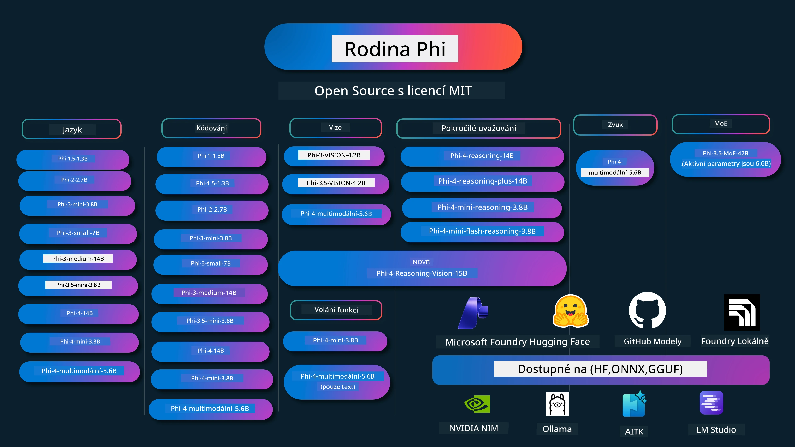

# Phi Cookbook: Praktické příklady s modely Phi od Microsoftu

[](https://codespaces.new/microsoft/phicookbook)
[](https://vscode.dev/redirect?url=vscode://ms-vscode-remote.remote-containers/cloneInVolume?url=https://github.com/microsoft/phicookbook)

[](https://GitHub.com/microsoft/phicookbook/graphs/contributors/?WT.mc_id=aiml-137032-kinfeylo)
[](https://GitHub.com/microsoft/phicookbook/issues/?WT.mc_id=aiml-137032-kinfeylo)
[](https://GitHub.com/microsoft/phicookbook/pulls/?WT.mc_id=aiml-137032-kinfeylo)
[](http://makeapullrequest.com?WT.mc_id=aiml-137032-kinfeylo)

[](https://GitHub.com/microsoft/phicookbook/watchers/?WT.mc_id=aiml-137032-kinfeylo)
[](https://GitHub.com/microsoft/phicookbook/network/?WT.mc_id=aiml-137032-kinfeylo)
[](https://GitHub.com/microsoft/phicookbook/stargazers/?WT.mc_id=aiml-137032-kinfeylo)

[](https://discord.com/invite/ByRwuEEgH4)

Phi je série open source AI modelů vyvinutých společností Microsoft.

Phi je v současnosti nejvýkonnější a nejefektivnější malý jazykový model (SLM) s velmi dobrými benchmarky v mnoha jazycích, v oblasti uvažování, generování textu/chatů, kódování, obrazu, zvuku a dalších scénářů.

Phi můžete nasadit do cloudu nebo na edge zařízení a snadno tak vytvořit generativní AI aplikace s omezenou výpočetní kapacitou.

Postupujte podle těchto kroků, abyste mohli začít používat tyto zdroje:
1. **Vytvořte Fork Repozitáře**: Klikněte na [](https://GitHub.com/microsoft/phicookbook/network/?WT.mc_id=aiml-137032-kinfeylo)
2. **Klonujte Repozitář**: `git clone https://github.com/microsoft/PhiCookBook.git`
3. [**Připojte se ke komunitě Microsoft AI na Discordu a potkejte experty a další vývojáře**](https://discord.com/invite/ByRwuEEgH4?WT.mc_id=aiml-137032-kinfeylo)



### 🌐 Podpora více jazyků

#### Podporováno přes GitHub Action (automatické a vždy aktuální)

<!-- CO-OP TRANSLATOR LANGUAGES TABLE START -->
[Arabština](../ar/README.md) | [Bengálština](../bn/README.md) | [Bulharština](../bg/README.md) | [Barmština (Myanmar)](../my/README.md) | [Čínština (zjednodušená)](../zh-CN/README.md) | [Čínština (tradiční, Hong Kong)](../zh-HK/README.md) | [Čínština (tradiční, Macau)](../zh-MO/README.md) | [Čínština (tradiční, Taiwan)](../zh-TW/README.md) | [Chorvatština](../hr/README.md) | [Čeština](./README.md) | [Dánština](../da/README.md) | [Nizozemština](../nl/README.md) | [Estonština](../et/README.md) | [Finština](../fi/README.md) | [Francouzština](../fr/README.md) | [Němčina](../de/README.md) | [Řečtina](../el/README.md) | [Hebrejština](../he/README.md) | [Hindština](../hi/README.md) | [Maďarština](../hu/README.md) | [Indonéština](../id/README.md) | [Italština](../it/README.md) | [Japonština](../ja/README.md) | [Kannada](../kn/README.md) | [Khmer](../km/README.md) | [Korejština](../ko/README.md) | [Litevština](../lt/README.md) | [Malajština](../ms/README.md) | [Malajalámština](../ml/README.md) | [Maráthština](../mr/README.md) | [Nepálština](../ne/README.md) | [Nigerijský pidžin](../pcm/README.md) | [Norština](../no/README.md) | [Perština (Fársí)](../fa/README.md) | [Polština](../pl/README.md) | [Portugalština (Brazílie)](../pt-BR/README.md) | [Portugalština (Portugalsko)](../pt-PT/README.md) | [Paňdžábština (Gurmukhi)](../pa/README.md) | [Rumunština](../ro/README.md) | [Ruština](../ru/README.md) | [Srbština (cyrilice)](../sr/README.md) | [Slovenština](../sk/README.md) | [Slovinština](../sl/README.md) | [Španělština](../es/README.md) | [Svahilština](../sw/README.md) | [Švédština](../sv/README.md) | [Tagalog (Filipino)](../tl/README.md) | [Tamil](../ta/README.md) | [Telugština](../te/README.md) | [Thajština](../th/README.md) | [Turečtina](../tr/README.md) | [Ukrajinština](../uk/README.md) | [Urdština](../ur/README.md) | [Vietnamština](../vi/README.md)

> **Raději klonovat lokálně?**
>
> Tento repozitář obsahuje více než 50 překladů do jazyků, což výrazně zvětšuje velikost ke stažení. Chcete-li klonovat bez překladů, použijte sparse checkout:
>
> **Bash / macOS / Linux:**
> ```bash
> git clone --filter=blob:none --sparse https://github.com/microsoft/PhiCookBook.git
> cd PhiCookBook
> git sparse-checkout set --no-cone '/*' '!translations' '!translated_images'
> ```
>
> **CMD (Windows):**
> ```cmd
> git clone --filter=blob:none --sparse https://github.com/microsoft/PhiCookBook.git
> cd PhiCookBook
> git sparse-checkout set --no-cone "/*" "!translations" "!translated_images"
> ```
>
> Toto vám poskytne vše potřebné pro dokončení kurzu s mnohem rychlejším stažením.
<!-- CO-OP TRANSLATOR LANGUAGES TABLE END -->

## Obsah

- Úvod
  - [Vítejte v rodině Phi](./md/01.Introduction/01/01.PhiFamily.md)
  - [Nastavení prostředí](./md/01.Introduction/01/01.EnvironmentSetup.md)
  - [Pochopení klíčových technologií](./md/01.Introduction/01/01.Understandingtech.md)
  - [Bezpečnost AI pro modely Phi](./md/01.Introduction/01/01.AISafety.md)
  - [Podpora hardwaru Phi](./md/01.Introduction/01/01.Hardwaresupport.md)
  - [Modely Phi & dostupnost napříč platformami](./md/01.Introduction/01/01.Edgeandcloud.md)
  - [Použití Guidance-ai a Phi](./md/01.Introduction/01/01.Guidance.md)
  - [Modely na GitHub Marketplace](https://github.com/marketplace/models)
  - [Katalog AI modelů Azure](https://ai.azure.com)

- Inference Phi v různých prostředích
    -  [Hugging face](./md/01.Introduction/02/01.HF.md)
    -  [GitHub Modely](./md/01.Introduction/02/02.GitHubModel.md)
    -  [Microsoft Foundry Model Catalog](./md/01.Introduction/02/03.AzureAIFoundry.md)
    -  [Ollama](./md/01.Introduction/02/04.Ollama.md)
    -  [AI Toolkit VSCode (AITK)](./md/01.Introduction/02/05.AITK.md)
    -  [NVIDIA NIM](./md/01.Introduction/02/06.NVIDIA.md)
    -  [Foundry Local](./md/01.Introduction/02/07.FoundryLocal.md)

- Inference Phi Family
    - [Inference Phi na iOS](./md/01.Introduction/03/iOS_Inference.md)
    - [Inference Phi na Android](./md/01.Introduction/03/Android_Inference.md)
    - [Inference Phi na Jetson](./md/01.Introduction/03/Jetson_Inference.md)
    - [Inference Phi na AI PC](./md/01.Introduction/03/AIPC_Inference.md)
    - [Inference Phi s Apple MLX Framework](./md/01.Introduction/03/MLX_Inference.md)
    - [Inference Phi na lokálním serveru](./md/01.Introduction/03/Local_Server_Inference.md)
    - [Inference Phi na vzdáleném serveru pomocí AI Toolkit](./md/01.Introduction/03/Remote_Interence.md)
    - [Inference Phi s Rust](./md/01.Introduction/03/Rust_Inference.md)
    - [Inference Phi—Vision lokálně](./md/01.Introduction/03/Vision_Inference.md)
    - [Inference Phi s Kaito AKS, Azure kontejnery (oficiální podpora)](./md/01.Introduction/03/Kaito_Inference.md)
-  [Kvantisování Phi Family](./md/01.Introduction/04/QuantifyingPhi.md)
    - [Kvantisování Phi-3.5 / 4 pomocí llama.cpp](./md/01.Introduction/04/UsingLlamacppQuantifyingPhi.md)
    - [Kvantisování Phi-3.5 / 4 pomocí Generative AI extensions pro onnxruntime](./md/01.Introduction/04/UsingORTGenAIQuantifyingPhi.md)
    - [Kvantisování Phi-3.5 / 4 pomocí Intel OpenVINO](./md/01.Introduction/04/UsingIntelOpenVINOQuantifyingPhi.md)
    - [Kvantisování Phi-3.5 / 4 pomocí Apple MLX Framework](./md/01.Introduction/04/UsingAppleMLXQuantifyingPhi.md)

-  Hodnocení Phi
    - [Odpovědná AI](./md/01.Introduction/05/ResponsibleAI.md)
    - [Microsoft Foundry pro hodnocení](./md/01.Introduction/05/AIFoundry.md)
    - [Použití Promptflow pro hodnocení](./md/01.Introduction/05/Promptflow.md)
 
- RAG s Azure AI Search
    - [Jak používat Phi-4-mini a Phi-4-multimodal (RAG) s Azure AI Search](https://github.com/microsoft/PhiCookBook/blob/main/code/06.E2E/E2E_Phi-4-RAG-Azure-AI-Search.ipynb)

- Ukázky vývoje aplikací Phi
  - Textové a chatové aplikace
    - Ukázky Phi-4
      - [📓] [Chat s modelem Phi-4-mini ONNX](./md/02.Application/01.TextAndChat/Phi4/ChatWithPhi4ONNX/README.md)
      - [Chat s místním modelem Phi-4 ONNX .NET](../../md/04.HOL/dotnet/src/LabsPhi4-Chat-01OnnxRuntime)
      - [Chat .NET konzolová aplikace s Phi-4 ONNX pomocí Semantic Kernel](../../md/04.HOL/dotnet/src/LabsPhi4-Chat-02SK)
    - Ukázky Phi-3 / 3.5
      - [Lokální chatbot v prohlížeči pomocí Phi3, ONNX Runtime Web a WebGPU](https://github.com/microsoft/onnxruntime-inference-examples/tree/main/js/chat)
      - [OpenVino Chat](./md/02.Application/01.TextAndChat/Phi3/E2E_OpenVino_Chat.md)
      - [Více modelů - Interaktivní Phi-3-mini a OpenAI Whisper](./md/02.Application/01.TextAndChat/Phi3/E2E_Phi-3-mini_with_whisper.md)
      - [MLFlow - Vytváření wrapperu a použití Phi-3 s MLFlow](./md//02.Application/01.TextAndChat/Phi3/E2E_Phi-3-MLflow.md)
      - [Optimalizace modelu - Jak optimalizovat model Phi-3-min pro ONNX Runtime Web s Olive](https://github.com/microsoft/Olive/tree/main/examples/phi3)
      - [WinUI3 aplikace s Phi-3 mini-4k-instruct-onnx](https://github.com/microsoft/Phi3-Chat-WinUI3-Sample/)
      -[Ukázka aplikace WinUI3 s více modely poháněnou AI](https://github.com/microsoft/ai-powered-notes-winui3-sample)
      - [Doladění a integrace vlastních modelů Phi-3 s Prompt flow](./md/02.Application/01.TextAndChat/Phi3/E2E_Phi-3-FineTuning_PromptFlow_Integration.md)
      - [Doladění a integrace vlastních modelů Phi-3 s Prompt flow v Microsoft Foundry](./md/02.Application/01.TextAndChat/Phi3/E2E_Phi-3-FineTuning_PromptFlow_Integration_AIFoundry.md)
      - [Vyhodnocení doladěného modelu Phi-3 / Phi-3.5 v Microsoft Foundry zaměřené na zásady odpovědné AI Microsoftu](./md/02.Application/01.TextAndChat/Phi3/E2E_Phi-3-Evaluation_AIFoundry.md)
      - [📓] [Ukázka jazykového předpovídání Phi-3.5-mini-instruct (čínština/angličtina)](./md/02.Application/01.TextAndChat/Phi3/phi3-instruct-demo.ipynb)
      - [Phi-3.5-Instruct WebGPU RAG Chatbot](./md/02.Application/01.TextAndChat/Phi3/WebGPUWithPhi35Readme.md)
      - [Použití Windows GPU k vytvoření řešení Prompt flow s Phi-3.5-Instruct ONNX](./md/02.Application/01.TextAndChat/Phi3/UsingPromptFlowWithONNX.md)
      - [Použití Microsoft Phi-3.5 tflite k vytvoření Android aplikace](./md/02.Application/01.TextAndChat/Phi3/UsingPhi35TFLiteCreateAndroidApp.md)
      - [Ukázka Q&A .NET s použitím lokálního ONNX modelu Phi-3 pomocí Microsoft.ML.OnnxRuntime](../../md/04.HOL/dotnet/src/LabsPhi301)
      - [Konzolová chat .NET aplikace se Semantic Kernel a Phi-3](../../md/04.HOL/dotnet/src/LabsPhi302)

  - Ukázky kódu SDK Azure AI Inference založené na kódu 
    - Ukázky Phi-4 
      - [📓] [Generování kódu projektu pomocí Phi-4-multimodal](./md/02.Application/02.Code/Phi4/GenProjectCode/README.md)
    - Ukázky Phi-3 / 3.5
      - [Vytvořte si vlastní Visual Studio Code GitHub Copilot Chat s Microsoft Phi-3 Family](./md/02.Application/02.Code/Phi3/VSCodeExt/README.md)
      - [Vytvořte si svého vlastního Visual Studio Code Chat Copilot Agenta s Phi-3.5 pomocí GitHub modelů](/md/02.Application/02.Code/Phi3/CreateVSCodeChatAgentWithGitHubModels.md)

  - Ukázky pokročilého uvažování
    - Ukázky Phi-4 
      - [📓] [Ukázky Phi-4-mini-reasoning nebo Phi-4-reasoning](./md/02.Application/03.AdvancedReasoning/Phi4/AdvancedResoningPhi4mini/README.md)
      - [📓] [Doladění Phi-4-mini-reasoning s Microsoft Olive](./md/02.Application/03.AdvancedReasoning/Phi4/AdvancedResoningPhi4mini/olive_ft_phi_4_reasoning_with_medicaldata.ipynb)
      - [📓] [Doladění Phi-4-mini-reasoning s Apple MLX](./md/02.Application/03.AdvancedReasoning/Phi4/AdvancedResoningPhi4mini/mlx_ft_phi_4_reasoning_with_medicaldata.ipynb)
      - [📓] [Phi-4-mini-reasoning s GitHub modely](./md/02.Application/02.Code/Phi4r/github_models_inference.ipynb)
      - [📓] [Phi-4-mini-reasoning s Microsoft Foundry modely](./md/02.Application/02.Code/Phi4r/azure_models_inference.ipynb)
  - Ukázky
      - [Phi-4-mini demo hostované na Hugging Face Spaces](https://huggingface.co/spaces/microsoft/phi-4-mini?WT.mc_id=aiml-137032-kinfeylo)
      - [Phi-4-multimodal demo hostované na Hugging Face Spaces](https://huggingface.co/spaces/microsoft/phi-4-multimodal?WT.mc_id=aiml-137032-kinfeylo)
  - Ukázky vize
    - Ukázky Phi-4 
      - [📓] [Použití Phi-4-multimodal pro čtení obrázků a generování kódu](./md/02.Application/04.Vision/Phi4/CreateFrontend/README.md) 
    - Ukázky Phi-3 / 3.5
      -  [📓][Phi-3-vision - Převedení textu z obrázku na text](./md/02.Application/04.Vision/Phi3/E2E_Phi-3-vision-image-text-to-text-online-endpoint.ipynb)
      - [Phi-3-vision-ONNX](https://onnxruntime.ai/docs/genai/tutorials/phi3-v.html)
      - [📓][Phi-3-vision CLIP embedding](./md/02.Application/04.Vision/Phi3/E2E_Phi-3-vision-image-text-to-text-online-endpoint.ipynb)
      - [DEMO: Phi-3 recyklace](https://github.com/jennifermarsman/PhiRecycling/)
      - [Phi-3-vision - Asistent vizuálního jazyka - s Phi3-Vision a OpenVINO](https://docs.openvino.ai/nightly/notebooks/phi-3-vision-with-output.html)
      - [Phi-3 Vision Nvidia NIM](./md/02.Application/04.Vision/Phi3/E2E_Nvidia_NIM_Vision.md)
      - [Phi-3 Vision OpenVino](./md/02.Application/04.Vision/Phi3/E2E_OpenVino_Phi3Vision.md)
      - [📓][Phi-3.5 Vision ukázka s více rámci nebo více obrázky](./md/02.Application/04.Vision/Phi3/phi3-vision-demo.ipynb)
      - [Phi-3 Vision lokální ONNX model pomocí Microsoft.ML.OnnxRuntime .NET](../../md/04.HOL/dotnet/src/LabsPhi303)
      - [Menu založené Phi-3 Vision lokální ONNX model pomocí Microsoft.ML.OnnxRuntime .NET](../../md/04.HOL/dotnet/src/LabsPhi304)

  - Ukázky Reasoning-Vision
    - Phi-4-Reasoning-Vision-15B 
      - [📓] [Použití Phi-4-Reasoning-Vision-15B k detekci přecházení mimo přechod](./md/02.Application/10.ReasoningVision/Phi_4_reasoning_vision_15b_Jaywalking.ipynb)
      - [📓] [Použití Phi-4-Reasoning-Vision-15B na matematiku](./md/02.Application/10.ReasoningVision/Phi_4_reasoning_vision_15b_Math.ipynb)
      - [📓] [Použití Phi-4-Reasoning-Vision-15B k detekci UI](./md/02.Application/10.ReasoningVision/Phi_4_reasoning_vision_15b_ui.ipynb)

  - Ukázky matematiky
    -  Ukázky Phi-4-Mini-Flash-Reasoning-Instruct  [Demo matematiky s Phi-4-Mini-Flash-Reasoning-Instruct](./md/02.Application/09.Math/MathDemo.ipynb)

  - Ukázky audia
    - Ukázky Phi-4 
      - [📓] [Extrahování přepisů audia pomocí Phi-4-multimodal](./md/02.Application/05.Audio/Phi4/Transciption/README.md)
      - [📓] [Ukázka audia Phi-4-multimodal](./md/02.Application/05.Audio/Phi4/Siri/demo.ipynb)
      - [📓] [Ukázka překladu řeči Phi-4-multimodal](./md/02.Application/05.Audio/Phi4/Translate/demo.ipynb)
      - [.NET konzolová aplikace s využitím Phi-4-multimodal k analýze audio souboru a generování přepisu](../../md/04.HOL/dotnet/src/LabsPhi4-MultiModal-02Audio)

  - Ukázky MOE
    - Ukázky Phi-3 / 3.5
      - [📓] [Ukázka Phi-3.5 Mixture of Experts Models (MoEs) pro sociální média](./md/02.Application/06.MoE/Phi3/phi3_moe_demo.ipynb)
      - [📓] [Vytváření pipeline s Retrieval-Augmented Generation (RAG) s NVIDIA NIM Phi-3 MOE, Azure AI Search a LlamaIndex](./md/02.Application/06.MoE/Phi3/azure-ai-search-nvidia-rag.ipynb)
      - 
  - Ukázky volání funkcí
    - Ukázky Phi-4 🆕
      -  [📓] [Použití volání funkcí s Phi-4-mini](./md/02.Application/07.FunctionCalling/Phi4/FunctionCallingBasic/README.md)
      -  [📓] [Použití volání funkcí k vytvoření multi-agentů s Phi-4-mini](./md/02.Application/07.FunctionCalling/Phi4/Multiagents/Phi_4_mini_multiagent.ipynb)
      -  [📓] [Použití volání funkcí s Ollama](./md/02.Application/07.FunctionCalling/Phi4/Ollama/ollama_functioncalling.ipynb)
      -  [📓] [Použití volání funkcí s ONNX](./md/02.Application/07.FunctionCalling/Phi4/ONNX/onnx_parallel_functioncalling.ipynb)
  - Ukázky míchání multimodálních dat
    - Ukázky Phi-4 🆕
      -  [📓] [Použití Phi-4-multimodal jako technologického novináře](./md/02.Application/08.Multimodel/Phi4/TechJournalist/phi_4_mm_audio_text_publish_news.ipynb)
      - [.NET konzolová aplikace používající Phi-4-multimodal k analýze obrázků](../../md/04.HOL/dotnet/src/LabsPhi4-MultiModal-01Images)

- Doladění Phi ukázek
  - [Scénáře doladění](./md/03.FineTuning/FineTuning_Scenarios.md)
  - [Doladění vs RAG](./md/03.FineTuning/FineTuning_vs_RAG.md)
  - [Doladění: Nechte Phi-3 stát se průmyslovým expertem](./md/03.FineTuning/LetPhi3gotoIndustriy.md)
  - [Doladění Phi-3 pomocí AI Toolkit pro VS Code](./md/03.FineTuning/Finetuning_VSCodeaitoolkit.md)
  - [Doladění Phi-3 pomocí Azure Machine Learning Service](./md/03.FineTuning/Introduce_AzureML.md)
  - [Doladění Phi-3 pomocí Lora](./md/03.FineTuning/FineTuning_Lora.md)
  - [Doladění Phi-3 pomocí QLora](./md/03.FineTuning/FineTuning_Qlora.md)
  - [Doladění Phi-3 pomocí Microsoft Foundry](./md/03.FineTuning/FineTuning_AIFoundry.md)
  - [Doladění Phi-3 pomocí Azure ML CLI/SDK](./md/03.FineTuning/FineTuning_MLSDK.md)
  - [Doladění s Microsoft Olive](./md/03.FineTuning/FineTuning_MicrosoftOlive.md)
  - [Doladění s praktickou laboratoří Microsoft Olive](./md/03.FineTuning/olive-lab/readme.md)
  - [Doladění Phi-3-vision s Weights and Bias](./md/03.FineTuning/FineTuning_Phi-3-visionWandB.md)
  - [Doladění Phi-3 s Apple MLX Framework](./md/03.FineTuning/FineTuning_MLX.md)
  - [Doladění Phi-3-vision (oficiální podpora)](./md/03.FineTuning/FineTuning_Vision.md)
  - [Ladění Phi-3 s Kaito AKS, Azure kontejnery (oficiální podpora)](./md/03.FineTuning/FineTuning_Kaito.md)
  - [Ladění Phi-3 a 3.5 Vision](https://github.com/2U1/Phi3-Vision-Finetune)

- Praktická laboratoř
  - [Prozkoumávání nejmodernějších modelů: LLM, SLM, lokální vývoj a další](https://github.com/microsoft/aitour-exploring-cutting-edge-models)
  - [Odemknutí potenciálu NLP: Ladění s Microsoft Olive](https://github.com/azure/Ignite_FineTuning_workshop)

- Akademické výzkumné práce a publikace
  - [Textbooks Are All You Need II: technická zpráva phi-1.5](https://arxiv.org/abs/2309.05463)
  - [Technická zpráva Phi-3: Vysoce schopný jazykový model lokálně na vašem telefonu](https://arxiv.org/abs/2404.14219)
  - [Technická zpráva Phi-4](https://arxiv.org/abs/2412.08905)
  - [Technická zpráva Phi-4-Mini: Kompaktní, ale výkonné multimodální jazykové modely pomocí směsi LoRA](https://arxiv.org/abs/2503.01743)
  - [Optimalizace malých jazykových modelů pro volání funkcí ve vozidle](https://arxiv.org/abs/2501.02342)
  - [(WhyPHI) Ladění PHI-3 pro odpovídání na otázky s více možnostmi: Metodologie, výsledky a výzvy](https://arxiv.org/abs/2501.01588)
  - [Technická zpráva Phi-4-reasoning](https://www.microsoft.com/en-us/research/wp-content/uploads/2025/04/phi_4_reasoning.pdf)
  - [Technická zpráva Phi-4-mini-reasoning](https://huggingface.co/microsoft/Phi-4-mini-reasoning/blob/main/Phi-4-Mini-Reasoning.pdf)

## Používání modelů Phi

### Phi na Microsoft Foundry

Můžete se naučit, jak používat Microsoft Phi a jak stavět end-to-end řešení na různých hardwarových zařízeních. Pro vyzkoušení Phi začněte hraním s modely a přizpůsobováním Phi pro vaše scénáře pomocí [Microsoft Foundry Azure AI Model Catalog](https://aka.ms/phi3-azure-ai). Více se dozvíte v návodu Začínáme s [Microsoft Foundry](/md/02.QuickStart/AzureAIFoundry_QuickStart.md).

**Hřiště**
Každý model má své vlastní hřiště pro testování modelu na [Azure AI Playground](https://aka.ms/try-phi3).

### Phi na GitHub modelech

Můžete se naučit, jak používat Microsoft Phi a jak stavět end-to-end řešení na různých hardwarových zařízeních. Pro vyzkoušení Phi začněte hraním s modelem a přizpůsobováním Phi pro vaše scénáře pomocí [GitHub Model Catalog](https://github.com/marketplace/models?WT.mc_id=aiml-137032-kinfeylo). Více se dozvíte v návodu Začínáme s [GitHub Model Catalog](/md/02.QuickStart/GitHubModel_QuickStart.md).

**Hřiště**
Každý model má vyhrazené [hřiště pro testování modelu](/md/02.QuickStart/GitHubModel_QuickStart.md).

### Phi na Hugging Face

Model také najdete na [Hugging Face](https://huggingface.co/microsoft).

**Hřiště**
 [Hřiště Hugging Chat](https://huggingface.co/chat/models/microsoft/Phi-3-mini-4k-instruct)

 ## 🎒 Další kurzy

Náš tým připravuje i další kurzy! Podívejte se na:

<!-- CO-OP TRANSLATOR OTHER COURSES START -->
### LangChain
[](https://aka.ms/langchain4j-for-beginners)
[](https://aka.ms/langchainjs-for-beginners?WT.mc_id=m365-94501-dwahlin)
[](https://github.com/microsoft/langchain-for-beginners?WT.mc_id=m365-94501-dwahlin)
---

### Azure / Edge / MCP / Agenti
[](https://github.com/microsoft/AZD-for-beginners?WT.mc_id=academic-105485-koreyst)
[](https://github.com/microsoft/edgeai-for-beginners?WT.mc_id=academic-105485-koreyst)
[](https://github.com/microsoft/mcp-for-beginners?WT.mc_id=academic-105485-koreyst)
[](https://github.com/microsoft/ai-agents-for-beginners?WT.mc_id=academic-105485-koreyst)

---
 
### Série Generativní AI
[](https://github.com/microsoft/generative-ai-for-beginners?WT.mc_id=academic-105485-koreyst)
[-9333EA?style=for-the-badge&labelColor=E5E7EB&color=9333EA)](https://github.com/microsoft/Generative-AI-for-beginners-dotnet?WT.mc_id=academic-105485-koreyst)
[-C084FC?style=for-the-badge&labelColor=E5E7EB&color=C084FC)](https://github.com/microsoft/generative-ai-for-beginners-java?WT.mc_id=academic-105485-koreyst)
[-E879F9?style=for-the-badge&labelColor=E5E7EB&color=E879F9)](https://github.com/microsoft/generative-ai-with-javascript?WT.mc_id=academic-105485-koreyst)

---
 
### Základní učení
[](https://aka.ms/ml-beginners?WT.mc_id=academic-105485-koreyst)
[](https://aka.ms/datascience-beginners?WT.mc_id=academic-105485-koreyst)
[](https://aka.ms/ai-beginners?WT.mc_id=academic-105485-koreyst)
[](https://github.com/microsoft/Security-101?WT.mc_id=academic-96948-sayoung)
[](https://aka.ms/webdev-beginners?WT.mc_id=academic-105485-koreyst)
[](https://aka.ms/iot-beginners?WT.mc_id=academic-105485-koreyst)
[](https://github.com/microsoft/xr-development-for-beginners?WT.mc_id=academic-105485-koreyst)

---
 
### Série Copilot
[](https://aka.ms/GitHubCopilotAI?WT.mc_id=academic-105485-koreyst)
[](https://github.com/microsoft/mastering-github-copilot-for-dotnet-csharp-developers?WT.mc_id=academic-105485-koreyst)
[](https://github.com/microsoft/CopilotAdventures?WT.mc_id=academic-105485-koreyst)
<!-- CO-OP TRANSLATOR OTHER COURSES END -->

## Odpovědná AI

Microsoft se zavazuje pomáhat našim zákazníkům používat naše AI produkty odpovědně, sdílet naše poznatky a budovat partnerství založená na důvěře pomocí nástrojů jako jsou Poznámky o transparentnosti a Hodnocení dopadů. Mnoho z těchto zdrojů naleznete na [https://aka.ms/RAI](https://aka.ms/RAI).
Přístup Microsoftu k odpovědné AI je založen na našich principech AI: spravedlnost, spolehlivost a bezpečnost, ochrana soukromí a bezpečnost, inkluzivita, transparentnost a odpovědnost.

Velké jazykové, obrazové a hlasové modely na rozsáhlém měřítku - jako jsou ty použité v tomto příkladu - mohou potenciálně vykazovat chování, které je nespravedlivé, nespolehlivé nebo urážlivé, což může vést ke škodám. Prosím prostudujte [Poznámku o transparentnosti služby Azure OpenAI](https://learn.microsoft.com/legal/cognitive-services/openai/transparency-note?tabs=text), abyste byli informováni o rizicích a omezeních.
Doporučený přístup k zmírnění těchto rizik je zahrnout do vaší architektury bezpečnostní systém, který dokáže detekovat a zabránit škodlivému chování. [Azure AI Content Safety](https://learn.microsoft.com/azure/ai-services/content-safety/overview) poskytuje nezávislou vrstvu ochrany, schopnou detekovat škodlivý obsah generovaný uživateli i AI v aplikacích a službách. Azure AI Content Safety zahrnuje textové a obrazové API, které vám umožní detekovat škodlivý materiál. V rámci Microsoft Foundry služba Content Safety umožňuje prohlížet, zkoumat a vyzkoušet si ukázkový kód pro detekci škodlivého obsahu napříč různými modalitami. Následující [dokumentace rychlého startu](https://learn.microsoft.com/azure/ai-services/content-safety/quickstart-text?tabs=visual-studio%2Clinux&pivots=programming-language-rest) vás provede procesem odesílání požadavků na službu.

Dalším aspektem, který je třeba vzít v úvahu, je celkový výkon aplikace. V případě multimodálních a multimodelových aplikací chápeme výkon tak, že systém funguje podle očekávání vás i vašich uživatelů, včetně nevytváření škodlivých výstupů. Je důležité zhodnotit výkon vaší celkové aplikace pomocí [hodnotitelů výkonnosti, kvality, rizika a bezpečnosti](https://learn.microsoft.com/azure/ai-studio/concepts/evaluation-metrics-built-in). Také máte možnost vytvářet a hodnotit pomocí [vlastních hodnotitelů](https://learn.microsoft.com/azure/ai-studio/how-to/develop/evaluate-sdk#custom-evaluators).

Svou AI aplikaci můžete hodnotit ve vašem vývojovém prostředí pomocí [Azure AI Evaluation SDK](https://microsoft.github.io/promptflow/index.html). Na základě testovacího datasetu nebo cíle jsou generace vaší generativní AI aplikace kvantitativně měřeny vestavěnými hodnotiteli nebo vámi zvolenými vlastními hodnotiteli. Chcete-li začít s Azure AI Evaluation SDK pro vyhodnocení vašeho systému, můžete se řídit [průvodcem rychlého startu](https://learn.microsoft.com/azure/ai-studio/how-to/develop/flow-evaluate-sdk). Po spuštění hodnocení můžete [vizualizovat výsledky v Microsoft Foundry](https://learn.microsoft.com/azure/ai-studio/how-to/evaluate-flow-results).

## Ochranné známky

Tento projekt může obsahovat ochranné známky nebo loga projektů, produktů či služeb. Autorizované použití ochranných známek nebo log Microsoftu podléhá a musí dodržovat [Pravidla použití ochranných známek a značek Microsoftu](https://www.microsoft.com/legal/intellectualproperty/trademarks/usage/general). Použití ochranných známek nebo log Microsoftu v upravených verzích tohoto projektu nesmí způsobit záměnu nebo naznačovat podporu Microsoftem. Jakékoli použití ochranných známek nebo log třetích stran podléhá pravidlům těchto třetích stran.

## Získání pomoci

Pokud narazíte na potíže nebo máte dotazy ohledně vývoje AI aplikací, přidejte se k:

[](https://aka.ms/foundry/discord)

Pokud máte zpětnou vazbu k produktu nebo narazíte na chyby při vývoji, navštivte:

[](https://aka.ms/foundry/forum)

---

<!-- CO-OP TRANSLATOR DISCLAIMER START -->
**Prohlášení o vyloučení odpovědnosti**:  
Tento dokument byl přeložen pomocí AI překladatelské služby [Co-op Translator](https://github.com/Azure/co-op-translator). I když se snažíme o přesnost, mějte prosím na paměti, že automatizované překlady mohou obsahovat chyby nebo nepřesnosti. Původní dokument v jeho rodném jazyce by měl být považován za autoritativní zdroj. Pro kritické informace se doporučuje profesionální lidský překlad. Nejsme odpovědní za jakékoliv nedorozumění nebo špatné výklady vzniklé z použití tohoto překladu.
<!-- CO-OP TRANSLATOR DISCLAIMER END -->