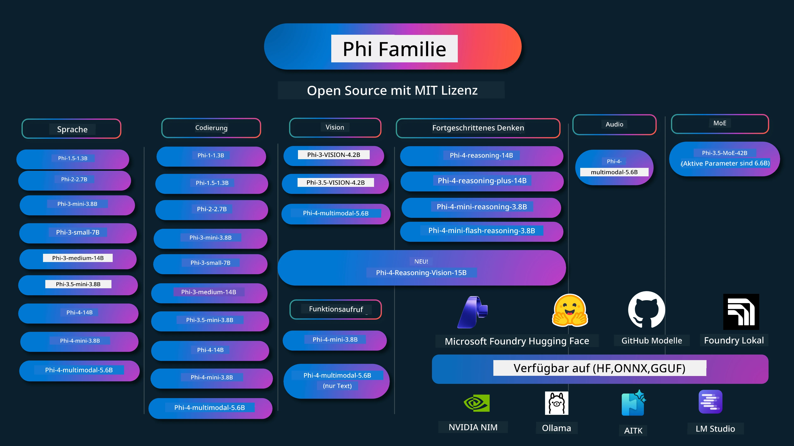

# Phi Cookbook: Praxisbeispiele mit den Phi-Modellen von Microsoft

[](https://codespaces.new/microsoft/phicookbook)
[](https://vscode.dev/redirect?url=vscode://ms-vscode-remote.remote-containers/cloneInVolume?url=https://github.com/microsoft/phicookbook)

[](https://GitHub.com/microsoft/phicookbook/graphs/contributors/?WT.mc_id=aiml-137032-kinfeylo)
[](https://GitHub.com/microsoft/phicookbook/issues/?WT.mc_id=aiml-137032-kinfeylo)
[](https://GitHub.com/microsoft/phicookbook/pulls/?WT.mc_id=aiml-137032-kinfeylo)
[](http://makeapullrequest.com?WT.mc_id=aiml-137032-kinfeylo)

[](https://GitHub.com/microsoft/phicookbook/watchers/?WT.mc_id=aiml-137032-kinfeylo)
[](https://GitHub.com/microsoft/phicookbook/network/?WT.mc_id=aiml-137032-kinfeylo)
[](https://GitHub.com/microsoft/phicookbook/stargazers/?WT.mc_id=aiml-137032-kinfeylo)

[](https://discord.com/invite/ByRwuEEgH4)

Phi ist eine Reihe von Open-Source-KI-Modellen, die von Microsoft entwickelt wurden.

Phi ist derzeit das leistungsfähigste und kosteneffektivste kleine Sprachmodell (SLM) mit sehr guten Benchmark-Ergebnissen in Mehrsprachigkeit, logischem Denken, Text-/Chat-Generierung, Codierung, Bildern, Audio und weiteren Szenarien.

Sie können Phi in der Cloud oder auf Edge-Geräten bereitstellen und generative KI-Anwendungen mit begrenzter Rechenleistung ganz einfach erstellen.

Folgen Sie diesen Schritten, um mit der Nutzung dieser Ressourcen zu beginnen:
1. **Forken Sie das Repository**: Klicken Sie auf [](https://GitHub.com/microsoft/phicookbook/network/?WT.mc_id=aiml-137032-kinfeylo)
2. **Klonen Sie das Repository**: `git clone https://github.com/microsoft/PhiCookBook.git`
3. [**Treten Sie der Microsoft AI Discord-Community bei und treffen Sie Experten sowie andere Entwickler**](https://discord.com/invite/ByRwuEEgH4?WT.mc_id=aiml-137032-kinfeylo)



### 🌐 Mehrsprachige Unterstützung

#### Unterstützt über GitHub Action (Automatisch & Immer aktuell)

<!-- CO-OP TRANSLATOR LANGUAGES TABLE START -->
[Arabisch](../ar/README.md) | [Bengalisch](../bn/README.md) | [Bulgarisch](../bg/README.md) | [Birmanisch (Myanmar)](../my/README.md) | [Chinesisch (Vereinfachtes)](../zh-CN/README.md) | [Chinesisch (Traditionelles, Hongkong)](../zh-HK/README.md) | [Chinesisch (Traditionelles, Macau)](../zh-MO/README.md) | [Chinesisch (Traditionelles, Taiwan)](../zh-TW/README.md) | [Kroatisch](../hr/README.md) | [Tschechisch](../cs/README.md) | [Dänisch](../da/README.md) | [Niederländisch](../nl/README.md) | [Estnisch](../et/README.md) | [Finnisch](../fi/README.md) | [Französisch](../fr/README.md) | [Deutsch](./README.md) | [Griechisch](../el/README.md) | [Hebräisch](../he/README.md) | [Hindi](../hi/README.md) | [Ungarisch](../hu/README.md) | [Indonesisch](../id/README.md) | [Italienisch](../it/README.md) | [Japanisch](../ja/README.md) | [Kannada](../kn/README.md) | [Koreanisch](../ko/README.md) | [Litauisch](../lt/README.md) | [Malaiisch](../ms/README.md) | [Malayalam](../ml/README.md) | [Marathi](../mr/README.md) | [Nepalesisch](../ne/README.md) | [Nigerianisches Pidgin](../pcm/README.md) | [Norwegisch](../no/README.md) | [Persisch (Farsi)](../fa/README.md) | [Polnisch](../pl/README.md) | [Portugiesisch (Brasilien)](../pt-BR/README.md) | [Portugiesisch (Portugal)](../pt-PT/README.md) | [Punjabi (Gurmukhi)](../pa/README.md) | [Rumänisch](../ro/README.md) | [Russisch](../ru/README.md) | [Serbisch (Kyrillisch)](../sr/README.md) | [Slowakisch](../sk/README.md) | [Slowenisch](../sl/README.md) | [Spanisch](../es/README.md) | [Suaheli](../sw/README.md) | [Schwedisch](../sv/README.md) | [Tagalog (Filipino)](../tl/README.md) | [Tamil](../ta/README.md) | [Telugu](../te/README.md) | [Thailändisch](../th/README.md) | [Türkisch](../tr/README.md) | [Ukrainisch](../uk/README.md) | [Urdu](../ur/README.md) | [Vietnamesisch](../vi/README.md)

> **Möchten Sie lieber lokal klonen?**
>
> Dieses Repository enthält über 50 Sprachübersetzungen, was die Downloadgröße erheblich erhöht. Um ohne Übersetzungen zu klonen, verwenden Sie Sparse Checkout:
>
> **Bash / macOS / Linux:**
> ```bash
> git clone --filter=blob:none --sparse https://github.com/microsoft/PhiCookBook.git
> cd PhiCookBook
> git sparse-checkout set --no-cone '/*' '!translations' '!translated_images'
> ```
>
> **CMD (Windows):**
> ```cmd
> git clone --filter=blob:none --sparse https://github.com/microsoft/PhiCookBook.git
> cd PhiCookBook
> git sparse-checkout set --no-cone "/*" "!translations" "!translated_images"
> ```
>
> Dies gibt Ihnen alles, was Sie benötigen, um den Kurs mit einem viel schnelleren Download abzuschließen.
<!-- CO-OP TRANSLATOR LANGUAGES TABLE END -->

## Inhaltsverzeichnis
- Einführung - [Willkommen in der Phi-Familie](./md/01.Introduction/01/01.PhiFamily.md) - [Einrichten Ihrer Umgebung](./md/01.Introduction/01/01.EnvironmentSetup.md) - [Verstehen der Schlüsseltechnologien](./md/01.Introduction/01/01.Understandingtech.md) - [KI-Sicherheit für Phi-Modelle](./md/01.Introduction/01/01.AISafety.md) - [Phi Hardwareunterstützung](./md/01.Introduction/01/01.Hardwaresupport.md) - [Phi-Modelle & Verfügbarkeit auf verschiedenen Plattformen](./md/01.Introduction/01/01.Edgeandcloud.md) - [Verwendung von Guidance-ai und Phi](./md/01.Introduction/01/01.Guidance.md) - [GitHub Marketplace Modelle](https://github.com/marketplace/models) - [Azure AI Modellkatalog](https://ai.azure.com) - Phi-Inferenz in verschiedenen Umgebungen - [Hugging Face](./md/01.Introduction/02/01.HF.md) - [GitHub Modelle](./md/01.Introduction/02/02.GitHubModel.md) - [Microsoft Foundry Modellkatalog](./md/01.Introduction/02/03.AzureAIFoundry.md) - [Ollama](./md/01.Introduction/02/04.Ollama.md) - [AI Toolkit VSCode (AITK)](./md/01.Introduction/02/05.AITK.md) - [NVIDIA NIM](./md/01.Introduction/02/06.NVIDIA.md) - [Foundry Local](./md/01.Introduction/02/07.FoundryLocal.md) - Phi-Familieninferenz - [Phi-Inferenz auf iOS](./md/01.Introduction/03/iOS_Inference.md) - [Phi-Inferenz auf Android](./md/01.Introduction/03/Android_Inference.md) - [Phi-Inferenz auf Jetson](./md/01.Introduction/03/Jetson_Inference.md) - [Phi-Inferenz auf AI PC](./md/01.Introduction/03/AIPC_Inference.md) - [Phi-Inferenz mit Apple MLX Framework](./md/01.Introduction/03/MLX_Inference.md) - [Phi-Inferenz auf lokalem Server](./md/01.Introduction/03/Local_Server_Inference.md) - [Phi-Inferenz auf Remote-Server mit AI Toolkit](./md/01.Introduction/03/Remote_Interence.md) - [Phi-Inferenz mit Rust](./md/01.Introduction/03/Rust_Inference.md) - [Phi-Inferenz--Vision lokal](./md/01.Introduction/03/Vision_Inference.md) - [Phi-Inferenz mit Kaito AKS, Azure Containers (offizielle Unterstützung)](./md/01.Introduction/03/Kaito_Inference.md) - [Quantifizierung der Phi-Familie](./md/01.Introduction/04/QuantifyingPhi.md) - [Quantisierung von Phi-3.5 / 4 mit llama.cpp](./md/01.Introduction/04/UsingLlamacppQuantifyingPhi.md) - [Quantisierung von Phi-3.5 / 4 mit Generative AI Extensions für onnxruntime](./md/01.Introduction/04/UsingORTGenAIQuantifyingPhi.md) - [Quantisierung von Phi-3.5 / 4 mit Intel OpenVINO](./md/01.Introduction/04/UsingIntelOpenVINOQuantifyingPhi.md) - [Quantisierung von Phi-3.5 / 4 mit Apple MLX Framework](./md/01.Introduction/04/UsingAppleMLXQuantifyingPhi.md) - Phi Bewertung - [Verantwortliche KI](./md/01.Introduction/05/ResponsibleAI.md) - [Microsoft Foundry für Bewertung](./md/01.Introduction/05/AIFoundry.md) - [Verwendung von Promptflow für Bewertung](./md/01.Introduction/05/Promptflow.md) - RAG mit Azure AI Search - [Wie man Phi-4-mini und Phi-4-multimodal (RAG) mit Azure AI Search verwendet](https://github.com/microsoft/PhiCookBook/blob/main/code/06.E2E/E2E_Phi-4-RAG-Azure-AI-Search.ipynb) - Beispielsammlungen zur Phi-Anwendungsentwicklung - Text- & Chat-Anwendungen - Phi-4 Beispiele - [📓] [Chat mit Phi-4-mini ONNX Modell](./md/02.Application/01.TextAndChat/Phi4/ChatWithPhi4ONNX/README.md) - [Chat mit Phi-4 lokalem ONNX Modell .NET](../../md/04.HOL/dotnet/src/LabsPhi4-Chat-01OnnxRuntime) - [Chat .NET Konsolenanwendung mit Phi-4 ONNX unter Verwendung von Semantic Kernel](../../md/04.HOL/dotnet/src/LabsPhi4-Chat-02SK) - Phi-3 / 3.5 Beispiele - [Lokaler Chatbot im Browser mit Phi3, ONNX Runtime Web und WebGPU](https://github.com/microsoft/onnxruntime-inference-examples/tree/main/js/chat) - [OpenVino Chat](./md/02.Application/01.TextAndChat/Phi3/E2E_OpenVino_Chat.md) - [Multi Modell - Interaktives Phi-3-mini und OpenAI Whisper](./md/02.Application/01.TextAndChat/Phi3/E2E_Phi-3-mini_with_whisper.md) - [MLFlow - Erstellen eines Wrappers und Verwendung von Phi-3 mit MLFlow](./md//02.Application/01.TextAndChat/Phi3/E2E_Phi-3-MLflow.md) - [Modelloptimierung - Wie man das Phi-3-min Modell für ONNX Runtime Web mit Olive optimiert](https://github.com/microsoft/Olive/tree/main/examples/phi3) - [WinUI3 App mit Phi-3 mini-4k-instruct-onnx](https://github.com/microsoft/Phi3-Chat-WinUI3-Sample/) -[WinUI3 Multi Model KI-gestützte Notizen-App Beispiel](https://github.com/microsoft/ai-powered-notes-winui3-sample) - [Feinabstimmung und Integration eigener Phi-3 Modelle mit Prompt flow](./md/02.Application/01.TextAndChat/Phi3/E2E_Phi-3-FineTuning_PromptFlow_Integration.md) - [Feinabstimmung und Integration eigener Phi-3 Modelle mit Prompt flow in Microsoft Foundry](./md/02.Application/01.TextAndChat/Phi3/E2E_Phi-3-FineTuning_PromptFlow_Integration_AIFoundry.md) - [Bewertung des feinabgestimmten Phi-3 / Phi-3.5 Modells in Microsoft Foundry mit Fokus auf Microsofts Prinzipien verantwortlicher KI](./md/02.Application/01.TextAndChat/Phi3/E2E_Phi-3-Evaluation_AIFoundry.md) - [📓] [Phi-3.5-mini-instruct Sprachvorhersage Beispiel (Chinesisch/Englisch)](./md/02.Application/01.TextAndChat/Phi3/phi3-instruct-demo.ipynb) - [Phi-3.5-Instruct WebGPU RAG Chatbot](./md/02.Application/01.TextAndChat/Phi3/WebGPUWithPhi35Readme.md) - [Verwendung von Windows GPU zur Erstellung einer Prompt flow Lösung mit Phi-3.5-Instruct ONNX](./md/02.Application/01.TextAndChat/Phi3/UsingPromptFlowWithONNX.md) - [Verwendung von Microsoft Phi-3.5 tflite zur Erstellung einer Android-App](./md/02.Application/01.TextAndChat/Phi3/UsingPhi35TFLiteCreateAndroidApp.md) - [Fragen & Antworten .NET Beispiel mit lokalem ONNX Phi-3 Modell unter Verwendung von Microsoft.ML.OnnxRuntime](../../md/04.HOL/dotnet/src/LabsPhi301) - [Konsolenchat .NET App mit Semantic Kernel und Phi-3](../../md/04.HOL/dotnet/src/LabsPhi302) - Azure AI Inferenz SDK Codebasierte Beispiele - Phi-4 Beispiele - [📓] [Generiere Projektcode mit Phi-4-multimodal](./md/02.Application/02.Code/Phi4/GenProjectCode/README.md) - Phi-3 / 3.5 Beispiele - [Bauen Sie Ihren eigenen Visual Studio Code GitHub Copilot Chat mit Microsoft Phi-3 Familie](./md/02.Application/02.Code/Phi3/VSCodeExt/README.md) - [Erstellen Sie Ihren eigenen Visual Studio Code Chat Copilot Agent mit Phi-3.5 von GitHub Modellen](./md/02.Application/02.Code/Phi3/CreateVSCodeChatAgentWithGitHubModels.md) - Erweiterte Reasoning-Beispiele - Phi-4 Beispiele - [📓] [Phi-4-mini-reasoning oder Phi-4-reasoning Beispiele](./md/02.Application/03.AdvancedReasoning/Phi4/AdvancedResoningPhi4mini/README.md) - [📓] [Feinabstimmung von Phi-4-mini-reasoning mit Microsoft Olive](./md/02.Application/03.AdvancedReasoning/Phi4/AdvancedResoningPhi4mini/olive_ft_phi_4_reasoning_with_medicaldata.ipynb) - [📓] [Feinabstimmung von Phi-4-mini-reasoning mit Apple MLX](./md/02.Application/03.AdvancedReasoning/Phi4/AdvancedResoningPhi4mini/mlx_ft_phi_4_reasoning_with_medicaldata.ipynb) - [📓] [Phi-4-mini-reasoning mit GitHub Modellen](./md/02.Application/02.Code/Phi4r/github_models_inference.ipynb) - [📓] [Phi-4-mini-reasoning mit Microsoft Foundry Modellen](./md/02.Application/02.Code/Phi4r/azure_models_inference.ipynb) -
Demos - [Phi-4-mini Demos gehostet auf Hugging Face Spaces](https://huggingface.co/spaces/microsoft/phi-4-mini?WT.mc_id=aiml-137032-kinfeylo) - [Phi-4-multimodale Demos gehostet auf Hugging Face Spaces](https://huggingface.co/spaces/microsoft/phi-4-multimodal?WT.mc_id=aiml-137032-kinfeylo) - Vision Beispiele - Phi-4 Beispiele - [📓] [Nutze Phi-4-multimodal zum Lesen von Bildern und Generieren von Code](./md/02.Application/04.Vision/Phi4/CreateFrontend/README.md) - Phi-3 / 3.5 Beispiele - [📓][Phi-3-Vision-Bild Text zu Text](./md/02.Application/04.Vision/Phi3/E2E_Phi-3-vision-image-text-to-text-online-endpoint.ipynb) - [Phi-3-vision-ONNX](https://onnxruntime.ai/docs/genai/tutorials/phi3-v.html) - [📓][Phi-3-Vision CLIP Einbettung](./md/02.Application/04.Vision/Phi3/E2E_Phi-3-vision-image-text-to-text-online-endpoint.ipynb) - [DEMO: Phi-3 Recycling](https://github.com/jennifermarsman/PhiRecycling/) - [Phi-3-vision - Visueller Sprachassistent - mit Phi3-Vision und OpenVINO](https://docs.openvino.ai/nightly/notebooks/phi-3-vision-with-output.html) - [Phi-3 Vision Nvidia NIM](./md/02.Application/04.Vision/Phi3/E2E_Nvidia_NIM_Vision.md) - [Phi-3 Vision OpenVino](./md/02.Application/04.Vision/Phi3/E2E_OpenVino_Phi3Vision.md) - [📓][Phi-3.5 Vision Mehrfachbild- oder Mehrfachrahmenbeispiel](./md/02.Application/04.Vision/Phi3/phi3-vision-demo.ipynb) - [Phi-3 Vision Lokales ONNX Modell mit Microsoft.ML.OnnxRuntime .NET](../../md/04.HOL/dotnet/src/LabsPhi303) - [Menübasierte Phi-3 Vision Lokales ONNX Modell mit Microsoft.ML.OnnxRuntime .NET](../../md/04.HOL/dotnet/src/LabsPhi304) - Reasoning-Vision Beispiele - Phi-4-Reasoning-Vision-15B - [📓] [Verwendung von Phi-4-Reasoning-Vision-15B zur Erkennung von Falschgehen](./md/02.Application/10.ReasoningVision/Phi_4_reasoning_vision_15b_Jaywalking.ipynb) - [📓] [Verwendung von Phi-4-Reasoning-Vision-15B für Mathematik](./md/02.Application/10.ReasoningVision/Phi_4_reasoning_vision_15b_Math.ipynb) - [📓] [Verwendung von Phi-4-Reasoning-Vision-15B zur Erkennung von UI](./md/02.Application/10.ReasoningVision/Phi_4_reasoning_vision_15b_ui.ipynb) - Mathematik Beispiele - Phi-4-Mini-Flash-Reasoning-Instruct Beispiele [Mathematik Demo mit Phi-4-Mini-Flash-Reasoning-Instruct](./md/02.Application/09.Math/MathDemo.ipynb) - Audio Beispiele - Phi-4 Beispiele - [📓] [Extrahieren von Audio-Transkripten mit Phi-4-multimodal](./md/02.Application/05.Audio/Phi4/Transciption/README.md) - [📓] [Phi-4-multimodales Audio Beispiel](./md/02.Application/05.Audio/Phi4/Siri/demo.ipynb) - [📓] [Phi-4-multimodale Sprachübersetzungsprobe](./md/02.Application/05.Audio/Phi4/Translate/demo.ipynb) - [.NET Konsolenanwendung mit Phi-4-multimodal Audio zur Analyse einer Audiodatei und Generierung eines Transkripts](../../md/04.HOL/dotnet/src/LabsPhi4-MultiModal-02Audio) - MOE Beispiele - Phi-3 / 3.5 Beispiele - [📓] [Phi-3.5 Mixture of Experts Modelle (MoEs) Social Media Beispiel](./md/02.Application/06.MoE/Phi3/phi3_moe_demo.ipynb) - [📓] [Erstellung einer Retrieval-Augmented Generation (RAG) Pipeline mit NVIDIA NIM Phi-3 MOE, Azure AI Search und LlamaIndex](./md/02.Application/06.MoE/Phi3/azure-ai-search-nvidia-rag.ipynb) - - Funktionsaufruf Beispiele - Phi-4 Beispiele 🆕 - [📓] [Verwendung von Funktionsaufrufen mit Phi-4-mini](./md/02.Application/07.FunctionCalling/Phi4/FunctionCallingBasic/README.md) - [📓] [Verwendung von Funktionsaufrufen zur Erstellung von Multi-Agenten mit Phi-4-mini](./md/02.Application/07.FunctionCalling/Phi4/Multiagents/Phi_4_mini_multiagent.ipynb) - [📓] [Verwendung von Funktionsaufrufen mit Ollama](./md/02.Application/07.FunctionCalling/Phi4/Ollama/ollama_functioncalling.ipynb) - [📓] [Verwendung von Funktionsaufrufen mit ONNX](./md/02.Application/07.FunctionCalling/Phi4/ONNX/onnx_parallel_functioncalling.ipynb) - Multimodale Mischbeispiele - Phi-4 Beispiele 🆕 - [📓] [Verwendung von Phi-4-multimodal als Technologie-Journalist](./md/02.Application/08.Multimodel/Phi4/TechJournalist/phi_4_mm_audio_text_publish_news.ipynb) - [.NET Konsolenanwendung mit Phi-4-multimodal zur Analyse von Bildern](../../md/04.HOL/dotnet/src/LabsPhi4-MultiModal-01Images) - Fine-Tuning Phi Beispiele - [Fine-Tuning Szenarien](./md/03.FineTuning/FineTuning_Scenarios.md) - [Fine-Tuning vs RAG](./md/03.FineTuning/FineTuning_vs_RAG.md) - [Fine-Tuning: Lass Phi-3 ein Branchenexperte werden](./md/03.FineTuning/LetPhi3gotoIndustriy.md) - [Fine-Tuning Phi-3 mit AI Toolkit für VS Code](./md/03.FineTuning/Finetuning_VSCodeaitoolkit.md) - [Fine-Tuning Phi-3 mit Azure Machine Learning Service](./md/03.FineTuning/Introduce_AzureML.md) - [Fine-Tuning Phi-3 mit Lora](./md/03.FineTuning/FineTuning_Lora.md) - [Fine-Tuning Phi-3 mit QLora](./md/03.FineTuning/FineTuning_Qlora.md) - [Fine-Tuning Phi-3 mit Microsoft Foundry](./md/03.FineTuning/FineTuning_AIFoundry.md) - [Fine-Tuning Phi-3 mit Azure ML CLI/SDK](./md/03.FineTuning/FineTuning_MLSDK.md) - [Fine-Tuning mit Microsoft Olive](./md/03.FineTuning/FineTuning_MicrosoftOlive.md) - [Fine-Tuning mit Microsoft Olive Hands-On Lab](./md/03.FineTuning/olive-lab/readme.md) - [Fine-Tuning Phi-3-Vision mit Weights and Bias](./md/03.FineTuning/FineTuning_Phi-3-visionWandB.md) - [Fine-Tuning Phi-3 mit Apple MLX Framework](./md/03.FineTuning/FineTuning_MLX.md) - [Fine-Tuning Phi-3-Vision (offizielle Unterstützung)](./md/03.FineTuning/FineTuning_Vision.md) - [Fine-Tuning Phi-3 mit Kaito AKS, Azure Containers (offizielle Unterstützung)](./md/03.FineTuning/FineTuning_Kaito.md) - [Fine-Tuning Phi-3 und 3.5 Vision](https://github.com/2U1/Phi3-Vision-Finetune) - Hands-on Lab - [Erkundung modernster Modelle: LLMs, SLMs, lokale Entwicklung und mehr](https://github.com/microsoft/aitour-exploring-cutting-edge-models) - [Entfesselung des NLP-Potenzials: Fine-Tuning mit Microsoft Olive](https://github.com/azure/Ignite_FineTuning_workshop) - Akademische Forschungsarbeiten und Veröffentlichungen - [Textbooks Are All You Need II: phi-1.5 Technischer Bericht](https://arxiv.org/abs/2309.05463) - [Phi-3 Technischer Bericht: Ein hochfähiges Sprachmodell lokal auf Ihrem Telefon](https://arxiv.org/abs/2404.14219) - [Phi-4 Technischer Bericht](https://arxiv.org/abs/2412.08905) - [Phi-4-Mini Technischer Bericht: Kompakte, aber leistungsstarke multimodale Sprachmodelle via Mixture-of-LoRAs](https://arxiv.org/abs/2503.01743) - [Optimierung von kleinen Sprachmodellen für In-Fahrzeug-Funktionsaufrufe](https://arxiv.org/abs/2501.02342) - [(WhyPHI) Fine-Tuning PHI-3 für Multiple-Choice-Fragen: Methodik, Ergebnisse und Herausforderungen](https://arxiv.org/abs/2501.01588) - [Phi-4-reasoning Technischer Bericht](https://www.microsoft.com/en-us/research/wp-content/uploads/2025/04/phi_4_reasoning.pdf)
- [Phi-4-mini-reasoning Technischer Bericht](https://huggingface.co/microsoft/Phi-4-mini-reasoning/blob/main/Phi-4-Mini-Reasoning.pdf)
# Phi Cookbook: Praktische Beispiele mit Microsofts Phi-Modellen

[](https://codespaces.new/microsoft/phicookbook)
[](https://vscode.dev/redirect?url=vscode://ms-vscode-remote.remote-containers/cloneInVolume?url=https://github.com/microsoft/phicookbook)

[](https://GitHub.com/microsoft/phicookbook/graphs/contributors/?WT.mc_id=aiml-137032-kinfeylo)
[](https://GitHub.com/microsoft/phicookbook/issues/?WT.mc_id=aiml-137032-kinfeylo)
[](https://GitHub.com/microsoft/phicookbook/pulls/?WT.mc_id=aiml-137032-kinfeylo)
[](http://makeapullrequest.com?WT.mc_id=aiml-137032-kinfeylo)

[](https://GitHub.com/microsoft/phicookbook/watchers/?WT.mc_id=aiml-137032-kinfeylo)
[](https://GitHub.com/microsoft/phicookbook/network/?WT.mc_id=aiml-137032-kinfeylo)
[](https://GitHub.com/microsoft/phicookbook/stargazers/?WT.mc_id=aiml-137032-kinfeylo)

[](https://discord.com/invite/ByRwuEEgH4)

Phi ist eine Reihe von Open-Source-KI-Modellen, die von Microsoft entwickelt wurden.

Phi ist derzeit das leistungsstärkste und kosteneffizienteste kleine Sprachmodell (SLM) mit sehr guten Benchmarks in Mehrsprachigkeit, logischem Denken, Text-/Chat-Generierung, Codierung, Bildern, Audio und anderen Szenarien.

Sie können Phi in der Cloud oder auf Edge-Geräten bereitstellen und mit begrenzter Rechenleistung problemlos generative KI-Anwendungen erstellen.

Folgen Sie diesen Schritten, um mit diesen Ressourcen zu starten:
1. **Forken Sie das Repository**: Klicken Sie auf [](https://GitHub.com/microsoft/phicookbook/network/?WT.mc_id=aiml-137032-kinfeylo)
2. **Klonen Sie das Repository**: `git clone https://github.com/microsoft/PhiCookBook.git`
3. [**Treten Sie der Microsoft AI Discord-Community bei und treffen Sie Experten und andere Entwickler**](https://discord.com/invite/ByRwuEEgH4?WT.mc_id=aiml-137032-kinfeylo)


### 🌐 Mehrsprachige Unterstützung

#### Unterstützt durch GitHub Action (Automatisiert & immer aktuell)

<!-- CO-OP TRANSLATOR LANGUAGES TABLE START -->
[Arabisch](../ar/README.md) | [Bengalisch](../bn/README.md) | [Bulgarisch](../bg/README.md) | [Birmanisch (Myanmar)](../my/README.md) | [Chinesisch (Vereinfacht)](../zh-CN/README.md) | [Chinesisch (Traditionell, Hongkong)](../zh-HK/README.md) | [Chinesisch (Traditionell, Macau)](../zh-MO/README.md) | [Chinesisch (Traditionell, Taiwan)](../zh-TW/README.md) | [Kroatisch](../hr/README.md) | [Tschechisch](../cs/README.md) | [Dänisch](../da/README.md) | [Niederländisch](../nl/README.md) | [Estnisch](../et/README.md) | [Finnisch](../fi/README.md) | [Französisch](../fr/README.md) | [Deutsch](./README.md) | [Griechisch](../el/README.md) | [Hebräisch](../he/README.md) | [Hindi](../hi/README.md) | [Ungarisch](../hu/README.md) | [Indonesisch](../id/README.md) | [Italienisch](../it/README.md) | [Japanisch](../ja/README.md) | [Kannada](../kn/README.md) | [Koreanisch](../ko/README.md) | [Litauisch](../lt/README.md) | [Malaiisch](../ms/README.md) | [Malayalam](../ml/README.md) | [Marathi](../mr/README.md) | [Nepalesisch](../ne/README.md) | [Nigerianisches Pidgin](../pcm/README.md) | [Norwegisch](../no/README.md) | [Persisch (Farsi)](../fa/README.md) | [Polnisch](../pl/README.md) | [Portugiesisch (Brasilien)](../pt-BR/README.md) | [Portugiesisch (Portugal)](../pt-PT/README.md) | [Punjabi (Gurmukhi)](../pa/README.md) | [Rumänisch](../ro/README.md) | [Russisch](../ru/README.md) | [Serbisch (Kyrillisch)](../sr/README.md) | [Slowakisch](../sk/README.md) | [Slowenisch](../sl/README.md) | [Spanisch](../es/README.md) | [Suaheli](../sw/README.md) | [Schwedisch](../sv/README.md) | [Tagalog (Filipino)](../tl/README.md) | [Tamil](../ta/README.md) | [Telugu](../te/README.md) | [Thailändisch](../th/README.md) | [Türkisch](../tr/README.md) | [Ukrainisch](../uk/README.md) | [Urdu](../ur/README.md) | [Vietnamesisch](../vi/README.md)

> **Möchten Sie lieber lokal klonen?**
>
> Dieses Repository enthält über 50 Sprachübersetzungen, was die Downloadgröße deutlich erhöht. Um ohne Übersetzungen zu klonen, verwenden Sie Sparse-Checkout:
>
> **Bash / macOS / Linux:**
> ```bash
> git clone --filter=blob:none --sparse https://github.com/microsoft/PhiCookBook.git
> cd PhiCookBook
> git sparse-checkout set --no-cone '/*' '!translations' '!translated_images'
> ```
>
> **CMD (Windows):**
> ```cmd
> git clone --filter=blob:none --sparse https://github.com/microsoft/PhiCookBook.git
> cd PhiCookBook
> git sparse-checkout set --no-cone "/*" "!translations" "!translated_images"
> ```
>
> So erhalten Sie alles, was Sie für den Kurs benötigen, mit deutlich schnellerem Download.
<!-- CO-OP TRANSLATOR LANGUAGES TABLE END -->

## Inhaltsverzeichnis

## Verwendung von Phi-Modellen

### Phi auf Microsoft Foundry

Sie können lernen, wie man Microsoft Phi verwendet und wie man End-to-End-Lösungen auf Ihren verschiedenen Hardware-Geräten erstellt. Um Phi selbst zu erleben, beginnen Sie damit, mit den Modellen zu experimentieren und Phi für Ihre Szenarien mithilfe des [Microsoft Foundry Azure AI Model Catalog](https://aka.ms/phi3-azure-ai) anzupassen. Mehr dazu finden Sie unter Einstieg mit [Microsoft Foundry](/md/02.QuickStart/AzureAIFoundry_QuickStart.md)

**Playground**
Jedes Modell verfügt über einen eigenen Playground zum Testen des Modells [Azure AI Playground](https://aka.ms/try-phi3).

### Phi auf GitHub Models

Sie können lernen, wie man Microsoft Phi verwendet und wie man End-to-End-Lösungen auf Ihren verschiedenen Hardware-Geräten erstellt. Um Phi selbst zu erleben, beginnen Sie damit, mit dem Modell zu experimentieren und Phi für Ihre Szenarien mithilfe des [GitHub Model Catalog](https://github.com/marketplace/models?WT.mc_id=aiml-137032-kinfeylo) anzupassen. Mehr dazu finden Sie unter Einstieg mit [GitHub Model Catalog](/md/02.QuickStart/GitHubModel_QuickStart.md)

**Playground**
Jedes Modell verfügt über einen eigenen [Playground zum Testen des Modells](/md/02.QuickStart/GitHubModel_QuickStart.md).

### Phi auf Hugging Face

Sie finden das Modell auch auf [Hugging Face](https://huggingface.co/microsoft)

**Playground**
 [Hugging Chat Playground](https://huggingface.co/chat/models/microsoft/Phi-3-mini-4k-instruct)

 ## 🎒 Weitere Kurse

Unser Team produziert weitere Kurse! Schauen Sie mal rein:

<!-- CO-OP TRANSLATOR OTHER COURSES START -->
### LangChain
[](https://aka.ms/langchain4j-for-beginners)
[](https://aka.ms/langchainjs-for-beginners?WT.mc_id=m365-94501-dwahlin)
[](https://github.com/microsoft/langchain-for-beginners?WT.mc_id=m365-94501-dwahlin)
---

### Azure / Edge / MCP / Agents
[](https://github.com/microsoft/AZD-for-beginners?WT.mc_id=academic-105485-koreyst)
[](https://github.com/microsoft/edgeai-for-beginners?WT.mc_id=academic-105485-koreyst)
[](https://github.com/microsoft/mcp-for-beginners?WT.mc_id=academic-105485-koreyst)
[](https://github.com/microsoft/ai-agents-for-beginners?WT.mc_id=academic-105485-koreyst)

---
 
### Generative KI-Serie
[](https://github.com/microsoft/generative-ai-for-beginners?WT.mc_id=academic-105485-koreyst)
[-9333EA?style=for-the-badge&labelColor=E5E7EB&color=9333EA)](https://github.com/microsoft/Generative-AI-for-beginners-dotnet?WT.mc_id=academic-105485-koreyst)
[-C084FC?style=for-the-badge&labelColor=E5E7EB&color=C084FC)](https://github.com/microsoft/generative-ai-for-beginners-java?WT.mc_id=academic-105485-koreyst)
[-E879F9?style=for-the-badge&labelColor=E5E7EB&color=E879F9)](https://github.com/microsoft/generative-ai-with-javascript?WT.mc_id=academic-105485-koreyst)

---
 
### Kernlernen
[](https://aka.ms/ml-beginners?WT.mc_id=academic-105485-koreyst)
[](https://aka.ms/datascience-beginners?WT.mc_id=academic-105485-koreyst)
[](https://aka.ms/ai-beginners?WT.mc_id=academic-105485-koreyst)
[](https://github.com/microsoft/Security-101?WT.mc_id=academic-96948-sayoung)
[](https://aka.ms/webdev-beginners?WT.mc_id=academic-105485-koreyst)
[](https://aka.ms/iot-beginners?WT.mc_id=academic-105485-koreyst)
[](https://github.com/microsoft/xr-development-for-beginners?WT.mc_id=academic-105485-koreyst)

---
 
### Copilot-Serie
[](https://aka.ms/GitHubCopilotAI?WT.mc_id=academic-105485-koreyst)
[](https://github.com/microsoft/mastering-github-copilot-for-dotnet-csharp-developers?WT.mc_id=academic-105485-koreyst)
[](https://github.com/microsoft/CopilotAdventures?WT.mc_id=academic-105485-koreyst)
<!-- CO-OP TRANSLATOR OTHER COURSES END -->

## Verantwortungsvolle KI

Microsoft verpflichtet sich, unseren Kunden zu helfen, unsere KI-Produkte verantwortungsvoll zu nutzen, unsere Erkenntnisse zu teilen und vertrauensbasierte Partnerschaften durch Werkzeuge wie Transparenzhinweise und Auswirkungsbewertungen aufzubauen. Viele dieser Ressourcen finden Sie unter [https://aka.ms/RAI](https://aka.ms/RAI).
Der Ansatz von Microsoft für verantwortungsvolle KI basiert auf unseren KI-Prinzipien der Fairness, Zuverlässigkeit und Sicherheit, Datenschutz und Sicherheit, Inklusivität, Transparenz und Verantwortlichkeit.

Groß angelegte Modelle für natürliche Sprache, Bild- und Spracherkennung – wie die in diesem Beispiel verwendeten – können sich möglicherweise unfair, unzuverlässig oder anstößig verhalten und dadurch Schäden verursachen. Bitte konsultieren Sie die [Azure OpenAI-Dienst-Transparenznotiz](https://learn.microsoft.com/legal/cognitive-services/openai/transparency-note?tabs=text), um über Risiken und Einschränkungen informiert zu sein.

Der empfohlene Ansatz zur Minderung dieser Risiken besteht darin, ein Sicherheitssystem in Ihre Architektur zu integrieren, das schädliches Verhalten erkennen und verhindern kann. [Azure AI Content Safety](https://learn.microsoft.com/azure/ai-services/content-safety/overview) bietet eine unabhängige Schutzschicht, die in der Lage ist, schädliche nutzergenerierte und KI-generierte Inhalte in Anwendungen und Diensten zu erkennen. Azure AI Content Safety umfasst Text- und Bild-APIs, mit denen Sie schädliches Material erkennen können. Innerhalb von Microsoft Foundry ermöglicht der Dienst Content Safety das Anzeigen, Erkunden und Ausprobieren von Beispielcode zur Erkennung schädlicher Inhalte in verschiedenen Modalitäten. Die folgende [Quickstart-Dokumentation](https://learn.microsoft.com/azure/ai-services/content-safety/quickstart-text?tabs=visual-studio%2Clinux&pivots=programming-language-rest) führt Sie durch die Anforderung an den Dienst.

Ein weiterer zu berücksichtigender Aspekt ist die Gesamtleistung der Anwendung. Bei multimodalen und multivarianten Anwendungen verstehen wir unter Leistung, dass das System so funktioniert, wie Sie und Ihre Nutzer es erwarten, einschließlich der Vermeidung von schädlichen Ausgaben. Es ist wichtig, die Leistung Ihrer Gesamtanwendung mit [Bewertungswerkzeugen für Leistung, Qualität sowie Risiko und Sicherheit](https://learn.microsoft.com/azure/ai-studio/concepts/evaluation-metrics-built-in) zu beurteilen. Sie haben auch die Möglichkeit, mit [benutzerdefinierten Bewertungswerkzeugen](https://learn.microsoft.com/azure/ai-studio/how-to/develop/evaluate-sdk#custom-evaluators) zu erstellen und zu bewerten.

Sie können Ihre KI-Anwendung in Ihrer Entwicklungsumgebung mit dem [Azure AI Evaluation SDK](https://microsoft.github.io/promptflow/index.html) evaluieren. Mit einem Testdatensatz oder einem Ziel werden Ihre generativen KI-Anwendungsausgaben quantitativ mit integrierten oder von Ihnen gewählten benutzerdefinierten Bewertungswerkzeugen gemessen. Um mit dem Azure AI Evaluation SDK zur Bewertung Ihres Systems zu starten, können Sie die [Quickstart-Anleitung](https://learn.microsoft.com/azure/ai-studio/how-to/develop/flow-evaluate-sdk) befolgen. Nach der Ausführung eines Bewertungslaufs können Sie die Ergebnisse [in Microsoft Foundry visualisieren](https://learn.microsoft.com/azure/ai-studio/how-to/evaluate-flow-results). 

## Warenzeichen

Dieses Projekt kann Warenzeichen oder Logos von Projekten, Produkten oder Dienstleistungen enthalten. Die autorisierte Verwendung von Microsoft-Warenzeichen oder -Logos unterliegt den [Microsoft-Richtlinien zu Warenzeichen & Marken](https://www.microsoft.com/legal/intellectualproperty/trademarks/usage/general) und muss diese befolgen.
Die Verwendung von Microsoft-Warenzeichen oder -Logos in modifizierten Versionen dieses Projekts darf keine Verwirrung stiften oder eine Microsoft-Unterstützung implizieren. Die Verwendung von Warenzeichen oder Logos Dritter unterliegt den Richtlinien dieser Dritten.

## Hilfe bekommen

Wenn Sie stecken bleiben oder Fragen zum Erstellen von KI-Anwendungen haben, treten Sie bei:

[](https://aka.ms/foundry/discord)

Wenn Sie Produktfeedback oder Fehler beim Erstellen haben, besuchen Sie:

[](https://aka.ms/foundry/forum)

---

<!-- CO-OP TRANSLATOR DISCLAIMER START -->
**Haftungsausschluss**:  
Dieses Dokument wurde mithilfe des KI-Übersetzungsdienstes [Co-op Translator](https://github.com/Azure/co-op-translator) übersetzt. Obwohl wir auf Genauigkeit achten, bitten wir zu beachten, dass automatisierte Übersetzungen Fehler oder Ungenauigkeiten enthalten können. Das Originaldokument in der Ursprungssprache gilt als maßgebliche Quelle. Für wichtige Informationen wird eine professionelle menschliche Übersetzung empfohlen. Wir übernehmen keine Haftung für Missverständnisse oder Fehlinterpretationen, die aus der Nutzung dieser Übersetzung entstehen.
<!-- CO-OP TRANSLATOR DISCLAIMER END -->