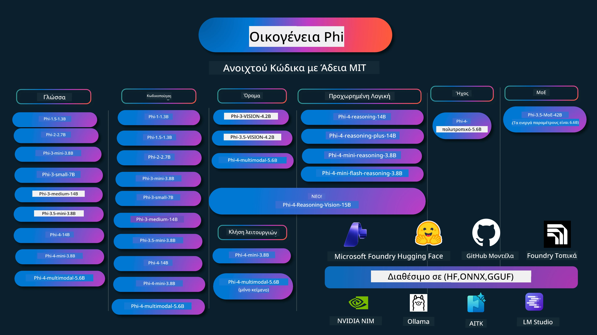

# Phi Cookbook: Παραδείγματα με Πρακτική Εφαρμογή με τα Μοντέλα Phi της Microsoft

[](https://codespaces.new/microsoft/phicookbook)
[](https://vscode.dev/redirect?url=vscode://ms-vscode-remote.remote-containers/cloneInVolume?url=https://github.com/microsoft/phicookbook)

[](https://GitHub.com/microsoft/phicookbook/graphs/contributors/?WT.mc_id=aiml-137032-kinfeylo)
[](https://GitHub.com/microsoft/phicookbook/issues/?WT.mc_id=aiml-137032-kinfeylo)
[](https://GitHub.com/microsoft/phicookbook/pulls/?WT.mc_id=aiml-137032-kinfeylo)
[](http://makeapullrequest.com?WT.mc_id=aiml-137032-kinfeylo)

[](https://GitHub.com/microsoft/phicookbook/watchers/?WT.mc_id=aiml-137032-kinfeylo)
[](https://GitHub.com/microsoft/phicookbook/network/?WT.mc_id=aiml-137032-kinfeylo)
[](https://GitHub.com/microsoft/phicookbook/stargazers/?WT.mc_id=aiml-137032-kinfeylo)

[](https://discord.com/invite/ByRwuEEgH4)

Το Phi είναι μια σειρά ανοικτών μοντέλων τεχνητής νοημοσύνης που αναπτύχθηκαν από τη Microsoft. 

Το Phi είναι αυτή τη στιγμή το πιο ισχυρό και οικονομικά αποδοτικό μικρό μοντέλο γλώσσας (SLM), με πολύ καλά benchmarks σε πολυγλωσσικά, λογική, παραγωγή κειμένου/συνομιλίας, κωδικοποίηση, εικόνες, ήχο και άλλα σενάρια. 

Μπορείτε να αναπτύξετε το Phi στο cloud ή σε συσκευές άκρης, και μπορείτε εύκολα να χτίσετε εφαρμογές γεννητικής AI με περιορισμένη υπολογιστική ισχύ.

Ακολουθήστε αυτά τα βήματα για να ξεκινήσετε με τη χρήση αυτού του πόρου:
1. **Fork το Αποθετήριο**: Κάντε κλικ [](https://GitHub.com/microsoft/phicookbook/network/?WT.mc_id=aiml-137032-kinfeylo)
2. **Κλωνοποιήστε το Αποθετήριο**: `git clone https://github.com/microsoft/PhiCookBook.git`
3. [**Εγγραφείτε στην Κοινότητα Microsoft AI στο Discord και συναντήστε ειδικούς και άλλους προγραμματιστές**](https://discord.com/invite/ByRwuEEgH4?WT.mc_id=aiml-137032-kinfeylo)



### 🌐 Υποστήριξη Πολλών Γλωσσών

#### Υποστηρίζεται μέσω GitHub Action (Αυτοματοποιημένο και Πάντα Ενημερωμένο)

<!-- CO-OP TRANSLATOR LANGUAGES TABLE START -->
[Αραβικά](../ar/README.md) | [Βεγγαλικά](../bn/README.md) | [Βουλγαρικά](../bg/README.md) | [Βιρμανικά (Μιανμάρ)](../my/README.md) | [Κινέζικα (Απλοποιημένα)](../zh-CN/README.md) | [Κινέζικα (Παραδοσιακά, Χονγκ Κονγκ)](../zh-HK/README.md) | [Κινέζικα (Παραδοσιακά, Μακάο)](../zh-MO/README.md) | [Κινέζικα (Παραδοσιακά, Ταϊβάν)](../zh-TW/README.md) | [Κροατικά](../hr/README.md) | [Τσέχικα](../cs/README.md) | [Δανέζικα](../da/README.md) | [Ολλανδικά](../nl/README.md) | [Εσθονικά](../et/README.md) | [Φινλανδικά](../fi/README.md) | [Γαλλικά](../fr/README.md) | [Γερμανικά](../de/README.md) | [Ελληνικά](./README.md) | [Εβραϊκά](../he/README.md) | [Χίντι](../hi/README.md) | [Ουγγρικά](../hu/README.md) | [Ινδονησιακά](../id/README.md) | [Ιταλικά](../it/README.md) | [Ιαπωνικά](../ja/README.md) | [Κανάντα](../kn/README.md) | [Χμερ](../km/README.md) | [Κορεατικά](../ko/README.md) | [Λιθουανικά](../lt/README.md) | [Μαλάι](../ms/README.md) | [Μαλαγιάλαμ](../ml/README.md) | [Μαραθικά](../mr/README.md) | [Νεπαλικά](../ne/README.md) | [Νιγηριανή Πίνγκιν](../pcm/README.md) | [Νορβηγικά](../no/README.md) | [Περσικά (Φαρσί)](../fa/README.md) | [Πολωνικά](../pl/README.md) | [Πορτογαλικά (Βραζιλία)](../pt-BR/README.md) | [Πορτογαλικά (Πορτογαλία)](../pt-PT/README.md) | [Πουντζάμπι (Gurmukhi)](../pa/README.md) | [Ρουμανικά](../ro/README.md) | [Ρωσικά](../ru/README.md) | [Σερβικά (Κυριλλικά)](../sr/README.md) | [Σλοβακικά](../sk/README.md) | [Σλοβενικά](../sl/README.md) | [Ισπανικά](../es/README.md) | [Σουαχίλι](../sw/README.md) | [Σουηδικά](../sv/README.md) | [Ταγκαλόγκ (Φιλιππινέζικα)](../tl/README.md) | [Ταμίλ](../ta/README.md) | [Τελούγκου](../te/README.md) | [Ταϊλανδικά](../th/README.md) | [Τουρκικά](../tr/README.md) | [Ουκρανικά](../uk/README.md) | [Ουρντού](../ur/README.md) | [Βιετναμέζικα](../vi/README.md)

> **Προτιμάτε να κλωνοποιήσετε τοπικά;**
>
> Αυτό το αποθετήριο περιλαμβάνει πάνω από 50 μεταφράσεις γλωσσών που αυξάνουν σημαντικά το μέγεθος λήψης. Για να κλωνοποιήσετε χωρίς μεταφράσεις, χρησιμοποιήστε sparse checkout:
>
> **Bash / macOS / Linux:**
> ```bash
> git clone --filter=blob:none --sparse https://github.com/microsoft/PhiCookBook.git
> cd PhiCookBook
> git sparse-checkout set --no-cone '/*' '!translations' '!translated_images'
> ```
>
> **CMD (Windows):**
> ```cmd
> git clone --filter=blob:none --sparse https://github.com/microsoft/PhiCookBook.git
> cd PhiCookBook
> git sparse-checkout set --no-cone "/*" "!translations" "!translated_images"
> ```
>
> Αυτό σας δίνει όλα όσα χρειάζεστε για να ολοκληρώσετε το μάθημα με πολύ πιο γρήγορη λήψη.
<!-- CO-OP TRANSLATOR LANGUAGES TABLE END -->

## Περιεχόμενα

- Εισαγωγή
  - [Καλωσορίσατε στην Οικογένεια Phi](./md/01.Introduction/01/01.PhiFamily.md)
  - [Εγκατάσταση περιβάλλοντος](./md/01.Introduction/01/01.EnvironmentSetup.md)
  - [Κατανόηση των Κύριων Τεχνολογιών](./md/01.Introduction/01/01.Understandingtech.md)
  - [Ασφάλεια Τεχνητής Νοημοσύνης για τα Μοντέλα Phi](./md/01.Introduction/01/01.AISafety.md)
  - [Υποστήριξη Υλικού Phi](./md/01.Introduction/01/01.Hardwaresupport.md)
  - [Μοντέλα Phi & Διαθεσιμότητα σε πλατφόρμες](./md/01.Introduction/01/01.Edgeandcloud.md)
  - [Χρήση Guidance-ai και Phi](./md/01.Introduction/01/01.Guidance.md)
  - [Μοντέλα GitHub Marketplace](https://github.com/marketplace/models)
  - [Κατάλογος Μοντέλων Azure AI](https://ai.azure.com)

- Εκτέλεση Phi σε διαφορετικά περιβάλλοντα
    -  [Hugging face](./md/01.Introduction/02/01.HF.md)
    -  [Μοντέλα GitHub](./md/01.Introduction/02/02.GitHubModel.md)
    -  [Κατάλογος Μοντέλων Microsoft Foundry](./md/01.Introduction/02/03.AzureAIFoundry.md)
    -  [Ollama](./md/01.Introduction/02/04.Ollama.md)
    -  [AI Toolkit VSCode (AITK)](./md/01.Introduction/02/05.AITK.md)
    -  [NVIDIA NIM](./md/01.Introduction/02/06.NVIDIA.md)
    -  [Foundry Local](./md/01.Introduction/02/07.FoundryLocal.md)

- Εκτέλεση Φι στην Οικογένεια Phi
    - [Εκτέλεση Phi σε iOS](./md/01.Introduction/03/iOS_Inference.md)
    - [Εκτέλεση Phi σε Android](./md/01.Introduction/03/Android_Inference.md)
    - [Εκτέλεση Phi σε Jetson](./md/01.Introduction/03/Jetson_Inference.md)
    - [Εκτέλεση Phi σε AI PC](./md/01.Introduction/03/AIPC_Inference.md)
    - [Εκτέλεση Phi με το Πλαίσιο Apple MLX](./md/01.Introduction/03/MLX_Inference.md)
    - [Εκτέλεση Phi σε τοπικό διακομιστή](./md/01.Introduction/03/Local_Server_Inference.md)
    - [Εκτέλεση Phi σε απομακρυσμένο διακομιστή χρησιμοποιώντας το AI Toolkit](./md/01.Introduction/03/Remote_Interence.md)
    - [Εκτέλεση Phi με Rust](./md/01.Introduction/03/Rust_Inference.md)
    - [Εκτέλεση Phi--Vision τοπικά](./md/01.Introduction/03/Vision_Inference.md)
    - [Εκτέλεση Phi με Kaito AKS, Azure Containers (επίσημη υποστήριξη)](./md/01.Introduction/03/Kaito_Inference.md)
-  [Ποσοτικοποίηση της Οικογένειας Phi](./md/01.Introduction/04/QuantifyingPhi.md)
    - [Ποσοτικοποίηση Phi-3.5 / 4 με χρήση llama.cpp](./md/01.Introduction/04/UsingLlamacppQuantifyingPhi.md)
    - [Ποσοτικοποίηση Phi-3.5 / 4 με χρήση επεκτάσεων Generative AI για onnxruntime](./md/01.Introduction/04/UsingORTGenAIQuantifyingPhi.md)
    - [Ποσοτικοποίηση Phi-3.5 / 4 με χρήση Intel OpenVINO](./md/01.Introduction/04/UsingIntelOpenVINOQuantifyingPhi.md)
    - [Ποσοτικοποίηση Phi-3.5 / 4 με χρήση του Πλαισίου Apple MLX](./md/01.Introduction/04/UsingAppleMLXQuantifyingPhi.md)

-  Αξιολόγηση Phi
    - [Υπεύθυνη AI](./md/01.Introduction/05/ResponsibleAI.md)
    - [Microsoft Foundry για Αξιολόγηση](./md/01.Introduction/05/AIFoundry.md)
    - [Χρήση Promptflow για Αξιολόγηση](./md/01.Introduction/05/Promptflow.md)
 
- RAG με Azure AI Search
    - [Πώς να χρησιμοποιήσετε το Phi-4-mini και το Phi-4-multimodal (RAG) με το Azure AI Search](https://github.com/microsoft/PhiCookBook/blob/main/code/06.E2E/E2E_Phi-4-RAG-Azure-AI-Search.ipynb)

- Παραδείγματα ανάπτυξης εφαρμογών Phi
  - Εφαρμογές Κειμένου & Συνομιλίας
    - Δείγματα Phi-4 
      - [📓] [Συνομιλία με το Μοντέλο Phi-4-mini ONNX](./md/02.Application/01.TextAndChat/Phi4/ChatWithPhi4ONNX/README.md)
      - [Συνομιλία με το τοπικό μοντέλο Phi-4 ONNX .NET](../../md/04.HOL/dotnet/src/LabsPhi4-Chat-01OnnxRuntime)
      - [Συνομιλία εφαρμογής κονσόλας .NET με Phi-4 ONNX χρησιμοποιώντας Semantic Kernel](../../md/04.HOL/dotnet/src/LabsPhi4-Chat-02SK)
    - Δείγματα Phi-3 / 3.5
      - [Τοπικός chatbot στον περιηγητή χρησιμοποιώντας Phi3, ONNX Runtime Web και WebGPU](https://github.com/microsoft/onnxruntime-inference-examples/tree/main/js/chat)
      - [OpenVino Chat](./md/02.Application/01.TextAndChat/Phi3/E2E_OpenVino_Chat.md)
      - [Πολλαπλό Μοντέλο - Διαδραστικό Phi-3-mini και OpenAI Whisper](./md/02.Application/01.TextAndChat/Phi3/E2E_Phi-3-mini_with_whisper.md)
      - [MLFlow - Δημιουργία wrapper και χρήση του Phi-3 με MLFlow](./md//02.Application/01.TextAndChat/Phi3/E2E_Phi-3-MLflow.md)
      - [Βελτιστοποίηση Μοντέλου - Πώς να βελτιστοποιήσετε το μοντέλο Phi-3-min για ONNX Runtime Web με Olive](https://github.com/microsoft/Olive/tree/main/examples/phi3)
      - [WinUI3 Εφαρμογή με Phi-3 mini-4k-instruct-onnx](https://github.com/microsoft/Phi3-Chat-WinUI3-Sample/)
      -[Δείγμα εφαρμογής Σημειώσεων με πολλαπλά μοντέλα WinUI3 με τεχνητή νοημοσύνη](https://github.com/microsoft/ai-powered-notes-winui3-sample)
      - [Λεπτομερής εκπαίδευση και ενσωμάτωση προσαρμοσμένων μοντέλων Phi-3 με Prompt flow](./md/02.Application/01.TextAndChat/Phi3/E2E_Phi-3-FineTuning_PromptFlow_Integration.md)
      - [Λεπτομερής εκπαίδευση και ενσωμάτωση προσαρμοσμένων μοντέλων Phi-3 με Prompt flow στο Microsoft Foundry](./md/02.Application/01.TextAndChat/Phi3/E2E_Phi-3-FineTuning_PromptFlow_Integration_AIFoundry.md)
      - [Αξιολόγηση του λεπτομερώς εκπαιδευμένου μοντέλου Phi-3 / Phi-3.5 στο Microsoft Foundry με έμφαση στις Αρχές Υπεύθυνης AI της Microsoft](./md/02.Application/01.TextAndChat/Phi3/E2E_Phi-3-Evaluation_AIFoundry.md)
      - [📓] [Δείγμα πρόβλεψης γλώσσας Phi-3.5-mini-instruct (Κινέζικα/Αγγλικά)](./md/02.Application/01.TextAndChat/Phi3/phi3-instruct-demo.ipynb)
      - [Phi-3.5-Instruct WebGPU RAG Chatbot](./md/02.Application/01.TextAndChat/Phi3/WebGPUWithPhi35Readme.md)
      - [Χρήση Windows GPU για δημιουργία λύσης Prompt flow με Phi-3.5-Instruct ONNX](./md/02.Application/01.TextAndChat/Phi3/UsingPromptFlowWithONNX.md)
      - [Χρήση Microsoft Phi-3.5 tflite για δημιουργία εφαρμογής Android](./md/02.Application/01.TextAndChat/Phi3/UsingPhi35TFLiteCreateAndroidApp.md)
      - [Q&A .NET Παράδειγμα χρήσης τοπικού μοντέλου ONNX Phi-3 με το Microsoft.ML.OnnxRuntime](../../md/04.HOL/dotnet/src/LabsPhi301)
      - [Κονσόλα συνομιλίας .NET εφαρμογή με Semantic Kernel και Phi-3](../../md/04.HOL/dotnet/src/LabsPhi302)

  - Δείγματα Κώδικα Βασισμένα σε Azure AI Inference SDK
    - Δείγματα Phi-4
      - [📓] [Δημιουργήστε κώδικα έργου χρησιμοποιώντας Phi-4-multimodal](./md/02.Application/02.Code/Phi4/GenProjectCode/README.md)
    - Δείγματα Phi-3 / 3.5
      - [Δημιουργήστε το δικό σας Visual Studio Code GitHub Copilot Chat με την οικογένεια Microsoft Phi-3](./md/02.Application/02.Code/Phi3/VSCodeExt/README.md)
      - [Δημιουργήστε τον δικό σας Visual Studio Code Chat Copilot Agent με Phi-3.5 από μοντέλα GitHub](/md/02.Application/02.Code/Phi3/CreateVSCodeChatAgentWithGitHubModels.md)

  - Δείγματα Προχωρημένης Λογικής
    - Δείγματα Phi-4
      - [📓] [Δείγματα Phi-4-mini-reasoning ή Phi-4-reasoning](./md/02.Application/03.AdvancedReasoning/Phi4/AdvancedResoningPhi4mini/README.md)
      - [📓] [Λεπτομερής εκπαίδευση Phi-4-mini-reasoning με Microsoft Olive](./md/02.Application/03.AdvancedReasoning/Phi4/AdvancedResoningPhi4mini/olive_ft_phi_4_reasoning_with_medicaldata.ipynb)
      - [📓] [Λεπτομερής εκπαίδευση Phi-4-mini-reasoning με Apple MLX](./md/02.Application/03.AdvancedReasoning/Phi4/AdvancedResoningPhi4mini/mlx_ft_phi_4_reasoning_with_medicaldata.ipynb)
      - [📓] [Phi-4-mini-reasoning με μοντέλα GitHub](./md/02.Application/02.Code/Phi4r/github_models_inference.ipynb)
      - [📓] [Phi-4-mini-reasoning με μοντέλα Microsoft Foundry](./md/02.Application/02.Code/Phi4r/azure_models_inference.ipynb)
  - Επιδείξεις
      - [Phi-4-mini επιδείξεις φιλοξενούμενες στο Hugging Face Spaces](https://huggingface.co/spaces/microsoft/phi-4-mini?WT.mc_id=aiml-137032-kinfeylo)
      - [Phi-4-multimodal επιδείξεις φιλοξενούμενες στο Hugging Face Spaces](https://huggingface.co/spaces/microsoft/phi-4-multimodal?WT.mc_id=aiml-137032-kinfeylo)
  - Δείγματα Όρασης
    - Δείγματα Phi-4
      - [📓] [Χρήση Phi-4-multimodal για ανάγνωση εικόνων και δημιουργία κώδικα](./md/02.Application/04.Vision/Phi4/CreateFrontend/README.md)
    - Δείγματα Phi-3 / 3.5
      -  [📓][Phi-3-όραση - μετατροπή κειμένου εικόνας σε κείμενο](./md/02.Application/04.Vision/Phi3/E2E_Phi-3-vision-image-text-to-text-online-endpoint.ipynb)
      - [Phi-3-όραση-ONNX](https://onnxruntime.ai/docs/genai/tutorials/phi3-v.html)
      - [📓][Phi-3-όραση CLIP Embedding](./md/02.Application/04.Vision/Phi3/E2E_Phi-3-vision-image-text-to-text-online-endpoint.ipynb)
      - [ΕΠΙΔΕΙΞΗ: Phi-3 Ανακύκλωση](https://github.com/jennifermarsman/PhiRecycling/)
      - [Phi-3-όραση - Βοηθός οπτικής γλώσσας - με Phi3-Vision και OpenVINO](https://docs.openvino.ai/nightly/notebooks/phi-3-vision-with-output.html)
      - [Phi-3 Όραση Nvidia NIM](./md/02.Application/04.Vision/Phi3/E2E_Nvidia_NIM_Vision.md)
      - [Phi-3 Όραση OpenVino](./md/02.Application/04.Vision/Phi3/E2E_OpenVino_Phi3Vision.md)
      - [📓][Phi-3.5 Όραση παράδειγμα πολλαπλών καρέ ή πολλαπλών εικόνων](./md/02.Application/04.Vision/Phi3/phi3-vision-demo.ipynb)
      - [Phi-3 Όραση Τοπικό μοντέλο ONNX χρησιμοποιώντας το Microsoft.ML.OnnxRuntime .NET](../../md/04.HOL/dotnet/src/LabsPhi303)
      - [Μενού βασισμένο τοπικό μοντέλο ONNX Phi-3 Όραση χρησιμοποιώντας το Microsoft.ML.OnnxRuntime .NET](../../md/04.HOL/dotnet/src/LabsPhi304)

  - Δείγματα Λογικής-Όρασης
    - Phi-4-Λογική-Όραση-15B
      - [📓] [Χρήση Phi-4-Λογικής-Όρασης-15B για ανίχνευση παράνομης διάσχισης δρόμου](./md/02.Application/10.ReasoningVision/Phi_4_reasoning_vision_15b_Jaywalking.ipynb)
      - [📓] [Χρήση Phi-4-Λογικής-Όρασης-15B στα μαθηματικά](./md/02.Application/10.ReasoningVision/Phi_4_reasoning_vision_15b_Math.ipynb)
      - [📓] [Χρήση Phi-4-Λογικής-Όρασης-15B για ανίχνευση UI](./md/02.Application/10.ReasoningVision/Phi_4_reasoning_vision_15b_ui.ipynb)

  - Δείγματα Μαθηματικών
    -  Φύλλο εργασίας Φλας Λογικής Phi-4-Mini-Instruct [Επίδειξη Μαθηματικών με Phi-4-Mini-Flash-Reasoning-Instruct](./md/02.Application/09.Math/MathDemo.ipynb)

  - Δείγματα Ήχου
    - Δείγματα Phi-4
      - [📓] [Εξαγωγή μεταγραφών ήχου χρησιμοποιώντας Phi-4-multimodal](./md/02.Application/05.Audio/Phi4/Transciption/README.md)
      - [📓] [Δείγμα ήχου Phi-4-multimodal](./md/02.Application/05.Audio/Phi4/Siri/demo.ipynb)
      - [📓] [Δείγμα μετάφρασης ομιλίας Phi-4-multimodal](./md/02.Application/05.Audio/Phi4/Translate/demo.ipynb)
      - [.NET κονσολική εφαρμογή που χρησιμοποιεί Phi-4-multimodal Audio για ανάλυση αρχείου ήχου και δημιουργία μεταγραφής](../../md/04.HOL/dotnet/src/LabsPhi4-MultiModal-02Audio)

  - Δείγματα MOE
    - Δείγματα Phi-3 / 3.5
      - [📓] [Μείγμα Μοντέλων Ειδικών (MoEs) Phi-3.5 Δείγμα Κοινωνικών Μέσων](./md/02.Application/06.MoE/Phi3/phi3_moe_demo.ipynb)
      - [📓] [Δημιουργία Pipeline Παραγωγής Ενισχυμένης Ανάκτησης (RAG) με NVIDIA NIM Phi-3 MOE, Azure AI Search και LlamaIndex](./md/02.Application/06.MoE/Phi3/azure-ai-search-nvidia-rag.ipynb)
      - 
  - Δείγματα Κλήσεων Λειτουργιών
    - Δείγματα Phi-4 🆕
      -  [📓] [Χρήση Κλήσεων Λειτουργιών με Phi-4-mini](./md/02.Application/07.FunctionCalling/Phi4/FunctionCallingBasic/README.md)
      -  [📓] [Χρήση Κλήσεων Λειτουργιών για δημιουργία πολλαπλών πρακτόρων με Phi-4-mini](./md/02.Application/07.FunctionCalling/Phi4/Multiagents/Phi_4_mini_multiagent.ipynb)
      -  [📓] [Χρήση Κλήσεων Λειτουργιών με Ollama](./md/02.Application/07.FunctionCalling/Phi4/Ollama/ollama_functioncalling.ipynb)
      -  [📓] [Χρήση Κλήσεων Λειτουργιών με ONNX](./md/02.Application/07.FunctionCalling/Phi4/ONNX/onnx_parallel_functioncalling.ipynb)
  - Δείγματα Μικτής Πολυμορφίας
    - Δείγματα Phi-4 🆕
      -  [📓] [Χρήση Phi-4-multimodal ως τεχνολογικός δημοσιογράφος](./md/02.Application/08.Multimodel/Phi4/TechJournalist/phi_4_mm_audio_text_publish_news.ipynb)
      - [.NET κονσολική εφαρμογή που χρησιμοποιεί Phi-4-multimodal για ανάλυση εικόνων](../../md/04.HOL/dotnet/src/LabsPhi4-MultiModal-01Images)

- Λεπτομερής Εκπαίδευση Δειγμάτων Phi
  - [Σενάρια Λεπτομερούς Εκπαίδευσης](./md/03.FineTuning/FineTuning_Scenarios.md)
  - [Λεπτομερής Εκπαίδευση έναντι RAG](./md/03.FineTuning/FineTuning_vs_RAG.md)
  - [Αφήστε το Phi-3 να γίνει ειδικός της βιομηχανίας με λεπτομερή εκπαίδευση](./md/03.FineTuning/LetPhi3gotoIndustriy.md)
  - [Λεπτομερής Εκπαίδευση Phi-3 με το AI Toolkit για VS Code](./md/03.FineTuning/Finetuning_VSCodeaitoolkit.md)
  - [Λεπτομερής Εκπαίδευση Phi-3 με την Υπηρεσία Azure Machine Learning](./md/03.FineTuning/Introduce_AzureML.md)
  - [Λεπτομερής Εκπαίδευση Phi-3 με Lora](./md/03.FineTuning/FineTuning_Lora.md)
  - [Λεπτομερής Εκπαίδευση Phi-3 με QLora](./md/03.FineTuning/FineTuning_Qlora.md)
  - [Λεπτομερής Εκπαίδευση Phi-3 με Microsoft Foundry](./md/03.FineTuning/FineTuning_AIFoundry.md)
  - [Λεπτομερής Εκπαίδευση Phi-3 με Azure ML CLI/SDK](./md/03.FineTuning/FineTuning_MLSDK.md)
  - [Λεπτομερής Εκπαίδευση με Microsoft Olive](./md/03.FineTuning/FineTuning_MicrosoftOlive.md)
  - [Πρακτικό εργαστήριο λεπτομερούς εκπαίδευσης με Microsoft Olive](./md/03.FineTuning/olive-lab/readme.md)
  - [Λεπτομερής Εκπαίδευση Phi-3-vision με Weights and Bias](./md/03.FineTuning/FineTuning_Phi-3-visionWandB.md)
  - [Λεπτομερής Εκπαίδευση Phi-3 με Apple MLX Framework](./md/03.FineTuning/FineTuning_MLX.md)
  - [Λεπτομερής Εκπαίδευση Phi-3-vision (επίσημη υποστήριξη)](./md/03.FineTuning/FineTuning_Vision.md)
  - [Βελτιστοποίηση Phi-3 με Kaito AKS, Azure Containers(επίσημη Υποστήριξη)](./md/03.FineTuning/FineTuning_Kaito.md)
  - [Βελτιστοποίηση Phi-3 και 3.5 Vision](https://github.com/2U1/Phi3-Vision-Finetune)

- Εργαστηριακή Εξάσκηση
  - [Εξερεύνηση προηγμένων μοντέλων: LLMs, SLMs, τοπική ανάπτυξη και άλλα](https://github.com/microsoft/aitour-exploring-cutting-edge-models)
  - [Δενδροκοπία Δυνατοτήτων NLP: Βελτιστοποίηση με Microsoft Olive](https://github.com/azure/Ignite_FineTuning_workshop)

- Ακαδημαϊκά Ερευνητικά Άρθρα και Δημοσιεύσεις
  - [Τα Βιβλία Ειναι Όλα Όσα Χρειάζεστε ΙΙ: τεχνική αναφορά phi-1.5](https://arxiv.org/abs/2309.05463)
  - [Τεχνική Αναφορά Phi-3: Ένα Ισχυρό Μοντέλο Γλώσσας Τοπικά στο Τηλέφωνό Σας](https://arxiv.org/abs/2404.14219)
  - [Τεχνική Αναφορά Phi-4](https://arxiv.org/abs/2412.08905)
  - [Τεχνική Αναφορά Phi-4-Mini: Συμπαγή αλλά Ισχυρά Πολυμορφικά Μοντέλα Γλώσσας μέσω Μείγματος LoRAs](https://arxiv.org/abs/2503.01743)
  - [Βελτιστοποίηση Μικρών Μοντέλων Γλώσσας για Κλήσεις Λειτουργιών Εντός Οχήματος](https://arxiv.org/abs/2501.02342)
  - [(WhyPHI) Βελτιστοποίηση PHI-3 για Απαντήσεις Πολλαπλής Επιλογής: Μεθοδολογία, Αποτελέσματα και Προκλήσεις](https://arxiv.org/abs/2501.01588)
  - [Τεχνική Αναφορά Συλλογισμού Phi-4](https://www.microsoft.com/en-us/research/wp-content/uploads/2025/04/phi_4_reasoning.pdf)
  - [Τεχνική Αναφορά Συλλογισμού Phi-4-mini](https://huggingface.co/microsoft/Phi-4-mini-reasoning/blob/main/Phi-4-Mini-Reasoning.pdf)

## Χρήση Μοντέλων Phi

### Phi στο Microsoft Foundry

Μπορείτε να μάθετε πώς να χρησιμοποιείτε το Microsoft Phi και πώς να δημιουργείτε ολοκληρωμένες λύσεις στα διάφορα υλικά σας. Για να ζήσετε την εμπειρία με το Phi, ξεκινήστε παίζοντας με τα μοντέλα και προσαρμόζοντας το Phi για τα σενάριά σας χρησιμοποιώντας τον [Κατάλογο Μοντέλων Azure AI Microsoft Foundry](https://aka.ms/phi3-azure-ai). Μπορείτε να μάθετε περισσότερα στο Ξεκινώντας με το [Microsoft Foundry](/md/02.QuickStart/AzureAIFoundry_QuickStart.md)

**Παιχνιδότοπος**
Κάθε μοντέλο διαθέτει έναν αφιερωμένο παιχνιδότοπο για να δοκιμάσετε το μοντέλο [Azure AI Playground](https://aka.ms/try-phi3).

### Phi στα Μοντέλα GitHub

Μπορείτε να μάθετε πώς να χρησιμοποιείτε το Microsoft Phi και πώς να δημιουργείτε ολοκληρωμένες λύσεις στα διάφορα υλικά σας. Για να ζήσετε την εμπειρία με το Phi, ξεκινήστε παίζοντας με το μοντέλο και προσαρμόζοντας το Phi για τα σενάριά σας χρησιμοποιώντας τον [Κατάλογο Μοντέλων GitHub](https://github.com/marketplace/models?WT.mc_id=aiml-137032-kinfeylo). Μπορείτε να μάθετε περισσότερα στο Ξεκινώντας με τον [Κατάλογο Μοντέλων GitHub](/md/02.QuickStart/GitHubModel_QuickStart.md)

**Παιχνιδότοπος**  
Κάθε μοντέλο έχει έναν αφιερωμένο [παιχνιδότοπο για να δοκιμάσετε το μοντέλο](/md/02.QuickStart/GitHubModel_QuickStart.md).

### Phi στο Hugging Face

Μπορείτε επίσης να βρείτε το μοντέλο στο [Hugging Face](https://huggingface.co/microsoft)

**Παιχνιδότοπος**  
[Hugging Chat playground](https://huggingface.co/chat/models/microsoft/Phi-3-mini-4k-instruct)

 ## 🎒 Άλλα Μαθήματα

Η ομάδα μας παράγει και άλλα μαθήματα! Δείτε:

<!-- CO-OP TRANSLATOR OTHER COURSES START -->
### LangChain  
[](https://aka.ms/langchain4j-for-beginners)  
[](https://aka.ms/langchainjs-for-beginners?WT.mc_id=m365-94501-dwahlin)  
[](https://github.com/microsoft/langchain-for-beginners?WT.mc_id=m365-94501-dwahlin)  
---

### Azure / Edge / MCP / Agents  
[](https://github.com/microsoft/AZD-for-beginners?WT.mc_id=academic-105485-koreyst)  
[](https://github.com/microsoft/edgeai-for-beginners?WT.mc_id=academic-105485-koreyst)  
[](https://github.com/microsoft/mcp-for-beginners?WT.mc_id=academic-105485-koreyst)  
[](https://github.com/microsoft/ai-agents-for-beginners?WT.mc_id=academic-105485-koreyst)  

---

### Σειρά Γενετικής Τεχνητής Νοημοσύνης  
[](https://github.com/microsoft/generative-ai-for-beginners?WT.mc_id=academic-105485-koreyst)  
[-9333EA?style=for-the-badge&labelColor=E5E7EB&color=9333EA)](https://github.com/microsoft/Generative-AI-for-beginners-dotnet?WT.mc_id=academic-105485-koreyst)  
[-C084FC?style=for-the-badge&labelColor=E5E7EB&color=C084FC)](https://github.com/microsoft/generative-ai-for-beginners-java?WT.mc_id=academic-105485-koreyst)  
[-E879F9?style=for-the-badge&labelColor=E5E7EB&color=E879F9)](https://github.com/microsoft/generative-ai-with-javascript?WT.mc_id=academic-105485-koreyst)  

---

### Πυρήνας Μάθησης  
[](https://aka.ms/ml-beginners?WT.mc_id=academic-105485-koreyst)  
[](https://aka.ms/datascience-beginners?WT.mc_id=academic-105485-koreyst)  
[](https://aka.ms/ai-beginners?WT.mc_id=academic-105485-koreyst)  
[](https://github.com/microsoft/Security-101?WT.mc_id=academic-96948-sayoung)  
[](https://aka.ms/webdev-beginners?WT.mc_id=academic-105485-koreyst)  
[](https://aka.ms/iot-beginners?WT.mc_id=academic-105485-koreyst)  
[](https://github.com/microsoft/xr-development-for-beginners?WT.mc_id=academic-105485-koreyst)  

---

### Σειρά Copilot  
[](https://aka.ms/GitHubCopilotAI?WT.mc_id=academic-105485-koreyst)  
[](https://github.com/microsoft/mastering-github-copilot-for-dotnet-csharp-developers?WT.mc_id=academic-105485-koreyst)  
[](https://github.com/microsoft/CopilotAdventures?WT.mc_id=academic-105485-koreyst)  
<!-- CO-OP TRANSLATOR OTHER COURSES END -->

## Υπεύθυνη Τεχνητή Νοημοσύνη

Η Microsoft δεσμεύεται να βοηθάει τους πελάτες της να χρησιμοποιούν τα προϊόντα ΤΝ υπεύθυνα, μοιράζοντας τα μαθήματα που έχουμε μάθει και χτίζοντας συνεργασίες βασισμένες στην εμπιστοσύνη μέσω εργαλείων όπως Σημειώσεις Διαφάνειας και Αξιολογήσεις Επιπτώσεων. Πολλοί από αυτούς τους πόρους είναι διαθέσιμοι στο [https://aka.ms/RAI](https://aka.ms/RAI).  
Η προσέγγιση της Microsoft για την υπεύθυνη ΤΝ βασίζεται στις αρχές μας για την ΤΝ που είναι η δικαιοσύνη, η αξιοπιστία και ασφάλεια, η προστασία της ιδιωτικότητας και η ασφάλεια, η συμπερίληψη, η διαφάνεια και η λογοδοσία.

Τα μεγάλα μοντέλα φυσικής γλώσσας, εικόνας και ομιλίας - όπως αυτά που χρησιμοποιούνται σε αυτό το δείγμα - μπορούν να συμπεριφερθούν με τρόπους που είναι άδικοι, αναξιόπιστοι ή προσβλητικοί, κάτι που μπορεί να προκαλέσει βλάβες. Παρακαλούμε συμβουλευτείτε τη [Σημείωση Διαφάνειας της υπηρεσίας Azure OpenAI](https://learn.microsoft.com/legal/cognitive-services/openai/transparency-note?tabs=text) για να ενημερωθείτε σχετικά με τους κινδύνους και περιορισμούς.
Η συνιστώμενη προσέγγιση για την αντιμετώπιση αυτών των κινδύνων είναι η ένταξη ενός συστήματος ασφαλείας στην αρχιτεκτονική σας που μπορεί να ανιχνεύει και να αποτρέπει επιβλαβείς συμπεριφορές. Το [Azure AI Content Safety](https://learn.microsoft.com/azure/ai-services/content-safety/overview) παρέχει ένα ανεξάρτητο επίπεδο προστασίας, ικανό να ανιχνεύει επιβλαβές περιεχόμενο που δημιουργείται από χρήστες και AI σε εφαρμογές και υπηρεσίες. Το Azure AI Content Safety περιλαμβάνει API για κείμενο και εικόνα που σας επιτρέπουν να εντοπίζετε υλικό που είναι επιβλαβές. Μέσα στο Microsoft Foundry, η υπηρεσία Content Safety σας επιτρέπει να βλέπετε, να εξερευνάτε και να δοκιμάζετε δείγματα κώδικα για την ανίχνευση επιβλαβούς περιεχομένου σε διάφορες μορφές. Η ακόλουθη [τεκμηρίωση γρήγορης εκκίνησης](https://learn.microsoft.com/azure/ai-services/content-safety/quickstart-text?tabs=visual-studio%2Clinux&pivots=programming-language-rest) σας καθοδηγεί στη δημιουργία αιτημάτων προς την υπηρεσία.

Ένας ακόμη παράγοντας που πρέπει να ληφθεί υπόψη είναι η συνολική απόδοση της εφαρμογής. Σε εφαρμογές πολυτροπικές και πολυμοντέλων, θεωρούμε ότι η απόδοση σημαίνει ότι το σύστημα λειτουργεί όπως εσείς και οι χρήστες σας περιμένετε, συμπεριλαμβανομένου να μην παράγει επιβλαβή αποτελέσματα. Είναι σημαντικό να αξιολογήσετε την απόδοση της συνολικής εφαρμογής σας χρησιμοποιώντας τους [αξιολογητές Απόδοσης, Ποιότητας, Κινδύνου και Ασφάλειας](https://learn.microsoft.com/azure/ai-studio/concepts/evaluation-metrics-built-in). Επιπλέον, έχετε τη δυνατότητα να δημιουργήσετε και να αξιολογήσετε με [προσαρμοσμένους αξιολογητές](https://learn.microsoft.com/azure/ai-studio/how-to/develop/evaluate-sdk#custom-evaluators).

Μπορείτε να αξιολογήσετε την AI εφαρμογή σας στο περιβάλλον ανάπτυξής σας χρησιμοποιώντας το [Azure AI Evaluation SDK](https://microsoft.github.io/promptflow/index.html). Είτε με ένα σύνολο δεδομένων δοκιμής είτε με έναν στόχο, οι γεννήτριες της εφαρμογής τεχνητής νοημοσύνης σας μετρώνται ποσοτικά με ενσωματωμένους ή προσαρμοσμένους αξιολογητές της επιλογής σας. Για να ξεκινήσετε με το azure ai evaluation sdk και να αξιολογήσετε το σύστημά σας, μπορείτε να ακολουθήσετε τον [οδηγό γρήγορης εκκίνησης](https://learn.microsoft.com/azure/ai-studio/how-to/develop/flow-evaluate-sdk). Αφού εκτελέσετε έναν κύκλο αξιολόγησης, μπορείτε να [οπτικοποιήσετε τα αποτελέσματα στο Microsoft Foundry](https://learn.microsoft.com/azure/ai-studio/how-to/evaluate-flow-results).

## Εμπορικά Σήματα

Αυτό το έργο ενδέχεται να περιέχει εμπορικά σήματα ή λογότυπα για έργα, προϊόντα ή υπηρεσίες. Η εξουσιοδοτημένη χρήση των εμπορικών σημάτων ή λογότυπων της Microsoft υπόκειται στους και πρέπει να ακολουθεί τις [Οδηγίες για Εμπορικά Σήματα & Μάρκες της Microsoft](https://www.microsoft.com/legal/intellectualproperty/trademarks/usage/general).
Η χρήση εμπορικών σημάτων ή λογότυπων της Microsoft σε τροποποιημένες εκδόσεις αυτού του έργου δεν πρέπει να προκαλεί σύγχυση ή να υπονοεί χορηγία από τη Microsoft. Οποιαδήποτε χρήση εμπορικών σημάτων ή λογότυπων τρίτων υπόκειται στις πολιτικές αυτών των τρίτων.

## Λήψη Βοήθειας

Εάν κολλήσετε ή έχετε ερωτήσεις σχετικά με την κατασκευή εφαρμογών AI, ενώστε:

[](https://aka.ms/foundry/discord)

Εάν έχετε σχόλια προϊόντος ή λάθη κατά την κατασκευή, επισκεφτείτε:

[](https://aka.ms/foundry/forum)

---

<!-- CO-OP TRANSLATOR DISCLAIMER START -->
**Αποποίηση Ευθυνών**:  
Αυτό το έγγραφο έχει μεταφραστεί χρησιμοποιώντας την υπηρεσία μετάφρασης με ΤΝ [Co-op Translator](https://github.com/Azure/co-op-translator). Αν και προσπαθούμε για ακρίβεια, παρακαλούμε να έχετε υπόψη ότι οι αυτοματοποιημένες μεταφράσεις ενδέχεται να περιέχουν λάθη ή ανακρίβειες. Το πρωτότυπο έγγραφο στη μητρική του γλώσσα πρέπει να θεωρείται η αξιόπιστη πηγή. Για κρίσιμες πληροφορίες, συνιστάται επαγγελματική ανθρώπινη μετάφραση. Δεν φέρουμε ευθύνη για οποιεσδήποτε παρερμηνείες ή παρανοήσεις προκύψουν από τη χρήση αυτής της μετάφρασης.
<!-- CO-OP TRANSLATOR DISCLAIMER END -->