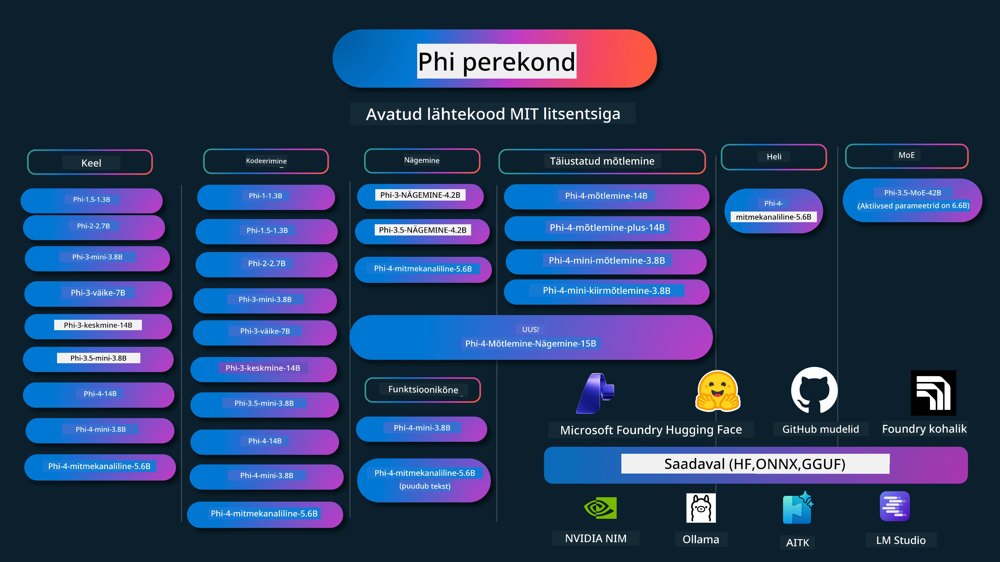

# Phi Kokaraamat: Käed-küljes näited Microsofti Phi mudelitega

[](https://codespaces.new/microsoft/phicookbook)
[](https://vscode.dev/redirect?url=vscode://ms-vscode-remote.remote-containers/cloneInVolume?url=https://github.com/microsoft/phicookbook)

[](https://GitHub.com/microsoft/phicookbook/graphs/contributors/?WT.mc_id=aiml-137032-kinfeylo)
[](https://GitHub.com/microsoft/phicookbook/issues/?WT.mc_id=aiml-137032-kinfeylo)
[](https://GitHub.com/microsoft/phicookbook/pulls/?WT.mc_id=aiml-137032-kinfeylo)
[](http://makeapullrequest.com?WT.mc_id=aiml-137032-kinfeylo)

[](https://GitHub.com/microsoft/phicookbook/watchers/?WT.mc_id=aiml-137032-kinfeylo)
[](https://GitHub.com/microsoft/phicookbook/network/?WT.mc_id=aiml-137032-kinfeylo)
[](https://GitHub.com/microsoft/phicookbook/stargazers/?WT.mc_id=aiml-137032-kinfeylo)

[](https://discord.com/invite/ByRwuEEgH4)

Phi on Microsofti arendatud avatud lähtekoodiga tehisintellekti mudelite seeria.

Phi on praegu kõige võimsam ja kuluefektiivsem väike keelemudel (SLM), mis annab väga head tulemused mitmekeelsuses, loogilises mõtlemises, teksti/vestluse genereerimises, programmeerimises, piltides, helis ja muudes olukordades.

Saad Phi pilve või servaseadmetesse juurutada ning piiratud arvutusvõimsusega hõlpsalt generatiivseid tehisintellekti rakendusi luua.

Järgmiste sammude abil saad neid ressursse kasutada:
1. **Loo hoidla haru (fork)**: Klõpsa [](https://GitHub.com/microsoft/phicookbook/network/?WT.mc_id=aiml-137032-kinfeylo)
2. **Klooni hoidla**: `git clone https://github.com/microsoft/PhiCookBook.git`
3. [**Liitu Microsoft AI Discord kogukonnaga ja kohtuge ekspertide ning teiste arendajatega**](https://discord.com/invite/ByRwuEEgH4?WT.mc_id=aiml-137032-kinfeylo)



### 🌐 Mitmekeelne tugi

#### Toetatud GitHub Actioni kaudu (Automaatne & alati ajakohane)

<!-- CO-OP TRANSLATOR LANGUAGES TABLE START -->
[Araabia](../ar/README.md) | [Bengali](../bn/README.md) | [Bulgaaria](../bg/README.md) | [Burma (Myanmar)](../my/README.md) | [Hiina (lihtsustatud)](../zh-CN/README.md) | [Hiina (traditsiooniline, Hongkong)](../zh-HK/README.md) | [Hiina (traditsiooniline, Macau)](../zh-MO/README.md) | [Hiina (traditsiooniline, Taiwan)](../zh-TW/README.md) | [Horvaadi](../hr/README.md) | [Tšehhi](../cs/README.md) | [Taani](../da/README.md) | [Hollandi](../nl/README.md) | [Eesti](./README.md) | [Soome](../fi/README.md) | [Prantsuse](../fr/README.md) | [Saksa](../de/README.md) | [Kreeka](../el/README.md) | [Heebrea](../he/README.md) | [Hindi](../hi/README.md) | [Ungari](../hu/README.md) | [Indoneesia](../id/README.md) | [Itaalia](../it/README.md) | [Jaapani](../ja/README.md) | [Kannada](../kn/README.md) | [Khmeeri](../km/README.md) | [Korea](../ko/README.md) | [Leedu](../lt/README.md) | [Malai](../ms/README.md) | [Malajalami](../ml/README.md) | [Marathi](../mr/README.md) | [Nepali](../ne/README.md) | [Nigeeria pidžin](../pcm/README.md) | [Norra](../no/README.md) | [Pärsia (Farsi)](../fa/README.md) | [Poola](../pl/README.md) | [Portugali (Brasiilia)](../pt-BR/README.md) | [Portugali (Portugal)](../pt-PT/README.md) | [Pandžabi (Gurmukhi)](../pa/README.md) | [Rumeenia](../ro/README.md) | [Vene](../ru/README.md) | [Serbia (kirillitsa)](../sr/README.md) | [Slovaki](../sk/README.md) | [Sloveeni](../sl/README.md) | [Hispaania](../es/README.md) | [Suahiili](../sw/README.md) | [Rootsi](../sv/README.md) | [Tagaloogi (Filipino)](../tl/README.md) | [Tamili](../ta/README.md) | [Telugu](../te/README.md) | [Tai](../th/README.md) | [Türgi](../tr/README.md) | [Ukraina](../uk/README.md) | [Urdu](../ur/README.md) | [Vietnami](../vi/README.md)

> **Eelistad kohaliku kloonimisega?**
>
> See hoidla sisaldab üle 50 keele tõlkeid, mis suurendavad oluliselt allalaadimise mahtu. Tõlkedeta kloonimiseks kasuta osalist väljavalimist:
>
> **Bash / macOS / Linux:**
> ```bash
> git clone --filter=blob:none --sparse https://github.com/microsoft/PhiCookBook.git
> cd PhiCookBook
> git sparse-checkout set --no-cone '/*' '!translations' '!translated_images'
> ```
>
> **CMD (Windows):**
> ```cmd
> git clone --filter=blob:none --sparse https://github.com/microsoft/PhiCookBook.git
> cd PhiCookBook
> git sparse-checkout set --no-cone "/*" "!translations" "!translated_images"
> ```
>
> Nii saad kõik vajaliku kursuse läbimiseks palju kiiremalt kätte.
<!-- CO-OP TRANSLATOR LANGUAGES TABLE END -->

## Sisukord

- Sissejuhatus
  - [Tere tulemast Phi perekonda](./md/01.Introduction/01/01.PhiFamily.md)
  - [Keskkonna seadistamine](./md/01.Introduction/01/01.EnvironmentSetup.md)
  - [Oluliste tehnoloogiate mõistmine](./md/01.Introduction/01/01.Understandingtech.md)
  - [Tehisintellekti ohutus Phi mudelite jaoks](./md/01.Introduction/01/01.AISafety.md)
  - [Phi riistvaratugi](./md/01.Introduction/01/01.Hardwaresupport.md)
  - [Phi mudelid ja kättesaadavus platvormidel](./md/01.Introduction/01/01.Edgeandcloud.md)
  - [Guidance-ai ja Phi kasutamine](./md/01.Introduction/01/01.Guidance.md)
  - [GitHub Marketplace mudelid](https://github.com/marketplace/models)
  - [Azure AI mudelikataloog](https://ai.azure.com)

- Phi inference erinevates keskkondades
    -  [Hugging face](./md/01.Introduction/02/01.HF.md)
    -  [GitHub mudelid](./md/01.Introduction/02/02.GitHubModel.md)
    -  [Microsoft Foundry mudelikataloog](./md/01.Introduction/02/03.AzureAIFoundry.md)
    -  [Ollama](./md/01.Introduction/02/04.Ollama.md)
    -  [AI Toolkit VSCode (AITK)](./md/01.Introduction/02/05.AITK.md)
    -  [NVIDIA NIM](./md/01.Introduction/02/06.NVIDIA.md)
    -  [Foundry lokaalselt](./md/01.Introduction/02/07.FoundryLocal.md)

- Phi perekonna inference
    - [Phi inference iOS-is](./md/01.Introduction/03/iOS_Inference.md)
    - [Phi inference Androidis](./md/01.Introduction/03/Android_Inference.md)
    - [Phi inference Jetsonis](./md/01.Introduction/03/Jetson_Inference.md)
    - [Phi inference AI arvutis](./md/01.Introduction/03/AIPC_Inference.md)
    - [Phi inference Apple MLX raamistikuga](./md/01.Introduction/03/MLX_Inference.md)
    - [Phi inference lokaalses serveris](./md/01.Introduction/03/Local_Server_Inference.md)
    - [Phi inference kaugserveris AI Toolkitiga](./md/01.Introduction/03/Remote_Interence.md)
    - [Phi inference Rustiga](./md/01.Introduction/03/Rust_Inference.md)
    - [Phi inference–Visioon lokaalselt](./md/01.Introduction/03/Vision_Inference.md)
    - [Phi inference Kaito AKS, Azure konteineritega (ametlik tugi)](./md/01.Introduction/03/Kaito_Inference.md)

-  [Phi perekonna kvantimine](./md/01.Introduction/04/QuantifyingPhi.md)
    - [Phi-3.5 / 4 kvantimine kasutades llama.cpp](./md/01.Introduction/04/UsingLlamacppQuantifyingPhi.md)
    - [Phi-3.5 / 4 kvantimine Generative AI laienditega onnxruntime jaoks](./md/01.Introduction/04/UsingORTGenAIQuantifyingPhi.md)
    - [Phi-3.5 / 4 kvantimine kasutades Intel OpenVINO](./md/01.Introduction/04/UsingIntelOpenVINOQuantifyingPhi.md)
    - [Phi-3.5 / 4 kvantimine Apple MLX raamistiku abil](./md/01.Introduction/04/UsingAppleMLXQuantifyingPhi.md)

-  Phi hindamine
    - [Vastutustundlik AI](./md/01.Introduction/05/ResponsibleAI.md)
    - [Microsoft Foundry hindamiseks](./md/01.Introduction/05/AIFoundry.md)
    - [Promptflow kasutamine hindamiseks](./md/01.Introduction/05/Promptflow.md)
 
- RAG Azure AI otsinguga
    - [Kuidas kasutada Phi-4-mini ja Phi-4-multimodal(RAG) Azure AI otsinguga](https://github.com/microsoft/PhiCookBook/blob/main/code/06.E2E/E2E_Phi-4-RAG-Azure-AI-Search.ipynb)

- Phi rakenduste arendamise näited
  - Teksti- ja vestlusrakendused
    - Phi-4 näited
      - [📓] [Vestlus Phi-4-mini ONNX mudeliga](./md/02.Application/01.TextAndChat/Phi4/ChatWithPhi4ONNX/README.md)
      - [Vestlus Phi-4 lokaalse ONNX mudeliga .NET-is](../../md/04.HOL/dotnet/src/LabsPhi4-Chat-01OnnxRuntime)
      - [Vestlus .NET konsoolirakendusega Phi-4 ONNX ja Semantic Kerneliga](../../md/04.HOL/dotnet/src/LabsPhi4-Chat-02SK)
    - Phi-3 / 3.5 näited
      - [Lokaalne vestlusbott brauseris kasutades Phi3, ONNX Runtime Web ja WebGPU](https://github.com/microsoft/onnxruntime-inference-examples/tree/main/js/chat)
      - [OpenVino Chat](./md/02.Application/01.TextAndChat/Phi3/E2E_OpenVino_Chat.md)
      - [Mitme Mudeli - Interaktiivne Phi-3-mini ja OpenAI Whisper](./md/02.Application/01.TextAndChat/Phi3/E2E_Phi-3-mini_with_whisper.md)
      - [MLFlow - Komplekti ehitamine ja Phi-3 kasutamine koos MLFlow'ga](./md//02.Application/01.TextAndChat/Phi3/E2E_Phi-3-MLflow.md)
      - [Mudeli optimeerimine - Kuidas optimeerida Phi-3-mini mudelit ONNX Runtime Web’ile Olive'iga](https://github.com/microsoft/Olive/tree/main/examples/phi3)
      - [WinUI3 rakendus Phi-3 mini-4k-instruct-onnx’iga](https://github.com/microsoft/Phi3-Chat-WinUI3-Sample/)
      -[WinUI3 Mitme Mudeli tehisintellektil põhinev märkmete rakenduse näidis](https://github.com/microsoft/ai-powered-notes-winui3-sample)
      - [Kohandatud Phi-3 mudelite peenhäälestamine ja integreerimine Prompt flow abil](./md/02.Application/01.TextAndChat/Phi3/E2E_Phi-3-FineTuning_PromptFlow_Integration.md)
      - [Kohandatud Phi-3 mudelite peenhäälestamine ja integreerimine Prompt flow abil Microsoft Foundrys](./md/02.Application/01.TextAndChat/Phi3/E2E_Phi-3-FineTuning_PromptFlow_Integration_AIFoundry.md)
      - [Peenhäälestatud Phi-3/Phi-3.5 mudeli hindamine Microsoft Foundrys, keskendudes Microsofti vastutustundliku tehisintellekti põhimõtetele](./md/02.Application/01.TextAndChat/Phi3/E2E_Phi-3-Evaluation_AIFoundry.md)
      - [📓] [Phi-3.5-mini-instruct keele prognoosimise näidis (hiina/inglise)](./md/02.Application/01.TextAndChat/Phi3/phi3-instruct-demo.ipynb)
      - [Phi-3.5-Instruct WebGPU RAG vestlusrobot](./md/02.Application/01.TextAndChat/Phi3/WebGPUWithPhi35Readme.md)
      - [Windowsi GPU kasutamine Prompt flow lahenduse loomiseks Phi-3.5-Instruct ONNX’iga](./md/02.Application/01.TextAndChat/Phi3/UsingPromptFlowWithONNX.md)
      - [Microsoft Phi-3.5 tflite kasutamine Androidi rakenduse loomiseks](./md/02.Application/01.TextAndChat/Phi3/UsingPhi35TFLiteCreateAndroidApp.md)
      - [Küsimuste ja vastuste .NET näide kohaliku ONNX Phi-3 mudeli kasutamisega Microsoft.ML.OnnxRuntime abil](../../md/04.HOL/dotnet/src/LabsPhi301)
      - [Käsurea vestlusrakendus .NET Semantic Kernel ja Phi-3 abil](../../md/04.HOL/dotnet/src/LabsPhi302)

  - Azure AI järeldamise SDK põhised näited
    - Phi-4 näited
      - [📓] [Projekti koodi genereerimine Phi-4-multimodal abil](./md/02.Application/02.Code/Phi4/GenProjectCode/README.md)
    - Phi-3 / 3.5 näited
      - [Ehita oma Visual Studio Code GitHub Copilot vestlus Microsoft Phi-3 perekonnaga](./md/02.Application/02.Code/Phi3/VSCodeExt/README.md)
      - [Loo oma Visual Studio Code Chat Copilot agent Phi-3.5 GitHub mudelitega](/md/02.Application/02.Code/Phi3/CreateVSCodeChatAgentWithGitHubModels.md)

  - Täiustatud järeldamise näited
    - Phi-4 näited
      - [📓] [Phi-4-mini-järeldamine või Phi-4-järeldamise näited](./md/02.Application/03.AdvancedReasoning/Phi4/AdvancedResoningPhi4mini/README.md)
      - [📓] [Phi-4-mini-järeldamise peenhäälestamine Microsoft Olive’iga](./md/02.Application/03.AdvancedReasoning/Phi4/AdvancedResoningPhi4mini/olive_ft_phi_4_reasoning_with_medicaldata.ipynb)
      - [📓] [Phi-4-mini-järeldamise peenhäälestamine Apple MLX’iga](./md/02.Application/03.AdvancedReasoning/Phi4/AdvancedResoningPhi4mini/mlx_ft_phi_4_reasoning_with_medicaldata.ipynb)
      - [📓] [Phi-4-mini-järeldamine GitHub mudelitega](./md/02.Application/02.Code/Phi4r/github_models_inference.ipynb)
      - [📓] [Phi-4-mini-järeldamine Microsoft Foundry mudelitega](./md/02.Application/02.Code/Phi4r/azure_models_inference.ipynb)
  - Demo’d
      - [Phi-4-mini demo’d Hugging Face Spaces’is](https://huggingface.co/spaces/microsoft/phi-4-mini?WT.mc_id=aiml-137032-kinfeylo)
      - [Phi-4-multimodal demo’d Hugginge Face Spaces’is](https://huggingface.co/spaces/microsoft/phi-4-multimodal?WT.mc_id=aiml-137032-kinfeylo)
  - Nägemisnäited
    - Phi-4 näited
      - [📓] [Phi-4-multimodal kasutamine piltide lugemiseks ja koodi genereerimiseks](./md/02.Application/04.Vision/Phi4/CreateFrontend/README.md)
    - Phi-3 / 3.5 näited
      -  [📓][Phi-3-nägemis-pildi tekst tekstiks](./md/02.Application/04.Vision/Phi3/E2E_Phi-3-vision-image-text-to-text-online-endpoint.ipynb)
      - [Phi-3-nägemis-ONNX](https://onnxruntime.ai/docs/genai/tutorials/phi3-v.html)
      - [📓][Phi-3-nägemis CLIP sisend](./md/02.Application/04.Vision/Phi3/E2E_Phi-3-vision-image-text-to-text-online-endpoint.ipynb)
      - [DEMO: Phi-3 ringlussevõtt](https://github.com/jennifermarsman/PhiRecycling/)
      - [Phi-3-nägemis - visuaalse keelega assistent - Phi3-Vision ja OpenVINO abil](https://docs.openvino.ai/nightly/notebooks/phi-3-vision-with-output.html)
      - [Phi-3 Nägemine Nvidia NIM](./md/02.Application/04.Vision/Phi3/E2E_Nvidia_NIM_Vision.md)
      - [Phi-3 Nägemine OpenVino](./md/02.Application/04.Vision/Phi3/E2E_OpenVino_Phi3Vision.md)
      - [📓][Phi-3.5 Nägemine mitme kaadri või mitme pildi näidis](./md/02.Application/04.Vision/Phi3/phi3-vision-demo.ipynb)
      - [Phi-3 Nägemine kohalik ONNX mudel Microsoft.ML.OnnxRuntime .NET abil](../../md/04.HOL/dotnet/src/LabsPhi303)
      - [Menüü-põhine Phi-3 Nägemine kohalik ONNX mudel Microsoft.ML.OnnxRuntime .NET abil](../../md/04.HOL/dotnet/src/LabsPhi304)

  - Järeldamine-nägemisnäited
    - Phi-4-Järeldamine-Nägemine-15B
      - [📓] [Phi-4-Järeldamine-Nägemine-15B kasutamine jaywalking’u tuvastamiseks](./md/02.Application/10.ReasoningVision/Phi_4_reasoning_vision_15b_Jaywalking.ipynb)
      - [📓] [Phi-4-Järeldamine-Nägemine-15B kasutamine matemaatikas](./md/02.Application/10.ReasoningVision/Phi_4_reasoning_vision_15b_Math.ipynb)
      - [📓] [Phi-4-Järeldamine-Nägemine-15B kasutamine kasutajaliidese (UI) tuvastamiseks](./md/02.Application/10.ReasoningVision/Phi_4_reasoning_vision_15b_ui.ipynb)

  - Matemaatika näited
    -  Phi-4-Mini-Flash-Järeldamine-Juhised näited  [Matemaatika demo Phi-4-Mini-Flash-Järeldamine-Juhistega](./md/02.Application/09.Math/MathDemo.ipynb)

  - Helinäited
    - Phi-4 näited
      - [📓] [Audio transkriptsioonide ekstraheerimine Phi-4-multimodal abil](./md/02.Application/05.Audio/Phi4/Transciption/README.md)
      - [📓] [Phi-4-multimodal heli näidis](./md/02.Application/05.Audio/Phi4/Siri/demo.ipynb)
      - [📓] [Phi-4-multimodal kõne tõlke näidis](./md/02.Application/05.Audio/Phi4/Translate/demo.ipynb)
      - [.NET käsurea rakendus, mis kasutab Phi-4-multimodal heli, heli faili analüüsimiseks ja transkriptsiooni genereerimiseks](../../md/04.HOL/dotnet/src/LabsPhi4-MultiModal-02Audio)

  - MOE näited
    - Phi-3 / 3.5 näited
      - [📓] [Phi-3.5 Ekspertide segu mudelid (MoEs) sotsiaalmeedia näidis](./md/02.Application/06.MoE/Phi3/phi3_moe_demo.ipynb)
      - [📓] [Retrieval-Augmented Generation (RAG) torujuhtme ehitamine NVIDIA NIM Phi-3 MOE, Azure AI Search ja LlamaIndex abil](./md/02.Application/06.MoE/Phi3/azure-ai-search-nvidia-rag.ipynb)
      - 
  - Funktsioonikutsumise näited
    - Phi-4 näited 🆕
      -  [📓] [Funktsioonikutsumise kasutamine Phi-4-mini puhul](./md/02.Application/07.FunctionCalling/Phi4/FunctionCallingBasic/README.md)
      -  [📓] [Funktsioonikutsumise kasutamine mitme agendi loomiseks Phi-4-mini abil](./md/02.Application/07.FunctionCalling/Phi4/Multiagents/Phi_4_mini_multiagent.ipynb)
      -  [📓] [Funktsioonikutsumise kasutamine Ollama’ga](./md/02.Application/07.FunctionCalling/Phi4/Ollama/ollama_functioncalling.ipynb)
      -  [📓] [Funktsioonikutsumise kasutamine ONNX’iga](./md/02.Application/07.FunctionCalling/Phi4/ONNX/onnx_parallel_functioncalling.ipynb)
  - Mitmemodaalne segamine näited
    - Phi-4 näited 🆕
      -  [📓] [Phi-4-multimodal kasutamine tehnoloogiaajakirjanikuna](./md/02.Application/08.Multimodel/Phi4/TechJournalist/phi_4_mm_audio_text_publish_news.ipynb)
      - [.NET käsurea rakendus, mis kasutab Phi-4-multimodal piltide analüüsimiseks](../../md/04.HOL/dotnet/src/LabsPhi4-MultiModal-01Images)

- Phi peenhäälestamine näited
  - [Peenhäälestamise stsenaariumid](./md/03.FineTuning/FineTuning_Scenarios.md)
  - [Peenhäälestamine vs RAG](./md/03.FineTuning/FineTuning_vs_RAG.md)
  - [Lase Phi-3-l saada tööstuse eksperdiks peenhäälestamisega](./md/03.FineTuning/LetPhi3gotoIndustriy.md)
  - [Phi-3 peenhäälestamine AI Toolkitiga VS Code jaoks](./md/03.FineTuning/Finetuning_VSCodeaitoolkit.md)
  - [Phi-3 peenhäälestamine Azure Machine Learning teenusega](./md/03.FineTuning/Introduce_AzureML.md)
  - [Phi-3 peenhäälestamine Lora abil](./md/03.FineTuning/FineTuning_Lora.md)
  - [Phi-3 peenhäälestamine QLora abil](./md/03.FineTuning/FineTuning_Qlora.md)
  - [Phi-3 peenhäälestamine Microsoft Foundry’ga](./md/03.FineTuning/FineTuning_AIFoundry.md)
  - [Phi-3 peenhäälestamine Azure ML CLI/SDK abil](./md/03.FineTuning/FineTuning_MLSDK.md)
  - [Peenhäälestamine Microsoft Olive’iga](./md/03.FineTuning/FineTuning_MicrosoftOlive.md)
  - [Microsoft Olive praktiline labori käsiraamat](./md/03.FineTuning/olive-lab/readme.md)
  - [Phi-3-vision peenhäälestamine Weights and Bias abil](./md/03.FineTuning/FineTuning_Phi-3-visionWandB.md)
  - [Phi-3 peenhäälestamine Apple MLX raamistikuga](./md/03.FineTuning/FineTuning_MLX.md)
  - [Phi-3-vision peenhäälestamine (ametlik tugi)](./md/03.FineTuning/FineTuning_Vision.md)
  - [Phi-3 peenhäälestamine Kaito AKS-iga, Azure konteinerid (ametlik tugi)](./md/03.FineTuning/FineTuning_Kaito.md)
  - [Phi-3 ja 3.5 Vision peenhäälestamine](https://github.com/2U1/Phi3-Vision-Finetune)

- Praktikum
  - [Uurides uusimaid mudeleid: LLM-id, SLM-id, kohalik arendus ja palju muud](https://github.com/microsoft/aitour-exploring-cutting-edge-models)
  - [Looduskeele töötluse potentsiaali avamine: Microsoft Olive’i peenhäälestus](https://github.com/azure/Ignite_FineTuning_workshop)

- Akadeemilised uurimused ja publikatsioonid
  - [Õpikud on kõik, mida vajad II: phi-1.5 tehniline aruanne](https://arxiv.org/abs/2309.05463)
  - [Phi-3 tehniline aruanne: väga võimekas keelemudel sinu telefonis kohapeal](https://arxiv.org/abs/2404.14219)
  - [Phi-4 tehniline aruanne](https://arxiv.org/abs/2412.08905)
  - [Phi-4-Mini tehniline aruanne: kompaktne, ent võimas multimodaalne keelemudel LoRA seguga](https://arxiv.org/abs/2503.01743)
  - [Väikeste keelemudelite optimeerimine sõidukisiseste funktsioonikõnede jaoks](https://arxiv.org/abs/2501.02342)
  - [(WhyPHI) PHI-3 peenhäälestamine valikvastustega küsimustele vastamiseks: metoodika, tulemused ja väljakutsed](https://arxiv.org/abs/2501.01588)
  - [Phi-4 loogilise mõtlemise tehniline aruanne](https://www.microsoft.com/en-us/research/wp-content/uploads/2025/04/phi_4_reasoning.pdf)
  - [Phi-4-mini loogilise mõtlemise tehniline aruanne](https://huggingface.co/microsoft/Phi-4-mini-reasoning/blob/main/Phi-4-Mini-Reasoning.pdf)

## Phi mudelite kasutamine

### Phi Microsoft Foundry’s

Õpi, kuidas kasutada Microsoft Phi’d ja kuidas ehitada E2E lahendusi oma erinevates riistvaraseadmetes. Phi proovimiseks alusta mudelitega mängimisest ja Phi kohandamisest oma stsenaariumitele kasutades [Microsoft Foundry Azure AI Model Catalog’ut](https://aka.ms/phi3-azure-ai). Lisateavet leiad juhistest Getting Started with [Microsoft Foundry](/md/02.QuickStart/AzureAIFoundry_QuickStart.md)

**Mänguväljak**
Iga mudelil on pühendatud mänguväljak mudeli testimiseks [Azure AI Playground](https://aka.ms/try-phi3).

### Phi GitHub mudelites

Õpi, kuidas kasutada Microsoft Phi’d ja kuidas ehitada E2E lahendusi oma erinevates riistvaraseadmetes. Phi proovimiseks alusta mudeliga mängimisest ja Phi kohandamisest oma stsenaariumitele kasutades [GitHub Model Catalog’ut](https://github.com/marketplace/models?WT.mc_id=aiml-137032-kinfeylo). Lisateavet leiad juhistest Getting Started with [GitHub Model Catalog](/md/02.QuickStart/GitHubModel_QuickStart.md)

**Mänguväljak**
Igal mudelil on pühendatud [mänguväljak mudeli testimiseks](/md/02.QuickStart/GitHubModel_QuickStart.md).

### Phi Hugging Face’il

Mudelit leiad ka [Hugging Face’ilt](https://huggingface.co/microsoft)

**Mänguväljak**
[Hugging Chat mänguväljak](https://huggingface.co/chat/models/microsoft/Phi-3-mini-4k-instruct)

## 🎒 Muud kursused

Meie meeskond toodab ka muid kursuseid! Vaata:

<!-- CO-OP TRANSLATOR OTHER COURSES START -->
### LangChain
[](https://aka.ms/langchain4j-for-beginners)
[](https://aka.ms/langchainjs-for-beginners?WT.mc_id=m365-94501-dwahlin)
[](https://github.com/microsoft/langchain-for-beginners?WT.mc_id=m365-94501-dwahlin)
---

### Azure / Edge / MCP / Agendid
[](https://github.com/microsoft/AZD-for-beginners?WT.mc_id=academic-105485-koreyst)
[](https://github.com/microsoft/edgeai-for-beginners?WT.mc_id=academic-105485-koreyst)
[](https://github.com/microsoft/mcp-for-beginners?WT.mc_id=academic-105485-koreyst)
[](https://github.com/microsoft/ai-agents-for-beginners?WT.mc_id=academic-105485-koreyst)

---

### Generatiivse tehisintellekti sari
[](https://github.com/microsoft/generative-ai-for-beginners?WT.mc_id=academic-105485-koreyst)
[-9333EA?style=for-the-badge&labelColor=E5E7EB&color=9333EA)](https://github.com/microsoft/Generative-AI-for-beginners-dotnet?WT.mc_id=academic-105485-koreyst)
[-C084FC?style=for-the-badge&labelColor=E5E7EB&color=C084FC)](https://github.com/microsoft/generative-ai-for-beginners-java?WT.mc_id=academic-105485-koreyst)
[-E879F9?style=for-the-badge&labelColor=E5E7EB&color=E879F9)](https://github.com/microsoft/generative-ai-with-javascript?WT.mc_id=academic-105485-koreyst)

---

### Põhiõpe
[](https://aka.ms/ml-beginners?WT.mc_id=academic-105485-koreyst)
[](https://aka.ms/datascience-beginners?WT.mc_id=academic-105485-koreyst)
[](https://aka.ms/ai-beginners?WT.mc_id=academic-105485-koreyst)
[](https://github.com/microsoft/Security-101?WT.mc_id=academic-96948-sayoung)
[](https://aka.ms/webdev-beginners?WT.mc_id=academic-105485-koreyst)
[](https://aka.ms/iot-beginners?WT.mc_id=academic-105485-koreyst)
[](https://github.com/microsoft/xr-development-for-beginners?WT.mc_id=academic-105485-koreyst)

---

### Copiloti sari
[](https://aka.ms/GitHubCopilotAI?WT.mc_id=academic-105485-koreyst)
[](https://github.com/microsoft/mastering-github-copilot-for-dotnet-csharp-developers?WT.mc_id=academic-105485-koreyst)
[](https://github.com/microsoft/CopilotAdventures?WT.mc_id=academic-105485-koreyst)
<!-- CO-OP TRANSLATOR OTHER COURSES END -->

## Vastutustundlik tehisintellekt

Microsoft on pühendunud aitama oma klientidel kasutada meie tehisintellekti tooteid vastutustundlikult, jagama õppetunde ja ehitama usaldusel põhinevaid partnerlussuhteid tööriistade nagu Läbipaistvusteadete ja Mõju hindamiste kaudu. Paljusid neid ressursse leiab aadressilt [https://aka.ms/RAI](https://aka.ms/RAI).  
Microsofti vastutustundliku tehisintellekti lähenemine põhineb meie tehisintellekti põhimõtetel: õiglus, usaldusväärsus ja ohutus, privaatsus ja turvalisus, kaasatus, läbipaistvus ja vastutus.

Suurte looduskeele, pildi- ja kõnemudelite - nagu neid selles näites kasutatavaid - käitumine võib potentsiaalselt olla ebaõiglane, usaldamatu või solvav, põhjustades kahjustusi. Palun tutvu [Azure OpenAI teenuse läbipaistvuse teatisega](https://learn.microsoft.com/legal/cognitive-services/openai/transparency-note?tabs=text), et saada teavet riskide ja piirangute kohta.
Soovitatav lähenemine nende riskide leevendamiseks on lisada oma arhitektuuri turvasüsteem, mis suudab tuvastada ja takistada kahjulikku käitumist. <a href="https://learn.microsoft.com/azure/ai-services/content-safety/overview">Azure AI sisuturve</a> pakub sõltumatut kaitsekihki, mis suudab rakendustes ja teenustes tuvastada kahjulikku kasutajate loodud ja AI poolt genereeritud sisu. Azure AI sisuturve sisaldab teksti- ja pildirakendusliideseid, mis võimaldavad tuvastada kahjulikku materjali. Microsoft Foundrys võimaldab Content Safety teenus vaadata, uurida ja proovida näidiskoodi erinevate modaliteetide kahjuliku sisu tuvastamiseks. Järgmine <a href="https://learn.microsoft.com/azure/ai-services/content-safety/quickstart-text?tabs=visual-studio%2Clinux&pivots=programming-language-rest">kiirjuhendi dokumentatsioon</a> juhatab sind teenusele päringute tegemisel.

Teine oluline aspekt on rakenduse üldine jõudlus. Multi-modaalsete ja multi-mudelite rakenduste puhul peame jõudlust selleks, et süsteem toimiks nii, nagu sina ja su kasutajad ootavad, sealhulgas mitte tekitades kahjulikke väljundeid. On oluline hinnata oma rakenduse üldist jõudlust kasutades <a href="https://learn.microsoft.com/azure/ai-studio/concepts/evaluation-metrics-built-in">jõudluse, kvaliteedi ning riski ja turvalisuse hindajaid</a>. Sul on ka võimalus luua ja hinnata <a href="https://learn.microsoft.com/azure/ai-studio/how-to/develop/evaluate-sdk#custom-evaluators">kohandatud hindajatega</a>.

Sa saad hinnata oma AI rakendust oma arenduskeskkonnas, kasutades <a href="https://microsoft.github.io/promptflow/index.html">Azure AI hindamise SDK-d</a>. Kasutades kas testandmestikku või sihtmärki, mõõdetakse sinu generatiivse AI rakenduse genereeringuid kvantitatiivselt sisseehitatud hindajate või sinu valitud kohandatud hindajate abil. Azure AI hindamise SDK-ga alustamiseks ja oma süsteemi hindamiseks võid järgida <a href="https://learn.microsoft.com/azure/ai-studio/how-to/develop/flow-evaluate-sdk">kiirjuhendit</a>. Kui oled hindamise käigu käivitanud, saad <a href="https://learn.microsoft.com/azure/ai-studio/how-to/evaluate-flow-results">tulemusi visualiseerida Microsoft Foundrys</a>.

## Kaubamärgid

See projekt võib sisaldada kaubamärke või logosid projektide, toodete või teenuste jaoks. Microsofti kaubamärkide või logode ametlik kasutamine peab toimuma vastavalt ja järgima <a href="https://www.microsoft.com/legal/intellectualproperty/trademarks/usage/general">Microsofti kaubamärgi ja brändi juhiseid</a>. Microsofti kaubamärkide või logode kasutamine selle projekti muudetud versioonides ei tohi tekitada segadust ega jätta muljet Microsofti sponsorlusest. Kolmandate osapoolte kaubamärkide või logode kasutamine allub nende kolmandate osapoolte poliitikatele.

## Abi saamine

Kui sul tekib takistusi või küsimusi AI-rakenduste arendamisel, liitu:

[](https://aka.ms/foundry/discord)

Kui sul on tootepalju või ehitamisel esineb vigu, külasta:

[](https://aka.ms/foundry/forum)

---

<!-- CO-OP TRANSLATOR DISCLAIMER START -->
**Lahtiütlus**:  
See dokument on tõlgitud tehisintellekti tõlketeenuse [Co-op Translator](https://github.com/Azure/co-op-translator) abil. Kuigi püüdleme täpsuse poole, palun arvestage, et automatiseeritud tõlked võivad sisaldada vigu või ebatäpsusi. Originaaldokument oma emakeeles tuleks pidada autoriteetseks allikaks. Kriitilise teabe puhul on soovitatav kasutada professionaalset inimtõlget. Me ei vastuta selle tõlke kasutamisest tulenevate arusaamatuste ega väärarusaamade eest.
<!-- CO-OP TRANSLATOR DISCLAIMER END -->