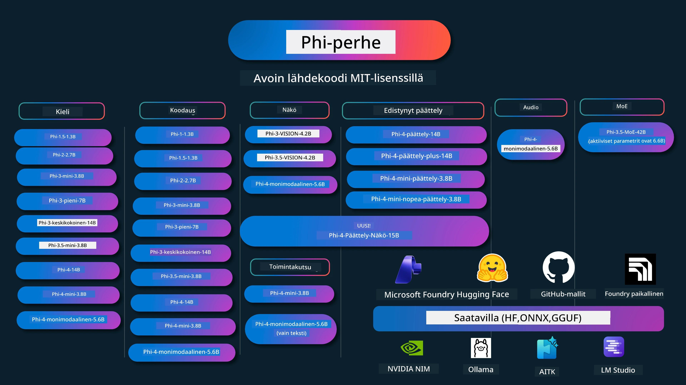

# Phi Cookbook: Käytännön esimerkkejä Microsoftin Phi-malleilla

[](https://codespaces.new/microsoft/phicookbook)
[](https://vscode.dev/redirect?url=vscode://ms-vscode-remote.remote-containers/cloneInVolume?url=https://github.com/microsoft/phicookbook)

[](https://GitHub.com/microsoft/phicookbook/graphs/contributors/?WT.mc_id=aiml-137032-kinfeylo)
[](https://GitHub.com/microsoft/phicookbook/issues/?WT.mc_id=aiml-137032-kinfeylo)
[](https://GitHub.com/microsoft/phicookbook/pulls/?WT.mc_id=aiml-137032-kinfeylo)
[](http://makeapullrequest.com?WT.mc_id=aiml-137032-kinfeylo)

[](https://GitHub.com/microsoft/phicookbook/watchers/?WT.mc_id=aiml-137032-kinfeylo)
[](https://GitHub.com/microsoft/phicookbook/network/?WT.mc_id=aiml-137032-kinfeylo)
[](https://GitHub.com/microsoft/phicookbook/stargazers/?WT.mc_id=aiml-137032-kinfeylo)

[](https://discord.com/invite/ByRwuEEgH4)

Phi on Microsoftin kehittämä sarja avoimen lähdekoodin tekoälymalleja.

Phi on tällä hetkellä tehokkain ja kustannustehokkain pieni kielimalli (SLM), jolla on erittäin hyvät suorituskykyvertailut monikielisyydessä, päättelyssä, tekstin/keskustelun generoinnissa, koodauksessa, kuvissa, äänissä ja muissa käyttötapauksissa.

Voit ottaa Phin käyttöön pilvessä tai reunalaitteissa, ja voit helposti rakentaa generatiivisia tekoälysovelluksia rajallisella laskentateholla.

Aloita käyttämällä näitä resursseja seuraavasti:
1. **Forkkaa repositorio**: Klikkaa [](https://GitHub.com/microsoft/phicookbook/network/?WT.mc_id=aiml-137032-kinfeylo)
2. **Kloonaa repositorio**: `git clone https://github.com/microsoft/PhiCookBook.git`
3. [**Liity Microsoft AI Discord -yhteisöön ja tapaa asiantuntijoita ja muita kehittäjiä**](https://discord.com/invite/ByRwuEEgH4?WT.mc_id=aiml-137032-kinfeylo)



### 🌐 Monikielinen tuki

#### Tuettu GitHub Actionin kautta (automaattinen & aina ajan tasalla)

<!-- CO-OP TRANSLATOR LANGUAGES TABLE START -->
[Arabic](../ar/README.md) | [Bengali](../bn/README.md) | [Bulgarian](../bg/README.md) | [Burmese (Myanmar)](../my/README.md) | [Chinese (Simplified)](../zh-CN/README.md) | [Chinese (Traditional, Hong Kong)](../zh-HK/README.md) | [Chinese (Traditional, Macau)](../zh-MO/README.md) | [Chinese (Traditional, Taiwan)](../zh-TW/README.md) | [Croatian](../hr/README.md) | [Czech](../cs/README.md) | [Danish](../da/README.md) | [Dutch](../nl/README.md) | [Estonian](../et/README.md) | [Finnish](./README.md) | [French](../fr/README.md) | [German](../de/README.md) | [Greek](../el/README.md) | [Hebrew](../he/README.md) | [Hindi](../hi/README.md) | [Hungarian](../hu/README.md) | [Indonesian](../id/README.md) | [Italian](../it/README.md) | [Japanese](../ja/README.md) | [Kannada](../kn/README.md) | [Khmer](../km/README.md) | [Korean](../ko/README.md) | [Lithuanian](../lt/README.md) | [Malay](../ms/README.md) | [Malayalam](../ml/README.md) | [Marathi](../mr/README.md) | [Nepali](../ne/README.md) | [Nigerian Pidgin](../pcm/README.md) | [Norwegian](../no/README.md) | [Persian (Farsi)](../fa/README.md) | [Polish](../pl/README.md) | [Portuguese (Brazil)](../pt-BR/README.md) | [Portuguese (Portugal)](../pt-PT/README.md) | [Punjabi (Gurmukhi)](../pa/README.md) | [Romanian](../ro/README.md) | [Russian](../ru/README.md) | [Serbian (Cyrillic)](../sr/README.md) | [Slovak](../sk/README.md) | [Slovenian](../sl/README.md) | [Spanish](../es/README.md) | [Swahili](../sw/README.md) | [Swedish](../sv/README.md) | [Tagalog (Filipino)](../tl/README.md) | [Tamil](../ta/README.md) | [Telugu](../te/README.md) | [Thai](../th/README.md) | [Turkish](../tr/README.md) | [Ukrainian](../uk/README.md) | [Urdu](../ur/README.md) | [Vietnamese](../vi/README.md)

> **Haluatko mieluummin kloonata paikallisesti?**
>
> Tämä repositorio sisältää yli 50 kielen käännökset, mikä lisää merkittävästi latauskoon määrää. Jos haluat kloonata ilman käännöksiä, käytä sparse checkoutia:
>
> **Bash / macOS / Linux:**
> ```bash
> git clone --filter=blob:none --sparse https://github.com/microsoft/PhiCookBook.git
> cd PhiCookBook
> git sparse-checkout set --no-cone '/*' '!translations' '!translated_images'
> ```
>
> **CMD (Windows):**
> ```cmd
> git clone --filter=blob:none --sparse https://github.com/microsoft/PhiCookBook.git
> cd PhiCookBook
> git sparse-checkout set --no-cone "/*" "!translations" "!translated_images"
> ```
>
> Saat näin kaiken tarvitsemasi kurssin suorittamiseen paljon nopeammalla latauksella.
<!-- CO-OP TRANSLATOR LANGUAGES TABLE END -->

## Sisällysluettelo

- Johdanto
  - [Tervetuloa Phi-perheeseen](./md/01.Introduction/01/01.PhiFamily.md)
  - [Ympäristön asennus](./md/01.Introduction/01/01.EnvironmentSetup.md)
  - [Keskeisten teknologioiden ymmärtäminen](./md/01.Introduction/01/01.Understandingtech.md)
  - [Tekoälyn turvallisuus Phi-malleissa](./md/01.Introduction/01/01.AISafety.md)
  - [Phi-laitetuki](./md/01.Introduction/01/01.Hardwaresupport.md)
  - [Phi-mallit ja saatavuus alustoilla](./md/01.Introduction/01/01.Edgeandcloud.md)
  - [Guidance-ai:n ja Phin käyttö](./md/01.Introduction/01/01.Guidance.md)
  - [GitHub Marketplace -mallit](https://github.com/marketplace/models)
  - [Azure AI -malliluettelo](https://ai.azure.com)

- Phi-päättely eri ympäristöissä
    -  [Hugging Face](./md/01.Introduction/02/01.HF.md)
    -  [GitHub-mallit](./md/01.Introduction/02/02.GitHubModel.md)
    -  [Microsoft Foundry Model Catalog](./md/01.Introduction/02/03.AzureAIFoundry.md)
    -  [Ollama](./md/01.Introduction/02/04.Ollama.md)
    -  [AI Toolkit VSCode (AITK)](./md/01.Introduction/02/05.AITK.md)
    -  [NVIDIA NIM](./md/01.Introduction/02/06.NVIDIA.md)
    -  [Foundry Local](./md/01.Introduction/02/07.FoundryLocal.md)

- Phi-perheen päättely
    - [Phi-päättely iOS:ssä](./md/01.Introduction/03/iOS_Inference.md)
    - [Phi-päättely Androidissa](./md/01.Introduction/03/Android_Inference.md)
    - [Phi-päättely Jetsonissa](./md/01.Introduction/03/Jetson_Inference.md)
    - [Phi-päättely AI-PC:ssä](./md/01.Introduction/03/AIPC_Inference.md)
    - [Phi-päättely Apple MLX -kehyksellä](./md/01.Introduction/03/MLX_Inference.md)
    - [Phi-päättely paikallisella palvelimella](./md/01.Introduction/03/Local_Server_Inference.md)
    - [Phi-päättely etäpalvelimella AI Toolkitin avulla](./md/01.Introduction/03/Remote_Interence.md)
    - [Phi-päättely Rustilla](./md/01.Introduction/03/Rust_Inference.md)
    - [Phi-päättely – Vision paikallisesti](./md/01.Introduction/03/Vision_Inference.md)
    - [Phi-päättely Kaiton AKS:llä, Azure Containersilla (virallinen tuki)](./md/01.Introduction/03/Kaito_Inference.md)
-  [Phin kvantisointi](./md/01.Introduction/04/QuantifyingPhi.md)
    - [Phi-3.5 / 4:n kvantisointi llama.cpp:llä](./md/01.Introduction/04/UsingLlamacppQuantifyingPhi.md)
    - [Phi-3.5 / 4:n kvantisointi Generative AI -laajennuksilla onnxruntimeen](./md/01.Introduction/04/UsingORTGenAIQuantifyingPhi.md)
    - [Phi-3.5 / 4:n kvantisointi Intel OpenVINO:lla](./md/01.Introduction/04/UsingIntelOpenVINOQuantifyingPhi.md)
    - [Phi-3.5 / 4:n kvantisointi Apple MLX -kehyksellä](./md/01.Introduction/04/UsingAppleMLXQuantifyingPhi.md)

-  Phi:n arviointi
    - [Vastuullinen tekoäly](./md/01.Introduction/05/ResponsibleAI.md)
    - [Microsoft Foundry arviointiin](./md/01.Introduction/05/AIFoundry.md)
    - [Promptflow’n käyttö arvioinnissa](./md/01.Introduction/05/Promptflow.md)
 
- RAG Azure AI Searchin kanssa
    - [Miten käyttää Phi-4-mini ja Phi-4-multimodal (RAG) Azure AI Searchin kanssa](https://github.com/microsoft/PhiCookBook/blob/main/code/06.E2E/E2E_Phi-4-RAG-Azure-AI-Search.ipynb)

- Phi-sovelluskehityksen esimerkit
  - Teksti- ja keskustelusovellukset
    - Phi-4-esimerkit 
      - [📓] [Keskustele Phi-4-mini ONNX -mallin kanssa](./md/02.Application/01.TextAndChat/Phi4/ChatWithPhi4ONNX/README.md)
      - [Keskustele Phi-4 paikallisen ONNX-mallin kanssa .NET:llä](../../md/04.HOL/dotnet/src/LabsPhi4-Chat-01OnnxRuntime)
      - [Keskustelu .NET-konsolisovelluksella Phi-4 ONNX:n kanssa käyttäen Semantic Kernelia](../../md/04.HOL/dotnet/src/LabsPhi4-Chat-02SK)
    - Phi-3 / 3.5 -esimerkit
      - [Paikallinen chatbot selaimessa käyttäen Phi3:ta, ONNX Runtime Webiä ja WebGPU:ta](https://github.com/microsoft/onnxruntime-inference-examples/tree/main/js/chat)
      - [OpenVino Chat](./md/02.Application/01.TextAndChat/Phi3/E2E_OpenVino_Chat.md)
      - [Multi Model - Interaktiivinen Phi-3-mini ja OpenAI Whisper](./md/02.Application/01.TextAndChat/Phi3/E2E_Phi-3-mini_with_whisper.md)
      - [MLFlow - Kääreen rakentaminen ja Phi-3:n käyttäminen MLFlow'n kanssa](./md//02.Application/01.TextAndChat/Phi3/E2E_Phi-3-MLflow.md)
      - [Mallin optimointi - Kuinka optimoida Phi-3-minimalli ONNX Runtime Webille käyttäen Olivea](https://github.com/microsoft/Olive/tree/main/examples/phi3)
      - [WinUI3-sovellus Phi-3 mini-4k-instruct-onnx:llä](https://github.com/microsoft/Phi3-Chat-WinUI3-Sample/)
      -[WinUI3 Monimallin tekoälyllä varustettu muistiinpanosovellusnäyte](https://github.com/microsoft/ai-powered-notes-winui3-sample)
      - [Phi-3 -mallien hienosäätö ja integrointi Prompt Flow'n avulla](./md/02.Application/01.TextAndChat/Phi3/E2E_Phi-3-FineTuning_PromptFlow_Integration.md)
      - [Phi-3 -mallien hienosäätö ja integrointi Prompt Flow'n avulla Microsoft Foundryssa](./md/02.Application/01.TextAndChat/Phi3/E2E_Phi-3-FineTuning_PromptFlow_Integration_AIFoundry.md)
      - [Hienosäädetyn Phi-3 / Phi-3.5 mallin arviointi Microsoft Foundryssa keskittyen Microsoftin vastuullisen tekoälyn periaatteisiin](./md/02.Application/01.TextAndChat/Phi3/E2E_Phi-3-Evaluation_AIFoundry.md)
      - [📓] [Phi-3.5-mini-instruct kieliennusteenäyte (kiina/englanti)](./md/02.Application/01.TextAndChat/Phi3/phi3-instruct-demo.ipynb)
      - [Phi-3.5-Instruct WebGPU RAG Chatbot](./md/02.Application/01.TextAndChat/Phi3/WebGPUWithPhi35Readme.md)
      - [Windows GPU:n käyttäminen Prompt Flow -ratkaisun luomiseen Phi-3.5-Instruct ONNX:llä](./md/02.Application/01.TextAndChat/Phi3/UsingPromptFlowWithONNX.md)
      - [Microsoft Phi-3.5 tflite:n käyttäminen Android-sovelluksen luomiseen](./md/02.Application/01.TextAndChat/Phi3/UsingPhi35TFLiteCreateAndroidApp.md)
      - [Kysymys & vastaus .NET-esimerkki paikallisella ONNX Phi-3 -mallilla käyttäen Microsoft.ML.OnnxRuntimea](../../md/04.HOL/dotnet/src/LabsPhi301)
      - [Konsolipohjainen chat .NET-sovellus Semantic Kernelillä ja Phi-3:lla](../../md/04.HOL/dotnet/src/LabsPhi302)

  - Azure AI Inference SDK:n koodipohjaiset näytteet 
    - Phi-4-näytteet 
      - [📓] [Projektikoodin generointi käyttäen Phi-4-multimodaalia](./md/02.Application/02.Code/Phi4/GenProjectCode/README.md)
    - Phi-3 / 3.5 näytteet
      - [Rakenna oma Visual Studio Code GitHub Copilot Chat Microsoft Phi-3 -perheen kanssa](./md/02.Application/02.Code/Phi3/VSCodeExt/README.md)
      - [Luo oma Visual Studio Code Chat Copilot -agentti Phi-3.5:llä GitHub-mallien avulla](/md/02.Application/02.Code/Phi3/CreateVSCodeChatAgentWithGitHubModels.md)

  - Edistyneet päättelynäytteet
    - Phi-4-näytteet 
      - [📓] [Phi-4-mini-päättely tai Phi-4-päättelynäytteet](./md/02.Application/03.AdvancedReasoning/Phi4/AdvancedResoningPhi4mini/README.md)
      - [📓] [Phi-4-mini-päättelyn hienosäätö Microsoft Oliven avulla](./md/02.Application/03.AdvancedReasoning/Phi4/AdvancedResoningPhi4mini/olive_ft_phi_4_reasoning_with_medicaldata.ipynb)
      - [📓] [Phi-4-mini-päättelyn hienosäätö Apple MLX:n avulla](./md/02.Application/03.AdvancedReasoning/Phi4/AdvancedResoningPhi4mini/mlx_ft_phi_4_reasoning_with_medicaldata.ipynb)
      - [📓] [Phi-4-mini-päättely GitHub-malleilla](./md/02.Application/02.Code/Phi4r/github_models_inference.ipynb)
      - [📓] [Phi-4-mini-päättely Microsoft Foundry -malleilla](./md/02.Application/02.Code/Phi4r/azure_models_inference.ipynb)
  - Demos
      - [Phi-4-mini esittelyt hostattuna Hugging Face Spacesissa](https://huggingface.co/spaces/microsoft/phi-4-mini?WT.mc_id=aiml-137032-kinfeylo)
      - [Phi-4-multimodal esittelyt hostattuna Hugginge Face Spacesissa](https://huggingface.co/spaces/microsoft/phi-4-multimodal?WT.mc_id=aiml-137032-kinfeylo)
  - Näkökykynäytteet
    - Phi-4-näytteet 
      - [📓] [Käytä Phi-4-multimodaalia lukemaan kuvia ja generoimaan koodia](./md/02.Application/04.Vision/Phi4/CreateFrontend/README.md) 
    - Phi-3 / 3.5 näytteet
      -  [📓][Phi-3-näkökuvan teksti tekstiksi](./md/02.Application/04.Vision/Phi3/E2E_Phi-3-vision-image-text-to-text-online-endpoint.ipynb)
      - [Phi-3-näkö ONNX](https://onnxruntime.ai/docs/genai/tutorials/phi3-v.html)
      - [📓][Phi-3-näkö CLIP upotus](./md/02.Application/04.Vision/Phi3/E2E_Phi-3-vision-image-text-to-text-online-endpoint.ipynb)
      - [DEMO: Phi-3 kierrätys](https://github.com/jennifermarsman/PhiRecycling/)
      - [Phi-3-näkö - Visuaalinen kieliavustaja - Phi3-Näkö ja OpenVINO](https://docs.openvino.ai/nightly/notebooks/phi-3-vision-with-output.html)
      - [Phi-3 Näkö Nvidia NIM](./md/02.Application/04.Vision/Phi3/E2E_Nvidia_NIM_Vision.md)
      - [Phi-3 Näkö OpenVino](./md/02.Application/04.Vision/Phi3/E2E_OpenVino_Phi3Vision.md)
      - [📓][Phi-3.5 Näkö monikehys- tai monikuvaesimerkki](./md/02.Application/04.Vision/Phi3/phi3-vision-demo.ipynb)
      - [Phi-3 Näkö paikallinen ONNX-malli käyttäen Microsoft.ML.OnnxRuntime .NETissä](../../md/04.HOL/dotnet/src/LabsPhi303)
      - [Valikkopohjainen Phi-3 Näkö paikallinen ONNX-malli käyttäen Microsoft.ML.OnnxRuntime .NETissä](../../md/04.HOL/dotnet/src/LabsPhi304)

  - Päättely-Näkö Näytteet
    - Phi-4-Päättely-Näkö-15B 
      - [📓] [Käyttämällä Phi-4-Päättely-Näkö-15B:tä vilkkaan liikenteen havaitsemiseen](./md/02.Application/10.ReasoningVision/Phi_4_reasoning_vision_15b_Jaywalking.ipynb)
      - [📓] [Käyttämällä Phi-4-Päättely-Näkö-15B:tä matematiikkaan](./md/02.Application/10.ReasoningVision/Phi_4_reasoning_vision_15b_Math.ipynb)
      - [📓] [Käyttämällä Phi-4-Päättely-Näkö-15B:tä käyttöliittymän tunnistamiseen](./md/02.Application/10.ReasoningVision/Phi_4_reasoning_vision_15b_ui.ipynb)

  - Matematiikan näytteet
    -  Phi-4-Mini-Flash-Päättely-Ohje Näytteet  [Matematiikan demo Phi-4-Mini-Flash-Päättely-Ohjeella](./md/02.Application/09.Math/MathDemo.ipynb)

  - Ääninäytteet
    - Phi-4-näytteet 
      - [📓] [Äänitallenteiden puhtaaksikirjoitus Phi-4-multimodaalilla](./md/02.Application/05.Audio/Phi4/Transciption/README.md)
      - [📓] [Phi-4-multimodaalinen ääninäyte](./md/02.Application/05.Audio/Phi4/Siri/demo.ipynb)
      - [📓] [Phi-4-multimodaalinen puheen käännösnäyte](./md/02.Application/05.Audio/Phi4/Translate/demo.ipynb)
      - [.NET-konsolisovellus Phi-4-multimodaalista äänen analysointiin ja puhtaaksikirjoituksen luomiseen](../../md/04.HOL/dotnet/src/LabsPhi4-MultiModal-02Audio)

  - MOE-näytteet
    - Phi-3 / 3.5 näytteet
      - [📓] [Phi-3.5 Eksperttisekoitusmallit (MoEs) sosiaalisen median näyte](./md/02.Application/06.MoE/Phi3/phi3_moe_demo.ipynb)
      - [📓] [Hakua parantavan generoinnin (RAG) putken rakentaminen NVIDIA NIM Phi-3 MOE:n, Azure AI Searchin ja LlamaIndexin avulla](./md/02.Application/06.MoE/Phi3/azure-ai-search-nvidia-rag.ipynb)
      - 
  - Funktiokutsunäytteet
    - Phi-4-näytteet 🆕
      -  [📓] [Funktiokutsun käyttäminen Phi-4-minin kanssa](./md/02.Application/07.FunctionCalling/Phi4/FunctionCallingBasic/README.md)
      -  [📓] [Funktiokutsun käyttäminen moniagenttien luomiseen Phi-4-minin kanssa](./md/02.Application/07.FunctionCalling/Phi4/Multiagents/Phi_4_mini_multiagent.ipynb)
      -  [📓] [Funktiokutsun käyttäminen Ollaman kanssa](./md/02.Application/07.FunctionCalling/Phi4/Ollama/ollama_functioncalling.ipynb)
      -  [📓] [Funktiokutsun käyttäminen ONNX:n kanssa](./md/02.Application/07.FunctionCalling/Phi4/ONNX/onnx_parallel_functioncalling.ipynb)
  - Monimodaalisen yhdistämisen näytteet
    - Phi-4-näytteet 🆕
      -  [📓] [Phi-4-multimodaalin käyttäminen teknologiatoimittajana](./md/02.Application/08.Multimodel/Phi4/TechJournalist/phi_4_mm_audio_text_publish_news.ipynb)
      - [.NET-konsolisovellus, joka käyttää Phi-4-multimodaalia kuvien analysointiin](../../md/04.HOL/dotnet/src/LabsPhi4-MultiModal-01Images)

- Phi-mallien hienosäätö
  - [Hienosäätötapahtumat](./md/03.FineTuning/FineTuning_Scenarios.md)
  - [Hienosäätö vs RAG](./md/03.FineTuning/FineTuning_vs_RAG.md)
  - [Hienosäätö: Anna Phi-3:n tulla alan asiantuntijaksi](./md/03.FineTuning/LetPhi3gotoIndustriy.md)
  - [Phi-3:n hienosäätö AI Toolkitilla VS Codeen](./md/03.FineTuning/Finetuning_VSCodeaitoolkit.md)
  - [Phi-3:n hienosäätö Azure Machine Learning -palvelulla](./md/03.FineTuning/Introduce_AzureML.md)
  - [Phi-3:n hienosäätö Loralla](./md/03.FineTuning/FineTuning_Lora.md)
  - [Phi-3:n hienosäätö QLoralla](./md/03.FineTuning/FineTuning_Qlora.md)
  - [Phi-3:n hienosäätö Microsoft Foundryllä](./md/03.FineTuning/FineTuning_AIFoundry.md)
  - [Phi-3:n hienosäätö Azure ML CLI/SDK:lla](./md/03.FineTuning/FineTuning_MLSDK.md)
  - [Hienosäätö Microsoft Olivella](./md/03.FineTuning/FineTuning_MicrosoftOlive.md)
  - [Microsoft Oliven kanssa tehtävä hienosäätö -käytännön laboratorio](./md/03.FineTuning/olive-lab/readme.md)
  - [Phi-3-näkömallin hienosäätö Weights and Biasen kanssa](./md/03.FineTuning/FineTuning_Phi-3-visionWandB.md)
  - [Phi-3:n hienosäätö Apple MLX Frameworkilla](./md/03.FineTuning/FineTuning_MLX.md)
  - [Phi-3-näön hienosäätö (virallinen tuki)](./md/03.FineTuning/FineTuning_Vision.md)
  - [Phi-3 hienosäätö Kaiton AKS:llä, Azure Containers (virallinen tuki)](./md/03.FineTuning/FineTuning_Kaito.md)
  - [Phi-3 ja 3.5 Vision hienosäätö](https://github.com/2U1/Phi3-Vision-Finetune)

- Käytännön laboratorio
  - [Edistyneiden mallien tutkiminen: LLM:t, SLM:t, paikallinen kehitys ja muuta](https://github.com/microsoft/aitour-exploring-cutting-edge-models)
  - [NLP:n mahdollisuuksien avaaminen: Hienosäätö Microsoft Olivella](https://github.com/azure/Ignite_FineTuning_workshop)

- Akateemiset tutkimuspaperit ja julkaisut
  - [Textbooks Are All You Need II: phi-1.5 tekninen raportti](https://arxiv.org/abs/2309.05463)
  - [Phi-3 tekninen raportti: erittäin kykenevä kielimalli paikallisesti puhelimellasi](https://arxiv.org/abs/2404.14219)
  - [Phi-4 tekninen raportti](https://arxiv.org/abs/2412.08905)
  - [Phi-4-Mini tekninen raportti: tiiviit mutta tehokkaat monimodaaliset kielimallit Mixture-of-LoRAs-menetelmällä](https://arxiv.org/abs/2503.01743)
  - [Pienten kielimallien optimointi ajoneuvojen toimintokutsuja varten](https://arxiv.org/abs/2501.02342)
  - [(WhyPHI) PHI-3 hienosäätö monivalintakysymyksiin vastaamiseen: metodologia, tulokset ja haasteet](https://arxiv.org/abs/2501.01588)
  - [Phi-4-päätelmä tekninen raportti](https://www.microsoft.com/en-us/research/wp-content/uploads/2025/04/phi_4_reasoning.pdf)
  - [Phi-4-mini-päätelmä tekninen raportti](https://huggingface.co/microsoft/Phi-4-mini-reasoning/blob/main/Phi-4-Mini-Reasoning.pdf)

## Phi-mallien käyttö

### Phi Microsoft Foundryssa

Voit oppia käyttämään Microsoft Phitä ja rakentamaan E2E-ratkaisuja eri laitteillasi. Kokeaksesi Phiä itse, aloita leikkimällä malleilla ja räätälöimällä Phi tilanteisiisi käyttämällä [Microsoft Foundry Azure AI Model Catalogia](https://aka.ms/phi3-azure-ai). Lisätietoja löydät aloittamisesta [Microsoft Foundryn kanssa](/md/02.QuickStart/AzureAIFoundry_QuickStart.md).

**Leikkikenttä**
Jokaisella mallilla on oma leikkikenttä mallin testaamiseen [Azure AI Playground](https://aka.ms/try-phi3).

### Phi GitHub-malleissa

Voit oppia käyttämään Microsoft Phitä ja rakentamaan E2E-ratkaisuja eri laitteillasi. Kokeaksesi Phiä itse, aloita leikkimällä mallilla ja räätälöimällä Phi tilanteisiisi käyttämällä [GitHub Model Catalogia](https://github.com/marketplace/models?WT.mc_id=aiml-137032-kinfeylo). Lisätietoja löydät aloittamisesta [GitHub Model Catalogin kanssa](/md/02.QuickStart/GitHubModel_QuickStart.md).

**Leikkikenttä**
Jokaisella mallilla on oma [leikkikenttä mallin testaamiseen](/md/02.QuickStart/GitHubModel_QuickStart.md).

### Phi Hugging Facessa

Mallin löydät myös [Hugging Facesta](https://huggingface.co/microsoft)

**Leikkikenttä**
 [Hugging Chat -leikkikenttä](https://huggingface.co/chat/models/microsoft/Phi-3-mini-4k-instruct)

 ## 🎒 Muut kurssit

Tiimimme tuottaa myös muita kursseja! Tutustu:

<!-- CO-OP TRANSLATOR OTHER COURSES START -->
### LangChain
[](https://aka.ms/langchain4j-for-beginners)
[](https://aka.ms/langchainjs-for-beginners?WT.mc_id=m365-94501-dwahlin)
[](https://github.com/microsoft/langchain-for-beginners?WT.mc_id=m365-94501-dwahlin)
---

### Azure / Edge / MCP / Agentit
[](https://github.com/microsoft/AZD-for-beginners?WT.mc_id=academic-105485-koreyst)
[](https://github.com/microsoft/edgeai-for-beginners?WT.mc_id=academic-105485-koreyst)
[](https://github.com/microsoft/mcp-for-beginners?WT.mc_id=academic-105485-koreyst)
[](https://github.com/microsoft/ai-agents-for-beginners?WT.mc_id=academic-105485-koreyst)

---
 
### Generatiivinen tekoäly -sarja
[](https://github.com/microsoft/generative-ai-for-beginners?WT.mc_id=academic-105485-koreyst)
[-9333EA?style=for-the-badge&labelColor=E5E7EB&color=9333EA)](https://github.com/microsoft/Generative-AI-for-beginners-dotnet?WT.mc_id=academic-105485-koreyst)
[-C084FC?style=for-the-badge&labelColor=E5E7EB&color=C084FC)](https://github.com/microsoft/generative-ai-for-beginners-java?WT.mc_id=academic-105485-koreyst)
[-E879F9?style=for-the-badge&labelColor=E5E7EB&color=E879F9)](https://github.com/microsoft/generative-ai-with-javascript?WT.mc_id=academic-105485-koreyst)

---
 
### Ydinkoulutus
[](https://aka.ms/ml-beginners?WT.mc_id=academic-105485-koreyst)
[](https://aka.ms/datascience-beginners?WT.mc_id=academic-105485-koreyst)
[](https://aka.ms/ai-beginners?WT.mc_id=academic-105485-koreyst)
[](https://github.com/microsoft/Security-101?WT.mc_id=academic-96948-sayoung)
[](https://aka.ms/webdev-beginners?WT.mc_id=academic-105485-koreyst)
[](https://aka.ms/iot-beginners?WT.mc_id=academic-105485-koreyst)
[](https://github.com/microsoft/xr-development-for-beginners?WT.mc_id=academic-105485-koreyst)

---
 
### Copilot-sarja
[](https://aka.ms/GitHubCopilotAI?WT.mc_id=academic-105485-koreyst)
[](https://github.com/microsoft/mastering-github-copilot-for-dotnet-csharp-developers?WT.mc_id=academic-105485-koreyst)
[](https://github.com/microsoft/CopilotAdventures?WT.mc_id=academic-105485-koreyst)
<!-- CO-OP TRANSLATOR OTHER COURSES END -->

## Vastuullinen tekoäly

Microsoft on sitoutunut auttamaan asiakkaitamme käyttämään tekoälytuotteitamme vastuullisesti, jakamaan oppimaamme ja rakentamaan luottamukseen perustuvia kumppanuuksia työkaluilla, kuten Läpinäkyvyysmuistiot ja Vaikutusten arvioinnit. Monet näistä resursseista löytyvät osoitteesta [https://aka.ms/RAI](https://aka.ms/RAI).
Microsoftin lähestymistapa vastuulliseen tekoälyyn pohjautuu tekoälyn periaatteisiimme: oikeudenmukaisuuteen, luotettavuuteen ja turvallisuuteen, yksityisyyteen ja tietoturvaan, osallisuuteen, läpinäkyvyyteen ja vastuullisuuteen.

Suuret luonnollisen kielen, kuvan ja puheen mallit - kuten tässä esimerkissä käytetyt - voivat käyttäytyä tavoilla, jotka ovat epäreiluja, epäluotettavia tai loukkaavia, mikä voi aiheuttaa haittaa. Tutustu [Azure OpenAI -palvelun läpinäkyvyysmuistioon](https://learn.microsoft.com/legal/cognitive-services/openai/transparency-note?tabs=text), jotta saat tietoa riskeistä ja rajoituksista.
Suositeltu lähestymistapa näiden riskien lieventämiseksi on sisällyttää arkkitehtuuriisi turvajärjestelmä, joka voi havaita ja estää haitallista käyttäytymistä. [Azure AI Content Safety](https://learn.microsoft.com/azure/ai-services/content-safety/overview) tarjoaa itsenäisen suojakerroksen, joka pystyy havaitsemaan haitallisen käyttäjän luoman ja tekoälyn luoman sisällön sovelluksissa ja palveluissa. Azure AI Content Safety sisältää teksti- ja kuva-API:t, jotka mahdollistavat haitallisen materiaalin havaitsemisen. Microsoft Foundryn sisällä Content Safety -palvelu mahdollistaa haitallisen sisällön tunnistamiseen liittyvän esimerkkikoodin tarkastelun, tutkimisen ja kokeilemisen eri modalityjen välillä. Seuraava [nopean käynnistyksen dokumentaatio](https://learn.microsoft.com/azure/ai-services/content-safety/quickstart-text?tabs=visual-studio%2Clinux&pivots=programming-language-rest) opastaa sinua tekemään pyyntöjä palveluun.

Toinen huomioon otettava näkökulma on sovelluksen kokonaisvaltainen suorituskyky. Monimodaalisissa ja monimallipohjaisissa sovelluksissa suorituskyvyllä tarkoitetaan sitä, että järjestelmä toimii niin kuin sinä ja käyttäjäsi odotatte, mukaan lukien haitallisten tulosteiden välttäminen. On tärkeää arvioida sovelluksesi kokonaisvaltainen suorituskyky käyttämällä [Suorituskyky- ja Laatu- sekä Riski- ja Turvallisuusarvioijia](https://learn.microsoft.com/azure/ai-studio/concepts/evaluation-metrics-built-in). Sinulla on myös mahdollisuus luoda ja arvioida [mukautetuilla arvioijilla](https://learn.microsoft.com/azure/ai-studio/how-to/develop/evaluate-sdk#custom-evaluators).

Voit arvioida tekoälysovellustasi kehitysympäristössäsi käyttämällä [Azure AI Evaluation SDK:ta](https://microsoft.github.io/promptflow/index.html). Kun käytössäsi on joko testiaineisto tai kohde, generatiivisten tekoälysovellustesi luomukset mitataan määrällisesti sisäänrakennettujen arvioijien tai valitsemiesi mukautettujen arvioijien avulla. Aloittaaksesi järjestelmäsi arvioinnin azure ai evaluation sdk:lla, voit seurata [nopean käynnistyksen opasta](https://learn.microsoft.com/azure/ai-studio/how-to/develop/flow-evaluate-sdk). Kun suoritat arviointikierroksen, voit [visualisoida tulokset Microsoft Foundryssa](https://learn.microsoft.com/azure/ai-studio/how-to/evaluate-flow-results).

## Tavaranmerkit

Tämä projekti saattaa sisältää tavaramerkkejä tai logoja projekteista, tuotteista tai palveluista. Microsoftin tavaramerkkien tai logojen käyttö on sallittua ja sen on noudatettava [Microsoftin tavaramerkkien ja brändiohjeiden](https://www.microsoft.com/legal/intellectualproperty/trademarks/usage/general) ehtoja. Microsoftin tavaramerkkien tai logojen käyttö muokatuissa versioissa tästä projektista ei saa aiheuttaa sekaannusta tai antaa vaikutelmaa Microsoftin sponsoroinnista. Kolmansien osapuolten tavaramerkkien tai logojen käyttö on näiden osapuolten sääntöjen alaista.

## Apua saatavilla

Jos jäät jumiin tai sinulla on kysyttävää tekoälysovellusten rakentamisesta, liity:

[](https://aka.ms/foundry/discord)

Jos sinulla on tuotepalautetta tai kohtaat virheitä rakentamisen aikana, käy:

[](https://aka.ms/foundry/forum)

---

<!-- CO-OP TRANSLATOR DISCLAIMER START -->
**Vastuuvapauslauseke**:
Tämä asiakirja on käännetty käyttämällä tekoälypohjaista käännöspalvelua [Co-op Translator](https://github.com/Azure/co-op-translator). Vaikka pyrimme tarkkuuteen, huomioithan, että automaattiset käännökset saattavat sisältää virheitä tai epätarkkuuksia. Alkuperäinen asiakirja omalla kielellään on virallinen lähde. Tärkeiden tietojen osalta suositellaan ammattimaista ihmiskääntäjää. Emme ole vastuussa mahdollisista väärinymmärryksistä tai tulkinnoista, jotka johtuvat tämän käännöksen käytöstä.
<!-- CO-OP TRANSLATOR DISCLAIMER END -->