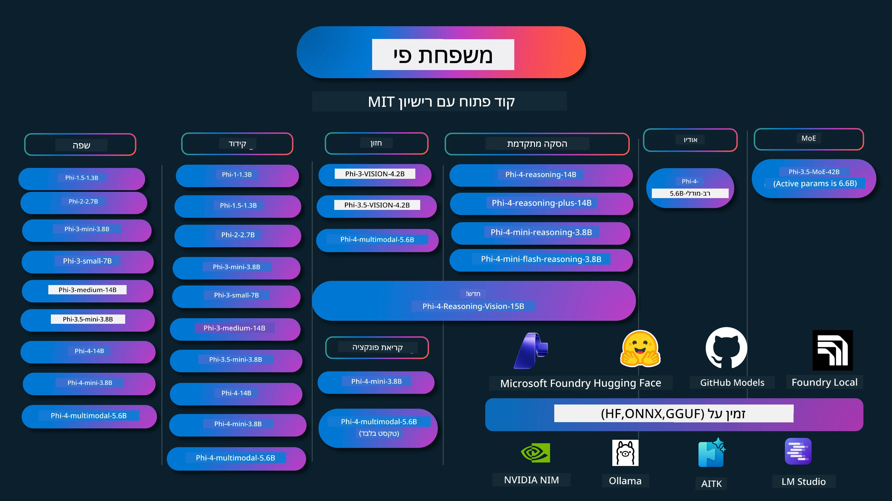

# Phi Cookbook: דוגמאות מעשיות עם דגמי Phi של מייקרוסופט

[](https://codespaces.new/microsoft/phicookbook)
[](https://vscode.dev/redirect?url=vscode://ms-vscode-remote.remote-containers/cloneInVolume?url=https://github.com/microsoft/phicookbook)

[](https://GitHub.com/microsoft/phicookbook/graphs/contributors/?WT.mc_id=aiml-137032-kinfeylo)
[](https://GitHub.com/microsoft/phicookbook/issues/?WT.mc_id=aiml-137032-kinfeylo)
[](https://GitHub.com/microsoft/phicookbook/pulls/?WT.mc_id=aiml-137032-kinfeylo)
[](http://makeapullrequest.com?WT.mc_id=aiml-137032-kinfeylo)

[](https://GitHub.com/microsoft/phicookbook/watchers/?WT.mc_id=aiml-137032-kinfeylo)
[](https://GitHub.com/microsoft/phicookbook/network/?WT.mc_id=aiml-137032-kinfeylo)
[](https://GitHub.com/microsoft/phicookbook/stargazers/?WT.mc_id=aiml-137032-kinfeylo)

[](https://discord.com/invite/ByRwuEEgH4)

Phi היא סדרה של מודלים בינה מלאכותית בקוד פתוח שפותחו על ידי מייקרוסופט.

Phi הוא כיום המודל הקטן (SLM) העוצמתי והיעיל ביותר מבחינת עלות, עם מדדים טובים מאוד בשפות רבות, בהסקת מסקנות, יצירת טקסט/שיחה, קידוד, תמונות, שמע ותסריטים אחרים.

ניתן לפרוס את Phi בענן או במכשירים בקצה הרשת, וניתן לבנות אפליקציות בינה מלאכותית גנרטיביות בקלות עם כוח מחשוב מוגבל.

עקבו אחר השלבים הבאים כדי להתחיל להשתמש במשאב זה:
1. **בצעו Fork לריפוזיטורי**: לחצו על [](https://GitHub.com/microsoft/phicookbook/network/?WT.mc_id=aiml-137032-kinfeylo)
2. **שכפלו את הריפוזיטורי**:   `git clone https://github.com/microsoft/PhiCookBook.git`
3. [**הצטרפו לקהילת Discord של מייקרוסופט AI ותפגשו מומחים ומפתחים אחרים**](https://discord.com/invite/ByRwuEEgH4?WT.mc_id=aiml-137032-kinfeylo)



### 🌐 תמיכה רב-לשונית

#### נתמך באמצעות GitHub Action (אוטומטי ותמיד מעודכן)

<!-- CO-OP TRANSLATOR LANGUAGES TABLE START -->
[ערבית](../ar/README.md) | [בנגלית](../bn/README.md) | [בולגרית](../bg/README.md) | [בורמזית (מיאנמר)](../my/README.md) | [סינית (מפושטת)](../zh-CN/README.md) | [סינית (מסורתית, הונג קונג)](../zh-HK/README.md) | [סינית (מסורתית, מקאו)](../zh-MO/README.md) | [סינית (מסורתית, טייוואן)](../zh-TW/README.md) | [קרואטית](../hr/README.md) | [צ'כית](../cs/README.md) | [דנית](../da/README.md) | [הולנדית](../nl/README.md) | [אסטונית](../et/README.md) | [פינית](../fi/README.md) | [צרפתית](../fr/README.md) | [גרמנית](../de/README.md) | [יוונית](../el/README.md) | [עברית](./README.md) | [הינדי](../hi/README.md) | [הונגרית](../hu/README.md) | [אינדונזית](../id/README.md) | [איטלקית](../it/README.md) | [יפנית](../ja/README.md) | [קאנדה](../kn/README.md) | [קוריאנית](../ko/README.md) | [ליטאית](../lt/README.md) | [מלזית](../ms/README.md) | [מליאלאם](../ml/README.md) | [מרטהית](../mr/README.md) | [נפאלית](../ne/README.md) | [פידג'ין ניגרית](../pcm/README.md) | [נורווגית](../no/README.md) | [פרסית (פארסי)](../fa/README.md) | [פולנית](../pl/README.md) | [פורטוגזית (ברזיל)](../pt-BR/README.md) | [פורטוגזית (פורטוגל)](../pt-PT/README.md) | [פנג'אבית (גורמוכי)](../pa/README.md) | [רומנית](../ro/README.md) | [רוסית](../ru/README.md) | [סרבית (קירילי)](../sr/README.md) | [סלובקית](../sk/README.md) | [סלובנית](../sl/README.md) | [ספרדית](../es/README.md) | [סווהילית](../sw/README.md) | [שבדית](../sv/README.md) | [תגאלוג (פיליפינית)](../tl/README.md) | [טמילית](../ta/README.md) | [טלווגו](../te/README.md) | [תאית](../th/README.md) | [טורקית](../tr/README.md) | [אוקראינית](../uk/README.md) | [אורדו](../ur/README.md) | [ווייטנאמית](../vi/README.md)

> **מעדיפים לשכפל מקומית?**
>
> ריפוזיטורי זה כולל מעל 50 תרגומים לשפות שמגדילים משמעותית את גודל ההורדה. לשכפול ללא תרגומים השתמשו ב-sparse checkout:
>
> **Bash / macOS / Linux:**
> ```bash
> git clone --filter=blob:none --sparse https://github.com/microsoft/PhiCookBook.git
> cd PhiCookBook
> git sparse-checkout set --no-cone '/*' '!translations' '!translated_images'
> ```
>
> **CMD (Windows):**
> ```cmd
> git clone --filter=blob:none --sparse https://github.com/microsoft/PhiCookBook.git
> cd PhiCookBook
> git sparse-checkout set --no-cone "/*" "!translations" "!translated_images"
> ```
>
> זה נותן לכם את כל מה שאתם צריכים כדי לסיים את הקורס עם הורדה מהירה יותר.
<!-- CO-OP TRANSLATOR LANGUAGES TABLE END -->

## תוכן העניינים
- מבוא - [ברוכים הבאים למשפחת פי](./md/01.Introduction/01/01.PhiFamily.md) - [הקמת הסביבה שלך](./md/01.Introduction/01/01.EnvironmentSetup.md) - [הבנת טכנולוגיות מפתח](./md/01.Introduction/01/01.Understandingtech.md) - [בטיחות בינה מלאכותית לדגמי פי](./md/01.Introduction/01/01.AISafety.md) - [תמיכת חומרה של פי](./md/01.Introduction/01/01.Hardwaresupport.md) - [דגמי פי וזמינותם בפלטפורמות שונות](./md/01.Introduction/01/01.Edgeandcloud.md) - [שימוש ב-Guidance-ai ובפי](./md/01.Introduction/01/01.Guidance.md) - [דגמי GitHub Marketplace](https://github.com/marketplace/models) - [קטלוג דגמי Azure AI](https://ai.azure.com) - הפעלת חישוב של פי בסביבות שונות - [Hugging face](./md/01.Introduction/02/01.HF.md) - [דגמי GitHub](./md/01.Introduction/02/02.GitHubModel.md) - [קטלוג דגמים של Microsoft Foundry](./md/01.Introduction/02/03.AzureAIFoundry.md) - [Ollama](./md/01.Introduction/02/04.Ollama.md) - [ערכת כלים AI ל-VSCode (AITK)](./md/01.Introduction/02/05.AITK.md) - [NVIDIA NIM](./md/01.Introduction/02/06.NVIDIA.md) - [Foundry מקומי](./md/01.Introduction/02/07.FoundryLocal.md) - הפעלת חישוב של משפחת פי - [הפעלת חישוב של פי ב-iOS](./md/01.Introduction/03/iOS_Inference.md) - [הפעלת חישוב של פי באנדרואיד](./md/01.Introduction/03/Android_Inference.md) - [הפעלת חישוב של פי ב-Jetson](./md/01.Introduction/03/Jetson_Inference.md) - [הפעלת חישוב של פי ב-AI PC](./md/01.Introduction/03/AIPC_Inference.md) - [הפעלת חישוב של פי עם מסגרת Apple MLX](./md/01.Introduction/03/MLX_Inference.md) - [הפעלת חישוב של פי בשרת מקומי](./md/01.Introduction/03/Local_Server_Inference.md) - [הפעלת חישוב של פי בשרת מרוחק באמצעות AI Toolkit](./md/01.Introduction/03/Remote_Interence.md) - [הפעלת חישוב של פי עם Rust](./md/01.Introduction/03/Rust_Inference.md) - [הפעלת חישוב של פי–חזון במקומי](./md/01.Introduction/03/Vision_Inference.md) - [הפעלת חישוב של פי עם Kaito AKS, מכולות Azure (תמיכה רשמית)](./md/01.Introduction/03/Kaito_Inference.md) - [קביעת כמות משפחת פי](./md/01.Introduction/04/QuantifyingPhi.md) - [קביעת כמות פי-3.5 / 4 באמצעות llama.cpp](./md/01.Introduction/04/UsingLlamacppQuantifyingPhi.md) - [קביעת כמות פי-3.5 / 4 באמצעות תוספות בינה מלאכותית גנרטיביות ל-onnxruntime](./md/01.Introduction/04/UsingORTGenAIQuantifyingPhi.md) - [קביעת כמות פי-3.5 / 4 באמצעות Intel OpenVINO](./md/01.Introduction/04/UsingIntelOpenVINOQuantifyingPhi.md) - [קביעת כמות פי-3.5 / 4 באמצעות מסגרת Apple MLX](./md/01.Introduction/04/UsingAppleMLXQuantifyingPhi.md) - הערכת פי - [AI אחראי](./md/01.Introduction/05/ResponsibleAI.md) - [Foundry של מיקרוסופט להערכה](./md/01.Introduction/05/AIFoundry.md) - [שימוש ב-Promptflow להערכה](./md/01.Introduction/05/Promptflow.md) - RAG עם Azure AI Search - [כיצד להשתמש ב-Phi-4-mini ו-Phi-4-multimodal (RAG) עם Azure AI Search](https://github.com/microsoft/PhiCookBook/blob/main/code/06.E2E/E2E_Phi-4-RAG-Azure-AI-Search.ipynb) - דוגמאות לפיתוח אפליקציות Phi - אפליקציות טקסט וצ׳אט - דוגמאות Phi-4 - [📓] [צ׳אט עם דגם ONNX של Phi-4-mini](./md/02.Application/01.TextAndChat/Phi4/ChatWithPhi4ONNX/README.md) - [צ׳אט עם דגם ONNX מקומי של Phi-4 ב-.NET](../../md/04.HOL/dotnet/src/LabsPhi4-Chat-01OnnxRuntime) - [אפליקציית קונסול צ׳אט ב-.NET עם Phi-4 ONNX באמצעות Semantic Kernel](../../md/04.HOL/dotnet/src/LabsPhi4-Chat-02SK) - דוגמאות Phi-3 / 3.5 - [בוט צ׳אט מקומי בדפדפן באמצעות Phi3, ONNX Runtime Web ו-WebGPU](https://github.com/microsoft/onnxruntime-inference-examples/tree/main/js/chat) - [צ׳אט OpenVino](./md/02.Application/01.TextAndChat/Phi3/E2E_OpenVino_Chat.md) - [ריבוי דגמים - אינטראקטיבי Phi-3-mini ו-OpenAI Whisper](./md/02.Application/01.TextAndChat/Phi3/E2E_Phi-3-mini_with_whisper.md) - [MLFlow - בניית עטיפה ושימוש ב-Phi-3 עם MLFlow](./md//02.Application/01.TextAndChat/Phi3/E2E_Phi-3-MLflow.md) - [אופטימיזציה של דגם - כיצד לאופטימיזציה דגם Phi-3-min עבור ONNX Runtime Web עם Olive](https://github.com/microsoft/Olive/tree/main/examples/phi3) - [אפליקציית WinUI3 עם Phi-3 mini-4k-instruct-onnx](https://github.com/microsoft/Phi3-Chat-WinUI3-Sample/) - [דוגמא לאפליקציית WinUI3 עם דגמי ריבוי AI Powered Notes](https://github.com/microsoft/ai-powered-notes-winui3-sample) - [כיול אינטגרציה של דגמי Phi-3 מותאמים אישית עם Prompt flow](./md/02.Application/01.TextAndChat/Phi3/E2E_Phi-3-FineTuning_PromptFlow_Integration.md) - [כיול אינטגרציה של דגמי Phi-3 מותאמים אישית עם Prompt flow ב-Microsoft Foundry](./md/02.Application/01.TextAndChat/Phi3/E2E_Phi-3-FineTuning_PromptFlow_Integration_AIFoundry.md) - [הערכת דגם Phi-3 / Phi-3.5 מכויל ב-Microsoft Foundry בדגש על עקרונות AI אחראים של מיקרוסופט](./md/02.Application/01.TextAndChat/Phi3/E2E_Phi-3-Evaluation_AIFoundry.md) - [📓] [דוגמת תחזית שפה עם Phi-3.5-mini-instruct (סינית/אנגלית)](./md/02.Application/01.TextAndChat/Phi3/phi3-instruct-demo.ipynb) - [בוט צ'אט RAG Phi-3.5-Instruct ב-WebGPU](./md/02.Application/01.TextAndChat/Phi3/WebGPUWithPhi35Readme.md) - [שימוש ב-GPU של Windows ליצירת פתרון Prompt flow עם Phi-3.5-Instruct ONNX](./md/02.Application/01.TextAndChat/Phi3/UsingPromptFlowWithONNX.md) - [שימוש ב-Phi-3.5 tflite של מיקרוסופט ליצירת אפליקציית אנדרואיד](./md/02.Application/01.TextAndChat/Phi3/UsingPhi35TFLiteCreateAndroidApp.md) - [דוגמת Q&A ב-.NET תוך שימוש בדגם ONNX מקומי של Phi-3 באמצעות Microsoft.ML.OnnxRuntime](../../md/04.HOL/dotnet/src/LabsPhi301) - [אפליקציית צ׳אט קונסול ב-.NET עם Semantic Kernel ו-Phi-3](../../md/04.HOL/dotnet/src/LabsPhi302) - דוגמאות מבוססות קוד SDK להסקת מסקנות ב-Azure AI - דוגמאות Phi-4 - [📓] [יצירת קוד פרויקט באמצעות Phi-4-multimodal](./md/02.Application/02.Code/Phi4/GenProjectCode/README.md) - דוגמאות Phi-3 / 3.5 - [בנה לעצמך סוכן צ׳אט GitHub Copilot ב-Visual Studio Code עם משפחת Phi-3 של מיקרוסופט](./md/02.Application/02.Code/Phi3/VSCodeExt/README.md) - [צור לעצמך סוכן צ׳אט ב-Visual Studio Code Copilot עם Phi-3.5 באמצעות דגמי GitHub](/md/02.Application/02.Code/Phi3/CreateVSCodeChatAgentWithGitHubModels.md) - דוגמאות להיגיון מתקדם - דוגמאות Phi-4 - [📓] [דוגמאות להיגיון Phi-4-mini או Phi-4](./md/02.Application/03.AdvancedReasoning/Phi4/AdvancedResoningPhi4mini/README.md) - [📓] [כיול דגם Phi-4-mini-reasoning באמצעות Microsoft Olive](./md/02.Application/03.AdvancedReasoning/Phi4/AdvancedResoningPhi4mini/olive_ft_phi_4_reasoning_with_medicaldata.ipynb) - [📓] [כיול דגם Phi-4-mini-reasoning באמצעות Apple MLX](./md/02.Application/03.AdvancedReasoning/Phi4/AdvancedResoningPhi4mini/mlx_ft_phi_4_reasoning_with_medicaldata.ipynb) - [📓] [Phi-4-mini-reasoning עם דגמי GitHub](./md/02.Application/02.Code/Phi4r/github_models_inference.ipynb) - [📓] [Phi-4-mini-reasoning עם דגמי Microsoft Foundry](./md/02.Application/02.Code/Phi4r/azure_models_inference.ipynb) -
דמויות - [דמויות Phi-4-mini הממוקמות ב-Hugging Face Spaces](https://huggingface.co/spaces/microsoft/phi-4-mini?WT.mc_id=aiml-137032-kinfeylo) - [דמויות Phi-4-multimodal הממוקמות ב-Hugginge Face Spaces](https://huggingface.co/spaces/microsoft/phi-4-multimodal?WT.mc_id=aiml-137032-kinfeylo) - דוגמאות לראייה - דוגמאות Phi-4 - [📓] [השימוש ב-Phi-4-multimodal לקריאת תמונות וליצירת קוד](./md/02.Application/04.Vision/Phi4/CreateFrontend/README.md) - דוגמאות Phi-3 / 3.5 - [📓][Phi-3-vision טקסט לתמונה לטקסט](./md/02.Application/04.Vision/Phi3/E2E_Phi-3-vision-image-text-to-text-online-endpoint.ipynb) - [Phi-3-vision-ONNX](https://onnxruntime.ai/docs/genai/tutorials/phi3-v.html) - [📓][Phi-3-vision CLIP אמבדינג](./md/02.Application/04.Vision/Phi3/E2E_Phi-3-vision-image-text-to-text-online-endpoint.ipynb) - [דמו: מיחזור Phi-3](https://github.com/jennifermarsman/PhiRecycling/) - [סיוע שפה חזותית Phi-3-vision עם Phi3-Vision ו-OpenVINO](https://docs.openvino.ai/nightly/notebooks/phi-3-vision-with-output.html) - [Phi-3 Vision Nvidia NIM](./md/02.Application/04.Vision/Phi3/E2E_Nvidia_NIM_Vision.md) - [Phi-3 Vision OpenVino](./md/02.Application/04.Vision/Phi3/E2E_OpenVino_Phi3Vision.md) - [📓][דוגמת ראייה מרובת מסגרות או מרובת תמונות Phi-3.5 Vision](./md/02.Application/04.Vision/Phi3/phi3-vision-demo.ipynb) - [מודל ONNX מקומי של Phi-3 Vision המשתמש ב-Microsoft.ML.OnnxRuntime .NET](../../md/04.HOL/dotnet/src/LabsPhi303) - [תפריט מבוסס מודל ONNX מקומי של Phi-3 Vision המשתמש ב-Microsoft.ML.OnnxRuntime .NET](../../md/04.HOL/dotnet/src/LabsPhi304) - דוגמאות להסקת מסקנות בראייה - Phi-4-Reasoning-Vision-15B - [📓] [שימוש ב-Phi-4-Reasoning-Vision-15B לזיהוי חציית כביש לא חוקית (jaywalking)](./md/02.Application/10.ReasoningVision/Phi_4_reasoning_vision_15b_Jaywalking.ipynb) - [📓] [שימוש ב-Phi-4-Reasoning-Vision-15B במתמטיקה](./md/02.Application/10.ReasoningVision/Phi_4_reasoning_vision_15b_Math.ipynb) - [📓] [שימוש ב-Phi-4-Reasoning-Vision-15B לזיהוי ממשק משתמש (UI)](./md/02.Application/10.ReasoningVision/Phi_4_reasoning_vision_15b_ui.ipynb) - דוגמאות במתמטיקה - דוגמאות Phi-4-Mini-Flash-Reasoning-Instruct [דמו מתמטי עם Phi-4-Mini-Flash-Reasoning-Instruct](./md/02.Application/09.Math/MathDemo.ipynb) - דוגמאות קול - דוגמאות Phi-4 - [📓] [הפקת תמלילים אודיו באמצעות Phi-4-multimodal](./md/02.Application/05.Audio/Phi4/Transciption/README.md) - [📓] [דוגמת אודיו Phi-4-multimodal](./md/02.Application/05.Audio/Phi4/Siri/demo.ipynb) - [📓] [דוגמת תרגום דיבור Phi-4-multimodal](./md/02.Application/05.Audio/Phi4/Translate/demo.ipynb) - [יישום קונסול .NET המשתמש ב-Phi-4-multimodal Audio לניתוח קובץ אודיו ויצירת תמליל](../../md/04.HOL/dotnet/src/LabsPhi4-MultiModal-02Audio) - דוגמאות MOE - דוגמאות Phi-3 / 3.5 - [📓] [דוגמת מודלים מעורבים של מומחים (MoEs) חברתיים בפלטפורמות מדיה חברתית Phi-3.5](./md/02.Application/06.MoE/Phi3/phi3_moe_demo.ipynb) - [📓] [בניית צינור הפקה משולב משופרת (RAG) עם NVIDIA NIM Phi-3 MOE, Azure AI Search, ו-LlamaIndex](./md/02.Application/06.MoE/Phi3/azure-ai-search-nvidia-rag.ipynb) - דוגמאות שיחות פונקציה - דוגמאות Phi-4 🆕 - [📓] [שימוש בקריאת פונקציות עם Phi-4-mini](./md/02.Application/07.FunctionCalling/Phi4/FunctionCallingBasic/README.md) - [📓] [שימוש בקריאת פונקציות ליצירת סוכנים מרובים עם Phi-4-mini](./md/02.Application/07.FunctionCalling/Phi4/Multiagents/Phi_4_mini_multiagent.ipynb) - [📓] [שימוש בקריאת פונקציות עם Ollama](./md/02.Application/07.FunctionCalling/Phi4/Ollama/ollama_functioncalling.ipynb) - [📓] [שימוש בקריאת פונקציות עם ONNX](./md/02.Application/07.FunctionCalling/Phi4/ONNX/onnx_parallel_functioncalling.ipynb) - דוגמאות מיקס מודאלי - דוגמאות Phi-4 🆕 - [📓] [שימוש ב-Phi-4-multimodal כעיתונאי טכנולוגיה](./md/02.Application/08.Multimodel/Phi4/TechJournalist/phi_4_mm_audio_text_publish_news.ipynb) - [יישום קונסול .NET המשתמש ב-Phi-4-multimodal לניתוח תמונות](../../md/04.HOL/dotnet/src/LabsPhi4-MultiModal-01Images) - דוגמאות כיוונון עדין ל-Phi - [תרחישי כיוונון עדין](./md/03.FineTuning/FineTuning_Scenarios.md) - [כיוונון עדין לעומת RAG](./md/03.FineTuning/FineTuning_vs_RAG.md) - [כיוונון עדין: הפיכת Phi-3 למומחה תעשייתי](./md/03.FineTuning/LetPhi3gotoIndustriy.md) - [כיוונון עדין ל-Phi-3 עם AI Toolkit עבור VS Code](./md/03.FineTuning/Finetuning_VSCodeaitoolkit.md) - [כיוונון עדין ל-Phi-3 עם שירות Azure Machine Learning](./md/03.FineTuning/Introduce_AzureML.md) - [כיוונון עדין ל-Phi-3 עם Lora](./md/03.FineTuning/FineTuning_Lora.md) - [כיוונון עדין ל-Phi-3 עם QLora](./md/03.FineTuning/FineTuning_Qlora.md) - [כיוונון עדין ל-Phi-3 עם Microsoft Foundry](./md/03.FineTuning/FineTuning_AIFoundry.md) - [כיוונון עדין ל-Phi-3 עם Azure ML CLI/SDK](./md/03.FineTuning/FineTuning_MLSDK.md) - [כיוונון עדין עם Microsoft Olive](./md/03.FineTuning/FineTuning_MicrosoftOlive.md) - [מעבדת עבודה בכיוונון עדין עם Microsoft Olive](./md/03.FineTuning/olive-lab/readme.md) - [כיוונון עדין ל-Phi-3-vision עם Weights and Bias](./md/03.FineTuning/FineTuning_Phi-3-visionWandB.md) - [כיוונון עדין ל-Phi-3 עם Apple MLX Framework](./md/03.FineTuning/FineTuning_MLX.md) - [כיוונון עדין ל-Phi-3-vision (תמיכה רשמית)](./md/03.FineTuning/FineTuning_Vision.md) - [כיוונון עדין ל-Phi-3 עם Kaito AKS, מכולות Azure (תמיכה רשמית)](./md/03.FineTuning/FineTuning_Kaito.md) - [כיוונון עדין ל-Phi-3 ו-3.5 Vision](https://github.com/2U1/Phi3-Vision-Finetune) - מעבדת עבודה - [חקירת מודלים מתקדמים: LLMs, SLMs, פיתוח מקומי ועוד](https://github.com/microsoft/aitour-exploring-cutting-edge-models) - [שחרור הפוטנציאל של NLP: כיוונון עדין עם Microsoft Olive](https://github.com/azure/Ignite_FineTuning_workshop) - מאמרי מחקר אקדמיים ופרסומים - [Textbooks Are All You Need II: דוח טכני של phi-1.5](https://arxiv.org/abs/2309.05463) - [דוח טכני Phi-3: מודל שפה בעל יכולות גבוהות מקומית בטלפון שלך](https://arxiv.org/abs/2404.14219) - [דוח טכני Phi-4](https://arxiv.org/abs/2412.08905) - [דוח טכני Phi-4-Mini: מודלים מרובי-מודאליות קומפקטיים אך רבי עוצמה באמצעות תמהיל LoRAs](https://arxiv.org/abs/2503.01743) - [אופטימיזציה של מודלים שפתיים קטנים לקריאת פונקציות בתוך רכב](https://arxiv.org/abs/2501.02342) - [(WhyPHI) כיוונון עדין ל-PHI-3 לשאלות רב-ברירתיות: מתודולוגיה, תוצאות ואתגרים](https://arxiv.org/abs/2501.01588) - [דוח טכני Phi-4 reasoning](https://www.microsoft.com/en-us/research/wp-content/uploads/2025/04/phi_4_reasoning.pdf)
- [דוח טכני Phi-4-mini-reasoning](https://huggingface.co/microsoft/Phi-4-mini-reasoning/blob/main/Phi-4-Mini-Reasoning.pdf)
# ספר הבישול Phi: דוגמאות מעשיות עם דגמי Phi של מיקרוסופט

[](https://codespaces.new/microsoft/phicookbook)
[](https://vscode.dev/redirect?url=vscode://ms-vscode-remote.remote-containers/cloneInVolume?url=https://github.com/microsoft/phicookbook)

[](https://GitHub.com/microsoft/phicookbook/graphs/contributors/?WT.mc_id=aiml-137032-kinfeylo)
[](https://GitHub.com/microsoft/phicookbook/issues/?WT.mc_id=aiml-137032-kinfeylo)
[](https://GitHub.com/microsoft/phicookbook/pulls/?WT.mc_id=aiml-137032-kinfeylo)
[](http://makeapullrequest.com?WT.mc_id=aiml-137032-kinfeylo)

[](https://GitHub.com/microsoft/phicookbook/watchers/?WT.mc_id=aiml-137032-kinfeylo)
[](https://GitHub.com/microsoft/phicookbook/network/?WT.mc_id=aiml-137032-kinfeylo)
[](https://GitHub.com/microsoft/phicookbook/stargazers/?WT.mc_id=aiml-137032-kinfeylo)

[](https://discord.com/invite/ByRwuEEgH4)

Phi היא סדרת מודלים בינה מלאכותית בקוד פתוח שפותחה על ידי מיקרוסופט.

Phi כיום הוא המודל הקטן (SLM) החזק והחסכוני ביותר, עם ביצועים טובים מאוד במבחנים במגוון שפות, חשיבה, יצירת טקסט/שיחה, קידוד, תמונות, אודיו ותרחישים נוספים.

אפשר לפרוס את Phi בענן או במכשירי קצה, וניתן בקלות לבנות יישומי בינה מלאכותית גנרטיביים עם כוח מחשוב מוגבל.

עקבו אחרי הצעדים האלה כדי להתחיל להשתמש במשאבים אלה:
1. **פיצול המאגר**: לחצו [](https://GitHub.com/microsoft/phicookbook/network/?WT.mc_id=aiml-137032-kinfeylo)
2. **שכפל את המאגר**: `git clone https://github.com/microsoft/PhiCookBook.git`
3. [**הצטרפו לקהילת Microsoft AI ב-Discord ופגשו מומחים ומפתחים נוספים**](https://discord.com/invite/ByRwuEEgH4?WT.mc_id=aiml-137032-kinfeylo)


### 🌐 תמיכה מרובת שפות

#### נתמכת באמצעות GitHub Action (אוטומטית ותמיד מעודכנת)

<!-- CO-OP TRANSLATOR LANGUAGES TABLE START -->
[ערבית](../ar/README.md) | [בנגלית](../bn/README.md) | [בולגרית](../bg/README.md) | [בורמזית (מיאנמר)](../my/README.md) | [סינית (מפושטת)](../zh-CN/README.md) | [סינית (מסורתית, הונג קונג)](../zh-HK/README.md) | [סינית (מסורתית, מקאו)](../zh-MO/README.md) | [סינית (מסורתית, טייוואן)](../zh-TW/README.md) | [קרואטית](../hr/README.md) | [צ’כית](../cs/README.md) | [דנית](../da/README.md) | [הולנדית](../nl/README.md) | [אסטונית](../et/README.md) | [פינית](../fi/README.md) | [צרפתית](../fr/README.md) | [גרמנית](../de/README.md) | [יוונית](../el/README.md) | [עברית](./README.md) | [הינדי](../hi/README.md) | [הונגרית](../hu/README.md) | [אינדונזית](../id/README.md) | [איטלקית](../it/README.md) | [יפנית](../ja/README.md) | [קנדה](../kn/README.md) | [קוריאנית](../ko/README.md) | [ליטאית](../lt/README.md) | [מלאית](../ms/README.md) | [מלאיאלם](../ml/README.md) | [מרטהי](../mr/README.md) | [נפאלית](../ne/README.md) | [פיג’ין ניגרי](../pcm/README.md) | [נורווגית](../no/README.md) | [פרסית (פארסי)](../fa/README.md) | [פולנית](../pl/README.md) | [פורטוגזית (ברזיל)](../pt-BR/README.md) | [פורטוגזית (פורטוגל)](../pt-PT/README.md) | [פונג’בי (ג’ורמוכי)](../pa/README.md) | [רומנית](../ro/README.md) | [רוסית](../ru/README.md) | [סרבית (קירילית)](../sr/README.md) | [סלובקית](../sk/README.md) | [סלובנית](../sl/README.md) | [ספרדית](../es/README.md) | [סוואהילי](../sw/README.md) | [שוודית](../sv/README.md) | [טגלוג (פיליפינית)](../tl/README.md) | [טמילית](../ta/README.md) | [טלוגו](../te/README.md) | [תאית](../th/README.md) | [טורקית](../tr/README.md) | [אוקראינית](../uk/README.md) | [אורדו](../ur/README.md) | [וייטנאמית](../vi/README.md)

> **מעדיפים לשכפל באופן מקומי?**
>
> מאגר זה כולל 50+ תרגומים של שפות שמגדילים משמעותית את גודל ההורדה. כדי לשכפל בלי התרגומים, השתמשו ב-sparse checkout:
>
> **Bash / macOS / Linux:**
> ```bash
> git clone --filter=blob:none --sparse https://github.com/microsoft/PhiCookBook.git
> cd PhiCookBook
> git sparse-checkout set --no-cone '/*' '!translations' '!translated_images'
> ```
>
> **CMD (Windows):**
> ```cmd
> git clone --filter=blob:none --sparse https://github.com/microsoft/PhiCookBook.git
> cd PhiCookBook
> git sparse-checkout set --no-cone "/*" "!translations" "!translated_images"
> ```
>
> כך תקבלו את כל מה שצריך להשלמת הקורס עם הורדה מהירה הרבה יותר.
<!-- CO-OP TRANSLATOR LANGUAGES TABLE END -->

## תוכן העניינים

## שימוש בדגמי Phi

### Phi ב-Microsoft Foundry

ניתן ללמוד כיצד להשתמש ב-Phi של מיקרוסופט וכיצד לבנות פתרונות מקצה לקצה (E2E) במכשירי החומרה השונים שלכם. להתנסות ב-Phi בעצמכם, התחילו לשחק עם המודלים ולהתאים את Phi לתרחישים שלכם באמצעות [Microsoft Foundry Azure AI Model Catalog](https://aka.ms/phi3-azure-ai). אפשר ללמוד יותר ב-Getting Started עם [Microsoft Foundry](/md/02.QuickStart/AzureAIFoundry_QuickStart.md)

**מגרש משחקים**
לכל מודל יש מגרש משחקים ייעודי לבחינת המודל [Azure AI Playground](https://aka.ms/try-phi3).

### Phi בדגמי GitHub

ניתן ללמוד כיצד להשתמש ב-Phi של מיקרוסופט וכיצד לבנות פתרונות מקצה לקצה במכשירי החומרה השונים שלכם. להתנסות ב-Phi בעצמכם, התחילו לשחק עם המודל ולהתאים את Phi לתרחישים שלכם באמצעות [GitHub Model Catalog](https://github.com/marketplace/models?WT.mc_id=aiml-137032-kinfeylo). אפשר ללמוד יותר ב-Getting Started עם [GitHub Model Catalog](/md/02.QuickStart/GitHubModel_QuickStart.md)

**מגרש משחקים**
לכל מודל יש [מגרש משחקים ייעודי לבחינת המודל](/md/02.QuickStart/GitHubModel_QuickStart.md).

### Phi ב-Hugging Face

ניתן גם למצוא את המודל ב-[Hugging Face](https://huggingface.co/microsoft)

**מגרש משחקים**
 [Hugging Chat playground](https://huggingface.co/chat/models/microsoft/Phi-3-mini-4k-instruct)

 ## 🎒 קורסים נוספים

הצוות שלנו מייצר קורסים נוספים! עיינו ב:

<!-- CO-OP TRANSLATOR OTHER COURSES START -->
### LangChain
[](https://aka.ms/langchain4j-for-beginners)
[](https://aka.ms/langchainjs-for-beginners?WT.mc_id=m365-94501-dwahlin)
[](https://github.com/microsoft/langchain-for-beginners?WT.mc_id=m365-94501-dwahlin)
---

### Azure / Edge / MCP / סוכנים
[](https://github.com/microsoft/AZD-for-beginners?WT.mc_id=academic-105485-koreyst)
[](https://github.com/microsoft/edgeai-for-beginners?WT.mc_id=academic-105485-koreyst)
[](https://github.com/microsoft/mcp-for-beginners?WT.mc_id=academic-105485-koreyst)
[](https://github.com/microsoft/ai-agents-for-beginners?WT.mc_id=academic-105485-koreyst)

---
 
### סדרת בינה מלאכותית גנרטיבית
[](https://github.com/microsoft/generative-ai-for-beginners?WT.mc_id=academic-105485-koreyst)
[-9333EA?style=for-the-badge&labelColor=E5E7EB&color=9333EA)](https://github.com/microsoft/Generative-AI-for-beginners-dotnet?WT.mc_id=academic-105485-koreyst)
[-C084FC?style=for-the-badge&labelColor=E5E7EB&color=C084FC)](https://github.com/microsoft/generative-ai-for-beginners-java?WT.mc_id=academic-105485-koreyst)
[-E879F9?style=for-the-badge&labelColor=E5E7EB&color=E879F9)](https://github.com/microsoft/generative-ai-with-javascript?WT.mc_id=academic-105485-koreyst)

---
 
### Core Learning
[](https://aka.ms/ml-beginners?WT.mc_id=academic-105485-koreyst)
[](https://aka.ms/datascience-beginners?WT.mc_id=academic-105485-koreyst)
[](https://aka.ms/ai-beginners?WT.mc_id=academic-105485-koreyst)
[](https://github.com/microsoft/Security-101?WT.mc_id=academic-96948-sayoung)
[](https://aka.ms/webdev-beginners?WT.mc_id=academic-105485-koreyst)
[](https://aka.ms/iot-beginners?WT.mc_id=academic-105485-koreyst)
[](https://github.com/microsoft/xr-development-for-beginners?WT.mc_id=academic-105485-koreyst)

---
 
### Copilot Series
[](https://aka.ms/GitHubCopilotAI?WT.mc_id=academic-105485-koreyst)
[](https://github.com/microsoft/mastering-github-copilot-for-dotnet-csharp-developers?WT.mc_id=academic-105485-koreyst)
[](https://github.com/microsoft/CopilotAdventures?WT.mc_id=academic-105485-koreyst)
<!-- CO-OP TRANSLATOR OTHER COURSES END -->

## AI אחראית

מייקרוסופט מחויבת לסייע ללקוחותינו להשתמש במוצרי ה-AI שלנו בצורה אחראית, לשתף את הלימודים שלנו ולבנות שותפויות מבוססות אמון דרך כלים כמו Notes שקיפות והערכות השפעה. משאבים רבים אלה זמינים ב-[https://aka.ms/RAI](https://aka.ms/RAI).
הגישה של מייקרוסופט ל-AI אחראית מתבססת על עקרונות ה-AI שלנו – הוגנות, אמינות ובטיחות, פרטיות ואבטחה, הכללה, שקיפות ואחריות.

מודלים רחבי-יריעה לשפה טבעית, תמונה ודיבור - כמו אלה המשמשים בדוגמה זו - עשויים להתנהג בדרכים לא הוגנות, לא אמינות, או פוגעניות, ולגרום לנזקים. אנא עיין ב-[הערת השקיפות של שירות Azure OpenAI](https://learn.microsoft.com/legal/cognitive-services/openai/transparency-note?tabs=text) לקבלת מידע על סיכונים ומגבלות.

הגישה המומלצת להפחתת סיכונים אלה היא לכלול מערכת בטיחות בארכיטקטורתך שיכולה לזיהוי ולמנוע התנהגות מזיקה. [Azure AI Content Safety](https://learn.microsoft.com/azure/ai-services/content-safety/overview) מספק שכבת הגנה עצמאית, המסוגלת לזהות תוכן מזיק שנוצר על ידי משתמשים ו-AI באפליקציות ושירותים. שירות Content Safety של Azure AI כולל API לטקסט ותמונה המאפשרים לזהות חומר מזיק. במסגרת Microsoft Foundry, שירות Content Safety מאפשר לך לצפות, לחקור ולנסות דוגמת קוד לזיהוי תוכן מזיק במצבי מדיה שונים. התיעוד הבא [quickstart documentation](https://learn.microsoft.com/azure/ai-services/content-safety/quickstart-text?tabs=visual-studio%2Clinux&pivots=programming-language-rest) מדריך אותך לביצוע בקשות לשירות.

היבט נוסף שיש לקחת בחשבון הוא הביצועים הכוללים של האפליקציה. עם אפליקציות מולטימודל ומולטימודליות, אנחנו מתייחסים לביצועים כהתנהלות המערכת כפי שאתה והמשתמשים שלך מצפים, כולל לא יצירת תוצרים מזיקים. חשוב להעריך את ביצועי האפליקציה הכוללת שלך באמצעות [מעריכים לביצועים, איכות, סיכון ובטיחות](https://learn.microsoft.com/azure/ai-studio/concepts/evaluation-metrics-built-in). יש לך גם את האפשרות ליצור ולהעריך באמצעות [מעריכים מותאמים אישית](https://learn.microsoft.com/azure/ai-studio/how-to/develop/evaluate-sdk#custom-evaluators).

אתה יכול להעריך את אפליקציית ה-AI שלך בסביבת הפיתוח שלך באמצעות [Azure AI Evaluation SDK](https://microsoft.github.io/promptflow/index.html). בהתבסס על מערך נתונים לבדיקה או יעד, יצירות האינטליגנציה המלאכותית שלך נמדדות כמותית באמצעות מעריכים מובנים או מעריכים מותאמים אישית שתבחר. כדי להתחיל עם Azure AI Evaluation SDK להערכת המערכת שלך, ניתן לעקוב אחר [מדריך quickstart](https://learn.microsoft.com/azure/ai-studio/how-to/develop/flow-evaluate-sdk). לאחר ביצוע ריצת הערכה, תוכל [להמחיש את התוצאות ב-Microsoft Foundry](https://learn.microsoft.com/azure/ai-studio/how-to/evaluate-flow-results).

## סימני מסחר

פרויקט זה עשוי להכיל סימני מסחר או לוגואים של פרויקטים, מוצרים או שירותים. שימוש מורשה בסימני המסחר או ללוגואים של מייקרוסופט כפוף וצריך לעקוב אחר [קווי ההנחיה לסימני מסחר ומותגים של Microsoft](https://www.microsoft.com/legal/intellectualproperty/trademarks/usage/general).
שימוש בסימני מסחר או בלוגואים של Microsoft בגרסאות מותאמות של פרויקט זה חייב לא לגרום לבלבול או להמחיש חסות של מייקרוסופט. כל שימוש בסימני מסחר או בלוגואים של צד שלישי כפוף למדיניות של צד שלישי זה.

## קבלת סיוע

אם נתקעת או יש לך שאלות לגבי פיתוח אפליקציות AI, הצטרף:

[](https://aka.ms/foundry/discord)

אם יש לך משוב על מוצר או שגיאות בעת הפיתוח, בקר:

[](https://aka.ms/foundry/forum)

---

<!-- CO-OP TRANSLATOR DISCLAIMER START -->
**כתב ויתור**:  
מסמך זה תורגם באמצעות שירות התרגום באמצעות בינה מלאכותית [Co-op Translator](https://github.com/Azure/co-op-translator). למרות שאנו שואפים לדיוק, יש לקחת בחשבון שתרגומים אוטומטיים עלולים להכיל טעויות או אי דיוקים. המסמך המקורי בשפת המקור שלו צריך להיחשב למקור הסמכותי. עבור מידע קריטי, מומלץ שימוש בתרגום מקצועי על ידי אדם. אנו לא נושאים באחריות על הבנות מוטעות או פרשנויות שגויות הנובעות משימוש בתרגום זה.
<!-- CO-OP TRANSLATOR DISCLAIMER END -->