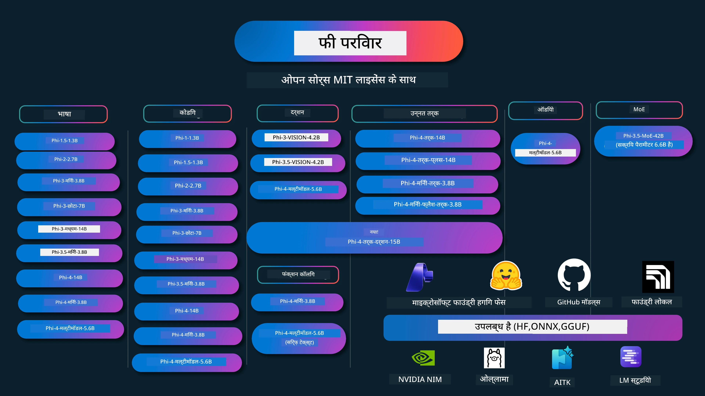

# Phi कुकबुक: Microsoft के Phi मॉडल के साथ व्यावहारिक उदाहरण

[](https://codespaces.new/microsoft/phicookbook)
[](https://vscode.dev/redirect?url=vscode://ms-vscode-remote.remote-containers/cloneInVolume?url=https://github.com/microsoft/phicookbook)

[](https://GitHub.com/microsoft/phicookbook/graphs/contributors/?WT.mc_id=aiml-137032-kinfeylo)
[](https://GitHub.com/microsoft/phicookbook/issues/?WT.mc_id=aiml-137032-kinfeylo)
[](https://GitHub.com/microsoft/phicookbook/pulls/?WT.mc_id=aiml-137032-kinfeylo)
[](http://makeapullrequest.com?WT.mc_id=aiml-137032-kinfeylo)

[](https://GitHub.com/microsoft/phicookbook/watchers/?WT.mc_id=aiml-137032-kinfeylo)
[](https://GitHub.com/microsoft/phicookbook/network/?WT.mc_id=aiml-137032-kinfeylo)
[](https://GitHub.com/microsoft/phicookbook/stargazers/?WT.mc_id=aiml-137032-kinfeylo)

[](https://discord.com/invite/ByRwuEEgH4)

Phi Microsoft द्वारा विकसित एक ओपन सोर्स AI मॉडल की श्रृंखला है।

Phi वर्तमान में सबसे शक्तिशाली और लागत-कुशल छोटे भाषा मॉडल (SLM) है, जिसमें बहुभाषी, तर्क, टेक्स्ट/चैट जनरेशन, कोडिंग, छवियां, ऑडियो और अन्य परिदृश्यों में बहुत अच्छे बेंचमार्क हैं।

आप Phi को क्लाउड या एज डिवाइस पर तैनात कर सकते हैं, और सीमित कंप्यूटिंग पावर के साथ आसानी से जनरेटिव AI एप्लिकेशन बना सकते हैं।

इन संसाधनों का उपयोग शुरू करने के लिए इन चरणों का पालन करें:
1. **रिपोजिटरी को फोर्क करें**: क्लिक करें [](https://GitHub.com/microsoft/phicookbook/network/?WT.mc_id=aiml-137032-kinfeylo)
2. **रिपोजिटरी क्लोन करें**:   `git clone https://github.com/microsoft/PhiCookBook.git`
3. [**Microsoft AI Discord समुदाय में शामिल हों और विशेषज्ञों व सह-डेवलपर्स से मिलें**](https://discord.com/invite/ByRwuEEgH4?WT.mc_id=aiml-137032-kinfeylo)



### 🌐 बहुभाषी समर्थन

#### GitHub Action के माध्यम से समर्थित (स्वचालित और हमेशा अपडेट)

<!-- CO-OP TRANSLATOR LANGUAGES TABLE START -->
[अरेबिक](../ar/README.md) | [बंगाली](../bn/README.md) | [बुल्गारियाई](../bg/README.md) | [बर्मी (म्यांमार)](../my/README.md) | [चीनी (सरलीकृत)](../zh-CN/README.md) | [चीनी (परंपरागत, हॉन्ग कॉन्ग)](../zh-HK/README.md) | [चीनी (परंपरागत, मकाओ)](../zh-MO/README.md) | [चीनी (परंपरागत, ताइवान)](../zh-TW/README.md) | [क्रोएशियाई](../hr/README.md) | [चेक](../cs/README.md) | [डेनिश](../da/README.md) | [डच](../nl/README.md) | [एस्टोनियाई](../et/README.md) | [फिनिश](../fi/README.md) | [फ्रेंच](../fr/README.md) | [जर्मन](../de/README.md) | [ग्रीक](../el/README.md) | [हिब्रू](../he/README.md) | [हिंदी](./README.md) | [हंगेरियन](../hu/README.md) | [इंडोनेशियाई](../id/README.md) | [इतालवी](../it/README.md) | [जापानी](../ja/README.md) | [कन्नड़](../kn/README.md) | [कोरियाई](../ko/README.md) | [लिथुआनियाई](../lt/README.md) | [मलय](../ms/README.md) | [मलयालम](../ml/README.md) | [मराठी](../mr/README.md) | [नेपाली](../ne/README.md) | [नाइजीरियाई पिडगिन](../pcm/README.md) | [नॉर्वेजियन](../no/README.md) | [फ़ारसी (फ़ारसी)](../fa/README.md) | [पोलिश](../pl/README.md) | [पुर्तगाली (ब्राजील)](../pt-BR/README.md) | [पुर्तगाली (पुर्तगाल)](../pt-PT/README.md) | [पंजाबी (गुरमुखी)](../pa/README.md) | [रोमानियाई](../ro/README.md) | [रूसी](../ru/README.md) | [सर्बियाई (सिरिलिक)](../sr/README.md) | [स्लोवाक](../sk/README.md) | [स्लोवेनियाई](../sl/README.md) | [स्पेनिश](../es/README.md) | [स्वाहिली](../sw/README.md) | [स्वीडिश](../sv/README.md) | [टागालोग (फिलीपीनो)](../tl/README.md) | [तमिल](../ta/README.md) | [तेलुगु](../te/README.md) | [थाई](../th/README.md) | [तुर्की](../tr/README.md) | [यूक्रेनी](../uk/README.md) | [उर्दू](../ur/README.md) | [वियतनामी](../vi/README.md)

> **लोकल क्लोन करना पसंद है?**
>
> इस रिपोजिटरी में 50+ भाषा अनुवाद शामिल हैं जो डाउनलोड साइज को काफी बढ़ाते हैं। अनुवाद के बिना क्लोन करने के लिए, स्पार्स चेकआउट का उपयोग करें:
>
> **Bash / macOS / Linux:**
> ```bash
> git clone --filter=blob:none --sparse https://github.com/microsoft/PhiCookBook.git
> cd PhiCookBook
> git sparse-checkout set --no-cone '/*' '!translations' '!translated_images'
> ```
>
> **CMD (Windows):**
> ```cmd
> git clone --filter=blob:none --sparse https://github.com/microsoft/PhiCookBook.git
> cd PhiCookBook
> git sparse-checkout set --no-cone "/*" "!translations" "!translated_images"
> ```
>
> इससे आपको कोर्स पूरा करने के लिए आवश्यक सब कुछ मिल जाता है, वह भी बहुत तेज़ डाउनलोड के साथ।
<!-- CO-OP TRANSLATOR LANGUAGES TABLE END -->

## विषय सूची
- परिचय - [फाई परिवार में आपका स्वागत है](./md/01.Introduction/01/01.PhiFamily.md) - [अपने पर्यावरण को सेटअप करना](./md/01.Introduction/01/01.EnvironmentSetup.md) - [प्रमुख तकनीकों को समझना](./md/01.Introduction/01/01.Understandingtech.md) - [फाई मॉडलों के लिए एआई सुरक्षा](./md/01.Introduction/01/01.AISafety.md) - [फाई हार्डवेयर समर्थन](./md/01.Introduction/01/01.Hardwaresupport.md) - [फाई मॉडल और प्लेटफार्मों पर उपलब्धता](./md/01.Introduction/01/01.Edgeandcloud.md) - [गाइडेंस-एआई और फाई का उपयोग करना](./md/01.Introduction/01/01.Guidance.md) - [गिटहब मार्केटप्लेस मॉडल](https://github.com/marketplace/models) - [एज़ूर एआई मॉडल कैटलॉग](https://ai.azure.com) - विभिन्न वातावरण में फाई का इन्फ़रेंस - [हगिंग फेस](./md/01.Introduction/02/01.HF.md) - [गिटहब मॉडल](./md/01.Introduction/02/02.GitHubModel.md) - [माइक्रोसॉफ्ट फाउंड्री मॉडल कैटलॉग](./md/01.Introduction/02/03.AzureAIFoundry.md) - [ओल्लामा](./md/01.Introduction/02/04.Ollama.md) - [एआई टूलकिट VSCode (AITK)](./md/01.Introduction/02/05.AITK.md) - [एनवीआईडीआईए एनआईएम](./md/01.Introduction/02/06.NVIDIA.md) - [फाउंड्री लोकल](./md/01.Introduction/02/07.FoundryLocal.md) - फाई परिवार में इन्फ़रेंस - [आईओएस में फाई इन्फ़रेंस](./md/01.Introduction/03/iOS_Inference.md) - [एंड्रॉइड में फाई इन्फ़रेंस](./md/01.Introduction/03/Android_Inference.md) - [जेटसन में फाई इन्फ़रेंस](./md/01.Introduction/03/Jetson_Inference.md) - [एआई पीसी में फाई इन्फ़रेंस](./md/01.Introduction/03/AIPC_Inference.md) - [एप्पल MLX फ्रेमवर्क के साथ फाई इन्फ़रेंस](./md/01.Introduction/03/MLX_Inference.md) - [लोकल सर्वर में फाई इन्फ़रेंस](./md/01.Introduction/03/Local_Server_Inference.md) - [एआई टूलकिट का उपयोग करके रिमोट सर्वर में फाई इन्फ़रेंस](./md/01.Introduction/03/Remote_Interence.md) - [रस्ट के साथ फाई इन्फ़रेंस](./md/01.Introduction/03/Rust_Inference.md) - [लोकल में फाई--विजन इन्फ़रेंस](./md/01.Introduction/03/Vision_Inference.md) - [काइटो AKS, एज़ूर कंटेनरों (आधिकारिक समर्थन) के साथ फाई इन्फ़रेंस](./md/01.Introduction/03/Kaito_Inference.md) - [फाई परिवार का क्वांटिफाई करना](./md/01.Introduction/04/QuantifyingPhi.md) - [लामा.cpp का उपयोग करके फाई-3.5 / 4 का क्वांटाइजेशन](./md/01.Introduction/04/UsingLlamacppQuantifyingPhi.md) - [onnxruntime के लिए जनरेटिव एआई एक्सटेंशंस का उपयोग करके फाई-3.5 / 4 का क्वांटाइजेशन](./md/01.Introduction/04/UsingORTGenAIQuantifyingPhi.md) - [इंटेल OpenVINO का उपयोग करके फाई-3.5 / 4 का क्वांटाइजेशन](./md/01.Introduction/04/UsingIntelOpenVINOQuantifyingPhi.md) - [एप्पल MLX फ्रेमवर्क का उपयोग करके फाई-3.5 / 4 का क्वांटाइजेशन](./md/01.Introduction/04/UsingAppleMLXQuantifyingPhi.md) - फाई का मूल्यांकन - [जिम्मेदार एआई](./md/01.Introduction/05/ResponsibleAI.md) - [माइक्रोसॉफ्ट फाउंड्री के लिए मूल्यांकन](./md/01.Introduction/05/AIFoundry.md) - [मूल्यांकन के लिए प्रॉम्प्टफ़्लो का उपयोग](./md/01.Introduction/05/Promptflow.md) - Azure AI Search के साथ RAG - [Azure AI Search के साथ Phi-4-mini और Phi-4-multimodal (RAG) का उपयोग कैसे करें](https://github.com/microsoft/PhiCookBook/blob/main/code/06.E2E/E2E_Phi-4-RAG-Azure-AI-Search.ipynb) - फाई एप्लिकेशन विकास नमूने - टेक्स्ट और चैट एप्लिकेशन - फाई-4 नमूने - [📓] [Phi-4-mini ONNX मॉडल के साथ चैट करें](./md/02.Application/01.TextAndChat/Phi4/ChatWithPhi4ONNX/README.md) - [लोकल ONNX मॉडल .NET के साथ Phi-4 के साथ चैट करें](../../md/04.HOL/dotnet/src/LabsPhi4-Chat-01OnnxRuntime) - [सेमैन्टिक कर्नेल का उपयोग करके Phi-4 ONNX के साथ .NET कंसोल ऐप से चैट करें](../../md/04.HOL/dotnet/src/LabsPhi4-Chat-02SK) - फाई-3 / 3.5 नमूने - [ब्राउज़र में लोकल चैटबॉट का उपयोग Phi3, ONNX Runtime Web और WebGPU के साथ](https://github.com/microsoft/onnxruntime-inference-examples/tree/main/js/chat) - [OpenVino चैट](./md/02.Application/01.TextAndChat/Phi3/E2E_OpenVino_Chat.md) - [मल्टी मॉडल - इंटरैक्टिव Phi-3-mini और OpenAI Whisper](./md/02.Application/01.TextAndChat/Phi3/E2E_Phi-3-mini_with_whisper.md) - [MLFlow - एक रैपर बनाना और Phi-3 के साथ MLFlow का उपयोग करना](./md//02.Application/01.TextAndChat/Phi3/E2E_Phi-3-MLflow.md) - [मॉडल ऑप्टिमाइजेशन - ONNX Runtime Web के लिए फाई-3-min मॉडल को ऑलिव के साथ कैसे ऑप्टिमाइज़ करें](https://github.com/microsoft/Olive/tree/main/examples/phi3) - [Phi-3 mini-4k-instruct-onnx के साथ WinUI3 ऐप](https://github.com/microsoft/Phi3-Chat-WinUI3-Sample/) - [WinUI3 मल्टी मॉडल AI पावर्ड नोट्स ऐप नमूना](https://github.com/microsoft/ai-powered-notes-winui3-sample) - [प्रॉम्प्ट फ्लो के साथ कस्टम फाई-3 मॉडलों का फाइन-ट्यून और एकीकरण](./md/02.Application/01.TextAndChat/Phi3/E2E_Phi-3-FineTuning_PromptFlow_Integration.md) - [माइक्रोसॉफ्ट फाउंड्री में प्रॉम्प्ट फ्लो के साथ कस्टम फाई-3 मॉडलों का फाइन-ट्यून और एकीकरण](./md/02.Application/01.TextAndChat/Phi3/E2E_Phi-3-FineTuning_PromptFlow_Integration_AIFoundry.md) - [माइक्रोसॉफ्ट के जिम्मेदार एआई सिद्धांतों पर ध्यान केंद्रित करते हुए माइक्रोसॉफ्ट फाउंड्री में फाइन-ट्यूनिंग किए गए फाई-3 / फाई-3.5 मॉडल का मूल्यांकन](./md/02.Application/01.TextAndChat/Phi3/E2E_Phi-3-Evaluation_AIFoundry.md) - [📓] [Phi-3.5-mini-instruct भाषा भविष्यवाणी नमूना (चीनी/अंग्रेजी)](./md/02.Application/01.TextAndChat/Phi3/phi3-instruct-demo.ipynb) - [Phi-3.5-Instruct WebGPU RAG चैटबॉट](./md/02.Application/01.TextAndChat/Phi3/WebGPUWithPhi35Readme.md) - [Phi-3.5-Instruct ONNX के साथ विंडोज GPU का उपयोग करके प्रॉम्प्ट फ्लो सॉल्यूशन बनाना](./md/02.Application/01.TextAndChat/Phi3/UsingPromptFlowWithONNX.md) - [माइक्रोसॉफ्ट Phi-3.5 tflite का उपयोग करके Android ऐप बनाना](./md/02.Application/01.TextAndChat/Phi3/UsingPhi35TFLiteCreateAndroidApp.md) - [Microsoft.ML.OnnxRuntime का उपयोग करते हुए स्थानीय ONNX Phi-3 मॉडल के साथ Q&A .NET उदाहरण](../../md/04.HOL/dotnet/src/LabsPhi301) - [सेमेन्टिक कर्नेल और फाई-3 के साथ .NET कंसोल चैट ऐप](../../md/04.HOL/dotnet/src/LabsPhi302) - Azure AI इन्फ़रेंस SDK कोड आधारित नमूने - फाई-4 नमूने - [📓] [Phi-4-multimodal का उपयोग करके प्रोजेक्ट कोड जनरेट करें](./md/02.Application/02.Code/Phi4/GenProjectCode/README.md) - फाई-3 / 3.5 नमूने - [माइक्रोसॉफ्ट फाई-3 परिवार के साथ अपना खुद का Visual Studio Code GitHub Copilot चैट बनाएं](./md/02.Application/02.Code/Phi3/VSCodeExt/README.md) - [गिटहब मॉडल के साथ Phi-3.5 द्वारा अपने खुद के Visual Studio Code चैट कॉपायलट एजेंट बनाएं](/md/02.Application/02.Code/Phi3/CreateVSCodeChatAgentWithGitHubModels.md) - उन्नत तर्क नमूने - फाई-4 नमूने - [📓] [Phi-4-mini-तर्क या Phi-4-तर्क नमूने](./md/02.Application/03.AdvancedReasoning/Phi4/AdvancedResoningPhi4mini/README.md) - [📓] [माइक्रोसॉफ्ट ऑलिव के साथ Phi-4-mini-तर्क का फाइन-ट्यूनिंग](./md/02.Application/03.AdvancedReasoning/Phi4/AdvancedResoningPhi4mini/olive_ft_phi_4_reasoning_with_medicaldata.ipynb) - [📓] [एप्पल MLX के साथ Phi-4-mini-तर्क का फाइन-ट्यूनिंग](./md/02.Application/03.AdvancedReasoning/Phi4/AdvancedResoningPhi4mini/mlx_ft_phi_4_reasoning_with_medicaldata.ipynb) - [📓] [गिटहब मॉडल के साथ Phi-4-mini-तर्क](./md/02.Application/02.Code/Phi4r/github_models_inference.ipynb) - [📓] [माइक्रोसॉफ्ट फाउंड्री मॉडल के साथ Phi-4-mini-तर्क](./md/02.Application/02.Code/Phi4r/azure_models_inference.ipynb) -
डेमो - [Phi-4-mini डेमो जो Hugging Face Spaces पर होस्ट किए गए हैं](https://huggingface.co/spaces/microsoft/phi-4-mini?WT.mc_id=aiml-137032-kinfeylo) - [Phi-4-multimodal डेमो जो Hugging Face Spaces पर होस्ट किए गए हैं](https://huggingface.co/spaces/microsoft/phi-4-multimodal?WT.mc_id=aiml-137032-kinfeylo) - विज़न नमूने - Phi-4 नमूने - [📓] [Phi-4-multimodal का उपयोग करके चित्र पढ़ना और कोड जनरेट करना](./md/02.Application/04.Vision/Phi4/CreateFrontend/README.md) - Phi-3 / 3.5 नमूने - [📓][Phi-3-vision-छवि से पाठ में टेक्स्ट](./md/02.Application/04.Vision/Phi3/E2E_Phi-3-vision-image-text-to-text-online-endpoint.ipynb) - [Phi-3-vision-ONNX](https://onnxruntime.ai/docs/genai/tutorials/phi3-v.html) - [📓][Phi-3-vision CLIP एम्बेडिंग](./md/02.Application/04.Vision/Phi3/E2E_Phi-3-vision-image-text-to-text-online-endpoint.ipynb) - [डेमो: Phi-3 रीसायक्लिंग](https://github.com/jennifermarsman/PhiRecycling/) - [Phi-3-vision - विज़ुअल भाषा सहायक - Phi3-विजन और OpenVINO के साथ](https://docs.openvino.ai/nightly/notebooks/phi-3-vision-with-output.html) - [Phi-3 विज़न Nvidia NIM](./md/02.Application/04.Vision/Phi3/E2E_Nvidia_NIM_Vision.md) - [Phi-3 विज़न OpenVino](./md/02.Application/04.Vision/Phi3/E2E_OpenVino_Phi3Vision.md) - [📓][Phi-3.5 विज़न मल्टि-फ्रेम या मल्टि-छवि नमूना](./md/02.Application/04.Vision/Phi3/phi3-vision-demo.ipynb) - [Phi-3 विज़न स्थानीय ONNX मॉडल Microsoft.ML.OnnxRuntime .NET का उपयोग करते हुए](../../md/04.HOL/dotnet/src/LabsPhi303) - [मेनू आधारित Phi-3 विज़न स्थानीय ONNX मॉडल Microsoft.ML.OnnxRuntime .NET का उपयोग करते हुए](../../md/04.HOL/dotnet/src/LabsPhi304) - रीजनिंग-विजन नमूने - Phi-4-रीजनिंग-विजन-15B - [📓] [Phi-4-रीजनिंग-विजन-15B का उपयोग करके जयेवॉकिंग का पता लगाना](./md/02.Application/10.ReasoningVision/Phi_4_reasoning_vision_15b_Jaywalking.ipynb) - [📓] [Phi-4-रीजनिंग-विजन-15B का उपयोग गणित के लिए](./md/02.Application/10.ReasoningVision/Phi_4_reasoning_vision_15b_Math.ipynb) - [📓] [Phi-4-रीजनिंग-विजन-15B का उपयोग यूआई का पता लगाने के लिए](./md/02.Application/10.ReasoningVision/Phi_4_reasoning_vision_15b_ui.ipynb) - गणित नमूने - Phi-4-Mini-Flash-Reasoning-Instruct नमूने [Phi-4-Mini-Flash-Reasoning-Instruct के साथ गणित डेमो](./md/02.Application/09.Math/MathDemo.ipynb) - ऑडियो नमूने - Phi-4 नमूने - [📓] [Phi-4-multimodal का उपयोग करके ऑडियो ट्रांसक्रिप्ट निकालना](./md/02.Application/05.Audio/Phi4/Transciption/README.md) - [📓] [Phi-4-multimodal ऑडियो नमूना](./md/02.Application/05.Audio/Phi4/Siri/demo.ipynb) - [📓] [Phi-4-multimodal भाषण अनुवाद नमूना](./md/02.Application/05.Audio/Phi4/Translate/demo.ipynb) - [.NET कंसोल एप्लिकेशन Phi-4-multimodal ऑडियो का उपयोग करके एक ऑडियो फ़ाइल का विश्लेषण और ट्रांसक्रिप्ट जनरेट करने के लिए](../../md/04.HOL/dotnet/src/LabsPhi4-MultiModal-02Audio) - MOE नमूने - Phi-3 / 3.5 नमूने - [📓] [Phi-3.5 Mixture of Experts Models (MoEs) सोशल मीडिया नमूना](./md/02.Application/06.MoE/Phi3/phi3_moe_demo.ipynb) - [📓] [NVIDIA NIM Phi-3 MOE, Azure AI Search और LlamaIndex के साथ Retrieval-Augmented Generation (RAG) पाइपलाइन बनाना](./md/02.Application/06.MoE/Phi3/azure-ai-search-nvidia-rag.ipynb) - - फ़ंक्शन कॉलिंग नमूने - Phi-4 नमूने 🆕 - [📓] [Phi-4-mini के साथ फ़ंक्शन कॉलिंग का उपयोग](./md/02.Application/07.FunctionCalling/Phi4/FunctionCallingBasic/README.md) - [📓] [Phi-4-mini के साथ मल्टी-एजेंट बनाने के लिए फ़ंक्शन कॉलिंग का उपयोग](./md/02.Application/07.FunctionCalling/Phi4/Multiagents/Phi_4_mini_multiagent.ipynb) - [📓] [Ollama के साथ फ़ंक्शन कॉलिंग का उपयोग](./md/02.Application/07.FunctionCalling/Phi4/Ollama/ollama_functioncalling.ipynb) - [📓] [ONNX के साथ फ़ंक्शन कॉलिंग का उपयोग](./md/02.Application/07.FunctionCalling/Phi4/ONNX/onnx_parallel_functioncalling.ipynb) - मल्टीमोडल मिक्सिंग नमूने - Phi-4 नमूने 🆕 - [📓] [Phi-4-multimodal का उपयोग एक तकनीकी पत्रकार के रूप में](./md/02.Application/08.Multimodel/Phi4/TechJournalist/phi_4_mm_audio_text_publish_news.ipynb) - [.NET कंसोल एप्लिकेशन Phi-4-multimodal का उपयोग करके चित्रों का विश्लेषण](../../md/04.HOL/dotnet/src/LabsPhi4-MultiModal-01Images) - फ़ाइन-ट्यूनिंग Phi नमूने - [फ़ाइन-ट्यूनिंग परिदृश्य](./md/03.FineTuning/FineTuning_Scenarios.md) - [फ़ाइन-ट्यूनिंग बनाम RAG](./md/03.FineTuning/FineTuning_vs_RAG.md) - [Phi-3 को उद्योग विशेषज्ञ बनने दें फ़ाइन-ट्यूनिंग](./md/03.FineTuning/LetPhi3gotoIndustriy.md) - [VS कोड के लिए AI टूलकिट के साथ Phi-3 का फ़ाइन-ट्यूनिंग](./md/03.FineTuning/Finetuning_VSCodeaitoolkit.md) - [Azure मशीन लर्निंग सेवा के साथ Phi-3 का फ़ाइन-ट्यूनिंग](./md/03.FineTuning/Introduce_AzureML.md) - [Lora के साथ Phi-3 का फ़ाइन-ट्यूनिंग](./md/03.FineTuning/FineTuning_Lora.md) - [QLora के साथ Phi-3 का फ़ाइन-ट्यूनिंग](./md/03.FineTuning/FineTuning_Qlora.md) - [Microsoft Foundry के साथ Phi-3 का फ़ाइन-ट्यूनिंग](./md/03.FineTuning/FineTuning_AIFoundry.md) - [Azure ML CLI/SDK के साथ Phi-3 का फ़ाइन-ट्यूनिंग](./md/03.FineTuning/FineTuning_MLSDK.md) - [Microsoft Olive के साथ फ़ाइन-ट्यूनिंग](./md/03.FineTuning/FineTuning_MicrosoftOlive.md) - [Microsoft Olive हैंड्स-ऑन लैब के साथ फ़ाइन-ट्यूनिंग](./md/03.FineTuning/olive-lab/readme.md) - [Weights and Bias के साथ Phi-3-vision का फ़ाइन-ट्यूनिंग](./md/03.FineTuning/FineTuning_Phi-3-visionWandB.md) - [Apple MLX फ्रेमवर्क के साथ Phi-3 का फ़ाइन-ट्यूनिंग](./md/03.FineTuning/FineTuning_MLX.md) - [Phi-3-vision (आधिकारिक समर्थन) का फ़ाइन-ट्यूनिंग](./md/03.FineTuning/FineTuning_Vision.md) - [Kaito AKS, Azure Containers (आधिकारिक समर्थन) के साथ Phi-3 का फ़ाइन-ट्यूनिंग](./md/03.FineTuning/FineTuning_Kaito.md) - [Phi-3 और 3.5 विज़न का फ़ाइन-ट्यूनिंग](https://github.com/2U1/Phi3-Vision-Finetune) - हैंड्स ऑन लैब - [आधुनिक मॉडलों का अन्वेषण: LLM, SLM, स्थानीय विकास और अधिक](https://github.com/microsoft/aitour-exploring-cutting-edge-models) - [NLP की क्षमता खोलना: Microsoft Olive के साथ फ़ाइन-ट्यूनिंग](https://github.com/azure/Ignite_FineTuning_workshop) - अकादमिक शोध पत्र और प्रकाशन - [Textbooks Are All You Need II: phi-1.5 तकनीकी रिपोर्ट](https://arxiv.org/abs/2309.05463) - [Phi-3 तकनीकी रिपोर्ट: आपके फोन पर स्थानीय रूप से एक अत्यंत सक्षम भाषा मॉडल](https://arxiv.org/abs/2404.14219) - [Phi-4 तकनीकी रिपोर्ट](https://arxiv.org/abs/2412.08905) - [Phi-4-Mini तकनीकी रिपोर्ट: मिश्रण-ऑफ-LoRAs के माध्यम से कॉम्पैक्ट लेकिन शक्तिशाली मल्टीमोडल भाषा मॉडल](https://arxiv.org/abs/2503.01743) - [वाहन-में फ़ंक्शन-कॉलिंग के लिए छोटे भाषा मॉडलों का अनुकूलन](https://arxiv.org/abs/2501.02342) - [(WhyPHI) बहुविकल्पीय प्रश्न उत्तर के लिए PHI-3 का फ़ाइन-ट्यूनिंग: पद्धति, परिणाम और चुनौतियाँ](https://arxiv.org/abs/2501.01588) - [Phi-4-रीजनिंग तकनीकी रिपोर्ट](https://www.microsoft.com/en-us/research/wp-content/uploads/2025/04/phi_4_reasoning.pdf)
- [Phi-4-mini-तार्किक रिपोर्ट](https://huggingface.co/microsoft/Phi-4-mini-reasoning/blob/main/Phi-4-Mini-Reasoning.pdf)
# फाई कुकबुक: Microsoft के Phi मॉडलों के साथ हैंड्स-ऑन उदाहरण

[](https://codespaces.new/microsoft/phicookbook)
[](https://vscode.dev/redirect?url=vscode://ms-vscode-remote.remote-containers/cloneInVolume?url=https://github.com/microsoft/phicookbook)

[](https://GitHub.com/microsoft/phicookbook/graphs/contributors/?WT.mc_id=aiml-137032-kinfeylo)
[](https://GitHub.com/microsoft/phicookbook/issues/?WT.mc_id=aiml-137032-kinfeylo)
[](https://GitHub.com/microsoft/phicookbook/pulls/?WT.mc_id=aiml-137032-kinfeylo)
[](http://makeapullrequest.com?WT.mc_id=aiml-137032-kinfeylo)

[](https://GitHub.com/microsoft/phicookbook/watchers/?WT.mc_id=aiml-137032-kinfeylo)
[](https://GitHub.com/microsoft/phicookbook/network/?WT.mc_id=aiml-137032-kinfeylo)
[](https://GitHub.com/microsoft/phicookbook/stargazers/?WT.mc_id=aiml-137032-kinfeylo)

[](https://discord.com/invite/ByRwuEEgH4)

Phi Microsoft द्वारा विकसित खुले स्रोत AI मॉडलों की एक श्रृंखला है।

Phi वर्तमान में सबसे शक्तिशाली और लागत-प्रभावी स्मॉल लैंग्वेज मॉडल (SLM) है, जिसमें बहुभाषी, तर्क, टेक्स्ट/चैट जनरेशन, कोडिंग, इमेज, ऑडियो और अन्य परिदृश्यों में बहुत अच्छे बेंचमार्क हैं।

आप Phi को क्लाउड या एज डिवाइसों पर डिप्लॉय कर सकते हैं, और सीमित कंप्यूटिंग पावर के साथ आसानी से जनरेटिव AI एप्लिकेशन बना सकते हैं।

इन संसाधनों का उपयोग शुरू करने के लिए ये कदम अपनाएं:  
1. **रिपॉजिटरी को फोर्क करें**: क्लिक करें [](https://GitHub.com/microsoft/phicookbook/network/?WT.mc_id=aiml-137032-kinfeylo)  
2. **रिपॉजिटरी क्लोन करें**:   `git clone https://github.com/microsoft/PhiCookBook.git`  
3. [**Microsoft AI Discord समुदाय में शामिल हों और विशेषज्ञों और साथियों डेवलपर्स से मिलें**](https://discord.com/invite/ByRwuEEgH4?WT.mc_id=aiml-137032-kinfeylo)


### 🌐 बहुभाषी समर्थन

#### GitHub Action के माध्यम से समर्थित (स्वचालित और हमेशा अद्यतन)

<!-- CO-OP TRANSLATOR LANGUAGES TABLE START -->
[अरबी](../ar/README.md) | [बंगाली](../bn/README.md) | [बुल्गेरियाई](../bg/README.md) | [बर्मी (म्यांमार)](../my/README.md) | [चीनी (सरलीकृत)](../zh-CN/README.md) | [चीनी (पारंपरिक, हांगकांग)](../zh-HK/README.md) | [चीनी (पारंपरिक, मकाऊ)](../zh-MO/README.md) | [चीनी (पारंपरिक, ताइवान)](../zh-TW/README.md) | [क्रोएशियाई](../hr/README.md) | [चेक](../cs/README.md) | [डेनिश](../da/README.md) | [डच](../nl/README.md) | [एस्टोनियाई](../et/README.md) | [फिनिश](../fi/README.md) | [फ्रेंच](../fr/README.md) | [जर्मन](../de/README.md) | [यूनानी](../el/README.md) | [हिब्रू](../he/README.md) | [हिंदी](./README.md) | [हंगेरियन](../hu/README.md) | [इंडोनेशियाई](../id/README.md) | [इतालवी](../it/README.md) | [जापानी](../ja/README.md) | [कन्नड़](../kn/README.md) | [कोरियाई](../ko/README.md) | [लिथुआनियाई](../lt/README.md) | [मलय](../ms/README.md) | [मल्याळम](../ml/README.md) | [मराठी](../mr/README.md) | [नेपाली](../ne/README.md) | [नाइजीरियाई पिजिन](../pcm/README.md) | [नॉर्वेजियन](../no/README.md) | [फ़ारसी (फ़ारसी)](../fa/README.md) | [पोलिश](../pl/README.md) | [पुर्तगाली (ब्राजील)](../pt-BR/README.md) | [पुर्तगाली (पुर्तगाल)](../pt-PT/README.md) | [पंजाबी (गुरमुखी)](../pa/README.md) | [रोमानियाई](../ro/README.md) | [रूसी](../ru/README.md) | [सर्बियाई (सिरिलिक)](../sr/README.md) | [स्लोवाक](../sk/README.md) | [स्लोवेनियाई](../sl/README.md) | [स्पेनिश](../es/README.md) | [स्वाहिली](../sw/README.md) | [स्वीडिश](../sv/README.md) | [टगलोग (फिलिपीनी)](../tl/README.md) | [तमिल](../ta/README.md) | [तेलुगु](../te/README.md) | [थाई](../th/README.md) | [तुर्किश](../tr/README.md) | [युक्रेनी](../uk/README.md) | [उर्दू](../ur/README.md) | [वियतनामी](../vi/README.md)

> **स्थानीय रूप से क्लोन करना पसंद करते हैं?**  
> यह रिपॉजिटरी 50+ भाषाओं के अनुवाद शामिल करती है जो डाउनलोड आकार को काफी बढ़ा देता है। बिना अनुवाद के क्लोन करने के लिए sparse checkout का उपयोग करें:  
>  
> **Bash / macOS / Linux:**  
> ```bash
> git clone --filter=blob:none --sparse https://github.com/microsoft/PhiCookBook.git
> cd PhiCookBook
> git sparse-checkout set --no-cone '/*' '!translations' '!translated_images'
> ```
>  
> **CMD (Windows):**  
> ```cmd
> git clone --filter=blob:none --sparse https://github.com/microsoft/PhiCookBook.git
> cd PhiCookBook
> git sparse-checkout set --no-cone "/*" "!translations" "!translated_images"
> ```
>  
> इससे आप कोर्स पूरा करने के लिए सब कुछ तेज़ डाउनलोड के साथ प्राप्त होगा।  
<!-- CO-OP TRANSLATOR LANGUAGES TABLE END -->

## सामग्री सूची

## Phi मॉडल का उपयोग करना

### Microsoft Foundry पर Phi

आप यह सीख सकते हैं कि Microsoft Phi का उपयोग कैसे करें और अपने विभिन्न हार्डवेयर उपकरणों में E2E समाधान कैसे बनाएँ। Phi का अनुभव प्राप्त करने के लिए, मॉडल के साथ खेलने और आपके परिदृश्यों के लिए Phi को अनुकूलित करने से शुरू करें [Microsoft Foundry Azure AI Model Catalog](https://aka.ms/phi3-azure-ai)। आप [Microsoft Foundry](/md/02.QuickStart/AzureAIFoundry_QuickStart.md) के साथ शुरुआत करने के बारे में अधिक सीख सकते हैं।

**प्लेलैंड**  
प्रत्येक मॉडल के लिए एक समर्पित प्लेलैंड है जहाँ मॉडल का परीक्षण किया जा सकता है [Azure AI Playground](https://aka.ms/try-phi3)।

### GitHub मॉडल्स पर Phi

आप सीख सकते हैं कि Microsoft Phi का उपयोग कैसे करें और अपने विभिन्न हार्डवेयर उपकरणों में E2E समाधान कैसे बनाएँ। Phi का अनुभव प्राप्त करने के लिए, मॉडल के साथ खेलने और आपके परिदृश्यों के लिए Phi को अनुकूलित करने से शुरू करें [GitHub Model Catalog](https://github.com/marketplace/models?WT.mc_id=aiml-137032-kinfeylo)। आप [GitHub Model Catalog](/md/02.QuickStart/GitHubModel_QuickStart.md) के साथ शुरुआत करने के बारे में अधिक जान सकते हैं।

**प्लेलैंड**  
प्रत्येक मॉडल के लिए एक समर्पित [प्लेलैंड है जहाँ मॉडल का परीक्षण किया जा सकता है](/md/02.QuickStart/GitHubModel_QuickStart.md)।

### Hugging Face पर Phi

आप मॉडल को [Hugging Face](https://huggingface.co/microsoft) पर भी पा सकते हैं।

**प्लेलैंड**  
[Hugging Chat प्लेलैंड](https://huggingface.co/chat/models/microsoft/Phi-3-mini-4k-instruct)

## 🎒 अन्य कोर्स

हमारी टीम अन्य कोर्स भी बनाती है! देखें:

<!-- CO-OP TRANSLATOR OTHER COURSES START -->
### LangChain  
[](https://aka.ms/langchain4j-for-beginners)  
[](https://aka.ms/langchainjs-for-beginners?WT.mc_id=m365-94501-dwahlin)  
[](https://github.com/microsoft/langchain-for-beginners?WT.mc_id=m365-94501-dwahlin)  
---

### Azure / एज / MCP / एजेंट्स  
[](https://github.com/microsoft/AZD-for-beginners?WT.mc_id=academic-105485-koreyst)  
[](https://github.com/microsoft/edgeai-for-beginners?WT.mc_id=academic-105485-koreyst)  
[](https://github.com/microsoft/mcp-for-beginners?WT.mc_id=academic-105485-koreyst)  
[](https://github.com/microsoft/ai-agents-for-beginners?WT.mc_id=academic-105485-koreyst)  

---

### जनरेटिव AI सीरीज  
[](https://github.com/microsoft/generative-ai-for-beginners?WT.mc_id=academic-105485-koreyst)  
[-9333EA?style=for-the-badge&labelColor=E5E7EB&color=9333EA)](https://github.com/microsoft/Generative-AI-for-beginners-dotnet?WT.mc_id=academic-105485-koreyst)  

[-C084FC?style=for-the-badge&labelColor=E5E7EB&color=C084FC)](https://github.com/microsoft/generative-ai-for-beginners-java?WT.mc_id=academic-105485-koreyst)
[-E879F9?style=for-the-badge&labelColor=E5E7EB&color=E879F9)](https://github.com/microsoft/generative-ai-with-javascript?WT.mc_id=academic-105485-koreyst)

---
 
### मुख्य शिक्षण
[](https://aka.ms/ml-beginners?WT.mc_id=academic-105485-koreyst)
[](https://aka.ms/datascience-beginners?WT.mc_id=academic-105485-koreyst)
[](https://aka.ms/ai-beginners?WT.mc_id=academic-105485-koreyst)
[](https://github.com/microsoft/Security-101?WT.mc_id=academic-96948-sayoung)
[](https://aka.ms/webdev-beginners?WT.mc_id=academic-105485-koreyst)
[](https://aka.ms/iot-beginners?WT.mc_id=academic-105485-koreyst)
[](https://github.com/microsoft/xr-development-for-beginners?WT.mc_id=academic-105485-koreyst)

---
 
### Copilot श्रृंखला
[](https://aka.ms/GitHubCopilotAI?WT.mc_id=academic-105485-koreyst)
[](https://github.com/microsoft/mastering-github-copilot-for-dotnet-csharp-developers?WT.mc_id=academic-105485-koreyst)
[](https://github.com/microsoft/CopilotAdventures?WT.mc_id=academic-105485-koreyst)
<!-- CO-OP TRANSLATOR OTHER COURSES END -->

## ज़िम्मेदार AI 

Microsoft हमारे ग्राहकों को हमारे AI उत्पादों का जिम्मेदारी से उपयोग करने, हमारे अनुभव साझा करने और Transparency Notes और Impact Assessments जैसे टूल्स के माध्यम से विश्वास-आधारित साझेदारी बनाने के लिए प्रतिबद्ध है। इन संसाधनों में से कई [https://aka.ms/RAI](https://aka.ms/RAI) पर पाए जा सकते हैं।
Microsoft का जिम्मेदार AI के प्रति दृष्टिकोण हमारे AI सिद्धांतों पर आधारित है: न्याय, विश्वसनीयता और सुरक्षा, गोपनीयता और सुरक्षा, समावेशिता, पारदर्शिता, और जवाबदेही।

यह नमूना उपयोग किए गए बड़े पैमाने पर प्राकृतिक भाषा, छवि, और भाषण मॉडल - संभावित रूप से ऐसे व्यवहार कर सकते हैं जो अनुचित, अविश्वसनीय, या अपमानजनक हों, जिससे नुकसान हो सकता है। कृपया जोखिमों और सीमाओं के बारे में जानकारी के लिए [Azure OpenAI सेवा Transparency note](https://learn.microsoft.com/legal/cognitive-services/openai/transparency-note?tabs=text) का संदर्भ लें।

इन जोखिमों को कम करने के लिए अनुशंसित तरीका है कि आपके आर्किटेक्चर में एक सुरक्षा प्रणाली शामिल हो जो हानिकारक व्यवहार का पता लगा सके और उसे रोक सके। [Azure AI Content Safety](https://learn.microsoft.com/azure/ai-services/content-safety/overview) एक स्वतंत्र सुरक्षा परत प्रदान करता है, जो एप्लिकेशन और सेवाओं में हानिकारक उपयोगकर्ता-जनित और AI-जनित सामग्री का पता लगा सकता है। Azure AI Content Safety में टेक्स्ट और इमेज API शामिल हैं जो हानिकारक सामग्री का पता लगाने में सक्षम हैं। Microsoft Foundry के भीतर, Content Safety सेवा आपको विभिन्न स्वरूपों में हानिकारक सामग्री का पता लगाने के लिए नमूना कोड देखने, अन्वेषण करने और आज़माने की अनुमति देती है। निम्नलिखित [quickstart दस्तावेज़](https://learn.microsoft.com/azure/ai-services/content-safety/quickstart-text?tabs=visual-studio%2Clinux&pivots=programming-language-rest) आपको सेवा में अनुरोध भेजने के लिए मार्गदर्शन करता है।

एक अन्य पहलू जिसे ध्यान में रखना है वह है समग्र एप्लिकेशन प्रदर्शन। बहु-मॉडल और बहु-मॉडल एप्लिकेशन के साथ, हम प्रदर्शन से आशय रखते हैं कि सिस्टम आपके और आपके उपयोगकर्ताओं की उम्मीदों के अनुसार काम करे, जिसमें हानिकारक आउटपुट न उत्पन्न करना शामिल है। अपने कुल एप्लिकेशन के प्रदर्शन का मूल्यांकन करना जरूरी है, [Performance and Quality and Risk and Safety evaluators](https://learn.microsoft.com/azure/ai-studio/concepts/evaluation-metrics-built-in) का उपयोग करके। आपके पास [custom evaluators](https://learn.microsoft.com/azure/ai-studio/how-to/develop/evaluate-sdk#custom-evaluators) के साथ मूल्यांकन और सृजन करने की सुविधा भी है।

आप अपने विकास पर्यावरण में [Azure AI Evaluation SDK](https://microsoft.github.io/promptflow/index.html) का उपयोग करके अपने AI एप्लिकेशन का मूल्यांकन कर सकते हैं। दिए गए परीक्षण डेटासेट या लक्ष्य के आधार पर, आपकी जनरेटिव AI एप्लिकेशन जनरेशन अंतर्निर्मित या आपके चुने हुए कस्टम ईवैल्यूएटर्स के साथ मात्रात्मक रूप से मापी जाती हैं। azure ai evaluation sdk के साथ अपने सिस्टम का मूल्यांकन शुरू करने के लिए, आप [quickstart guide](https://learn.microsoft.com/azure/ai-studio/how-to/develop/flow-evaluate-sdk) का अनुसरण कर सकते हैं। एक बार जब आप एक मूल्यांकन रन निष्पादित कर लेते हैं, तो आप [Microsoft Foundry में परिणामों का दृश्यांकन](https://learn.microsoft.com/azure/ai-studio/how-to/evaluate-flow-results) कर सकते हैं।

## ट्रेडमार्क

यह परियोजना परियोजनाओं, उत्पादों, या सेवाओं के लिए ट्रेडमार्क या लोगो हो सकते हैं। Microsoft ट्रेडमार्क या लोगो के अधिकृत उपयोग को [Microsoft के ट्रेडमार्क और ब्रांड दिशानिर्देश](https://www.microsoft.com/legal/intellectualproperty/trademarks/usage/general) के अनुसार होना चाहिए।
परियोजना के संशोधित संस्करणों में Microsoft ट्रेडमार्क या लोगो के उपयोग से भ्रम नहीं होना चाहिए और Microsoft प्रायोजन का संकेत नहीं देना चाहिए। किसी भी तृतीय-पक्ष ट्रेडमार्क या लोगो के उपयोग पर संबंधित तृतीय-पक्ष की नीतियाँ लागू होती हैं।

## सहायता प्राप्त करना

यदि आप अटक जाते हैं या AI ऐप बनाने के बारे में कोई प्रश्न है, तो शामिल हों:

[](https://aka.ms/foundry/discord)

यदि आपके पास उत्पाद प्रतिक्रिया या निर्माण के दौरान त्रुटियां हैं तो जाएं:

[](https://aka.ms/foundry/forum)

---

<!-- CO-OP TRANSLATOR DISCLAIMER START -->
**अस्वीकरण**:
इस दस्तावेज़ का अनुवाद AI अनुवादन सेवा [Co-op Translator](https://github.com/Azure/co-op-translator) का उपयोग करके किया गया है। जबकि हम सटीकता के लिए प्रयासरत हैं, कृपया ध्यान दें कि स्वचालित अनुवादों में त्रुटियाँ या अशुद्धियाँ हो सकती हैं। मूल भाषा में दस्तावेज़ को अधिकारिक स्रोत माना जाना चाहिए। महत्वपूर्ण जानकारी के लिए, पेशेवर मानव अनुवाद की सिफारिश की जाती है। इस अनुवाद के उपयोग से उत्पन्न किसी भी गलतफहमी या गलत व्याख्या के लिए हम उत्तरदायी नहीं हैं।
<!-- CO-OP TRANSLATOR DISCLAIMER END -->