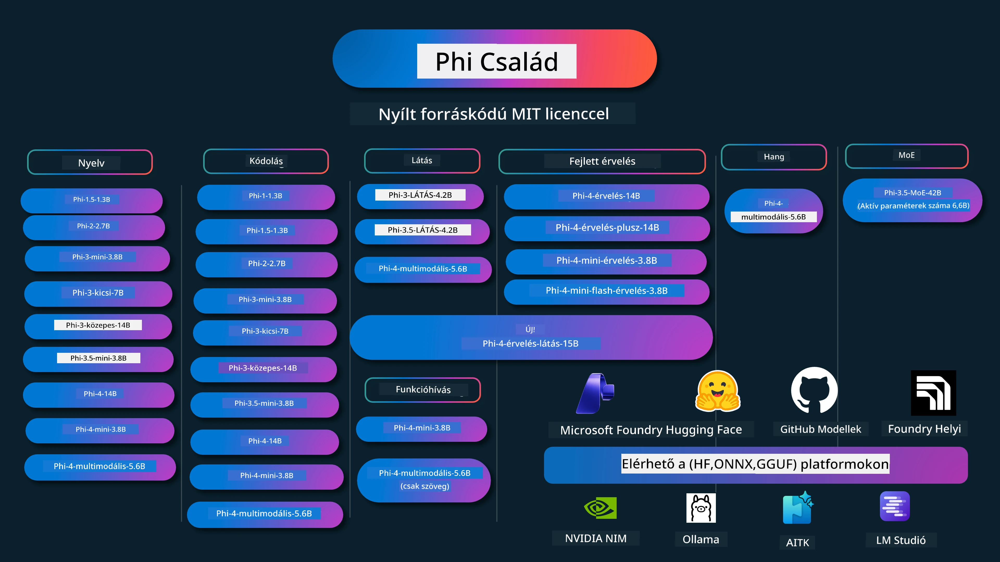

# Phi Cookbook: Gyakorlati példák a Microsoft Phi modelljeivel

[](https://codespaces.new/microsoft/phicookbook)
[](https://vscode.dev/redirect?url=vscode://ms-vscode-remote.remote-containers/cloneInVolume?url=https://github.com/microsoft/phicookbook)

[](https://GitHub.com/microsoft/phicookbook/graphs/contributors/?WT.mc_id=aiml-137032-kinfeylo)
[](https://GitHub.com/microsoft/phicookbook/issues/?WT.mc_id=aiml-137032-kinfeylo)
[](https://GitHub.com/microsoft/phicookbook/pulls/?WT.mc_id=aiml-137032-kinfeylo)
[](http://makeapullrequest.com?WT.mc_id=aiml-137032-kinfeylo)

[](https://GitHub.com/microsoft/phicookbook/watchers/?WT.mc_id=aiml-137032-kinfeylo)
[](https://GitHub.com/microsoft/phicookbook/network/?WT.mc_id=aiml-137032-kinfeylo)
[](https://GitHub.com/microsoft/phicookbook/stargazers/?WT.mc_id=aiml-137032-kinfeylo)

[](https://discord.com/invite/ByRwuEEgH4)

A Phi a Microsoft által fejlesztett nyílt forráskódú AI modellek sorozata.

A Phi jelenleg a leghatékonyabb és legköltséghatékonyabb kis nyelvi modell (SLM), amely kiváló eredményeket ért el többnyelvűség, következtetés, szöveg/csevegés generálás, kódolás, képek, hang és egyéb szcenáriók terén.

Telepítheted a Phit felhőbe vagy élő eszközökre, és könnyedén építhetsz generatív AI alkalmazásokat korlátozott számítási kapacitással.

Kövesd az alábbi lépéseket az erőforrás használatának megkezdéséhez:
1. **Forkold le a tárat**: Kattints ide [](https://GitHub.com/microsoft/phicookbook/network/?WT.mc_id=aiml-137032-kinfeylo)
2. **Klónozd a tárat**: `git clone https://github.com/microsoft/PhiCookBook.git`
3. [**Csatlakozz a Microsoft AI Discord közösséghez, és találkozz szakértőkkel és fejlesztőtársaiddal**](https://discord.com/invite/ByRwuEEgH4?WT.mc_id=aiml-137032-kinfeylo)



### 🌐 Többnyelvű támogatás

#### GitHub Action segítségével támogatott (Automatikus és mindig naprakész)

<!-- CO-OP TRANSLATOR LANGUAGES TABLE START -->
[Arab](../ar/README.md) | [Bengáli](../bn/README.md) | [Bolgár](../bg/README.md) | [Burmai (Mianmar)](../my/README.md) | [Kínai (egyszerűsített)](../zh-CN/README.md) | [Kínai (hagyományos, Hongkong)](../zh-HK/README.md) | [Kínai (hagyományos, Makaó)](../zh-MO/README.md) | [Kínai (hagyományos, Tajvan)](../zh-TW/README.md) | [Horvát](../hr/README.md) | [Cseh](../cs/README.md) | [Dán](../da/README.md) | [Holland](../nl/README.md) | [Észt](../et/README.md) | [Finn](../fi/README.md) | [Francia](../fr/README.md) | [Német](../de/README.md) | [Görög](../el/README.md) | [Héber](../he/README.md) | [Hindi](../hi/README.md) | [Magyar](./README.md) | [Indonéz](../id/README.md) | [Olasz](../it/README.md) | [Japán](../ja/README.md) | [Kannada](../kn/README.md) | [Khmer](../km/README.md) | [Koreai](../ko/README.md) | [Litván](../lt/README.md) | [Maláj](../ms/README.md) | [Malayalam](../ml/README.md) | [Marathi](../mr/README.md) | [Nepáli](../ne/README.md) | [Nigériai pidgin](../pcm/README.md) | [Norvég](../no/README.md) | [Perzsa (Fárszi)](../fa/README.md) | [Lengyel](../pl/README.md) | [Portugál (Brazília)](../pt-BR/README.md) | [Portugál (Portugália)](../pt-PT/README.md) | [Pandzsábi (Gurmukhi)](../pa/README.md) | [Román](../ro/README.md) | [Orosz](../ru/README.md) | [Szerb (cirill)](../sr/README.md) | [Szlovák](../sk/README.md) | [Szlovén](../sl/README.md) | [Spanyol](../es/README.md) | [Szuahéli](../sw/README.md) | [Svéd](../sv/README.md) | [Tagalog (Filippínó)](../tl/README.md) | [Tamil](../ta/README.md) | [Telugu](../te/README.md) | [Thailand](../th/README.md) | [Török](../tr/README.md) | [Ukrán](../uk/README.md) | [Urdu](../ur/README.md) | [Vietnami](../vi/README.md)

> **Szeretnéd helyben klónozni?**
>
> Ez a tár több mint 50 nyelvi fordítást tartalmaz, ami jelentősen megnöveli a letöltési méretet. Ha fordítások nélkül szeretnéd klónozni, használj sparse checkout-ot:
>
> **Bash / macOS / Linux:**
> ```bash
> git clone --filter=blob:none --sparse https://github.com/microsoft/PhiCookBook.git
> cd PhiCookBook
> git sparse-checkout set --no-cone '/*' '!translations' '!translated_images'
> ```
>
> **CMD (Windows):**
> ```cmd
> git clone --filter=blob:none --sparse https://github.com/microsoft/PhiCookBook.git
> cd PhiCookBook
> git sparse-checkout set --no-cone "/*" "!translations" "!translated_images"
> ```
>
> Ez minden szükséges dolgot biztosít a kurzus befejezéséhez sokkal gyorsabb letöltéssel.
<!-- CO-OP TRANSLATOR LANGUAGES TABLE END -->

## Tartalomjegyzék

- Bevezetés
  - [Üdvözlünk a Phi családban](./md/01.Introduction/01/01.PhiFamily.md)
  - [Környezeti beállítás](./md/01.Introduction/01/01.EnvironmentSetup.md)
  - [Kulcsfontosságú technológiák megértése](./md/01.Introduction/01/01.Understandingtech.md)
  - [AI biztonság a Phi modellekhez](./md/01.Introduction/01/01.AISafety.md)
  - [Phi hardvertámogatás](./md/01.Introduction/01/01.Hardwaresupport.md)
  - [Phi modellek és elérhetőség platformokon](./md/01.Introduction/01/01.Edgeandcloud.md)
  - [Guidance-ai és Phi használata](./md/01.Introduction/01/01.Guidance.md)
  - [GitHub piactéri modellek](https://github.com/marketplace/models)
  - [Azure AI modell katalógus](https://ai.azure.com)

- Phi futtatása különböző környezetekben
    -  [Hugging Face](./md/01.Introduction/02/01.HF.md)
    -  [GitHub modellek](./md/01.Introduction/02/02.GitHubModel.md)
    -  [Microsoft Foundry modell katalógus](./md/01.Introduction/02/03.AzureAIFoundry.md)
    -  [Ollama](./md/01.Introduction/02/04.Ollama.md)
    -  [AI Toolkit VSCode (AITK)](./md/01.Introduction/02/05.AITK.md)
    -  [NVIDIA NIM](./md/01.Introduction/02/06.NVIDIA.md)
    -  [Foundry helyi](./md/01.Introduction/02/07.FoundryLocal.md)

- Phi család futtatása
    - [Phi futtatása iOS-en](./md/01.Introduction/03/iOS_Inference.md)
    - [Phi futtatása Androidon](./md/01.Introduction/03/Android_Inference.md)
    - [Phi futtatása Jetsonon](./md/01.Introduction/03/Jetson_Inference.md)
    - [Phi futtatása AI PC-n](./md/01.Introduction/03/AIPC_Inference.md)
    - [Phi futtatása Apple MLX Framework-kel](./md/01.Introduction/03/MLX_Inference.md)
    - [Phi futtatása helyi szerveren](./md/01.Introduction/03/Local_Server_Inference.md)
    - [Phi futtatása távoli szerveren AI Toolkit használatával](./md/01.Introduction/03/Remote_Interence.md)
    - [Phi futtatása Rust-tal](./md/01.Introduction/03/Rust_Inference.md)
    - [Phi Vision futtatása helyben](./md/01.Introduction/03/Vision_Inference.md)
    - [Phi futtatása Kaito AKS, Azure Containers (hivatalos támogatás)](./md/01.Introduction/03/Kaito_Inference.md)
-  [Phi család kvantálása](./md/01.Introduction/04/QuantifyingPhi.md)
    - [Phi-3.5 / 4 kvantálása llama.cpp használatával](./md/01.Introduction/04/UsingLlamacppQuantifyingPhi.md)
    - [Phi-3.5 / 4 kvantálása Generative AI bővítményekkel onnxruntime-hoz](./md/01.Introduction/04/UsingORTGenAIQuantifyingPhi.md)
    - [Phi-3.5 / 4 kvantálása Intel OpenVINO használatával](./md/01.Introduction/04/UsingIntelOpenVINOQuantifyingPhi.md)
    - [Phi-3.5 / 4 kvantálása Apple MLX Framework-kel](./md/01.Introduction/04/UsingAppleMLXQuantifyingPhi.md)

- Phi értékelése
    - [Felelős AI](./md/01.Introduction/05/ResponsibleAI.md)
    - [Microsoft Foundry értékeléshez](./md/01.Introduction/05/AIFoundry.md)
    - [Promptflow használata értékeléshez](./md/01.Introduction/05/Promptflow.md)
 
- RAG az Azure AI Kereséssel
    - [Hogyan használd a Phi-4-mini és Phi-4-multimodal (RAG) modelleket Azure AI Kereséssel](https://github.com/microsoft/PhiCookBook/blob/main/code/06.E2E/E2E_Phi-4-RAG-Azure-AI-Search.ipynb)

- Phi alkalmazásfejlesztési példák
  - Szöveg és csevegő alkalmazások
    - Phi-4 példák 
      - [📓] [Csevegés Phi-4-mini ONNX modellel](./md/02.Application/01.TextAndChat/Phi4/ChatWithPhi4ONNX/README.md)
      - [Csevegés Phi-4 helyi ONNX modellel .NET-ben](../../md/04.HOL/dotnet/src/LabsPhi4-Chat-01OnnxRuntime)
      - [Csevegő .NET konzolalkalmazás Phi-4 ONNX-szel a Semantic Kernel használatával](../../md/04.HOL/dotnet/src/LabsPhi4-Chat-02SK)
    - Phi-3 / 3.5 példák
      - [Helyi csevegő a böngészőben Phi3, ONNX Runtime Web és WebGPU használatával](https://github.com/microsoft/onnxruntime-inference-examples/tree/main/js/chat)
      - [OpenVino Chat](./md/02.Application/01.TextAndChat/Phi3/E2E_OpenVino_Chat.md)
      - [Több modell - Interaktív Phi-3-mini és OpenAI Whisper](./md/02.Application/01.TextAndChat/Phi3/E2E_Phi-3-mini_with_whisper.md)
      - [MLFlow - Wrapper készítése és Phi-3 használata MLFlow-val](./md//02.Application/01.TextAndChat/Phi3/E2E_Phi-3-MLflow.md)
      - [Modelloptimalizálás - Hogyan optimalizáljuk a Phi-3-mini modellt ONNX Runtime Web használatra Olive-dal](https://github.com/microsoft/Olive/tree/main/examples/phi3)
      - [WinUI3 alkalmazás Phi-3 mini-4k-instruct-onnx modellel](https://github.com/microsoft/Phi3-Chat-WinUI3-Sample/)
      -[WinUI3 Többmodell AI által vezérelt jegyzet alkalmazás példa](https://github.com/microsoft/ai-powered-notes-winui3-sample)
      - [Egyedi Phi-3 modellek finomhangolása és integrálása Prompt flow-val](./md/02.Application/01.TextAndChat/Phi3/E2E_Phi-3-FineTuning_PromptFlow_Integration.md)
      - [Egyedi Phi-3 modellek finomhangolása és integrálása Prompt flow-val a Microsoft Foundry-ban](./md/02.Application/01.TextAndChat/Phi3/E2E_Phi-3-FineTuning_PromptFlow_Integration_AIFoundry.md)
      - [A finomhangolt Phi-3 / Phi-3.5 modell értékelése a Microsoft Foundry-ban, fókuszálva a Microsoft Felelős MI elveire](./md/02.Application/01.TextAndChat/Phi3/E2E_Phi-3-Evaluation_AIFoundry.md)
      - [📓] [Phi-3.5-mini-instruct nyelvi előrejelző minta (kínai/angol)](./md/02.Application/01.TextAndChat/Phi3/phi3-instruct-demo.ipynb)
      - [Phi-3.5-Instruct WebGPU RAG Chatbot](./md/02.Application/01.TextAndChat/Phi3/WebGPUWithPhi35Readme.md)
      - [Windows GPU használata Prompt flow megoldás létrehozásához Phi-3.5-Instruct ONNX-szel](./md/02.Application/01.TextAndChat/Phi3/UsingPromptFlowWithONNX.md)
      - [Microsoft Phi-3.5 tflite használata Android alkalmazás létrehozásához](./md/02.Application/01.TextAndChat/Phi3/UsingPhi35TFLiteCreateAndroidApp.md)
      - [Kérdések és válaszok .NET példa helyi ONNX Phi-3 modellel a Microsoft.ML.OnnxRuntime használatával](../../md/04.HOL/dotnet/src/LabsPhi301)
      - [Konzol chat .NET alkalmazás Semantic Kernel és Phi-3 modellel](../../md/04.HOL/dotnet/src/LabsPhi302)

  - Azure AI Inference SDK Kód Alapú Minták 
    - Phi-4 Minták 
      - [📓] [Projektkód generálása Phi-4-multimodal használatával](./md/02.Application/02.Code/Phi4/GenProjectCode/README.md)
    - Phi-3 / 3.5 Minták
      - [Építsd meg saját Visual Studio Code GitHub Copilot Chat-edet a Microsoft Phi-3 családdal](./md/02.Application/02.Code/Phi3/VSCodeExt/README.md)
      - [Hozd létre saját Visual Studio Code Chat Copilot ügynököd Phi-3.5-tel GitHub modellekkel](/md/02.Application/02.Code/Phi3/CreateVSCodeChatAgentWithGitHubModels.md)

  - Haladó Érvelési Minták
    - Phi-4 Minták 
      - [📓] [Phi-4-mini-érvelés vagy Phi-4-érvelés minták](./md/02.Application/03.AdvancedReasoning/Phi4/AdvancedResoningPhi4mini/README.md)
      - [📓] [Phi-4-mini-érvelés finomhangolása Microsoft Olive-dal](./md/02.Application/03.AdvancedReasoning/Phi4/AdvancedResoningPhi4mini/olive_ft_phi_4_reasoning_with_medicaldata.ipynb)
      - [📓] [Phi-4-mini-érvelés finomhangolása Apple MLX-szel](./md/02.Application/03.AdvancedReasoning/Phi4/AdvancedResoningPhi4mini/mlx_ft_phi_4_reasoning_with_medicaldata.ipynb)
      - [📓] [Phi-4-mini-érvelés GitHub modellekkel](./md/02.Application/02.Code/Phi4r/github_models_inference.ipynb)
      - [📓] [Phi-4-mini-érvelés Microsoft Foundry modellekkel](./md/02.Application/02.Code/Phi4r/azure_models_inference.ipynb)
  - Demók
      - [Phi-4-mini demók a Hugging Face Spaces-en](https://huggingface.co/spaces/microsoft/phi-4-mini?WT.mc_id=aiml-137032-kinfeylo)
      - [Phi-4-multimodal demók a Hugging Face Spaces-en](https://huggingface.co/spaces/microsoft/phi-4-multimodal?WT.mc_id=aiml-137032-kinfeylo)
  - Látás Minták
    - Phi-4 Minták 
      - [📓] [Használja a Phi-4-multimodal-t képek olvasására és kód generálására](./md/02.Application/04.Vision/Phi4/CreateFrontend/README.md) 
    - Phi-3 / 3.5 Minták
      -  [📓][Phi-3-látás-Képszöveg átalakítása szöveggé](./md/02.Application/04.Vision/Phi3/E2E_Phi-3-vision-image-text-to-text-online-endpoint.ipynb)
      - [Phi-3-látás-ONNX](https://onnxruntime.ai/docs/genai/tutorials/phi3-v.html)
      - [📓][Phi-3-látás CLIP beágyazás](./md/02.Application/04.Vision/Phi3/E2E_Phi-3-vision-image-text-to-text-online-endpoint.ipynb)
      - [DEMO: Phi-3 újrahasznosítás](https://github.com/jennifermarsman/PhiRecycling/)
      - [Phi-3-látás - Vizualis nyelvi asszisztens - Phi3-Latással és OpenVINO-val](https://docs.openvino.ai/nightly/notebooks/phi-3-vision-with-output.html)
      - [Phi-3 Látás Nvidia NIM](./md/02.Application/04.Vision/Phi3/E2E_Nvidia_NIM_Vision.md)
      - [Phi-3 Látás OpenVino](./md/02.Application/04.Vision/Phi3/E2E_OpenVino_Phi3Vision.md)
      - [📓][Phi-3.5 Látás többkeretes vagy többképes minta](./md/02.Application/04.Vision/Phi3/phi3-vision-demo.ipynb)
      - [Phi-3 Látás Helyi ONNX Modell a Microsoft.ML.OnnxRuntime .NET segítségével](../../md/04.HOL/dotnet/src/LabsPhi303)
      - [Menü alapú Phi-3 Látás Helyi ONNX Modell a Microsoft.ML.OnnxRuntime .NET segítségével](../../md/04.HOL/dotnet/src/LabsPhi304)

  - Érvelés-Látás Minták
    - Phi-4-Érvelés-Látás-15B 
      - [📓] [Phi-4-Érvelés-Látás-15B használata tilos átkelés észlelésére](./md/02.Application/10.ReasoningVision/Phi_4_reasoning_vision_15b_Jaywalking.ipynb)
      - [📓] [Phi-4-Érvelés-Látás-15B használata matematikához](./md/02.Application/10.ReasoningVision/Phi_4_reasoning_vision_15b_Math.ipynb)
      - [📓] [Phi-4-Érvelés-Látás-15B használata UI észlelésére](./md/02.Application/10.ReasoningVision/Phi_4_reasoning_vision_15b_ui.ipynb)

  - Matematikai Minták
    -  Phi-4-Mini-Flash-Érvelés-Utasítás Minták  [Matematika Demo Phi-4-Mini-Flash-Érvelés-Utasítással](./md/02.Application/09.Math/MathDemo.ipynb)

  - Hang Minták
    - Phi-4 Minták 
      - [📓] [Hangátiratok kinyerése Phi-4-multimodal segítségével](./md/02.Application/05.Audio/Phi4/Transciption/README.md)
      - [📓] [Phi-4-multimodal Hangminta](./md/02.Application/05.Audio/Phi4/Siri/demo.ipynb)
      - [📓] [Phi-4-multimodal Beszédfordítási minta](./md/02.Application/05.Audio/Phi4/Translate/demo.ipynb)
      - [.NET konzolalkalmazás Phi-4-multimodallal hangfájl elemzésére és átirat generálására](../../md/04.HOL/dotnet/src/LabsPhi4-MultiModal-02Audio)

  - MOE Minták
    - Phi-3 / 3.5 Minták
      - [📓] [Phi-3.5 Szakértői keverék modellek (MoEs) közösségi média minta](./md/02.Application/06.MoE/Phi3/phi3_moe_demo.ipynb)
      - [📓] [Visszakeresés-alapú generálási (RAG) pipeline építése NVIDIA NIM Phi-3 MOE-val, Azure AI Kereséssel és LlamaIndex-szel](./md/02.Application/06.MoE/Phi3/azure-ai-search-nvidia-rag.ipynb)
      - 
  - Funkcióhívás Minták
    - Phi-4 Minták 🆕
      -  [📓] [Funkcióhívás használata Phi-4-mini-vel](./md/02.Application/07.FunctionCalling/Phi4/FunctionCallingBasic/README.md)
      -  [📓] [Funkcióhívás használata multi-ügynökök létrehozásához Phi-4-minivel](./md/02.Application/07.FunctionCalling/Phi4/Multiagents/Phi_4_mini_multiagent.ipynb)
      -  [📓] [Funkcióhívás használata Ollama-val](./md/02.Application/07.FunctionCalling/Phi4/Ollama/ollama_functioncalling.ipynb)
      -  [📓] [Funkcióhívás használata ONNX-szel](./md/02.Application/07.FunctionCalling/Phi4/ONNX/onnx_parallel_functioncalling.ipynb)
  - Többmodalitás keverése Minták
    - Phi-4 Minták 🆕
      -  [📓] [Phi-4-multimodal használata technológiai újságíróként](./md/02.Application/08.Multimodel/Phi4/TechJournalist/phi_4_mm_audio_text_publish_news.ipynb)
      - [.NET konzolalkalmazás Phi-4-multimodal képelemzéshez](../../md/04.HOL/dotnet/src/LabsPhi4-MultiModal-01Images)

- Phi finomhangolása minták
  - [Finomhangolási forgatókönyvek](./md/03.FineTuning/FineTuning_Scenarios.md)
  - [Finomhangolás vs RAG](./md/03.FineTuning/FineTuning_vs_RAG.md)
  - [Finomhangolás: Engedd, hogy Phi-3 iparági szakértővé váljon](./md/03.FineTuning/LetPhi3gotoIndustriy.md)
  - [Phi-3 finomhangolása AI Toolkitkel a VS Code-hoz](./md/03.FineTuning/Finetuning_VSCodeaitoolkit.md)
  - [Phi-3 finomhangolása Azure Machine Learning Service-szel](./md/03.FineTuning/Introduce_AzureML.md)
  - [Phi-3 finomhangolása Lora-val](./md/03.FineTuning/FineTuning_Lora.md)
  - [Phi-3 finomhangolása QLora-val](./md/03.FineTuning/FineTuning_Qlora.md)
  - [Phi-3 finomhangolása Microsoft Foundry-val](./md/03.FineTuning/FineTuning_AIFoundry.md)
  - [Phi-3 finomhangolása Azure ML CLI/SDK-val](./md/03.FineTuning/FineTuning_MLSDK.md)
  - [Finomhangolás Microsoft Olive-dal](./md/03.FineTuning/FineTuning_MicrosoftOlive.md)
  - [Microsoft Olive gyakorlati labor finomhangolással](./md/03.FineTuning/olive-lab/readme.md)
  - [Phi-3-látás finomhangolása Weights and Biases-szal](./md/03.FineTuning/FineTuning_Phi-3-visionWandB.md)
  - [Phi-3 finomhangolása Apple MLX Frameworkkel](./md/03.FineTuning/FineTuning_MLX.md)
  - [Phi-3-látás finomhangolása (hivatalos támogatás)](./md/03.FineTuning/FineTuning_Vision.md)
  - [Phi-3 finomhangolása Kaito AKS-szel, Azure konténerekkel (hivatalos támogatás)](./md/03.FineTuning/FineTuning_Kaito.md)
  - [Phi-3 és 3.5 Vision finomhangolása](https://github.com/2U1/Phi3-Vision-Finetune)

- Gyakorlati labor
  - [Élvonalbeli modellek felfedezése: LLM-ek, SLM-ek, helyi fejlesztés és még sok más](https://github.com/microsoft/aitour-exploring-cutting-edge-models)
  - [Az NLP potenciáljának kiaknázása: Finomhangolás a Microsoft Olive-dal](https://github.com/azure/Ignite_FineTuning_workshop)

- Tudományos kutatási cikkek és publikációk
  - [Textbooks Are All You Need II: phi-1.5 műszaki jelentés](https://arxiv.org/abs/2309.05463)
  - [Phi-3 műszaki jelentés: Nagyon képzett nyelvi modell helyileg a telefonodon](https://arxiv.org/abs/2404.14219)
  - [Phi-4 műszaki jelentés](https://arxiv.org/abs/2412.08905)
  - [Phi-4-Mini műszaki jelentés: Kompakt, mégis erős multimodális nyelvi modellek Mixture-of-LoRAs segítségével](https://arxiv.org/abs/2503.01743)
  - [Kis nyelvi modellek optimalizálása járműben végzett funkcionalitás-híváshoz](https://arxiv.org/abs/2501.02342)
  - [(WhyPHI) PHI-3 finomhangolása feleletválasztós kérdésekre: Módszertan, eredmények és kihívások](https://arxiv.org/abs/2501.01588)
  - [Phi-4-reasoning műszaki jelentés](https://www.microsoft.com/en-us/research/wp-content/uploads/2025/04/phi_4_reasoning.pdf)
  - [Phi-4-mini-reasoning műszaki jelentés](https://huggingface.co/microsoft/Phi-4-mini-reasoning/blob/main/Phi-4-Mini-Reasoning.pdf)

## Phi modellek használata

### Phi a Microsoft Foundry-n

Megtanulhatod, hogyan használd a Microsoft Phi-t, és hogyan építs végponttól végpontig (E2E) megoldásokat különböző hardvereszközeiden. Ahhoz, hogy te magad is kipróbáld a Phi-t, kezdj el játszani a modellekkel és testre szabni a Phi-t a saját eseteidhez a [Microsoft Foundry Azure AI Model Catalog](https://aka.ms/phi3-azure-ai) segítségével. További információkat találsz a [Microsoft Foundry](/md/02.QuickStart/AzureAIFoundry_QuickStart.md) kezdő lépéseiről.

**Játszótér**
Minden modellhez külön játszótér tartozik a modell tesztelésére: [Azure AI Playground](https://aka.ms/try-phi3).

### Phi a GitHub modelleken

Megtanulhatod, hogyan használd a Microsoft Phi-t, és hogyan építs végponttól végpontig (E2E) megoldásokat különböző hardvereszközeiden. Ahhoz, hogy te magad is kipróbáld a Phi-t, kezdj el játszani a modellel és testre szabni a Phi-t a saját eseteidhez a [GitHub Model Catalog](https://github.com/marketplace/models?WT.mc_id=aiml-137032-kinfeylo) segítségével. További információkat találsz a [GitHub Model Catalog](/md/02.QuickStart/GitHubModel_QuickStart.md) kezdő lépéseiről.

**Játszótér**
Minden modellhez külön [játszótér a modell tesztelésére](/md/02.QuickStart/GitHubModel_QuickStart.md).

### Phi a Hugging Face-en

A modellt megtalálhatod a [Hugging Face-en](https://huggingface.co/microsoft).

**Játszótér**
 [Hugging Chat játszótér](https://huggingface.co/chat/models/microsoft/Phi-3-mini-4k-instruct)

 ## 🎒 Egyéb kurzusok

Csapatunk más kurzusokat is kínál! Tekintsd meg:

<!-- CO-OP TRANSLATOR OTHER COURSES START -->
### LangChain
[](https://aka.ms/langchain4j-for-beginners)
[](https://aka.ms/langchainjs-for-beginners?WT.mc_id=m365-94501-dwahlin)
[](https://github.com/microsoft/langchain-for-beginners?WT.mc_id=m365-94501-dwahlin)
---

### Azure / Edge / MCP / Ügynökök
[](https://github.com/microsoft/AZD-for-beginners?WT.mc_id=academic-105485-koreyst)
[](https://github.com/microsoft/edgeai-for-beginners?WT.mc_id=academic-105485-koreyst)
[](https://github.com/microsoft/mcp-for-beginners?WT.mc_id=academic-105485-koreyst)
[](https://github.com/microsoft/ai-agents-for-beginners?WT.mc_id=academic-105485-koreyst)

---
 
### Generatív AI sorozat
[](https://github.com/microsoft/generative-ai-for-beginners?WT.mc_id=academic-105485-koreyst)
[-9333EA?style=for-the-badge&labelColor=E5E7EB&color=9333EA)](https://github.com/microsoft/Generative-AI-for-beginners-dotnet?WT.mc_id=academic-105485-koreyst)
[-C084FC?style=for-the-badge&labelColor=E5E7EB&color=C084FC)](https://github.com/microsoft/generative-ai-for-beginners-java?WT.mc_id=academic-105485-koreyst)
[-E879F9?style=for-the-badge&labelColor=E5E7EB&color=E879F9)](https://github.com/microsoft/generative-ai-with-javascript?WT.mc_id=academic-105485-koreyst)

---
 
### Alapvető tanulás
[](https://aka.ms/ml-beginners?WT.mc_id=academic-105485-koreyst)
[](https://aka.ms/datascience-beginners?WT.mc_id=academic-105485-koreyst)
[](https://aka.ms/ai-beginners?WT.mc_id=academic-105485-koreyst)
[](https://github.com/microsoft/Security-101?WT.mc_id=academic-96948-sayoung)
[](https://aka.ms/webdev-beginners?WT.mc_id=academic-105485-koreyst)
[](https://aka.ms/iot-beginners?WT.mc_id=academic-105485-koreyst)
[](https://github.com/microsoft/xr-development-for-beginners?WT.mc_id=academic-105485-koreyst)

---
 
### Copilot sorozat
[](https://aka.ms/GitHubCopilotAI?WT.mc_id=academic-105485-koreyst)
[](https://github.com/microsoft/mastering-github-copilot-for-dotnet-csharp-developers?WT.mc_id=academic-105485-koreyst)
[](https://github.com/microsoft/CopilotAdventures?WT.mc_id=academic-105485-koreyst)
<!-- CO-OP TRANSLATOR OTHER COURSES END -->

## Felelős mesterséges intelligencia

A Microsoft elkötelezett amellett, hogy ügyfeleink felelősségteljesen használják mesterséges intelligencia termékeinket, megosszák tanulságainkat, és bizalmon alapuló partnerségeket építsenek olyan eszközök révén, mint az Átláthatósági jegyzetek és Hatásértékelések. Ezeknek az erőforrásoknak sok megtalálható a [https://aka.ms/RAI](https://aka.ms/RAI) címen.
A Microsoft felelős MI megközelítése az igazságosság, megbízhatóság és biztonság, adatvédelem és biztonság, befogadás, átláthatóság és elszámoltathatóság alapelvein nyugszik.

A nagy léptékű természetes nyelvű, képi és beszédfeldolgozó modellek – mint például a mintában használtak is – potenciálisan igazságtalan, megbízhatatlan vagy sértő módon viselkedhetnek, ami károkat okozhat. Kérjük, tájékozódj az [Azure OpenAI szolgáltatás Átláthatósági jegyzetéből](https://learn.microsoft.com/legal/cognitive-services/openai/transparency-note?tabs=text), hogy informált legyél a kockázatokról és korlátokról.
Az ajánlott megközelítés ezen kockázatok mérséklésére egy olyan biztonsági rendszer beépítése az architektúrába, amely képes észlelni és megakadályozni a káros viselkedést. Az [Azure AI Content Safety](https://learn.microsoft.com/azure/ai-services/content-safety/overview) egy független védelmi réteget biztosít, amely képes észlelni a káros, felhasználók által vagy AI által generált tartalmakat az alkalmazásokban és szolgáltatásokban. Az Azure AI Content Safety szöveg- és kép API-kat tartalmaz, amelyek lehetővé teszik a káros anyagok felderítését. A Microsoft Foundry-n belül a Content Safety szolgáltatás lehetőséget ad arra, hogy megtekinthesse, felfedezze és kipróbálja a káros tartalom észlelésére vonatkozó különböző modalitások mintakódjait. A következő [gyorsindítási dokumentáció](https://learn.microsoft.com/azure/ai-services/content-safety/quickstart-text?tabs=visual-studio%2Clinux&pivots=programming-language-rest) vezet végig a szolgáltatásnak történő kérelmek küldésén.

Egy másik szempont, amit figyelembe kell venni, a teljes alkalmazás teljesítménye. Többmodalitású és többmodelles alkalmazások esetén a teljesítményünk azt jelenti, hogy a rendszer úgy működik, ahogyan Ön és felhasználói elvárják, beleértve azt is, hogy nem generál káros kimeneteket. Fontos az általános alkalmazás teljesítményének értékelése a [Teljesítmény és Minőség, valamint Kockázat és Biztonság értékelőkkel](https://learn.microsoft.com/azure/ai-studio/concepts/evaluation-metrics-built-in). Továbbá lehetősége van [egyedi értékelők](https://learn.microsoft.com/azure/ai-studio/how-to/develop/evaluate-sdk#custom-evaluators) létrehozására és használatára is.

Az AI alkalmazását értékelheti a fejlesztési környezetében az [Azure AI Evaluation SDK](https://microsoft.github.io/promptflow/index.html) segítségével. Egy teszt-adatkészlet vagy cél megadása esetén a generatív AI alkalmazás generációit kvantitatívan mérik a beépített vagy az Ön által választott egyedi értékelőkkel. Az azure ai evaluation sdk-val való kezdéshez és a rendszer értékeléséhez kövesse a [gyorsindítási útmutatót](https://learn.microsoft.com/azure/ai-studio/how-to/develop/flow-evaluate-sdk). Az értékelés futtatása után a [Microsoft Foundry-ban meg is jelenítheti az eredményeket](https://learn.microsoft.com/azure/ai-studio/how-to/evaluate-flow-results).

## Védjegyek

Ez a projekt tartalmazhat védjegyeket vagy logókat projektekhez, termékekhez vagy szolgáltatásokhoz. A Microsoft védjegyek vagy logók jogosult felhasználása a [Microsoft Védjegy- és Márkaelveknek](https://www.microsoft.com/legal/intellectualproperty/trademarks/usage/general) megfelelően történhet, és azokat követni kell.
A Microsoft védjegyek vagy logók használata a projekt módosított változataiban nem okozhat félreértést, és nem utalhat a Microsoft támogatására. Harmadik fél védjegyeinek vagy logóinak bármilyen használata a harmadik fél szabályzata hatálya alá tartozik.

## Segítségkérés

Ha elakad, vagy kérdése van AI alkalmazások fejlesztésével kapcsolatban, csatlakozzon:

[](https://aka.ms/foundry/discord)

Ha termék-visszajelzése vagy hibabejelentése van fejlesztés közben, látogasson el ide:

[](https://aka.ms/foundry/forum)

---

<!-- CO-OP TRANSLATOR DISCLAIMER START -->
**Jogi nyilatkozat**:  
Ez a dokumentum az AI fordító szolgáltatás, a [Co-op Translator](https://github.com/Azure/co-op-translator) segítségével készült. Bár törekszünk a pontosságra, kérjük, vegye figyelembe, hogy az automatikus fordítások hibákat vagy pontatlanságokat tartalmazhatnak. Az eredeti dokumentum anyanyelvű változata tekintendő hiteles forrásnak. Kritikus információk esetén professzionális emberi fordítás ajánlott. Nem vállalunk felelősséget a fordítás használatából eredő félreértésekért vagy téves értelmezésekért.
<!-- CO-OP TRANSLATOR DISCLAIMER END -->