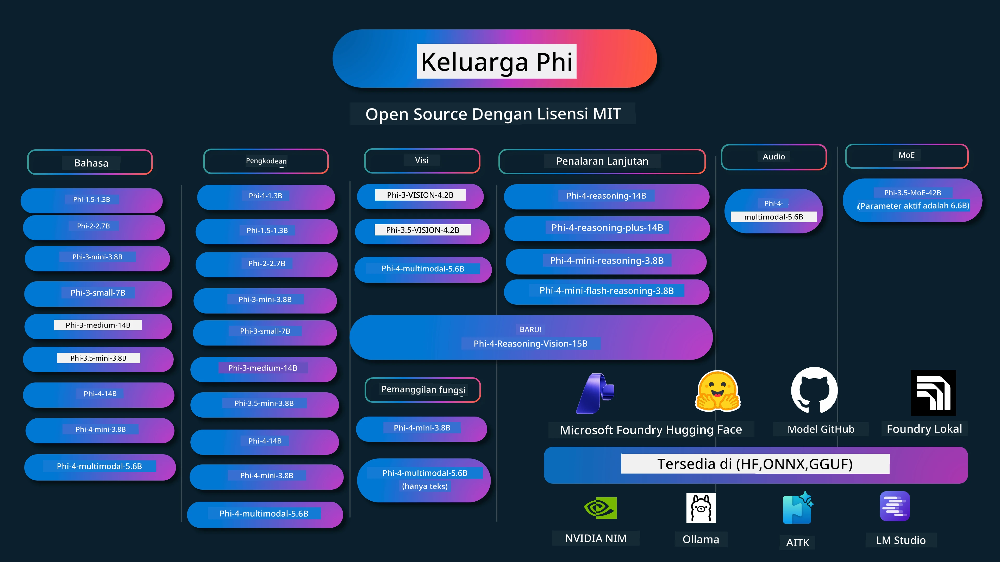

# Phi Cookbook: Contoh Praktis dengan Model Phi dari Microsoft

[](https://codespaces.new/microsoft/phicookbook)
[](https://vscode.dev/redirect?url=vscode://ms-vscode-remote.remote-containers/cloneInVolume?url=https://github.com/microsoft/phicookbook)

[](https://GitHub.com/microsoft/phicookbook/graphs/contributors/?WT.mc_id=aiml-137032-kinfeylo)
[](https://GitHub.com/microsoft/phicookbook/issues/?WT.mc_id=aiml-137032-kinfeylo)
[](https://GitHub.com/microsoft/phicookbook/pulls/?WT.mc_id=aiml-137032-kinfeylo)
[](http://makeapullrequest.com?WT.mc_id=aiml-137032-kinfeylo)

[](https://GitHub.com/microsoft/phicookbook/watchers/?WT.mc_id=aiml-137032-kinfeylo)
[](https://GitHub.com/microsoft/phicookbook/network/?WT.mc_id=aiml-137032-kinfeylo)
[](https://GitHub.com/microsoft/phicookbook/stargazers/?WT.mc_id=aiml-137032-kinfeylo)

[](https://discord.com/invite/ByRwuEEgH4)

Phi adalah serangkaian model AI open source yang dikembangkan oleh Microsoft. 

Phi saat ini adalah model bahasa kecil (SLM) yang paling kuat dan hemat biaya, dengan tolok ukur yang sangat baik dalam berbagai bahasa, penalaran, generasi teks/chat, pemrograman, gambar, audio, dan skenario lainnya. 

Anda dapat menerapkan Phi di cloud atau perangkat edge, dan Anda dapat dengan mudah membangun aplikasi AI generatif dengan daya komputasi terbatas.

Ikuti langkah-langkah ini untuk memulai menggunakan sumber daya ini:
1. **Fork Repositori**: Klik [](https://GitHub.com/microsoft/phicookbook/network/?WT.mc_id=aiml-137032-kinfeylo)
2. **Clone Repositori**:   `git clone https://github.com/microsoft/PhiCookBook.git`
3. [**Bergabung dengan Komunitas Discord AI Microsoft dan temui para ahli serta sesama pengembang**](https://discord.com/invite/ByRwuEEgH4?WT.mc_id=aiml-137032-kinfeylo)



### 🌐 Dukungan Multi-Bahasa

#### Didukung melalui GitHub Action (Otomatis & Selalu Terbaru)

<!-- CO-OP TRANSLATOR LANGUAGES TABLE START -->
[Arab](../ar/README.md) | [Bengali](../bn/README.md) | [Bulgaria](../bg/README.md) | [Burma (Myanmar)](../my/README.md) | [Cina (Disederhanakan)](../zh-CN/README.md) | [Cina (Tradisional, Hong Kong)](../zh-HK/README.md) | [Cina (Tradisional, Macau)](../zh-MO/README.md) | [Cina (Tradisional, Taiwan)](../zh-TW/README.md) | [Kroasia](../hr/README.md) | [Ceko](../cs/README.md) | [Denmark](../da/README.md) | [Belanda](../nl/README.md) | [Estonia](../et/README.md) | [Finlandia](../fi/README.md) | [Perancis](../fr/README.md) | [Jerman](../de/README.md) | [Yunani](../el/README.md) | [Ibrani](../he/README.md) | [Hindi](../hi/README.md) | [Hungaria](../hu/README.md) | [Indonesia](./README.md) | [Italia](../it/README.md) | [Jepang](../ja/README.md) | [Kannada](../kn/README.md) | [Korea](../ko/README.md) | [Lituania](../lt/README.md) | [Melayu](../ms/README.md) | [Malayalam](../ml/README.md) | [Marathi](../mr/README.md) | [Nepali](../ne/README.md) | [Pidgin Nigeria](../pcm/README.md) | [Norwegia](../no/README.md) | [Persia (Farsi)](../fa/README.md) | [Polandia](../pl/README.md) | [Portugis (Brasil)](../pt-BR/README.md) | [Portugis (Portugal)](../pt-PT/README.md) | [Punjabi (Gurmukhi)](../pa/README.md) | [Rumania](../ro/README.md) | [Rusia](../ru/README.md) | [Serbia (Sirilik)](../sr/README.md) | [Slowakia](../sk/README.md) | [Slovenia](../sl/README.md) | [Spanyol](../es/README.md) | [Swahili](../sw/README.md) | [Swedia](../sv/README.md) | [Tagalog (Filipina)](../tl/README.md) | [Tamil](../ta/README.md) | [Telugu](../te/README.md) | [Thailand](../th/README.md) | [Turki](../tr/README.md) | [Ukraina](../uk/README.md) | [Urdu](../ur/README.md) | [Vietnam](../vi/README.md)

> **Lebih suka Clone Lokal?**
>
> Repositori ini mencakup lebih dari 50 terjemahan bahasa yang secara signifikan meningkatkan ukuran unduhan. Untuk clone tanpa terjemahan, gunakan sparse checkout:
>
> **Bash / macOS / Linux:**
> ```bash
> git clone --filter=blob:none --sparse https://github.com/microsoft/PhiCookBook.git
> cd PhiCookBook
> git sparse-checkout set --no-cone '/*' '!translations' '!translated_images'
> ```
>
> **CMD (Windows):**
> ```cmd
> git clone --filter=blob:none --sparse https://github.com/microsoft/PhiCookBook.git
> cd PhiCookBook
> git sparse-checkout set --no-cone "/*" "!translations" "!translated_images"
> ```
>
> Ini memberikan semua yang Anda butuhkan untuk menyelesaikan kursus dengan unduhan yang jauh lebih cepat.
<!-- CO-OP TRANSLATOR LANGUAGES TABLE END -->

## Daftar Isi
- Pendahuluan - [Selamat datang di Keluarga Phi](./md/01.Introduction/01/01.PhiFamily.md) - [Menyiapkan lingkungan Anda](./md/01.Introduction/01/01.EnvironmentSetup.md) - [Memahami Teknologi Kunci](./md/01.Introduction/01/01.Understandingtech.md) - [Keamanan AI untuk Model Phi](./md/01.Introduction/01/01.AISafety.md) - [Dukungan Perangkat Keras Phi](./md/01.Introduction/01/01.Hardwaresupport.md) - [Model Phi & Ketersediaan di berbagai platform](./md/01.Introduction/01/01.Edgeandcloud.md) - [Menggunakan Guidance-ai dan Phi](./md/01.Introduction/01/01.Guidance.md) - [Model Marketplace GitHub](https://github.com/marketplace/models) - [Katalog Model AI Azure](https://ai.azure.com) - Inferensi Phi di lingkungan berbeda - [Hugging face](./md/01.Introduction/02/01.HF.md) - [Model GitHub](./md/01.Introduction/02/02.GitHubModel.md) - [Katalog Model Microsoft Foundry](./md/01.Introduction/02/03.AzureAIFoundry.md) - [Ollama](./md/01.Introduction/02/04.Ollama.md) - [Toolkit AI VSCode (AITK)](./md/01.Introduction/02/05.AITK.md) - [NVIDIA NIM](./md/01.Introduction/02/06.NVIDIA.md) - [Foundry Lokal](./md/01.Introduction/02/07.FoundryLocal.md) - Inferensi Keluarga Phi - [Inferensi Phi di iOS](./md/01.Introduction/03/iOS_Inference.md) - [Inferensi Phi di Android](./md/01.Introduction/03/Android_Inference.md) - [Inferensi Phi di Jetson](./md/01.Introduction/03/Jetson_Inference.md) - [Inferensi Phi di AI PC](./md/01.Introduction/03/AIPC_Inference.md) - [Inferensi Phi dengan Framework Apple MLX](./md/01.Introduction/03/MLX_Inference.md) - [Inferensi Phi di Server Lokal](./md/01.Introduction/03/Local_Server_Inference.md) - [Inferensi Phi di Server Jarak Jauh menggunakan AI Toolkit](./md/01.Introduction/03/Remote_Interence.md) - [Inferensi Phi dengan Rust](./md/01.Introduction/03/Rust_Inference.md) - [Inferensi Phi--Vision di Lokal](./md/01.Introduction/03/Vision_Inference.md) - [Inferensi Phi dengan Kaito AKS, Azure Containers (dukungan resmi)](./md/01.Introduction/03/Kaito_Inference.md) - [Mengkuantifikasi Keluarga Phi](./md/01.Introduction/04/QuantifyingPhi.md) - [Mengkuantisasi Phi-3.5 / 4 menggunakan llama.cpp](./md/01.Introduction/04/UsingLlamacppQuantifyingPhi.md) - [Mengkuantisasi Phi-3.5 / 4 menggunakan ekstensi Generative AI untuk onnxruntime](./md/01.Introduction/04/UsingORTGenAIQuantifyingPhi.md) - [Mengkuantisasi Phi-3.5 / 4 menggunakan Intel OpenVINO](./md/01.Introduction/04/UsingIntelOpenVINOQuantifyingPhi.md) - [Mengkuantisasi Phi-3.5 / 4 menggunakan Framework Apple MLX](./md/01.Introduction/04/UsingAppleMLXQuantifyingPhi.md) - Evaluasi Phi - [AI yang Bertanggung Jawab](./md/01.Introduction/05/ResponsibleAI.md) - [Microsoft Foundry untuk Evaluasi](./md/01.Introduction/05/AIFoundry.md) - [Menggunakan Promptflow untuk Evaluasi](./md/01.Introduction/05/Promptflow.md) - RAG dengan Azure AI Search - [Cara menggunakan Phi-4-mini dan Phi-4-multimodal(RAG) dengan Azure AI Search](https://github.com/microsoft/PhiCookBook/blob/main/code/06.E2E/E2E_Phi-4-RAG-Azure-AI-Search.ipynb) - Contoh pengembangan aplikasi Phi - Aplikasi Teks & Chat - Contoh Phi-4 - [📓] [Chat Dengan Model ONNX Phi-4-mini](./md/02.Application/01.TextAndChat/Phi4/ChatWithPhi4ONNX/README.md) - [Chat dengan Model ONNX Phi-4 lokal di .NET](../../md/04.HOL/dotnet/src/LabsPhi4-Chat-01OnnxRuntime) - [Aplikasi Konsol Chat .NET dengan Phi-4 ONNX menggunakan Semantic Kernel](../../md/04.HOL/dotnet/src/LabsPhi4-Chat-02SK) - Contoh Phi-3 / 3.5 - [Chatbot Lokal di browser menggunakan Phi3, ONNX Runtime Web dan WebGPU](https://github.com/microsoft/onnxruntime-inference-examples/tree/main/js/chat) - [Chat OpenVino](./md/02.Application/01.TextAndChat/Phi3/E2E_OpenVino_Chat.md) - [Multi Model - Phi-3-mini Interaktif dan OpenAI Whisper](./md/02.Application/01.TextAndChat/Phi3/E2E_Phi-3-mini_with_whisper.md) - [MLFlow - Membuat pembungkus dan menggunakan Phi-3 dengan MLFlow](./md//02.Application/01.TextAndChat/Phi3/E2E_Phi-3-MLflow.md) - [Optimasi Model - Cara mengoptimalkan model Phi-3-min untuk ONNX Runtime Web dengan Olive](https://github.com/microsoft/Olive/tree/main/examples/phi3) - [Aplikasi WinUI3 dengan Phi-3 mini-4k-instruct-onnx](https://github.com/microsoft/Phi3-Chat-WinUI3-Sample/) - [Contoh Aplikasi Catatan Bertenaga AI Multi Model WinUI3](https://github.com/microsoft/ai-powered-notes-winui3-sample) - [Fine-tune dan Integrasi model Phi-3 khusus dengan Prompt flow](./md/02.Application/01.TextAndChat/Phi3/E2E_Phi-3-FineTuning_PromptFlow_Integration.md) - [Fine-tune dan Integrasi model Phi-3 khusus dengan Prompt flow di Microsoft Foundry](./md/02.Application/01.TextAndChat/Phi3/E2E_Phi-3-FineTuning_PromptFlow_Integration_AIFoundry.md) - [Evaluasi Model Phi-3 / Phi-3.5 yang sudah di-Fine-tune di Microsoft Foundry dengan fokus pada Prinsip AI yang Bertanggung Jawab Microsoft](./md/02.Application/01.TextAndChat/Phi3/E2E_Phi-3-Evaluation_AIFoundry.md) - [📓] [Contoh prediksi bahasa Phi-3.5-mini-instruct (Cina/Inggris)](./md/02.Application/01.TextAndChat/Phi3/phi3-instruct-demo.ipynb) - [Chatbot Phi-3.5-Instruct WebGPU RAG](./md/02.Application/01.TextAndChat/Phi3/WebGPUWithPhi35Readme.md) - [Menggunakan GPU Windows untuk membuat solusi Prompt flow dengan Phi-3.5-Instruct ONNX](./md/02.Application/01.TextAndChat/Phi3/UsingPromptFlowWithONNX.md) - [Menggunakan Microsoft Phi-3.5 tflite untuk membuat aplikasi Android](./md/02.Application/01.TextAndChat/Phi3/UsingPhi35TFLiteCreateAndroidApp.md) - [Contoh T&J .NET menggunakan model Phi-3 ONNX lokal dengan Microsoft.ML.OnnxRuntime](../../md/04.HOL/dotnet/src/LabsPhi301) - [Aplikasi chat konsol .NET dengan Semantic Kernel dan Phi-3](../../md/04.HOL/dotnet/src/LabsPhi302) - Contoh Kode SDK Inferensi AI Azure - Contoh Phi-4 - [📓] [Menghasilkan kode proyek menggunakan Phi-4-multimodal](./md/02.Application/02.Code/Phi4/GenProjectCode/README.md) - Contoh Phi-3 / 3.5 - [Bangun Chat Copilot GitHub Visual Studio Code Anda sendiri dengan Keluarga Phi-3 Microsoft](./md/02.Application/02.Code/Phi3/VSCodeExt/README.md) - [Buat Agen Chat Copilot Visual Studio Code Anda sendiri dengan Phi-3.5 menggunakan Model GitHub](/md/02.Application/02.Code/Phi3/CreateVSCodeChatAgentWithGitHubModels.md) - Contoh Penalaran Lanjutan - Contoh Phi-4 - [📓] [Contoh Penalaran Phi-4-mini atau Phi-4](./md/02.Application/03.AdvancedReasoning/Phi4/AdvancedResoningPhi4mini/README.md) - [📓] [Fine-tuning Phi-4-mini-reasoning dengan Microsoft Olive](./md/02.Application/03.AdvancedReasoning/Phi4/AdvancedResoningPhi4mini/olive_ft_phi_4_reasoning_with_medicaldata.ipynb) - [📓] [Fine-tuning Phi-4-mini-reasoning dengan Apple MLX](./md/02.Application/03.AdvancedReasoning/Phi4/AdvancedResoningPhi4mini/mlx_ft_phi_4_reasoning_with_medicaldata.ipynb) - [📓] [Phi-4-mini-reasoning dengan Model GitHub](./md/02.Application/02.Code/Phi4r/github_models_inference.ipynb) - [📓] [Phi-4-mini-reasoning dengan Model Microsoft Foundry](./md/02.Application/02.Code/Phi4r/azure_models_inference.ipynb) - 
Demo - [Demo Phi-4-mini yang dihosting di Hugging Face Spaces](https://huggingface.co/spaces/microsoft/phi-4-mini?WT.mc_id=aiml-137032-kinfeylo) - [Demo Phi-4-multimodal yang dihosting di Hugginge Face Spaces](https://huggingface.co/spaces/microsoft/phi-4-multimodal?WT.mc_id=aiml-137032-kinfeylo) - Contoh Vision - Contoh Phi-4 - [📓] [Menggunakan Phi-4-multimodal untuk membaca gambar dan menghasilkan kode](./md/02.Application/04.Vision/Phi4/CreateFrontend/README.md) - Contoh Phi-3 / 3.5 - [📓][Phi-3-vision-Image teks ke teks](./md/02.Application/04.Vision/Phi3/E2E_Phi-3-vision-image-text-to-text-online-endpoint.ipynb) - [Phi-3-vision-ONNX](https://onnxruntime.ai/docs/genai/tutorials/phi3-v.html) - [📓][Phi-3-vision CLIP Embedding](./md/02.Application/04.Vision/Phi3/E2E_Phi-3-vision-image-text-to-text-online-endpoint.ipynb) - [DEMO: Phi-3 Recycling](https://github.com/jennifermarsman/PhiRecycling/) - [Phi-3-vision - Asisten bahasa visual - dengan Phi3-Vision dan OpenVINO](https://docs.openvino.ai/nightly/notebooks/phi-3-vision-with-output.html) - [Phi-3 Vision Nvidia NIM](./md/02.Application/04.Vision/Phi3/E2E_Nvidia_NIM_Vision.md) - [Phi-3 Vision OpenVino](./md/02.Application/04.Vision/Phi3/E2E_OpenVino_Phi3Vision.md) - [📓][Contoh Phi-3.5 Vision multi-frame atau multi-image](./md/02.Application/04.Vision/Phi3/phi3-vision-demo.ipynb) - [Model ONNX Lokal Phi-3 Vision menggunakan Microsoft.ML.OnnxRuntime .NET](../../md/04.HOL/dotnet/src/LabsPhi303) - [Model ONNX Lokal Phi-3 Vision berbasis Menu menggunakan Microsoft.ML.OnnxRuntime .NET](../../md/04.HOL/dotnet/src/LabsPhi304) - Contoh Reasoning-Vision - Phi-4-Reasoning-Vision-15B - [📓] [Menggunakan Phi-4-Reasoning-Vision-15B untuk mendeteksi jaywalking](./md/02.Application/10.ReasoningVision/Phi_4_reasoning_vision_15b_Jaywalking.ipynb) - [📓] [Menggunakan Phi-4-Reasoning-Vision-15B untuk matematika](./md/02.Application/10.ReasoningVision/Phi_4_reasoning_vision_15b_Math.ipynb) - [📓] [Menggunakan Phi-4-Reasoning-Vision-15B untuk mendeteksi UI](./md/02.Application/10.ReasoningVision/Phi_4_reasoning_vision_15b_ui.ipynb) - Contoh Matematika - Contoh Phi-4-Mini-Flash-Reasoning-Instruct [Demo Matematika dengan Phi-4-Mini-Flash-Reasoning-Instruct](./md/02.Application/09.Math/MathDemo.ipynb) - Contoh Audio - Contoh Phi-4 - [📓] [Mengekstrak transkrip audio menggunakan Phi-4-multimodal](./md/02.Application/05.Audio/Phi4/Transciption/README.md) - [📓] [Contoh Audio Phi-4-multimodal](./md/02.Application/05.Audio/Phi4/Siri/demo.ipynb) - [📓] [Contoh Terjemahan Ucapan Phi-4-multimodal](./md/02.Application/05.Audio/Phi4/Translate/demo.ipynb) - [Aplikasi konsol .NET menggunakan Phi-4-multimodal Audio untuk menganalisis file audio dan menghasilkan transkrip](../../md/04.HOL/dotnet/src/LabsPhi4-MultiModal-02Audio) - Contoh MOE - Contoh Phi-3 / 3.5 - [📓] [Model Campuran Ahli Phi-3.5 (MoEs) Contoh Media Sosial](./md/02.Application/06.MoE/Phi3/phi3_moe_demo.ipynb) - [📓] [Membangun Pipeline Retrieval-Augmented Generation (RAG) dengan NVIDIA NIM Phi-3 MOE, Azure AI Search, dan LlamaIndex](./md/02.Application/06.MoE/Phi3/azure-ai-search-nvidia-rag.ipynb) - - Contoh Pemanggilan Fungsi - Contoh Phi-4 🆕 - [📓] [Menggunakan Pemanggilan Fungsi Dengan Phi-4-mini](./md/02.Application/07.FunctionCalling/Phi4/FunctionCallingBasic/README.md) - [📓] [Menggunakan Pemanggilan Fungsi untuk membuat multi-agen Dengan Phi-4-mini](./md/02.Application/07.FunctionCalling/Phi4/Multiagents/Phi_4_mini_multiagent.ipynb) - [📓] [Menggunakan Pemanggilan Fungsi dengan Ollama](./md/02.Application/07.FunctionCalling/Phi4/Ollama/ollama_functioncalling.ipynb) - [📓] [Menggunakan Pemanggilan Fungsi dengan ONNX](./md/02.Application/07.FunctionCalling/Phi4/ONNX/onnx_parallel_functioncalling.ipynb) - Contoh Campuran Multimodal - Contoh Phi-4 🆕 - [📓] [Menggunakan Phi-4-multimodal sebagai jurnalis teknologi](./md/02.Application/08.Multimodel/Phi4/TechJournalist/phi_4_mm_audio_text_publish_news.ipynb) - [Aplikasi konsol .NET menggunakan Phi-4-multimodal untuk menganalisis gambar](../../md/04.HOL/dotnet/src/LabsPhi4-MultiModal-01Images) - Contoh Fine-tuning Phi - [Skenario Fine-tuning](./md/03.FineTuning/FineTuning_Scenarios.md) - [Fine-tuning vs RAG](./md/03.FineTuning/FineTuning_vs_RAG.md) - [Fine-tuning Membiarkan Phi-3 menjadi ahli industri](./md/03.FineTuning/LetPhi3gotoIndustriy.md) - [Fine-tuning Phi-3 dengan AI Toolkit untuk VS Code](./md/03.FineTuning/Finetuning_VSCodeaitoolkit.md) - [Fine-tuning Phi-3 dengan Azure Machine Learning Service](./md/03.FineTuning/Introduce_AzureML.md) - [Fine-tuning Phi-3 dengan Lora](./md/03.FineTuning/FineTuning_Lora.md) - [Fine-tuning Phi-3 dengan QLora](./md/03.FineTuning/FineTuning_Qlora.md) - [Fine-tuning Phi-3 dengan Microsoft Foundry](./md/03.FineTuning/FineTuning_AIFoundry.md) - [Fine-tuning Phi-3 dengan Azure ML CLI/SDK](./md/03.FineTuning/FineTuning_MLSDK.md) - [Fine-tuning dengan Microsoft Olive](./md/03.FineTuning/FineTuning_MicrosoftOlive.md) - [Lab Praktikum Fine-tuning dengan Microsoft Olive](./md/03.FineTuning/olive-lab/readme.md) - [Fine-tuning Phi-3-vision dengan Weights and Bias](./md/03.FineTuning/FineTuning_Phi-3-visionWandB.md) - [Fine-tuning Phi-3 dengan Apple MLX Framework](./md/03.FineTuning/FineTuning_MLX.md) - [Fine-tuning Phi-3-vision (dukungan resmi)](./md/03.FineTuning/FineTuning_Vision.md) - [Fine-Tuning Phi-3 dengan Kaito AKS, Azure Containers (dukungan resmi)](./md/03.FineTuning/FineTuning_Kaito.md) - [Fine-Tuning Phi-3 dan 3.5 Vision](https://github.com/2U1/Phi3-Vision-Finetune) - Lab Praktikum - [Menjelajahi model mutakhir: LLM, SLM, pengembangan lokal dan lainnya](https://github.com/microsoft/aitour-exploring-cutting-edge-models) - [Membuka Potensi NLP: Fine-Tuning dengan Microsoft Olive](https://github.com/azure/Ignite_FineTuning_workshop) - Makalah dan Publikasi Penelitian Akademik - [Textbooks Are All You Need II: laporan teknis phi-1.5](https://arxiv.org/abs/2309.05463) - [Laporan Teknis Phi-3: Model Bahasa Sangat Mumpuni Secara Lokal di Ponsel Anda](https://arxiv.org/abs/2404.14219) - [Laporan Teknis Phi-4](https://arxiv.org/abs/2412.08905) - [Laporan Teknis Phi-4-Mini: Model Bahasa Multimodal Ringkas namun Kuat melalui Mixture-of-LoRAs](https://arxiv.org/abs/2503.01743) - [Mengoptimalkan Model Bahasa Kecil untuk Pemanggilan Fungsi Dalam Kendaraan](https://arxiv.org/abs/2501.02342) - [(WhyPHI) Fine-Tuning PHI-3 untuk Menjawab Pertanyaan Pilihan Ganda: Metodologi, Hasil, dan Tantangan](https://arxiv.org/abs/2501.01588) - [Laporan Teknis Phi-4-reasoning](https://www.microsoft.com/en-us/research/wp-content/uploads/2025/04/phi_4_reasoning.pdf)
- [Laporan Teknis Phi-4-mini-penalaran](https://huggingface.co/microsoft/Phi-4-mini-reasoning/blob/main/Phi-4-Mini-Reasoning.pdf) 
# Phi Cookbook: Contoh Praktis dengan Model Phi Microsoft

[](https://codespaces.new/microsoft/phicookbook)
[](https://vscode.dev/redirect?url=vscode://ms-vscode-remote.remote-containers/cloneInVolume?url=https://github.com/microsoft/phicookbook)

[](https://GitHub.com/microsoft/phicookbook/graphs/contributors/?WT.mc_id=aiml-137032-kinfeylo)
[](https://GitHub.com/microsoft/phicookbook/issues/?WT.mc_id=aiml-137032-kinfeylo)
[](https://GitHub.com/microsoft/phicookbook/pulls/?WT.mc_id=aiml-137032-kinfeylo)
[](http://makeapullrequest.com?WT.mc_id=aiml-137032-kinfeylo)

[](https://GitHub.com/microsoft/phicookbook/watchers/?WT.mc_id=aiml-137032-kinfeylo)
[](https://GitHub.com/microsoft/phicookbook/network/?WT.mc_id=aiml-137032-kinfeylo)
[](https://GitHub.com/microsoft/phicookbook/stargazers/?WT.mc_id=aiml-137032-kinfeylo)

[](https://discord.com/invite/ByRwuEEgH4)

Phi adalah serangkaian model AI sumber terbuka yang dikembangkan oleh Microsoft.

Phi saat ini merupakan model bahasa kecil (SLM) paling kuat dan hemat biaya, dengan tolok ukur yang sangat baik dalam multi-bahasa, penalaran, generasi teks/chat, pemrograman, gambar, audio, dan berbagai skenario lainnya.

Anda dapat menerapkan Phi ke cloud atau perangkat edge, dan Anda dapat dengan mudah membangun aplikasi AI generatif dengan daya komputasi terbatas.

Ikuti langkah-langkah ini untuk mulai menggunakan sumber daya ini:
1. **Fork Repository**: Klik [](https://GitHub.com/microsoft/phicookbook/network/?WT.mc_id=aiml-137032-kinfeylo)
2. **Clone Repository**: `git clone https://github.com/microsoft/PhiCookBook.git`
3. [**Bergabunglah dengan Komunitas Discord Microsoft AI dan temui para ahli serta pengembang lain**](https://discord.com/invite/ByRwuEEgH4?WT.mc_id=aiml-137032-kinfeylo)


### 🌐 Dukungan Multi-Bahasa

#### Didukung melalui GitHub Action (Otomatis & Selalu Terbaru)

<!-- CO-OP TRANSLATOR LANGUAGES TABLE START -->
[Arabic](../ar/README.md) | [Bengali](../bn/README.md) | [Bulgarian](../bg/README.md) | [Burmese (Myanmar)](../my/README.md) | [Chinese (Simplified)](../zh-CN/README.md) | [Chinese (Traditional, Hong Kong)](../zh-HK/README.md) | [Chinese (Traditional, Macau)](../zh-MO/README.md) | [Chinese (Traditional, Taiwan)](../zh-TW/README.md) | [Croatian](../hr/README.md) | [Czech](../cs/README.md) | [Danish](../da/README.md) | [Dutch](../nl/README.md) | [Estonian](../et/README.md) | [Finnish](../fi/README.md) | [French](../fr/README.md) | [German](../de/README.md) | [Greek](../el/README.md) | [Hebrew](../he/README.md) | [Hindi](../hi/README.md) | [Hungarian](../hu/README.md) | [Indonesian](./README.md) | [Italian](../it/README.md) | [Japanese](../ja/README.md) | [Kannada](../kn/README.md) | [Korean](../ko/README.md) | [Lithuanian](../lt/README.md) | [Malay](../ms/README.md) | [Malayalam](../ml/README.md) | [Marathi](../mr/README.md) | [Nepali](../ne/README.md) | [Nigerian Pidgin](../pcm/README.md) | [Norwegian](../no/README.md) | [Persian (Farsi)](../fa/README.md) | [Polish](../pl/README.md) | [Portuguese (Brazil)](../pt-BR/README.md) | [Portuguese (Portugal)](../pt-PT/README.md) | [Punjabi (Gurmukhi)](../pa/README.md) | [Romanian](../ro/README.md) | [Russian](../ru/README.md) | [Serbian (Cyrillic)](../sr/README.md) | [Slovak](../sk/README.md) | [Slovenian](../sl/README.md) | [Spanish](../es/README.md) | [Swahili](../sw/README.md) | [Swedish](../sv/README.md) | [Tagalog (Filipino)](../tl/README.md) | [Tamil](../ta/README.md) | [Telugu](../te/README.md) | [Thai](../th/README.md) | [Turkish](../tr/README.md) | [Ukrainian](../uk/README.md) | [Urdu](../ur/README.md) | [Vietnamese](../vi/README.md)

> **Ingin Clone Secara Lokal?**
>
> Repository ini mencakup lebih dari 50 terjemahan bahasa yang secara signifikan meningkatkan ukuran download. Untuk clone tanpa terjemahan, gunakan sparse checkout:
>
> **Bash / macOS / Linux:**
> ```bash
> git clone --filter=blob:none --sparse https://github.com/microsoft/PhiCookBook.git
> cd PhiCookBook
> git sparse-checkout set --no-cone '/*' '!translations' '!translated_images'
> ```
>
> **CMD (Windows):**
> ```cmd
> git clone --filter=blob:none --sparse https://github.com/microsoft/PhiCookBook.git
> cd PhiCookBook
> git sparse-checkout set --no-cone "/*" "!translations" "!translated_images"
> ```
>
> Ini memberikan semua yang Anda butuhkan untuk menyelesaikan kursus dengan download yang jauh lebih cepat.
<!-- CO-OP TRANSLATOR LANGUAGES TABLE END -->

## Daftar Isi

## Menggunakan Model Phi

### Phi di Microsoft Foundry

Anda dapat mempelajari cara menggunakan Microsoft Phi dan cara membangun solusi E2E di perangkat keras yang berbeda. Untuk mencoba Phi sendiri, mulailah dengan mencoba model dan menyesuaikan Phi untuk skenario Anda menggunakan [Microsoft Foundry Azure AI Model Catalog](https://aka.ms/phi3-azure-ai). Anda dapat mempelajari lebih lanjut di Memulai dengan [Microsoft Foundry](/md/02.QuickStart/AzureAIFoundry_QuickStart.md)

**Playground**  
Setiap model memiliki playground khusus untuk menguji model [Azure AI Playground](https://aka.ms/try-phi3).

### Phi di GitHub Models

Anda dapat mempelajari cara menggunakan Microsoft Phi dan cara membangun solusi E2E di berbagai perangkat keras Anda. Untuk mencoba Phi sendiri, mulailah dengan mencoba model dan menyesuaikan Phi untuk skenario Anda menggunakan [GitHub Model Catalog](https://github.com/marketplace/models?WT.mc_id=aiml-137032-kinfeylo). Anda dapat mempelajari lebih lanjut di Memulai dengan [GitHub Model Catalog](/md/02.QuickStart/GitHubModel_QuickStart.md)

**Playground**  
Setiap model memiliki [playground khusus untuk menguji model](/md/02.QuickStart/GitHubModel_QuickStart.md).

### Phi di Hugging Face

Anda juga dapat menemukan model di [Hugging Face](https://huggingface.co/microsoft)

**Playground**  
[Hugging Chat playground](https://huggingface.co/chat/models/microsoft/Phi-3-mini-4k-instruct)

## 🎒 Kursus Lainnya

Tim kami membuat kursus lain! Lihat:

<!-- CO-OP TRANSLATOR OTHER COURSES START -->
### LangChain  
[](https://aka.ms/langchain4j-for-beginners)  
[](https://aka.ms/langchainjs-for-beginners?WT.mc_id=m365-94501-dwahlin)  
[](https://github.com/microsoft/langchain-for-beginners?WT.mc_id=m365-94501-dwahlin)  
---

### Azure / Edge / MCP / Agen  
[](https://github.com/microsoft/AZD-for-beginners?WT.mc_id=academic-105485-koreyst)  
[](https://github.com/microsoft/edgeai-for-beginners?WT.mc_id=academic-105485-koreyst)  
[](https://github.com/microsoft/mcp-for-beginners?WT.mc_id=academic-105485-koreyst)  
[](https://github.com/microsoft/ai-agents-for-beginners?WT.mc_id=academic-105485-koreyst)  

---

### Seri Generative AI  
[](https://github.com/microsoft/generative-ai-for-beginners?WT.mc_id=academic-105485-koreyst)  
[-9333EA?style=for-the-badge&labelColor=E5E7EB&color=9333EA)](https://github.com/microsoft/Generative-AI-for-beginners-dotnet?WT.mc_id=academic-105485-koreyst)  

[-C084FC?style=for-the-badge&labelColor=E5E7EB&color=C084FC)](https://github.com/microsoft/generative-ai-for-beginners-java?WT.mc_id=academic-105485-koreyst)
[-E879F9?style=for-the-badge&labelColor=E5E7EB&color=E879F9)](https://github.com/microsoft/generative-ai-with-javascript?WT.mc_id=academic-105485-koreyst)

---
 
### Pembelajaran Inti
[](https://aka.ms/ml-beginners?WT.mc_id=academic-105485-koreyst)
[](https://aka.ms/datascience-beginners?WT.mc_id=academic-105485-koreyst)
[](https://aka.ms/ai-beginners?WT.mc_id=academic-105485-koreyst)
[](https://github.com/microsoft/Security-101?WT.mc_id=academic-96948-sayoung)
[](https://aka.ms/webdev-beginners?WT.mc_id=academic-105485-koreyst)
[](https://aka.ms/iot-beginners?WT.mc_id=academic-105485-koreyst)
[](https://github.com/microsoft/xr-development-for-beginners?WT.mc_id=academic-105485-koreyst)

---
 
### Seri Copilot
[](https://aka.ms/GitHubCopilotAI?WT.mc_id=academic-105485-koreyst)
[](https://github.com/microsoft/mastering-github-copilot-for-dotnet-csharp-developers?WT.mc_id=academic-105485-koreyst)
[](https://github.com/microsoft/CopilotAdventures?WT.mc_id=academic-105485-koreyst)
<!-- CO-OP TRANSLATOR OTHER COURSES END -->

## AI yang Bertanggung Jawab

Microsoft berkomitmen untuk membantu pelanggan kami menggunakan produk AI kami secara bertanggung jawab, berbagi pembelajaran kami, dan membangun kemitraan berbasis kepercayaan melalui alat seperti Transparency Notes dan Impact Assessments. Banyak sumber daya ini dapat ditemukan di [https://aka.ms/RAI](https://aka.ms/RAI).
Pendekatan Microsoft terhadap AI yang bertanggung jawab berlandaskan prinsip AI kami yaitu keadilan, keandalan dan keamanan, privasi dan keamanan, inklusivitas, transparansi, dan akuntabilitas.

Model bahasa alami, gambar, dan suara skala besar - seperti yang digunakan dalam contoh ini - berpotensi berperilaku dengan cara yang tidak adil, tidak dapat diandalkan, atau menyinggung, yang pada gilirannya dapat menyebabkan kerugian. Harap lihat [catatan transparansi layanan Azure OpenAI](https://learn.microsoft.com/legal/cognitive-services/openai/transparency-note?tabs=text) untuk informasi tentang risiko dan keterbatasan.

Pendekatan yang direkomendasikan untuk mengurangi risiko ini adalah dengan menyertakan sistem keselamatan dalam arsitektur Anda yang dapat mendeteksi dan mencegah perilaku berbahaya. [Azure AI Content Safety](https://learn.microsoft.com/azure/ai-services/content-safety/overview) menyediakan lapisan perlindungan mandiri, mampu mendeteksi konten berbahaya yang dihasilkan pengguna dan AI dalam aplikasi dan layanan. Azure AI Content Safety mencakup API teks dan gambar yang memungkinkan Anda mendeteksi materi yang berbahaya. Dalam Microsoft Foundry, layanan Content Safety memungkinkan Anda melihat, menjelajahi, dan mencoba contoh kode untuk mendeteksi konten berbahaya di berbagai modalitas. Dokumentasi [quickstart berikut](https://learn.microsoft.com/azure/ai-services/content-safety/quickstart-text?tabs=visual-studio%2Clinux&pivots=programming-language-rest) memandu Anda melalui cara membuat permintaan ke layanan tersebut.

Aspek lain yang perlu diperhatikan adalah performa keseluruhan aplikasi. Dengan aplikasi multi-modal dan multi-model, kami menganggap performa berarti sistem berjalan sebagaimana Anda dan pengguna harapkan, termasuk tidak menghasilkan keluaran yang berbahaya. Penting untuk menilai performa aplikasi keseluruhan Anda menggunakan [evaluators Kinerja dan Kualitas serta Risiko dan Keselamatan](https://learn.microsoft.com/azure/ai-studio/concepts/evaluation-metrics-built-in). Anda juga memiliki kemampuan untuk membuat dan mengevaluasi menggunakan [evaluators khusus](https://learn.microsoft.com/azure/ai-studio/how-to/develop/evaluate-sdk#custom-evaluators).

Anda dapat mengevaluasi aplikasi AI Anda di lingkungan pengembangan menggunakan [Azure AI Evaluation SDK](https://microsoft.github.io/promptflow/index.html). Dengan menggunakan dataset pengujian atau target, generasi aplikasi generatif AI Anda diukur secara kuantitatif dengan evaluators bawaan atau evaluators khusus pilihan Anda. Untuk memulai dengan azure ai evaluation sdk untuk evaluasi sistem Anda, Anda dapat mengikuti [panduan quickstart](https://learn.microsoft.com/azure/ai-studio/how-to/develop/flow-evaluate-sdk). Setelah Anda menjalankan evaluasi, Anda dapat [memvisualisasikan hasilnya di Microsoft Foundry](https://learn.microsoft.com/azure/ai-studio/how-to/evaluate-flow-results).

## Merek Dagang

Proyek ini mungkin berisi merek dagang atau logo untuk proyek, produk, atau layanan. Penggunaan sah merek dagang atau logo Microsoft tunduk pada dan harus mengikuti [Panduan Merek & Merek Dagang Microsoft](https://www.microsoft.com/legal/intellectualproperty/trademarks/usage/general).
Penggunaan merek dagang atau logo Microsoft dalam versi modifikasi dari proyek ini tidak boleh menyebabkan kebingungan atau memberikan kesan bahwa Microsoft mensponsori. Penggunaan merek dagang atau logo pihak ketiga tunduk pada kebijakan pihak ketiga tersebut.

## Mendapatkan Bantuan

Jika Anda mengalami kesulitan atau memiliki pertanyaan tentang membangun aplikasi AI, bergabunglah:

[](https://aka.ms/foundry/discord)

Jika Anda memiliki umpan balik produk atau menemui kesalahan saat membangun, kunjungi:

[](https://aka.ms/foundry/forum)

---

<!-- CO-OP TRANSLATOR DISCLAIMER START -->
**Penafian**:  
Dokumen ini telah diterjemahkan menggunakan layanan terjemahan AI [Co-op Translator](https://github.com/Azure/co-op-translator). Meskipun kami berupaya untuk akurasi, harap diperhatikan bahwa terjemahan otomatis mungkin mengandung kesalahan atau ketidakakuratan. Dokumen asli dalam bahasa aslinya harus dianggap sebagai sumber yang sah. Untuk informasi yang penting, disarankan menggunakan terjemahan profesional oleh manusia. Kami tidak bertanggung jawab atas kesalahpahaman atau salah tafsir yang timbul dari penggunaan terjemahan ini.
<!-- CO-OP TRANSLATOR DISCLAIMER END -->