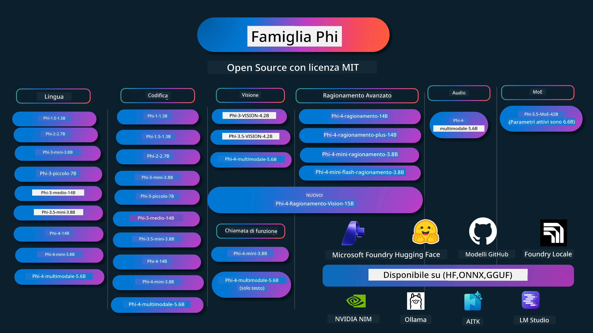

# Phi Cookbook: Esempi Pratici con i Modelli Phi di Microsoft

[](https://codespaces.new/microsoft/phicookbook)
[](https://vscode.dev/redirect?url=vscode://ms-vscode-remote.remote-containers/cloneInVolume?url=https://github.com/microsoft/phicookbook)

[](https://GitHub.com/microsoft/phicookbook/graphs/contributors/?WT.mc_id=aiml-137032-kinfeylo)
[](https://GitHub.com/microsoft/phicookbook/issues/?WT.mc_id=aiml-137032-kinfeylo)
[](https://GitHub.com/microsoft/phicookbook/pulls/?WT.mc_id=aiml-137032-kinfeylo)
[](http://makeapullrequest.com?WT.mc_id=aiml-137032-kinfeylo)

[](https://GitHub.com/microsoft/phicookbook/watchers/?WT.mc_id=aiml-137032-kinfeylo)
[](https://GitHub.com/microsoft/phicookbook/network/?WT.mc_id=aiml-137032-kinfeylo)
[](https://GitHub.com/microsoft/phicookbook/stargazers/?WT.mc_id=aiml-137032-kinfeylo)

[](https://discord.com/invite/ByRwuEEgH4)

Phi è una serie di modelli AI open source sviluppati da Microsoft.

Phi è attualmente il modello di linguaggio piccolo (SLM) più potente e conveniente, con ottimi benchmark in multi-lingua, ragionamento, generazione di testo/chat, codifica, immagini, audio e altri scenari.

Puoi distribuire Phi nel cloud o su dispositivi edge, e puoi facilmente creare applicazioni AI generative con potenza di calcolo limitata.

Segui questi passaggi per iniziare a usare queste risorse:
1. **Fai un Fork del Repository**: Clicca su [](https://GitHub.com/microsoft/phicookbook/network/?WT.mc_id=aiml-137032-kinfeylo)
2. **Clona il Repository**: `git clone https://github.com/microsoft/PhiCookBook.git`
3. [**Unisciti alla Microsoft AI Discord Community e incontra esperti e altri sviluppatori**](https://discord.com/invite/ByRwuEEgH4?WT.mc_id=aiml-137032-kinfeylo)



### 🌐 Supporto Multi-lingua

#### Supportato tramite GitHub Action (Automatizzato & Sempre Aggiornato)

<!-- CO-OP TRANSLATOR LANGUAGES TABLE START -->
[Arabo](../ar/README.md) | [Bengalese](../bn/README.md) | [Bulgaro](../bg/README.md) | [Birmano (Myanmar)](../my/README.md) | [Cinese (Semplificato)](../zh-CN/README.md) | [Cinese (Tradizionale, Hong Kong)](../zh-HK/README.md) | [Cinese (Tradizionale, Macao)](../zh-MO/README.md) | [Cinese (Tradizionale, Taiwan)](../zh-TW/README.md) | [Croato](../hr/README.md) | [Ceco](../cs/README.md) | [Danese](../da/README.md) | [Olandese](../nl/README.md) | [Estone](../et/README.md) | [Finlandese](../fi/README.md) | [Francese](../fr/README.md) | [Tedesco](../de/README.md) | [Greco](../el/README.md) | [Ebraico](../he/README.md) | [Hindi](../hi/README.md) | [Ungherese](../hu/README.md) | [Indonesiano](../id/README.md) | [Italiano](./README.md) | [Giapponese](../ja/README.md) | [Kannada](../kn/README.md) | [Coreano](../ko/README.md) | [Lituano](../lt/README.md) | [Malese](../ms/README.md) | [Malayalam](../ml/README.md) | [Marathi](../mr/README.md) | [Nepalese](../ne/README.md) | [Pidgin Nigeriano](../pcm/README.md) | [Norvegese](../no/README.md) | [Persiano (Farsi)](../fa/README.md) | [Polacco](../pl/README.md) | [Portoghese (Brasile)](../pt-BR/README.md) | [Portoghese (Portogallo)](../pt-PT/README.md) | [Punjabi (Gurmukhi)](../pa/README.md) | [Rumeno](../ro/README.md) | [Russo](../ru/README.md) | [Serbo (Cirillico)](../sr/README.md) | [Slovacco](../sk/README.md) | [Sloveno](../sl/README.md) | [Spagnolo](../es/README.md) | [Swahili](../sw/README.md) | [Svedese](../sv/README.md) | [Tagalog (Filippino)](../tl/README.md) | [Tamil](../ta/README.md) | [Telugu](../te/README.md) | [Thailandese](../th/README.md) | [Turco](../tr/README.md) | [Ucraino](../uk/README.md) | [Urdu](../ur/README.md) | [Vietnamita](../vi/README.md)

> **Preferisci Clonare Localmente?**
>
> Questo repository include più di 50 traduzioni in lingua, che aumentano significativamente la dimensione del download. Per clonare senza traduzioni, usa sparse checkout:
>
> **Bash / macOS / Linux:**
> ```bash
> git clone --filter=blob:none --sparse https://github.com/microsoft/PhiCookBook.git
> cd PhiCookBook
> git sparse-checkout set --no-cone '/*' '!translations' '!translated_images'
> ```
>
> **CMD (Windows):**
> ```cmd
> git clone --filter=blob:none --sparse https://github.com/microsoft/PhiCookBook.git
> cd PhiCookBook
> git sparse-checkout set --no-cone "/*" "!translations" "!translated_images"
> ```
>
> Questo ti fornisce tutto il necessario per completare il corso con un download molto più veloce.
<!-- CO-OP TRANSLATOR LANGUAGES TABLE END -->

## Indice
- Introduzione - [Benvenuto nella Famiglia Phi](./md/01.Introduction/01/01.PhiFamily.md) - [Configurare il tuo ambiente](./md/01.Introduction/01/01.EnvironmentSetup.md) - [Comprendere le tecnologie chiave](./md/01.Introduction/01/01.Understandingtech.md) - [Sicurezza AI per i modelli Phi](./md/01.Introduction/01/01.AISafety.md) - [Supporto hardware Phi](./md/01.Introduction/01/01.Hardwaresupport.md) - [Modelli Phi e disponibilità sulle piattaforme](./md/01.Introduction/01/01.Edgeandcloud.md) - [Usare Guidance-ai e Phi](./md/01.Introduction/01/01.Guidance.md) - [Modelli di GitHub Marketplace](https://github.com/marketplace/models) - [Catalogo modelli Azure AI](https://ai.azure.com) - Inferenza Phi in ambienti diversi - [Hugging face](./md/01.Introduction/02/01.HF.md) - [Modelli GitHub](./md/01.Introduction/02/02.GitHubModel.md) - [Catalogo modelli Microsoft Foundry](./md/01.Introduction/02/03.AzureAIFoundry.md) - [Ollama](./md/01.Introduction/02/04.Ollama.md) - [Toolkit AI VSCode (AITK)](./md/01.Introduction/02/05.AITK.md) - [NVIDIA NIM](./md/01.Introduction/02/06.NVIDIA.md) - [Foundry locale](./md/01.Introduction/02/07.FoundryLocal.md) - Inferenza Famiglia Phi - [Inferenza Phi su iOS](./md/01.Introduction/03/iOS_Inference.md) - [Inferenza Phi su Android](./md/01.Introduction/03/Android_Inference.md) - [Inferenza Phi su Jetson](./md/01.Introduction/03/Jetson_Inference.md) - [Inferenza Phi su PC AI](./md/01.Introduction/03/AIPC_Inference.md) - [Inferenza Phi con framework Apple MLX](./md/01.Introduction/03/MLX_Inference.md) - [Inferenza Phi su server locale](./md/01.Introduction/03/Local_Server_Inference.md) - [Inferenza Phi su server remoto utilizzando AI Toolkit](./md/01.Introduction/03/Remote_Interence.md) - [Inferenza Phi con Rust](./md/01.Introduction/03/Rust_Inference.md) - [Inferenza Phi--Vision locale](./md/01.Introduction/03/Vision_Inference.md) - [Inferenza Phi con Kaito AKS, Azure Containers (supporto ufficiale)](./md/01.Introduction/03/Kaito_Inference.md) - [Quantizzare la Famiglia Phi](./md/01.Introduction/04/QuantifyingPhi.md) - [Quantizzare Phi-3.5 / 4 utilizzando llama.cpp](./md/01.Introduction/04/UsingLlamacppQuantifyingPhi.md) - [Quantizzare Phi-3.5 / 4 usando estensioni Generative AI per onnxruntime](./md/01.Introduction/04/UsingORTGenAIQuantifyingPhi.md) - [Quantizzare Phi-3.5 / 4 con Intel OpenVINO](./md/01.Introduction/04/UsingIntelOpenVINOQuantifyingPhi.md) - [Quantizzare Phi-3.5 / 4 con Apple MLX Framework](./md/01.Introduction/04/UsingAppleMLXQuantifyingPhi.md) - Valutazione Phi - [AI Responsabile](./md/01.Introduction/05/ResponsibleAI.md) - [Microsoft Foundry per la valutazione](./md/01.Introduction/05/AIFoundry.md) - [Utilizzare Promptflow per la valutazione](./md/01.Introduction/05/Promptflow.md) - RAG con Azure AI Search - [Come usare Phi-4-mini e Phi-4-multimodale (RAG) con Azure AI Search](https://github.com/microsoft/PhiCookBook/blob/main/code/06.E2E/E2E_Phi-4-RAG-Azure-AI-Search.ipynb) - Campioni di sviluppo applicazioni Phi - Applicazioni testo e chat - Phi-4 Campioni - [📓] [Chat con modello Phi-4-mini ONNX](./md/02.Application/01.TextAndChat/Phi4/ChatWithPhi4ONNX/README.md) - [Chat con modello ONNX locale Phi-4 .NET](../../md/04.HOL/dotnet/src/LabsPhi4-Chat-01OnnxRuntime) - [App console chat .NET con Phi-4 ONNX usando Semantic Kernel](../../md/04.HOL/dotnet/src/LabsPhi4-Chat-02SK) - Phi-3 / 3.5 Campioni - [Chatbot locale nel browser usando Phi3, ONNX Runtime Web e WebGPU](https://github.com/microsoft/onnxruntime-inference-examples/tree/main/js/chat) - [OpenVino Chat](./md/02.Application/01.TextAndChat/Phi3/E2E_OpenVino_Chat.md) - [Multi Modello - Phi-3-mini interattivo e OpenAI Whisper](./md/02.Application/01.TextAndChat/Phi3/E2E_Phi-3-mini_with_whisper.md) - [MLFlow - Costruire un wrapper e usare Phi-3 con MLFlow](./md//02.Application/01.TextAndChat/Phi3/E2E_Phi-3-MLflow.md) - [Ottimizzazione modello - Come ottimizzare il modello Phi-3-min per ONNX Runtime Web con Olive](https://github.com/microsoft/Olive/tree/main/examples/phi3) - [App WinUI3 con Phi-3 mini-4k-instruct-onnx](https://github.com/microsoft/Phi3-Chat-WinUI3-Sample/) -[Campione App note multi-modello AI con WinUI3](https://github.com/microsoft/ai-powered-notes-winui3-sample) - [Fine-tuning e integrazione modelli Phi-3 personalizzati con Prompt flow](./md/02.Application/01.TextAndChat/Phi3/E2E_Phi-3-FineTuning_PromptFlow_Integration.md) - [Fine-tuning e integrazione modelli Phi-3 personalizzati con Prompt flow in Microsoft Foundry](./md/02.Application/01.TextAndChat/Phi3/E2E_Phi-3-FineTuning_PromptFlow_Integration_AIFoundry.md) - [Valutare il modello Phi-3 / Phi-3.5 fine-tuned in Microsoft Foundry focalizzandosi sui principi di AI responsabile di Microsoft](./md/02.Application/01.TextAndChat/Phi3/E2E_Phi-3-Evaluation_AIFoundry.md) - [📓] [Campione predizione linguistica Phi-3.5-mini-instruct (Cinese/Inglese)](./md/02.Application/01.TextAndChat/Phi3/phi3-instruct-demo.ipynb) - [Phi-3.5-Instruct WebGPU RAG Chatbot](./md/02.Application/01.TextAndChat/Phi3/WebGPUWithPhi35Readme.md) - [Usare GPU Windows per creare soluzione Prompt flow con Phi-3.5-Instruct ONNX](./md/02.Application/01.TextAndChat/Phi3/UsingPromptFlowWithONNX.md) - [Usare Microsoft Phi-3.5 tflite per creare app Android](./md/02.Application/01.TextAndChat/Phi3/UsingPhi35TFLiteCreateAndroidApp.md) - [Esempio Q&A .NET usando modello ONNX Phi-3 locale con Microsoft.ML.OnnxRuntime](../../md/04.HOL/dotnet/src/LabsPhi301) - [App console chat .NET con Semantic Kernel e Phi-3](../../md/04.HOL/dotnet/src/LabsPhi302) - Campioni basati su codice SDK Inferenza Azure AI - Phi-4 Campioni - [📓] [Genera codice progetto usando Phi-4-multimodale](./md/02.Application/02.Code/Phi4/GenProjectCode/README.md) - Phi-3 / 3.5 Campioni - [Costruisci il tuo Visual Studio Code GitHub Copilot Chat con la Famiglia Microsoft Phi-3](./md/02.Application/02.Code/Phi3/VSCodeExt/README.md) - [Crea il tuo agente chat Visual Studio Code Copilot con Phi-3.5 usando modelli GitHub](/md/02.Application/02.Code/Phi3/CreateVSCodeChatAgentWithGitHubModels.md) - Campioni di ragionamento avanzato - Phi-4 Campioni - [📓] [Campioni ragionamento Phi-4-mini o Phi-4](./md/02.Application/03.AdvancedReasoning/Phi4/AdvancedResoningPhi4mini/README.md) - [📓] [Fine-tuning Phi-4-mini-ragionamento con Microsoft Olive](./md/02.Application/03.AdvancedReasoning/Phi4/AdvancedResoningPhi4mini/olive_ft_phi_4_reasoning_with_medicaldata.ipynb) - [📓] [Fine-tuning Phi-4-mini-ragionamento con Apple MLX](./md/02.Application/03.AdvancedReasoning/Phi4/AdvancedResoningPhi4mini/mlx_ft_phi_4_reasoning_with_medicaldata.ipynb) - [📓] [Phi-4-mini-ragionamento con modelli GitHub](./md/02.Application/02.Code/Phi4r/github_models_inference.ipynb) - [📓] [Phi-4-mini-ragionamento con modelli Microsoft Foundry](./md/02.Application/02.Code/Phi4r/azure_models_inference.ipynb) -
Dimostrazioni - [Demo Phi-4-mini ospitate su Hugging Face Spaces](https://huggingface.co/spaces/microsoft/phi-4-mini?WT.mc_id=aiml-137032-kinfeylo) - [Demo Phi-4-multimodal ospitate su Hugging Face Spaces](https://huggingface.co/spaces/microsoft/phi-4-multimodal?WT.mc_id=aiml-137032-kinfeylo) - Esempi di Visione - Esempi Phi-4 - [📓] [Usa Phi-4-multimodal per leggere immagini e generare codice](./md/02.Application/04.Vision/Phi4/CreateFrontend/README.md) - Esempi Phi-3 / 3.5 - [📓][Phi-3-vision-Image testo a testo](./md/02.Application/04.Vision/Phi3/E2E_Phi-3-vision-image-text-to-text-online-endpoint.ipynb) - [Phi-3-vision-ONNX](https://onnxruntime.ai/docs/genai/tutorials/phi3-v.html) - [📓][Phi-3-vision CLIP Embedding](./md/02.Application/04.Vision/Phi3/E2E_Phi-3-vision-image-text-to-text-online-endpoint.ipynb) - [DEMO: Riciclaggio Phi-3](https://github.com/jennifermarsman/PhiRecycling/) - [Phi-3-vision - Assistente linguistico visivo - con Phi3-Vision e OpenVINO](https://docs.openvino.ai/nightly/notebooks/phi-3-vision-with-output.html) - [Phi-3 Vision Nvidia NIM](./md/02.Application/04.Vision/Phi3/E2E_Nvidia_NIM_Vision.md) - [Phi-3 Vision OpenVino](./md/02.Application/04.Vision/Phi3/E2E_OpenVino_Phi3Vision.md) - [📓][Esempio multi-frame o multi-immagine Phi-3.5 Vision](./md/02.Application/04.Vision/Phi3/phi3-vision-demo.ipynb) - [Modello ONNX Locale Phi-3 Vision usando Microsoft.ML.OnnxRuntime .NET](../../md/04.HOL/dotnet/src/LabsPhi303) - [Modello ONNX Locale Phi-3 Vision basato su menu usando Microsoft.ML.OnnxRuntime .NET](../../md/04.HOL/dotnet/src/LabsPhi304) - Esempi Reasoning-Vision - Phi-4-Reasoning-Vision-15B - [📓] [Usando Phi-4-Reasoning-Vision-15B per rilevare attraversamenti pedonali non autorizzati](./md/02.Application/10.ReasoningVision/Phi_4_reasoning_vision_15b_Jaywalking.ipynb) - [📓] [Usando Phi-4-Reasoning-Vision-15B per matematica](./md/02.Application/10.ReasoningVision/Phi_4_reasoning_vision_15b_Math.ipynb) - [📓] [Usando Phi-4-Reasoning-Vision-15B per rilevare UI](./md/02.Application/10.ReasoningVision/Phi_4_reasoning_vision_15b_ui.ipynb) - Esempi Matematica - Esempi Phi-4-Mini-Flash-Reasoning-Instruct [Demo Matematica con Phi-4-Mini-Flash-Reasoning-Instruct](./md/02.Application/09.Math/MathDemo.ipynb) - Esempi Audio - Esempi Phi-4 - [📓] [Estrarre trascrizioni audio usando Phi-4-multimodal](./md/02.Application/05.Audio/Phi4/Transciption/README.md) - [📓] [Esempio Audio Phi-4-multimodal](./md/02.Application/05.Audio/Phi4/Siri/demo.ipynb) - [📓] [Esempio Traduzione Vocale Phi-4-multimodal](./md/02.Application/05.Audio/Phi4/Translate/demo.ipynb) - [Applicazione console .NET usando Phi-4-multimodal Audio per analizzare un file audio e generare trascrizione](../../md/04.HOL/dotnet/src/LabsPhi4-MultiModal-02Audio) - Esempi MOE - Esempi Phi-3 / 3.5 - [📓] [Modelli Phi-3.5 Mixture of Experts (MoEs) Esempio Social Media](./md/02.Application/06.MoE/Phi3/phi3_moe_demo.ipynb) - [📓] [Costruzione di una pipeline Retrieval-Augmented Generation (RAG) con NVIDIA NIM Phi-3 MOE, Azure AI Search e LlamaIndex](./md/02.Application/06.MoE/Phi3/azure-ai-search-nvidia-rag.ipynb) - Esempi di Function Calling - Esempi Phi-4 🆕 - [📓] [Uso di Function Calling con Phi-4-mini](./md/02.Application/07.FunctionCalling/Phi4/FunctionCallingBasic/README.md) - [📓] [Uso di Function Calling per creare multi-agenti con Phi-4-mini](./md/02.Application/07.FunctionCalling/Phi4/Multiagents/Phi_4_mini_multiagent.ipynb) - [📓] [Uso di Function Calling con Ollama](./md/02.Application/07.FunctionCalling/Phi4/Ollama/ollama_functioncalling.ipynb) - [📓] [Uso di Function Calling con ONNX](./md/02.Application/07.FunctionCalling/Phi4/ONNX/onnx_parallel_functioncalling.ipynb) - Esempi di Mixing Multimodale - Esempi Phi-4 🆕 - [📓] [Uso di Phi-4-multimodal come giornalista tecnologico](./md/02.Application/08.Multimodel/Phi4/TechJournalist/phi_4_mm_audio_text_publish_news.ipynb) - [Applicazione console .NET usando Phi-4-multimodal per analizzare immagini](../../md/04.HOL/dotnet/src/LabsPhi4-MultiModal-01Images) - Esempi di Fine-tuning Phi - [Scenari di Fine-tuning](./md/03.FineTuning/FineTuning_Scenarios.md) - [Fine-tuning vs RAG](./md/03.FineTuning/FineTuning_vs_RAG.md) - [Fine-tuning Lascia che Phi-3 diventi un esperto di settore](./md/03.FineTuning/LetPhi3gotoIndustriy.md) - [Fine-tuning Phi-3 con AI Toolkit per VS Code](./md/03.FineTuning/Finetuning_VSCodeaitoolkit.md) - [Fine-tuning Phi-3 con Azure Machine Learning Service](./md/03.FineTuning/Introduce_AzureML.md) - [Fine-tuning Phi-3 con Lora](./md/03.FineTuning/FineTuning_Lora.md) - [Fine-tuning Phi-3 con QLora](./md/03.FineTuning/FineTuning_Qlora.md) - [Fine-tuning Phi-3 con Microsoft Foundry](./md/03.FineTuning/FineTuning_AIFoundry.md) - [Fine-tuning Phi-3 con Azure ML CLI/SDK](./md/03.FineTuning/FineTuning_MLSDK.md) - [Fine-tuning con Microsoft Olive](./md/03.FineTuning/FineTuning_MicrosoftOlive.md) - [Laboratorio pratico con Microsoft Olive](./md/03.FineTuning/olive-lab/readme.md) - [Fine-tuning Phi-3-vision con Weights and Bias](./md/03.FineTuning/FineTuning_Phi-3-visionWandB.md) - [Fine-tuning Phi-3 con Apple MLX Framework](./md/03.FineTuning/FineTuning_MLX.md) - [Fine-tuning Phi-3-vision (supporto ufficiale)](./md/03.FineTuning/FineTuning_Vision.md) - [Fine-Tuning Phi-3 con Kaito AKS, Azure Containers (supporto ufficiale)](./md/03.FineTuning/FineTuning_Kaito.md) - [Fine-Tuning Phi-3 e 3.5 Vision](https://github.com/2U1/Phi3-Vision-Finetune) - Laboratorio pratico - [Esplorazione di modelli all'avanguardia: LLM, SLM, sviluppo locale e altro](https://github.com/microsoft/aitour-exploring-cutting-edge-models) - [Sbloccare il potenziale NLP: Fine-Tuning con Microsoft Olive](https://github.com/azure/Ignite_FineTuning_workshop) - Articoli accademici e pubblicazioni - [Textbooks Are All You Need II: rapporto tecnico phi-1.5](https://arxiv.org/abs/2309.05463) - [Rapporto tecnico Phi-3: un modello linguistico altamente capace localmente sul tuo telefono](https://arxiv.org/abs/2404.14219) - [Rapporto tecnico Phi-4](https://arxiv.org/abs/2412.08905) - [Rapporto tecnico Phi-4-Mini: modelli linguistici multimodali compatti ma potenti tramite Mixture-of-LoRAs](https://arxiv.org/abs/2503.01743) - [Ottimizzazione di piccoli modelli linguistici per Function-Calling in veicoli](https://arxiv.org/abs/2501.02342) - [(WhyPHI) Fine-Tuning PHI-3 per risposte a domande a scelta multipla: metodologia, risultati e sfide](https://arxiv.org/abs/2501.01588) - [Rapporto tecnico Phi-4-reasoning](https://www.microsoft.com/en-us/research/wp-content/uploads/2025/04/phi_4_reasoning.pdf)
- [Rapporto tecnico Phi-4-mini-reasoning](https://huggingface.co/microsoft/Phi-4-mini-reasoning/blob/main/Phi-4-Mini-Reasoning.pdf)
# Ricettario Phi: Esempi Pratici con i Modelli Phi di Microsoft

[](https://codespaces.new/microsoft/phicookbook)
[](https://vscode.dev/redirect?url=vscode://ms-vscode-remote.remote-containers/cloneInVolume?url=https://github.com/microsoft/phicookbook)

[](https://GitHub.com/microsoft/phicookbook/graphs/contributors/?WT.mc_id=aiml-137032-kinfeylo)
[](https://GitHub.com/microsoft/phicookbook/issues/?WT.mc_id=aiml-137032-kinfeylo)
[](https://GitHub.com/microsoft/phicookbook/pulls/?WT.mc_id=aiml-137032-kinfeylo)
[](http://makeapullrequest.com?WT.mc_id=aiml-137032-kinfeylo)

[](https://GitHub.com/microsoft/phicookbook/watchers/?WT.mc_id=aiml-137032-kinfeylo)
[](https://GitHub.com/microsoft/phicookbook/network/?WT.mc_id=aiml-137032-kinfeylo)
[](https://GitHub.com/microsoft/phicookbook/stargazers/?WT.mc_id=aiml-137032-kinfeylo)

[](https://discord.com/invite/ByRwuEEgH4)

Phi è una serie di modelli AI open source sviluppati da Microsoft.

Attualmente Phi è il modello di linguaggio piccolo (SLM) più potente ed economico, con ottime prestazioni in multi-lingua, ragionamento, generazione di testo/chat, codifica, immagini, audio e altri scenari.

Puoi distribuire Phi nel cloud o su dispositivi edge, e puoi facilmente costruire applicazioni AI generative con potenza di calcolo limitata.

Segui questi passaggi per iniziare a utilizzare queste risorse:
1. **Forka il Repository**: Clicca [](https://GitHub.com/microsoft/phicookbook/network/?WT.mc_id=aiml-137032-kinfeylo)
2. **Clona il Repository**: `git clone https://github.com/microsoft/PhiCookBook.git`
3. [**Unisciti alla Comunità Discord Microsoft AI e incontra esperti e altri sviluppatori**](https://discord.com/invite/ByRwuEEgH4?WT.mc_id=aiml-137032-kinfeylo)


### 🌐 Supporto Multi-Lingua

#### Supportato tramite GitHub Action (Automatizzato e Sempre Aggiornato)

<!-- CO-OP TRANSLATOR LANGUAGES TABLE START -->
[Arabo](../ar/README.md) | [Bengalese](../bn/README.md) | [Bulgaro](../bg/README.md) | [Birmano (Myanmar)](../my/README.md) | [Cinese (Semplificato)](../zh-CN/README.md) | [Cinese (Tradizionale, Hong Kong)](../zh-HK/README.md) | [Cinese (Tradizionale, Macao)](../zh-MO/README.md) | [Cinese (Tradizionale, Taiwan)](../zh-TW/README.md) | [Croato](../hr/README.md) | [Ceco](../cs/README.md) | [Danese](../da/README.md) | [Olandese](../nl/README.md) | [Estone](../et/README.md) | [Finlandese](../fi/README.md) | [Francese](../fr/README.md) | [Tedesco](../de/README.md) | [Greco](../el/README.md) | [Ebraico](../he/README.md) | [Hindi](../hi/README.md) | [Ungherese](../hu/README.md) | [Indonesiano](../id/README.md) | [Italiano](./README.md) | [Giapponese](../ja/README.md) | [Kannada](../kn/README.md) | [Coreano](../ko/README.md) | [Lituano](../lt/README.md) | [Malese](../ms/README.md) | [Malayalam](../ml/README.md) | [Marathi](../mr/README.md) | [Nepalese](../ne/README.md) | [Pidgin Nigeriano](../pcm/README.md) | [Norvegese](../no/README.md) | [Persiano (Farsi)](../fa/README.md) | [Polacco](../pl/README.md) | [Portoghese (Brasile)](../pt-BR/README.md) | [Portoghese (Portogallo)](../pt-PT/README.md) | [Punjabi (Gurmukhi)](../pa/README.md) | [Rumeno](../ro/README.md) | [Russo](../ru/README.md) | [Serbo (Cirillico)](../sr/README.md) | [Slovacco](../sk/README.md) | [Sloveno](../sl/README.md) | [Spagnolo](../es/README.md) | [Swahili](../sw/README.md) | [Svedese](../sv/README.md) | [Tagalog (Filippino)](../tl/README.md) | [Tamil](../ta/README.md) | [Telugu](../te/README.md) | [Thailandese](../th/README.md) | [Turco](../tr/README.md) | [Ucraino](../uk/README.md) | [Urdu](../ur/README.md) | [Vietnamita](../vi/README.md)

> **Preferisci clonare localmente?**
>
> Questo repository include traduzioni in oltre 50 lingue, che aumentano significativamente la dimensione del download. Per clonare senza le traduzioni, usa il sparse checkout:
>
> **Bash / macOS / Linux:**
> ```bash
> git clone --filter=blob:none --sparse https://github.com/microsoft/PhiCookBook.git
> cd PhiCookBook
> git sparse-checkout set --no-cone '/*' '!translations' '!translated_images'
> ```
>
> **CMD (Windows):**
> ```cmd
> git clone --filter=blob:none --sparse https://github.com/microsoft/PhiCookBook.git
> cd PhiCookBook
> git sparse-checkout set --no-cone "/*" "!translations" "!translated_images"
> ```
>
> Questo ti fornisce tutto il necessario per completare il corso con un download molto più veloce.
<!-- CO-OP TRANSLATOR LANGUAGES TABLE END -->

## Indice

## Uso dei Modelli Phi

### Phi su Microsoft Foundry

Puoi imparare come usare Microsoft Phi e come costruire soluzioni E2E nei tuoi diversi dispositivi hardware. Per sperimentare Phi da te, inizia a giocare con i modelli e a personalizzare Phi per i tuoi scenari usando il [Microsoft Foundry Azure AI Model Catalog](https://aka.ms/phi3-azure-ai), puoi saperne di più in Iniziare con [Microsoft Foundry](/md/02.QuickStart/AzureAIFoundry_QuickStart.md)

**Playground**  
Ogni modello ha un playground dedicato per testare il modello [Azure AI Playground](https://aka.ms/try-phi3).

### Phi su GitHub Models

Puoi imparare come usare Microsoft Phi e come costruire soluzioni E2E nei tuoi diversi dispositivi hardware. Per sperimentare Phi da te, inizia a giocare con il modello e a personalizzare Phi per i tuoi scenari usando il [GitHub Model Catalog](https://github.com/marketplace/models?WT.mc_id=aiml-137032-kinfeylo), puoi saperne di più in Iniziare con [GitHub Model Catalog](/md/02.QuickStart/GitHubModel_QuickStart.md)

**Playground**  
Ogni modello ha un [playground dedicato per testare il modello](/md/02.QuickStart/GitHubModel_QuickStart.md).

### Phi su Hugging Face

Puoi anche trovare il modello su [Hugging Face](https://huggingface.co/microsoft)

**Playground**  
[Hugging Chat playground](https://huggingface.co/chat/models/microsoft/Phi-3-mini-4k-instruct)

## 🎒 Altri Corsi

Il nostro team produce altri corsi! Dai un’occhiata:

<!-- CO-OP TRANSLATOR OTHER COURSES START -->
### LangChain
[](https://aka.ms/langchain4j-for-beginners)
[](https://aka.ms/langchainjs-for-beginners?WT.mc_id=m365-94501-dwahlin)
[](https://github.com/microsoft/langchain-for-beginners?WT.mc_id=m365-94501-dwahlin)
---

### Azure / Edge / MCP / Agents
[](https://github.com/microsoft/AZD-for-beginners?WT.mc_id=academic-105485-koreyst)
[](https://github.com/microsoft/edgeai-for-beginners?WT.mc_id=academic-105485-koreyst)
[](https://github.com/microsoft/mcp-for-beginners?WT.mc_id=academic-105485-koreyst)
[](https://github.com/microsoft/ai-agents-for-beginners?WT.mc_id=academic-105485-koreyst)

---
 
### Serie AI Generativa
[](https://github.com/microsoft/generative-ai-for-beginners?WT.mc_id=academic-105485-koreyst)
[-9333EA?style=for-the-badge&labelColor=E5E7EB&color=9333EA)](https://github.com/microsoft/Generative-AI-for-beginners-dotnet?WT.mc_id=academic-105485-koreyst)
[-C084FC?style=for-the-badge&labelColor=E5E7EB&color=C084FC)](https://github.com/microsoft/generative-ai-for-beginners-java?WT.mc_id=academic-105485-koreyst)
[-E879F9?style=for-the-badge&labelColor=E5E7EB&color=E879F9)](https://github.com/microsoft/generative-ai-with-javascript?WT.mc_id=academic-105485-koreyst)

---
 
### Apprendimento Core
[](https://aka.ms/ml-beginners?WT.mc_id=academic-105485-koreyst)
[](https://aka.ms/datascience-beginners?WT.mc_id=academic-105485-koreyst)
[](https://aka.ms/ai-beginners?WT.mc_id=academic-105485-koreyst)
[](https://github.com/microsoft/Security-101?WT.mc_id=academic-96948-sayoung)
[](https://aka.ms/webdev-beginners?WT.mc_id=academic-105485-koreyst)
[](https://aka.ms/iot-beginners?WT.mc_id=academic-105485-koreyst)
[](https://github.com/microsoft/xr-development-for-beginners?WT.mc_id=academic-105485-koreyst)

---
 
### Serie Copilot
[](https://aka.ms/GitHubCopilotAI?WT.mc_id=academic-105485-koreyst)
[](https://github.com/microsoft/mastering-github-copilot-for-dotnet-csharp-developers?WT.mc_id=academic-105485-koreyst)
[](https://github.com/microsoft/CopilotAdventures?WT.mc_id=academic-105485-koreyst)
<!-- CO-OP TRANSLATOR OTHER COURSES END -->

## IA Responsabile

Microsoft è impegnata ad aiutare i nostri clienti a utilizzare i nostri prodotti di IA in modo responsabile, condividendo le nostre esperienze e costruendo partnership basate sulla fiducia attraverso strumenti come le Note di Trasparenza e le Valutazioni di Impatto. Molte di queste risorse sono disponibili su [https://aka.ms/RAI](https://aka.ms/RAI).
L'approccio di Microsoft all'IA responsabile si basa sui nostri principi di IA di equità, affidabilità e sicurezza, privacy e sicurezza, inclusività, trasparenza e responsabilità.

I modelli su larga scala per il linguaggio naturale, le immagini e il parlato - come quelli usati in questo esempio - possono potenzialmente comportarsi in modi ingiusti, inaffidabili o offensivi, causando danni. Si prega di consultare la [nota di trasparenza del servizio Azure OpenAI](https://learn.microsoft.com/legal/cognitive-services/openai/transparency-note?tabs=text) per essere informati sui rischi e le limitazioni.

L'approccio consigliato per mitigare questi rischi è includere un sistema di sicurezza nella propria architettura che possa rilevare e prevenire comportamenti dannosi. [Azure AI Content Safety](https://learn.microsoft.com/azure/ai-services/content-safety/overview) fornisce uno strato indipendente di protezione, in grado di rilevare contenuti dannosi generati dagli utenti e dall'IA in applicazioni e servizi. Azure AI Content Safety include API di testo e immagine che permettono di rilevare materiale dannoso. All'interno di Microsoft Foundry, il servizio Content Safety consente di visualizzare, esplorare e provare il codice di esempio per rilevare contenuti dannosi in diverse modalità. La seguente [documentazione quickstart](https://learn.microsoft.com/azure/ai-services/content-safety/quickstart-text?tabs=visual-studio%2Clinux&pivots=programming-language-rest) guida nell'effettuare richieste al servizio.

Un altro aspetto da considerare è la performance complessiva dell'applicazione. Con applicazioni multi-modali e multi-modello, con performance intendiamo che il sistema funzioni come ci si aspetta tu e i tuoi utenti, inclusa la non generazione di output dannosi. È importante valutare la performance della tua applicazione complessiva utilizzando [valutatori di Performance e Qualità e Rischio e Sicurezza](https://learn.microsoft.com/azure/ai-studio/concepts/evaluation-metrics-built-in). Hai anche la possibilità di creare e valutare con [valutatori personalizzati](https://learn.microsoft.com/azure/ai-studio/how-to/develop/evaluate-sdk#custom-evaluators).

Puoi valutare la tua applicazione di IA nel tuo ambiente di sviluppo utilizzando l'[Azure AI Evaluation SDK](https://microsoft.github.io/promptflow/index.html). Dato un dataset di test o un obiettivo, le generazioni della tua applicazione di IA generativa vengono misurate quantitativamente con valutatori integrati o valutatori personalizzati a tua scelta. Per iniziare con l'azure ai evaluation sdk per valutare il tuo sistema, puoi seguire la [guida quickstart](https://learn.microsoft.com/azure/ai-studio/how-to/develop/flow-evaluate-sdk). Una volta eseguita una sessione di valutazione, puoi [visualizzare i risultati in Microsoft Foundry](https://learn.microsoft.com/azure/ai-studio/how-to/evaluate-flow-results).

## Marchi

Questo progetto può contenere marchi o loghi di progetti, prodotti o servizi. L'uso autorizzato dei marchi o loghi Microsoft è soggetto e deve seguire le [Linee guida sui marchi e sul brand Microsoft](https://www.microsoft.com/legal/intellectualproperty/trademarks/usage/general).
L'uso di marchi o loghi Microsoft in versioni modificate di questo progetto non deve creare confusione o implicare sponsorizzazione Microsoft. Qualsiasi uso di marchi o loghi di terze parti è soggetto alle politiche di quei terzi.

## Richiedere Aiuto

Se ti blocchi o hai domande sulla creazione di app IA, unisciti a:

[](https://aka.ms/foundry/discord)

Se hai feedback sul prodotto o errori durante la creazione visita:

[](https://aka.ms/foundry/forum)

---

<!-- CO-OP TRANSLATOR DISCLAIMER START -->
**Disclaimer**:  
Questo documento è stato tradotto utilizzando il servizio di traduzione AI [Co-op Translator](https://github.com/Azure/co-op-translator). Sebbene ci impegniamo per l'accuratezza, si prega di notare che le traduzioni automatiche possono contenere errori o imprecisioni. Il documento originale nella sua lingua nativa deve essere considerato la fonte autorevole. Per informazioni critiche, si raccomanda la traduzione professionale umana. Non siamo responsabili per eventuali fraintendimenti o interpretazioni errate derivanti dall'uso di questa traduzione.
<!-- CO-OP TRANSLATOR DISCLAIMER END -->