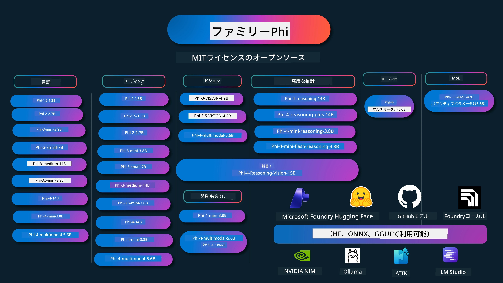

# Phi Cookbook: MicrosoftのPhiモデルを使ったハンズオン例

[](https://codespaces.new/microsoft/phicookbook)
[](https://vscode.dev/redirect?url=vscode://ms-vscode-remote.remote-containers/cloneInVolume?url=https://github.com/microsoft/phicookbook)

[](https://GitHub.com/microsoft/phicookbook/graphs/contributors/?WT.mc_id=aiml-137032-kinfeylo)
[](https://GitHub.com/microsoft/phicookbook/issues/?WT.mc_id=aiml-137032-kinfeylo)
[](https://GitHub.com/microsoft/phicookbook/pulls/?WT.mc_id=aiml-137032-kinfeylo)
[](http://makeapullrequest.com?WT.mc_id=aiml-137032-kinfeylo)

[](https://GitHub.com/microsoft/phicookbook/watchers/?WT.mc_id=aiml-137032-kinfeylo)
[](https://GitHub.com/microsoft/phicookbook/network/?WT.mc_id=aiml-137032-kinfeylo)
[](https://GitHub.com/microsoft/phicookbook/stargazers/?WT.mc_id=aiml-137032-kinfeylo)

[](https://discord.com/invite/ByRwuEEgH4)

PhiはMicrosoftが開発したオープンソースのAIモデルシリーズです。

Phiは現在、非常に優れた性能ベンチマークを持つ、多言語対応、推論、文章・チャット生成、コーディング、画像、音声などのシナリオで最も強力かつコスト効率の良い小型言語モデル（SLM）です。

Phiはクラウドやエッジデバイスに展開可能で、限られた計算リソースでも生成AIアプリケーションを簡単に構築できます。

以下の手順でこれらのリソースの使用を開始してください：
1. <strong>リポジトリをフォーク</strong>：クリック [](https://GitHub.com/microsoft/phicookbook/network/?WT.mc_id=aiml-137032-kinfeylo)
2. <strong>リポジトリをクローン</strong>： `git clone https://github.com/microsoft/PhiCookBook.git`
3. [**Microsoft AI Discordコミュニティに参加して専門家や開発者仲間と交流**](https://discord.com/invite/ByRwuEEgH4?WT.mc_id=aiml-137032-kinfeylo)



### 🌐 多言語対応

#### GitHub Actionsによるサポート（自動化＆常に最新）

<!-- CO-OP TRANSLATOR LANGUAGES TABLE START -->
[Arabic](../ar/README.md) | [Bengali](../bn/README.md) | [Bulgarian](../bg/README.md) | [Burmese (Myanmar)](../my/README.md) | [Chinese (Simplified)](../zh-CN/README.md) | [Chinese (Traditional, Hong Kong)](../zh-HK/README.md) | [Chinese (Traditional, Macau)](../zh-MO/README.md) | [Chinese (Traditional, Taiwan)](../zh-TW/README.md) | [Croatian](../hr/README.md) | [Czech](../cs/README.md) | [Danish](../da/README.md) | [Dutch](../nl/README.md) | [Estonian](../et/README.md) | [Finnish](../fi/README.md) | [French](../fr/README.md) | [German](../de/README.md) | [Greek](../el/README.md) | [Hebrew](../he/README.md) | [Hindi](../hi/README.md) | [Hungarian](../hu/README.md) | [Indonesian](../id/README.md) | [Italian](../it/README.md) | [Japanese](./README.md) | [Kannada](../kn/README.md) | [Korean](../ko/README.md) | [Lithuanian](../lt/README.md) | [Malay](../ms/README.md) | [Malayalam](../ml/README.md) | [Marathi](../mr/README.md) | [Nepali](../ne/README.md) | [Nigerian Pidgin](../pcm/README.md) | [Norwegian](../no/README.md) | [Persian (Farsi)](../fa/README.md) | [Polish](../pl/README.md) | [Portuguese (Brazil)](../pt-BR/README.md) | [Portuguese (Portugal)](../pt-PT/README.md) | [Punjabi (Gurmukhi)](../pa/README.md) | [Romanian](../ro/README.md) | [Russian](../ru/README.md) | [Serbian (Cyrillic)](../sr/README.md) | [Slovak](../sk/README.md) | [Slovenian](../sl/README.md) | [Spanish](../es/README.md) | [Swahili](../sw/README.md) | [Swedish](../sv/README.md) | [Tagalog (Filipino)](../tl/README.md) | [Tamil](../ta/README.md) | [Telugu](../te/README.md) | [Thai](../th/README.md) | [Turkish](../tr/README.md) | [Ukrainian](../uk/README.md) | [Urdu](../ur/README.md) | [Vietnamese](../vi/README.md)

> **ローカルでクローンしたい場合は？**
>
> このリポジトリは50以上の言語翻訳を含むため、ダウンロードサイズが大きくなります。翻訳なしでクローンするにはスパースチェックアウトを使ってください：
>
> **Bash / macOS / Linux:**
> ```bash
> git clone --filter=blob:none --sparse https://github.com/microsoft/PhiCookBook.git
> cd PhiCookBook
> git sparse-checkout set --no-cone '/*' '!translations' '!translated_images'
> ```
>
> **CMD (Windows):**
> ```cmd
> git clone --filter=blob:none --sparse https://github.com/microsoft/PhiCookBook.git
> cd PhiCookBook
> git sparse-checkout set --no-cone "/*" "!translations" "!translated_images"
> ```
>
> これにより、はるかに高速なダウンロードでコースを完了するために必要なすべてが得られます。
<!-- CO-OP TRANSLATOR LANGUAGES TABLE END -->

## 目次
- はじめに - [Phiファミリーへようこそ](./md/01.Introduction/01/01.PhiFamily.md) - [環境設定](./md/01.Introduction/01/01.EnvironmentSetup.md) - [主要技術の理解](./md/01.Introduction/01/01.Understandingtech.md) - [PhiモデルのAI安全性](./md/01.Introduction/01/01.AISafety.md) - [Phiハードウェアサポート](./md/01.Introduction/01/01.Hardwaresupport.md) - [プラットフォーム別Phiモデルと利用可能性](./md/01.Introduction/01/01.Edgeandcloud.md) - [Guidance-aiとPhiの使用](./md/01.Introduction/01/01.Guidance.md) - [GitHubマーケットプレイスモデル](https://github.com/marketplace/models) - [Azure AIモデルカタログ](https://ai.azure.com) - 異なる環境でのPhi推論 - [Hugging face](./md/01.Introduction/02/01.HF.md) - [GitHubモデル](./md/01.Introduction/02/02.GitHubModel.md) - [Microsoft Foundryモデルカタログ](./md/01.Introduction/02/03.AzureAIFoundry.md) - [Ollama](./md/01.Introduction/02/04.Ollama.md) - [AI Toolkit VSCode (AITK)](./md/01.Introduction/02/05.AITK.md) - [NVIDIA NIM](./md/01.Introduction/02/06.NVIDIA.md) - [Foundry Local](./md/01.Introduction/02/07.FoundryLocal.md) - Phiファミリーでの推論 - [iOSでのPhi推論](./md/01.Introduction/03/iOS_Inference.md) - [AndroidでのPhi推論](./md/01.Introduction/03/Android_Inference.md) - [JetsonでのPhi推論](./md/01.Introduction/03/Jetson_Inference.md) - [AI PCでのPhi推論](./md/01.Introduction/03/AIPC_Inference.md) - [Apple MLXフレームワークでのPhi推論](./md/01.Introduction/03/MLX_Inference.md) - [ローカルサーバーでのPhi推論](./md/01.Introduction/03/Local_Server_Inference.md) - [AI Toolkitを使用したリモートサーバーでのPhi推論](./md/01.Introduction/03/Remote_Interence.md) - [RustでのPhi推論](./md/01.Introduction/03/Rust_Inference.md) - [ローカルでのPhi--Vision推論](./md/01.Introduction/03/Vision_Inference.md) - [Kaito AKS、Azureコンテナ（公式サポート）でのPhi推論](./md/01.Introduction/03/Kaito_Inference.md) - [Phiファミリーの量子化](./md/01.Introduction/04/QuantifyingPhi.md) - [llama.cppでPhi-3.5 / 4を量子化](./md/01.Introduction/04/UsingLlamacppQuantifyingPhi.md) - [onnxruntime用生成AI拡張でPhi-3.5 / 4を量子化](./md/01.Introduction/04/UsingORTGenAIQuantifyingPhi.md) - [Intel OpenVINOでPhi-3.5 / 4を量子化](./md/01.Introduction/04/UsingIntelOpenVINOQuantifyingPhi.md) - [Apple MLXフレームワークでPhi-3.5 / 4を量子化](./md/01.Introduction/04/UsingAppleMLXQuantifyingPhi.md) - Phiの評価 - [責任あるAI](./md/01.Introduction/05/ResponsibleAI.md) - [Microsoft Foundryによる評価](./md/01.Introduction/05/AIFoundry.md) - [Promptflowを使用した評価](./md/01.Introduction/05/Promptflow.md) - Azure AI SearchによるRAG - [Azure AI SearchでのPhi-4-miniおよびPhi-4-multimodal (RAG) の使用方法](https://github.com/microsoft/PhiCookBook/blob/main/code/06.E2E/E2E_Phi-4-RAG-Azure-AI-Search.ipynb) - Phiアプリケーション開発サンプル - テキスト＆チャットアプリ - Phi-4サンプル - [📓] [Phi-4-mini ONNXモデルとのチャット](./md/02.Application/01.TextAndChat/Phi4/ChatWithPhi4ONNX/README.md) - [Phi-4ローカルONNXモデルとのチャット .NET](../../md/04.HOL/dotnet/src/LabsPhi4-Chat-01OnnxRuntime) - [Semantic Kernelを用いたPhi-4 ONNXチャット.NETコンソールアプリ](../../md/04.HOL/dotnet/src/LabsPhi4-Chat-02SK) - Phi-3 / 3.5 サンプル - [ブラウザでのローカルチャットボット、Phi3、ONNX Runtime Web、WebGPU使用](https://github.com/microsoft/onnxruntime-inference-examples/tree/main/js/chat) - [OpenVinoチャット](./md/02.Application/01.TextAndChat/Phi3/E2E_OpenVino_Chat.md) - [マルチモデル - 対話型Phi-3-miniとOpenAI Whisper](./md/02.Application/01.TextAndChat/Phi3/E2E_Phi-3-mini_with_whisper.md) - [MLFlow - ラッパー作成とPhi-3のMLFlow利用](./md//02.Application/01.TextAndChat/Phi3/E2E_Phi-3-MLflow.md) - [モデル最適化 - OliveでのONNX Runtime Web用Phi-3-minモデル最適化方法](https://github.com/microsoft/Olive/tree/main/examples/phi3) - [Phi-3 mini-4k-instruct-onnx使用のWinUI3アプリ](https://github.com/microsoft/Phi3-Chat-WinUI3-Sample/) - [WinUI3複数モデルAIパワーノートアプリサンプル](https://github.com/microsoft/ai-powered-notes-winui3-sample) - [Prompt flowを用いたカスタムPhi-3モデルのファインチューニングと統合](./md/02.Application/01.TextAndChat/Phi3/E2E_Phi-3-FineTuning_PromptFlow_Integration.md) - [Microsoft FoundryでのPrompt flowによるカスタムPhi-3モデルのファインチューニングと統合](./md/02.Application/01.TextAndChat/Phi3/E2E_Phi-3-FineTuning_PromptFlow_Integration_AIFoundry.md) - [Microsoftの責任あるAI原則に焦点を当てたMicrosoft Foundryでのファインチューニング済Phi-3 / Phi-3.5モデルの評価](./md/02.Application/01.TextAndChat/Phi3/E2E_Phi-3-Evaluation_AIFoundry.md) - [📓] [Phi-3.5-mini-instruct言語予測サンプル（中国語/英語）](./md/02.Application/01.TextAndChat/Phi3/phi3-instruct-demo.ipynb) - [Phi-3.5-Instruct WebGPU RAGチャットボット](./md/02.Application/01.TextAndChat/Phi3/WebGPUWithPhi35Readme.md) - [Windows GPUを使用したPhi-3.5-Instruct ONNXでのPrompt flowソリューション作成](./md/02.Application/01.TextAndChat/Phi3/UsingPromptFlowWithONNX.md) - [Microsoft Phi-3.5 tfliteを用いたAndroidアプリ作成](./md/02.Application/01.TextAndChat/Phi3/UsingPhi35TFLiteCreateAndroidApp.md) - [Microsoft.ML.OnnxRuntimeを使ったローカルONNX Phi-3モデルによるQ&A .NET例](../../md/04.HOL/dotnet/src/LabsPhi301) - [Semantic KernelとPhi-3によるコンソールチャット.NETアプリ](../../md/04.HOL/dotnet/src/LabsPhi302) - Azure AI推論SDKコードベースサンプル - Phi-4サンプル - [📓] [Phi-4-multimodalを使ったプロジェクトコード生成](./md/02.Application/02.Code/Phi4/GenProjectCode/README.md) - Phi-3 / 3.5 サンプル - [Microsoft Phi-3ファミリーで自分のVisual Studio Code GitHub Copilotチャットを構築](./md/02.Application/02.Code/Phi3/VSCodeExt/README.md) - [GitHubモデルを使用してVisual Studio CodeチャットコパイロットエージェントをPhi-3.5で作成](./md/02.Application/02.Code/Phi3/CreateVSCodeChatAgentWithGitHubModels.md) - 高度な推論サンプル - Phi-4サンプル - [📓] [Phi-4-mini推論またはPhi-4推論サンプル](./md/02.Application/03.AdvancedReasoning/Phi4/AdvancedResoningPhi4mini/README.md) - [📓] [Microsoft OliveでのPhi-4-mini推論のファインチューニング](./md/02.Application/03.AdvancedReasoning/Phi4/AdvancedResoningPhi4mini/olive_ft_phi_4_reasoning_with_medicaldata.ipynb) - [📓] [Apple MLXでのPhi-4-mini推論のファインチューニング](./md/02.Application/03.AdvancedReasoning/Phi4/AdvancedResoningPhi4mini/mlx_ft_phi_4_reasoning_with_medicaldata.ipynb) - [📓] [GitHubモデルでのPhi-4-mini推論](./md/02.Application/02.Code/Phi4r/github_models_inference.ipynb) - [📓] [Microsoft FoundryモデルでのPhi-4-mini推論](./md/02.Application/02.Code/Phi4r/azure_models_inference.ipynb) - 
デモ - [Phi-4-mini demos hosted on Hugging Face Spaces](https://huggingface.co/spaces/microsoft/phi-4-mini?WT.mc_id=aiml-137032-kinfeylo) - [Phi-4-multimodal demos hosted on Hugginge Face Spaces](https://huggingface.co/spaces/microsoft/phi-4-multimodal?WT.mc_id=aiml-137032-kinfeylo) - Vision サンプル - Phi-4 サンプル - [📓] [Phi-4-multimodalを使用して画像を読み取りコードを生成する](./md/02.Application/04.Vision/Phi4/CreateFrontend/README.md) - Phi-3 / 3.5 サンプル - [📓][Phi-3-vision-画像のテキスト変換](./md/02.Application/04.Vision/Phi3/E2E_Phi-3-vision-image-text-to-text-online-endpoint.ipynb) - [Phi-3-vision-ONNX](https://onnxruntime.ai/docs/genai/tutorials/phi3-v.html) - [📓][Phi-3-vision CLIP 埋め込み](./md/02.Application/04.Vision/Phi3/E2E_Phi-3-vision-image-text-to-text-online-endpoint.ipynb) - [DEMO: Phi-3 Recycling](https://github.com/jennifermarsman/PhiRecycling/) - [Phi-3-vision - Phi3-VisionとOpenVINOを用いた視覚言語アシスタント](https://docs.openvino.ai/nightly/notebooks/phi-3-vision-with-output.html) - [Phi-3 Vision Nvidia NIM](./md/02.Application/04.Vision/Phi3/E2E_Nvidia_NIM_Vision.md) - [Phi-3 Vision OpenVino](./md/02.Application/04.Vision/Phi3/E2E_OpenVino_Phi3Vision.md) - [📓][Phi-3.5 Vision 複数フレームまたは複数画像サンプル](./md/02.Application/04.Vision/Phi3/phi3-vision-demo.ipynb) - [Microsoft.ML.OnnxRuntime .NET を使用した Phi-3 Vision ローカル ONNX モデル](../../md/04.HOL/dotnet/src/LabsPhi303) - [メニュー形式の Phi-3 Vision ローカル ONNX モデル Microsoft.ML.OnnxRuntime .NET 使用](../../md/04.HOL/dotnet/src/LabsPhi304) - 推論ビジョンサンプル - Phi-4-Reasoning-Vision-15B - [📓] [Phi-4-Reasoning-Vision-15B を使用した歩行者横断検出](./md/02.Application/10.ReasoningVision/Phi_4_reasoning_vision_15b_Jaywalking.ipynb) - [📓] [Phi-4-Reasoning-Vision-15B を使用した数学問題](./md/02.Application/10.ReasoningVision/Phi_4_reasoning_vision_15b_Math.ipynb) - [📓] [Phi-4-Reasoning-Vision-15B を使用したUI検出](./md/02.Application/10.ReasoningVision/Phi_4_reasoning_vision_15b_ui.ipynb) - 数学サンプル - Phi-4-Mini-Flash-Reasoning-Instruct サンプル [Phi-4-Mini-Flash-Reasoning-Instruct を用いた数学デモ](./md/02.Application/09.Math/MathDemo.ipynb) - 音声サンプル - Phi-4 サンプル - [📓] [Phi-4-multimodalを使った音声文字起こしの抽出](./md/02.Application/05.Audio/Phi4/Transciption/README.md) - [📓] [Phi-4-multimodal 音声サンプル](./md/02.Application/05.Audio/Phi4/Siri/demo.ipynb) - [📓] [Phi-4-multimodal 音声翻訳サンプル](./md/02.Application/05.Audio/Phi4/Translate/demo.ipynb) - [.NET コンソールアプリケーション Phi-4-multimodal 音声ファイル分析と文字起こし生成](../../md/04.HOL/dotnet/src/LabsPhi4-MultiModal-02Audio) - MOE サンプル - Phi-3 / 3.5 サンプル - [📓] [Phi-3.5 Mixture of Experts Models (MoEs) ソーシャルメディアサンプル](./md/02.Application/06.MoE/Phi3/phi3_moe_demo.ipynb) - [📓] [NVIDIA NIM Phi-3 MOE、Azure AI Search、および LlamaIndex を用いた Retrieval-Augmented Generation（RAG）パイプライン構築](./md/02.Application/06.MoE/Phi3/azure-ai-search-nvidia-rag.ipynb) - ファンクションコーリングサンプル - Phi-4 サンプル 🆕 - [📓] [Phi-4-miniを使ったファンクションコーリング](./md/02.Application/07.FunctionCalling/Phi4/FunctionCallingBasic/README.md) - [📓] [Phi-4-mini を使ったマルチエージェントファンクションコーリング作成](./md/02.Application/07.FunctionCalling/Phi4/Multiagents/Phi_4_mini_multiagent.ipynb) - [📓] [Ollamaを使ったファンクションコーリング](./md/02.Application/07.FunctionCalling/Phi4/Ollama/ollama_functioncalling.ipynb) - [📓] [ONNXを用いたファンクションコーリング](./md/02.Application/07.FunctionCalling/Phi4/ONNX/onnx_parallel_functioncalling.ipynb) - マルチモーダルミキシングサンプル - Phi-4 サンプル 🆕 - [📓] [技術ジャーナリストとしてPhi-4-multimodalを使う](./md/02.Application/08.Multimodel/Phi4/TechJournalist/phi_4_mm_audio_text_publish_news.ipynb) - [.NET コンソールアプリケーション Phi-4-multimodalを使った画像解析](../../md/04.HOL/dotnet/src/LabsPhi4-MultiModal-01Images) - ファインチューニングPhiサンプル - [ファインチューニングシナリオ](./md/03.FineTuning/FineTuning_Scenarios.md) - [ファインチューニング vs RAG](./md/03.FineTuning/FineTuning_vs_RAG.md) - [Phi-3を業界専門家に育てるファインチューニング](./md/03.FineTuning/LetPhi3gotoIndustriy.md) - [VS Code用AIツールキットを使ったPhi-3ファインチューニング](./md/03.FineTuning/Finetuning_VSCodeaitoolkit.md) - [Azure Machine Learning Serviceを使ったPhi-3ファインチューニング](./md/03.FineTuning/Introduce_AzureML.md) - [Loraを使ったPhi-3ファインチューニング](./md/03.FineTuning/FineTuning_Lora.md) - [QLoraを使ったPhi-3ファインチューニング](./md/03.FineTuning/FineTuning_Qlora.md) - [Microsoft Foundryを使ったPhi-3ファインチューニング](./md/03.FineTuning/FineTuning_AIFoundry.md) - [Azure ML CLI/SDKを使ったPhi-3ファインチューニング](./md/03.FineTuning/FineTuning_MLSDK.md) - [Microsoft Oliveを使ったファインチューニング](./md/03.FineTuning/FineTuning_MicrosoftOlive.md) - [Microsoft Olive ハンズオンラボによるファインチューニング](./md/03.FineTuning/olive-lab/readme.md) - [Weights and Bias を使った Phi-3-vision ファインチューニング](./md/03.FineTuning/FineTuning_Phi-3-visionWandB.md) - [Apple MLX フレームワークを使った Phi-3 ファインチューニング](./md/03.FineTuning/FineTuning_MLX.md) - [Phi-3-visionのファインチューニング（公式サポート）](./md/03.FineTuning/FineTuning_Vision.md) - [Kaito AKS 、Azure Containers での Phi-3 ファインチューニング（公式サポート）](./md/03.FineTuning/FineTuning_Kaito.md) - [Phi-3 と 3.5 Vision のファインチューニング](https://github.com/2U1/Phi3-Vision-Finetune) - ハンズオンラボ - [最先端モデルの探求: LLMs、SLMs、ローカル開発など](https://github.com/microsoft/aitour-exploring-cutting-edge-models) - [NLPの可能性を引き出す: Microsoft Oliveを使ったファインチューニング](https://github.com/azure/Ignite_FineTuning_workshop) - 学術研究論文および出版物 - [Textbooks Are All You Need II: phi-1.5 technical report](https://arxiv.org/abs/2309.05463) - [Phi-3 Technical Report: スマホで動く高性能言語モデル](https://arxiv.org/abs/2404.14219) - [Phi-4 Technical Report](https://arxiv.org/abs/2412.08905) - [Phi-4-Mini Technical Report: 混合LoRAsによるコンパクトで強力なマルチモーダル言語モデル](https://arxiv.org/abs/2503.01743) - [車載用関数呼び出し向け小型言語モデルの最適化](https://arxiv.org/abs/2501.02342) - [(WhyPHI) 複数選択問題回答用PHI-3のファインチューニング: 方法論、結果、および課題](https://arxiv.org/abs/2501.01588) - [Phi-4-reasoning Technical Report](https://www.microsoft.com/en-us/research/wp-content/uploads/2025/04/phi_4_reasoning.pdf)
- [Phi-4-mini-推論技術報告書](https://huggingface.co/microsoft/Phi-4-mini-reasoning/blob/main/Phi-4-Mini-Reasoning.pdf)
# Phi クックブック：Microsoft の Phi モデルを使ったハンズオン例

[](https://codespaces.new/microsoft/phicookbook)
[](https://vscode.dev/redirect?url=vscode://ms-vscode-remote.remote-containers/cloneInVolume?url=https://github.com/microsoft/phicookbook)

[](https://GitHub.com/microsoft/phicookbook/graphs/contributors/?WT.mc_id=aiml-137032-kinfeylo)
[](https://GitHub.com/microsoft/phicookbook/issues/?WT.mc_id=aiml-137032-kinfeylo)
[](https://GitHub.com/microsoft/phicookbook/pulls/?WT.mc_id=aiml-137032-kinfeylo)
[](http://makeapullrequest.com?WT.mc_id=aiml-137032-kinfeylo)

[](https://GitHub.com/microsoft/phicookbook/watchers/?WT.mc_id=aiml-137032-kinfeylo)
[](https://GitHub.com/microsoft/phicookbook/network/?WT.mc_id=aiml-137032-kinfeylo)
[](https://GitHub.com/microsoft/phicookbook/stargazers/?WT.mc_id=aiml-137032-kinfeylo)

[](https://discord.com/invite/ByRwuEEgH4)

Phi は Microsoft が開発したオープンソースの AI モデル群です。

Phi は現在、非常に優れたベンチマークを持つ最も強力かつコスト効率の高い小型言語モデル（SLM）であり、多言語、推論、テキスト／チャット生成、コーディング、画像、音声などさまざまなシナリオで優れています。

Phi はクラウドやエッジデバイスに展開でき、限られた計算リソースでも生成AIアプリケーションを簡単に構築できます。

これらのリソースを使い始めるための手順はこちらです：
1. <strong>リポジトリをフォークする</strong>: クリック [](https://GitHub.com/microsoft/phicookbook/network/?WT.mc_id=aiml-137032-kinfeylo)
2. <strong>リポジトリをクローンする</strong>: `git clone https://github.com/microsoft/PhiCookBook.git`
3. [**Microsoft AI Discordコミュニティに参加して、エキスパートや開発者仲間と交流する**](https://discord.com/invite/ByRwuEEgH4?WT.mc_id=aiml-137032-kinfeylo)


### 🌐 多言語対応

#### GitHub Actions によるサポート（自動化＆常に最新）

<!-- CO-OP TRANSLATOR LANGUAGES TABLE START -->
[Arabic](../ar/README.md) | [Bengali](../bn/README.md) | [Bulgarian](../bg/README.md) | [Burmese (Myanmar)](../my/README.md) | [Chinese (Simplified)](../zh-CN/README.md) | [Chinese (Traditional, Hong Kong)](../zh-HK/README.md) | [Chinese (Traditional, Macau)](../zh-MO/README.md) | [Chinese (Traditional, Taiwan)](../zh-TW/README.md) | [Croatian](../hr/README.md) | [Czech](../cs/README.md) | [Danish](../da/README.md) | [Dutch](../nl/README.md) | [Estonian](../et/README.md) | [Finnish](../fi/README.md) | [French](../fr/README.md) | [German](../de/README.md) | [Greek](../el/README.md) | [Hebrew](../he/README.md) | [Hindi](../hi/README.md) | [Hungarian](../hu/README.md) | [Indonesian](../id/README.md) | [Italian](../it/README.md) | [Japanese](./README.md) | [Kannada](../kn/README.md) | [Korean](../ko/README.md) | [Lithuanian](../lt/README.md) | [Malay](../ms/README.md) | [Malayalam](../ml/README.md) | [Marathi](../mr/README.md) | [Nepali](../ne/README.md) | [Nigerian Pidgin](../pcm/README.md) | [Norwegian](../no/README.md) | [Persian (Farsi)](../fa/README.md) | [Polish](../pl/README.md) | [Portuguese (Brazil)](../pt-BR/README.md) | [Portuguese (Portugal)](../pt-PT/README.md) | [Punjabi (Gurmukhi)](../pa/README.md) | [Romanian](../ro/README.md) | [Russian](../ru/README.md) | [Serbian (Cyrillic)](../sr/README.md) | [Slovak](../sk/README.md) | [Slovenian](../sl/README.md) | [Spanish](../es/README.md) | [Swahili](../sw/README.md) | [Swedish](../sv/README.md) | [Tagalog (Filipino)](../tl/README.md) | [Tamil](../ta/README.md) | [Telugu](../te/README.md) | [Thai](../th/README.md) | [Turkish](../tr/README.md) | [Ukrainian](../uk/README.md) | [Urdu](../ur/README.md) | [Vietnamese](../vi/README.md)

> **ローカルでクローンしたいですか？**
>
> このリポジトリは50以上の言語の翻訳を含んでいるため、ダウンロードサイズが大きくなります。翻訳を除いてクローンしたい場合は、スパースチェックアウトを使用してください。
>
> **Bash / macOS / Linux:**
> ```bash
> git clone --filter=blob:none --sparse https://github.com/microsoft/PhiCookBook.git
> cd PhiCookBook
> git sparse-checkout set --no-cone '/*' '!translations' '!translated_images'
> ```
>
> **CMD (Windows):**
> ```cmd
> git clone --filter=blob:none --sparse https://github.com/microsoft/PhiCookBook.git
> cd PhiCookBook
> git sparse-checkout set --no-cone "/*" "!translations" "!translated_images"
> ```
>
> これにより、コースを完了するのに必要なすべてのものをはるかに高速なダウンロードで入手できます。
<!-- CO-OP TRANSLATOR LANGUAGES TABLE END -->

## 目次

## Phi モデルの使用

### Microsoft Foundry での Phi

Microsoft Phi の使い方、およびさまざまなハードウェアデバイスでの E2E ソリューションの構築方法を学べます。Phi を体験するには、モデルを操作してシナリオに合わせてカスタマイズし始めるところから、[Microsoft Foundry Azure AI Model Catalog](https://aka.ms/phi3-azure-ai) を利用してください。詳しくは [Microsoft Foundry の入門](/md/02.QuickStart/AzureAIFoundry_QuickStart.md) をご覧ください。

<strong>プレイグラウンド</strong>  
各モデルには専用のプレイグラウンドがあり、モデルをテストできます。[Azure AI Playground](https://aka.ms/try-phi3)

### GitHub Models での Phi

Microsoft Phi の使い方、及びさまざまなハードウェアデバイスでの E2E ソリューションの構築方法を学べます。Phi を体験するには、モデルを操作してシナリオに合わせてカスタマイズし始めるところから、[GitHub Model Catalog](https://github.com/marketplace/models?WT.mc_id=aiml-137032-kinfeylo) を利用してください。詳しくは [GitHub Model Catalog の入門](/md/02.QuickStart/GitHubModel_QuickStart.md) をご覧ください。

<strong>プレイグラウンド</strong>  
各モデルには専用の[モデルテスト用プレイグラウンド](/md/02.QuickStart/GitHubModel_QuickStart.md)があります。

### Hugging Face での Phi

モデルは [Hugging Face](https://huggingface.co/microsoft) でも見つかります。

<strong>プレイグラウンド</strong>  
[Hugging Chat プレイグラウンド](https://huggingface.co/chat/models/microsoft/Phi-3-mini-4k-instruct)

## 🎒 その他のコース

私たちのチームは他にもコースを制作しています。ぜひご覧ください：

<!-- CO-OP TRANSLATOR OTHER COURSES START -->
### LangChain
[](https://aka.ms/langchain4j-for-beginners)
[](https://aka.ms/langchainjs-for-beginners?WT.mc_id=m365-94501-dwahlin)
[](https://github.com/microsoft/langchain-for-beginners?WT.mc_id=m365-94501-dwahlin)
---

### Azure / Edge / MCP / エージェント
[](https://github.com/microsoft/AZD-for-beginners?WT.mc_id=academic-105485-koreyst)
[](https://github.com/microsoft/edgeai-for-beginners?WT.mc_id=academic-105485-koreyst)
[](https://github.com/microsoft/mcp-for-beginners?WT.mc_id=academic-105485-koreyst)
[](https://github.com/microsoft/ai-agents-for-beginners?WT.mc_id=academic-105485-koreyst)

---

### 生成系 AI シリーズ
[](https://github.com/microsoft/generative-ai-for-beginners?WT.mc_id=academic-105485-koreyst)
[-9333EA?style=for-the-badge&labelColor=E5E7EB&color=9333EA)](https://github.com/microsoft/Generative-AI-for-beginners-dotnet?WT.mc_id=academic-105485-koreyst)
[-C084FC?style=for-the-badge&labelColor=E5E7EB&color=C084FC)](https://github.com/microsoft/generative-ai-for-beginners-java?WT.mc_id=academic-105485-koreyst)
[-E879F9?style=for-the-badge&labelColor=E5E7EB&color=E879F9)](https://github.com/microsoft/generative-ai-with-javascript?WT.mc_id=academic-105485-koreyst)

---
 
### 基礎学習
[](https://aka.ms/ml-beginners?WT.mc_id=academic-105485-koreyst)
[](https://aka.ms/datascience-beginners?WT.mc_id=academic-105485-koreyst)
[](https://aka.ms/ai-beginners?WT.mc_id=academic-105485-koreyst)
[](https://github.com/microsoft/Security-101?WT.mc_id=academic-96948-sayoung)
[](https://aka.ms/webdev-beginners?WT.mc_id=academic-105485-koreyst)
[](https://aka.ms/iot-beginners?WT.mc_id=academic-105485-koreyst)
[](https://github.com/microsoft/xr-development-for-beginners?WT.mc_id=academic-105485-koreyst)

---
 
### Copilot シリーズ
[](https://aka.ms/GitHubCopilotAI?WT.mc_id=academic-105485-koreyst)
[](https://github.com/microsoft/mastering-github-copilot-for-dotnet-csharp-developers?WT.mc_id=academic-105485-koreyst)
[](https://github.com/microsoft/CopilotAdventures?WT.mc_id=academic-105485-koreyst)
<!-- CO-OP TRANSLATOR OTHER COURSES END -->

## 責任あるAI 

Microsoft は、お客様が当社のAI製品を責任を持って使用できるように支援し、学びを共有し、Transparency Notes や Impact Assessments のようなツールを通じて信頼に基づくパートナーシップを構築することに注力しています。これらのリソースの多くは [https://aka.ms/RAI](https://aka.ms/RAI) にてご覧いただけます。
Microsoftの責任あるAIへのアプローチは、公平性、信頼性と安全性、プライバシーとセキュリティ、包括性、透明性、説明責任というAI原則に基づいています。

このサンプルで使用されているような大規模な自然言語、画像、および音声モデルは、不公平、不信頼、または不快な行動をとる可能性があり、その結果、害を及ぼすことがあります。リスクおよび制限については、[Azure OpenAIサービス Transparency note](https://learn.microsoft.com/legal/cognitive-services/openai/transparency-note?tabs=text) を参照してください。

これらのリスクを軽減する推奨アプローチは、害のある行動を検出し防止できるセーフティシステムをアーキテクチャに含めることです。[Azure AI Content Safety](https://learn.microsoft.com/azure/ai-services/content-safety/overview) は、アプリケーションやサービス内のユーザー生成およびAI生成の有害コンテンツを検出できる独立した保護層を提供します。Azure AI Content Safety には、有害な内容を検出するテキストおよび画像APIが含まれています。Microsoft Foundry では、Content Safety サービスを通じて、異なるモダリティで有害コンテンツを検出するサンプルコードを閲覧、探索、試すことができます。以下の[クイックスタートドキュメント](https://learn.microsoft.com/azure/ai-services/content-safety/quickstart-text?tabs=visual-studio%2Clinux&pivots=programming-language-rest)はサービスへのリクエスト方法を案内します。

考慮すべきもう一つの側面は全体的なアプリケーションパフォーマンスです。マルチモーダルおよびマルチモデルのアプリケーションでは、パフォーマンスとはシステムが利用者やユーザーの期待通りに動作し、有害な出力を生成しないことを意味します。全体アプリケーションの性能を評価するために、[Performance and Quality and Risk and Safety evaluators](https://learn.microsoft.com/azure/ai-studio/concepts/evaluation-metrics-built-in)をご利用ください。また、[カスタム評価者](https://learn.microsoft.com/azure/ai-studio/how-to/develop/evaluate-sdk#custom-evaluators)を作成し評価に使用することも可能です。

開発環境でAIアプリケーションを評価するには、[Azure AI Evaluation SDK](https://microsoft.github.io/promptflow/index.html)を使用します。テストデータセットやターゲットがある場合、生成AIアプリケーションの生成物は組み込み評価者またはお好みのカスタム評価者によって定量的に測定されます。Azure AI Evaluation SDKを利用してシステムを評価するための[クイックスタートガイド](https://learn.microsoft.com/azure/ai-studio/how-to/develop/flow-evaluate-sdk)を参考にしてください。評価実行後は、[Microsoft Foundryで結果を視覚化](https://learn.microsoft.com/azure/ai-studio/how-to/evaluate-flow-results)できます。

## 商標

本プロジェクトには、プロジェクト、製品、またはサービスの商標やロゴが含まれる場合があります。Microsoftの商標またはロゴの許可された使用は、[Microsoftの商標およびブランドガイドライン](https://www.microsoft.com/legal/intellectualproperty/trademarks/usage/general)に従う必要があります。
本プロジェクトの修正版でMicrosoftの商標またはロゴを使用する場合は、混乱を招かず、Microsoftのスポンサーシップを示唆しないようにしてください。第三者の商標やロゴの使用は、それら第三者のポリシーに従います。

## サポートを得るには

AIアプリ開発で問題が発生した場合、または質問がある場合は、以下に参加してください:

[](https://aka.ms/foundry/discord)

製品のフィードバックやビルド中のエラーについては、以下にアクセスしてください:

[](https://aka.ms/foundry/forum)

---

<!-- CO-OP TRANSLATOR DISCLAIMER START -->
**免責事項**：  
本書類は AI 翻訳サービス [Co-op Translator](https://github.com/Azure/co-op-translator) を使用して翻訳されています。正確性には努めていますが、自動翻訳には誤りや不正確な箇所が含まれる場合があることをご承知おきください。原文のネイティブ言語の文書が公式の情報源とみなされます。重要な情報については、専門の人力翻訳を推奨します。この翻訳の使用により生じたいかなる誤解や誤訳についても、当方は一切責任を負いません。
<!-- CO-OP TRANSLATOR DISCLAIMER END -->