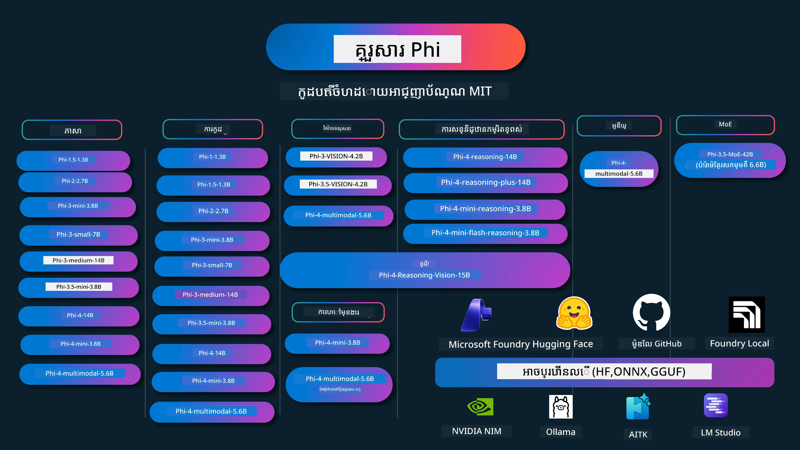

# ស៊ុមភី (Phi) Cookbook: ឧទាហរណ៍បញ្ចូលដៃជាមួយម៉ូដែល Phi របស់ Microsoft

[](https://codespaces.new/microsoft/phicookbook)
[](https://vscode.dev/redirect?url=vscode://ms-vscode-remote.remote-containers/cloneInVolume?url=https://github.com/microsoft/phicookbook)

[](https://GitHub.com/microsoft/phicookbook/graphs/contributors/?WT.mc_id=aiml-137032-kinfeylo)
[](https://GitHub.com/microsoft/phicookbook/issues/?WT.mc_id=aiml-137032-kinfeylo)
[](https://GitHub.com/microsoft/phicookbook/pulls/?WT.mc_id=aiml-137032-kinfeylo)
[](http://makeapullrequest.com?WT.mc_id=aiml-137032-kinfeylo)

[](https://GitHub.com/microsoft/phicookbook/watchers/?WT.mc_id=aiml-137032-kinfeylo)
[](https://GitHub.com/microsoft/phicookbook/network/?WT.mc_id=aiml-137032-kinfeylo)
[](https://GitHub.com/microsoft/phicookbook/stargazers/?WT.mc_id=aiml-137032-kinfeylo)

[](https://discord.com/invite/ByRwuEEgH4)

Phi គឺជាស៊ុមម៉ូដែល AI ផ្លូវចំហ រដ្ធផលដោយ Microsoft។

Phi ជាមួយនឹងភាពមានសមត្ថភាពខ្ពស់បំផុត និងអត្ថប្រយោជន៍ថោកបំផុតសម្រាប់ម៉ូដែលភាសាថ្មីតូច (SLM) ជាមួយគំរូវាស់វែងល្អក្នុងភាសាច្រើន, ការរួមបញ្ចូលផ្នែកគំនិត, ការបង្កើតអត្ថបទ/ជជែក, កូដ, រូបភាព, សំឡេង និងសេណារីយ៉ូនផ្សេងទៀត។

អ្នកអាចដំណើរការចេញ Phi នៅលើពពក ឬ ឧបករណ៍មុខដូច Edge ហើយអ្នកអាចសាងសង់កម្មវិធី AI បង្កើតដោយងាយស្រួលជាមួយថាមពលគណនា​ពិតប្រាកដកំណត់។

អនុវត្តន៍ជំហានខាងក្រោមដើម្បីចាប់ផ្តើមប្រើប្រាស់ធនធានទាំងនេះ៖  
1. **លួចបម្រើផ្ទះបាយ (Fork the Repository)**: ចុច [](https://GitHub.com/microsoft/phicookbook/network/?WT.mc_id=aiml-137032-kinfeylo)  
2. **ចម្លងបម្រើផ្ទះបាយ (Clone the Repository)**: `git clone https://github.com/microsoft/PhiCookBook.git`  
3. [**ចូលរួមជាមួយសហគមន៍ Microsoft AI Discord និងជួបអ្នកជំនាញ និងអ្នកអភិវឌ្ឍន៍ផ្សេងទៀត**](https://discord.com/invite/ByRwuEEgH4?WT.mc_id=aiml-137032-kinfeylo)



### 🌐 គាំទ្រភាសាច្រើន

#### គាំទ្រដោយ GitHub Action (ស្វ័យក្រិត និង ជាប្រចាំ)

<!-- CO-OP TRANSLATOR LANGUAGES TABLE START -->
[អារ៉ាប់](../ar/README.md) | [បង់គ្លា](../bn/README.md) | [ប៊ុលហ្គាប៊ី](../bg/README.md) | [ភូមា (មីយ៉ាន់ម៉ា)](../my/README.md) | [ចិន (រូបរាងសាមញ្ញ)](../zh-CN/README.md) | [ចិន (បែបប្រពៃណី, ហុងកុង)](../zh-HK/README.md) | [ចិន (បែបប្រពៃណី, ម៉ាកាវ)](../zh-MO/README.md) | [ចិន (បែបប្រពៃណី, តៃវ៉ាន់)](../zh-TW/README.md) | [ក្រូអាទីយ៉ាន់](../hr/README.md) | [ចែក](../cs/README.md) | [ដាណា](../da/README.md) | [នឌូស](../nl/README.md) | [អេសតូនី](../et/README.md) | [ហ្វាំងណ៊ីស៍](../fi/README.md) | [បារាំង](../fr/README.md) | [អេស្ប៉ាញ](../de/README.md) | [ហ្គ្រីក](../el/README.md) | [ហេប្រ៊ូវ](../he/README.md) | [ហីនឌី](../hi/README.md) | [ហុងគ្រី](../hu/README.md) | [ឥណ្ឌូណេស៊ី](../id/README.md) | [អ៊ីតាលី](../it/README.md) | [ជប៉ុន](../ja/README.md) | [កនាដា](../kn/README.md) | [ខ្មែរ](./README.md) | [កូរ៉េ](../ko/README.md) | [លីទួយ៉ា](../lt/README.md) | [ម៉ាឡាវី](../ms/README.md) | [ម៉ាឡាលាំ](../ml/README.md) | [ម៉ារ៉ាធី](../mr/README.md) | [នេប៉ាឡេ](../ne/README.md) | [ភីជិននីហ្សេរីយ៉ា](../pcm/README.md) | [ន័រវេស៊ី](../no/README.md) | [ភាសាពួស៊ង់ (ហ្វាស៊ី)](../fa/README.md) | [ប៉ូល្ល្](../pl/README.md) | [ព័រទុយហ្គេស (ប្រេស៊ីល)](../pt-BR/README.md) | [ព័រទុយហ្គេស (ព័រទុយហ្គាល់)](../pt-PT/README.md) | [បង់ជាប្រ៊ូណិច (Gurmukhi)](../pa/README.md) | [រូម៉ានី](../ro/README.md) | [រុស្ស៊ី](../ru/README.md) | [ស៊ែប៊ី (Cyrillic)](../sr/README.md) | [ស្លូវ៉ាគ](../sk/README.md) | [ស្លូវ៉េនី](../sl/README.md) | [អេស្ប៉ាញ](../es/README.md) | [ស្វាហ៊ីលី](../sw/README.md) | [ស៊ុយអែដ](../sv/README.md) | [តាឡាហ្គូល (ហ្វីលីពីន)](../tl/README.md) | [ធាមីល](../ta/README.md) | [តេលុគ្រ៊ូ](../te/README.md) | [ថៃ](../th/README.md) | [ទួរកី](../tr/README.md) | [អ៊ុយក្រែន](../uk/README.md) | [អ៊ុយរឌូ](../ur/README.md) | [វៀតណាម](../vi/README.md)

> **ចូលចិត្តចម្លងក្នុងថ្នាក់ក្រៅបន្ទប់?**  
>  
> បម្រើផ្ទះនេះរួមបញ្ចូលការបកប្រែជាភាសាម៉ាត់ 50+ ដែលបង្កើនទំហំដោនឡូដយ៉ាងខ្លាំង។ ដើម្បីចម្លងដោយគ្មានការប្រែក្លាយភាសា ប្រើ sparse checkout:  
>  
> **Bash / macOS / Linux:**  
> ```bash
> git clone --filter=blob:none --sparse https://github.com/microsoft/PhiCookBook.git
> cd PhiCookBook
> git sparse-checkout set --no-cone '/*' '!translations' '!translated_images'
> ```
>  
> **CMD (Windows):**  
> ```cmd
> git clone --filter=blob:none --sparse https://github.com/microsoft/PhiCookBook.git
> cd PhiCookBook
> git sparse-checkout set --no-cone "/*" "!translations" "!translated_images"
> ```
>  
> ធានាថាអ្នកមានគ្រឿងបន្លាស់ទាំងអស់ដែលត្រូវការដើម្បីបញ្ចប់វគ្គសិក្សា ជាមួយនឹងដោនឡូដលឿនជាងមុន។  
<!-- CO-OP TRANSLATOR LANGUAGES TABLE END -->

## ខ្សែចំណងចិត្ត

- មាតិកា
  - [ស្វាគមន៍ទៅកាន់គ្រួសារភី](./md/01.Introduction/01/01.PhiFamily.md)
  - [ការតំឡើងបរិយាកាសរបស់អ្នក](./md/01.Introduction/01/01.EnvironmentSetup.md)
  - [ការយល់ដឹងអំពីបច្ចេកវិទ្យាសំខាន់ៗ](./md/01.Introduction/01/01.Understandingtech.md)
  - [សុវត្ថិភាព AI សម្រាប់ម៉ូដែល Phi](./md/01.Introduction/01/01.AISafety.md)
  - [គាំទ្រ់សម្រាប់រឹងភី](./md/01.Introduction/01/01.Hardwaresupport.md)
  - [ម៉ូដែល Phi និងការចូលប្រើនៅលើវេទិកាផ្សេងៗ](./md/01.Introduction/01/01.Edgeandcloud.md)
  - [ការប្រើប្រាស់ Guidance-ai និង Phi](./md/01.Introduction/01/01.Guidance.md)
  - [ម៉ូដែលទីផ្សារ GitHub](https://github.com/marketplace/models)
  - [បញ្ជីម៉ូដែល Azure AI](https://ai.azure.com)

- ការជំរុញ Phi នៅក្នុងបរិយាកាសផ្សេងគ្នា  
    -  [Hugging face](./md/01.Introduction/02/01.HF.md)  
    -  [ម៉ូដែល GitHub](./md/01.Introduction/02/02.GitHubModel.md)  
    -  [បញ្ជីម៉ូដែល Microsoft Foundry](./md/01.Introduction/02/03.AzureAIFoundry.md)  
    -  [Ollama](./md/01.Introduction/02/04.Ollama.md)  
    -  [AI Toolkit VSCode (AITK)](./md/01.Introduction/02/05.AITK.md)  
    -  [NVIDIA NIM](./md/01.Introduction/02/06.NVIDIA.md)  
    -  [Foundry Local](./md/01.Introduction/02/07.FoundryLocal.md)

- ការជំរុញ Phi Family  
    - [ការជំរុញ Phi នៅ iOS](./md/01.Introduction/03/iOS_Inference.md)  
    - [ការជំរុញ Phi នៅ Android](./md/01.Introduction/03/Android_Inference.md)  
    - [ការជំរុញ Phi នៅ Jetson](./md/01.Introduction/03/Jetson_Inference.md)  
    - [ការជំរុញ Phi នៅ AI PC](./md/01.Introduction/03/AIPC_Inference.md)  
    - [ការជំរុញ Phi ជាមួយ Apple MLX Framework](./md/01.Introduction/03/MLX_Inference.md)  
    - [ការជំរុញ Phi នៅ Server តាមដាន](./md/01.Introduction/03/Local_Server_Inference.md)  
    - [ការជំរុញ Phi នៅ Server ចម្ងាយដោយប្រើ AI Toolkit](./md/01.Introduction/03/Remote_Interence.md)  
    - [ការជំរុញ Phi ជាមួយ Rust](./md/01.Introduction/03/Rust_Inference.md)  
    - [ការជំរុញ Phi--Vision នៅមូលដ្ឋាន](./md/01.Introduction/03/Vision_Inference.md)  
    - [ការជំរុញ Phi ជាមួយ Kaito AKS, Azure Containers (គាំទ្រផ្លូវការជាផ្លូវការសម្បូរ)](./md/01.Introduction/03/Kaito_Inference.md)  
-  [ការវាស់រូបមន្ត Phi Family](./md/01.Introduction/04/QuantifyingPhi.md)  
    - [បម្លែង Phi-3.5 / 4 ដោយប្រើ llama.cpp](./md/01.Introduction/04/UsingLlamacppQuantifyingPhi.md)  
    - [បម្លែង Phi-3.5 / 4 ដោយប្រើជំនួយបន្ថែម AI បង្កើតសម្រាប់ onnxruntime](./md/01.Introduction/04/UsingORTGenAIQuantifyingPhi.md)  
    - [បម្លែង Phi-3.5 / 4 ដោយប្រើ Intel OpenVINO](./md/01.Introduction/04/UsingIntelOpenVINOQuantifyingPhi.md)  
    - [បម្លែង Phi-3.5 / 4 ដោយប្រើ Apple MLX Framework](./md/01.Introduction/04/UsingAppleMLXQuantifyingPhi.md)

-  ការវាយតម្លៃ Phi  
    - [ការឆ្លើយតប AI](./md/01.Introduction/05/ResponsibleAI.md)  
    - [Microsoft Foundry សម្រាប់ការវាយតម្លៃ](./md/01.Introduction/05/AIFoundry.md)  
    - [ការប្រើប្រាស់ Promptflow សម្រាប់ការវាយតម្លៃ](./md/01.Introduction/05/Promptflow.md)
 
- RAG ជាមួយ Azure AI Search  
    - [របៀបប្រើ Phi-4-mini និង Phi-4-multimodal (RAG) ជាមួយ Azure AI Search](https://github.com/microsoft/PhiCookBook/blob/main/code/06.E2E/E2E_Phi-4-RAG-Azure-AI-Search.ipynb)

- ឧទាហរណ៍ការអភិវឌ្ឍន៍កម្មវិធី Phi  
  - កម្មវិធីអត្ថបទ និងការជជែក  
    - ឧទាហរណ៍ Phi-4  
      - [📓] [ជជែកជាមួយម៉ូដែល Phi-4-mini ONNX](./md/02.Application/01.TextAndChat/Phi4/ChatWithPhi4ONNX/README.md)  
      - [ជជែកជាមួយម៉ូដែល Phi-4 ONNX នៅក្នុងតំបន់ .NET](../../md/04.HOL/dotnet/src/LabsPhi4-Chat-01OnnxRuntime)  
      - [កម្មវិធីពិភាក្សា .NET Console ជាមួយ Phi-4 ONNX ប្រើ Sementic Kernel](../../md/04.HOL/dotnet/src/LabsPhi4-Chat-02SK)  
    - ឧទាហរណ៍ Phi-3 / 3.5  
      - [Chatbot តំបន់ក្នុងកម្មវិធីរុករក ប្រើ Phi3, ONNX Runtime Web និង WebGPU](https://github.com/microsoft/onnxruntime-inference-examples/tree/main/js/chat)
      - [OpenVino Chat](./md/02.Application/01.TextAndChat/Phi3/E2E_OpenVino_Chat.md)
      - [ម៉ូឌែលច្រើន - អន្ដរកម្ម Phi-3-mini និង OpenAI Whisper](./md/02.Application/01.TextAndChat/Phi3/E2E_Phi-3-mini_with_whisper.md)
      - [MLFlow - ការបង្កើត wrapper និងការប្រើ Phi-3 ជាមួយ MLFlow](./md//02.Application/01.TextAndChat/Phi3/E2E_Phi-3-MLflow.md)
      - [ចំណុចសំខាន់នៃម៉ូឌែល - របៀបបង្កើតម៉ូឌែល Phi-3-min សម្រាប់ ONNX Runtime Web ជាមួយ Olive](https://github.com/microsoft/Olive/tree/main/examples/phi3)
      - [កម្មវិធី WinUI3 ជាមួយ Phi-3 mini-4k-instruct-onnx](https://github.com/microsoft/Phi3-Chat-WinUI3-Sample/)
      -[WinUI3 Multi Model AI Powered Notes App Sample](https://github.com/microsoft/ai-powered-notes-winui3-sample)
      - [ការតំឡើងលម្អិត និងការរួមបញ្ចូលម៉ូឌែល Phi-3 ផ្ទាល់ខ្លួនជាមួយ Prompt flow](./md/02.Application/01.TextAndChat/Phi3/E2E_Phi-3-FineTuning_PromptFlow_Integration.md)
      - [ការតំឡើងលម្អិត និងការរួមបញ្ចូលម៉ូឌែល Phi-3 ផ្ទាល់ខ្លួនជាមួយ Prompt flow ក្នុង Microsoft Foundry](./md/02.Application/01.TextAndChat/Phi3/E2E_Phi-3-FineTuning_PromptFlow_Integration_AIFoundry.md)
      - [ការវាយតម្លៃម៉ូឌែល Phi-3 / Phi-3.5 តំឡើងថ្មីនៅ Microsoft Foundry មិនលើកវិធីរបស់ Microsoft របស់ AI](./md/02.Application/01.TextAndChat/Phi3/E2E_Phi-3-Evaluation_AIFoundry.md)
      - [📓] [គំរូការព្យាករណ៍ភាសា Phi-3.5-mini-instruct (ចិន/អង់គ្លេស)](./md/02.Application/01.TextAndChat/Phi3/phi3-instruct-demo.ipynb)
      - [Phi-3.5-Instruct WebGPU RAG Chatbot](./md/02.Application/01.TextAndChat/Phi3/WebGPUWithPhi35Readme.md)
      - [ការប្រើកាត GPU របស់ Windows ដើម្បីបង្កើតដំណោះស្រាយ Prompt flow ជាមួយ Phi-3.5-Instruct ONNX](./md/02.Application/01.TextAndChat/Phi3/UsingPromptFlowWithONNX.md)
      - [ការប្រើ Microsoft Phi-3.5 tflite ដើម្បីបង្កើតកម្មវិធី Android](./md/02.Application/01.TextAndChat/Phi3/UsingPhi35TFLiteCreateAndroidApp.md)
      - [ឧទាហរណ៍ Q&A .NET ដោយប្រើម៉ូឌែល ONNX Phi-3 ក្នុងដំណើរការពីស្រុក Microsoft.ML.OnnxRuntime](../../md/04.HOL/dotnet/src/LabsPhi301)
      - [កម្មវិធីឆាត console .NET ជាមួយ Semantic Kernel និង Phi-3](../../md/04.HOL/dotnet/src/LabsPhi302)

  - គំរូកូដ Azure AI Inference SDK
    - គំរូ Phi-4
      - [📓] [បង្កើតកូដគម្រោងប្រើ Phi-4-multimodal](./md/02.Application/02.Code/Phi4/GenProjectCode/README.md)
    - គំរូ Phi-3 / 3.5
      - [បង្កើត Visual Studio Code GitHub Copilot Chat ផ្ទាល់ខ្លួនជាមួយ Microsoft Phi-3 Family](./md/02.Application/02.Code/Phi3/VSCodeExt/README.md)
      - [បង្កើត Visual Studio Code Chat Copilot Agent ផ្ទាល់ខ្លួនជាមួយ Phi-3.5 ដោយ GitHub Models](/md/02.Application/02.Code/Phi3/CreateVSCodeChatAgentWithGitHubModels.md)

  - គំរូការយល់ដឹងខ្ពស់
    - គំរូ Phi-4
      - [📓] [គំរូ Phi-4-mini-reasoning ឬ Phi-4-reasoning](./md/02.Application/03.AdvancedReasoning/Phi4/AdvancedResoningPhi4mini/README.md)
      - [📓] [ការតំឡើងលម្អិត Phi-4-mini-reasoning ជាមួយ Microsoft Olive](./md/02.Application/03.AdvancedReasoning/Phi4/AdvancedResoningPhi4mini/olive_ft_phi_4_reasoning_with_medicaldata.ipynb)
      - [📓] [ការតំឡើងលម្អិត Phi-4-mini-reasoning ជាមួយ Apple MLX](./md/02.Application/03.AdvancedReasoning/Phi4/AdvancedResoningPhi4mini/mlx_ft_phi_4_reasoning_with_medicaldata.ipynb)
      - [📓] [Phi-4-mini-reasoning ជាមួយ GitHub Models](./md/02.Application/02.Code/Phi4r/github_models_inference.ipynb)
      - [📓] [Phi-4-mini-reasoning ជាមួយ Microsoft Foundry Models](./md/02.Application/02.Code/Phi4r/azure_models_inference.ipynb)
  - ការត្រួតពិនិត្យ
      - [Phi-4-mini ដេមោ ដែលផ្ទុកនៅលើ Hugging Face Spaces](https://huggingface.co/spaces/microsoft/phi-4-mini?WT.mc_id=aiml-137032-kinfeylo)
      - [Phi-4-multimodal ដេមោ ដែលផ្ទុកនៅលើ Hugginge Face Spaces](https://huggingface.co/spaces/microsoft/phi-4-multimodal?WT.mc_id=aiml-137032-kinfeylo)
  - គំរូចក្ខុវិស័យ
    - គំរូ Phi-4
      - [📓] [ប្រើ Phi-4-multimodal ដើម្បីអានរូបភាព និងបង្កើតកូដ](./md/02.Application/04.Vision/Phi4/CreateFrontend/README.md)
    - គំរូ Phi-3 / 3.5
      -  [📓][Phi-3-vision-រូបភាពអត្ថបទទៅអត្ថបទ](./md/02.Application/04.Vision/Phi3/E2E_Phi-3-vision-image-text-to-text-online-endpoint.ipynb)
      - [Phi-3-vision-ONNX](https://onnxruntime.ai/docs/genai/tutorials/phi3-v.html)
      - [📓][Phi-3-vision CLIP Embedding](./md/02.Application/04.Vision/Phi3/E2E_Phi-3-vision-image-text-to-text-online-endpoint.ipynb)
      - [DEMO: Phi-3 ការប៉ុនប៉ងជីវពហុ](https://github.com/jennifermarsman/PhiRecycling/)
      - [Phi-3-vision - ជំនួយភាសាទស្សនៈ - ជាមួយ Phi3-Vision និង OpenVINO](https://docs.openvino.ai/nightly/notebooks/phi-3-vision-with-output.html)
      - [Phi-3 Vision Nvidia NIM](./md/02.Application/04.Vision/Phi3/E2E_Nvidia_NIM_Vision.md)
      - [Phi-3 Vision OpenVino](./md/02.Application/04.Vision/Phi3/E2E_OpenVino_Phi3Vision.md)
      - [📓][Phi-3.5 Vision ឧទាហរណ៍រូបភាពច្រើន ឬច្រើនសន្លឹក](./md/02.Application/04.Vision/Phi3/phi3-vision-demo.ipynb)
      - [Phi-3 Vision ម៉ូឌែល ONNX ក្នុងស្រុក ប្រើ Microsoft.ML.OnnxRuntime .NET](../../md/04.HOL/dotnet/src/LabsPhi303)
      - [មេនុយ ប្រើ Phi-3 Vision ម៉ូឌែល ONNX ក្នុងស្រុក ប្រើ Microsoft.ML.OnnxRuntime .NET](../../md/04.HOL/dotnet/src/LabsPhi304)

  - គំរូ Reasoning-Vision
    - Phi-4-Reasoning-Vision-15B
      - [📓] [ប្រើ Phi-4-Reasoning-Vision-15B ដើម្បីស្វែងរកការឆ្លងផ្លូវគន្លងជើង](./md/02.Application/10.ReasoningVision/Phi_4_reasoning_vision_15b_Jaywalking.ipynb)
      - [📓] [ប្រើ Phi-4-Reasoning-Vision-15B ដើម្បីគណិតវិទ្យា](./md/02.Application/10.ReasoningVision/Phi_4_reasoning_vision_15b_Math.ipynb)
      - [📓] [ប្រើ Phi-4-Reasoning-Vision-15B ដើម្បីស្វែងរក UI](./md/02.Application/10.ReasoningVision/Phi_4_reasoning_vision_15b_ui.ipynb)

  - គំរូគណិតវិទ្យា
    - គំរូ Phi-4-Mini-Flash-Reasoning-Instruct [ដេមោគណិតវិទ្យាជាមួយ Phi-4-Mini-Flash-Reasoning-Instruct](./md/02.Application/09.Math/MathDemo.ipynb)

  - គំរូសូរ
    - គំរូ Phi-4
      - [📓] [ការបម្រែបម្រួលសំឡេងតាម Phi-4-multimodal](./md/02.Application/05.Audio/Phi4/Transciption/README.md)
      - [📓] [គំរូសម្លេង Phi-4-multimodal](./md/02.Application/05.Audio/Phi4/Siri/demo.ipynb)
      - [📓] [គំរូបកប្រែសំឡេង Phi-4-multimodal](./md/02.Application/05.Audio/Phi4/Translate/demo.ipynb)
      - [កម្មវិធី console .NET ប្រើ Phi-4-multimodal សំឡេង ដើម្បីវិភាគឯកសារ និងបង្កើតច្បាប់](../../md/04.HOL/dotnet/src/LabsPhi4-MultiModal-02Audio)

  - គំរូ MOE
    - គំរូ Phi-3 / 3.5
      - [📓] [Phi-3.5 ម្សិចឡូចអេកសផឺរ(MoEs) គំរូប្រព័ន្ធបណ្ដាញសង្គម](./md/02.Application/06.MoE/Phi3/phi3_moe_demo.ipynb)
      - [📓] [ការបង្កើតបណ្ដាញ RAG ជាមួយ NVIDIA NIM Phi-3 MOE, Azure AI Search និង LlamaIndex](./md/02.Application/06.MoE/Phi3/azure-ai-search-nvidia-rag.ipynb)

  - គំរូការហៅមុខងារ
    - គំរូ Phi-4 🆕
      - [📓] [ប្រើការហៅមុខងារជាមួយ Phi-4-mini](./md/02.Application/07.FunctionCalling/Phi4/FunctionCallingBasic/README.md)
      - [📓] [ប្រើការហៅមុខងារដើម្បីបង្កើត multi-agents ជាមួយ Phi-4-mini](./md/02.Application/07.FunctionCalling/Phi4/Multiagents/Phi_4_mini_multiagent.ipynb)
      - [📓] [ប្រើការហៅមុខងារជាមួយ Ollama](./md/02.Application/07.FunctionCalling/Phi4/Ollama/ollama_functioncalling.ipynb)
      - [📓] [ប្រើការហៅមុខងារជាមួយ ONNX](./md/02.Application/07.FunctionCalling/Phi4/ONNX/onnx_parallel_functioncalling.ipynb)

  - គំរូលាយបញ្ចូល Multimodal
    - គំរូ Phi-4 🆕
      - [📓] [ប្រើ Phi-4-multimodal ជាជournalist បច្ចេកវិទ្យា](./md/02.Application/08.Multimodel/Phi4/TechJournalist/phi_4_mm_audio_text_publish_news.ipynb)
      - [កម្មវិធី console .NET ប្រើ Phi-4-multimodal ដើម្បីវិភាគរូបភាព](../../md/04.HOL/dotnet/src/LabsPhi4-MultiModal-01Images)

- ការតំឡើងលម្អិត Phi
  - [ស្ថានភាពការតំឡើងលម្អិត](./md/03.FineTuning/FineTuning_Scenarios.md)
  - [ការតំឡើងលម្អិត ប្រៀបធៀប RAG](./md/03.FineTuning/FineTuning_vs_RAG.md)
  - [ការតំឡើងលម្អិត ឲ្យ Phi-3 ក្លាយជាអ្នកជំនាញឧស្សាហកម្ម](./md/03.FineTuning/LetPhi3gotoIndustriy.md)
  - [ការតំឡើងលម្អិត Phi-3 ជាមួយ AI Toolkit សម្រាប់ VS Code](./md/03.FineTuning/Finetuning_VSCodeaitoolkit.md)
  - [ការតំឡើងលម្អិត Phi-3 ជាមួយសេវាកម្ម Azure Machine Learning](./md/03.FineTuning/Introduce_AzureML.md)
  - [ការតំឡើងលម្អិត Phi-3 ជាមួយ Lora](./md/03.FineTuning/FineTuning_Lora.md)
  - [ការតំឡើងលម្អិត Phi-3 ជាមួយ QLora](./md/03.FineTuning/FineTuning_Qlora.md)
  - [ការតំឡើងលម្អិត Phi-3 ជាមួយ Microsoft Foundry](./md/03.FineTuning/FineTuning_AIFoundry.md)
  - [ការតំឡើងលម្អិត Phi-3 ជាមួយ Azure ML CLI/SDK](./md/03.FineTuning/FineTuning_MLSDK.md)
  - [ការតំឡើងលម្អិត ជាមួយ Microsoft Olive](./md/03.FineTuning/FineTuning_MicrosoftOlive.md)
  - [ការតំឡើងលម្អិត ជាមួយ Microsoft Olive Hands-On Lab](./md/03.FineTuning/olive-lab/readme.md)
  - [ការតំឡើងលម្អិត Phi-3-vision ជាមួយ Weights និង Bias](./md/03.FineTuning/FineTuning_Phi-3-visionWandB.md)
  - [ការតំឡើងលម្អិត Phi-3 ជាមួយ Apple MLX Framework](./md/03.FineTuning/FineTuning_MLX.md)
  - [ការតំឡើងលម្អិត Phi-3-vision (គាំទ្រផ្លូវការជាផ្លូវការ)](./md/03.FineTuning/FineTuning_Vision.md)
  - [ការកែលម្អ Phi-3 ជាមួយ Kaito AKS , Azure Containers(ការគាំទ្រផ្លូវការ)](./md/03.FineTuning/FineTuning_Kaito.md)
  - [ការកែលម្អ Phi-3 និង 3.5 Vision](https://github.com/2U1/Phi3-Vision-Finetune)

- កិច្ចសិក្សាផ្ទាល់
  - [ការស្វែងរកគំរូកម្រិតខ្ពស់: LLMs, SLMs, ការអភិវឌ្ឍនៅមូលដ្ឋាន និងផ្សេងៗទៀត](https://github.com/microsoft/aitour-exploring-cutting-edge-models)
  - [ការបើកចំហរ​​​សក្តានុពល NLP៖ ការកែលម្អជាមួយ Microsoft Olive](https://github.com/azure/Ignite_FineTuning_workshop)

- សារព័ត៌មាន និងការបោះពុម្ពផ្សាយស្រាវជ្រាវសិក្សា
  - [សៀវភៅសិក្សាគឺគ្រប់គ្រាន់ដែលអ្នកត្រូវការលេខរៀងទី II: របាយការណ៍បច្ចេកទេស phi-1.5](https://arxiv.org/abs/2309.05463)
  - [របាយការណ៍បច្ចេកទេស Phi-3៖ គំរូភាសាមានសមត្ថភាពខ្ពស់នៅក្នុងទូរស័ព្ទរបស់អ្នក](https://arxiv.org/abs/2404.14219)
  - [របាយការណ៍បច្ចេកទេស Phi-4](https://arxiv.org/abs/2412.08905)
  - [របាយការណ៍បច្ចេកទេស Phi-4-Mini៖ គំរូភាសាទ្រង់ទ្រាយតូច ប៉ុន្តែមានអំណាចខ្ពស់តាមរយៈការបញ្ចូលគ្នារបស់ LoRAs](https://arxiv.org/abs/2503.01743)
  - [ការបង្ហាញលទ្ធផលល្អបំផុតសម្រាប់គំរូភាសាតូចសម្រាប់នាទីហៅមុខងារកន្លែងក្នុងឡាន](https://arxiv.org/abs/2501.02342)
  - [(WhyPHI) ការកែលម្អ PHI-3 សម្រាប់ការឆ្លើយសំណួរជម្រើសច្រើន៖ វិធីសាស្រ្តលទ្ធផល និងបញ្ហា](https://arxiv.org/abs/2501.01588)
  - [របាយការណ៍បច្ចេកទេស Phi-4-reasoning](https://www.microsoft.com/en-us/research/wp-content/uploads/2025/04/phi_4_reasoning.pdf)
  - [របាយការណ៍បច្ចេកទេស Phi-4-mini-reasoning](https://huggingface.co/microsoft/Phi-4-mini-reasoning/blob/main/Phi-4-Mini-Reasoning.pdf)

## ការប្រើប្រាស់គំរូ Phi

### Phi នៅលើ Microsoft Foundry

អ្នកអាចស្វែងយល់ពីរបៀបប្រើ Microsoft Phi និងរបៀបសាងសង់ដំណោះស្រាយ E2E នៅលើឧបករណ៍របស់អ្នក តាមរយៈការលេងល្បិចជាមួយគំរូ និងកែប្រែ Phi ទៅតាមស្ថានភាពរបស់អ្នកដោយប្រើ [Microsoft Foundry Azure AI Model Catalog](https://aka.ms/phi3-azure-ai) អ្នកអាចស្វែងយល់បន្ថែមពី Getting Started with [Microsoft Foundry](/md/02.QuickStart/AzureAIFoundry_QuickStart.md)

**ប្លង់លំហ**
គំរូរាល់គំរូមានប្លង់លំហដាក់ធ្វើតេស្តគំរូ [Azure AI Playground](https://aka.ms/try-phi3)។

### Phi នៅលើ GitHub Models

អ្នកអាចស្វែងយល់ពីរបៀបប្រើ Microsoft Phi និងរបៀបសាងសង់ដំណោះស្រាយ E2E នៅលើឧបករណ៍របស់អ្នក តាមរយៈការលេងល្បិចជាមួយគំរូ និងកែប្រែ Phi ទៅតាមស្ថានភាពរបស់អ្នកដោយប្រើ [GitHub Model Catalog](https://github.com/marketplace/models?WT.mc_id=aiml-137032-kinfeylo) អ្នកអាចស្វែងយល់បន្ថែមពី Getting Started with [GitHub Model Catalog](/md/02.QuickStart/GitHubModel_QuickStart.md)

**ប្លង់លំហ**
គំរូរាល់គំរូមាន [ប្លង់លំហដាក់ធ្វើតេស្តគំរូ](/md/02.QuickStart/GitHubModel_QuickStart.md)។

### Phi នៅលើ Hugging Face

អ្នកក៏អាចស្វែងរកគំរូនៅលើ [Hugging Face](https://huggingface.co/microsoft)

**ប្លង់លំហ**
 [Hugging Chat playground](https://huggingface.co/chat/models/microsoft/Phi-3-mini-4k-instruct)

 ## 🎒 វគ្គសិក្សាផ្សេងទៀត

ក្រុមរបស់យើងផលិតវគ្គសិក្សាផ្សេងទៀត! សូមពិនិត្យមើល៖

<!-- CO-OP TRANSLATOR OTHER COURSES START -->
### LangChain
[](https://aka.ms/langchain4j-for-beginners)
[](https://aka.ms/langchainjs-for-beginners?WT.mc_id=m365-94501-dwahlin)
[](https://github.com/microsoft/langchain-for-beginners?WT.mc_id=m365-94501-dwahlin)
---

### Azure / Edge / MCP / Agents
[](https://github.com/microsoft/AZD-for-beginners?WT.mc_id=academic-105485-koreyst)
[](https://github.com/microsoft/edgeai-for-beginners?WT.mc_id=academic-105485-koreyst)
[](https://github.com/microsoft/mcp-for-beginners?WT.mc_id=academic-105485-koreyst)
[](https://github.com/microsoft/ai-agents-for-beginners?WT.mc_id=academic-105485-koreyst)

---
 
### ស៊េរី AI បង្កើតថ្មី
[](https://github.com/microsoft/generative-ai-for-beginners?WT.mc_id=academic-105485-koreyst)
[-9333EA?style=for-the-badge&labelColor=E5E7EB&color=9333EA)](https://github.com/microsoft/Generative-AI-for-beginners-dotnet?WT.mc_id=academic-105485-koreyst)
[-C084FC?style=for-the-badge&labelColor=E5E7EB&color=C084FC)](https://github.com/microsoft/generative-ai-for-beginners-java?WT.mc_id=academic-105485-koreyst)
[-E879F9?style=for-the-badge&labelColor=E5E7EB&color=E879F9)](https://github.com/microsoft/generative-ai-with-javascript?WT.mc_id=academic-105485-koreyst)

---
 
### ការសិក្សាសំខាន់ៗ
[](https://aka.ms/ml-beginners?WT.mc_id=academic-105485-koreyst)
[](https://aka.ms/datascience-beginners?WT.mc_id=academic-105485-koreyst)
[](https://aka.ms/ai-beginners?WT.mc_id=academic-105485-koreyst)
[](https://github.com/microsoft/Security-101?WT.mc_id=academic-96948-sayoung)
[](https://aka.ms/webdev-beginners?WT.mc_id=academic-105485-koreyst)
[](https://aka.ms/iot-beginners?WT.mc_id=academic-105485-koreyst)
[](https://github.com/microsoft/xr-development-for-beginners?WT.mc_id=academic-105485-koreyst)

---
 
### ស៊េរី Copilot
[](https://aka.ms/GitHubCopilotAI?WT.mc_id=academic-105485-koreyst)
[](https://github.com/microsoft/mastering-github-copilot-for-dotnet-csharp-developers?WT.mc_id=academic-105485-koreyst)
[](https://github.com/microsoft/CopilotAdventures?WT.mc_id=academic-105485-koreyst)
<!-- CO-OP TRANSLATOR OTHER COURSES END -->

## AI ដ៏ទំនួលខុសត្រូវ

Microsoft មានការប្តេជ្ញាចិត្តជួយអតិថិជនប្រើផលិតផល AI របស់យើងយ៉ាងទំនួលខុសត្រូវ ចែករំលែកចំណេះដឹង និងបង្កើតដៃគូផ្អែកលើជំនឿទុកចិត្ត តាមរយៈឧបករណ៍ដូចជា Transparency Notes និង Impact Assessments ។ មានធនធានជាច្រើនដែលអាចរកបាននៅ [https://aka.ms/RAI](https://aka.ms/RAI)។
វិធីចូលរួម AI ដ៏ទំនួលខុសត្រូវរបស់ Microsoft គឺផ្ដោតលើគ្រឹះធម្មតា AI របស់យើង រួមមាន ភាពយុត្តិធម៌ ភាពជឿនលឿន និងសុវត្ថិភាព គុណភាពឯកជន និងសុវត្ថិភាព ភាពរួមបញ្ចូល ភាពត្រឹមត្រូវ និងការទទួលខុសត្រូវ។

គំរូភាសាធំៗ នឹងរូបភាព និងសំឡេង - ដូចគំរូដែលបានប្រើក្នុងឧទាហរណ៍នេះ - អាចមានបរិបទដែលមិនយុត្តិធម៌ មិនជឿនលឿន ឬមានការត្អូញត្អែរ ដែលអាចបង្ករជាពុល។ សូមពិនិត្យ [Azure OpenAI service Transparency note](https://learn.microsoft.com/legal/cognitive-services/openai/transparency-note?tabs=text) ដើម្បីទទួលបានព័ត៌មានអំពីហានិភ័យ និងកំណត់ចំណាំ។
វិធីសាស្រ្តដែលបានណែនាំសម្រាប់កាត់បន្ថយហានិភ័យទាំងនេះគឺការរួមបញ្ចូលប្រព័ន្ធសុវត្ថិភាពក្នុងស្ថាបត្យកម្មរបស់អ្នកដែលអាចរកឃើញ និងរារាំងប្រតិបត្តិការបង្កគ្រោះថ្នាក់។ [Azure AI Content Safety](https://learn.microsoft.com/azure/ai-services/content-safety/overview) ផ្តល់ជាស្រទាប់ការពារឯករាជ្យ ដែលអាចរកឃើញមាតិកាដែលបង្កគ្រោះថ្នាក់ដែលបានបង្កើតដោយអ្នកប្រើ និង AI ក្នុងកម្មវិធីនិងសេវាកម្ម។ Azure AI Content Safety រួមបញ្ចូល API អត្ថបទ និងរូបភាពដែលអនុញ្ញាតឱ្យអ្នករកឃើញសារព័ត៌មានដែលមានគ្រោះថ្នាក់។ ខណៈនៅក្នុង Microsoft Foundry សេវាកម្ម Content Safety អនុញ្ញាតឱ្យអ្នកមើល ស្វែងយល់ និងសាកល្បងកូដឧទាហរណ៍សម្រាប់ការរកឃើញមាតិកាដែលបង្កគ្រោះថ្នាក់នៅក្នុងវិធីសាស្រ្តផ្សេងៗគ្នា។ ​ឯកសារបណ្តុះបណ្តាលរហ័សនេះ [quickstart documentation](https://learn.microsoft.com/azure/ai-services/content-safety/quickstart-text?tabs=visual-studio%2Clinux&pivots=programming-language-rest) នាំអ្នកឆ្ពោះទៅរកការធ្វើសំណើទៅសេវាកម្ម។

មួយជាងនេះទៀតដែលត្រូវគិតគូរគឺប្រសិទ្ធភាពរបស់កម្មវិធីទាំងមូល។ ជាមួយកម្មវិធីម៉ុលទីម៉ូឌែល និងម៉ុលទីម៉ូឌាល់ យើងចាត់ទុកប្រសិទ្ធភាពថាជាការដែលប្រព័ន្ធបង្ហាញដូចដែលអ្នកនិងអ្នកប្រើប្រាស់របស់អ្នករំពឹងទុក រួមទាំងមិនបង្កើតលទ្ធផលដែលបង្កគ្រោះថ្នាក់។ វាសំខាន់ក្នុងការវាយតម្លៃប្រសិទ្ធភាពរបស់កម្មវិធីទាំងមូលរបស់អ្នកដោយប្រើ [Performance and Quality and Risk and Safety evaluators](https://learn.microsoft.com/azure/ai-studio/concepts/evaluation-metrics-built-in)។ អ្នកក៏មានសមត្ថភាពបង្កើតនិងវាយតម្លៃជាមួយ [custom evaluators](https://learn.microsoft.com/azure/ai-studio/how-to/develop/evaluate-sdk#custom-evaluators) ផងដែរ។

អ្នកអាចវាយតម្លៃកម្មវិធី AI របស់អ្នកក្នុងបរិស្ថានអភិវឌ្ឍន៍របស់អ្នកដោយប្រើ [Azure AI Evaluation SDK](https://microsoft.github.io/promptflow/index.html)។ ជាប្រភេទឧបករណ៍សម្រាប់បញ្ជាក់ ទិន្នន័យតេស្ត ឬគោលដៅ កំណត់ជំនាន់ AI ផលិតមកនៃកម្មវិធីរបស់អ្នកត្រូវបានវាស់ដោយចំនុចវាយតម្លៃស្រាប់ឬចំណាត់ថ្នាក់ផ្ទាល់ខ្លួនដែលអ្នកជ្រើសរើស។ ដើម្បីចាប់ផ្តើមជាមួយ azure ai evaluation sdk សម្រាប់វាយតម្លៃប្រព័ន្ធរបស់អ្នក អ្នកអាចអនុវត្តតាម [quickstart guide](https://learn.microsoft.com/azure/ai-studio/how-to/develop/flow-evaluate-sdk)។ នៅពេលដែលអ្នកបើករត់ការវាយតម្លៃមួយ អ្នកអាច [មើលលទ្ធផលនៅក្នុង Microsoft Foundry](https://learn.microsoft.com/azure/ai-studio/how-to/evaluate-flow-results) បាន។ 

## ត្រេដម៉ាក

គម្រោងនេះអាចមានត្រេដម៉ាក ឬរូបសញ្ញាសម្រាប់គម្រោង ផលិតផល ឬសេវាកម្ម។ ការប្រើប្រាស់ត្រេដម៉ាក ឬរូបសញ្ញារាង Microsoft ដោយមានការអនុញ្ញាត ត្រូវជាប់នឹងនិយមន័យនិងត្រូវអនុវត្តតាម [Microsoft's Trademark & Brand Guidelines](https://www.microsoft.com/legal/intellectualproperty/trademarks/usage/general)។ ការប្រើប្រាស់ត្រេដម៉ាក រឺរូបសញ្ញារបស់ Microsoft ក្នុងកំណែដែលបានកែប្រែក្នុងគម្រោងនេះមិនគួរធ្វើឱ្យមានការភាន់ច្រឡំនិងមិនបញ្ជាក់ទៅលើការឧបត្ថម្ភរបស់ Microsoft ទេ។ ការប្រើប្រាស់ត្រេដម៉ាក ឬរូបសញ្ញាផ្សេងទៀត ជាផ្នែករបស់ភាគីទីបី នឹងជាប់នឹងនយោបាយរបស់ភាគីទីបីនោះ។

## ការជួយផ្នែកសំណួរ

បើអ្នកជួបកង្វល់ឬមានសំណួរអំពីការសង់កម្មវិធី AI សូមចូលរួម៖

[](https://aka.ms/foundry/discord)

បើអ្នកមានមតិយោបល់ផលិតផល ឬកំហុសខណៈកំពុងសាងសង់ សូមចូលទៅ៖

[](https://aka.ms/foundry/forum)

---

<!-- CO-OP TRANSLATOR DISCLAIMER START -->
**ប្រកាស​ស្តី​ពី​ការទទួល​ខុសត្រូវ**ៈ  
ឯកសារ​នេះ​ត្រូវ​បាន​បម្លែង​ភាសា​ដោយ​ប្រព័ន្ធ​បកប្រែ AI [Co-op Translator](https://github.com/Azure/co-op-translator)។ ទោះ​យើង​ព្យាយាម​រក្សា​ភាព​ត្រឹមត្រូវ​ក៏​ដោយ សូម​យល់​ព្រម​ថា​ការ​បកប្រែ​ដោយ​ស្វ័យ​ប្រវត្តិ​អាច​មាន​កំហុស ឬ​ភាព​មិន​ត្រឹមត្រូវ។ ឯកសារ​ដើម​នៅ​ក្នុង​ភាសា​ដើម​គួរត្រូវ​បាន​ពិចារណា​ជា​ធនធាន​អធិប្បាយ។ សម្រាប់​ព័ត៌មាន​សំខាន់ គឺ​ត្រូវ​បាន​ផ្ដល់អនុសាសន៍​ឲ្យ​ធ្វើ​ការ​បកប្រែ​ដោយ​បុគ្គលិក​ជំនាញ​មនុស្ស។ យើង​មិន​មាន​ភាព​ទទួល​ខុសត្រូវ​ចំពោះ​ការ​យល់ច្រឡំ ឬការ​បកប្រែ​ខុស​ពី​ការ​ប្រើប្រាស់​ការ​បកប្រែ​នេះឡើយ។
<!-- CO-OP TRANSLATOR DISCLAIMER END -->