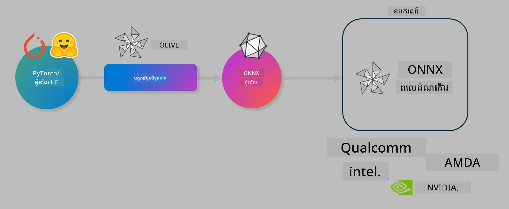

# ប랫폼។ បង្កើនប្រសិទ្ធភាពម៉ូដែល AI សម្រាប់ការបកប្រែប្រតិបត្តិការលើឧបករណ៍

## ការណែនាំ 

> [!IMPORTANT]
> បោលនេះត្រូវការកាត<em>GPU Nvidia A10 ឬ A100</em> ជាមួយឧបករណ៍បើកដំណើរការ និងកញ្ចប់​CUDA(toolkit) កំណែ 12+ ដាក់តម្លើងរួច។

> [!NOTE]
> នេះគឺជាបោលប្រហែល **35 នាទី** ដែលនឹងផ្តល់ជូនអ្នកនូវការណែនាំអំពីគំនិតស្នូលនៃការកែលម្អម៉ូដែលសម្រាប់ការបកប្រែលើឧបករណ៍ដោយប្រើ OLIVE។

## គោលបំណងសិក្សា

នៅចុងបោលនេះ អ្នកនឹងអាចប្រើ OLIVE ដើម្បី៖

- កំណត់តម្លៃមានភាពតូចបំផុត (Quantize) ម៉ូដែល AI ដោយប្រើវិធីគណនា AWQ។
- តម្រឹមម៉ូដែល AI សម្រាប់ភារកិច្ចជាក់លាក់មួយ។
- បង្កើតឧបករណ៍ LoRA adapters (ម៉ូដែលបានតម្រឹម) សម្រាប់ការបកប្រែប្រតិបត្តិការនៅលើឧបករណ៍ដោយប្រើ ONNX Runtime។

### តើ Olive ជាអ្វី

Olive (*O*NNX *live*) គឺជាកញ្ចប់បង្កើនប្រសិទ្ធភាពម៉ូដែលជាមួយ CLI ផ្គុំនេះដែលអនុញ្ញាតឱ្យអ្នកដឹកនាំម៉ូដែលសម្រាប់ ONNX runtime +++https://onnxruntime.ai+++ ជាមួយគុណភាព និងកម្រិតអនុវត្តន៍។



វិនិយោគទៅ Olive ជាទូទៅគឺជាម៉ូដែល PyTorch ឬ Hugging Face ហើយផលប័ត្រគឺម៉ូដែល ONNX ដែលបានបង្កើនប្រសិទ្ធភាពហើយអាចដំណើរការបានលើឧបករណ៍ (គោលដៅដាក់បង្ហោះ) រត់ ONNX runtime។ Olive នឹងបង្កើនប្រសិទ្ធភាពម៉ូដែលសម្រាប់ឧបករណ៍ដ៏មានឥទ្ធិពល AI របស់គោលដៅ (NPU, GPU, CPU) ដែលផ្តល់ដោយអ្នកផ្គត់ផ្គង់ឧបករណ៍ hardware ដូចជា Qualcomm, AMD, Nvidia ឬ Intel។

Olive ដំណើរការតាម *workflow* ដែលជាដំណើរការដោយតម្រៀបតាមលំដាប់នៃកិច្ចការកែលម្អម៉ូដែលផ្នែកតូចដែលហៅថា *passes* - ឧទាហរណ៍មួយចំនួននៃ passes រួមមាន៖ ការបង្ហក់ម៉ូដែល, ការគ្រប់គ្រងក្រាហ្វ, កំណត់តម្លៃ, កែលម្អក្រាហ្វ។ ប្រភេទ passes នីមួយៗមានផ្នែកប៉ារ៉ាម៉ែត្រ ដែលអាចតម្រូវបានដើម្បីសម្រួលឱ្យមានស្ថិតិល្អបំផុត ដូចជា độ chính xác និង ស្រួលប្រតិបត្តិការ ដែលត្រូវបានវាយតំលៃដោយអ្នកវាយតម្លៃសមរម្យ។ Olive ប្រើយុទ្ធសាស្ត្រស្វែងរក ដែលប្រើអាល់ហ្គរីធម៍ស្វែងរក ដើម្បីជំនួយស្វ័យប្រវត្តិតម្រឹម passes ពីមួយទៅមួយ ឬចំណាត់ passes ជាក្រុម។

#### អត្ថប្រយោជន៍នៃ Olive

- **កាត់បន្ថយភាពស្ទាក់ស្ទើរ និងពេលវេលា** នៃការប្រ���មម្នាក់ទៅលើការប្រលែងពិចារណាចំរូងចំរាសជាមួយបច្ចេកទេសផ្សេងៗសម្រាប់ការកែលម្អក្រាហ្វ, បង្ហក់ និង កំណត់តម្លៃ។ កំណត់កម្រិតគុណភាព និងប្រសិទ្ធភាពរបស់អ្នក ហើយឲ្យ Olive រកម៉ូដែលល្អបំផុតសម្រាប់អ្នកដោយស្វ័យប្រវត្តិ។
- **មានសមាសធាតុបង្កើនប្រសិទ្ធភាពម៉ូដែលជាង 40+** ដែលគ្របដណ្តប់បច្ចេកវិទ្យាចុងក្រោយក្នុងការបក្សាគុណភាព, បង្ហក់, កែលម្អក្រាហ្វ និងការតម្រឹម។
- **CLI ងាយស្រួលប្រើ** សម្រាប់កិច្ចការកែលម្អម៉ូដែលធម្មតា។ ឧទាហរណ៍, olive quantize, olive auto-opt, olive finetune។
- ការវេចខ្ចប់ម៉ូដែល និងការដាក់បង្ហោះរួមបញ្ចូល។
- គាំទ្រការបង្កើតម៉ូដែលសម្រាប់ **Multi LoRA serving**។
- ការបង្កើត workflow ដោយប្រើ YAML/JSON ដើម្បីរៀបចំកិច្ចការកែលម្អម៉ូដែល និងការដាក់បង្ហោះ។
- បញ្ចូលកូដជាមួយ **Hugging Face** និង **Azure AI**។
- វិធានការបញ្ចូល **caching** ដើម្បីរក្សាតម្លៃកម្រៃ។

## សេចក្ដីណែនាំបោល
> [!NOTE]
> សូមប្រាកដថាអ្នកបានបង្កើត Azure AI Hub និង Project របស់អ្នក និងតម្រូវការគណនាឧបករណ៍របស់ A100 តាមបែបបទ Lab 1។

### ជំហាន 0: ការតភ្ជាប់ទៅកាន់ Azure AI Compute របស់អ្នក

អ្នកនឹងតភ្ជាប់ទៅកាន់ Azure AI compute ដោយប្រើមុខងារ remote ក្នុង **VS Code**។

1. បើកកម្មវិធី ডেস্কតូប **VS Code** របស់អ្នក៖
1. បើក **command palette** ដោយប្រើ **Shift+Ctrl+P**
1. ក្នុង command palette ស្វែងរក **AzureML - remote: Connect to compute instance in New Window**។
1. អនុវត្តតាមការណែនាំ​លើអេក្រង់ ដើម្បីតភ្ជាប់ទៅកាន់ Compute។ នេះ នឹងរួមបញ្ចូលការជ្រើសរើស Subscription Azure, Resource Group, Project និង Compute name ដែលអ្នកបានកំណត់ក្នុង Lab 1។
1. បន្ទាប់ពីអ្នកបានតភ្ជាប់ទៅកាន់ Azure ML Compute node នេះ នឹងបង្ហាញនៅផ្នែកខាងក្រោម​ខាងឆ្វេងនៃ Visual Code `><Azure ML: Compute Name`

### ជំហាន 1: ចម្លង repo នេះ

នៅក្នុង VS Code អ្នកអាចបើក terminal ថ្មីដោយ **Ctrl+J** ហើយចម្លង repo នេះ ៖

ក្នុង terminal អ្នកគួរតែឃើញ prompt

```
azureuser@computername:~/cloudfiles/code$ 
```
ចម្លងដំណោះស្រាយ

```bash
cd ~/localfiles
git clone https://github.com/microsoft/phi-3cookbook.git
```

### ជំហាន 2: បើក Folder ក្នុង VS Code

ដើម្បីបើក VS Code នៅក្នុងថតដែលពាក់ព័ន្ធ អនុវត្តបញ្ជាចុះខាងលើ terminal ដែលនឹងបើកបង្អួចថ្មី ៖

```bash
code phi-3cookbook/code/04.Finetuning/Olive-lab
```

ជាជម្រើសផ្សេង អ្នកអាចបើកថតដោយជ្រើស **File** > **Open Folder**។

### ជំហាន 3: Dependencies

បើកប្រអប់ terminal ក្នុង VS Code នៅលើ Azure AI Compute Instance របស់អ្នក (ដំណឹង៖ **Ctrl+J**) ហើយអនុវត្តបញ្ជាខាងក្រោមដើម្បីដំឡើង dependencies៖

```bash
conda create -n olive-ai python=3.11 -y
conda activate olive-ai
pip install -r requirements.txt
az extension remove -n azure-cli-ml
az extension add -n ml
```

> [!NOTE]
> វានឹងចំណាយប្រហែល ~5 នាទីដើម្បីដំឡើង dependencies ទាំងអស់។

នៅក្នុងបោលនេះ អ្នកនឹងទាញយក និងផ្ទុកម៉ូដែលទៅក្នុងកាតាឡុកម៉ូដែល Azure AI។ ដើម្បីចូលប្រើកាតាឡុកម៉ូដែល អ្នកត្រូវតែចូលប្រើ Azure ដោយប្រើៈ

```bash
az login
```

> [!NOTE]
> នៅពេលចូល ប្រើ អ្នកនឹងត្រូវបានស្នើឱ្យជ្រើស Subscription។ សូមប្រាកដថាអ្នកបានកំណត់ subscription ជាការផ្ដល់សម្រាប់បោលនេះ។

### ជំហាន 4: អនុវត្តបញ្ជា Olive

បើកប្រអប់ terminal នៅក្នុង VS Code នៅលើ Azure AI Compute Instance របស់អ្នក (ដំណឹង៖ **Ctrl+J**) ហើយប្រាកដថាគណនី conda `olive-ai` បានដំណើរការ៖

```bash
conda activate olive-ai
```

បន្ទាប់មក អនុវត្តបញ្ជា Olive ខាងក្រោមនៅក្នុងបន្ទាត់ពាក្យបញ្ជា។

1. **ពិនិត្យទិន្នន័យ៖** ក្នុងឧទាហរណ៍នេះ អ្នកនឹងតម្រឹមម៉ូdel Phi-3.5-Mini ដើម្បីឲ្យវាជាពិសេសក្នុងការឆ្លើយសំណួរដែលទាក់ទងទៅនឹងការធ្វើដំណើរ។ កូដខាងក្រោមបង្ហាញកំណត់ត្រាចាប់ពីចំណុចដំបូងនៃទិន្នន័យ ដែលមានទ្រង់ទ្រាយ JSON lines៖

    ```bash
    head data/data_sample_travel.jsonl
    ```
1. **Quantize ម៉ូដែល៖** មុនពេលបណ្តុះបណ្តាលម៉ូដែល អ្នកបញ្ជា quantize ជាមួយបញ្ជាដូចខាងក្រោម ដែលប្រើបច្ចេកទេសហៅថា Active Aware Quantization (AWQ) +++https://arxiv.org/abs/2306.00978+++. AWQ quantize បិសាចម៉ូដែលដោយគិតគូរអំពីសកម្មភាពដែលបង្កើតឡើងក្នុងពេលប្រតិបត្តិការ។ នេះមានន័យថា กระบวนการកំណត់តម្លៃនិយមយកទិន្នន័យពិតប្រាកដនៅក្នុងសកម្មភាពគិតគូរ ដែលនាំឲ្យរក្សាទុក độ chính xác ម៉ូដែលបានល្អជាងវិធីការកំណត់តម្លៃបិសាចជាប្រពៃណី។

    ```bash
    olive quantize \
       --model_name_or_path microsoft/Phi-3.5-mini-instruct \
       --trust_remote_code \
       --algorithm awq \
       --output_path models/phi/awq \
       --log_level 1
    ```
   
    វាចំណាយ **ប្រហែល 8 នាទី** ដើម្បីបញ្ចប់ការកំណត់តម្លៃ AWQ ដែលនឹង **កាត់បន្ថយទំហំម៉ូដែលពី ~7.5GB ទៅ ~2.5GB**។

    ក្នុងបោលនេះ យើងបង្ហាញអ្នកពីរបៀបបញ្ចូលម៉ូដែលពី Hugging Face (ឧទាហរណ៍: `microsoft/Phi-3.5-mini-instruct`)។ ទោះជាយ៉ាងណា Olive ក៏អនុញ្ញាតឱ្យអ្នកបញ្ចូលម៉ូដែលពីកាតាឡុក Azure AI ដោយបន្ថែម argument `model_name_or_path` ទៅជាអត្តសញ្ញាណ Azure AI asset (ឧទាហរណ៍: `azureml://registries/azureml/models/Phi-3.5-mini-instruct/versions/4`) ។

1. **បណ្តុះបណ្តាលម៉ូដែល៖** បន្ទាប់មក បញ្ជា `olive finetune` ត្រូវបានប្រើសម្រាប់តម្រឹមម៉ូដែលដែលបានកំណត់តម្លៃ។ ការកំណត់តម្លៃមុនការបណ្តុះបណ្តាលជាការសម្រួលល្អជាងបន្ទាប់ពីការបណ្តុះបណ្តាល ពីព្រោះដំណើរការបណ្តុះបណ្តាលបង្ហាញវិធីសម្រាប់ស្តារម៉ូដែលពីការបាត់បង់ដែលបណ្តាលមកពី quantization។

    ```bash
    olive finetune \
        --method lora \
        --model_name_or_path models/phi/awq \
        --data_files "data/data_sample_travel.jsonl" \
        --data_name "json" \
        --text_template "<|user|>\n{prompt}<|end|>\n<|assistant|>\n{response}<|end|>" \
        --max_steps 100 \
        --output_path ./models/phi/ft \
        --log_level 1
    ```
    
    វាចំណាយ **ប្រហែល 6 នាទី** ដើម្បីបញ្ចប់ការបណ្តុះបណ្តាល (ជាមួយជំហាន 100)។

1. **បង្កើនប្រសិទ្ធភាព៖** ជាមួយម៉ូដែលបានបណ្តុះបណ្តាល អ្នកឥឡូវនេះអាចបង្កើនប្រសិទ្ធភាពម៉ូដែលដោយប្រើបញ្ជា `auto-opt` នៃ Olive ដែលនឹងចាប់យកក្រាហ្វ ONNX ហើយដោយស្វ័យប្រវត្តិបង្ហាញកម្រិតកែលម្អឲ្យម៉ូដែលប្រសើរឡើងសម្រាប់ CPU ដោយបង្ហក់ម៉ូដែល និងធ្វើ fusion។ គួរបញ្ជាក់ថា អ្នកក៏អាចបង្កើនប្រសិទ្ធភាពសម្រាប់ឧបករណ៍ផ្សេងដូចជា NPU ឬ GPU ដោយផ្លាស់ប្តូរអារម្មណ៍ `--device` និង `--provider` តែសម្រាប់បោលនេះ យើងនឹងប្រើ CPU។

    ```bash
    olive auto-opt \
       --model_name_or_path models/phi/ft/model \
       --adapter_path models/phi/ft/adapter \
       --device cpu \
       --provider CPUExecutionProvider \
       --use_ort_genai \
       --output_path models/phi/onnx-ao \
       --log_level 1
    ```
   
    វាចំណាយ **ប្រហែល 5 នាទី** ដើម្បីបញ្ចប់ការបង្កើនប្រសិទ្ធភាព។

### ជំហាន 5: ការបង្ហាញលទ្ធផល inferencing រហ័ស

ដើម្បីសាកល្បងការបង្ហាញលទ្ធផលម៉ូដែល បង្កើតឯកសារ Python មួយក្នុងថតរបស់អ្នកដែលមានឈ្មោះ **app.py** ហើយចម្លង-បិទបិទកូដខាងក្រោម៖

```python
import onnxruntime_genai as og
import numpy as np

print("loading model and adapters...", end="", flush=True)
model = og.Model("models/phi/onnx-ao/model")
adapters = og.Adapters(model)
adapters.load("models/phi/onnx-ao/model/adapter_weights.onnx_adapter", "travel")
print("DONE!")

tokenizer = og.Tokenizer(model)
tokenizer_stream = tokenizer.create_stream()

params = og.GeneratorParams(model)
params.set_search_options(max_length=100, past_present_share_buffer=False)
user_input = "what is the best thing to see in chicago"
params.input_ids = tokenizer.encode(f"<|user|>\n{user_input}<|end|>\n<|assistant|>\n")

generator = og.Generator(model, params)

generator.set_active_adapter(adapters, "travel")

print(f"{user_input}")

while not generator.is_done():
    generator.compute_logits()
    generator.generate_next_token()

    new_token = generator.get_next_tokens()[0]
    print(tokenizer_stream.decode(new_token), end='', flush=True)

print("\n")
```

អនុវត្តកូដដោយប្រើ៖

```bash
python app.py
```

### ជំហាន 6: ផ្ទុកម៉ូដែលទៅ Azure AI

ការផ្ទុកម៉ូដែលទៅក្នុងគ្រឿងបន្លាស់ម៉ូដែល Azure AI អនុញ្ញាតឲ្យម៉ូដែលអាចចែករំលែកជាមួយសមាជិកក្រុមអភិវឌ្ឍរបស់អ្នក ហើយក៏គ្រប់គ្រងការតំរូវកំណែម៉ូដែលផងដែរ។ ដើម្បីផ្ទុកម៉ូដែល អ្នកអាចដំណើរការបញ្ជាលើកក្រោម៖

> [!NOTE]
> ថែមជាមិនភ្លេចបំពេញ `{}` ជាមួយឈ្មោះ Resource Group របស់អ្នក និងឈ្មោះ Azure AI Project។

ដើម្បីស្វែងរក Resource Group `"resourceGroup"` និងឈ្មោះ Azure AI Project របស់អ្នក អ្នកអាចដំណើរការបញ្ជាខាងក្រោម៖

```
az ml workspace show
```

ឬដោយចូលទៅ +++ai.azure.com+++ ហើយជ្រើស **management center** **project** **overview**

បំពេញ `{}` ជាមួយឈ្មោះ Resource Group និង Azure AI Project Name របស់អ្នក។

```bash
az ml model create \
    --name ft-for-travel \
    --version 1 \
    --path ./models/phi/onnx-ao \
    --resource-group {RESOURCE_GROUP_NAME} \
    --workspace-name {PROJECT_NAME}
```
 អ្នកអាចមើលម៉ូដែលដែលបានផ្ទុករួចហើយ និងដាក់បង្ហោះម៉ូដែលរបស់អ្នកនៅ https://ml.azure.com/model/list

---

<!-- CO-OP TRANSLATOR DISCLAIMER START -->
**ការបដិសេធ**៖  
ឯកសារនេះត្រូវបានបកប្រែដោយប្រើសេវាកម្មបកប្រែ AI [Co-op Translator](https://github.com/Azure/co-op-translator)។ ទោះយើងខិតខំសំរេចភាពត្រឹមត្រូវ ក៏សូមជ្រាបថាការបកប្រែដោយស្វ័យប្រវត្តិនេះអាចមានកំហុសឬមិនត្រឹមត្រូវ។ ឯកសារដើមក្នុងភាសាទីតាំងរបស់វាគួរត្រូវបានគិតថាជាមូលដ្ឋានត្រឹមត្រូវ។ សម្រាប់ព័ត៌មានសំខាន់ៗ អ្នកគួរតែប្រើការបកប្រែដោយមនុស្សអ្នកជំនាញ។ យើងមិនទទួលខុសត្រូវចំពោះការយល់ច្រឡំ ឬការបកព្រាងខុសពីការប្រើប្រាស់ការបកប្រែនេះទេ។
<!-- CO-OP TRANSLATOR DISCLAIMER END -->