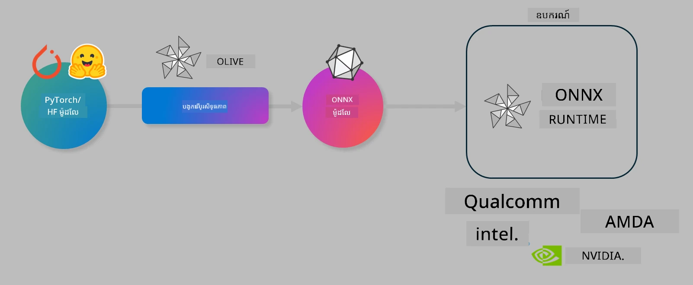

# ប្រព្រឹត្តិការណ៍។ បង្កើតគំរូ AI អោយមានប្រសិទ្ធភាពសម្រាប់ការវិភាគនៅលើឧបករណ៍

## ការណែនាំ

> [!IMPORTANT]
> ប្រព្រឹត្តិការណ៍នេះត្រូវការកាតាគ្រប់គ្រងរបស់ **Nvidia A10 ឬ A100 GPU** រួមជាមួយកម្មវិធីបើកបរ និងឧបករណ៍ CUDA toolkit (កំណើត 12+) ដែលបានដំឡើង។

> [!NOTE]
> នេះគឺជាប្រព្រឹត្តិការណ៍បណ្ដុះបណ្ដាលរយៈពេល **35 នាទី** ដែលនឹងផ្តល់ឱ្យអ្នកនូវការណែនាំដោយដៃលើគំនិតមូលដ្ឋាននៃការបង្កើតគំរូអោយមានប្រសិទ្ធភាពសម្រាប់ការវិភាគនៅលើឧបករណ៍ដោយប្រើ OLIVE។

## គោលដៅសិក្សា

នៅចុងបញ្ចប់នៃប្រព្រឹត្តិការណ៍នេះ អ្នកនឹងអាចប្រើ OLIVE ដើម្បី៖

- បំលែងគំរូ AI ដោយប្រើវិធីសាស្ត្របំលែង AWQ។
- បង្រៀនបន្តគំរូ AI សម្រាប់ភារកិច្ចជាក់លាក់មួយ។
- បង្កើតម៉ូឌុល LoRA (គំរូដែលបានបង្រៀនបន្ត) សម្រាប់ការវិភាគប្រសិទ្ធិភាពលើឧបករណ៍នៅលើ ONNX Runtime។

### តើ Olive ជាអ្វី?

Olive (*O*NNX *live*) គឺជាឧបករណ៍បង្កើតគំរូអោយមានប្រសិទ្ធភាព ដែលមាន CLI ត្រូវបានភ្ជាប់ជាមួយដែលអនុញ្ញាតឱ្យអ្នកផ្ញើគំរូសម្រាប់ ONNX runtime +++https://onnxruntime.ai+++ ជាមួយគុណភាព និងប្រសិទ្ធិភាព។



ទិន្ន័យបញ្ចូលទៅ Olive ជាទូទៅគឺជា គំរូ PyTorch ឬ Hugging Face ហើយផលបញ្ជា​នឹងគឺជា​គំរូ ONNX ដែលបានបង្កើតអោយប្រសិទ្ធិភាព ហើយដំណើរការលើឧបករណ៍មួយ (គោលដៅប្រើប្រាស់) ដែលដំណើរការជាមួយ ONNX runtime។ Olive នឹងបង្កើតគំរូឱ្យមានប្រសិទ្ធភាពសម្រាប់មេកានិចសំអាង AI (NPU, GPU, CPU) របស់គោលដៅប្រើប្រាស់ដែលផ្តល់ដោយអ្នកផលិតឧបករណ៍ដូចជា Qualcomm, AMD, Nvidia ឬ Intel។

Olive ដំណើរការ *workflow* ដែលជាលំដាប់ដំណើរការដែលរៀបចំជាលំដាប់នៃភារកិច្ចបង្កើតគំរូដែលហៅថា *passes* - ឧទាហរណ៍ passes មានដូចជា៖ ការបង្ហាប់គំរូ, ការចាប់ក្របខ័ណ្ឌ, ការបំលែង, ការបង្កើតគំរូ graph ។ ពីព្រោះpasses នីមួយមានប៉ារ៉ាម៉ែត្រ ដែលអាចកំណត់ឡើងវិញបានដើម្បីទទួលបានលទ្ធផលល្អបំផុត ឧទាហរណ៍ គឺភាពត្រឹមត្រូវ និងពេលវេលាឆាប់រហ័ស ដែលត្រូវបានវាយតម្លៃដោយអ្នកវាយតម្លៃនោះ។ Olive ប្រើយុទ្ធសាស្ត្រស្វែងរកដែលប្រើលក្ខណៈស្វែងរកដើម្បីកំណត់ឡើងវិញជាដំណាក់កាលនីមួយៗ ឬក៏ជាក្រុម passes។

#### ប្រយោជន៍របស់ Olive

- **បន្ថយការរំខាននិងពេលវេលា** ក្នុងការប្រើប្រាស់វិធីសាស្ត្រជាក់លាក់សម្រាប់ការបង្កើតគំរូដូចជា ការបង្ហាប់ គំរូ graph និងបំលែង។ កំណត់បរិមាណគុណភាព និងប្រសិទ្ធភាព រួចឱ្យ Olive រកមើលគំរូល្អបំផុតស្វ័យប្រវត្តិ។
- **កម្មវិធីបង្កើតគំរូជាង 40+** ដែលគ្របដណ្តប់បច្ចេកទេសទាន់សម័យក្នុងការបំលែង ការបង្ហាប់ ការបង្កើតគំរូ graph និងការបង្រៀនបន្ត។
- **CLI ដែលងាយស្រួលប្រើ** សម្រាប់ភារកិច្ចបង្កើតគំរូទូទៅ។ ឧទាហរណ៍ olive quantize, olive auto-opt, olive finetune។
- កាំបិតបញ្ចប់និងដំឡើងដែលបានរួមបញ្ចូល។
- គាំទ្រ​ការបង្កើតគំរូ​សម្រាប់ **Multi LoRA serving**។
- បង្កើត workflow ដោយប្រើ YAML/JSON ដើម្បីដឹកនាំការបង្កើតគំរូ និងភារកិច្ច deployment។
- **បញ្ចូលជាមួយ Hugging Face** និង **Azure AI**។
- វិធីសាស្ត្រកាន់តែប្រសើរពីរួមបញ្ចូល **caching** ដើម្បី **រក្សាទុកការចំណាយ**។

## សេចក្តីណែនាំប្រព្រឹត្តិការណ៍
> [!NOTE]
> សូមប្រាកដថាអ្នកបានបង្កើត Azure AI Hub និង Project រួចហើយ និងបានដំឡើង A100 compute តាមដាននៅ Lab 1។

### ជំហាន 0: ភ្ជាប់ទៅកាន់ Azure AI Compute របស់អ្នក

អ្នកនឹងភ្ជាប់ទៅកាន់ Azure AI compute ដោយប្រើមុខងារ remote នៅក្នុង **VS Code**។

1. បើកកម្មវិធី **VS Code** របស់អ្នក៖
1. បើក **command palette** ដោយចុច **Shift+Ctrl+P**
1. ស្វែងរកក្នុង command palette សម្រាប់ **AzureML - remote: Connect to compute instance in New Window**។
1. អនុវត្តតាមសេចក្តីណែនាំលើអេក្រង់ដើម្បីភ្ជាប់ទៅកាន់ Compute។ នេះត្រូវការជ្រើសរើស Azure Subscription, Resource Group, Project និងឈ្មោះ Compute ដែលអ្នកបានកំណត់នៅ Lab 1។
1. ពេលដែលអ្នកភ្ជាប់ទៅកាន់ Azure ML Compute node រួច នេះនឹងបង្ហាញនៅ **ជើងខាងក្រោមឆ្វេងនៃ Visual Code** `><Azure ML: Compute Name`

### ជំហាន 1: Clone repo នេះ

នៅក្នុង VS Code អ្នកអាចបើក terminal ថ្មីដោយចុច **Ctrl+J** ហើយ clone repo នេះ៖

ក្នុង terminal អ្នកគួរតែបង្ហាញ prompt

```
azureuser@computername:~/cloudfiles/code$ 
```
Clone the solution 

```bash
cd ~/localfiles
git clone https://github.com/microsoft/phi-3cookbook.git
```

### ជំហាន 2: បើកថតក្នុង VS Code

ដើម្បីបើក VS Code នៅក្នុងថតដែលពាក់ព័ន្ធ អនុវត្តពាក្យបញ្ជារខាងក្រោមក្នុង terminal ដើម្បីបើកជាបង្អួចថ្មី៖

```bash
code phi-3cookbook/code/04.Finetuning/Olive-lab
```

ផ្សេងទៀត អ្នកអាចបើកថតដោយជ្រើសរើស **File** > **Open Folder**។

### ជំហាន 3: គ្រឿងផ្សំឧបករណ៍

បើកបង្អួច terminal នៅក្នុង VS Code ក្នុង Azure AI Compute Instance របស់អ្នក (ធ្វើដោយចុច **Ctrl+J**) ហើយអនុវត្តពាក្យបញ្ជាខាងក្រោមដើម្បីដំឡើងគ្រឿងផ្សំ៖

```bash
conda create -n olive-ai python=3.11 -y
conda activate olive-ai
pip install -r requirements.txt
az extension remove -n azure-cli-ml
az extension add -n ml
```

> [!NOTE]
> វានឹងចំណាយប្រមាណ ~5 នាទី ដើម្បីដំឡើងគ្រឿងផ្សំទាំងអស់។

ក្នុងប្រព្រឹត្តិការណ៍នេះ អ្នកនឹងទាញយក និងផ្ទុកគំរូទៅកាន់បណ្ណាល័យគំរូ Azure AI។ ដើម្បីអាចចូលប្រើបណ្ណាល័យគំរូ អ្នកត្រូវតែចូលទៅ Azure ដោយប្រើៈ

```bash
az login
```

> [!NOTE]
> នៅពេលចូលគណនី អ្នកនឹងត្រូវតែមើលជ្រើសរើស subscription របស់អ្នក។ សូមប្រាកដថាអ្នកបានកំណត់ subscription ទៅកាន់ subscription ដែលបានផ្តល់សម្រាប់ប្រព្រឹត្តិការណ៍នេះ។

### ជំហាន 4: ប្រតិបត្ដិបញ្ជា Olive 

បើកបង្អួច terminal នៅក្នុង VS Code ក្នុង Azure AI Compute Instance របស់អ្នក (ធ្វើដោយចុច **Ctrl+J**) ហើយប្រាកដថា `olive-ai` conda environment ត្រូវបានបើកដំណើរការ៖

```bash
conda activate olive-ai
```

បន្ទាប់មក អនុវត្តបញ្ជា Olive ខាងក្រោមនៅក្នុងបន្ទាត់បញ្ជា។

1. **ពិនិត្យទិន្នន័យ៖** ក្នុងឧទាហរណ៍នេះ អ្នកនឹងត្រូវបង្រៀនបន្តគំរូ Phi-3.5-Mini ដើម្បីឱ្យវាស្គាល់ចម្លើយសំណួរទាក់ទងនឹងការធ្វើដំណើរ។ គុណភាពកូដខាងក្រោមបង្ហាញកំណត់ត្រាចាប់ផ្តើមនៃ dataset ដែលមានរបៀប JSON lines៖
   
    ```bash
    head data/data_sample_travel.jsonl
    ```
1. **បំលែងគំរូ៖** មុនបណ្តុះបណ្តាលគំរូ អ្នកត្រូវបំលែងវាជាមុនជាមួយពាក្យបញ្ជាខាងក្រោម ដែលប្រើបច្ចេកទេសមួយហៅថា Active Aware Quantization (AWQ) +++https://arxiv.org/abs/2306.00978+++. AWQ បំលែងទម្ងន់គំរូដោយគិតពីការបញ្ចេញបញ្ចូលនៅលក្ខខណ្ឌអនុវត្តក្នុងខណៈវីធីរៀបចំការវិភាគ។ នេះមានន័យថា ដំណើរការបំលែងគិតពីការបែងចែកទិន្នន័យពិតនៅក្នុងការបញ្ចេញបញ្ចូល ដែលនាំឱ្យមានការការពារភាពត្រឹមត្រូវរបស់គំរូល្អជាងវិធីបំលែងទម្ងន់បែបប្រពៃណី។
    
    ```bash
    olive quantize \
       --model_name_or_path microsoft/Phi-3.5-mini-instruct \
       --trust_remote_code \
       --algorithm awq \
       --output_path models/phi/awq \
       --log_level 1
    ```
    
    វាចំណាយប្រហែល **~8 នាទី** ដើម្បីបញ្ចប់ការបំលែង AWQ ដែលនឹង **បន្ថយទំហំគំរូពី ~7.5GB ទៅ ~2.5GB**។
   
   ក្នុងប្រព្រឹត្តិការណ៍នេះ យើងបង្ហាញអ្នកពីរបៀបបញ្ចូលគំរូពី Hugging Face (ឧទាហរណ៍ៈ `microsoft/Phi-3.5-mini-instruct`)។ ទន្ទឹមទៅវិញ Olive ក៏អនុញ្ញាតអ្នកបញ្ចូលគំរូពីបណ្ណាល័យ Azure AI ដោយធ្វើបច្ចុប្បន្នភាពអាគុយម៉ង់ `model_name_or_path` ទៅ ID របស់អំណាច Azure AI (ឧទាហរណ៍ៈ `azureml://registries/azureml/models/Phi-3.5-mini-instruct/versions/4`)។

1. **បណ្តុះបណ្តាលគំរូ៖** បន្ទាប់មក ពាក្យបញ្ជា `olive finetune` នឹងបង្រៀនបន្តគំរូដែលបានបំលែង។ ការបំលែងគំរូ *មុន* ការបង្រៀនបន្ត ជាទីល្អជាងមកក្រោយដែលធ្វើយ៉ាងហោចណាស់កែលម្អភាពត្រឹមត្រូវ ពីព្រោះដំណើរការបង្រៀនបន្តជួយស្ដារស្តង់ដារសងខាតពីការបំលែង។
    
    ```bash
    olive finetune \
        --method lora \
        --model_name_or_path models/phi/awq \
        --data_files "data/data_sample_travel.jsonl" \
        --data_name "json" \
        --text_template "<|user|>\n{prompt}<|end|>\n<|assistant|>\n{response}<|end|>" \
        --max_steps 100 \
        --output_path ./models/phi/ft \
        --log_level 1
    ```
    
    វាចំណាយប្រមាណ **~6 នាទី** ដើម្បីបញ្ចប់ការបង្រៀនបន្ត (ជាមួយ 100 ជំហាន)។

1. **បង្កើតភាពប្រសើរ៖** ជាមួយគំរូដែលបានបណ្តុះ, អ្នកឥឡូវនេះធ្វើឱ្យគំរូប្រសើរដោយប្រើពាក្យបញ្ជា `auto-opt` របស់ Olive ដែលនឹងចាប់ចង្រ្កានស្រទាប់ ONNX graph ហើយស្វ័យប្រវត្តិក្នុងការធ្វើអោយមានភាពប្រសើរច្រើនសម្រាប់ CPU ដោយបង្ហាប់គំរូ និងរួមបញ្ចូល។ ត្រូវចាំថា អ្នកអាចបង្កើតភាពប្រសើរបានសម្រាប់ឧបករណ៍ផ្សេងទៀតដូចជា NPU ឬ GPU ដោយបញ្ជាក់ `--device` និង `--provider` តែក្នុងប្រព្រឹត្ដិការណ៍នេះ យើងប្រើ CPU។

    ```bash
    olive auto-opt \
       --model_name_or_path models/phi/ft/model \
       --adapter_path models/phi/ft/adapter \
       --device cpu \
       --provider CPUExecutionProvider \
       --use_ort_genai \
       --output_path models/phi/onnx-ao \
       --log_level 1
    ```
    
    វាចំណាយប្រហែល **~5 នាទី** ដើម្បីបញ្ចប់ការបង្កើតភាពប្រសើរ។

### ជំហាន 5: សាកល្បងការវិភាគគំរូយ៉ាងរហ័ស

ដើម្បីសាកល្បងការវិភាគគំរូ សូមបង្កើតឯកសារ Python មួយក្នុងថតរបស់អ្នកឈ្មោះ **app.py** ហើយចម្លង-បិទបិទកូដខាងក្រោម៖

```python
import onnxruntime_genai as og
import numpy as np

print("loading model and adapters...", end="", flush=True)
model = og.Model("models/phi/onnx-ao/model")
adapters = og.Adapters(model)
adapters.load("models/phi/onnx-ao/model/adapter_weights.onnx_adapter", "travel")
print("DONE!")

tokenizer = og.Tokenizer(model)
tokenizer_stream = tokenizer.create_stream()

params = og.GeneratorParams(model)
params.set_search_options(max_length=100, past_present_share_buffer=False)
user_input = "what is the best thing to see in chicago"
params.input_ids = tokenizer.encode(f"<|user|>\n{user_input}<|end|>\n<|assistant|>\n")

generator = og.Generator(model, params)

generator.set_active_adapter(adapters, "travel")

print(f"{user_input}")

while not generator.is_done():
    generator.compute_logits()
    generator.generate_next_token()

    new_token = generator.get_next_tokens()[0]
    print(tokenizer_stream.decode(new_token), end='', flush=True)

print("\n")
```

អនុវត្តកូដដោយប្រើ៖

```bash
python app.py
```

### ជំហាន 6: ផ្ទុកគំរូទៅ Azure AI

ការផ្ទុកគំរូទៅក្នុងបណ្ណាល័យគំរូ Azure AI ធ្វើឱ្យគំរូអាចចែករំលែកជាមួយសមាជិកផ្សេងទៀតនៃក្រុមអភិវឌ្ឍន៍របស់អ្នក និងគ្រប់គ្រងការកំណត់ពាក្យចេញនៃគំរូផងដែរ។ ដើម្បីផ្ទុកគំរូ សូមរត់ពាក្យបញ្ជាខាងក្រោម៖

> [!NOTE]
> ពិនិត្យ និងបំពេញ `{}` ជាមួយឈ្មោះ Resource Group និងឈ្មោះ Azure AI Project របស់អ្នក។

ដើម្បីស្វែងរកឈ្មោះ Resource Group `"resourceGroup"` និងឈ្មោះ Azure AI Project សូមរត់ពាក្យបញ្ជាខាងក្រោម

```
az ml workspace show
```

ឬចូលទៅកាន់ +++ai.azure.com+++ ហើយជ្រើសរើស **management center** **project** **overview**

បំពេញ `{}` ជាមួយឈ្មោះ Resource Group និងឈ្មោះ Azure AI Project របស់អ្នក។

```bash
az ml model create \
    --name ft-for-travel \
    --version 1 \
    --path ./models/phi/onnx-ao \
    --resource-group {RESOURCE_GROUP_NAME} \
    --workspace-name {PROJECT_NAME}
```
 អ្នកអាចមើលគំរូដែលបានផ្ទុករួចហើយ និងដំឡើងគំរូរបស់អ្នកនៅ https://ml.azure.com/model/list

---

<!-- CO-OP TRANSLATOR DISCLAIMER START -->
**ការបដិសេធ**៖  
ឯកសារនេះត្រូវបានបក្សែនដោយប្រើសេវាកម្មបកប្រែ AI [Co-op Translator](https://github.com/Azure/co-op-translator)។ ខណៈពេលយើងខិតខំប្រឹងប្រែងសម្រាប់ភាពត្រឹមត្រូវ សូមយល់ដឹងថាការបកប្រែដោយស្វ័យប្រវត្តិសាច់ខុសឬមានកំហុសបាន។ ឯកសារដើមជាភាសាពុទ្ធបុរាណគួរត្រូវបានចាត់ទុកជាមូលដ្ឋានដែលមានសុពលភាព។ សម្រាប់ព័ត៌មានសំខាន់ៗ សូមណែនាំឲ្យប្រើប្រាស់ការបកប្រែដោយមនុស្សជំនាញ។ យើងមិនទទួលខុសត្រូវចំពោះការយល់ច្រឡំ ឬការបកស្រាយខុសណាមួយដែលកើតមានពីការប្រើប្រាស់ការបកប្រែនេះឡើយ។
<!-- CO-OP TRANSLATOR DISCLAIMER END -->