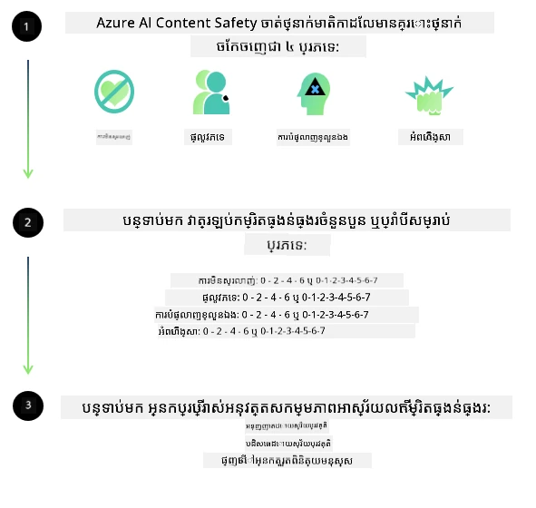
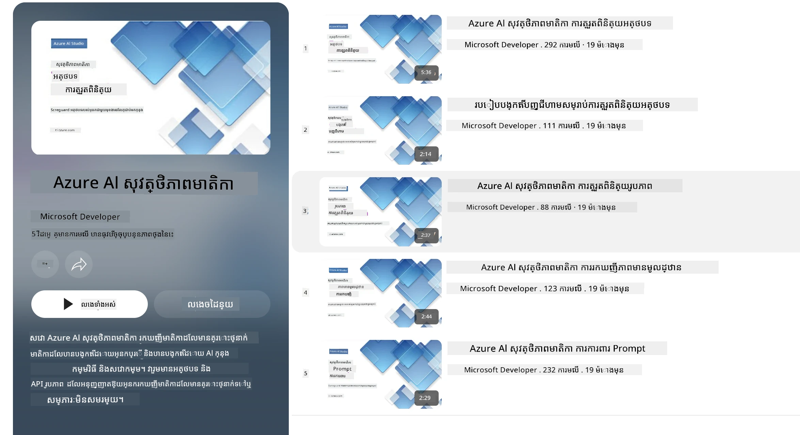

# សុវត្ថិភាព AI សម្រាប់ម៉ូឌែល Phi  
គ្រួសារម៉ូឌែល Phi ត្រូវបានបង្កើតឡើងតាមរយៈការអនុវត្តតាម [ស្តង់ដា AI ដើម្បីទទួលខុសត្រូវរបស់ Microsoft](https://www.microsoft.com/ai/principles-and-approach#responsible-ai-standard) ដែលជាសំណុំនៃការទាមទារសម្រាប់ក្រុមហ៊ុនទាំងមូល ដើមទាំងមានមូលដ្ឋានលើគោលការណ៍ប្រាំមួយដូចខាងក្រោម៖ ការទទួលខុសត្រូវ ការបញ្ចេញច្បាស់លាស់ ខណៈសមភាពភាព ភាពអាចទុកចិត្ត និងសុវត្ថិភាព ភាពឯកជន និងសុវត្ថិភាព និងការរួមបញ្ចូលគ្នា ដែលបង្កើតជាគោលការណ៍ AI ដើម្បីទទួលខុសត្រូវរបស់ [Microsoft](https://www.microsoft.com/ai/responsible-ai)។  

ដូចម៉ូឌែល Phi មុនៗនេះ ការវាយតម្លៃសុវត្ថិភាពច្រើនទិស និងវិធីសាស្ត្រសុវត្ថិភាពបន្ទាប់ពីបណ្តុះបណ្តាលត្រូវបានអនុវត្ត ជាមួយនឹងជំហានបន្ថែមក្នុងការគិតគូរការអាចប្រើប្រាស់ភាសាច្រើនសម្រាប់ការចេញផ្សាយនេះ។ វិធីសាស្ត្ររបស់យើងសម្រាប់ការបណ្តុះបណ្តាលសុវត្ថិភាព និងការវាយតម្លៃរួមមានការធ្វើតេស្ដនៅក្នុងភាសាច្រើន និងប្រភេទហានិភ័យ ត្រូវបានរៀបរាប់ក្នុង [ឯកសារបន្ទាប់ពីបណ្តុះបណ្តាលសុវត្ថិភាព Phi](https://arxiv.org/abs/2407.13833)។ ខណៈដែលម៉ូឌែល Phi ទទួលបានអត្ថប្រយោជន៍ពីវិធីសាស្ត្រនេះ អ្នកអភិវឌ្ឍត្រូវអនុវត្តការអនុវត្ត AI ដើម្បីទទួលខុសត្រូវល្អបំផុត រួមទាំងការតាមដាន ការវាស់វែង និងការកាត់បន្ថយហានិភ័យដែលពាក់ព័ន្ធនឹងករណីប្រើប្រាស់ និងបរិបទវប្បធម៌ និងភាសាដែលព្រះអង្គមាន។

## អនុវត្តន៍ល្អបំផុត  

ដូចម៉ូឌែលផ្សេងៗ ម៉ូឌែលគ្រួសារម៉ូឌែល Phi អាចមានឥរិយាបថដែលមិន​សមតុល្យ មិន​ទុកចិត្ត​បាន ឬ​គួរឱ្យរំខានបាន។  

អ្វីខ្លះជាការអះអាងខ្សោយនៃ SLM និង LLM ដែលអ្នកគួរឲ្យទទួលយករួមមាន៖

- **គុណភាពសេវាកម្ម៖** ម៉ូឌែល Phi ត្រូវបានបណ្តុះបណ្តាលភាគច្រើនលើអត្ថបទភាសាអង់គ្លេស។ ភាសាផ្សេងពីអង់គ្លេសនឹងទទួលការសម្តែងធ្វើការ ឥតប្រសើរជាង។ ភាសា​ផ្សេងៗ១ចំនួននៅក្នុងភាសាអង់គ្លេសដែលមានតំណាងតិចក្នុងទិន្នន័យបណ្តុះបណ្តាលអាចមានការសម្តែងធ្វើការឥតប្រសើរជាងភាសាអង់គ្លេសស្តង់ដារ។
- **ការតំណាងឱ្យការខូចខាត និងការបន្តស្ទេរ៉ូទីប៖** ម៉ូឌែលទាំងនេះអាចតំណាងឬមិនតំណាងជាក្រុមមនុស្សខ្លះផងក៏បាន ជួយលុបបំបាត់ការតំណាងនៃក្រុមខ្លះៗ ឬក៏ពង្រឹងស្ទេរ៉ូទីបដែលមិនល្អ ឬអវិជ្ជមានផងដែរ។ ទោះបីបន្ទាប់ពីការបណ្តុះបណ្តាលសុវត្ថិភាពក៏ដោយ ការរឹតត្បិតនេះអាចនៅតែត្រូវបានរកឃើញដោយសារតំណាងខុសគ្នារបស់ក្រុមផ្សេងៗ ឬភាពរាតត្បាតនៃគំរូស្ទេរ៉ូទីបអវិជ្ជមានក្នុងទិន្នន័យបណ្តុះបណ្តាលដែលបង្ហាញពីលំនាំពិភពលោក និងអមតៈសង្គម។
- **មាតិកាដែលមិនសមរម្យ ឬគួរឱ្យរំខាន៖** ម៉ូឌែលទាំងនេះអាចបង្កើតមាតិកាប្រភេទផ្សេងៗដែលមិនសមរម្យ ឬគួរឱ្យរំខាន ដែលអាចធ្វើឱ្យវាមិនសមរម្យសម្រាប់ការចែកចាយក្នុងបរិបទដែលមានភាពប្រញាប់ប្រញាល់ដោយគ្មានការកាត់បន្ថយបន្ថែមដែលយោងដល់ករណីប្រើប្រាស់។
- **ភាពទុកចិត្តនៃព័ត៌មាន៖** ម៉ូឌែលភាសាអាចបង្កើតមាតិកាដែលមិនមានព្រមល្អឬបោកបញ្ឆោត ហើយជាធម្មតាអាចមានសំឡេងសមរម្យ ប៉ុន្តែមិនត្រឹមត្រូវ ឬចាស់ខ្មាស់។
- **ដែនកំណត់សម្រាប់កូដ៖** ភាគច្រើននៃទិន្នន័យបណ្តុះបណ្តាល Phi-3 មានមូលដ្ឋានលើ Python ហើយប្រើកញ្ចប់ទូទៅដូចជា "typing, math, random, collections, datetime, itertools"។ ប្រសិនបើម៉ូឌែលបង្កើតស្គ្រីប Python ដែលប្រើកញ្ចប់ផ្សេងៗ ឬស្គ្រីបនៅភាសាផ្សេងទៀត យើងណែនាំយ៉ាងខ្លាំងឲ្យអ្នកប្រើប្រាស់ធ្វើការបញ្ជាក់ប្រើប្រាស់ API ទាំងអស់ដោយដៃ។

អ្នកអភិវឌ្ឍត្រូវអនុវត្តអនុវត្តន៍ AI ដើម្បីទទួលខុសត្រូវល្អបំផុត និងមានកាតព្វកិច្ចក្នុងការធានាថាករណីប្រើប្រាស់ជាក់លាក់ស្របតាមច្បាប់ និងបញ្ញត្តិពាក់ព័ន្ធ (ដូចជា ព័ត៌មានឯកជន ពាណិជ្ជកម្ម ល។)។

## ការពិចារណា AI ដើម្បីទទួលខុសត្រូវ

ដូចម៉ូឌែលភាសាផ្សេងៗ គ្រួសារម៉ូឌែល Phi អាចមានឥរិយាបថដែលមិនសមតុល្យ មិនទុកចិត្តបាន ឬគួរឱ្យរំខាន។ អ្វីខ្លះជាការអះអាងខ្សោយដែលគួរប្រុងប្រយ័ត្ន រួមមាន៖

**គុណភាពសេវាកម្ម៖** ម៉ូឌែល Phi ត្រូវបានបណ្តុះបណ្តាលភាគច្រើនលើអត្ថបទភាសាអង់គ្លេស។ ភាសាផ្សេងពីអង់គ្លេសនឹងទទួលការសម្តែងធ្វើការឥតប្រសើរជាង។ ភាសាអង់គ្លេសដែលមានតំណាងតិចក្នុងទិន្នន័យបណ្តុះបណ្តាលអាចមានការសម្តែងធ្វើការឥតប្រសើរជាងភាសាអង់គ្លេសស្តង់ដារ។

**ការតំណាងឱ្យការខូចខាត និងការបន្តស្ទេរ៉ូទីប៖** ម៉ូឌែលទាំងនេះអាចតំណាងឬមិនតំណាងជាក្រុមមនុស្សខ្លះ បានជួយលុបបំបាត់ការតំណាងនៃក្រុមខ្លះៗ ឬក៏ពង្រឹងស្ទេរ៉ូទីបដែលមិនល្អ ឬអវិជ្ជមានផងដែរ។ ទោះបីបន្ទាប់ពីបណ្តុះបណ្តាលសុវត្ថិភាព ការរឹតត្បិតនេះអាចនៅតែមានដោយសារតំណាងខុសគ្នារបស់ក្រុមផ្សេងៗ ឬភាពរាតត្បាតនៃគំរូស្ទេរ៉ូទីបអវិជ្ជមានក្នុងទិន្នន័យបណ្តុះបណ្តាលដែលបង្ហាញពីលំនាំពិភពលោក និងអមតៈសង្គម។

**មាតិកាដែលមិនសមរម្យ ឬគួរឱ្យរំខាន៖** ម៉ូឌែលទាំងនេះអាចបង្កើតមាតិកាប្រភេទផ្សេងៗ ដែលមិនសមរម្យ ឬគួរឱ្យរំខាន ដែលអាចធ្វើឱ្យវាមិនសមរម្យសម្រាប់ការចែកចាយក្នុងបរិបទដែលមានភាពប្រញាប់ប្រញាល់ ដោយគ្មានការកាត់បន្ថយបន្ថែមដែលយោងដល់ករណីប្រើប្រាស់។  
ភាពទុកចិត្តនៃព័ត៌មាន៖ ម៉ូឌែលភាសាអាចបង្កើតមាតិកាដែលមិនមានព្រមល្អឬបោកបញ្ឆោត ហើយជាធម្មតាអាចមានសំឡេងសមរម្យ ប៉ុន្តែមិនត្រឹមត្រូវ ឬចាស់ខ្មាស់។

**ដែនកំណត់សម្រាប់កូដ៖** ភាគច្រើននៃទិន្នន័យបណ្តុះបណ្តាល Phi-3 មានមូលដ្ឋានលើ Python ហើយប្រើកញ្ចប់ទូទៅដូចជា "typing, math, random, collections, datetime, itertools"។ ប្រសិនបើម៉ូឌែលបង្កើតស្គ្រីប Python ដែលប្រើកញ្ចប់ផ្សេងៗ ឬស្គ្រីបនៅភាសាផ្សេងទៀត យើងណែនាំយ៉ាងខ្លាំងឲ្យអ្នកប្រើប្រាស់ធ្វើការបញ្ជាក់ប្រើប្រាស់ API ទាំងអស់ដោយដៃ។

អ្នកអភិវឌ្ឍត្រូវអនុវត្តអនុវត្តន៍ AI ដើម្បីទទួលខុសត្រូវល្អបំផុត និងមានកាតព្វកិច្ចធានាថាករណីប្រើប្រាស់ដែលជាក់លាក់ស្របតាមច្បាប់ និងបញ្ញត្តិពាក់ព័ន្ធ (ដូចជា ព័ត៌មានឯកជន ពាណិជ្ជកម្ម ល។)។ បរិបទសំខាន់សម្រាប់ការពិចារណារួមមាន៖

**ការ​ចាត់ចែង៖** ម៉ូឌែលអាចមិនសមសម្រាប់ឱ្យប្រើនៅក្នុងសេណារីយ៉ូមដែលអាចមានផលប៉ះពាល់ ហើយចងក្រងទៅលើស្ថានភាពផ្នែកច្បាប់ ឬការចាត់ចែងធនធាន ឬឱកាសរស់នៅ (ឧៈ ផ្ទះការស្នាក់នៅ ការងារ ការឧបត្ថម្ភហិរញ្ញវត្ថុ ល។) ដោយគ្មានការវាយតម្លៃបន្ថែម និងបច្ចេកទេសកាត់បន្ថយការរើសអើង។

**សេណារីយ៉ូវហានិភ័យខ្ពស់៖** អ្នកអភិវឌ្ឍត្រូវវាយតម្លៃភាពសមរម្យនៃការប្រើម៉ូឌែលនៅក្នុងសេណារីយ៉ូវហានិភ័យខ្ពស់ ដែលកាលលទ្ធផលដែលមិនសមតុល្យ មិនទុកចិត្តបាន ឬគួរឱ្យរំខាន អាចមានថ្លៃថ្នូរខ្ពស់ ឬនាំអោយមានហានិភ័យ។ រួមមានការផ្តល់អនុសាសន៍នៅក្នុងវិស័យប្រញាប់ប្រញាល់ ឬជំនាញពិសេស ដែលត្រូវការពិចារណាផ្ទាល់ខ្លួន និងភាពទុកចិត្តខ្ពស់ (ឧៈ ឱប្បធម៌ច្បាប់ ឬសុខភាព)។ ត្រូវអនុវត្តការពារបន្ថែមនៅកម្រិតកម្មវិធីយោងតាមបរិបទផ្សព្វផ្សាយ។

**ព័ត៌មានមិនត្រឹមត្រូវ៖** ម៉ូឌែលអាចបង្កើតព័ត៌មានមិនត្រឹមត្រូវ។ អ្នកអភិវឌ្ឍត្រូវអនុវត្តអនុវត្តន៍ប្រកបដោយភាពច្បាស់លាស់ និងជូនដំណឹងអ្នកប្រើប្រាស់ផ្នែកចុងថាពួកគេកំពុងអន្តរកម្មជាមួយប្រព័ន្ធ AI។ នៅកម្រិតកម្មវិធី អ្នកអភិវឌ្ឍអាចបង្កើតយន្តការប្រាប់មតិ និងបណ្តាញដើម្បីដាក់ឲ្យចម្លើយមានមូលដ្ឋានលើព័ត៌មានពិចារណាលក្ខណៈ និងពិភាក្សាករណីប្រើប្រាស់ជាក់លាក់ ដែលជាបច្ចេកទេសគេហៅថា Retrieval Augmented Generation (RAG)។

**ការបង្កើតមាតិកាដែលខូចខាត៖** អ្នកអភិវឌ្ឍត្រូវវាយតម្លៃលទ្ធផលផ្អែកលើបរិបទ និងប្រើថ្នាក់វិភាគសុវត្ថិភាពដែលមាន ឬដំណោះស្រាយផ្ទាល់ខ្លួនសមរម្យសម្រាប់ករណីប្រើប្រាស់របស់ពួកគេ។

**ការប្រើប្រាស់ខុស៖** របៀបប្រើប្រាស់ខុសផ្សេងទៀត ដូចជាការជួញដូរ បញ្ជូនសារមិនបានស្គាល់ ឬការបង្កើតកម្មវិធីមេរោគអាចកើតមានបាន ហើយអ្នកអភិវឌ្ឍត្រូវធានាថាកម្មវិធីរបស់ពួកគេមិនបណ្តាលឲ្យមានការបំពានលើច្បាប់ និងបញ្ញត្តិដែលមានសុពលភាព។

### ការសម្រួលបន្ថែម និងសុវត្ថិភាពមាតិកា AI  

បន្ទាប់ពីការសម្រួលម៉ូឌែល យើងណែនាំយ៉ាងខ្លាំងឲ្យប្រើប្រាស់វិធានការណ៍ [Azure AI Content Safety](https://learn.microsoft.com/azure/ai-services/content-safety/overview) ដើម្បីតាមដានមាតិកាបានបង្កើតឡើងដោយម៉ូឌែល ស្វែងរក និងបដិសេធហានិភ័យ បទបង្ហាប់ និងបញ្ហាគុណភាពដែលអាចកើតមាន។

[Azure AI Content Safety](https://learn.microsoft.com/azure/ai-services/content-safety/overview) គាំទ្រមាតិកាអត្ថបទ និងរូបភាព។ វាអាចត្រូវបានចេញផ្សាយនៅលើពពក កុងទឺន័រ ផ្តាច់ដោយឡែក និងឧបករណ៍នៅគ្រោង/បញ្ចូល។

## ពិពណ៌នាអំពី Azure AI Content Safety  

Azure AI Content Safety មិនមែនជាវិធានការណ៍ស្រាលៗសម្រាប់គ្រប់រូបគ្នាទេ។ វាអាចត្រូវបានប្ដូរតាមបែបបទបញ្ជាក់របស់អាជីវកម្ម។ លើសពីនេះ ម៉ូឌែលភាសាច្រើនរបស់វាធ្វើអោយវាប្រាប់អំពីភាសាច្រើនបាននៅក្នុងពេលតែមួយ។

- **Azure AI Content Safety**  
- **អ្នកអភិវឌ្ឍ Microsoft**  
- **វីដេអូ ៥**

សេវាកម្ម Azure AI Content Safety រកឃើញមាតិកាដែលអ្នកប្រើបង្កើត និង AI បង្កើតដែលមានគ្រោះថ្នាក់ក្នុងកម្មវិធី និងសេវាកម្ម។ វារួមបញ្ចូល API អត្ថបទ និងរូបភាពដែលអនុញ្ញាតឱ្យអ្នករកឃើញសាររបស់មាតិកាដែលគួរឱ្យតុក្កតា ឬមិនសមរម្យ។  

[AI Content Safety Playlist](https://www.youtube.com/playlist?list=PLlrxD0HtieHjaQ9bJjyp1T7FeCbmVcPkQ)

---

<!-- CO-OP TRANSLATOR DISCLAIMER START -->
**ការបដិសេធ**:
ឯកសារនេះត្រូវបានបកប្រែដោយប្រើសេវាបកប្រែ AI [Co-op Translator](https://github.com/Azure/co-op-translator)។ ខណៈពេលដែលយើងខិតខំសម្រាប់ភាពត្រឹមត្រូវ សូមយល់ព្រមថាការបកប្រែដោយស្វ័យប្រវត្តិនេះអាចមានកំហុស ឬភាពមិនត្រឹមត្រូវ។ ឯកសារដើមក្នុងភាសាតិចត្រូវគេបរិច្ឆេទជាមូលដ្ឋានសំខាន់។ សម្រាប់ព័ត៌មានសំខាន់ ការបកប្រែដោយមនុស្សអ្នកជំនាញត្រូវបានផ្តល់អនុសាសន៍។ យើងមិនទទួលខុសត្រូវចំពោះការយល់ច្រឡំ ឬការបកប្រែមិនត្រឹមត្រូវទាំងអស់ដែលកើតមានពីការប្រើប្រាស់បកប្រែនេះទេ។
<!-- CO-OP TRANSLATOR DISCLAIMER END -->