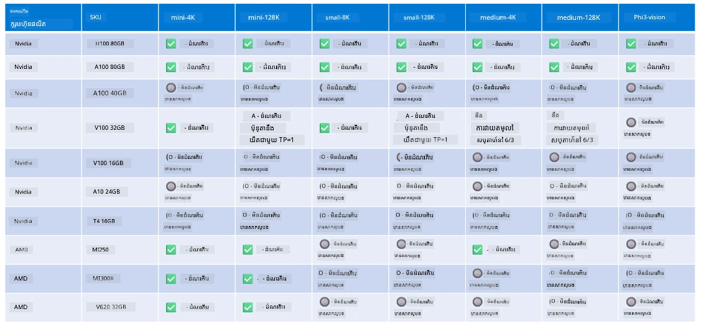

# ការគាំទ្រឧបករណ៍របស់ Phi

Microsoft Phi ត្រូវបានបង្កើតឱ្យមានប្រសិទ្ធភាពសម្រាប់ ONNX Runtime និងគាំទ្រដល់ Windows DirectML។ វាដំណើរការល្អលើឧបករណ៍ជាច្រើនប្រភេទ រួមទាំង GPUs, CPUs និងឧបករណ៍ចល័តផងដែរ។

## ឧបករណ៍ Hardware  
ជាក់លាក់ ជាមួយឧបករណ៍ដែលគាំទ្រមាន៖

- GPU SKU: RTX 4090 (DirectML)  
- GPU SKU: 1 A100 80GB (CUDA)  
- CPU SKU: Standard F64s v2 (64 vCPUs, 128 GiB memory)  

## Mobile SKU

- Android - Samsung Galaxy S21  
- Apple iPhone 14 ឬខ្ពស់ជាងនោះ ជាមួយកម្មវិធីបន្ទុក A16/A17  

## កំណត់បរិមាណឧបករណ៍របស់ Phi

- តំរូវការតំរូវកំណត់អប្បបរមា។  
- Windows: GPU ដែលគាំទ្រ DirectX 12 និង RAM រួមបញ្ចូល 4GB ឱ្យបានតិចបំផុត  

CUDA: NVIDIA GPU ដែលមាន Compute Capability >= 7.02  



## ការរត់ onnxruntime លើ GPUs ច្រើន

ម៉ូដែល Phi ONNX ដែលមានសម្រាប់ពេលនេះ មានសម្រាប់ 1 GPU តែប៉ុណ្ណោះ។ វាអាចគាំទ្រដល់ multi-gpu សម្រាប់ម៉ូដែល Phi ប៉ុន្តែ ORT ជាមួយ 2 gpu មិនទទួលអនាម័យថាវានឹងផ្តល់ throughput ច្រើនជាង 2 instance នៃ ort ទេ។ សូមមើល [ONNX Runtime](https://onnxruntime.ai/) សម្រាប់ព័ត៌មានថ្មីបំផុត។

នៅក្នុង [Build 2024 the GenAI ONNX Team](https://youtu.be/WLW4SE8M9i8?si=EtG04UwDvcjunyfC) បានប្រកាសថាពួកគេបានអនុញ្ញាតឱ្យមាន multi-instance ជំនួស multi-gpu សម្រាប់ម៉ូដែល Phi។  

បច្ចុប្បន្ននេះ អនុញ្ញាតឱ្យអ្នកអាចរត់ onnxruntime ឬ onnxruntime-genai មួយ instance ជាមួយពិភាក្សាអរិយាបថ CUDA_VISIBLE_DEVICES ដូចខាងក្រោមនេះ។

```Python
CUDA_VISIBLE_DEVICES=0 python infer.py
CUDA_VISIBLE_DEVICES=1 python infer.py
```
  
សូមរីករាយក្នុងការស្វែងយល់បន្ថែមអំពី Phi នៅក្នុង [Microsoft Foundry](https://ai.azure.com)

---

<!-- CO-OP TRANSLATOR DISCLAIMER START -->
**ការត្រូវដាក់ចាយ**:  
ឯកសារនេះត្រូវបានបកប្រែដោយប្រើសេវាបកប្រែ AI [Co-op Translator](https://github.com/Azure/co-op-translator)។ ខណៈពេលដែលយើងខិតខំដើម្បីឲ្យមានភាពត្រឹមត្រូវ សូមយល់ថាការបកប្រែក្នុងប្រព័ន្ធអូតូម៉ាទិកអាចមានកំហុស ឬភាពមិនត្រឹមត្រូវខ្លះៗ។ ឯកសារដើមក្នុងភាសាពុំចប់របស់វាគួរត្រូវបានពិចារណា​ជាឯកសារជាធរមាន។ សម្រាប់ព័ត៌មានសំខាន់ៗ សូមណែនាំឲ្យប្រើការបកប្រែដោយមនុស្សជំនាញ។ យើងមិនទទួលខុសត្រូវចំពោះការយល់ច្រឡំ ឬការបកប្រែមិនត្រឹមត្រូវណាមួយដែលបណ្តាលមកពីការប្រើប្រាស់ការបកប្រែនេះឡើយ។
<!-- CO-OP TRANSLATOR DISCLAIMER END -->