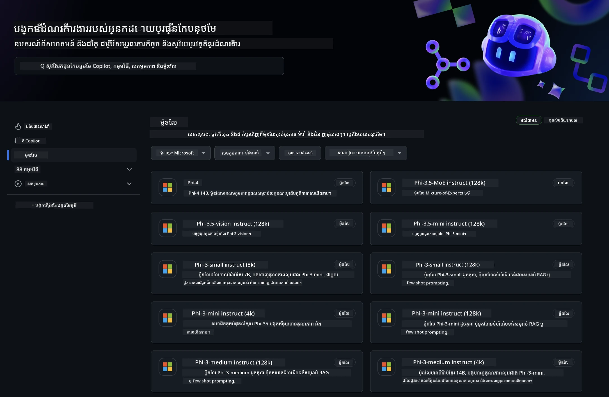
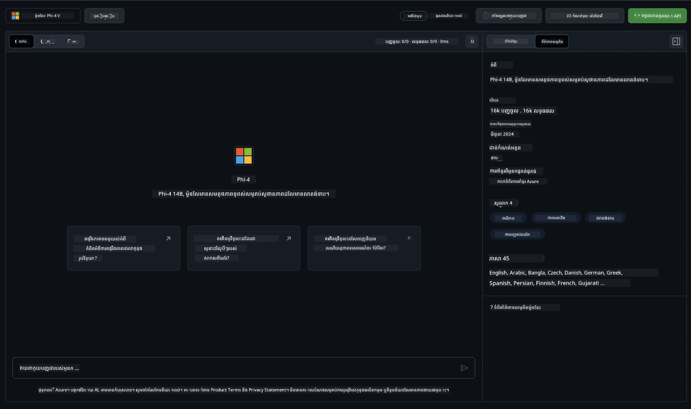
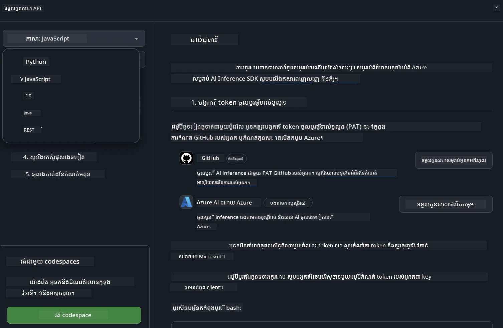
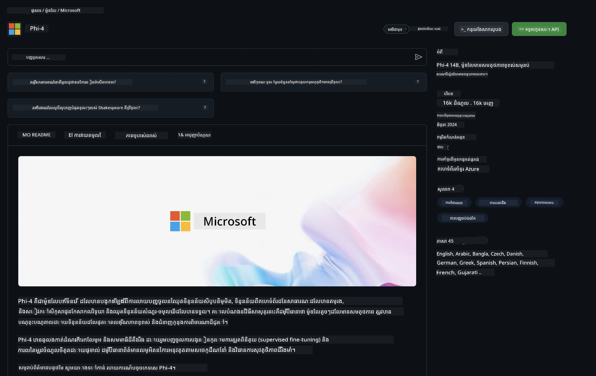

## គ្រួសារ Phi នៅក្នុង GitHub Models

សូមស្វាគមន៍មកកាន់ [GitHub Models](https://github.com/marketplace/models) ! យើងបានរៀបចំរួចរាល់សម្រាប់អ្នកដើម្បីស្វែងយល់អំពីម៉ូឌែល AI ដែលត្រូវបានដាក់ពុំពីលើ Azure AI។



សម្រាប់ព័ត៌មានបន្ថែមអំពីម៉ូឌែលដែលមាននៅលើ GitHub Models សូមពិនិត្យមើល [GitHub Model Marketplace](https://github.com/marketplace/models)

## ម៉ូឌែលដែលមាន

មួយម៉ូឌែលនីមួយៗមានកន្លែងលេង (playground) ផ្ទាល់ខ្លួន និងកូដឧទាហរណ៍



### Phi Family in GitHub Model Catalog

- [Phi-4](https://github.com/marketplace/models/azureml/Phi-4)

- [Phi-3.5-MoE instruct (128k)](https://github.com/marketplace/models/azureml/Phi-3-5-MoE-instruct)

- [Phi-3.5-vision instruct (128k)](https://github.com/marketplace/models/azureml/Phi-3-5-vision-instruct)

- [Phi-3.5-mini instruct (128k)](https://github.com/marketplace/models/azureml/Phi-3-5-mini-instruct)

- [Phi-3-Medium-128k-Instruct](https://github.com/marketplace/models/azureml/Phi-3-medium-128k-instruct)

- [Phi-3-medium-4k-instruct](https://github.com/marketplace/models/azureml/Phi-3-medium-4k-instruct)

- [Phi-3-mini-128k-instruct](https://github.com/marketplace/models/azureml/Phi-3-mini-128k-instruct)

- [Phi-3-mini-4k-instruct](https://github.com/marketplace/models/azureml/Phi-3-mini-4k-instruct)

- [Phi-3-small-128k-instruct](https://github.com/marketplace/models/azureml/Phi-3-small-128k-instruct)

- [Phi-3-small-8k-instruct](https://github.com/marketplace/models/azureml/Phi-3-small-8k-instruct)

## ចាប់ផ្តើម

មានឧទាហរណ៍មូលដ្ឋានមួយចំនួនដែលបានរួចរាល់សម្រាប់អ្នកដើម្បីរត់។ អ្នកអាចរកឃើញពួកវានៅក្នុងថតឧទាហរណ៍ (samples directory)។ ប្រសិនបើអ្នកចង់ទៅត្រង់ភាសាដែលអ្នកចូលចិត្ត អ្នកអាចរកឧទាហរណ៍នៅក្នុងភាសាខាងក្រោម៖

- Python
- JavaScript
- C#
- Java
- cURL

ក៏មានបរិយាកាស Codespaces ផ្ទាល់ខ្លួនសម្រាប់ការរត់ឧទាហរណ៍ និងម៉ូឌែលផងដែរ។




## គូដឧទាហរណ៍

ខាងក្រោមគឺជាឧទាហរណ៍កូដខ្លះៗសម្រាប់ករណីប្រើប្រាស់មួយចំនួន។ សម្រាប់ព័ត៌មានបន្ថែមអំពី Azure AI Inference SDK សូមមើលឯកសារនិងឧទាហរណ៍ពេញលេញ។

## ការរៀបចំ

1. Create a personal access token
You do not need to give any permissions to the token. Note that the token will be sent to a Microsoft service.

To use the code snippets below, create an environment variable to set your token as the key for the client code.

If you're using bash:
```
export GITHUB_TOKEN="<your-github-token-goes-here>"
```
ប្រសិនបើអ្នកកំពុងប្រើ powershell:

```
$Env:GITHUB_TOKEN="<your-github-token-goes-here>"
```

ប្រសិនបើអ្នកកំពុងប្រើ Windows command prompt:

```
set GITHUB_TOKEN=<your-github-token-goes-here>
```

## ឧទាហរណ៍ Python

### ដំឡើងការពឹងផ្អែក
ដំឡើង Azure AI Inference SDK ដោយប្រើ pip (Requires: Python >=3.8):

```
pip install azure-ai-inference
```
### Run a basic code sample

ឧទាហរណ៍នេះបង្ហាញពីការហៅមួយយ៉ាងសាមញ្ញទៅ API សម្រាប់បញ្ចប់ការជជែក (chat completion)។ វាកំពុងប្រើចុងបញ្ចប់ GitHub AI model inference និង token GitHub របស់អ្នក។ ការហៅនេះគឺសម័កខ្លួន (synchronous)។

```python
import os
from azure.ai.inference import ChatCompletionsClient
from azure.ai.inference.models import SystemMessage, UserMessage
from azure.core.credentials import AzureKeyCredential

endpoint = "https://models.inference.ai.azure.com"
model_name = "Phi-4"
token = os.environ["GITHUB_TOKEN"]

client = ChatCompletionsClient(
    endpoint=endpoint,
    credential=AzureKeyCredential(token),
)

response = client.complete(
    messages=[
        UserMessage(content="I have $20,000 in my savings account, where I receive a 4% profit per year and payments twice a year. Can you please tell me how long it will take for me to become a millionaire? Also, can you please explain the math step by step as if you were explaining it to an uneducated person?"),
    ],
    temperature=0.4,
    top_p=1.0,
    max_tokens=2048,
    model=model_name
)

print(response.choices[0].message.content)
```

### Run a multi-turn conversation

ឧទាហរណ៍នេះបង្ហាញពីការសន្ទនាច្រើនជំហានជាមួយ API សម្រាប់បញ្ចប់ការជជែក។ ពេលអ្នកប្រើម៉ូឌែលសម្រាប់កម្មវិធីជជែក អ្នកត្រូវគ្រប់គ្រងប្រវត្តិសន្ទនា​នោះ និងផ្ញើសារថ្មីៗទៅម៉ូឌែល។

```
import os
from azure.ai.inference import ChatCompletionsClient
from azure.ai.inference.models import AssistantMessage, SystemMessage, UserMessage
from azure.core.credentials import AzureKeyCredential

token = os.environ["GITHUB_TOKEN"]
endpoint = "https://models.inference.ai.azure.com"
# Replace Model_Name
model_name = "Phi-4"

client = ChatCompletionsClient(
    endpoint=endpoint,
    credential=AzureKeyCredential(token),
)

messages = [
    SystemMessage(content="You are a helpful assistant."),
    UserMessage(content="What is the capital of France?"),
    AssistantMessage(content="The capital of France is Paris."),
    UserMessage(content="What about Spain?"),
]

response = client.complete(messages=messages, model=model_name)

print(response.choices[0].message.content)
```

### ផ្សាយចេញលទ្ធផល

ដើម្បីប្រើប្រាស់ប្រសើរឡើង សូមបញ្ចូនចរន្តនៃចម្លើយពីម៉ូឌែល ដើម្បីអោយ token ដំបូងចេញមកឆាប់ និងជៀសវាងការរំពឹងរយៈពេលយូរ​សម្រាប់ចម្លើយធំៗ។

```
import os
from azure.ai.inference import ChatCompletionsClient
from azure.ai.inference.models import SystemMessage, UserMessage
from azure.core.credentials import AzureKeyCredential

token = os.environ["GITHUB_TOKEN"]
endpoint = "https://models.inference.ai.azure.com"
# Replace Model_Name
model_name = "Phi-4"

client = ChatCompletionsClient(
    endpoint=endpoint,
    credential=AzureKeyCredential(token),
)

response = client.complete(
    stream=True,
    messages=[
        SystemMessage(content="You are a helpful assistant."),
        UserMessage(content="Give me 5 good reasons why I should exercise every day."),
    ],
    model=model_name,
)

for update in response:
    if update.choices:
        print(update.choices[0].delta.content or "", end="")

client.close()
```

## ការប្រើប្រាស់ឥតគិតថ្លៃ និងកំណត់អត្រាសម្រាប់ GitHub Models



The [អត្រាកំណត់សម្រាប់កន្លែងសាកល្បង និងការប្រើប្រាស់ API ដោយឥតគិតថ្លៃ](https://docs.github.com/en/github-models/prototyping-with-ai-models#rate-limits) គឺមានគោលបំណងជួយអ្នកសាកល្បងម៉ូឌែល និងបង្កើតព័ទ្ធគម្រោង AI របស់អ្នក។ សម្រាប់ការប្រើប្រាស់លើសពីកំណត់ទាំងនេះ និងដើម្បីនាំកម្មវិធីរបស់អ្នកឲ្យមានសក្តានុពលក្នុងការរីកចម្រើន អ្នកត្រូវផ្តល់ធនធានពីគណនី Azure និងអធិប្បាយចូលពីទីនោះជំនួស token ផ្ទាល់ខ្លួន GitHub របស់អ្នក។ អ្នកមិនចាំបាច់ផ្លាស់ប្តូរអ្វីផ្សេងទៀតក្នុងកូដរបស់អ្នកទេ។ ប្រើតំណនេះដើម្បីស្វែងរកវិធីចូលលើសពីកំណត់ថ្នាក់ឥតគិតថ្លៃក្នុង Azure AI។

### ការបញ្ជាក់

ចូររំពឹងថាពេលអន្តរាគមន៍ជាមួយម៉ូឌែល អ្នកកំពុងសាកល្បង AI ដូច្នេះខុសប្រថុយរបស់មាតិកាអាចកើតមានបាន។

លក្ខខណ្ឌនេះមានកំណត់ជាច្រើន (រួមទាំងសំណើក្នុងមួយនាទី, សំណើក្នុងមួយថ្ងៃ, tokens ក្នុងមួយសំណើ និងសំណើដំណើរការជាមួយគ្នា) ហើយមិនបានរចនាឡើងសម្រាប់ករណីប្រើប្រាស់ផលិតកម្មទេ។

GitHub Models ប្រើ Azure AI Content Safety។ ការត្រង់មាតិកាទាំងនេះមិនអាចបិទបានជាផ្នែកនៃបទពិសោធន៍ GitHub Models។ ប្រសិនបើអ្នកសម្រេចចិត្តប្រើម៉ូឌែលតាមសេវាកម្មដែលចែកគ្នា យើងខ្ញុំស្នើឲ្យកំណត់ត្រង់មាតិការបស់អ្នកឲ្យសមនឹងតម្រូវការរបស់អ្នក។

សេវាកម្មនេះស្ថិតក្រោមល័ក្ខខ័ណ្ឌ Pre-release របស់ GitHub។

---

<!-- CO-OP TRANSLATOR DISCLAIMER START -->
**ការមិនទទួលខុសត្រូវ**:
ឯកសារនេះត្រូវបានបកប្រែដោយប្រើសេវាកម្មបកប្រែដោយ AI [Co-op Translator](https://github.com/Azure/co-op-translator)។ ទោះបីយើងខិតខំសម្រាប់ភាពត្រឹមត្រូវក៏ដោយ សូមយល់ព្រមថាការបកប្រែដោយស្វ័យប្រវត្តិអាចមានកំហុស ឬភាពមិនត្រឹមត្រូវ។ ឯកសារដើមនៅក្នុងភាសាដើមគួរត្រូវបានចាត់ទុកជា ប្រភពផ្លូវការដែលមានសិទ្ធិ។ សម្រាប់ព័ត៌មានសំខាន់ៗ យើងសូមណែនាំឱ្យប្រើការបកប្រែដ៏ជំនាញដោយមនុស្ស។ យើងមិនទទួលខុសត្រូវចំពោះការយល់ច្រឡំ ឬការបកន័យមិនត្រឹមត្រូវណាមួយដែលកើតមានពីការប្រើប្រាស់ការបកប្រែនេះទេ។
<!-- CO-OP TRANSLATOR DISCLAIMER END -->