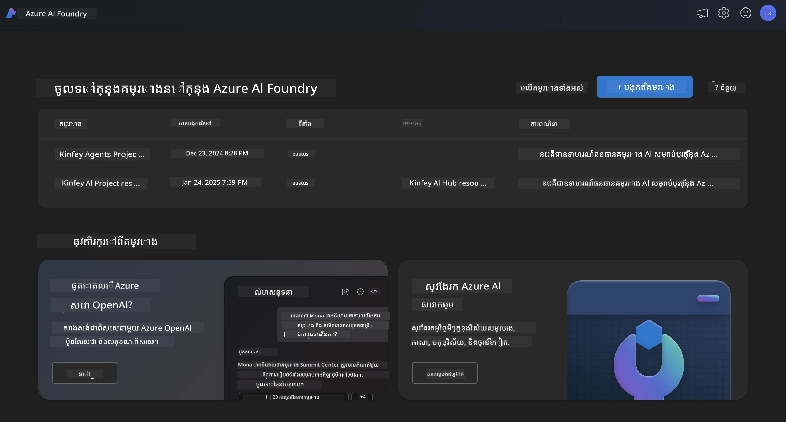
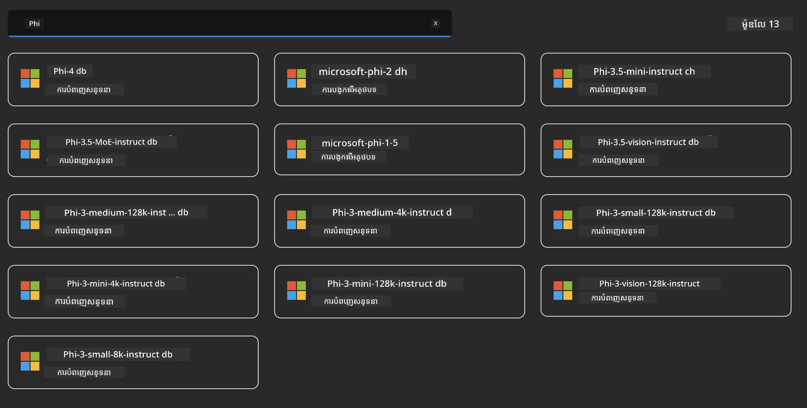
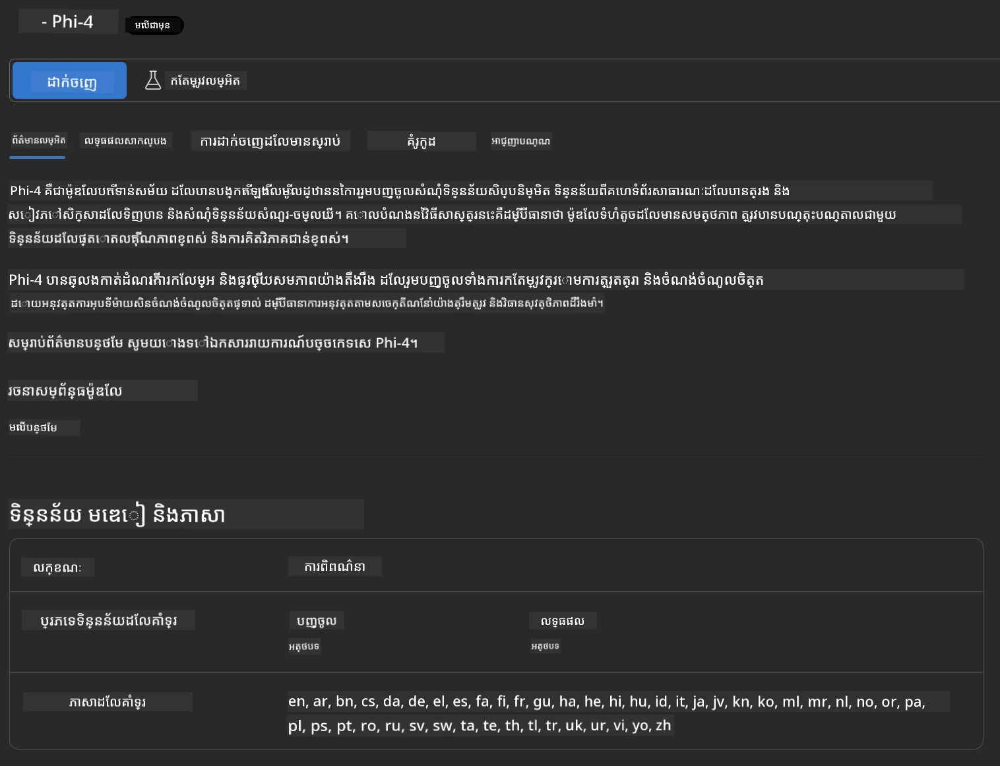
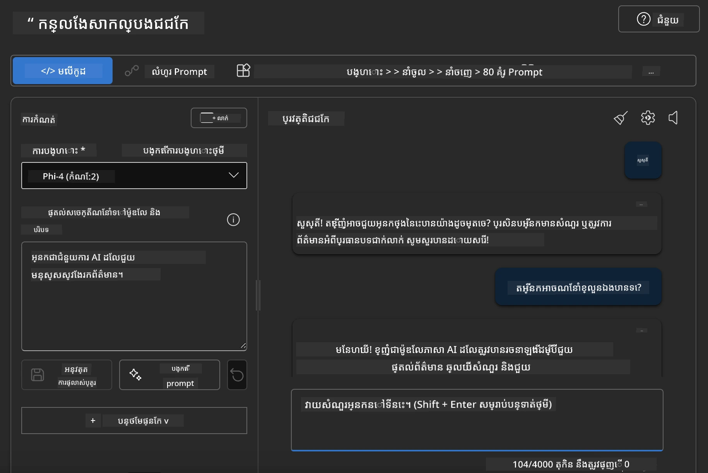

## គ្រួសារ Phi ក្នុង Microsoft Foundry

[Microsoft Foundry](https://ai.azure.com) គឺជាវេទិកាដែលទុកចិត្ត ដែលអនុញ្ញាតឱ្យអ្នកអភិវឌ្ឍន៍ជំរុញការច្នៃប្រឌិត និងរៀបចំអនាគតជាមួយ AI នៅក្នុងវិធីដែលមានសុវត្ថិភាព មានសន្តិសុខ និងទទួលខុសត្រូវ។


[Microsoft Foundry](https://ai.azure.com) ត្រូវបានរចនាឡើងសម្រាប់អ្នកអភិវឌ្ឍន៍ ដើម្បី៖

- បង្កើតកម្មវិធី AI សមត្ថភាពបង្កើត (generative) លើវេទិកាស្តង់ដាសម្រាប់សហគ្រាស។
- ស្វែងយល់ បង្កើត សាកល្បង និងដាក់ឲ្យដំណើរការ ដោយប្រើឧបករណ៍ AI និងម៉ូឌែល ML ថ្មីៗ ដ៏ទំនើប ដែលអនុវត្តទៅលើការអភិបាល AI ដោយទទួលខុសត្រូវ។
- សហការជាមួយក្រុមក្នុងដំណើរការពេញល្វែងនៃការអភិវឌ្ឍកម្មវិធី។

ជាមួយ Microsoft Foundry អ្នកអាចស្វែងយល់ម៉ូឌែល សេវាកម្ម និងសមត្ថភាពជាច្រើន និងចាប់ផ្តើមបង្កើតកម្មវិធី AI ដែលបម្រើគោលដៅរបស់អ្នកបានល្អបំផុត។ វេទិកា Microsoft Foundry ជួយឱ្យមានសមត្ថភាពបង្កើនទំហំ ក្នុងការបម្លែងការសាកល្បងគំនិតទៅជាកម្មវិធីផលិតកម្មពេញលេញដោយងាយស្រួល។ ការតាមដាន និងសម្រួលបន្តបន្ទាប់គាំទ្រការជោគជ័យរយៈពេលវែង។



ក្រៅពីការប្រើប្រាស់ Azure AOAI Service ក្នុង Microsoft Foundry អ្នកក៏អាចប្រើម៉ូឌែលពីភាគីទីបីនៅក្នុង Microsoft Foundry Model Catalog បានផងដែរ។ នេះជាជម្រើសល្អ ប្រសិនបើអ្នកចង់ប្រើ Microsoft Foundry ជាវេទិកាដើម្បីដោះស្រាយបញ្ហា AI របស់អ្នក។

យើងអាចដាក់ដំណើរការម៉ូឌែលគ្រួសារ Phi បានយ៉ាងរហ័ស តាមរយៈកាតាឡុកម៉ូឌែលនៅក្នុង Microsoft Foundry 

[ម៉ូឌែល Phi របស់ Microsoft ក្នុង Microsoft Foundry Models](https://ai.azure.com/explore/models/?selectedCollection=phi)



### **ដាក់ Phi-4 ក្នុង Microsoft Foundry**




### **សាកល្បង Phi-4 ក្នុង Microsoft Foundry Playground**



### **ដំណើរការកូដ Python ដើម្បីហៅ Microsoft Foundry Phi-4**


```python

import os  
import base64
from openai import AzureOpenAI  
from azure.identity import DefaultAzureCredential, get_bearer_token_provider  
        
endpoint = os.getenv("ENDPOINT_URL", "Your Azure AOAI Service Endpoint")  
deployment = os.getenv("DEPLOYMENT_NAME", "Phi-4")  
      
token_provider = get_bearer_token_provider(  
    DefaultAzureCredential(),  
    "https://cognitiveservices.azure.com/.default"  
)  
  
client = AzureOpenAI(  
    azure_endpoint=endpoint,  
    azure_ad_token_provider=token_provider,  
    api_version="2024-05-01-preview",  
)  
  

chat_prompt = [
    {
        "role": "system",
        "content": "You are an AI assistant that helps people find information."
    },
    {
        "role": "user",
        "content": "can you introduce yourself"
    }
] 
    
# រួមបញ្ចូលលទ្ធផលសំឡេង ប្រសិនបើសំឡេងត្រូវបានបើក
messages = chat_prompt 

completion = client.chat.completions.create(  
    model=deployment,  
    messages=messages,
    max_tokens=800,  
    temperature=0.7,  
    top_p=0.95,  
    frequency_penalty=0,  
    presence_penalty=0,
    stop=None,  
    stream=False  
)  
  
print(completion.to_json())  

```

---

<!-- CO-OP TRANSLATOR DISCLAIMER START -->
**Disclaimer**:
ឯកសារនេះត្រូវបានបកប្រែដោយប្រើសេវាកម្មបកប្រែ AI [Co-op Translator](https://github.com/Azure/co-op-translator). ប៉ុន្តែទោះយ៉ាងណា ក្នុងខណៈពេលយើងខិតខំដើម្បីភាពត្រឹមត្រូវ សូមយល់ដឹងថាការបកប្រែដោយស្វ័យប្រវត្តិអាចមានកំហុស ឬភាពមិនត្រឹមត្រូវ។ ឯកសារដើមក្នុងភាសាដើមគួរត្រូវបានចាត់ទុកថាជាប្រភពផ្លូវការ។ សម្រាប់ព័ត៌មានសំខាន់ៗ យើងសូមផ្តល់អនុសាសន៍ឱ្យប្រើការបកប្រែដោយអ្នកបកប្រែដែលមានវិជ្ជាជីវៈ។ យើងមិនទទួលខុសត្រូវចំពោះការយល់ច្រឡំ ឬការបកពាក្យខុសណាមួយដែលកើតមានពីការប្រើប្រាស់ការបកប្រែនេះ។
<!-- CO-OP TRANSLATOR DISCLAIMER END -->