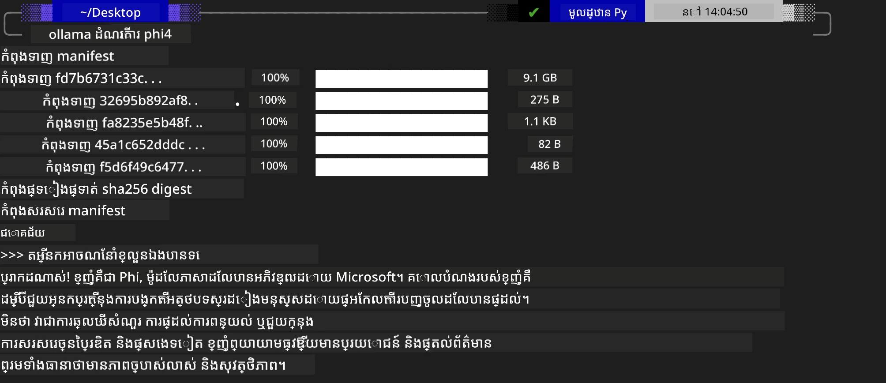
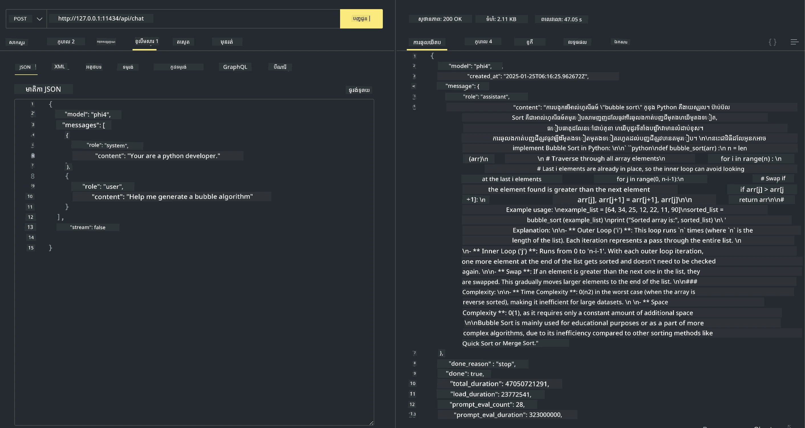

## ក្រុមគ្រួសារ Phi នៅក្នុង Ollama


[Ollama](https://ollama.com) អនុញ្ញាតឱ្យមនុស្សច្រើនអាចចាក់ដាក់ប្រតិបត្តិ LLM ឬ SLM ដែលជាកូដប្រភពបើកបានដោយផ្ទាល់តាមស្គ្រីបសាមញ្ញ ហើយក៏អាចសាងសង់ API ដើម្បីជួយស្ថានភាពកម្មវិធី Copilot ផ្លូវក្នុងកុំព្យូទ័រផ្ទាល់ក៏បាន។

## **1. ការដំឡើង**

Ollama គាំទ្រការរត់លើ Windows, macOS, និង Linux។ អ្នកអាចដំឡើង Ollama តាមកំណត់តំណនេះ ([https://ollama.com/download](https://ollama.com/download))។ បន្ទាប់ពីដំឡើងដោយជោគជ័យ អ្នកអាចប្រើស្គ្រីប Ollama ដើម្បីហៅ Phi-3 ដោយផ្ទាល់តាមបង្អួច terminal។ អ្នកអាចមើល [បណ្ណាល័យដែលអាចប្រើបានក្នុង Ollama](https://ollama.com/library) បានទាំងអស់។ ប្រសិនបើអ្នកបើក repository នេះនៅក្នុង Codespace វានឹងមាន Ollama ដំឡើងរួចហើយ។

```bash

ollama run phi4

```

> [!NOTE]
> ម៉ូឌែលនេះនឹងត្រូវទាញយកជាមុននៅពេលដែលអ្នករត់វាលើសព្វលើដើម។ មិនប្រាកដទេ អ្នកក៏អាចកំណត់ម៉ូឌែល Phi-4 ដែលបានទាញយករួចដោយផ្ទាល់បានផង។ យើងយក WSL ជាឧទាហរណ៍ក្នុងការរត់ពាក្យបញ្ជា។ បន្ទាប់ពីម៉ូឌែលទាញយកបានជោគជ័យ អ្នកអាចស្វែងការប្រាស្រ័យដោយផ្ទាល់នៅលើ terminal។



## **2. ហៅ API phi-4 ពី Ollama**

ប្រសិនបើអ្នកចង់ហៅ Phi-4 API ដែល Ollama បង្កើត អ្នកអាចប្រើពាក្យបញ្ជានេះនៅក្នុង terminal ដើម្បីចាប់ផ្តើមម៉ាស៊ីនបម្រើ Ollama។

```bash

ollama serve

```

> [!NOTE]
> ប្រសិនបើរត់លើ MacOS ឬ Linux សូមចំណាំថាអ្នកអាចប្រទះអត្រាបញ្ហាខាងក្រោម **"Error: listen tcp 127.0.0.1:11434: bind: address already in use"** អ្នកអាចទទួលបានកំហុសនេះនៅពេលហៅពាក្យបញ្ជា។ អ្នកអាចរំលងកំហុសនោះបាន ដោយសារវាធម្មតាបង្ហាញថាម៉ាស៊ីនបម្រើបានដំណើរការរួចហើយ ឬអ្នកអាចបិទនិងចាប់ផ្តើម Ollama ម្តងទៀត៖

**macOS**

```bash

brew services restart ollama

```

**Linux**

```bash

sudo systemctl stop ollama

```

Ollama គាំទ្រពីរ API: generate និង chat។ អ្នកអាចហៅ API ម៉ូឌែលដែល Ollama ផ្តល់តាមតម្រូវការរបស់អ្នក ដោយផ្ញើសំណើទៅសេវាកម្មក្នុងស្ថានដែលរត់លើច្រក 11434។

**Chat**

```bash

curl http://127.0.0.1:11434/api/chat -d '{
  "model": "phi3",
  "messages": [
    {
      "role": "system",
      "content": "Your are a python developer."
    },
    {
      "role": "user",
      "content": "Help me generate a bubble algorithm"
    }
  ],
  "stream": false
  
}'
```

នេះជាលទ្ធផលនៅក្នុង Postman



## ធនធានបន្ថែម

ពិនិត្យបញ្ជីម៉ូឌែលដែលអាចប្រើបានក្នុង Ollama នៅក្នុង [បណ្ណាល័យរបស់ពួកគេ](https://ollama.com/library)។

ទាញម៉ូឌែលរបស់អ្នកពីម៉ាស៊ីនបម្រើ Ollama ដោយប្រើពាក្យបញ្ជានេះ

```bash
ollama pull phi4
```

រត់ម៉ូឌែលដោយប្រើពាក្យបញ្ជានេះ

```bash
ollama run phi4
```

***Note:*** សាកល្បងចូលមើលតំណនេះ [https://github.com/ollama/ollama/blob/main/docs/api.md](https://github.com/ollama/ollama/blob/main/docs/api.md) ដើម្បីយល់អំពីព័ត៌មានបន្ថែម

## ការហៅ Ollama ពី Python

អ្នកអាចប្រើ `requests` ឬ `urllib3` ដើម្បីធ្វើសំណើទៅ endpoints សេវាកម្មក្នុងផ្ទះដែលបានប្រើខាងលើ។ ទោះបីជាយ៉ាងណា វិធីពេញនិយមក្នុងការប្រើ Ollama ក្នុង Python គឺតាមរយៈ SDK [openai](https://pypi.org/project/openai/), ព្រោះ Ollama ផ្តល់ endpoints ដែលសមស្របជាមួយ OpenAI ផងដែរ។

នេះគឺជា ឧទាហរណ៍សម្រាប់ phi3-mini:

```python
import openai

client = openai.OpenAI(
    base_url="http://localhost:11434/v1",
    api_key="nokeyneeded",
)

response = client.chat.completions.create(
    model="phi4",
    temperature=0.7,
    n=1,
    messages=[
        {"role": "system", "content": "You are a helpful assistant."},
        {"role": "user", "content": "Write a haiku about a hungry cat"},
    ],
)

print("Response:")
print(response.choices[0].message.content)
```

## ការហៅ Ollama ពី JavaScript 

```javascript
// ឧទាហរណ៍នៃការសង្ខេបឯកសារមួយជាមួយ Phi-4
script({
    model: "ollama:phi4",
    title: "Summarize with Phi-4",
    system: ["system"],
})

// ឧទាហរណ៍នៃការសង្ខេប
const file = def("FILE", env.files)
$`Summarize ${file} in a single paragraph.`
```

## ការហៅ Ollama ពី C#

បង្កើតកម្មវិធី C# Console ថ្មីមួយ ហើយបន្ថែម NuGet package ខាងក្រោម៖

```bash
dotnet add package Microsoft.SemanticKernel --version 1.34.0
```

បន្ទាប់មកជំនួសកូដនេះនៅក្នុងឯកសារ `Program.cs`

```csharp
using Microsoft.SemanticKernel;
using Microsoft.SemanticKernel.ChatCompletion;

// add chat completion service using the local ollama server endpoint
#pragma warning disable SKEXP0001, SKEXP0003, SKEXP0010, SKEXP0011, SKEXP0050, SKEXP0052
builder.AddOpenAIChatCompletion(
    modelId: "phi4",
    endpoint: new Uri("http://localhost:11434/"),
    apiKey: "non required");

// invoke a simple prompt to the chat service
string prompt = "Write a joke about kittens";
var response = await kernel.InvokePromptAsync(prompt);
Console.WriteLine(response.GetValue<string>());
```

រត់កម្មវិធីដោយប្រើពាក្យបញ្ជា៖

```bash
dotnet run
```

---

<!-- CO-OP TRANSLATOR DISCLAIMER START -->
**ការមិនទទួលខុសត្រូវ**:
ឯកសារនេះបានបកប្រែដោយប្រើសេវាកម្មបកប្រែ AI [Co-op Translator](https://github.com/Azure/co-op-translator). ខណៈពេលដែលយើងខិតខំដើម្បីធ្វើឲ្យបានត្រឹមត្រូវ សូមចំណាំថាការបកប្រែដោយស្វ័យប្រវត្តិអាចមានកំហុស ឬភាពមិនត្រឹមត្រូវ។ ឯកសារដើមនៅក្នុងភាសាដើមគួរត្រូវបានចាត់ទុកជាប្រភពផ្លូវការសម្រាប់យោង។ សម្រាប់ព័ត៌មានសំខាន់ៗ សូមណែនាំឱ្យប្រើការបកប្រែដោយមនុស្សជំនាញ។ យើងមិនទទួលខុសត្រូវចំពោះការយល់ច្រឡំ ឬការបកស្រាយខុសណាមួយ ដែលកើតឡើងពីការប្រើប្រាស់ការបកប្រែនេះទេ។
<!-- CO-OP TRANSLATOR DISCLAIMER END -->