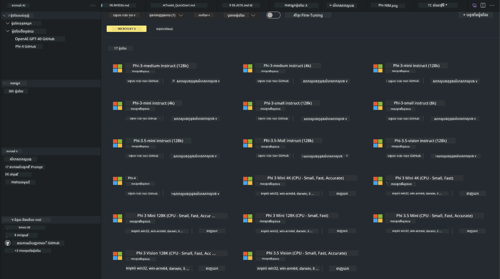
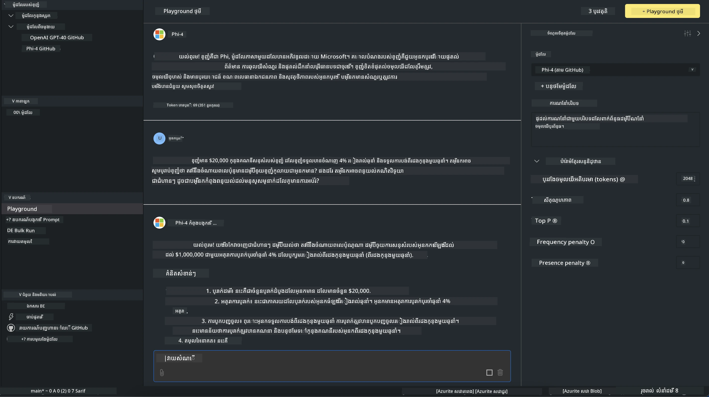

# Phi Family ក្នុង AITK

[AI Toolkit for VS Code](https://marketplace.visualstudio.com/items?itemName=ms-windows-ai-studio.windows-ai-studio) ធ្វើឲ្យការអភិវឌ្ឍកម្មវិធី generative AI សាមញ្ញជាងមុន ដោយនាំឧបករណ៍ និងម៉ូឌែលអភិវឌ្ឍ AI ជាន់ខ្ពស់ពី Microsoft Foundry Catalog និងកាតាឡុកផ្សេងៗដូចជា Hugging Face មករួមគ្នា។ អ្នកនឹងអាចរុករកកាតាឡុកម៉ូឌែល AI ដែលដំណើរការដោយ GitHub Models និង Microsoft Foundry Model Catalogs ទាញយកពួកវាទៅដាក់នៅក្នុងរូបវិថីក្នុងថតកុំព្យូទ័រឬទាញពីចម្ងាយ, ពិនិត្យលើ fine-tune, សាកល្បង និងប្រើប្រាស់វានៅក្នុងកម្មវិធីរបស់អ្នក។

AI Toolkit Preview នឹងដំណើរការជាលក្ខណៈក្នុងកុំព្យូទ័រមូលដ្ឋាន។ ការជំនបញ្ជូនសិក្សាឬ fine-tune រុំទៅលើម៉ូឌែលដែលអ្នកបានជ្រើស អ្នកប្រហែលត្រូវការមាន GPU ដូចជា NVIDIA CUDA GPU។ អ្នកក៏អាចរត់ GitHub Models ដោយផ្ទាល់ជាមួយ AITK ផងដែរ។

## ភាពចាប់ផ្តើម

[សូមស្វែងយល់បន្ថែមពីរបៀបដំឡើង Windows subsystem for Linux](https://learn.microsoft.com/windows/wsl/install?WT.mc_id=aiml-137032-kinfeylo)

និង [ប្តូរជា distribution លំនាំដើម](https://learn.microsoft.com/windows/wsl/install#change-the-default-linux-distribution-installed).

[AI Tooklit GitHub Repo](https://github.com/microsoft/vscode-ai-toolkit/)

- Windows,Linux,macOS
  
- សម្រាប់ការធ្វើ finetuning លើทั้ง Windows និង Linux អ្នកនឹងត្រូវការម្ខាង Nvidia GPU។ បន្ថែមពីនេះ **Windows** ត្រូវការមាឌ subsystem សម្រាប់ Linux ជាមួយ distro Ubuntu 18.4 ឬចំនួនក្រោយទៀត។ [សូមស្វែងយល់បន្ថែមពីរបៀបដំឡើង Windows subsystem for Linux](https://learn.microsoft.com/windows/wsl/install) និង [ប្តូរជា distribution លំនាំដើម](https://learn.microsoft.com/windows/wsl/install#change-the-default-linux-distribution-installed)。

### ដំឡើង AI Toolkit

AI Toolkit ត្រូវបានផ្ដល់ជានិច្ចជាការពន្យល់ [Visual Studio Code Extension](https://code.visualstudio.com/docs/setup/additional-components#_vs-code-extensions), ដូច្នេះអ្នកត្រូវតែដំឡើង [VS Code](https://code.visualstudio.com/docs/setup/windows?WT.mc_id=aiml-137032-kinfeylo) ជាមុនសិន ហើយទាញយក AI Toolkit ពី [VS Marketplace](https://marketplace.visualstudio.com/items?itemName=ms-windows-ai-studio.windows-ai-studio)។
[AI Toolkit មាននៅក្នុង Visual Studio Marketplace](https://marketplace.visualstudio.com/items?itemName=ms-windows-ai-studio.windows-ai-studio) ហើយអាចដំឡើងដូចជាការពន្យល់ επέផ\Extension VS Code ផ្សេងទៀត។

បើអ្នកមិនស្គាល់អំពីរបៀបដំឡើង VS Code extensions សូមអនុវត្តជាប់តាមជំហ៊ានដូចខាងក្រោម៖

### ចូលប្រើប្រាស់

1. នៅក្នុង Activity Bar ក្នុង VS Code ជ្រើស **Extensions**
1. នៅក្នុងបន្ទាត់ស្វែងរក Extensions វាយ "AI Toolkit"
1. ជ្រើស "AI Toolkit for Visual Studio code"
1. ជ្រើស **Install**

ឥឡូវនេះ អ្នកបានរួចរាល់ក្នុងការប្រើប្រាស់ extension!

អ្នកនឹងត្រូវបានទទួលសំណើសុំចូលទៅ GitHub ដូច្នេះសូមចុច "Allow" ដើម្បីបន្ត។ អ្នកនឹងត្រូវបានស្តារទិសទៅទំព័រសំរាប់ចុះឈ្មោះ GitHub។

សូមចូលប្រើ និងអនុវត្តតាមជំហ៊ាន។ បន្ទាប់ពីបញ្ចប់ដោយជោគជ័យ អ្នកនឹងត្រូវបានបញ្ជូនត្រឡប់ទៅ VS Code។

បន្ទាប់ពីបានដំឡើង extension អ្នកនឹងមើលឃើញរូបតំណាង AI Toolkit បង្ហាញនៅក្នុង Activity Bar របស់អ្នក។

ដូច្នេះ យើងមកស្វែងរកសកម្មភាពដែលមាន!

### សកម្មភាពដែលអាចប្រើបាន

ផ្នែកចំហៀងគោលនៃ AI Toolkit ត្រូវបានរត់បង្ហាញទៅជា  

- **ម៉ូឌែល**
- **ធនធាន**
- **ប្លេអេចក្រោម**  
- **ការលៃតម្រូវ (Fine-tuning)**
- **ការវាយតម្លៃ**

អាចរកបាននៅក្នុងផ្នែកធនធាន។ ដើម្បីចាប់ផ្តើម ជ្រើស **Model Catalog**។

### ទាញយកម៉ូឌែលពីកាតាឡុក

នៅពេលបើក AI Toolkit ពី sidebar របស់ VS Code អ្នកអាចជ្រើសពីជម្រើសដូចខាងក្រោម៖



- ស្វែងរកម៉ូឌែលដែលគាំទ្រពី **Model Catalog** ហើយទាញយកទៅក្នុងរៀងខ្លួន
- សាកល្បង inference របស់ម៉ូឌែលនៅក្នុង **Model Playground**
- លៃតម្រូវម៉ូឌែល (fine-tune) ទៅក្នុងស្រុកឬពីចម្ងាយនៅក្នុង **Model Fine-tuning**
- ផ្ទុកម៉ូឌែលដែលបានលៃតម្រូវទៅកាន់ cloud រយៈពេលតាម command palette សម្រាប់ AI Toolkit
- វាយតម្លៃម៉ូឌែល

> [!NOTE]
>
> **GPU និង CPU**
>
> អ្នកនឹងមើលឃើញថាកាតាប្រវត្តិម៉ូឌែលបង្ហាញទំហំម៉ូឌែល វេទិកា និងប្រភេទអ៊ាក់សែលេរ៉ាត (CPU, GPU)។ សម្រាប់ប្រសិទ្ធភាពយល់ព្រោះល្អលើ **ឧបករណ៍ Windows ដែលមានយ៉ាងតិចមួយ GPU**, ជ្រើសកំណែម៉ូឌែលដែលផ្តោតលើ Windows ប៉ុណ្ណោះ។
>
> នេះធានាថាអ្នកមានម៉ូឌែលដែលបានអុបទីម៉ាយសម្រាប់អ៊ាក់សែលេរ៉ាត DirectML។
>
> ឈ្មោះម៉ូឌែលមានទ្រង់ទ្រាយជា
>
> - `{model_name}-{accelerator}-{quantization}-{format}`.
>
> ដើម្បីពិនិត្យថាតើអ្នកមាន GPU នៅលើឧបករណ៍ Windows របស់អ្នកឬទេ សូមបើក **Task Manager** ហើយបន្ទាប់មកជ្រើសផ្ទាំង **Performance**។ បើអ្នកមាន GPU(s) វានឹងត្រូវបានរាយបញ្ជីក្រោមឈ្មោះដូចជា "GPU 0" ឬ "GPU 1"។

### រត់ម៉ូឌែលនៅក្នុងផ្លេអserratឌ Grounds (playground)

បន្ទាប់ពីបានកំណត់ប៉ារ៉ាម៉ែត្រទាំងអស់រួច សូមចុច **Generate Project**។

ពេលម៉ូឌែលរបស់អ្នកបានទាញយករួច ជ្រើស **Load in Playground** នៅលើកាតាប្រវត្តិម៉ូឌែលនៅក្នុងកាតាឡុក។

- ចាប់ផ្តើមការទាញយកម៉ូឌែល
- តំឡើងគ្រឿងអាជីពទាំងអស់ និងឧបករណ៍ពឹងផ្អែក
- បង្កើត VS Code workspace



### ប្រើ REST API ក្នុងកម្មវិធីរបស់អ្នក

AI Toolkit មានម៉ាស៊ីនបម្រើវេប REST API ក្នុងផ្ទាល់ **នៅលើច្រក (port) 5272** ដែលប្រើ [ទ្រង់ទ្រាយ OpenAI chat completions](https://platform.openai.com/docs/api-reference/chat/create)។

នេះអនុញ្ញាតឲ្យអ្នកសាកល្បងកម្មវិធីរបស់អ្នកនៅក្នុងផ្ទាល់ ដោយមិនចាំបាច់ពឹងផ្អែកលើសេវាកម្មម៉ូឌែល AI នៅ cloud។ ឧទាហរណ៍ ឯកសារ JSON ដូចខាងក្រោមបង្ហាញពីរបៀបកំណត់ body នៃសំណើ៖

```json
{
    "model": "Phi-4",
    "messages": [
        {
            "role": "user",
            "content": "what is the golden ratio?"
        }
    ],
    "temperature": 0.7,
    "top_p": 1,
    "top_k": 10,
    "max_tokens": 100,
    "stream": true
}
```

អ្នកអាចសាកល្បង REST API ដោយប្រើ (ឧ. ) [Postman](https://www.postman.com/) ឬ ឧបករណ៍ CURL (Client URL)៖

```bash
curl -vX POST http://127.0.0.1:5272/v1/chat/completions -H 'Content-Type: application/json' -d @body.json
```

### ប្រើបណ្ណាល័យ OpenAI client សម្រាប់ Python

```python
from openai import OpenAI

client = OpenAI(
    base_url="http://127.0.0.1:5272/v1/", 
    api_key="x" # ចាំបាច់សម្រាប់ API ប៉ុន្តែមិនបានប្រើ
)

chat_completion = client.chat.completions.create(
    messages=[
        {
            "role": "user",
            "content": "what is the golden ratio?",
        }
    ],
    model="Phi-4",
)

print(chat_completion.choices[0].message.content)
```

### ប្រើបណ្ណាល័យ Azure OpenAI client សម្រាប់ .NET

បន្ថែម [Azure OpenAI client library for .NET](https://www.nuget.org/packages/Azure.AI.OpenAI/) ទៅក្នុងโปรเจ็กต์របស់អ្នកដោយប្រើ NuGet:

```bash
dotnet add {project_name} package Azure.AI.OpenAI --version 1.0.0-beta.17
```

បញ្ចូលឯកសារ C# មួយដែលមានឈ្មោះ **OverridePolicy.cs** ទៅក្នុងโปรเจ็กต์របស់អ្នក ហើយដាក់កូដដូចខាងក្រោម៖

```csharp
// OverridePolicy.cs
using Azure.Core.Pipeline;
using Azure.Core;

internal partial class OverrideRequestUriPolicy(Uri overrideUri)
    : HttpPipelineSynchronousPolicy
{
    private readonly Uri _overrideUri = overrideUri;

    public override void OnSendingRequest(HttpMessage message)
    {
        message.Request.Uri.Reset(_overrideUri);
    }
}
```

បន្ទាប់មក ដាក់កូដដូចខាងក្រោមចូលទៅក្នុងឯកសារ **Program.cs** របស់អ្នក៖

```csharp
// Program.cs
using Azure.AI.OpenAI;

Uri localhostUri = new("http://localhost:5272/v1/chat/completions");

OpenAIClientOptions clientOptions = new();
clientOptions.AddPolicy(
    new OverrideRequestUriPolicy(localhostUri),
    Azure.Core.HttpPipelinePosition.BeforeTransport);
OpenAIClient client = new(openAIApiKey: "unused", clientOptions);

ChatCompletionsOptions options = new()
{
    DeploymentName = "Phi-4",
    Messages =
    {
        new ChatRequestSystemMessage("You are a helpful assistant. Be brief and succinct."),
        new ChatRequestUserMessage("What is the golden ratio?"),
    }
};

StreamingResponse<StreamingChatCompletionsUpdate> streamingChatResponse
    = await client.GetChatCompletionsStreamingAsync(options);

await foreach (StreamingChatCompletionsUpdate chatChunk in streamingChatResponse)
{
    Console.Write(chatChunk.ContentUpdate);
}
```


## ការ Fine Tuning ជាមួយ AI Toolkit

- ចាប់ផ្តើមជាមួយការស្វែងរកម៉ូឌែល និង playground។
- ការលៃតម្រូវម៉ូឌែល និង inference ប្រើធនធានកុំព្យូទ័រផ្ទាល់ខ្លួន។
- ការលៃតម្រូវ និង inference ពីចម្ងាយប្រើធនធាន Azure

[Fine Tuning with AI Toolkit](../../03.FineTuning/Finetuning_VSCodeaitoolkit.md)

## ធនធាន Q&A របស់ AI Toolkit

សូមយោងទៅកាន់ [ទំព័រ Q&A](https://github.com/microsoft/vscode-ai-toolkit/blob/main/archive/QA.md) របស់យើងសម្រាប់បញ្ហាទូទៅ និងដំណោះស្រាយ។

---

<!-- CO-OP TRANSLATOR DISCLAIMER START -->
**សេចក្តី​បដិសេធ**:
ឯកសារនេះត្រូវបានបកប្រែដោយប្រើសេវាកម្មបកប្រែ AI [Co-op Translator](https://github.com/Azure/co-op-translator)។ ខណៈពេលយើងខិតខំប្រឹងប្រែងដើម្បីភាពត្រឹមត្រូវ សូមយកចិត្តទុកដាក់ថាការបកប្រែដោយស្វ័យប្រវត្តិអាចមានកំហុស ឬភាពមិនត្រឹមត្រូវ។ ឯកសារដើមក្នុងភាសាមូលដ្ឋានគួរត្រូវបានគេចាត់ទុកថាជាប្រភពដែលមានអាទិភាព។ សម្រាប់ព័ត៌មានសំខាន់ៗ យើងផ្តល់អនុសាសន៍ឱ្យប្រើការបកប្រែដោយអ្នកវិជ្ជាជីវៈមនុស្ស។ យើងមិនទទួលខុសត្រូវចំពោះការយល់ច្រឡំ ឬការបកប្រែខុសដែលកើតឡើងពីការប្រើប្រាស់ការបកប្រែនេះ។
<!-- CO-OP TRANSLATOR DISCLAIMER END -->