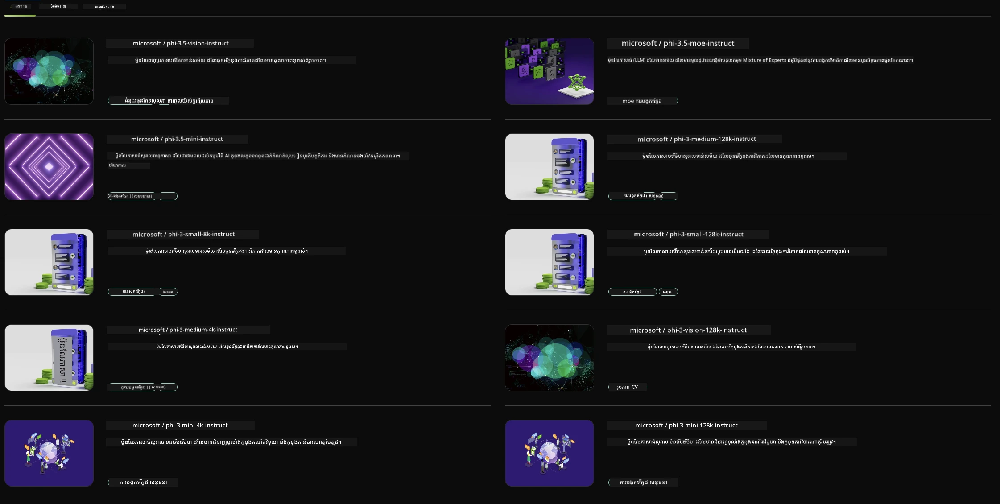

## គ្រួសារ Phi នៅក្នុង NVIDIA NIM

NVIDIA NIM គឺជាសំណុំពហុសេវាកម្មងាយប្រើ ដែលបានរចនាឡើងដើម្បីលឿនការចេញផ្សាយនៃម៉ូដែល AI ផ្សេងទៀត (generative AI) នៅលើពពក មជ្ឈមណ្ឌលទិន្នន័យ និងកុំព្យូទ័រធ្វើការ។ NIMs ត្រូវបានចាត់ថ្នាក់តាមគ្រួសារម៉ូដែល និងលើមូលដ្ឋានមួយម៉ូដែលក្នុងមួយ។ ឧទាហរណ៍ NVIDIA NIM សម្រាប់ម៉ូដែលភាសាធំ (LLMs) នាំយកអំណាចនៃ LLMs ដែលមានស្ថានភាពខ្ពស់ទៅកម្មវិធីសហគ្រាស ផ្តល់សមត្ថភាពដ៏ល្អក្នុងការបំលែង និងយល់ដឹងភាសាធម្មជាតិ។

NIM ធ្វើឱ្យក្រុម IT និង DevOps ងាយក្នុងការរត់ម៉ូដែលភាសាធំ (LLMs) ទៅក្នុងបរិយាកាសដែលគ្រប់គ្រងដោយខ្លួនឯង ខណៈដែលនៅតែកាន់កាតអ្នកអភិវឌ្ឍន៍ជាមួយ API លំដាប់ឧស្សាហកម្ម ដែលអនុញ្ញាតឲ្យពួកគេបង្កើត copilots, chatbots និងជំនួយការ AI មានអំណាច ដែលអាចបំលែងអាជីវកម្មរបស់ពួកគេ។ ដោយអត្ថប្រយោជន៍ពីការបង្កើនល្បឿន GPU នៃ NVIDIA និងការចេញផ្សាយដែលអាចបង្កើនទំហំได้ NIM ផ្តល់នូវផ្លូវលឿនបំផុតទៅកាន់ការសន្មត់ (inference) ជាមួយនឹងសមត្ថភាពដែលគ្មានស្មើ។

You can use NIVIDIA NIM to inference Phi Family Models



### **គំរូ - Phi-3-Vision ក្នុង NVIDIA NIM**

សន្មតថាអ្នកមានរូបភាពមួយ (`demo.png`) និងអ្នកចង់បង្កើតកូដ Python ដែលដំណើរការរូបភាពនេះ និងរក្សាទុកជាច្បាប់ថ្មីមួយ (`phi-3-vision.jpg`)។

កូដខាងលើធ្វើឲ្យដំណើរការនេះស្វ័យកម្មដោយ៖

1. Setting up the environment and necessary configurations.
2. Creating a prompt that instructs the model to generate the required Python code.
3. Sending the prompt to the model and collecting the generated code.
4. Extracting and running the generated code.
5. Displaying the original and processed images.

វិធីសាស្រ្តនេះប្រើអំណាចនៃ AI ដើម្បីស្វ័យក្រងការងារបំលែងរូបភាព ធ្វើឲ្យវាងាយស្រួល និងលឿនជាងមុនក្នុងការបានទទួលបានគោលដៅរបស់អ្នក។

[ដំណោះស្រាយកូដឧទាហរណ៍](../../../code/06.E2E/E2E_Nvidia_NIM_Phi3_Vision.ipynb)

Let's break down what the entire code does step by step:

1. **Install Required Package**:
    ```python
    !pip install langchain_nvidia_ai_endpoints -U
    ```
    ពាក្យបញ្ជានេះតម្លើងកញ្ចប់ `langchain_nvidia_ai_endpoints` និងធានាថាវាជាកំណែថ្មីបំផុត។

2. **Import Necessary Modules**:
    ```python
    from langchain_nvidia_ai_endpoints import ChatNVIDIA
    import getpass
    import os
    import base64
    ```
    ការនាំចូលទាំងនេះនាំយកម៉ូឌុលដែលចាំបាច់សម្រាប់អន្តរកម្មជាមួយ endpoints របស់ NVIDIA AI, ការគ្រប់គ្រងពាក្យសម្ងាត់យ៉ាងសុវត្ថិភាព, អន្តរកម្មជាមួយប្រព័ន្ធប្រតិបត្តិការ, និងការអ៊ិនកូដ/ដីកូដទិន្នន័យជា base64។

3. **Set Up API Key**:
    ```python
    if not os.getenv("NVIDIA_API_KEY"):
        os.environ["NVIDIA_API_KEY"] = getpass.getpass("Enter your NVIDIA API key: ")
    ```
    កូដនេះត្រួតពិនិត្យថាតើអថេរបរិយាកាស `NVIDIA_API_KEY` ត្រូវបានកំណត់រួចហើយឬទេ។ ប្រសិនបើមិនមាន វានឹងស្នើឲ្យអ្នកបញ្ចូលកូនសោ API របស់ពួកគេទៅយ៉ាងសុវត្ថិភាព។

4. **Define Model and Image Path**:
    ```python
    model = 'microsoft/phi-3-vision-128k-instruct'
    chat = ChatNVIDIA(model=model)
    img_path = './imgs/demo.png'
    ```
    វាកំណត់ម៉ូដែលដែលត្រូវប្រើ បង្កើតឧបករណ៍ `ChatNVIDIA` ជាមួយម៉ូដែលដែលបានបញ្ជាក់ និងកំណត់ផ្លូវទៅឯកសាររូបភាព។

5. **Create Text Prompt**:
    ```python
    text = "Please create Python code for image, and use plt to save the new picture under imgs/ and name it phi-3-vision.jpg."
    ```
    វាកំណត់ prompt ជាអក្សរដែលបង្ហាញម៉ូដែលឱ្យបង្កើតកូដ Python សម្រាប់ដំណើរការរូបភាព។

6. **Encode Image in Base64**:
    ```python
    with open(img_path, "rb") as f:
        image_b64 = base64.b64encode(f.read()).decode()
    image = f''
    ```
    កូដនេះអានឯកសាររូបភាព អ៊ិនកូដវាជា base64 និងបង្កើត tag រូបភាព HTML ជាមួយទិន្នន័យដែលបានអ៊ិនកូដ។

7. **Combine Text and Image into Prompt**:
    ```python
    prompt = f"{text} {image}"
    ```
    វាបញ្ចូល prompt អក្សរនិង tag រូបភាព HTML ទៅក្នុងខ្សែអក្សរតែមួយ។

8. **Generate Code Using ChatNVIDIA**:
    ```python
    code = ""
    for chunk in chat.stream(prompt):
        print(chunk.content, end="")
        code += chunk.content
    ```
    កូដនេះផ្ញើ prompt ទៅម៉ូដែល `ChatNVIDIA` និងប្រមូលកូដដែលបានបង្កើតជាផ្នែកៗ ដោយបញ្ច imprim និងភ្ជាប់ផ្នែកនីមួយៗទៅខ្សែអក្សរ `code`។

9. **Extract Python Code from Generated Content**:
    ```python
    begin = code.index('```python') + 9
    code = code[begin:]
    end = code.index('```')
    code = code[:end]
    ```
    វាស្រូបយកកូដ Python ពិតប្រាកដពីមាតិកាដែលបានបង្កើត ដោយដក formatting Markdown ចេញ។

10. **Run the Generated Code**:
    ```python
    import subprocess
    result = subprocess.run(["python", "-c", code], capture_output=True)
    ```
    វារត់កូដ Python ដែលបានស្រូបក្នុង subprocess ហើយចាប់យកលទ្ធផលចេញ។

11. **Display Images**:
    ```python
    from IPython.display import Image, display
    display(Image(filename='./imgs/phi-3-vision.jpg'))
    display(Image(filename='./imgs/demo.png'))
    ```
    បន្ទាត់ទាំងនេះបង្ហាញរូបភាពដោយប្រើម៉ូឌុល `IPython.display`។

---

<!-- CO-OP TRANSLATOR DISCLAIMER START -->
**ប្រកាសមិនទទួលខុសត្រូវ**:
ឯកសារនេះត្រូវបានបកប្រែដោយប្រើសេវាកម្មបកប្រែ AI [Co-op Translator](https://github.com/Azure/co-op-translator). បើទោះបីយើងខិតខំប្រឹងប្រែងដើម្បីភាពត្រឹមត្រូវ សូមយកចិត្តទុកដាក់ថាការបកប្រែដោយស្វ័យប្រវត្តិអាចមានកំហុស ឬភាពមិនត្រឹមត្រូវ។ ឯកសារដើមនៅក្នុងភាសាមាតុភូមិរបស់វាគួរត្រូវបានចាត់ទុកថាជាប្រភពផ្លូវការ។ សម្រាប់ព័ត៌មានសំខាន់ៗ យើងស្នើសុំឱ្យប្រើការបកប្រែដោយអ្នកបកប្រែមនុស្សដែលមានជំនាញ។ យើងមិនទទួលខុសត្រូវចំពោះការយល់ច្រឡំ ឬការបកប្រែខុសដែលកើតមានពីការប្រើប្រាស់ការបកប្រែនេះឡើយ។
<!-- CO-OP TRANSLATOR DISCLAIMER END -->