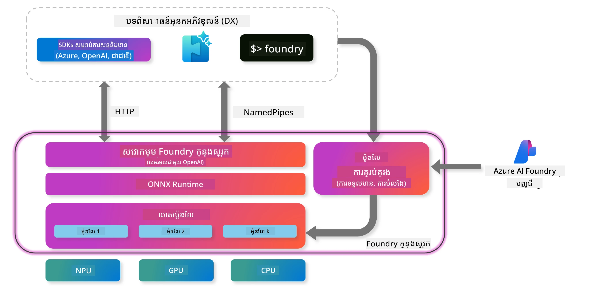
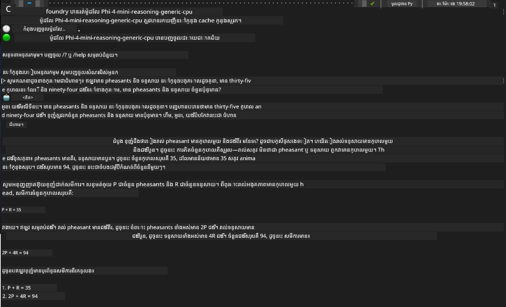

## ចាប់ផ្តើមជាមួយម៉ូដែលក្រុមគ្រួសារ Phi ក្នុង Foundry Local

### ការណែនាំអំពី Foundry Local

Foundry Local គឺជាផលិតផលបញ្ចប់ការធ្វើកត់សញ្ញា AI នៅលើឧបករណ៍ ដែលនាំមុខងារ AI មាន់សមត្ថភាពក្រមសិទ្ធិទៅកាន់រឹងរបស់អ្នកដោយផ្ទាល់។ មេរៀននេះនឹងណែនាំអ្នកពីការដំឡើង និងការប្រើម៉ូដែល Phi-Family ជាមួយ Foundry Local, ផ្តល់ឱ្យអ្នកនូវការត្រួតត្រង់លើបន្ទុក AI របស់អ្នក ខណៈដែលរក្សាព័ត៌មានឯកជន និងកាត់បន្ថយចំណាយ។

Foundry Local ផ្តល់នូវល្បឿន សម្ងាត់ភាព ការប្ដូរច្នៃ និងអត្ថប្រយោជន៍តម្លៃដោយដំណើរការ ម៉ូឌែល AI នៅក្នុងឧបករណ៍របស់អ្នកផ្ទាល់។ វាបញ្ចូលយ៉ាងរលូនទៅក្នុងដំណើរការនិងកម្មវិធីដែលមានរួចតាមរយៈ CLI, SDK និង REST API ដែលងាយស្រួលប្រើ។



### ហេតុអ្វីជ្រើស Foundry Local?

ការយល់ដឹងអំពីអត្ថប្រយោជន៍នៃ Foundry Local នឹងជួយអ្នកឲ្យទទួលការសម្រេចចិត្តបានយ៉ាងមានព័ត៌មានច្បាស់អំពីយុទ្ធសាស្ត្រដាក់បញ្ចូល AI របស់អ្នក៖

- **Inference លើឧបករណ៍:** ដំណើរការ ម៉ូឌែល ទៅលើឧបករណ៍របស់អ្នក ដើម្បីកាត់បន្ថយចំណាយ ព្រមទាំងរក្សាទុកទិន្នន័យទាំងអស់នៅលើឧបករណ៍។

- **ការកែប្រែម៉ូឌែល:** ជ្រើសពីម៉ូឌែលដែលបានកំណត់រួច ឬប្រើម៉ូឌែលរបស់អ្នកដើម្បីបំពេញតាមតម្រូវការ និងករណីប្រើជាក់លាក់។

- **ប្រសិទ្ធភាពថ្លៃដើម:** លុបចោលចំណាយសេវាពពកដែលមានចង្វាក់ដោយការប្រើឧបករណ៍ដែលមានរួច ដើម្បីធ្វើឲ្យ AI មានភាពងាយស្រួលចូលដល់។

- **ការរួមបញ្ចូលដោយរលូន:** ភ្ជាប់ជាមួយកម្មវិធីរបស់អ្នកតាម SDK, endpoints API ឬ CLI, និងមានភាពងាយស្រួលក្នុងការពង្រីកទៅ Microsoft Foundry ខណៈដែលតម្រូវការរបស់អ្នកធ្វើឲ្យកើនឡើង។

> **កំណត់ចាប់ផ្ដើម៖** មេរៀននេះផ្តោតលើការប្រើ Foundry Local តាមរយៈចំណុច CLI និង SDK។ អ្នកនឹងរៀនពីវិធីទាំងពីរដើម្បីជួយអ្នកជ្រើសវិធីល្អបំផុតសម្រាប់ករណីប្រើរបស់អ្នក។

## ផ្នែក 1: ការកំណត់ Foundry Local CLI

### ជំហាន 1: ការដំឡើង

Foundry Local CLI គឺជាតំបន់ចូលរបស់អ្នកសម្រាប់គ្រប់គ្រង និងដំណើរការ ម៉ូឌែល AI ក្នុងស្រុក។ តោះចាប់ផ្តើមដោយដំឡើងវាលើប្រព័ន្ធរបស់អ្នក។

**ប្រព័ន្ធដែលគាំទ្រ:** Windows និង macOS

សម្រាប់ការណែនាំលម្អិតអំពីការដំឡើង សូមយោងទៅកាន់ [ឯកសារ Foundry Local ផ្លូវការ](https://github.com/microsoft/Foundry-Local/blob/main/README.md)។

### ជំហាន 2: ស្វែងរកម៉ូឌែលដែលមាន

ពេលដែលអ្នកបានដំឡើង Foundry Local CLI រួច អ្នកអាចស្វែងរកថាតើម៉ូឌែលណាខ្លះដែលមានសម្រាប់ករណីប្រើរបស់អ្នក។ ពាក្យបញ្ជានេះនឹងបង្ហាញម៉ូឌែលដែលគាំទ្រទាំងអស់៖


```bash
foundry model list
```

### ជំហាន 3: យល់ពីម៉ូឌែលក្រុមគ្រួសារ Phi

ក្រុមគ្រួសារ Phi ផ្តល់ម៉ូឌែលជាច្រើនដែលបានបង្កើតឲ្យសមស្របសម្រាប់ករណីប្រើ និងកំណាងឧបករណ៍ផ្សេងៗ។ នេះគឺម៉ូឌែល Phi ដែលមាននៅក្នុង Foundry Local៖

**ម៉ូឌែល Phi ដែលមាន៖** 

- **phi-3.5-mini** - ម៉ូឌែលខ្នាតតូចសម្រាប់ភារកិច្ចមូលដ្ឋាន
- **phi-3-mini-128k** - កំណែបន្ថែមបរិបទសម្រាប់ការសន្ទនាដែលយូរ
- **phi-3-mini-4k** - ម៉ូឌែលបរិបទស្តង់ដាសម្រាប់ការប្រើប្រាស់ទូទៅ
- **phi-4** - ម៉ូឌែលកម្រិតខ្ពស់ជាមួយសមត្ថភាពបានធ្វើឲ្យប្រសើរ
- **phi-4-mini** - កំណែស្រាលនៃ Phi-4
- **phi-4-mini-reasoning** - ជាពិសេសសម្រាប់ភារកិច្ចដំណោះស្រាយទ្រង់ទ្រាយស្មុគស្មាញ

> **ភាពឆបគ្នានឹងឧបករណ៍៖** ម៉ូឌែលនីមួយៗអាចកំណត់សម្រាប់ការបង្កើនល្បឿនដោយឧបករណ៍ (CPU, GPU) យោងទៅតាមសមត្ថភាពប្រព័ន្ធរបស់អ្នក។

### ជំហាន 4: ដំណើរការ​ម៉ូឌែល Phi ដំបូងរបស់អ្នក

តោះចាប់ផ្តើមជាមួយឧទាហរណ៍អនុវត្ត។ យើងនឹងដំណើរការ ម៉ូឌែល `phi-4-mini-reasoning` ដែលកំពូលក្នុងការដោះស្រាយបញ្ហាស្មុគស្មាញជាជំហានៗ។

**ពាក្យបញ្ជាដើម្បីដំណើរការ​ម៉ូឌែល៖**

```bash
foundry model run Phi-4-mini-reasoning-generic-cpu
```

> **ការដំឡើងលើកដំបូង៖** នៅពេលដំណើរការម៉ូឌែលលើកដំបូង Foundry Local នឹងទាញយកវាទៅលើឧបករណ៍ក្នុងស្រុករបស់អ្នកដោយស្វ័យប្រវត្តិ។ ពេលទាញយកអាចខុសគ្នាដោយផ្អែកលើល្បឿនបណ្តាញរបស់អ្នក ដូច្នេះសូមអត់ធ្មត់នៅពេលដំឡើងដំបូង។

### ជំហាន 5: សាកល្បងម៉ូឌែលជាមួយបញ្ហាពិត

ឥឡូវនេះចង់សាកល្បងម៉ូឌែលរបស់យើងជាមួយបញ្ហាវិញ្ញាសារ.logic មួយដើម្បីមើលថាវាធ្វើ reasoning ជាជំហានៗយ៉ាងដូចម្ដេច៖

**បញ្ហាឧទាហរណ៍៖**

```txt
Please calculate the following step by step: Now there are pheasants and rabbits in the same cage, there are thirty-five heads on top and ninety-four legs on the bottom, how many pheasants and rabbits are there?
```

**របៀបដែលរំពឹងទុក៖** ម៉ូឌែលគួរបំបែកបញ្ហានេះជា​ជំហានយុត្តិវិធី ដោយប្រើកត្តាថា pheasants (បក្សី) មានជើង 2 និង rabbits (ទន្សាយ) មានជើង 4 ដើម្បីដោះស្រាយប្រព័ន្ធសមីការ។

**លទ្ធផល៖**



## ផ្នែក 2: ការសាងសង់កម្មវិធីជាមួយ Foundry Local SDK

### ហេតុអ្វីបានជា​ប្រើ SDK?

បើទោះ CLI គឺល្អសម្រាប់សាកល្បង និងទំនាក់ទំនងរហ័ស ប៉ុន្តែ SDK អនុញ្ញាតឲ្យអ្នកបញ្ចូល Foundry Local ចូលទៅក្នុងកម្មវិធីដោយវិធីប្រព័ន្ធ។ នេះបើកលំហសម្រាប់៖

- សាងសង់កម្មវិធីដែលមានថាមពលដោយ AI ផ្ទាល់ខ្លួន
- បង្កើតចរន្តការងារដែលស្វ័យប្រវត្តិ
- បញ្ចូលមុខងារ AI ទៅក្នុងប្រព័ន្ធដែលមានរួច
- អភិវឌ្ឍ chatbots និងឧបករណ៍អន្តរកម្ម

### ភាសាកម្មកម្មដែលគាំទ្រ

Foundry Local ផ្តល់ការគាំទ្រ SDK សម្រាប់ភាសាកម្មកម្មជាច្រើនឲ្យសមស្របនឹងចំណូលចិត្តអភិវឌ្ឍន៍របស់អ្នក៖

**📦 SDK ដែលមាន៖**

- **C# (.NET):** [ឯកសារ និង ឧទាហរណ៍ SDK](https://github.com/microsoft/Foundry-Local/tree/main/sdk/cs)
- **Python:** [ឯកសារ និង ឧទាហរណ៍ SDK](https://github.com/microsoft/Foundry-Local/tree/main/sdk/python)
- **JavaScript:** [ឯកសារ និង ឧទាហរណ៍ SDK](https://github.com/microsoft/Foundry-Local/tree/main/sdk/js)
- **Rust:** [ឯកសារ និង ឧទាហរណ៍ SDK](https://github.com/microsoft/Foundry-Local/tree/main/sdk/rust)

### ដំណាក់កាលបន្ទាប់

1. **ជ្រើស SDK** ដែលអ្នកចូលចិត្ត ដោយផ្អែកលើបរិយាកាសអភិវឌ្ឍន៍របស់អ្នក
2. **អនុវត្តតាមឯកសារ SDK ជាក់លាក់** សម្រាប់មគ្គុទេសក៍អនុវត្តលម្អិត
3. **ចាប់ផ្តើមដោយឧទាហរណ៍សាមញ្ញ** មុនពេលសាងសង់កម្មវិធីស្មុគស្មាញ
4. **ស្វែងយល់កូដគំរូ** ដែលផ្តល់ក្នុងកាលីបរមើល SDK នីមួយៗ

## សេចក្តីសន្និដ្ឋាន

អ្នកឥឡូវបានរៀនពីរបៀប៖
- ✅ ដំឡើង និងកំណត់ Foundry Local CLI
- ✅ រកឃើញ និងដំណើរការ ម៉ូឌែលក្រុមគ្រួសារ Phi
- ✅ សាកល្បងម៉ូឌែលជាមួយបញ្ហាពិត
- ✅ យល់ពីជម្រើស SDK សម្រាប់ការអភិវឌ្ឍកម្មវិធី

Foundry Local ផ្តល់មូលដ្ឋានដ៏មានថាមពលសម្រាប់នាំមុខមុខងារ AI ទៅកាន់បរិយាបថក្នុងស្រុករបស់អ្នក, ផ្តល់អំណាចលើល្បឿន សម្ងាត់ និងចំណាយ ខណៈដែលថែមទាំងរក្សាការបត់បែនសម្រាប់ពង្រីកទៅដល់ដំណោះស្រាយពពកនៅពេលដែលត្រូវការ។

---

<!-- CO-OP TRANSLATOR DISCLAIMER START -->
**ការមិនទទួលខុសត្រូវ**:
ឯកសារនេះត្រូវបានបកប្រែដោយប្រើសេវាកម្មបកប្រែដោយ AI [Co-op Translator](https://github.com/Azure/co-op-translator)។ ខណៈដែលយើងព្យាយាមធ្វើឱ្យបានត្រឹមត្រូវ សូមយល់ឲ្យដឹងថា ការបកប្រែដោយស្វ័យប្រវត្តិអាចមានកំហុស ឬភាពមិនត្រឹមត្រូវ។ ឯកសារដើមក្នុងភាសាដើមគួរត្រូវបានទុកជា​ប្រភព​ដែល​មានអំណាច។ សម្រាប់ព័ត៌មានសំខាន់ៗ យើងអនុសាសន៍ឱ្យប្រើការបកប្រែដោយមនុស្សវិជ្ជាជីវៈ។ យើងមិនទទួលខុសត្រូវចំពោះការយល់ច្រឡំ ឬការបកស្រាយខុសៗណាមួយដែលកើតឡើងពីការប្រើប្រាស់ការបកប្រែនេះ។
<!-- CO-OP TRANSLATOR DISCLAIMER END -->