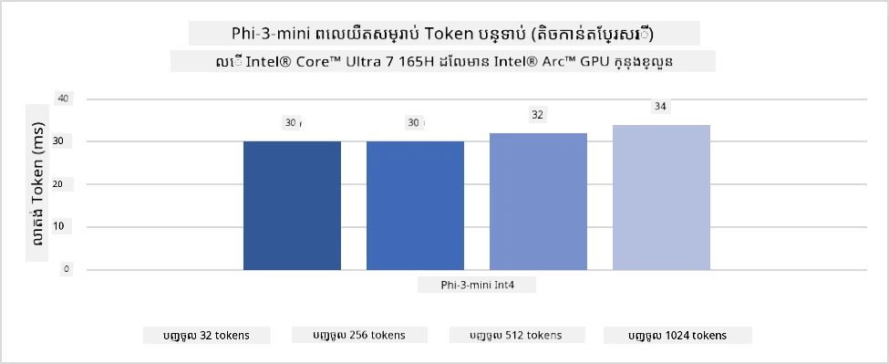
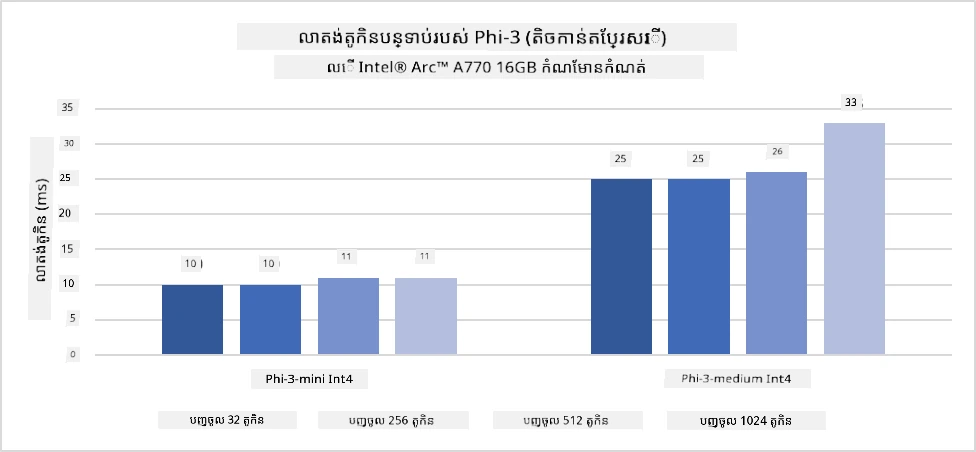
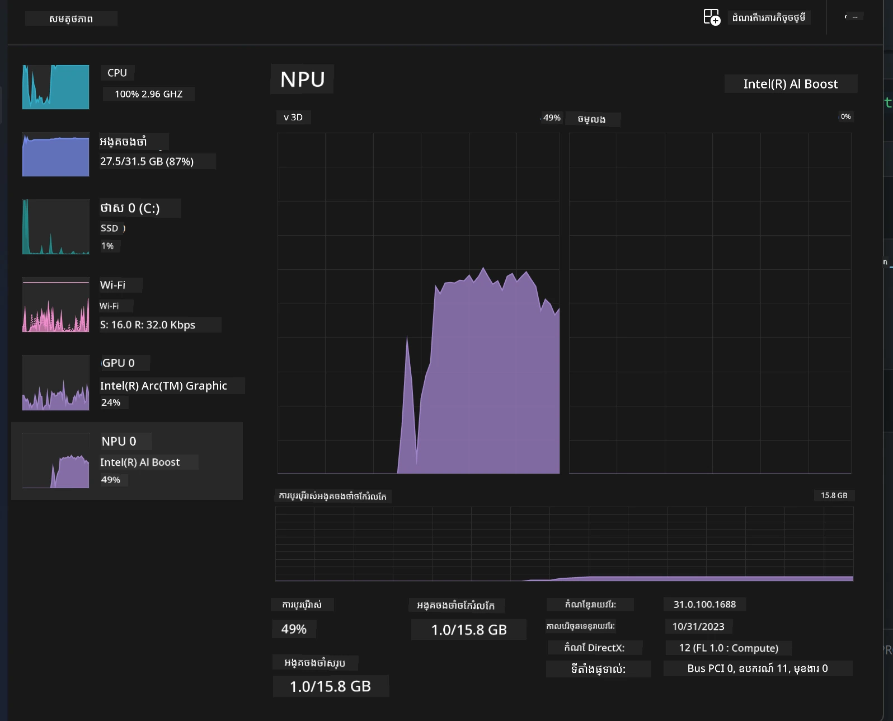
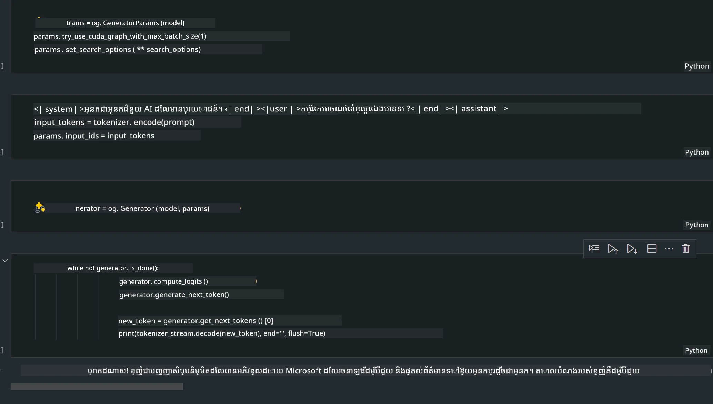
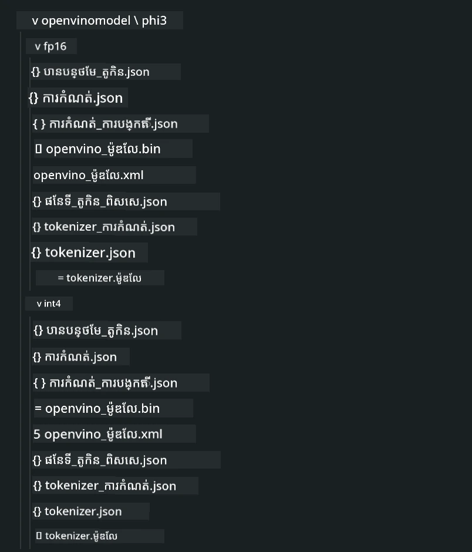
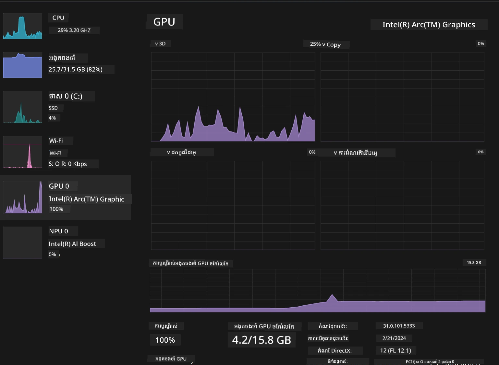

# **Inference Phi-3 នៅលើ AI PC**

ដោយសារការវិវឌ្ឍន៍នៃ AI បង្កើត និងការកែលម្អសមត្ថភាពរឹងរបស់ឧបករណ៍ផ្ដាច់ថាមពល (edge devices), ម៉ូឌែល AI បង្កើតជាច្រើនអាចត្រូវបានរួមបញ្ចូលក្នុងឧបករណ៍ Bring Your Own Device (BYOD) របស់អ្នកប្រើ។ AI PC គឺជាផ្នែកមួយក្នុងចំណោមម៉ូឌែលទាំងនេះ។ ចាប់ពីឆ្នាំ 2024 ទៅ មក Intel, AMD និង Qualcomm បានសហការជាមួយក្រុមហ៊ុនផលិត PC ដើម្បីណែនាំ AI PCs ដែលអនុញ្ញាតឱ្យដាក់បញ្ចូលម៉ូឌែល AI បង្កើតនៅក្នុងសហការក្នុងតំបន់ តាមរយៈការផ្លាស់ប្តូរឮយ៉ាងហត្ថ​អេក្ត្រូនិច។ នៅក្នុងការពិភាក្សានេះ យើងនឹងផ្តោតលើ Intel AI PCs និងស្វែងយល់ពីរបៀបដាក់ដំណើរការ Phi-3 លើ Intel AI PC។

### NPU ជាអ្វី

NPU (Neural Processing Unit) គឺជាក្រុមប្រព័ន្ធឧបករណ៍ដ៏ឯកទេសដែលមាននៅលើ SoC មួយដែលរៀបចំមកសម្រាប់ល្បឿនរៀបចំប្រតិបត្តិការបណ្ដាញសរសៃប្រសាទ និងភារកិច្ច AI។ ផ្សេងពី CPU និង GPU ទូទៅ NPU ត្រូវបានបង្កើតឡើងសម្រាប់កំណត់រចនាសម្ព័ន្ធគណិតវិទ្យាដែលផ្អែកលើទិន្នន័យ (data-driven parallel computing) ធ្វើឲ្យវាបានប្រសិទ្ធភាពខ្ពស់ក្នុងការដោះស្រាយទិន្នន័យ multimedia ទំហំធំដូចជា វីដេអូ និងរូបភាព និងដំណើរការទិន្នន័យសម្រាប់បណ្ដាញសរសៃប្រសាទ។ វាអាចដំណើរការងារទាក់ទងនឹង AI បានយ៉ាងល្អពិសេស ដូចជា ការទទួលស្គាល់សំឡេង, ការបំបាត់ផ្ទៃខាងក្រោយក្នុងការហៅវីដេអូ, និងដំណើរការកែសម្រួលរូបភាព ឬវីដេអូច្រើនដូចជា ការរកឃើញវត្ថុ។

## NPU vs GPU

ទោះបីជា ឧបករណ៍ធ្វើការរាប់ព័ត៌មាន AI និង machine learning ច្រើនដំណើរការលើ GPU ក៏ដោយ មានការប្រែប្រួលសំខាន់នៅរវាង GPU និង NPU។
GPU បានគេស្គាល់សម្រាប់សមត្ថភាពកំណត់គណនា 병렬 ហើយ មិនមែន GPU ទាំងអស់ផងដែលមានប្រសិទ្ធភាពស្មើគ្នាអំពីការតែដំណើរការក្រាហ្វិក។ NPU បានបង្កើតឡើងដោយមានគោលបំណងសម្រាប់គណនាដែលស្មុគស្មាញក្នុងបារេស្យកម្មនៃប្រតិបត្តិការបណ្ដាញសរសៃប្រសាទ ដែលធ្វើឲ្យវាមានប្រសិទ្ធភាពខ្ពស់សម្រាប់ភារកិច្ច AI។

សង្ខេប NPU គឺជាអ្នកជំនាញគណិតវិទ្យាដែលថែទាំការគណនា AI ហើយវាកើតមានតួអង្គសំខាន់ក្នុងយុគសម័យ AI PCs ដែលកំពុងរីកចម្រើន!

***ឧទាហរណ៍នេះអាស្រ័យលើ Intel Core Ultra Processor ថ្មីបំផុតពី Intel***

## **1. ប្រើ NPU ដើម្បីរត់ម៉ូដែល Phi-3**

ឧបករណ៍ Intel® NPU គឺជាស្វ័យប្រវត្តិក្នុងការល្បឿនសម្រាប់ការបកស្រាយ AI (AI inference accelerator) ដែលបានរួមបញ្ចូលជាមួយ CPU អតិថិជនរបស់ Intel, ចាប់ពីជំនាន់ Intel® Core™ Ultra (ដែលបានគេហៅមុនថា Meteor Lake)។ វាផ្តល់ឱ្យនូវការប្រតិបត្តិលើបណ្ដាញសរសៃប្រសាទដោយមានប្រសិទ្ធភាពថាមពល។





**Intel NPU Acceleration Library**

ឧបករណ៍បណ្ណាល័យ Intel NPU Acceleration Library [https://github.com/intel/intel-npu-acceleration-library](https://github.com/intel/intel-npu-acceleration-library) គឺជាបណ្ណាល័យ Python ដែលរចនាឡើងដើម្បីបង្កើនប្រសិទ្ធភាពកម្មវិធីរបស់អ្នកដោយអះអាងអំពីសមត្ថភាពនៃ Intel Neural Processing Unit (NPU) ដើម្បីអនុវត្តការគណនាដោយល្បឿនលឿនលើឧបករណ៍ដែលគាំទ្រ។

ឧទាហរណ៍របស់ Phi-3-mini លើ AI PC ដែលបំពាក់ដោយ Intel® Core™ Ultra processors។


Install the Python Library with pip

```bash

   pip install intel-npu-acceleration-library

```

***កំណត់ចំណាំ*** គម្រោងនៅតែមានការអភិវឌ្ឍន៍ ប៉ុន្តែម៉ូដែលយោងមានភាពពេញលេញរួចហើយ។

### **រត់ Phi-3 ជាមួយ Intel NPU Acceleration Library**

ដោយប្រើការ ហ្វេចឈឺរណ NPU របស់ Intel បណ្ណាល័យនេះមិនមានឥទ្ធិពលលើដំណើរការអ៊ិនកូដដើមទេ។ អ្នកត្រូវតែប្រើបណ្ណាល័យនេះសម្រាប់ធ្វើ quantize លើម៉ូដែល Phi-3 ដើម ជាឧទាហរណ៍ FP16，INT8，INT4 ដូចជា

```python
from transformers import AutoTokenizer, pipeline,TextStreamer
from intel_npu_acceleration_library import NPUModelForCausalLM, int4
from intel_npu_acceleration_library.compiler import CompilerConfig
import warnings

model_id = "microsoft/Phi-3-mini-4k-instruct"

compiler_conf = CompilerConfig(dtype=int4)
model = NPUModelForCausalLM.from_pretrained(
    model_id, use_cache=True, config=compiler_conf, attn_implementation="sdpa"
).eval()

tokenizer = AutoTokenizer.from_pretrained(model_id)

text_streamer = TextStreamer(tokenizer, skip_prompt=True)
```

បន្ទាប់ពីការបញ្ជាក់ចំនួនបានជោគជ័យ បន្តអនុវត្តដើម្បីហៅ NPU ដើម្បីរត់ម៉ូដែល Phi-3។

```python
generation_args = {
   "max_new_tokens": 1024,
   "return_full_text": False,
   "temperature": 0.3,
   "do_sample": False,
   "streamer": text_streamer,
}

pipe = pipeline(
   "text-generation",
   model=model,
   tokenizer=tokenizer,
)

query = "<|system|>You are a helpful AI assistant.<|end|><|user|>Can you introduce yourself?<|end|><|assistant|>"

with warnings.catch_warnings():
    warnings.simplefilter("ignore")
    pipe(query, **generation_args)
```

ពេលអនុវត្តកូដ យើងអាចមើលស្ថានភាពដំណើរការរបស់ NPU តាមរយៈ Task Manager



***Samples*** : [AIPC_NPU_DEMO.ipynb](../../../code/03.Inference/AIPC/AIPC_NPU_DEMO.ipynb)

## **2. ប្រើ DirectML + ONNX Runtime ដើម្បីរត់ម៉ូដែល Phi-3**

### **DirectML ជាអ្វី**

[DirectML](https://github.com/microsoft/DirectML) គឺជាបណ្ណាល័យ DirectX 12 ដែលមានល្បឿនខ្ពស់ និងបានបន្ទាន់សម័យដោយ hardware សម្រាប់ machine learning។ DirectML ផ្តល់នូវកម្មវិធីយើងលឿន GPU សម្រាប់ភារកិច្ច machine learning ផ្សេងៗលើឧបករណ៍ និងឌDrv៉ៃវ័រ ដែលគាំទ្រពហុប្រភេទ hardware រួមមាន GPU DirectX 12 ពីក្រុមហ៊ុនដូចជា AMD, Intel, NVIDIA, និង Qualcomm។

នៅពេលដែលប្រើដោយឡែក API DirectML គឺជាបណ្ណាល័យដឺហ្វលនៅលើ DirectX 12 និងសាកសមសម្រាប់កម្មវិធីដែលត្រូវការសមត្ថភាពខ្ពស់ និងLatency ទាបដូចជា frameworks, ហ្គេម និងកម្មវិធីពេលពិតផ្សេងៗ។ ការសហប្រតិបត្តិការយ៉ាងល្អរវាង DirectML និង Direct3D 12 និងការត្រួតពិនិត្យផ្ទាល់ខាងលើ hardware ហើយតាមរយៈការបង្កើតការស្របគ្នានៅលើ hardware មួយចំនួនធ្វើឲ្យ DirectML ល្អសម្រាប់លឿន machine learning ដោយពេលដែលទាំងសងខាងត្រូវការសមត្ថភាពខ្ពស់ និងភាពជឿបានលើលទ្ធផលឆ្ពោះទៅលើ hardware ទាំងមូល។

***កំណត់ចំណាំ*** : DirectML ថ្មីៗគឺបានគាំទ្រ NPU រួចហើយ(https://devblogs.microsoft.com/directx/introducing-neural-processor-unit-npu-support-in-directml-developer-preview/)

### DirectML និង CUDA ក្នុងទិដ្ឋភាពសមត្ថភាព និងកម្រិតប្រសិទ្ធភាព:

**DirectML** គឺជាបណ្ណាល័យ machine learning ដែល Microsoft បានអភិវឌ្ឍ។ វាអនុវត្តឲ្យដំណើរការភារកិច្ច machine learning លឿនលើឧបករណ៍ Windows, រួមមាន Desktop, Laptop និងឧបករណ៍ព្រំប្រទល់។
- ដ៏ផ្អែកលើ DX12: DirectML ត្រូវបានកសាងលើ DirectX 12 (DX12) ដែលផ្តល់នូវការគាំទ្រឧបករណ៍ hardware ច្រើនទ្រង់ទ្រាយលើ GPU រួមទាំង NVIDIA និង AMD។
- ការគាំទ្រផ្នែកទូលំទូលាយ: ដោយសារវា​ប្រើ DX12, DirectML អាចដំណើរការជាមួយ GPU ទាំងអស់ដែលគាំទ្រ DX12, រួមមាន GPU ធ្លាក់បញ្ចូល (integrated GPUs)។ 
- ការព្យាបាលរូបភាព: DirectML ដំណើរការរូបភាព និងទិន្នន័យផ្សេងៗដោយប្រើបណ្ដាញសរសៃប្រសាទ, ធ្វើឲ្យវាសមសម្រាប់ភារកិច្ចដូចជា ការទទួលស្គាល់រូបភាព, ការរកឃើញវត្ថុ, និងផ្សេងៗទៀត។
- ការផ្តល់ជំនួយក្នុងការតំឡើង: ការតំឡើង DirectML គឺសាមញ្ញ ហើយវាមិនត្រូវការជំនួយ SDK ឬបណ្ណាល័យពិសេសពីអ្នកផលិត GPU ទេ។
- ដំណើរការ: ក្នុងករណីខ្លះ DirectML អាចមានដំណើរការល្អ ហើយអាចលឿនជាង CUDA សម្រាប់ភារកិច្ចជាក់លាក់មួយចំនួន។
- កម្រិតកំណត់: ទោះជាយ៉ាងណា មានករណីដែល DirectML អាចយឺតជាង, ជាពិសេសសម្រាប់ទំហំបាច់ធំ float16។

**CUDA** គឺជាវេទិកាកម្មវិធីចំនួនពហុបម្រើ និងម៉ូឌែលកម្មវិធីដោយ NVIDIA។ វាអនុញ្ញាតឱ្យអ្នកអភិវឌ្ឍប្រេីប្រាស់កម្លាំង GPU នៃ NVIDIA ដើម្បីគណនាទូទៅ, រួមមាន machine learning និង simulation វិទ្យាសាស្ត្រ។
- ជាពិសេសសម្រាប់ NVIDIA: CUDA ត្រូវបានភ្ជាប់យ៉ាងជិតស្និទ្ធជាមួយ GPU របស់ NVIDIA និងរចនាសម្រាប់វា។ 
- ត្រូវបានអប់រំយ៉ាងខ្លាំង: វាផ្ដល់ប្រសិទ្ធភាពល្អសម្រាប់ភារកិច្ចដែលល្បឿនដោយ GPU, ជាពិសេសនៅពេលដែលប្រើ GPU របស់ NVIDIA។
- ត្រូវបានប្រើយ៉ាងទូលំទូលាយ: រាប់ម៉ូឌែលផ្នែក machine learning និងបណ្ណាល័យជាច្រើន (ដូចជា TensorFlow និង PyTorch) មានកាពារជាមួយ CUDA។
- ការកែតម្រូវ: អ្នកអភិវឌ្ឍអាចមិនសម្រួលកំណត់ការរៀបចំ CUDA សម្រាប់ភារកិច្ចជាក់លាក់ ដែលមានសក្តានុពលឲ្យទទួលបានប្រសិទ្ធភាពល្អបំផុត។
- កម្រិតកំណត់: ទោះជាយ៉ាងណា ការពឹងផ្អែកលើ hardware របស់ NVIDIA អាចមានដែនកំណត់បើលោកអ្នកចង់បានភាពអាចស្របគ្នាយ៉ាងទូលំទូលាយលើ GPU ផ្សេងៗ។

### ជ្រើសរើសរវាង DirectML និង CUDA

ការជ្រើសរើសរវាង DirectML និង CUDA គឺអាស្រ័យលើករណីប្រើប្រាស់ជាក់លាក់, ស្រាប់មាន hardware និងចំណង់ចំណូលចិត្តរបស់អ្នក។ បើអ្នកកំពុងស្វែងរកភាពអាចស្រាលឬងាយស្រួលក្នុងការតំឡើង DirectML អាចជាជម្រើសល្អ។ ទោះជាយ៉ាងណា បើអ្នកមាន GPU រូបាង NVIDIA ហើយត្រូវការប្រសិទ្ធភាពដែលបានបង្កើតយ៉ាងខ្លាំង CUDA មិនទាន់បាត់បង់ភាពសំខាន់។ សង្ខេប ទាំង DirectML និង CUDA មានអត្ថិភាព និងកំណត់ខុសគ្នា ដូចនេះសូមพิจารณាតាមតម្រូវការ និង hardware ដែលមាន។

### **Generative AI ជាមួយ ONNX Runtime**

នៅក្នុងយុគសម័យ AI ការ​អាចចល័តនៃម៉ូដែល AI មានសារៈសំខាន់ខ្លាំង។ ONNX Runtime អាចងាយស្រួលដាក់ប្រាម៉ូដែលដែលបានហ្វឹកហាត់ទៅឧបករណ៍ផ្សេងៗ។ អ្នកអភិវឌ្ឍមិនចាំបាច់ត្រូវប្រុងប្រយ័ត្នចំពោះ framework inference ទេទេ ហើយប្រើ API មួយទូទៅសម្រាប់ដំណើរការ inference។ នៅយុគសម័យ generative AI, ONNX Runtime ក៏បានអនុវត្តការបង្កើនប្រសិទ្ធភាពកូដ (https: //onnxruntime.ai/docs/genai/)។ តាមរយៈ ONNX Runtime ដែលបានបង្កើនប្រសិទ្ធភាព ម៉ូដែល generative AI ដែលបាន quantize អាចត្រូវបាន inference លើឧបករណ៍ផ្សេងៗ។ ក្នុង Generative AI ជាមួយ ONNX Runtime អ្នកអាចដាក់បន្ទាន់ម៉ូដែល AI តាមរយៈ API ដោយប្រើ Python, C#, C / C++។ លើកលែងមិនបាន បើត្រូវដាក់លើ iPhone អ្នកអាចប្រើអត្ថប្រយោជន៍ API Generative AI ជាមួយ ONNX Runtime របស់ C++។

[Sample Code](https://github.com/Azure-Samples/Phi-3MiniSamples/tree/main/onnx)

***រៀបចំការប្រមូល Generative AI ជាមួយបណ្ណាល័យ ONNX Runtime***

```bash

winget install --id=Kitware.CMake  -e

git clone https://github.com/microsoft/onnxruntime.git

cd .\onnxruntime\

./build.bat --build_shared_lib --skip_tests --parallel --use_dml --config Release

cd ../

git clone https://github.com/microsoft/onnxruntime-genai.git

cd .\onnxruntime-genai\

mkdir ort

cd ort

mkdir include

mkdir lib

copy ..\onnxruntime\include\onnxruntime\core\providers\dml\dml_provider_factory.h ort\include

copy ..\onnxruntime\include\onnxruntime\core\session\onnxruntime_c_api.h ort\include

copy ..\onnxruntime\build\Windows\Release\Release\*.dll ort\lib

copy ..\onnxruntime\build\Windows\Release\Release\onnxruntime.lib ort\lib

python build.py --use_dml


```

**Install library**

```bash

pip install .\onnxruntime_genai_directml-0.3.0.dev0-cp310-cp310-win_amd64.whl

```

នេះជាលទ្ធផលពេលរត់



***Samples*** : [AIPC_DirectML_DEMO.ipynb](../../../code/03.Inference/AIPC/AIPC_DirectML_DEMO.ipynb)

## **3. ប្រើ Intel OpenVINO ដើម្បីរត់ម៉ូដែល Phi-3**

### **OpenVINO ជាអ្វី**

[OpenVINO](https://github.com/openvinotoolkit/openvino) គឺជាកញ្ចប់កម្មវិធីប្រភពបើកសម្រាប់បង្កើនសមត្ថភាព និងដាក់បញ្ចូលម៉ូឌែល deep learning។ វាផ្តល់នូវការកែលម្អសមត្ថភាព deep learning សម្រាប់ម៉ូឌែលទាក់ទងនឹងចក្ខុវិជ្ជា, សំឡេង និងភាសា ពី frameworks ល្បីៗដូចជា TensorFlow, PyTorch និងផ្សេងទៀត។ ចាប់ផ្តើមជាមួយ OpenVINO។ OpenVINO ក៏អាចប្រើរួមជាមួយ CPU និង GPU ដើម្បីរត់ម៉ូឌែល Phi-3។

***កំណត់ចំណាំ***: បច្ចុប្បន្ន OpenVINO មិនគាំទ្រ NPU នៅពេលនេះទេ។

### **Install OpenVINO Library**

```bash

 pip install git+https://github.com/huggingface/optimum-intel.git

 pip install git+https://github.com/openvinotoolkit/nncf.git

 pip install openvino-nightly

```

### **រត់ Phi-3 ជាមួយ OpenVINO**

ដូចជា NPU, OpenVINO បំពេញការហៅម៉ូដែល generative AI ដោយរត់ម៉ូដែលដែលបាន quantize។ យើងត្រូវធ្វើ quantize លើម៉ូឌែល Phi-3 ជាមុនសិន ហើយបញ្ចប់ការធ្វើ quantization នោះលើបន្ទាត់ពាក្យបញ្ជា (command line) តាមរយៈ optimum-cli

**INT4**

```bash

optimum-cli export openvino --model "microsoft/Phi-3-mini-4k-instruct" --task text-generation-with-past --weight-format int4 --group-size 128 --ratio 0.6  --sym  --trust-remote-code ./openvinomodel/phi3/int4

```

**FP16**

```bash

optimum-cli export openvino --model "microsoft/Phi-3-mini-4k-instruct" --task text-generation-with-past --weight-format fp16 --trust-remote-code ./openvinomodel/phi3/fp16

```

ទ្រង់ទ្រាយដែលបានបំលែង ដូចជា៖



ផ្ទុកផ្លូវម៉ូឌែល (model_dir), ការកំណត់ពាក់ព័ន្ធ (ov_config = {"PERFORMANCE_HINT": "LATENCY", "NUM_STREAMS": "1", "CACHE_DIR": ""}), និងឧបករណ៍លឿនដោយ hardware (GPU.0) តាមរយៈ OVModelForCausalLM

```python

ov_model = OVModelForCausalLM.from_pretrained(
     model_dir,
     device='GPU.0',
     ov_config=ov_config,
     config=AutoConfig.from_pretrained(model_dir, trust_remote_code=True),
     trust_remote_code=True,
)

```

ពេលអនុវត្តកូដ យើងអាចមើលស្ថានភាពដំណើរការបស់ GPU តាមរយៈ Task Manager



***Samples*** : [AIPC_OpenVino_Demo.ipynb](../../../code/03.Inference/AIPC/AIPC_OpenVino_Demo.ipynb)

### ***ចំណាំ*** : វិធីទាំងបីខាងលើគ្របដណ្តប់អត្ថប្រយោជន៍ដ៏ខុសៗគ្នា ប៉ុន្តែនៅសំនួរនៃ AI PC inference សូមស្នើឱ្យប្រើការលឿនជាមួយ NPU។

---

<!-- CO-OP TRANSLATOR DISCLAIMER START -->
**Disclaimer**:
ឯកសារនេះត្រូវបានបកប្រែដោយប្រើសេវាកម្មបកប្រែ​ដោយ AI [Co-op Translator](https://github.com/Azure/co-op-translator). ទោះយ៉ាងណាក៏ដោយ យើងខំប្រឹងក្នុងការរក្សា​ភាព​ត្រឹមត្រូវ សូមយកចិត្តទុកដាក់ថា ការបកប្រែ​ដោយស្វ័យប្រវត្តិ​អាចមានកំហុស ឬភាពមិនត្រឹមត្រូវ។ ឯកសារដើមក្នុងភាសាមូលដ្ឋានគួរត្រូវបានគេចាត់ទុកជា​ប្រភពដែលទុកចិត្តបាន។ សម្រាប់ព័ត៌មានសំខាន់ៗ យើងណែនាំឱ្យប្រើការបកប្រែ​ដោយអ្នកបកប្រែវិជ្ជាជីវៈ។ យើងមិនទទួលខុសត្រូវចំពោះការយល់ច្រឡំ ឬការបកស្រាយខុសណាមួយ ដែលកើតឡើងពីការប្រើប្រាស់ការបកប្រែនេះ។
<!-- CO-OP TRANSLATOR DISCLAIMER END -->