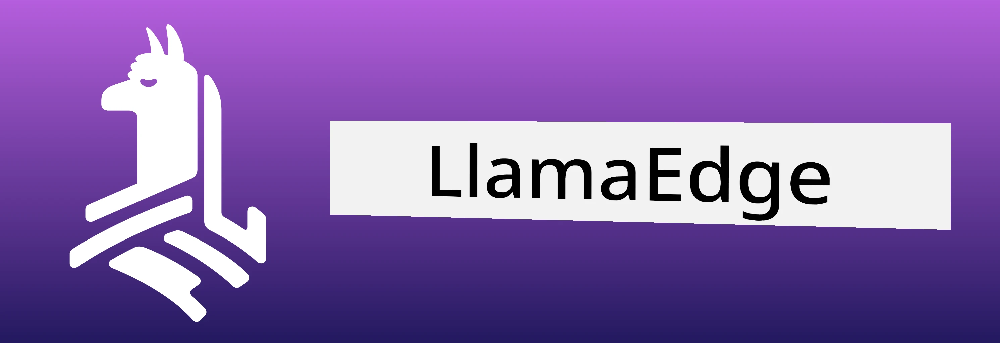
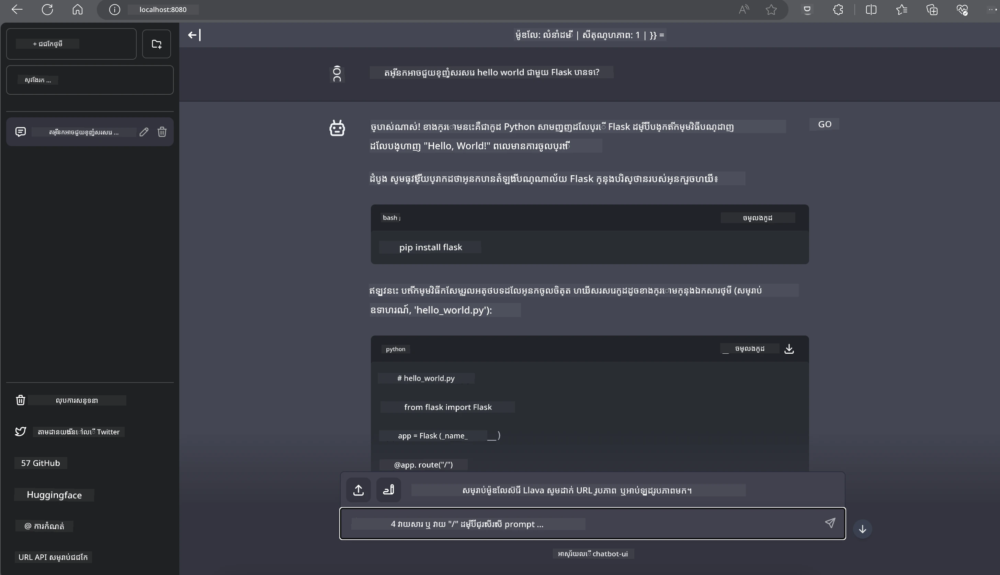

# **Inference Phi-3 នៅលើ Nvidia Jetson**

Nvidia Jetson គឺជាស៊េរីនៃក្តារគណនាដែលបញ្ចូល (embedded computing boards) មកពី Nvidia. ម៉ូឌែល Jetson TK1, TX1 និង TX2 ទាំងអស់បានផ្ទុកឧបករណ៍ប្រើប្រាស់ Tegra (or SoC) ពី Nvidia ដែលបញ្ចូលអង្គភាពកណ្តាល CPU ដែលមានស្ថាបត្យកម្ម ARM. Jetson គឺជា​ប្រព័ន្ធថាមពលទាប និងបានរចនាឡើងសម្រាប់បង្កើនល្បឿន​ការអនុវត្តកម្មវិធីម៉ាសុីនរៀន (machine learning)។Nvidia Jetson ត្រូវបានប្រើប្រាស់ដោយអ្នកអភិវឌ្ឍវិជ្ជាជីវៈដើម្បីបង្កើតផលិតផល AI ដែលទទួលបានភាពក្លាយលេចធ្លោក្នុងឧស្សាហកម្មទាំងមូល និងដោយនិស្សិត និងអ្នកចាប់អារម្មណ៍សម្រាប់ការសិក្សា AI ដោយផ្លាស់ដៃ និងបង្កើត​គម្រោងអស្ចារ្យៗ។SLM ត្រូវបាន نشر នៅលើឧបករណ៍ edge ដូចជា Jetson ដែលនឹងអនុញ្ញាតឲ្យការអនុវត្តន៍ស្ថិតនៅឡើងល្អប្រសើរឡើងសម្រាប់ស្ថានភាពពកម្ម generative AI ក្នុងឧស្សាហកម្ម។

## Deployment on NVIDIA Jetson:
អ្នកអភិវឌ្ឍដែលកំពុងធ្វើការលើរ៉ូបូទិកស្វយ័ត និងឧបករណ៍បញ្ចូលអាចប្រើប្រាស់ Phi-3 Mini។ ទំហំអវិជ្ជមានរបស់ Phi-3 ធ្វើឲ្យវាសមស្របសម្រាប់ដាក់បង្ហោះនៅចុងដែន (edge deployment)។ ប៉ារ៉ាម៉ែត្រត្រូវបានកំពុងត្រូវបានកែតម្រូវយ៉ាងម៉េចក្រោមការបណ្តុះបណ្តាល ដើម្បីធានានូវភាពនិរន្តរភាពខ្ពស់​ក្នុងចម្លើយ។

### TensorRT-LLM Optimization:
NVIDIA's [TensorRT-LLM library](https://github.com/NVIDIA/TensorRT-LLM?WT.mc_id=aiml-138114-kinfeylo) ធ្វើអុបទីម៉ា (optimize) ការសន្និដ្ឋានម៉ូដែលភាសាធំៗ។ វាសាំទ្រវីនដូ context កែងវែងរបស់ Phi-3 Mini ដែលបង្កើនទាំង throughput និង latency។ ការបង្រៀនបន្ថែមរួមមានបច្ចេកទេសដូចជា LongRoPE, FP8, និង inflight batching។

### Availability and Deployment:
អ្នកអភិវឌ្ឍអាចស្វែងយល់អំពី Phi-3 Mini ជាមួយវិនដូ context 128K នៅ [NVIDIA's AI](https://www.nvidia.com/en-us/ai-data-science/generative-ai/). វាត្រូវបានបញ្ចប់ជារោងការផលិត NVIDIA NIM មួយ គឺជាសេវាមីក្រូ (microservice) មាន API ស្តង់ដារ ដែលអាចដាក់បង្ហោះនៅកន្លែងណាក៏បាន។ បន្ថែមពីនេះ [TensorRT-LLM implementations on GitHub](https://github.com/NVIDIA/TensorRT-LLM)។

 ## **1. Preparation**


a. Jetson Orin NX / Jetson NX

b. JetPack 5.1.2+
   
c. Cuda 11.8
   
d. Python 3.8+

 ## **2. Running Phi-3 in Jetson**

 យើងអាចជ្រើសរើស [Ollama](https://ollama.com) ឬ [LlamaEdge](https://llamaedge.com)

 បើអ្នកចង់ប្រើ gguf នៅក្នុង cloud និងឧបករណ៍ edge ពេលដំបូង LlamaEdge អាចត្រូវបានយល់ថាជា WasmEdge (WasmEdge គឺជា runtime WebAssembly ដែលស្រាល ប្រសិទ្ធភាពខ្ពស់ និងអាចតម្លើងបានយ៉ាងវែងសម្រាប់ cloud native, edge និងកម្មវិធី decentralized។ វាសម្ព័ន្ធល្អសម្រាប់កម្មវិធី serverless, function បញ្ចូល, microservices, smart contracts និងឧបករណ៍ IoT។ អ្នកអាចដាក់បង្ហោះម៉ូដែល quantitative របស់ gguf ទៅឧបករណ៍ edge និង cloud តាមរយៈ LlamaEdge។



Here are the steps to use 

1. Install and download related libraries and files

```bash

curl -sSf https://raw.githubusercontent.com/WasmEdge/WasmEdge/master/utils/install.sh | bash -s -- --plugin wasi_nn-ggml

curl -LO https://github.com/LlamaEdge/LlamaEdge/releases/latest/download/llama-api-server.wasm

curl -LO https://github.com/LlamaEdge/chatbot-ui/releases/latest/download/chatbot-ui.tar.gz

tar xzf chatbot-ui.tar.gz

```

**ចំណាំ**: llama-api-server.wasm and chatbot-ui need to be in the same directory

2. Run scripts in terminal


```bash

wasmedge --dir .:. --nn-preload default:GGML:AUTO:{Your gguf path} llama-api-server.wasm -p phi-3-chat

```

Here is the running result




***កូដគំរូ*** [Phi-3 mini WASM Notebook Sample](https://github.com/Azure-Samples/Phi-3MiniSamples/tree/main/wasm)

សរុប而言 Phi-3 Mini តំណាងឲ្យជាគន្លងមួយក្នុងការកែលម្អម៉ូដែលភាសា ដោយបញ្ចូលប្រសិទ្ធភាព ការយល់ដឹងពីบริบท និងជំនាញអុបទីម៉ីស៍របស់ NVIDIA។ មិនថាអ្នកកំពុងបង្កើតរ៉ូបូទិច ឬកម្មវិធី edge ក៏ដោយ Phi-3 Mini គឺជាឧបករណ៍មានសមត្ថភាពដែលគួរឱ្យយល់ពីវា។

---

<!-- CO-OP TRANSLATOR DISCLAIMER START -->
**ការមិនទទួលខុសត្រូវ**:
ឯកសារនេះត្រូវបានបកប្រែដោយប្រើសេវាកម្មបកប្រែបញ្ញាសិប្បនិម្មិត [Co-op Translator](https://github.com/Azure/co-op-translator)។ ខណៈដែលយើងខិតខំបំពេញភាពត្រឹមត្រូវ សូមយកចិត្តទុកដាក់ថាការបកប្រែដោយស្វ័យប្រវត្តិនេះអាចមានកំហុស ឬមិនទាន់ត្រឹមត្រូវ។ ឯកសារដើមក្នុងភាសាដើមគួរត្រូវបានចាត់ទុកថាជាប្រភពផ្លូវការសម្រាប់យោង។ សម្រាប់ព័ត៌មានសំខាន់ៗ ណែនាំឲ្យប្រើការបកប្រែដោយអ្នកជំនាញមនុស្ស។ យើងមិនទទួលខុសត្រូវចំពោះការយល់ច្រឡំ ឬការបកស្រាយខុសណាមួយដែលកើតមានពីការប្រើប្រាស់ការបកប្រែនេះ។
<!-- CO-OP TRANSLATOR DISCLAIMER END -->