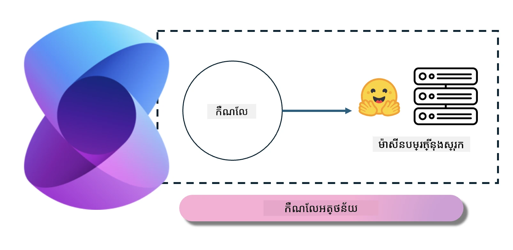
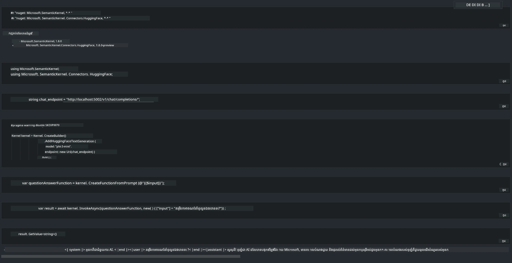

# **Inference Phi-3 នៅលើម៉ាស៊ីនមេក្នុងស្រុក**

យើងអាចដំឡើង Phi-3 លើម៉ាស៊ីនមេក្នុងស្រុក។ អ្នកប្រើអាចជ្រើសរើស [Ollama](https://ollama.com) ឬ [LM Studio](https://llamaedge.com) ដំណោះស្រាយ ឬអាចសរសេរកូដរបស់ពួកគេផ្ទាល់។ អ្នកអាចភ្ជាប់សេវាកម្មក្នុងស្រុករបស់ Phi-3 តាមរយៈ [Semantic Kernel](https://github.com/microsoft/semantic-kernel?WT.mc_id=aiml-138114-kinfeylo) ឬ [Langchain](https://www.langchain.com/) ដើម្បីសាងសង់កម្មវិធី Copilot

## **ប្រើ Semantic Kernel ដើម្បីចូលប្រើ Phi-3-mini**

ក្នុងកម្មវិធី Copilot យើងបង្កើតកម្មវិធីតាមរយៈ Semantic Kernel / LangChain។ រចនាសម្ព័ន្ធកម្មវិធីប្រភេទនេះទូទៅសមស្របជាមួយ Azure OpenAI Service / ម៉ូដែល OpenAI ហើយក៏អាចគាំទ្រម៉ូដែលបើកប្រភពនៅលើ Hugging Face និងម៉ូដែលក្នុងស្រុកបានផងដែរ។ តើយើងគួរធ្វើដូចម្តេច ប្រសិនបើយើងចង់ប្រើ Semantic Kernel ដើម្បីចូលប្រើ Phi-3-mini? យក .NET ជាឧទាហរណ៍ យើងអាចភ្ជាប់វាជាមួយ Hugging Face Connector ក្នុង Semantic Kernel។ លំនាំដើម វាអាចទាក់ទងទៅកាន់ model id លើ Hugging Face (ពេលដំបូងដែលអ្នកប្រើ ម៉ូឌែលនឹងត្រូវបានទាញយកពី Hugging Face ដែលចំណាយពេលយូរ)។ អ្នកក៏អាចភ្ជាប់ទៅសេវាកម្មក្នុងស្រុកដែលបានសាងសង់រួច។ ប្រៀបធៀបពីរជម្រើសនេះ យើងផ្ដល់អនុសាសន៍ឱ្យប្រើជម្រើសទីពីរ ពីព្រោះវាមានកម្រិតឯករាជ្យខ្ពស់ជាង ជាពិសេសក្នុងកម្មវិធីសម្រាប់សហគ្រាស។

ពីរូបភាពនេះ ការ​ចូលប្រើសេវាកម្មក្នុងស្រុកតាមរយៈ Semantic Kernel អាចភ្ជាប់យ៉ាងងាយស្រួលទៅម៉ាស៊ីនបម្រើម៉ូដែល Phi-3-mini ដែលបានសាងសង់ដោយខ្លួនឯង។ នេះជាលទ្ធផលនៃការប្រតិបត្តិ។

***កូដគំរូ*** https://github.com/kinfey/Phi3MiniSamples/tree/main/semantickernel

---

<!-- CO-OP TRANSLATOR DISCLAIMER START -->
**ការមិនទទួលខុសត្រូវ**:
ឯកសារនេះត្រូវបានបកប្រែដោយប្រើសេវាកម្មបកប្រែ AI [Co-op Translator](https://github.com/Azure/co-op-translator)។ ខណៈពេលដែលយើងខិតខំដើម្បីឲ្យមានភាពត្រឹមត្រូវ សូមយកចិត្តទុកដាក់ថាការបកប្រែដោយស្វ័យប្រវត្តិអាចមានកំហុស ឬមិនត្រឹមត្រូវ។ ឯកសារដើមក្នុងភាសាមាតុភូមិគួរត្រូវបានចាត់ទុកជាប្រភពដើមដែលអាចទុកចិត្តបាន។ សម្រាប់ព័ត៌មានសំខាន់ៗ សូមពិចារណាការបកប្រែដោយមនុស្សជំនាញ។ យើងមិនទទួលខុសត្រូវចំពោះការយល់ច្រឡំ ឬការ​បកស្រាយខុសណាមួយ ដែលកើតឡើងពីការប្រើប្រាស់ការបកប្រែនេះ។
<!-- CO-OP TRANSLATOR DISCLAIMER END -->