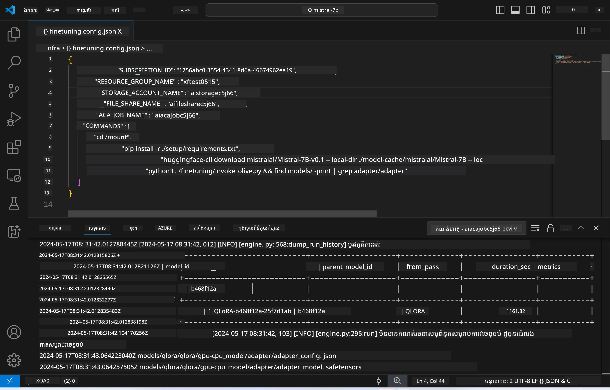
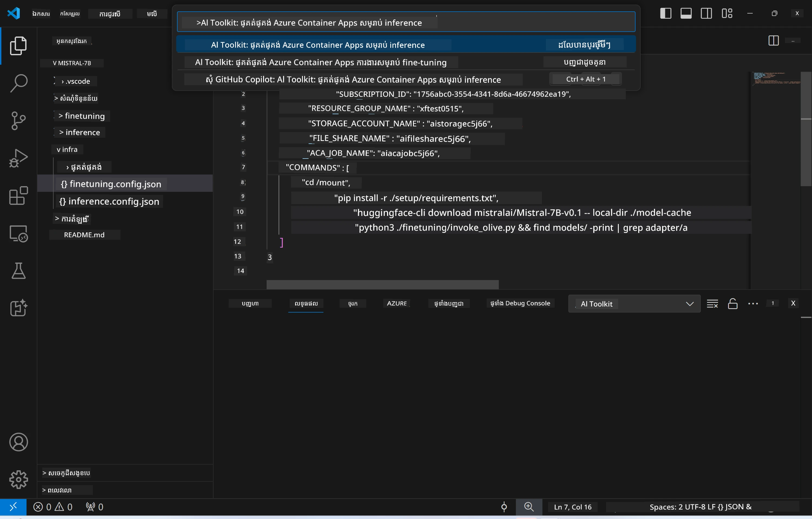
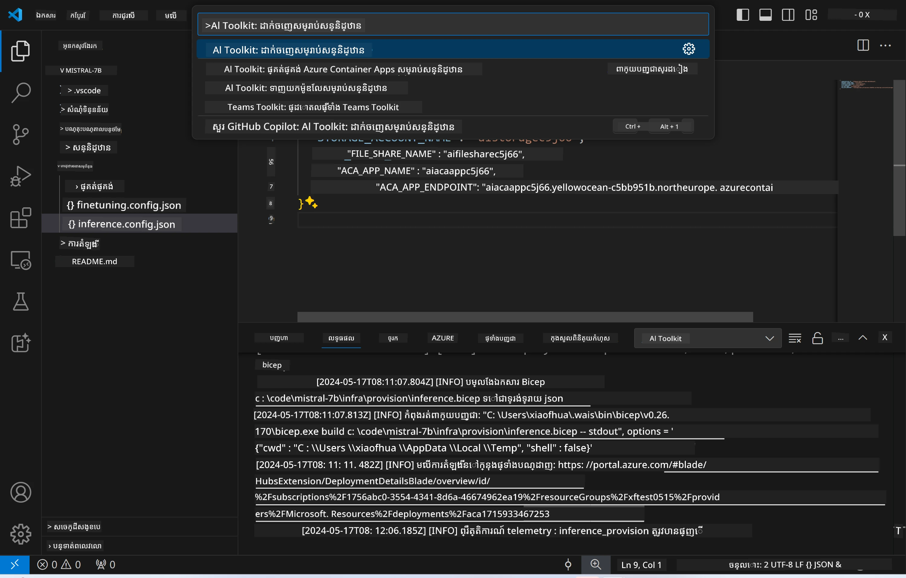
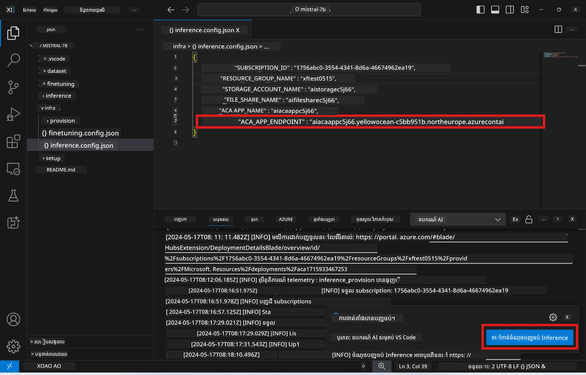

# ការជំហានចម្ងាយជាមួយម៉ូដែលដែលបានតំរូវលំអិត

បន្ទាប់ពីបានបណ្តុះបណ្តាល adapters ក្នុងបរិយាកាសចម្ងាយ ដោយប្រើកម្មវិធី Gradio ងាយស្រួលដើម្បីអន្តរកម្មជាមួយម៉ូដែល។



### ការផ្គត់ផ្គង់ធនធាន Azure  
អ្នកត្រូវតែបង្កើត Azure Resources សម្រាប់ការជំហានចម្ងាយដោយអនុវត្ត `AI Toolkit: Provision Azure Container Apps for inference` ចេញពីប៉ាឡែតបញ្ជា។ ក្នុងដំណាក់កាលនេះ អ្នកនឹងត្រូវខ្នាប់ជ្រើសរើស ការជាវ Azure របស់អ្នក និងក្រុមធនធាន។  

   
ដោយលំនាំដើម ការជាវ និងក្រុមធនធានសម្រាប់ការជំហានគួរតែផ្គូផ្គងនឹងដែលបានប្រើសម្រាប់ការតំរូវលំអិត។ ការជំហាននឹងប្រើពិភព Azure Container App តែមួយ និងចូលប្រើម៉ូដែល និងម៉ូដែល adapter ដែលបានរក្សាទុកក្នុង Azure Files ដែលបានបង្កើតក្នុងដំណាក់កាលតំរូវលំអិត។

## ការប្រើប្រាស់ AI Toolkit

### ការបង្ហោះសម្រាប់ការជំហាន  
ប្រសិនបើអ្នកចង់កែប្រែcode សម្រាប់ការជំហាន ឬផ្ទុកឡើងវិញម៉ូដែលការជំហាន សូមអនុវត្តបញ្ជា `AI Toolkit: Deploy for inference` ។ នេះនឹងសម្របសម្រួលកម្មវិធីថ្មីរបស់អ្នកជាមួយ ACA និងចាប់ផ្តើមឡើងវិញ replica។  



បន្ទាប់ពីការបង្ហោះបានសម្រេចដោយជោគជ័យ ម៉ូដែលនេះរួចរាល់សម្រាប់ការប៉ាន់ប្រមាណតាមរយៈ endpoint នេះ។

### ការចូលប្រើ API សម្រាប់ការជំហាន

អ្នកអាចចូលប្រើ API សម្រាប់ជំហាន ដោយចុចប៊ូតុង "*Go to Inference Endpoint*" ដែលបង្ហាញនៅ​ក្នុងការជូនដំណឹង VSCode។ ជាជម្រើសផ្សេងទៀត អ្នកអាចរកប្រភព endpoint នេះនៅក្រោម `ACA_APP_ENDPOINT` ក្នុង `./infra/inference.config.json` និងក្នុងផ្ទាំងលទ្ធផល។



> **សេចក្ដីណែនាំ៖** Endpoint សម្រាប់ការជំហានអាចត្រូវការយកពេលប៉ុន្មាននាទីចំនួនមុននឹងដំណើរការពេញលេញ។

## ឯកត្តាដែលមាននៅក្នុងទំព័រគំរូសម្រាប់ការជំហាន

| ថត | មាតិកា |
| ------ |--------- |
| `infra` | មានការកំណត់ទាំងអស់ដែលចាំបាច់សម្រាប់ប្រតិបត្ដិការចម្ងាយ។ |
| `infra/provision/inference.parameters.json` | រួមបញ្ចូលប៉ារ៉ាម៉ែត សម្រាប់គំរូ bicep ដែលប្រើសម្រាប់ផ្គត់ផ្គង់ធនធាន Azure សម្រាប់ការជំហាន។ |
| `infra/provision/inference.bicep` | រួមបញ្ចូលគំរូសម្រាប់ផ្គត់ផ្គង់ធនធាន Azure សម្រាប់ការជំហាន។ |
| `infra/inference.config.json` | ហ៊ុមបញ្ជាកម្មវិធី ដែលបានបង្កើតដោយបញ្ជា `AI Toolkit: Provision Azure Container Apps for inference`។ វាត្រូវបានប្រើជាអ្នកចេញបញ្ជាសម្រាប់ប៉ាឡែតបញ្ជាជំហានចម្ងាយផ្សេងទៀត។ |

### ការប្រើប្រាស់ AI Toolkit សម្រាប់កំណត់ការផ្គត់ផ្គង់ធនធាន Azure  
កំណត់ត្រា [AI Toolkit](https://marketplace.visualstudio.com/items?itemName=ms-windows-ai-studio.windows-ai-studio)

បញ្ជា `Provision Azure Container Apps for inference`។

អ្នកអាចរកប៉ារ៉ាម៉ែតកំណត់នៅក្នុងឯកសារ `./infra/provision/inference.parameters.json`។ មានព័ត៌មាន如下៖  
| ប៉ារ៉ាម៉ែត | ពណ៌នា |
| --------- |------------ |
| `defaultCommands` | ជាបញ្ជានាំទៅដំណើរការ web API។ |
| `maximumInstanceCount` | ប៉ារ៉ាម៉ែតនេះកំណត់កម្រិតអតិបរមារបស់ instance GPU ។ |
| `location` | ជាទីតាំងដែលធនធាន Azure ត្រូវបានផ្គត់ផ្គង់។ តម្លៃលំនាំដើមគឺជាទីតាំង​នៃក្រុមធនធានដែលបានជ្រើសរើស។ |
| `storageAccountName`, `fileShareName` `acaEnvironmentName`, `acaEnvironmentStorageName`, `acaAppName`,  `acaLogAnalyticsName` | ប៉ារ៉ាម៉ែតទាំងនេះប្រើបញ្ចូលឈ្មោះផ្សេងៗសម្រាប់ធនធាន Azure ដែលត្រូវផ្គត់ផ្គង់។ ដោយលំនាំដើម វានឹងដូចនឹងឈ្មោះធនធានសម្រាប់ការតំរូវលំអិត។ អ្នកអាចបញ្ចូលឈ្មោះធនធានថ្មី មិនបានប្រើទេ ដើម្បីបង្កើតធនធានឈ្មោះផ្ទាល់ខ្លួន រឺបញ្ចូលឈ្មោះធនធាន Azure ដែលមានស្រាប់ ប្រសិនបើចង់ប្រើវា។ សម្រាប់ព័ត៌មានលម្អិត សូមយោងទៅមើលផ្នែក [Using existing Azure Resources](#ការប្រើប្រាស់ធនធាន-azure-ដែលមានស្រាប់)។ |

### ការប្រើប្រាស់ធនធាន Azure ដែលមានស្រាប់

ដោយលំនាំដើម ការ​ផ្គត់ផ្គង់សម្រាប់ការជំហានប្រើពិភព Azure Container App Environment ដូចគ្នា អាសយដ្ឋានផ្ទុកទិន្នន័យ Storage Account អង្គចែករំលែក Azure File Share និង Azure Log Analytics ដែលបានប្រើសម្រាប់ការតំរូវលំអិត។ Azure Container App ផ្សេងទៀតត្រូវបានបង្កើតសម្រាប់ API ជំហាននេះតែមួយ។

ប្រសិនបើអ្នកបានប្តូរតំរូវធនធាន Azure ក្នុងដំណាក់កាលតំរូវលំអិត ឬចង់ប្រើធនធាន Azure ដែលមានរួចសម្រាប់ការជំហាន សូមបញ្ជូលឈ្មោះ​របស់ពួកវាលើឯកសារ `./infra/inference.parameters.json`។ បន្ទាប់មក អនុវត្តបញ្ជា `AI Toolkit: Provision Azure Container Apps for inference` ពីប៉ាឡែតបញ្ជា។ វានិងបន្ទាន់សម័យធនធានដែលបានបញ្ជាក់ និងបង្កើតធនធានដែលខ្វះ។

ឧទាហរណ៍ ប្រសិនបើអ្នកមានបរិយាកាស Azure Container ដែលមានរួច សូមរកឃើញឯកសារ `./infra/finetuning.parameters.json` របស់អ្នកដូចខាងក្រោម៖

```json
{
    "$schema": "https://schema.management.azure.com/schemas/2019-04-01/deploymentParameters.json#",
    "contentVersion": "1.0.0.0",
    "parameters": {
      ...
      "acaEnvironmentName": {
        "value": "<your-aca-env-name>"
      },
      "acaEnvironmentStorageName": {
        "value": null
      },
      ...
    }
  }
```

### ការផ្គត់ផ្គង់ด้วยដៃ  
ប្រសិនបើអ្នកចង់កំណត់ធនធាន Azure ដោយដៃ អ្នកអាចប្រើឯកសារ bicep ដែលមាននៅក្នុងថត `./infra/provision`។ ប្រសិនបើអ្នកបានកំណត់ និងកំណត់រួចរាល់ធនធាន Azure ទាំងអស់ដោយមិនប្រើប៉ាឡែតបញ្ជា AI Toolkit អ្នកអាចបញ្ចូលឈ្មោះធនធានត្រឹមត្រូវក្នុងឯកសារ `inference.config.json`។

ឧទាហរណ៍៖

```json
{
  "SUBSCRIPTION_ID": "<your-subscription-id>",
  "RESOURCE_GROUP_NAME": "<your-resource-group-name>",
  "STORAGE_ACCOUNT_NAME": "<your-storage-account-name>",
  "FILE_SHARE_NAME": "<your-file-share-name>",
  "ACA_APP_NAME": "<your-aca-name>",
  "ACA_APP_ENDPOINT": "<your-aca-endpoint>"
}
```

---

<!-- CO-OP TRANSLATOR DISCLAIMER START -->
**ការបដិសេធ**៖  
ឯកសារនេះត្រូវបានបកប្រែដោយប្រើសេវាកម្មបកប្រែ AI [Co-op Translator](https://github.com/Azure/co-op-translator)។ ខណៈពេលយើងខិតខំរកភាពត្រឹមត្រូវ សូមយល់ឲ្យបានថាការបកប្រែដោយស្វ័យប្រវត្តិនេះអាចមានកំហុសឬភាពមិនត្រឹមត្រូវមួយចំនួន។ ឯកសារដើមដែលមានភាសាដើមគួរត្រូវបានគេចាត់ទុកជាឯកសារដើមដែលមានអំណាចជាផ្លូវការជាងគេ។ សម្រាប់ព័ត៌មានចំបង សូមផ្ដល់អនុសាសន៍ឲ្យមានការបកប្រែដោយមនុស្សវិជ្ជាជីវៈ។ យើងមិនទទួលបន្ទុកចំពោះការយល់ច្រឡំ ឬការបកប្រែខុសពីការប្រើប្រាស់ការបកប្រែនេះឡើយ។
<!-- CO-OP TRANSLATOR DISCLAIMER END -->