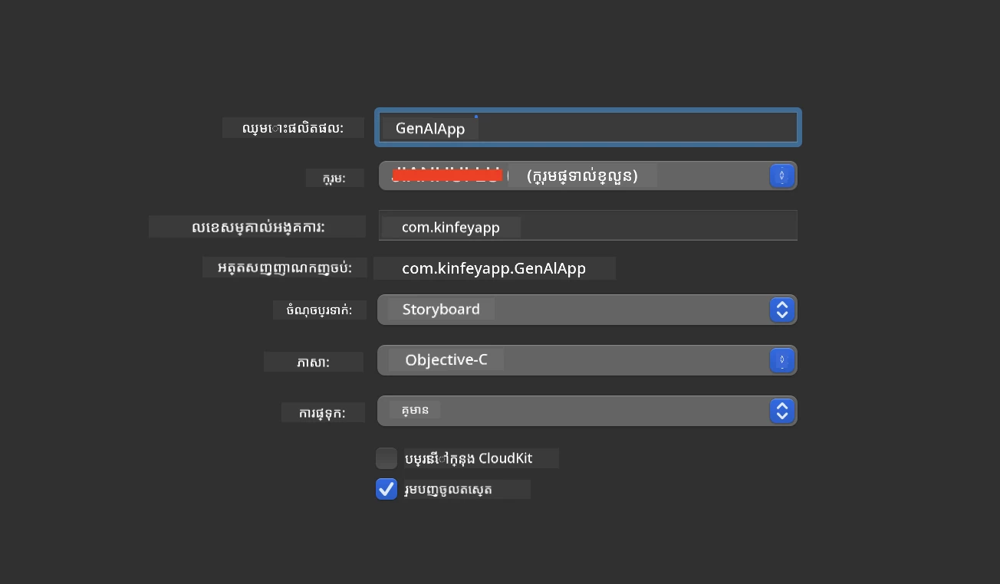
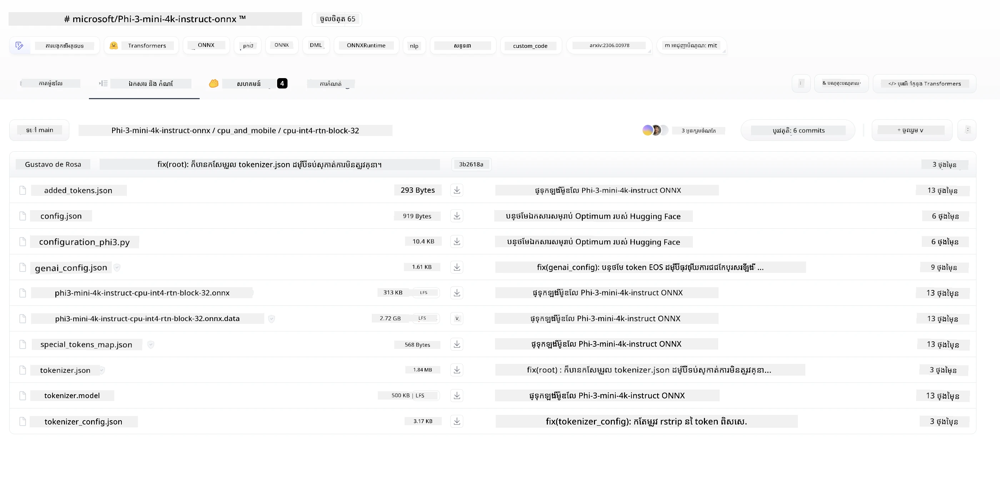
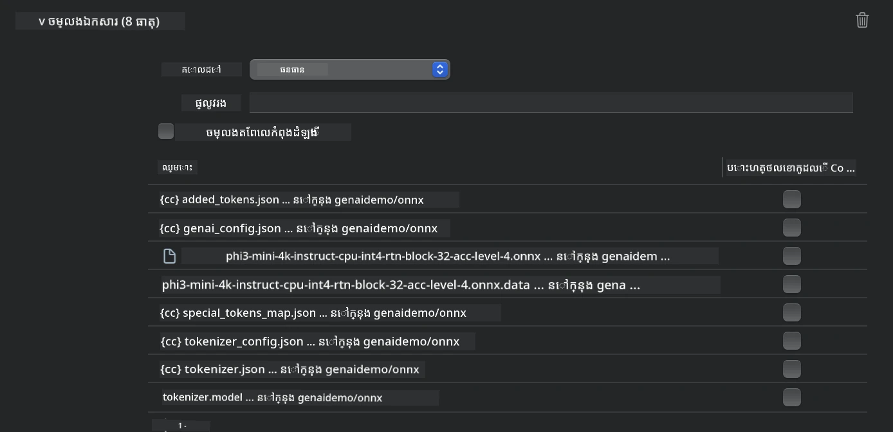
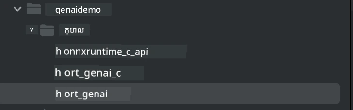
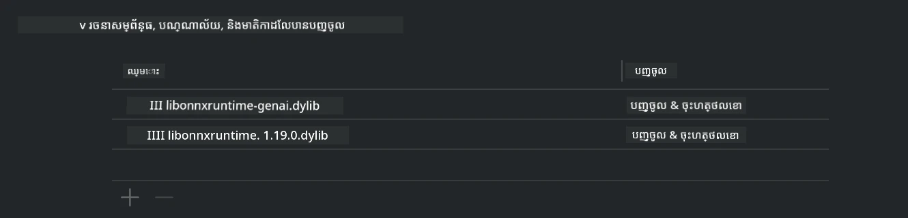
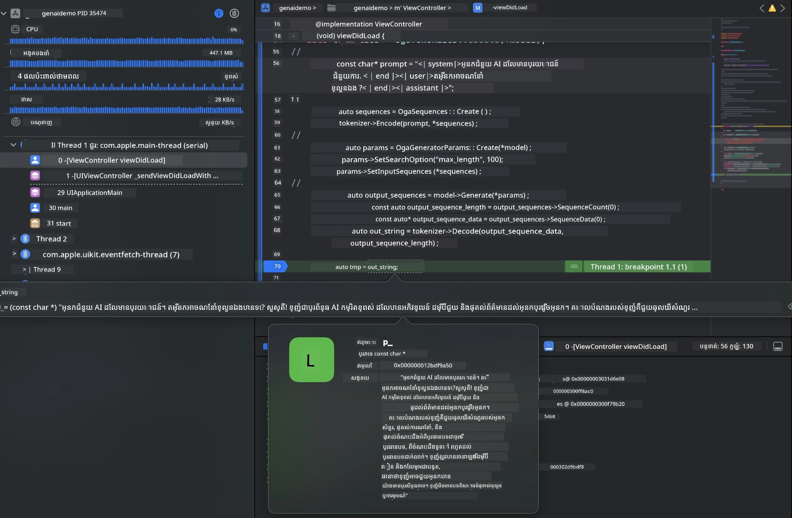

# **ការធ្វើដំណើរការ Phi-3 នៅលើ iOS**

Phi-3-mini គឺជា ស៊េរីម៉ូដែលថ្មីពី Microsoft ដែលអាចអនុញ្ញាតឱ្យដាក់ចេញនូវ Large Language Models (LLMs) លើឧបករណ៍ edge និងឧបករណ៍ IoT។ Phi-3-mini មានសម្រាប់ចាត់តាំងលើ iOS, Android និង Edge Device បាន, អនុញ្ញាតឱ្យ generative AI ត្រូវបានចាត់តាំងនៅក្នុងបរិមណ្ឌល BYOD។ ឧទាហរណ៍ខាងក្រោមបង្ហាញពីវិធីដាក់ចេញ Phi-3-mini លើ iOS។

## **1. ការរៀបចំ**

- **a.** macOS 14+
- **b.** Xcode 15+
- **c.** iOS SDK 17.x (iPhone 14 A16 or greater)
- **d.** តំឡើង Python 3.10+ (ផ្ដល់អាទិភាពប្រើ Conda)
- **e.** តំឡើងបណ្ណាល័យ Python: `python-flatbuffers`
- **f.** តំឡើង CMake

### Semantic Kernel និង ការបរិបូរណ៍

Semantic Kernel គឺជាស៊ុមហ្វ្រេមវើកកម្មវិធី ដែលអនុញ្ញាតឱ្យអ្នកបង្កើតកម្មវិធីដែលមានភាពសមស្របជាមួយ Azure OpenAI Service, ម៉ូដែល OpenAI និងម៉ូដែលក្នុងស្រុកផងដែរ។ ការចូលប្រើសេវាកម្មក្នុងស្រុកតាមរយៈ Semantic Kernel ធ្វើឱ្យការរួមបញ្ចូលជាមួយម៉ាស៊ីនបម្រើម៉ូដែល Phi-3-mini ដែលអ្នកផ្ទាល់គ្រប់គ្រងក្លាយទៅងាយស្រួល។

### ការហៅម៉ូដែល Quantized ជាមួយ Ollama ឬ LlamaEdge

អ្នកប្រើជាច្រើនចូលចិត្តប្រើម៉ូដែលដែលបាន Quantized ដើម្បីរត់ម៉ូដែលនៅក្នុងស្រុក។ [Ollama](https://ollama.com) និង [LlamaEdge](https://llamaedge.com) អនុញ្ញាតឱ្យអ្នកប្រើហៅម៉ូដែល Quantized ផ្សេងៗ៖

#### **Ollama**

អ្នកអាចរត់ `ollama run phi3` ត្រង់ៗ ឬកំណត់រចនាសម្ព័ន្ធវាសម្រាប់ប្រើក្រៅបណ្ដាញ។ បង្កើត Modelfile ដែលមានផ្លូវទៅកាន់ឯកសារ `gguf` របស់អ្នក។ កូដគំរូសម្រាប់រត់ម៉ូដែល Phi-3-mini ដែលបាន Quantized៖

```gguf
FROM {Add your gguf file path}
TEMPLATE \"\"\"<|user|> .Prompt<|end|> <|assistant|>\"\"\"
PARAMETER stop <|end|>
PARAMETER num_ctx 4096
```

#### **LlamaEdge**

បើអ្នកចង់ប្រើ `gguf` នៅទាំង cloud និងឧបករណ៍ edge ពេលតែមួយ, LlamaEdge គឺជាជម្រើសដ៏ល្អ។

## **2. ការចងក្រង ONNX Runtime សម្រាប់ iOS**

```bash

git clone https://github.com/microsoft/onnxruntime.git

cd onnxruntime

./build.sh --build_shared_lib --ios --skip_tests --parallel --build_dir ./build_ios --ios --apple_sysroot iphoneos --osx_arch arm64 --apple_deploy_target 17.5 --cmake_generator Xcode --config Release

cd ../

```

### **សម្គាល់**

- **a.** មុនពេលចងក្រង, សូមធានាថា Xcode ត្រូវបានកំណត់យ៉ាងត្រឹមត្រូវ ហើយបានកំណត់ជា active developer directory នៅក្នុង terminal:

    ```bash
    sudo xcode-select -switch /Applications/Xcode.app/Contents/Developer
    ```

- **b.** ONNX Runtime ត្រូវការចងក្រងសម្រាប់វេទិកាផ្សេងៗ។ សម្រាប់ iOS អ្នកអាចចងក្រងសម្រាប់ `arm64` ឬ `x86_64`។

- **c.** សូមណែនាំឱ្យប្រើ iOS SDK ថ្មីបំផុតសម្រាប់ការចងក្រង។ ទោះយ៉ាងណាក៏ដោយ អ្នកក៏អាចប្រើកំណែចាស់ជាងនេះបាន បើអ្នកត្រូវការសមហត្ថភាពជាមួយ SDK មុនៗ។

## **3. ការចងក្រង Generative AI ជាមួយ ONNX Runtime សម្រាប់ iOS**

> **សេចក្ដីសម្គាល់:** ពីព្រោះ Generative AI ជាមួយ ONNX Runtime កំពុងនៅក្នុងជំណ 단계 preview, សូមប្រយ័ត្នចំពោះការផ្លាស់ប្តូរអាចកើតឡើង។

```bash

git clone https://github.com/microsoft/onnxruntime-genai
 
cd onnxruntime-genai
 
mkdir ort
 
cd ort
 
mkdir include
 
mkdir lib
 
cd ../
 
cp ../onnxruntime/include/onnxruntime/core/session/onnxruntime_c_api.h ort/include
 
cp ../onnxruntime/build_ios/Release/Release-iphoneos/libonnxruntime*.dylib* ort/lib
 
export OPENCV_SKIP_XCODEBUILD_FORCE_TRYCOMPILE_DEBUG=1
 
python3 build.py --parallel --build_dir ./build_ios --ios --ios_sysroot iphoneos --ios_arch arm64 --ios_deployment_target 17.5 --cmake_generator Xcode --cmake_extra_defines CMAKE_XCODE_ATTRIBUTE_CODE_SIGNING_ALLOWED=NO

```

## **4. បង្កើតកម្មវិធី App ក្នុង Xcode**

ខ្ញុំបានជ្រើស Objective-C ជាវិធីអភិវឌ្ឍកម្មវិធី App ព្រោះពេលប្រើ Generative AI ជាមួយ ONNX Runtime C++ API, Objective-C មានភាពឆបគ្នាល្អជាង។ ច្បាស់ណាស់ អ្នកក៏អាចបំពេញការហៅទាក់ទងតាមរយៈ Swift bridging បានផងដែរ។



## **5. ចម្លងម៉ូដែល ONNX ដែលបាន Quantize INT4 ទៅក្នុងគម្រោងកម្មវិធី App**

យើងត្រូវនាំចូលម៉ូឌែល Quantization INT4 ជាទ្រង់ទ្រាយ ONNX ដែលត្រូវទាញយកមុន



បន្ទាប់ពីទាញយក អ្នកត្រូវបន្ថែមវាទៅក្នុងថត Resources នៃគម្រោងនៅក្នុង Xcode។



## **6. ការបញ្ចូល C++ API ទៅក្នុង ViewControllers**

> **សម្គាល់:**

- **a.** បន្ថែមឯកសារ header C++ និយមទៅក្នុងគម្រោង។

  

- **b.** បញ្ចូលបណ្ណាល័យ dynamic `onnxruntime-genai` ទៅក្នុង Xcode។

  

- **c.** ប្រើកូដ C Samples សម្រាប់ការធ្វើតេស្ត។ អ្នកក៏អាចបន្ថែមមុខងារបន្ថែមដូចជា ChatUI សម្រាប់មុខងារកាន់តែច្រើន។

- **d.** ព្រោះអ្នកត្រូវប្រើ C++ ក្នុងគម្រោងរបស់អ្នក សូមប្ដូរឈ្មោះ `ViewController.m` ទៅ `ViewController.mm` ដើម្បីបើកការគាំទ្រ Objective-C++។

```objc

    NSString *llmPath = [[NSBundle mainBundle] resourcePath];
    char const *modelPath = llmPath.cString;

    auto model =  OgaModel::Create(modelPath);

    auto tokenizer = OgaTokenizer::Create(*model);

    const char* prompt = "<|system|>You are a helpful AI assistant.<|end|><|user|>Can you introduce yourself?<|end|><|assistant|>";

    auto sequences = OgaSequences::Create();
    tokenizer->Encode(prompt, *sequences);

    auto params = OgaGeneratorParams::Create(*model);
    params->SetSearchOption("max_length", 100);
    params->SetInputSequences(*sequences);

    auto output_sequences = model->Generate(*params);
    const auto output_sequence_length = output_sequences->SequenceCount(0);
    const auto* output_sequence_data = output_sequences->SequenceData(0);
    auto out_string = tokenizer->Decode(output_sequence_data, output_sequence_length);
    
    auto tmp = out_string;

```

## **7. ការរត់កម្មវិធី**

ពេលរាល់ការរៀបចំបានបញ្ចប់ អ្នកអាចរត់កម្មវិធី ដើម្បីមើលលទ្ធផលនៃការបរិបូរណ៍ម៉ូឌែល Phi-3-mini។



សម្រាប់កូដគំរូបន្ថែម និងសេចក្តីណែនាំលម្អិត ចូលទស្សនាឃ្លាំង [Phi-3 Mini Samples repository](https://github.com/Azure-Samples/Phi-3MiniSamples/tree/main/ios).

---

<!-- CO-OP TRANSLATOR DISCLAIMER START -->
**ការបដិសេធ**:
ឯកសារនេះត្រូវបានបកប្រែដោយប្រើសេវាកម្មបកប្រែដោយបច្ចេកវិទ្យា AI [Co-op Translator](https://github.com/Azure/co-op-translator)។ ខណៈពេលយើងខិតខំប្រឹងប្រែងដើម្បីទិន្នផលដែលត្រឹមត្រូវ សូមយកចិត្តទុកដាក់ថាការបកប្រែដោយស្វ័យប្រវត្តិអាចមានកំហុស ឬភាពមិនត្រឹមត្រូវ។ ឯកសារដើមដែលសរសេរជាភាសានាទីដើមគួរត្រូវបានចាត់ទុកថាជាប្រភពចម្បង។ សម្រាប់ព័ត៌មានសំខាន់ៗ យើងផ្តល់អនុសាសន៍ឱ្យប្រើការបកប្រែដោយអ្នកបកប្រែវិជ្ជាជីវៈ។ យើងមិនទទួលខុសត្រូវចំពោះការយល់ច្រឡំ ឬការបកស្រាយខុសៗណាដែលកើតឡើងពីការប្រើប្រាស់ការបកប្រែនេះទេ។
<!-- CO-OP TRANSLATOR DISCLAIMER END -->