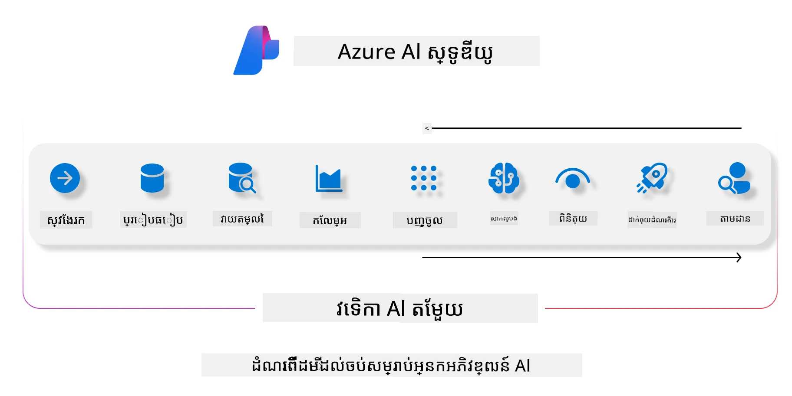
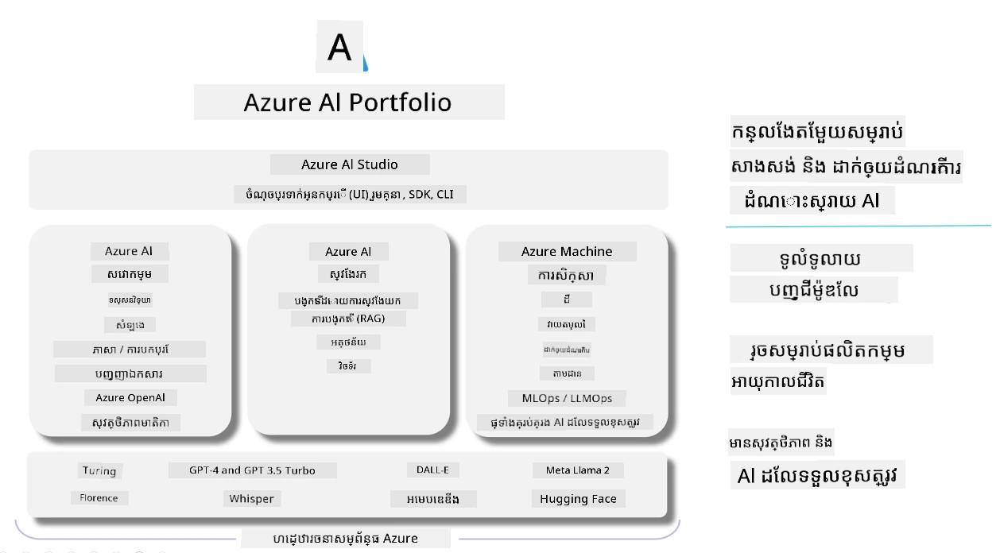

# **ការប្រើប្រាស់ Microsoft Foundry ដើម្បីវាយតម្លៃ**

វិធីវាយតម្លៃកម្មវិធី AI បង្កើតរបស់អ្នកដោយប្រើ [Microsoft Foundry](https://ai.azure.com?WT.mc_id=aiml-138114-kinfeylo)។ មិនថាអ្នកកំពុងវាយតម្លៃការពិភាក្សាមួយដងឬច្រើនដងទេ Microsoft Foundry ផ្ដល់ឧបករណ៍សម្រាប់វាយតម្លៃកម្រិតសមត្ថភាពម៉ូដែល និងសុវត្ថិភាព។

## វិធីវាយតម្លៃកម្មវិធី AI បង្កើតជាមួយ Microsoft Foundry
សម្រាប់ការណែនាំលម្អិតបន្ថែម សូមមើល [ឯកសារ Microsoft Foundry Documentation](https://learn.microsoft.com/azure/ai-studio/how-to/evaluate-generative-ai-app?WT.mc_id=aiml-138114-kinfeylo)

នេះជាជំហានដើម្បីចាប់ផ្ដើម៖

## វាយតម្លៃម៉ូដែល AI បង្កើតនៅក្នុង Microsoft Foundry

**លក្ខខណ្ឌជាមុន**

- សំណុំទិន្នន័យសាកល្បងទ្រង់ទ្រាយ CSV ឬ JSON ។
- ម៉ូដែល AI បង្កើតបានដាក់ឲ្យដំណើរការ (ដូចជា Phi-3, GPT 3.5, GPT 4, ឬម៉ូដែល Davinci)។
- runtime ជាមួយកុំព្យូទ័រមួយសម្រាប់ menjalankan ការវាយតម្លៃ។

## កម្រិតវាយតម្លៃស្រាប់ក្នុងប្រព័ន្ធ

Microsoft Foundry អនុញ្ញាតឲ្យអ្នកវាយតម្លៃការពិភាក្សាដំណាក់កាលតែមួយ និងច្រើនដំណាក់កាលដ៏ស្មុគស្មាញ។
សម្រាប់ស្ថានភាព Retrieval Augmented Generation (RAG) ដែលម៉ូដែលមានមូលដ្ឋានលើទិន្នន័យជាក់លាក់ អ្នកអាចវាយតម្លៃការសមត្ថភាពដោយប្រើកម្រិតវាយតម្លៃស្រាប់នៅក្នុងប្រព័ន្ធ។
លើសពីនេះ អ្នកអាចវាយតម្លៃសំណួរឆ្លើយតែម្តងដែលមិនមែនជាប្រភេទ RAG បានផងដែរ។

## បង្កើតការប្រតិបត្តិវាយតម្លៃ

ពីចំណុចប្រទាក់ Microsoft Foundry ចូលទៅកាន់ទំព័រ Evaluate ឬ Prompt Flow។
ធ្វើតាមមេរៀនបង្កើតការវាយតម្លៃដើម្បីកំណត់ការប្រតិបត្តិវាយតម្លៃមួយ។ ចូលរួមឈ្មោះជាជម្រើសសម្រាប់ការវាយតម្លៃរបស់អ្នក។
ជ្រើសរើសស្ថានភាពដែលផ្គូរផ្គងនឹងគោលបំណងកម្មវិធីរបស់អ្នក។
ជ្រើសលំនាំវាយតម្លៃមួយឬច្រើនដើម្បីវាយតម្លៃលទ្ធផលម៉ូដែល។

## ជួរសំណល់វាយតម្លៃផ្ទាល់ខ្លួន (ជាជម្រើស)

សម្រាប់ភាពបត់បែនច្រើនជាងនេះ អ្នកអាចបង្កើតជួរសំណល់វាយតម្លៃផ្ទាល់ខ្លួន មើលប្តូរការប្រតិបត្តិការ⸺លក្ខណៈតាមតម្រូវការផ្ទាល់ខ្លួន។

## មើលលទ្ធផល

បន្ទាប់ពីវាយតម្លៃរួច កត់ត្រា មើល និងវិភាគលម្អិតកម្រិតវាយតម្លៃនៅ Microsoft Foundry។ ទទួលបានការយល់ដឹងអំពីសមត្ថភាព និងកម្រិតដាច់ខាតរបស់កម្មវិធីរបស់អ្នក។

**ចំណាំ** Microsoft Foundry កំពុងនៅក្នុងជំហានបង្ហាញសាធារណៈ ដូច្នេះប្រើសម្រាប់ការសាកល្បងនិងការអភិវឌ្ឍប៉ុណ្ណោះ។ សម្រាប់ការងារផលិតកម្ម សូមពិចារណជម្រើសផ្សេងទៀត។ សូមស្វែងយល់បន្ថែមក្នុង [ឯកសារ AI Foundry ផ្លូវការជាផ្លូវការ](https://learn.microsoft.com/azure/ai-studio/?WT.mc_id=aiml-138114-kinfeylo) ដើម្បីបានការណែនាំលម្អិត និងជំហាន។

---

<!-- CO-OP TRANSLATOR DISCLAIMER START -->
**ចាកចេញពីច្បាប់**៖  
ឯកសារនេះត្រូវបានបកប្រែដោយប្រើសេវាកម្មបកប្រែ AI [Co-op Translator](https://github.com/Azure/co-op-translator) ។ ខណៈពេលយើងខិតខំឲ្យមានភាពត្រឹមត្រូវ សូមជ្រាបថាការបកប្រែដោយស្វ័យប្រវត្តិអាចមានកំហុសឬការមិនត្រឹមត្រូវ។ ឯកសារដើមជាភាសាម្ចាស់ដើមគួរត្រូវបានគេចាត់ទុកជាដើមទុនដែលមានសុពលភាព។ សម្រាប់ព័ត៌មានសំខាន់ ទស្សនៈបកប្រែដោយមនុស្សជំនាញជាប្រសើរជាង។ យើងមិនទទួលខុសត្រូវចំពោះការយល់ច្រឡំ ឬការបកស្រាយខុសដែលកើតឡើងពីការប្រើប្រាស់ការបកប្រែនេះទេ។
<!-- CO-OP TRANSLATOR DISCLAIMER END -->