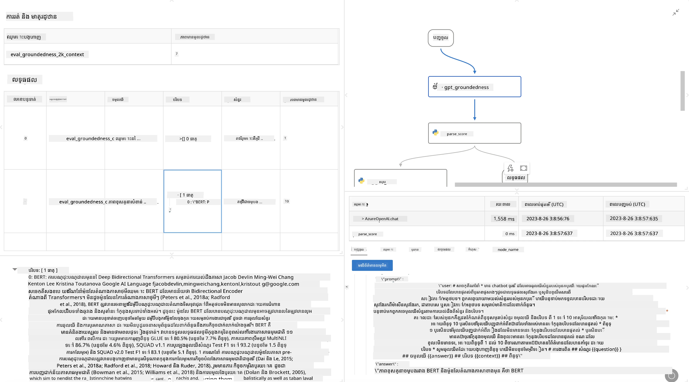

# **ណែនាំអំពី Promptflow**

[Microsoft Prompt Flow](https://microsoft.github.io/promptflow/index.html?WT.mc_id=aiml-138114-kinfeylo) គឺជាឧបករណ៍ស្វ័យប្រវត្តិតាមចរន្តការងារមួយដែលមានរូបភាព ដើម្បីអនុញ្ញាតឱ្យអ្នកប្រើប្រាស់បង្កើតចរន្តការងារស្វ័យប្រវត្តិដោយប្រើប្លង់ដែលបានបង្កើតរួច និងខ្សែតភ្ជាប់ផ្ទាល់ខ្លួន។ វាត្រូវបានរចនាឡើងដើម្បីឱ្យអ្នកអភិវឌ្ឍន៍ និងអ្នកវិភាគអាជីវកម្មអាចបង្កើតដំណើរការស្វ័យប្រវត្តិបានយ៉ាងរហ័សសម្រាប់ការងារដូចជា ការគ្រប់គ្រងទិន្នន័យ ការសហការនិងការបង្កើតដំណើរការអភិវឌ្ឍន៍។ ជាមួយ Prompt Flow អ្នកប្រើប្រាស់អាចភ្ជាប់សេវាកម្ម កម្មវិធី និងប្រព័ន្ធផ្សេងៗ ហើយស្វ័យប្រវត្តិដំណើរការអាជីវកម្មស្មុគស្មាញបានយ៉ាងងាយស្រួល។

Microsoft Prompt Flow ត្រូវបានរចនាឡើងដើម្បីងាយស្រួលក្នុងដំណើរការអភិវឌ្ឍន៍ពីដើមដល់ចុងនៃកម្មវិធី AI ដែលមានមូលដ្ឋានលើគំរូភាសាធំនានា (LLMs)។ មិនថាអ្នកកំពុងមានគំនិត ការសាកល្បង ការបង្ហាញ ការវាយតម្លៃ ឬការដាក់បញ្ចូលកម្មវិធីដែលមានមូលដ្ឋានលើ LLMs កម្មវិធី Prompt Flow ក៏បញ្ជាក់ឲ្យដំណើរការដែលងាយស្រួល និងអនុញ្ញាតឲ្យអ្នកបង្កើតកម្មវិធី LLM ដែលមានគុណភាពផលិតកម្ម។

## ទាំងនេះជាចំណុចសំខាន់ និងអត្ថប្រយោជន៍នៃការប្រើប្រាស់ Microsoft Prompt Flow៖

**បទពិសោធន៍ការសរសេរបង្កើតអន្តរកម្ម**

Prompt Flow ផ្តល់ឱ្យនូវការតំណាងតាមរូបភាពនៃរចនាសម្ព័ន្ធចរន្តរបស់អ្នក ដែលធ្វើឲ្យវាងាយស្រួលក្នុងការយល់ដឹង និងរុករកគម្រោងរបស់អ្នក។  
វាប្រមូលផ្តុំបទពិសោធន៍សរសេរកូដដូចសៀវភៅកំណត់ត្រា ដើម្បីអភិវឌ្ឍ និងដោះស្រាយកំហុសចរន្តបានយ៉ាងមានប្រសិទ្ធភាព។

**បំរើបែបផ្សេងៗនៃការបញ្ចូល និងការតំរូវតំរូវ**

បង្កើត និងប្រៀបធៀបបែបផ្សេងៗនៃការបញ្ចូល ដើម្បីជួយដំណើរការជំហានកែសម្រួលជាបន្តបន្ទាប់។  
វាយតម្លៃការសម្តែងនៃបែបផ្សេងៗនៃការបញ្ចូល ហើយជ្រើសរើសដែលមានប្រសិទ្ធភាពបំផុត។

**ចរន្តវាយតម្លៃដំរី**

វាយតម្លៃគុណភាព និងភាពមានប្រសិទ្ធភាពនៃបញ្ចូល និងចរន្តដោយប្រើឧបករណ៍វាយតម្លៃដំរីដែលបានបង្កើតរួច។  
យល់ដឹងពីរបៀបដែលកម្មវិធី LLM របស់អ្នកកំពុងបង្ហាញសមត្ថភាព។

**ធនធានពេញលេញ**

Prompt Flow រួមបញ្ចូលបណ្ណាល័យឧបករណ៍ បំណត្ឋ និងប្លង់ដែលបានបង្កើតរួច។ ធនធានទាំងនេះជាជំហានដំបូងសម្រាប់ការអភិវឌ្ឍ ការបញ្ចុះបញ្ចូលភាពច្នៃប្រឌិត និងបន្ថែមល្បឿននៃដំណើរការណ៍។

**ការសហការនិងត្រៀមខ្លួនសម្រាប់សហគ្រាស**

គាំទ្រការសហការលើក្រុមដោយអនុញ្ញាតឱ្យអ្នកប្រើប្រាស់ច្រើនអាចធ្វើការងារជាមួយគ្នាលើគម្រោងវិស្វកម្មបញ្ចូល។  
រក្សាការត្រួតពិនិត្យកំណែ និងចែករំលែកចំណេះដឹងយ៉ាងមានប្រសិទ្ធភាព។ ស្រួលបន្ថែមដំណើរការវិស្វកម្មបញ្ចូលទាំងមូល ពីការអភិវឌ្ឍ វាយតម្លៃ ដល់ការដាក់បញ្ចូល និងតាមដាន។

## ការវាយតម្លៃនៅក្នុង Prompt Flow

នៅក្នុង Microsoft Prompt Flow ការវាយតម្លៃមានតួនាទីសំខាន់ក្នុងការវាយតម្លៃថាគំរូ AI របស់អ្នកអាចបញ្ចេញលទ្ធផលបានល្អប៉ុណ្ណា។ មក​ស្វែង​យល់ពីរបៀបអ្នកអាចប្តូរចរន្តវាយតម្លៃ និងវិមាត្រនៅក្នុង Prompt Flow៖

**ការយល់ដឹងអំពីការវាយតម្លៃនៅក្នុង Prompt Flow**

នៅក្នុង Prompt Flow ចរន្តតំណាងឲ្យជាក្រុមនៃចំណុចដែលដំណើរការបញ្ចូលហើយបង្កើតចេញលទ្ធផល។ ចរន្តវាយតម្លៃគឺជាប្រភេទចរន្តពិសេសដែលរចនាឡើងសម្រាប់វាយតម្លៃការសម្តែងនៃការប្រតិបត្ដិការដោយផ្អែកលើវាយតម្លៃជាក់លាក់ និងគោលបំណង។

**លក្ខណៈសំខាន់នៃចរន្តវាយតម្លៃ**

វាលែងរត់បន្ទាប់ពីចរន្តដែលបានសាកល្បងដោយប្រើលទ្ធផលរបស់វា។ វាគណនាពិន្ទុ ឬវិមាត្រដើម្បីវាយតម្លៃការសម្តែងនៃចរន្តដែលបានសាកល្បង។ វិមាត្រអាចរួមមានភាពត្រឹមត្រូវ ពិន្ទុសមត្ថភាព ឬវិមាត្រផ្សេងទៀតដែលពាក់ព័ន្ធ។

### ការប្តូរចរន្តវាយតម្លៃ

**កំណត់បញ្ចូល**

ចរន្តវាយតម្លៃត្រូវការទទួលបញ្ចូលនៃលទ្ធផលពីរត្វិនដែលបានសាកល្បង។ កំណត់បញ្ចូលដូចជាចរន្តស្តង់ដារ។  
ឧទាហរណ៍ ប្រសិនបើអ្នកកំពុងវាយតម្លៃចរន្ត QnA ឈ្មោះបញ្ចូលមួយគឺ "answer"។ ប្រសិនបើវាយតម្លៃចរន្តចាត់ថ្នាក់ឈ្មោះបញ្ចូលមួយគឺ "category"។ ការបញ្ចូលតំណត់ត្រឹមត្រូវ (ឧ. ស្លាកពិត) ក៏អាចត្រូវបានទាមទារផងដែរ។

**លទ្ធផល និងវិមាត្រ**

ចរន្តវាយតម្លៃបង្កើតលទ្ធផលដែលវាស់សមត្ថភាពនៃចរន្តដែលបានសាកល្បង។ វិមាត្រអាចគណនាបានជាមួយ Python ឬ LLM (គំរូភាសាធំនានា)។ ប្រើមុខងារ log_metric() ដើម្បីកំណត់បរិមាណវិមាត្រដែលពាក់ព័ន្ធ។

**ការប្រើប្រាស់ចរន្តវាយតម្លៃដែលបានប្តូរតាមតម្រូវការ**

អភិវឌ្ឍចរន្តវាយតម្លៃផ្ទាល់ខ្លួនដែលសម្របសម្រួលសម្រាប់ភារកិច្ច និងគោលបំណងជាក់លាក់របស់អ្នក។ ប្តូរវិមាត្រតាមគោលបំណងវាយតម្លៃរបស់អ្នក។  
អនុវត្តចរន្តវាយតម្លៃដែលបានប្តូរនេះចំពោះការរត់ជាដុំសម្រាប់ការសាកល្បងទំនើប។

## វិធីសាស្រ្តវាយតម្លៃដែលបានបង្កើតរួច

Prompt Flow ក៏ផ្តល់នូវវិធីសាស្រ្តវាយតម្លៃដែលបានបង្កើតរួចផងដែរ។  
អ្នកអាចដាក់ការរត់ជារបូប និងប្រើវិធីសាស្រ្តទាំងនេះដើម្បីវាយតម្លៃថាចរន្តរបស់អ្នកធ្វើការដំណើរការល្អប៉ុណ្ណា ជាមួយទិន្នន័យធំៗ។  
មើលលទ្ធផលវាយតម្លៃ ប្រៀបធៀបវិមាត្រ និងធ្វើការកែប្រែតាមតម្រូវការ។  
ចងចាំថា ការវាយតម្លៃមានសារសំខាន់សម្រាប់ធានាថាគំរូ AI របស់អ្នកឆ្លើយតបតាមលក្ខខណ្ឌ និងគោលបំណងដែលបានកំណត់។  
សូមស្រាវជ្រាវឯកសារផ្លូវការសម្រាប់ការណែនាំលម្អិតអំពីការអភិវឌ្ឍ និងការប្រើប្រាស់ចរន្តវាយតម្លៃនៅក្នុង Microsoft Prompt Flow។

សង្ខេប Microsoft Prompt Flow ផ្តល់អំណាចដល់អ្នកអភិវឌ្ឍន៍ក្នុងការបង្កើតកម្មវិធី LLM ដែលមានគុណភាពខ្ពស់ ដោយងាយស្រួលក្នុងការវិស្វកម្មបញ្ចូល និងផ្តល់បរិយាកាសអភិវឌ្ឍជាម្រាថ្មោង។ ប្រសិនបើអ្នកកំពុងធ្វើការជាមួយ LLMs Prompt Flow គឺជាឧបករណ៍មានតម្លៃដែលគួរតែស្វែងយល់។  
សូមស្វែងយល់បន្ថែមពី [ឯកសារវាយតម្លៃ Prompt Flow](https://learn.microsoft.com/azure/machine-learning/prompt-flow/how-to-develop-an-evaluation-flow?view=azureml-api-2?WT.mc_id=aiml-138114-kinfeylo) សម្រាប់ការណែនាំលម្អិតអំពីការអភិវឌ្ឍ និងប្រើប្រាស់ចរន្តវាយតម្លៃនៅក្នុង Microsoft Prompt Flow។

---

<!-- CO-OP TRANSLATOR DISCLAIMER START -->
**ការបដិសេធ**៖
ឯកសារនេះត្រូវបានបកប្រែដោយប្រើសេវាកម្មបកប្រែ AI [Co-op Translator](https://github.com/Azure/co-op-translator)។ ទោះយើងខំប្រឹងប្រែងដល់ភាពត្រឹមត្រូវសូមជ្រាបថាការបកប្រែដោយស្វ័យប្រវត្តិអាចមានកំហុស ឬការមិនត្រឹមត្រូវ។ ឯកសារដើមក្នុងភាសាមាតុភាគគួរតែត្រូវបានចាត់ទុកជាដើមទិន្នន័យដែលមានអំណាច។ សម្រាប់ព័ត៌មានសំខាន់ៗ សូមណែនាំឲ្យប្រើការបកប្រែដោយមនុស្សជំនាញវិជ្ជាជីវៈ។ យើងមិនទទួលខុសត្រូវចំពោះការយល់ច្រឡំ ឬការចម្លងអត្ថន័យខុសបន្ទាប់ពីការប្រើប្រាស់ការបកប្រែនេះឡើយ។
<!-- CO-OP TRANSLATOR DISCLAIMER END -->