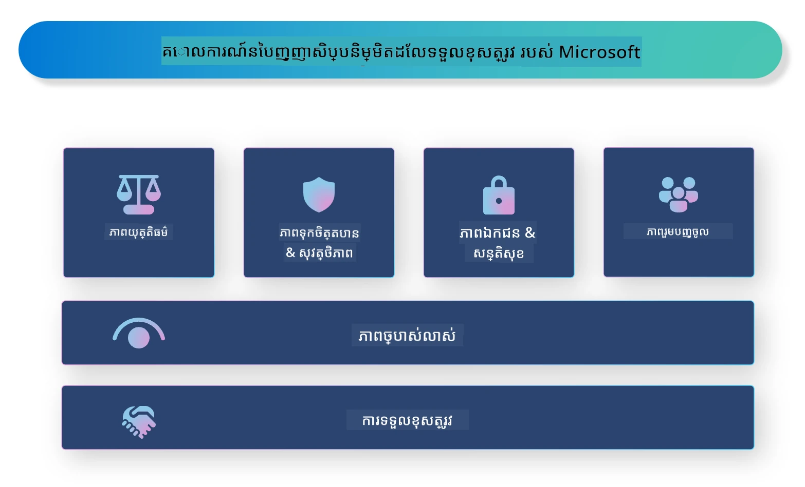

# **ណែនាំអំពី AI ខ្ជាប់ខ្ជួនចំពោះកាតព្វកិច្ច**

[Microsoft Responsible AI](https://www.microsoft.com/ai/responsible-ai?WT.mc_id=aiml-138114-kinfeylo) គឺជាដំណើរការមួយដែលមានគោលបំណងជួយអ្នកអwickនិងអង្គការកសាងប្រព័ន្ធ AI ដែលមានភាពត្រង់ត្រឹម, អាចទុកចិត្តបាន, និងមានការទទួលខុសត្រូវ។ ដំណើរការនេះផ្តល់ការណែនាំ និងធនធានសម្រាប់ការអwickប្រព័ន្ធ AI ខ្ជាប់ខ្ជួនដែលសមរម្យទៅតាមគោលការណ៍សីលធម៌ ដូចជា ការរក្សាបញ្ចេញភាពឯកជន ការយុត្តិធម៌ និងភាពត្រង់ត្រូវ។ យើងនឹងពិនិត្យបញ្ហា និងវិធីសាស្ត្រល្អៗខ្លះៗដើម្បីសាងសង់ប្រព័ន្ធ AI ខ្ជាប់ខ្ជួន។

## ទិដ្ឋភាពទូទៅពី Microsoft Responsible AI

**គោលការណ៍សីលធម៌**

Microsoft Responsible AI ត្រូវបានណែនាំដោយគោលការណ៍សីលធម៌មួយសំណុំ ដូចជា ការរក្សាឯកជន ការយុត្តិធម៌ ភាពត្រង់ត្រូវ ការទទួលខុសត្រូវ និងសុវត្ថិភាព។ គោលការណ៍ទាំងនេះត្រូវបង្កើតឡើងដើម្បីធានាថាប្រព័ន្ធ AI ត្រូវបានអwickដោយមានសីលធម៌ និងមានការទទួលខុសត្រូវ។

**AI ត្រង់ត្រូវ**

Microsoft Responsible AI ផ្តោតសំខាន់លើភាពត្រង់ត្រូវក្នុងប្រព័ន្ធ AI។ វារួមមានការផ្តល់ការពន្យល់ច្បាស់លាស់អំពីរបៀបដែលម៉ូដែល AI ប្រតិបត្តិការ និងធានាថាដាតាដើម និងអាល់ហ្គរីតึមមានការចេញផ្សាយសាធារណៈ។

**AI មានការទទួលខុសត្រូវ**

[Microsoft Responsible AI](https://www.microsoft.com/ai/responsible-ai?WT.mc_id=aiml-138114-kinfeylo) ជំរុញការអwick ប្រព័ន្ធ AI ដែលអាចផ្តល់នូវចំណេះដឹងអំពីរបៀបដែលម៉ូដែល AI ធ្វើការសម្រេចចិត្ត។ វាអាចជួយឲ្យអ្នកប្រើប្រាស់យល់ដឹង និងទុកចិត្តលទ្ធផលនៃប្រព័ន្ធ AI។

**ការរួមបញ្ចូលគ្នា**

ប្រព័ន្ធ AI គួរត្រូវបានរៀបចំឡើងដើម្បីផ្ដល់អត្ថប្រយោជន៍ទៅដល់មនុស្សគ្រប់គ្នា។ Microsoft មានគោលបំណងបង្កើត AI រួមបញ្ចូល ដែលគិតគូរចំពោះមតិផ្សេងៗ និងបង្ហាញការចៀសវាងការរើសអើងឬការរួមបញ្ចូលបណ្តោះអាសន្ន។

**ភាពទុកចិត្ត និងសុវត្ថិភាព**

ការធានាថាប្រព័ន្ធ AI ទុកចិត្តបាន និងមានសុវត្ថិភាពគឺមានសារៈសំខាន់។ Microsoft ផ្តោតលើការសាងសង់ម៉ូដែលមានសមត្ថភាពល្អ ដែលធ្វើការប្រតិបត្តិបានយ៉ាងស្ថិតស្ថេរ និងជៀសវាងលទ្ធផលអាក្រក់។

**យុត្តិធម៌ក្នុង AI**

Microsoft Responsible AI ទទួលស្គាល់ថាប្រព័ន្ធ AI អាចបន្តបង្ហាញការរើសអើង ប្រសិនបើវាត្រូវបានបណ្តុះបណ្តាលលើទិន្នន័យឬអាល់ហ្គរីតិមដែលមានការជ្រើសរើសមិនត្រឹមត្រូវ។ ដំណើរការនេះផ្តល់ការណែនាំសម្រាប់ការអwick AI យុត្តិធម៌ដែលមិនចែកចាយការរើសអើងផ្អែកលើបញ្ហាដូចជាជនជាតិ អភិវឌ្ឍន៍ភេទ ឬអាយុ។

**ការរក្សាភាពឯកជន និងសុវត្ថិភាព**

Microsoft Responsible AI ផ្តោតលើសារៈសំខាន់នៃការការពារភាពឯកជននិងសុវត្ថិភាពទិន្នន័យរបស់អ្នកប្រើប្រាស់ក្នុងប្រព័ន្ធ AI។ វារួមមានការអនុវត្តការអ៊ិនគ្រីបទិន្នន័យយ៉ាងខ្លាំង និងការគ្រប់គ្រងការចូលដំណើរការ ដូចជាការត្រួតពិនិត្យប្រព័ន្ធ AI យ៉ាងទៀងទាត់សម្រាប់ចំណុចខ្សោយ។

**ការទទួលខុសត្រូវ និងកាតព្វកិច្ច**

Microsoft Responsible AI ជំរុញការទទួលខុសត្រូវ និងកាតព្វកិច្ចក្នុងការអwick និងដាក់ពង្រីកប្រព័ន្ធ AI។ វារួមមានការធានាថាអwickនិងអង្គការគួរត្រូវបានយល់ដឹងអំពីហានិភ័យទាក់ទងនឹងប្រព័ន្ធ AI ហើយដើរតួចំពោះការកាត់បន្ថយហានិភ័យទាំងនេះ។

## វិធីសាស្ត្រល្អៗសម្រាប់សាងសង់ប្រព័ន្ធ AI ខ្ជាប់ខ្ជួន

**អwick ម៉ូដែល AI ដោយប្រើឋានានុភាពទិន្នន័យចម្រុះ**

ដើម្បីបញ្ជៀសការជ្រើសរើសមិនត្រឹមត្រូវក្នុងប្រព័ន្ធ AI ជំហានសំខាន់គឺការប្រើឋានានុភាពទិន្នន័យដែលតំណាងអតិថិជននិងបទពិសោធន៍ចម្រុះ។

**ប្រើប្រាស់បច្ចេកវិទ្យា AI ដែលអាចអធិប្បាយបាន**

បច្ចេកវិទ្យា AI ដែលអាចអធិប្បាយបានអាចជួយអ្នកប្រើយល់ពីរបៀបដែលម៉ូដែល AI ធ្វើការសម្រេចចិត្ត ដែលអាចបង្កើនការទុកចិត្តលើប្រព័ន្ធ។

**ត្រួតពិនិត្យប្រព័ន្ធ AI លើកលែងបានជា ពេលវាល**

ការត្រួតពិនិត្យប្រព័ន្ធ AI ជាប្រចាំអាចជួយស្វែងរកហានិភ័យនិងចំណុចខ្សោយដែលត្រូវបានពិនិត្យ។

**អនុវត្តការអ៊ិនគ្រីបទិន្នន័យរឹងមាំ និងការគ្រប់គ្រងការចូលដំណើរការ**

ការអ៊ិនគ្រីបទិន្នន័យ និងការគ្រប់គ្រងចូលដំណើរការអាចជួយការពារភាពឯកជន និងសុវត្ថិភាពក្នុងប្រព័ន្ធ AI។

**ធ្វើតាមគោលការណ៍សីលធម៌ក្នុងការអwick AI**

ការធ្វើតាមគោលការណ៍សីលធម៌ ដូចជា ការយុត្តិធម៌ ភាពត្រង់ត្រូវ និងការទទួលខុសត្រូវ អាចជួយបង្កើតការទុកចិត្តលើប្រព័ន្ធ AI និងធានាថាត្រូវបានអwickដោយមានកាតព្វកិច្ច។

## ការប្រើប្រាស់ AI Foundry សម្រាប់ AI ខ្ជាប់ខ្ជួន

[Microsoft Foundry](https://ai.azure.com?WT.mc_id=aiml-138114-kinfeylo) គឺជាវេទិកាដ៏មានប្រសិទ្ធភាពដែលអនុញ្ញាតឱ្យអ្នកអwickនិងអង្គការបង្កើតកម្មវិធីឆ្លាតវៃកម្រិតខ្ពស់ ដែលមានការប្រើប្រាស់ដំណើរការជារហ័ស និងមានភាពខ្ជាប់ខ្ជួន។ នេះជាលក្ខណៈសំខាន់ និងសមត្ថភាពមួយចំនួននៃ Microsoft Foundry៖

**API និងម៉ូដែលដែលបានរៀបចំរួចរួម**

Microsoft Foundry ផ្តល់ API និងម៉ូដែលដែលបានបង្កើតជាមុន និងអាចប្តូរប្ដូរ។ វាផ្តោតលើទិន្នន័យចម្រុះរបស់វិញ្ញាសា AI ដូចជា AI បង្កើតតាមរយៈ ការបំលែងភាសាធម្មតាសម្រាប់ការសន្ទនា ស្វែងរក ការត្រួតពិនិត្យ ការប្រែភាសា ការនិយាយ ការមើល និងការសម្រេចចិត្ត។

**Prompt Flow**

Prompt Flow ក្នុង Microsoft Foundry អនុញ្ញាតឱ្យអ្នកបង្កើតបទពិសោធន៍ AI សន្ទនា។ វាអាចរចនានិងគ្រប់គ្រងលំនាំសន្ទនា ចំណាយពេលងាយស្រួលក្នុងការសាងសង់បុតកថា ចំនួយវិភាគ និងកម្មវិធីអន្តរប្រតិបត្តិភាពផ្សេងទៀត។

**Retrieval Augmented Generation (RAG)**

RAG គឺជាបច្ចេកទេសដែលបញ្ចូលវិធីសាស្ត្រទាំងរៀបចំយកតាម និងបង្កើតថ្មី។ វាផ្ដល់គុណភាពល្អប្រសើរនៃការឆ្លើយតបដោយប្រើចំណេះដឹងដែលមានរួចមក និងការបង្កើតចេញថ្មី។

**វាស់វែង និងត្រួតពិនិត្យមេត្រិកសម្រាប់ AI បង្កើត**

Microsoft Foundry ផ្តល់ឧបករណ៍សម្រាប់វាស់វែង និងត្រួតពិនិត្យម៉ូដែល AI បង្កើត។ អ្នកអាចវាស់ទិន្នផលភាព វិធានយុត្តិធម៌ និងមេត្រិកសំខាន់ដទៃទៀតដើម្បីធានាថាការដាក់ពង្រីកមានការទទួលខុសត្រូវ។ បន្ថែមទៀត ប្រសិនបើអ្នកបានបង្កើតផ្ទាំងគ្រប់គ្រង អ្នកអាចប្រើ UI មិនប្រើកូដក្នុង Azure Machine Learning Studio ដើម្បីផ្ទាល់ខ្លួន និងបង្កើតផ្ទាំងគ្រប់គ្រង AI ខ្ជាប់ខ្ជួន និងកាតសញ្ញាស័ក្ដិសមជាមួយ [Repsonsible AI Toolbox](https://responsibleaitoolbox.ai/?WT.mc_id=aiml-138114-kinfeylo) Python Libraries។ កាតសញ្ញានេះជួយចែករំលែកចំណេះដឹងសំខាន់ទាក់ទងនឹងយុត្តិធម៌ សារៈសំខាន់នៃកម្មវិធី និងករណីពិចារណាក្នុងការដាក់ពង្រីកខ្ជាប់ខ្ជួន ដល់អ្នកទាំងបច្ចេកទេស និងមិនមែនបច្ចេកទេស។

ដើម្បីប្រើ AI Foundry ជាមួយ AI ខ្ជាប់ខ្ជួន អ្នកអាចអនុវត្តវិធីសាស្ត្រល្អៗទាំងនេះ៖

**កំណត់បញ្ហា និងគោលដៅនៃប្រព័ន្ធ AI របស់អ្នក**

មុនចាប់ផ្ដើមដំណើរការអwick វាសំខាន់ក្នុងការកំណត់យ៉ាងច្បាស់ពីបញ្ហា ឬគោលដៅដែលប្រព័ន្ធ AI របស់អ្នកមានគោលបំណងដោះស្រាយ។ វានឹងជួយអ្នកកំណត់ទិន្នន័យ អាល់ហ្គរីតึម និងធនធានអាចត្រូវការសម្រាប់បង្កើតម៉ូដែលមានប្រសិទ្ធភាព។

**ប្រមូល និងដំណើរការទិន្នន័យដែលពាក់ព័ន្ធ**

គុណភាព និងបរិមាណទិន្នន័យ ដែលប្រើក្នុងការបណ្តុះបណ្តាលប្រព័ន្ធ AI អាចមានផលប៉ះពាល់យ៉ាងខ្លាំងលើការប្រតិបត្តិការរបស់វា។ ដូច្នេះ វាសំខាន់ក្នុងការប្រមូលទិន្នន័យដែលពាក់ព័ន្ធ សម្អាត វាយតម្លៃមុន និងធានាថាវាតំណាងឲ្យប្រជាជន ឬបញ្ហាដែលអ្នកកំពុងព្យាយាមដោះស្រាយ។

**ជ្រើសរើសវិធីវាស់វែងសមស្រប**

មានអាល់ហ្គរីតឹមវាស់វែងជាច្រើន។ វាជារឿងសំខាន់ក្នុងការជ្រើសរើសវាយតម្លៃសមរម្យបំផុត លើផ្ទៃខ្ទង់ទិន្នន័យ និងបញ្ហារបស់អ្នក។

**វាស់វែង និងពន្យល់ម៉ូដែល**

បើយើងបានបង្កើតម៉ូដែល AI រួច វាជារឿងមួយសំខាន់ក្នុងការវាស់វែងការប្រតិបត្តិការរបស់វា ដោយប្រើមេត្រិកត្រឹមត្រូវ ហើយពន្យល់លទ្ធផលយ៉ាងត្រង់ត្រូវ។ វាជួយសម្គាល់ការជ្រើសរើសមិនត្រឹមត្រូវ ឬកំណត់ចំណុចខ្សោយក្នុងម៉ូដែល និងធ្វើការកែលម្អតាមតម្រូវការ។

**ធានាថាភាពត្រង់ត្រូវ និងអាចពន្យល់បាន**

ប្រព័ន្ធ AI គួរត្រូវមានភាពត្រង់ត្រូវ និងអាចពន្យល់បាន ដូច្នេះអ្នកប្រើអាចយល់ពីរបៀបដែលវាដំណើរការ និងរបៀបសម្រេចចិត្តបាន។ វាពិសេសសំខាន់សម្រាប់កម្មវិធីដែលមានឥទ្ធិពលធ្ងន់ធ្ងរពីជីវិតមនុស្ស ដូចជាសុខាភិបាល សេដ្ឋកិច្ច និងប្រព័ន្ធច្បាប់។

**ត្រួតពិនិត្យ និងធ្វើបច្ចុប្បន្នភាពម៉ូដែល**

ប្រព័ន្ធ AI គួរត្រូវត្រួតពិនិត្យជាបន្តបន្ទាប់ និងធ្វើបច្ចុប្បន្នភាពដើម្បីធានាថាវានៅត្រឹមត្រូវ និងមានប្រសិទ្ធភាពជាយូរ។ នេះតម្រូវឱ្យមានការថែទាំ ការធ្វើតេស្ត និងបណ្តុះបណ្តាលស្តើងស្តុកម៉ូដែលជាបន្តបន្ទាប់។

សង្ខេប Microsoft Responsible AI គឺជាដំណើរការមួយដែលមានគោលបំណងជួយអ្នកអwickនិងអង្គការកសាងប្រព័ន្ធ AI ដែលមានភាពត្រង់ត្រឹម អាចទុកចិត្តបាន និងមានការទទួលខុសត្រូវ។ សូមចងចាំថាការអwick AI ខ្ជាប់ខ្ជួនគឺមានសារៈសំខាន់ ហើយ Microsoft Foundry មានគោលបំណងធ្វើឱ្យវាមានប្រសិទ្ធភាពសម្រាប់អង្គការ។ ដោយធ្វើតាមគោលការណ៍សីលធម៌ និងវិធីសាស្ត្រល្អៗ យើងអាចធានាថាប្រព័ន្ធ AI ត្រូវបានអwickនិងដាក់ពង្រីកក្នុងវិធីសាស្ត្រខ្ជាប់ខ្ជួន ដែលមានអត្ថប្រយោជន៍សម្រាប់សង្គមទាំងមូល។

---

<!-- CO-OP TRANSLATOR DISCLAIMER START -->
**ការបញ្ជាក់**៖  
ឯកសារនេះត្រូវបានបកប្រែដោយប្រើសេវាកម្មបកប្រែ AI [Co-op Translator](https://github.com/Azure/co-op-translator)។ ខណៈដែលយើងខិតខំប្រឹងប្រែងរកភាពត្រឹមត្រូវ សូមជ្រាបថាការបកប្រែដោយស្វ័យប្រវត្តិនេះអាចមានកំហុស ឬភាពមិនត្រឹមត្រូវ។ ឯកសារដើមជាភាសាដើមគួរត្រូវបានគេពិចារណាថាជា ប្រភពដែលមានអំណាច ។ សម្រាប់ព័ត៌មានសំខាន់ៗ សូមផ្ដល់អាទិភាពទៅការបកប្រែដោយអ្នកជំនាញមនុស្ស។ យើងមិនទទួលខុសត្រូវចំពោះការយល់ច្រឡំ ឬការបកស្រាយខុសៗដែលកើតឡើងពីការប្រើប្រាស់ការបកប្រែនេះឡើយ។
<!-- CO-OP TRANSLATOR DISCLAIMER END -->