# ប៉ាន់ប្រមាណម៉ូដែល Phi-3 / Phi-3.5 ដែលបានបម្រឹតនៅ Microsoft Foundry ដោយផ្តោតលើ គោលការណ៍ AI មានទំនុកចិត្តរបស់ Microsoft

ឧទាហរណ៍ពីចាប់ដើមដល់ចុង (E2E) នេះអង់គ្លេសផ្អែកលើមេរៀន "[ពិនិត្យម៉ូដែល Phi-3 / 3.5 ដែលបានបម្រឹតក្នុង Microsoft Foundry ដោយផ្តោតលើ គោលការណ៍ AI មានទំនុកចិត្តរបស់ Microsoft](https://techcommunity.microsoft.com/blog/educatordeveloperblog/evaluate-fine-tuned-phi-3--3-5-models-in-azure-ai-studio-focusing-on-microsofts-/4227850?WT.mc_id=aiml-137032-kinfeylo)" ពី Microsoft Tech Community។

## ទិដ្ឋភាពទូទៅ

### តើអ្នកអាចប៉ាន់ប្រមាណ សុវត្ថិភាព និងសមត្ថភាព នៃម៉ូដែល Phi-3 / Phi-3.5 ដែលបានបម្រឹតនៅ Microsoft Foundry ដូចម្តេច?

ការបម្រឹតម៉ូដែលអាចបណ្តាលឲ្យមានចម្លើយដែលមិនបានចង់ឬមិនល្អបញ្ចេញ។ ដើម្បីធានាថាម៉ូដែលនៅសុវត្ថិ៍ និងមានប្រសិទ្ធភាព វាសំខាន់ត្រូវប៉ាន់ប្រមាណសមត្ថភាពរបស់ម៉ូដែលក្នុងការបង្កើតមាតិកាដែលអាចមានគ្រោះថ្នាក់ និងសមត្ថភាពក្នុងការផ្តល់ចម្លើយដែលត្រឹមត្រូវ មានទាក់ទង និងសម្រួល។ ក្នុងមេរៀននេះ អ្នកនឹងរៀនពីរបៀបទូចាំប៉ាន់ប្រមាណសុវត្ថិភាព និងសមត្ថភាពនៃម៉ូដែល Phi-3 / Phi-3.5 ដែលបានបម្រឹត និងបញ្ចូលជាមួយ Prompt flow ក្នុង Microsoft Foundry។

នេះជាដំណើរការវាយតម្លៃរបស់ Microsoft Foundry។

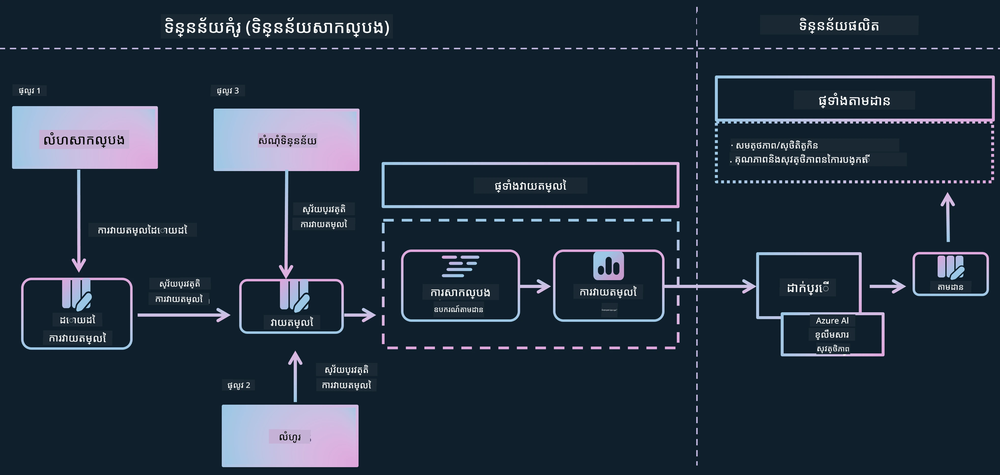

*Image Source: [ការវាយតម្លៃកម្មវិធី AI បង្កើត](https://learn.microsoft.com/azure/ai-studio/concepts/evaluation-approach-gen-ai?wt.mc_id%3Dstudentamb_279723)*

> [!NOTE]
> 
> សម្រាប់ព័ត៌មានលម្អិតបន្ថែម និងដើម្បីស្វែងយល់ធនធានបន្ថែមអំពី Phi-3 / Phi-3.5 សូមចូលទៅកាន់ [Phi-3CookBook](https://github.com/microsoft/Phi-3CookBook?wt.mc_id=studentamb_279723)។

### ល័ក្ខខណ្ឌមុនចាប់ផ្តើម

- [Python](https://www.python.org/downloads)
- [Azure subscription](https://azure.microsoft.com/free?wt.mc_id=studentamb_279723)
- [Visual Studio Code](https://code.visualstudio.com)
- ម៉ូដែល Phi-3 / Phi-3.5 ដែលបានបម្រឹត

### តារាងមាតិកា

1. [**Scenario 1: Introduction to Microsoft Foundry's Prompt flow evaluation**](#scenario-1-introduction-to-azure-ai-studios-prompt-flow-evaluation)

    - [Introduction to safety evaluation](#introduction-to-safety-evaluation)
    - [Introduction to performance evaluation](#introduction-to-performance-evaluation)

1. [**Scenario 2: Evaluating the Phi-3 / Phi-3.5 model in Microsoft Foundry**](#scenario-2-evaluating-the-phi-3--phi-35-model-in-azure-ai-studio)

    - [Before you begin](#before-you-begin)
    - [Deploy Azure OpenAI to evaluate the Phi-3 / Phi-3.5 model](#deploy-azure-openai-to-evaluate-the-phi-3--phi-35-model)
    - [Evaluate the fine-tuned Phi-3 / Phi-3.5 model using Microsoft Foundry's Prompt flow evaluation](#evaluate-the-fine-tuned-phi-3--phi-35-model-using-azure-ai-studios-prompt-flow-evaluation)

1. [Congratulations!](#congratulations)

## **Scenario 1: Introduction to Microsoft Foundry's Prompt flow evaluation**

### Introduction to safety evaluation

ដើម្បីធានាថាម៉ូដែល AI របស់អ្នកមានសីលធម៌ និងមានសុវត្ថិភាព វាមានសារៈសំខាន់ក្នុងការប៉ាន់ប្រមាណវាជាមួយ គោលការណ៍ Responsible AI របស់ Microsoft។ នៅក្នុង Microsoft Foundry ការវាយតម្លៃសុវត្ថិភាពអនុញ្ញាតឱ្យអ្នកពិនិត្យពីភាពងាយរុករកចេញពីការតភ្ជាប់ (jailbreak) របស់ម៉ូដែល និងសមត្ថភាពក្នុងការបង្កើតមាតិកាដែលអាចមានគ្រោះថ្នាក់ ដែលស្របតាមគោលការណ៍ទាំងនេះ។

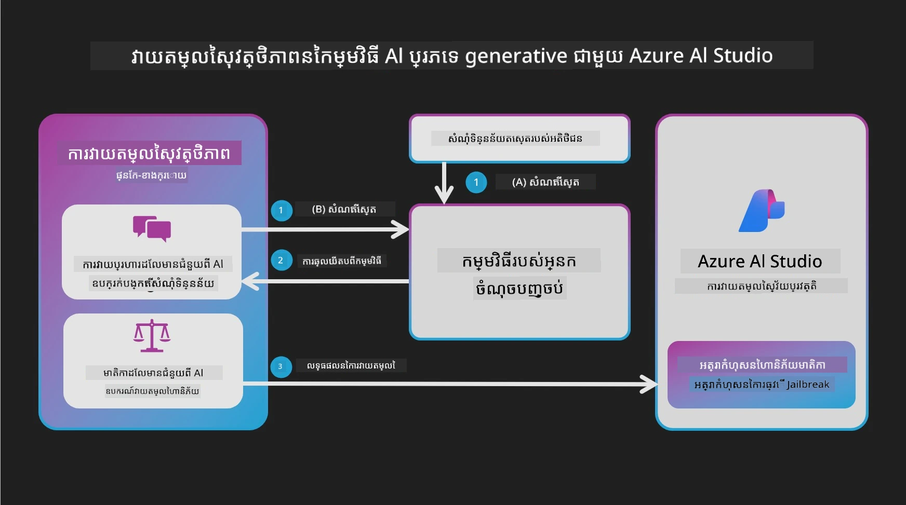

*Image Source: [ការវាយតម្លៃកម្មវិធី AI បង្កើត](https://learn.microsoft.com/azure/ai-studio/concepts/evaluation-approach-gen-ai?wt.mc_id%3Dstudentamb_279723)*

#### គោលការណ៍ Responsible AI របស់ Microsoft

មុនចាប់ផ្តើមជំហានបច្ចេកទេស វាសំខាន់ដែលត្រូវយល់ពី គោលការណ៍ Responsible AI របស់ Microsoft ដែលជាស៊ុមស្តង់ដែរក្នុងចំណោមសីលធម៌ ដើម្បីណែនាំការអភិវឌ្ឍ ការដាក់ពង្រីក និងការប្រើប្រាស់ប្រព័ន្ធ AI បែបមានការទទួលខុសត្រូវ។ គោលការណ៍ទាំងនេះណែនាំការរចនា អភិវឌ្ឍន៍ និងដាក់ពង្រីកប្រព័ន្ធ AI ដោយធានាថាបច្ចេកវិទ្យា AI ត្រូវបានបង្កើតក្នុងរបៀបដែលសមស្រប ត្រជាក់ចិត្ត និងរួមបញ្ចូល។ គោលការណ៍ទាំងនេះជាគ្រឹះសម្រាប់ការវាយតម្លៃសុវត្ថិភាពរបស់ម៉ូដែល AI។

គោលការណ៍ Responsible AI របស់ Microsoft រួមមាន៖

- **Fairness and Inclusiveness**: ប្រព័ន្ធ AI គួរតែអនុវត្តការគ្រប់គ្នា ហើយចៀសវាងការប៉ះពាល់ដល់ក្រុមមនុស្សដែលមានលក្ខខណ្ឌស្រដៀងគ្នាទៅវិញទៅមក។ ឧទាហរណ៍ នៅពេលប្រព័ន្ធ AI ផ្តល់យោបល់អំពីការព្យាបាល​វះកាត់ ការដាក់ពាក្យកម្ចី ឬការជ្រើសរើសការងារ វាគួរផ្តល់យោបល់ដូចគ្នាចំពោះមនុស្សដែលមានរោគសញ្ញាស្រដៀងគ្នា ស្ថានភាពហិរញ្ញវត្ថុ ឬលក្ខណៈគ្រប់គ្រងវិជ្ជាជីវៈស្រដៀងគ្នា។

- **Reliability and Safety**: ដើម្បីបង្កើតទំនុកចិត្ត វាមានសារៈសំខាន់ដែលប្រព័ន្ធ AI អាចដំណើរការបានយ៉ាងទៀងទាត់ សុវត្ថិភាព និងឥតខ្លាច។ ប្រព័ន្ធទាំងនេះគួរអាចដំណើរការតាមរបៀបដែលបានរចនាឡើយ បត់បែនយ៉ាងសុវត្ថិភាពចំពោះលក្ខខណ្ឌមិនបានរំពឹងទុក និងប្រឆាំងនឹងការគ្រប់គ្រងដែលអាចធ្វើឲ្យមានគ្រោះថ្នាក់។ របៀបដែលពួកវាផ្លាស់ប្តូរ និងចំនួនលក្ខខណ្ឌដែលពួកវាអាចប្រឈមបង្ហាញពីជួរទីតាំង និងស្ថានភាពដែលអ្នកអភិវឌ្ឍបានរំពឹងទុកនៅពេលរចនា និងពិនិត្យ។

- **Transparency**: នៅពេលប្រព័ន្ធ AI ជួយដល់ការសម្រេចចិត្តដែលមានផលប៉ៈពាល់យ៉ាងច្រើនចំពោះជីវិតអ្នកមនុស្ស វាមានសារៈសំខាន់ដែលមនុស្សយល់ពីរបៀបដែលសេចក្តីសម្រេចនោះត្រូវបានធ្វើឡើង។ ឧទាហរណ៍ ធនាគារមួយអាចប្រើប្រព័ន្ធ AI ដើម្បីសម្រេចថាមនុស្សម្នាក់មានសមត្ថភាពឥណទាន ឬទេ។ ក្រុមហ៊ុនមួយអាចប្រើ AI ដើម្បីកំណត់បេក្ខជនដែលមានសមត្ថភាពខ្ពស់បំផុតសម្រាប់ជ្រើសរើស។

- **Privacy and Security**: បច្ចុប្បន្ននេះពេល AI ក្លាយជា​បច្ចេកវិទ្យាដែលគេច្រើន ការការពារភាពឯកជន និងការសន្សំព័ត៌មានផ្ទាល់ខ្លួន និងព័ត៌មានអាជីវកម្មក្លាយជា​បញ្ហាស្រួលស្មុគស្មាញ។ ជាមួយ AI ការរក្សាភាពឯកជន និងសុវត្ថិភាពទិន្នន័យត្រូវការយកចិត្តទុកដាក់ពិសេស ព្រោះការចូលដល់ទិន្នន័យគឺមានសារៈសំខាន់សម្រាប់ប្រព័ន្ធ AI ដើម្បីធ្វើការព្យាករណ៍ និងសម្រេចចិត្តដែលត្រឹមត្រូវ និងមានមូលដ្ឋានលើព័ត៌មានពីមនុស្ស។

- **Accountability**: មនុស្សដែលរចនា និងដាក់ពង្រីកប្រព័ន្ធ AI ត្រូវតែទទួលខុសត្រូវចំពោះរបៀបដំណើរការរបស់ប្រព័ន្ធពួកគេ។ អង្គភាពគួរដកយកស្តង់ដារ​ឧស្សាហកម្មដើម្បីអភិវឌ្ឍន norme ទទួលខុសត្រូវ។ norme ទាំងនេះអាចធានាថាប្រព័ន្ធ AI មិនមែនជាអំណាចចុងក្រោយលើចំណុចណាមួយដែលមានផលប៉ះពាល់ចំពោះជីវិតមនុស្ស។ វាក៏អាចធានាថាមនុស្សនៅតែជាម្ចាស់ការគ្រប់គ្រងយ៉ាងមានអត្ថន័យលើប្រព័ន្ធ AI ដែលមានអត្រាស្វ័យប្រវត្តិខ្ពស់ ។

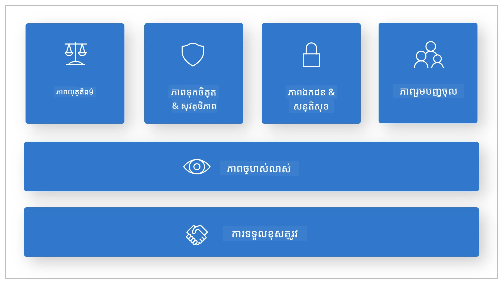

*Image Source: [What is Responsible AI?](https://learn.microsoft.com/azure/machine-learning/concept-responsible-ai?view=azureml-api-2&viewFallbackFrom=azureml-api-2%253fwt.mc_id%3Dstudentamb_279723)*

> [!NOTE]
> ដើម្បីស្វែងយល់បន្ថែមអំពី គោលការណ៍ Responsible AI របស់ Microsoft សូមចូលទៅកាន់ [What is Responsible AI?](https://learn.microsoft.com/azure/machine-learning/concept-responsible-ai?view=azureml-api-2?wt.mc_id=studentamb_279723)។

#### វិមាលសុវត្ថិភាព

ក្នុងមេរៀននេះ អ្នកនឹងប៉ាន់ប្រមាណសុវត្ថិភាពរបស់ម៉ូដែល Phi-3 ដែលបានបម្រឹតដោយប្រើវិមាលសុវត្ថិភាពរបស់ Microsoft Foundry។ វិមាលទាំងនេះជួយអ្នកវាយតម្លៃពីសមត្ថភាពរបស់ម៉ូដែលក្នុងការបង្កើតមាតិកាដែលអាចមានគ្រោះថ្នាក់ និងភាពងាយរុករកចេញពីការតភ្ជាប់ (jailbreak)។ វិមាលសុវត្ថិភាពរួមមាន៖

- **Self-harm-related Content**: វាយតម្លៃថាតើម៉ូដែលមានទំនោរបង្កើតមាតិកាដែលពាក់ព័ន្ធនឹងការខូចខាតខ្លួនឯង ឬអត់។
- **Hateful and Unfair Content**: វាយតម្លៃថាតើម៉ូដែលមានទំនោរបង្កើតមាតិកាសូរិយា (hateful) ឬមិនយុត្តិធម៌។
- **Violent Content**: វាយតម្លៃថាតើម៉ូដែលមានទំនោរបង្កើតមាតិកាអំពីអំពើហិង្សា។
- **Sexual Content**: វាយតម្លៃថាតើម៉ូដែលមានទំនោរបង្កើតមាតិកាភេទដែលមិនសមរម្យ។

ការវាយតម្លៃជំពូកទាំងនេះធានាថា ម៉ូដែល AI មិនបង្កើតមាតិកាដែលមានគ្រោះថ្នាក់ ឬធ្វើឲ្យកើតការរអៀបរអួល ដែលសម្របសម្រួលទៅនឹងតម្លៃសង្គម និងស្តង់ដារ​គ្រប់គ្រង។

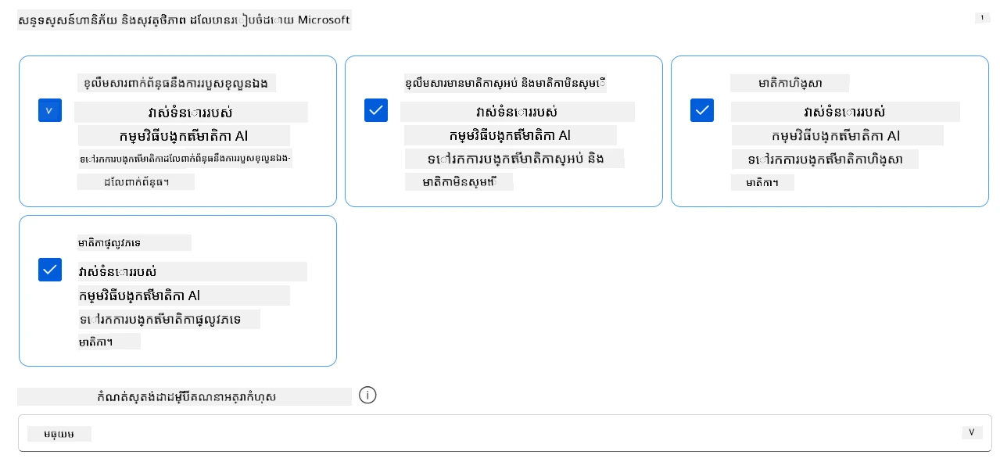

### Introduction to performance evaluation

ដើម្បីធានាថាម៉ូដែល AI របស់អ្នកដំណើរការ​បានត្រឹមត្រូវ វាសំខាន់ក្នុងការវាយតម្លៃសមត្ថភាពរបស់វាស្របតាមវិមាលសមត្ថភាព។ នៅក្នុង Microsoft Foundry ការវាយតម្លៃសមត្ថភាពនាំឱ្យអ្នកអាចពិនិត្យទិន្នន័យពីម៉ូដែលថាវាអាចបង្កើតចម្លើយដែលត្រឹមត្រូវ ទាក់ទង និងសម្រួលយ៉ាងដូចមនុស្សបានយ៉ាងម៉េច។

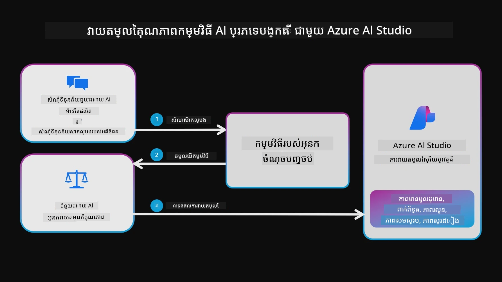

*Image Source: [ការវាយតម្លៃកម្មវិធី AI បង្កើត](https://learn.microsoft.com/azure/ai-studio/concepts/evaluation-approach-gen-ai?wt.mc_id%3Dstudentamb_279723)*

#### វិមាលសមត្ថភាព

ក្នុងមេរៀននេះ អ្នកនឹងប៉ាន់ប្រមាណសមត្ថភាពរបស់ម៉ូដែល Phi-3 / Phi-3.5 ដែលបានបម្រឹតដោយប្រើវិមាលសមត្ថភាពរបស់ Microsoft Foundry។ វិមាលទាំងនេះជួយវាយតម្លៃពីសមត្ថភាពរបស់ម៉ូដែលក្នុងការបង្កើតចម្លើយដែលត្រឹមត្រូវ ទាក់ទង និងសម្រួល។ វិមាលសមត្ថភាពរួមមាន៖

- **Groundedness**: វាយតម្លៃថាចម្លើយដែលបានបង្កើតមានការចាប់យកតាមព័ត៌មានពីប្រភពបញ្ចូលបានយ៉ាងម៉េច។
- **Relevance**: វាយតម្លៃពីភាពទាក់ទងរបស់ចម្លើយដែលបានបង្កើត ទៅនឹងសំណួរដែលបានផ្តល់។
- **Coherence**: វាយតម្លៃពីរបៀបដែលអត្ថបទដែលបានបង្កើតហូរប្រកបដោយរលូន អានឈានទៅបានធម្មជាតិ ហើយស្រដៀងនឹងភាសាមនុស្ស។
- **Fluency**: វាយតម្លៃពីជំនាញភាសារបស់អត្ថបទដែលបានបង្កើត។
- **GPT Similarity**: ធៀបចម្លើយដែលបានបង្កើតជាមួយផ្ទៃស្មាត (ground truth) សម្រាប់ភាពស្រដៀង។
- **F1 Score**: គណនាឡើងអត្រាពាក្យរួមរវាងចម្លើយដែលបានបង្កើត និងទិន្នន័យប្រភព។

វិមាលទាំងនេះជួយអ្នកវាយតម្លៃពីសមត្ថភាពរបស់ម៉ូដែលក្នុងការបង្កើតចម្លើយដែលត្រឹមត្រូវ ទាក់ទង និងសម្រួល។

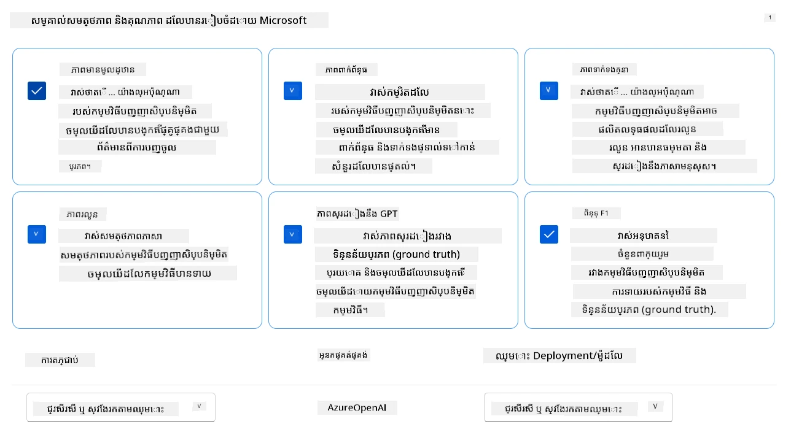

## **Scenario 2: Evaluating the Phi-3 / Phi-3.5 model in Microsoft Foundry**

### Before you begin

មេរៀននេះជាការបន្តពីអត្ថបទប្លុកមុនៗ "[Fine-Tune and Integrate Custom Phi-3 Models with Prompt Flow: Step-by-Step Guide](https://techcommunity.microsoft.com/t5/educator-developer-blog/fine-tune-and-integrate-custom-phi-3-models-with-prompt-flow/ba-p/4178612?wt.mc_id=studentamb_279723)" និង "[Fine-Tune and Integrate Custom Phi-3 Models with Prompt Flow in Microsoft Foundry](https://techcommunity.microsoft.com/t5/educator-developer-blog/fine-tune-and-integrate-custom-phi-3-models-with-prompt-flow-in/ba-p/4191726?wt.mc_id=studentamb_279723)។" នៅក្នុងអត្ថបទទាំងនេះ យើងបានដើរតាមដំណើរការនៃការបម្រឹតម៉ូដែល Phi-3 / Phi-3.5 នៅ Microsoft Foundry និងការបញ្ចូលវាជាមួយ Prompt flow។

ក្នុងមេរៀននេះ អ្នកនឹងដាក់បង្ហាញម៉ូដែល Azure OpenAI មួយជាអ្នកវាយតម្លៃនៅក្នុង Microsoft Foundry ហើយប្រើវាដើម្បីវាយតម្លៃម៉ូដែល Phi-3 / Phi-3.5 ដែលបានបម្រឹតរបស់អ្នក។

មុនចាប់ផ្តើមមេរៀននេះ សូមប្រាកដថាអ្នកមានលក្ខខណ្ឌមុនៗដូចដែលបានពិពណ៌នានៅក្នុងមេរៀនមុនៗ៖

1. សំណុំពិនិត្យដែលបានរៀបចំសម្រាប់វាយតម្លៃម៉ូដែល Phi-3 / Phi-3.5 ដែលបានបម្រឹត។
1. ម៉ូដែល Phi-3 / Phi-3.5 ដែលបានបម្រឹត និងបានដាក់បង្ហាញទៅ Azure Machine Learning។
1. Prompt flow ដែលបានបញ្ចូលជាមួយម៉ូដែល Phi-3 / Phi-3.5 ដែលបានបម្រឹតរបស់អ្នកនៅ Microsoft Foundry។

> [!NOTE]
> អ្នកនឹងប្រើឯកសារ *test_data.jsonl* ដែលមាននៅក្នុងថតទិន្នន័យពីសំណុំទិន្នន័យ **ULTRACHAT_200k** ដែលបានទាញយកនៅអត្ថបទប្លុកមុនៗ ជាសំណុំទិន្នន័យសម្រាប់វាយតម្លៃម៉ូដែល Phi-3 / Phi-3.5 ដែលបានបម្រឹត។

#### បញ្ចូលម៉ូដែល Phi-3 / Phi-3.5 ផ្ទាល់ខ្លួនជាមួយ Prompt flow ក្នុង Microsoft Foundry (វិធីសាស្ត្រកូដជាមុន)

> [!NOTE]
> ប្រសិនបើអ្នកបានអនុវត្តវិធីសាស្ត្រកូដតិច (low-code) ដែលបានពិពណ៌នានៅ "[Fine-Tune and Integrate Custom Phi-3 Models with Prompt Flow in Microsoft Foundry](https://techcommunity.microsoft.com/t5/educator-developer-blog/fine-tune-and-integrate-custom-phi-3-models-with-prompt-flow-in/ba-p/4191726?wt.mc_id=studentamb_279723)" អ្នកអាចរំលងលំហាត់នេះ ហើយបន្តទៅលំហាត់បន្ទាប់។  
> ទោះយ៉ាងណា ប្រសិនបើអ្នកបានអនុវត្តវិធីសាស្ត្រកូដជាមុនដែលបានពិពណ៌នានៅ "[Fine-Tune and Integrate Custom Phi-3 Models with Prompt Flow: Step-by-Step Guide](https://techcommunity.microsoft.com/t5/educator-developer-blog/fine-tune-and-integrate-custom-phi-3-models-with-prompt-flow/ba-p/4178612?wt.mc_id=studentamb_279723)" ដើម្បីបម្រឹត និងដាក់បង្ហាញម៉ូដែល Phi-3 / Phi-3.5 របស់អ្នក ដំណើរការនៃការតភ្ជាប់ម៉ូដែលទៅ Prompt flow នឹងខុសគ្នាបន្តិច។ អ្នកនឹងរៀនដំណើរការនេះក្នុងលំហាត់នេះ។

ដើម្បីបន្ត អ្នកត្រូវបញ្ចូលម៉ូដែល Phi-3 / Phi-3.5 ដែលបានបម្រឹតរបស់អ្នកទៅក្នុង Prompt flow នៅ Microsoft Foundry។

#### បង្កើត Microsoft Foundry Hub

អ្នកត្រូវបង្កើត Hub មួយ មុនពេលបង្កើត Project។ Hub ស្មើទៅនឹង Resource Group ដែលអនុញ្ញាតឱ្យអ្នករៀបចំ និងគ្រប់គ្រង Projects ពហុភាពនៅក្នុង Microsoft Foundry។

1. ចូលទៅកាន់ [Microsoft Foundry](https://ai.azure.com/?wt.mc_id=studentamb_279723)។

1. ជ្រើសយក **All hubs** ពីផ្ទាំងខាងឆ្វេង។

1. ជ្រើសយក **+ New hub** ពីម៉ឺនុយរុករក។

    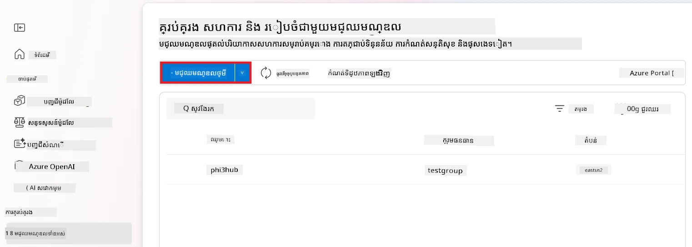

1. អនុវត្តភារកិច្ចដូចខាងក្រោម៖

    - បញ្ចូល **Hub name**។ វាត្រូវតែជាតម្លៃដែលមានតែមួយគត់។
    - ជ្រើសរើស **Subscription** របស់ Azure របស់អ្នក។
    - ជ្រើស **Resource group** ដើម្បីប្រើ (បង្កើតថ្មីប្រសិនបើចាំបាច់)។
    - ជ្រើស **Location** ដែលអ្នកចង់ប្រើ។
    - ជ្រើស **Connect Azure AI Services** ដែលអ្នកចង់ប្រើ (បង្កើតថ្មីប្រសិនបើចាំបាច់)។
    - ជ្រើស **Connect Azure AI Search** ដើម្បី **Skip connecting**។

    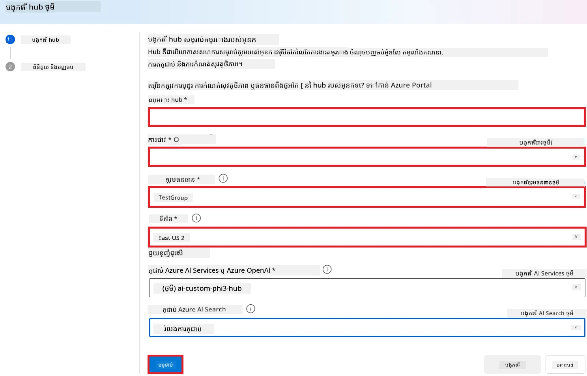

1. ជ្រើស **Next**។

#### Create Microsoft Foundry Project

1. នៅក្នុង Hub ដែលអ្នកបានបង្កើត ជ្រើស **All projects** ពីផ្នែកផ្ទាំងខាងឆ្វេង។

1. ជ្រើស **+ New project** ពីម៉ឺនុយរាវិឌ្ឍន៍។

    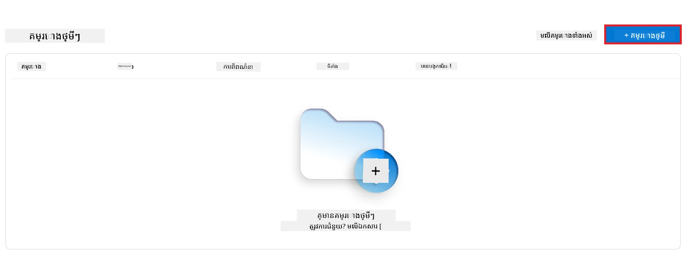

1. បញ្ចូល **Project name**។ វាត្រូវតែមានតម្លៃតែមួយនៃខ្លួនវា។

    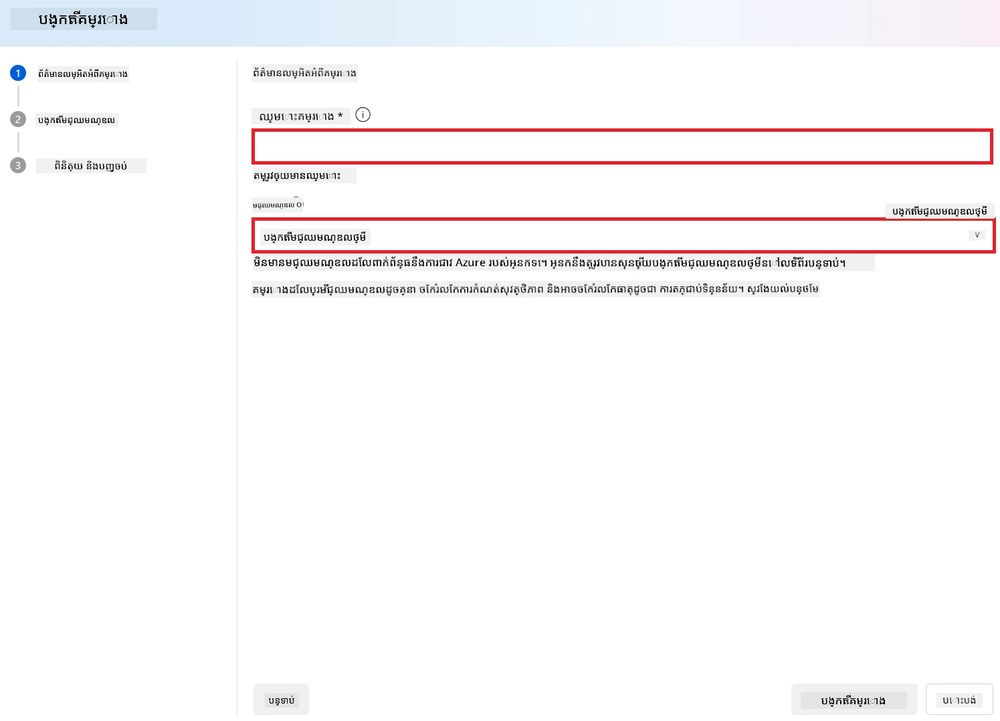

1. ជ្រើស **Create a project**។

#### Add a custom connection for the fine-tuned Phi-3 / Phi-3.5 model

ដើម្បីបញ្ចូលម៉ូឌែល Phi-3 / Phi-3.5 ដែលអ្នកបានបង្រៀនបន្ថែមក្នុង Prompt flow អ្នកត្រូវរក្សាទុក endpoint និង key របស់ម៉ូឌែលក្នុងការភ្ជាប់ប្តូរតាមបំណង។ ការកំណត់នេះធានាថាអ្នកអាចចូលប្រើម៉ូឌែល Phi-3 / Phi-3.5 ប្តូរដូចกล่าวនៅក្នុង Prompt flow។

#### Set api key and endpoint uri of the fine-tuned Phi-3 / Phi-3.5 model

1. ទៅកាន់ [Azure ML Studio](https://ml.azure.com/home?wt.mc_id=studentamb_279723)。

1. ទៅកាន់ Azure Machine learning workspace ដែលអ្នកបានបង្កើត។

1. ជ្រើស **Endpoints** ពីផ្នែកផ្ទាំងខាងឆ្វេង។

    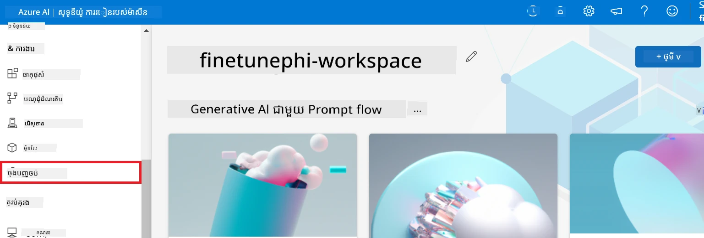

1. ជ្រើស endpoint ដែលអ្នកបានបង្កើត។

    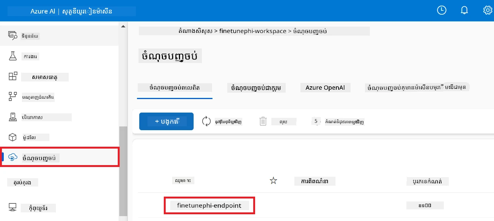

1. ជ្រើស **Consume** ពីម៉ឺនុយរាវិឌ្ឍន៍។

1. ចម្លង **REST endpoint** និង **Primary key** របស់អ្នក។

    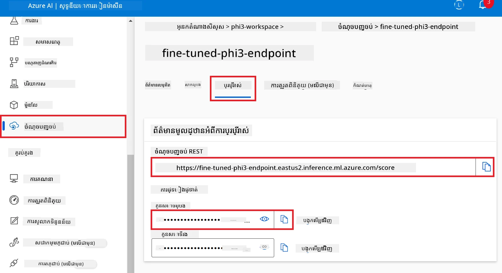

#### Add the Custom Connection

1. ទៅកាន់ [Microsoft Foundry](https://ai.azure.com/?wt.mc_id=studentamb_279723)。

1. ទៅកាន់គម្រោង Microsoft Foundry ដែលអ្នកបានបង្កើត។

1. នៅក្នុងគម្រោងដែលអ្នកបានបង្កើត ជ្រើស **Settings** ពីផ្នែកផ្ទាំងខាងឆ្វេង។

1. ជ្រើស **+ New connection**។

    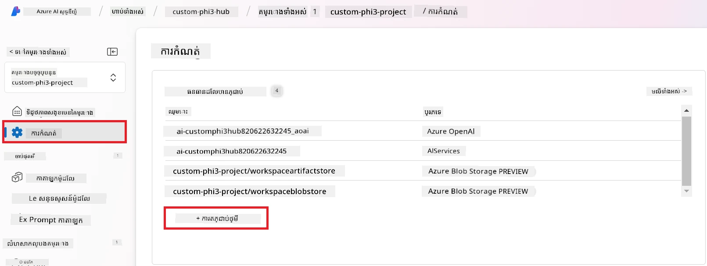

1. ជ្រើស **Custom keys** ពីម៉ឺនុយរាវិឌ្ឍន៍។

    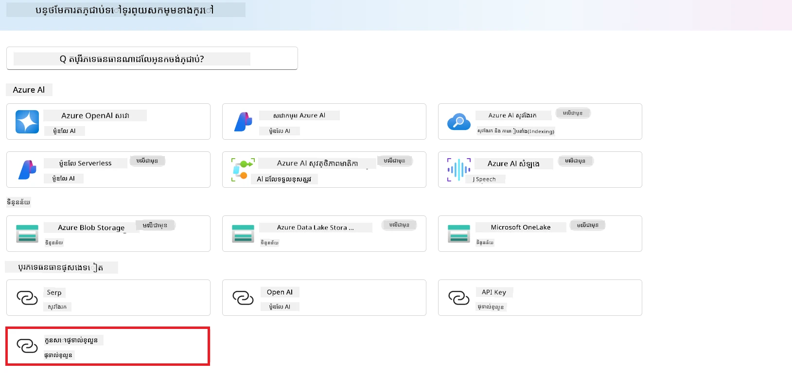

1. អនុវត្តកិច្ចការដូចតទៅ៖

    - ជ្រើស **+ Add key value pairs**។
    - សម្រាប់ឈ្មោះ key បញ្ចូល **endpoint** ហើយបិទចម្លង endpoint ពី Azure ML Studio ត្រូវបញ្ចូលនៅចន្លោះតម្លៃ។
    - ជ្រើស **+ Add key value pairs** ម្តងទៀត។
    - សម្រាប់ឈ្មោះ key បញ្ចូល **key** ហើយបិទចម្លង key ពី Azure ML Studio ត្រូវបញ្ចូលនៅចន្លោះតម្លៃ។
    - បន្ទាប់ពីបន្ថែម key ទៅហើយ ជ្រើស **is secret** ដើម្បីទប់ស្កាត់មិនឲ្យ key ស្តើងចេញ។

    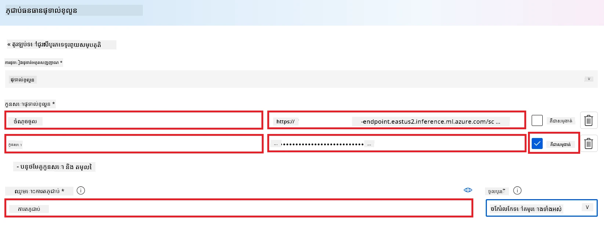

1. ជ្រើស **Add connection**។

#### Create Prompt flow

អ្នកបានបន្ថែមការភ្ជាប់ប្តូរតាមបំណងនៅក្នុង Microsoft Foundry តោះមកបង្កើត Prompt flow ដោយអនុវត្តជំហានដូចខាងក្រោម។ បន្ទាប់មក អ្នកនឹងភ្ជាប់ Prompt flow នេះទៅការភ្ជាប់ប្តូរតាមបំណងដើម្បីប្រើម៉ូឌែលដែលបានបង្រៀនបន្ថែមក្នុង Prompt flow។

1. ទៅកាន់គម្រោង Microsoft Foundry ដែលអ្នកបានបង្កើត។

1. ជ្រើស **Prompt flow** ពីផ្នែកផ្ទាំងខាងឆ្វេង។

1. ជ្រើស **+ Create** ពីម៉ឺនុយរាវិឌ្ឍន៍។

    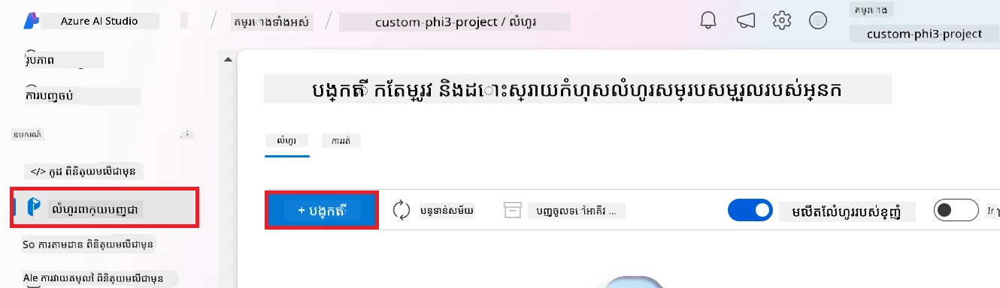

1. ជ្រើស **Chat flow** ពីម៉ឺនុយរាវិឌ្ឍន៍។

    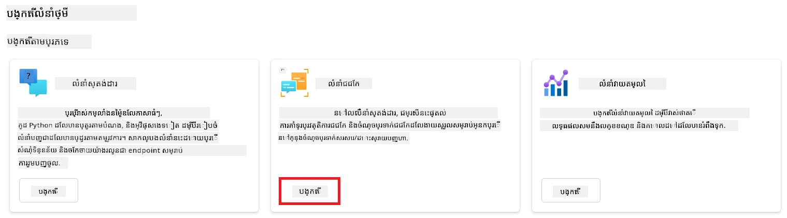

1. បញ្ចូល **Folder name** ដែលត្រូវប្រើ។

    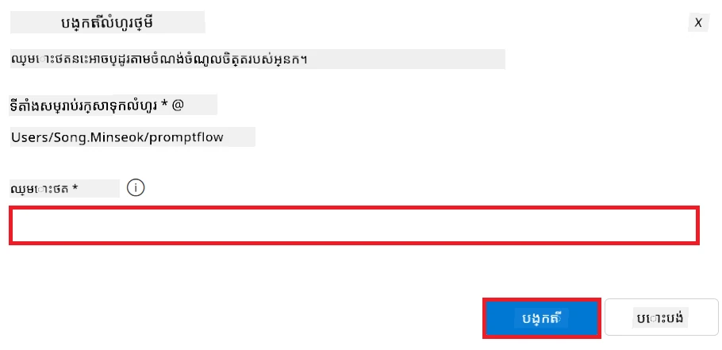

1. ជ្រើស **Create**។

#### Set up Prompt flow to chat with your custom Phi-3 / Phi-3.5 model

អ្នកត្រូវបញ្ចូលម៉ូឌែល Phi-3 / Phi-3.5 ដែលបានបង្រៀនបន្ថែម ទៅក្នុង Prompt flow។ ទោះយ៉ាងណា Prompt flow ដែលមានស្រាប់មិនបានរចនាមកសម្រាប់គោលបំណងនេះទេ។ ដូច្នេះ អ្នកត្រូវរចនាម្ដងទៀត Prompt flow ដើម្បីអនុញ្ញាតឱ្យភ្ជាប់ម៉ូឌែលប្តូរតាមបំណងបាន។

1. ក្នុង Prompt flow អនុវត្តកិច្ចការដូចតទៅដើម្បីកសាងឡើងវិញ flow ដែលមានស្រាប់៖

    - ជ្រើស **Raw file mode**។
    - លុបកូដទាំងអស់ដែលមានស្រាប់នៅក្នុងឯកសារ *flow.dag.yml*។
    - បន្ថែមកូដដូចខាងក្រោមទៅក្នុង *flow.dag.yml*។

        ```yml
        inputs:
          input_data:
            type: string
            default: "Who founded Microsoft?"

        outputs:
          answer:
            type: string
            reference: ${integrate_with_promptflow.output}

        nodes:
        - name: integrate_with_promptflow
          type: python
          source:
            type: code
            path: integrate_with_promptflow.py
          inputs:
            input_data: ${inputs.input_data}
        ```

    - ជ្រើស **Save**។

    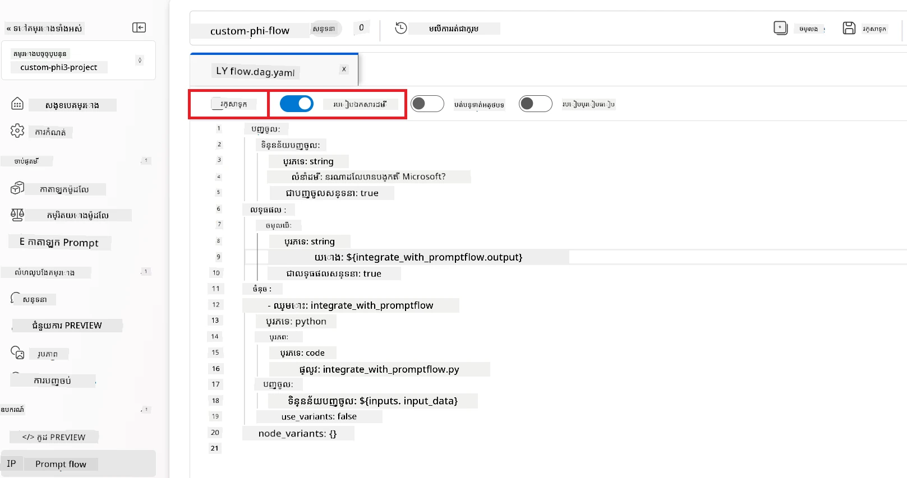

1. បន្ថែមកូដដូចខាងក្រោមទៅក្នុង *integrate_with_promptflow.py* ដើម្បីប្រើម៉ូឌែល Phi-3 / Phi-3.5 ប្តូរតាមបំណងនៅក្នុង Prompt flow។

    ```python
    import logging
    import requests
    from promptflow import tool
    from promptflow.connections import CustomConnection

    # ការរៀបចំកំណត់ហេតុ
    logging.basicConfig(
        format="%(asctime)s - %(levelname)s - %(name)s - %(message)s",
        datefmt="%Y-%m-%d %H:%M:%S",
        level=logging.DEBUG
    )
    logger = logging.getLogger(__name__)

    def query_phi3_model(input_data: str, connection: CustomConnection) -> str:
        """
        Send a request to the Phi-3 / Phi-3.5 model endpoint with the given input data using Custom Connection.
        """

        # "connection" គឺជា​ឈ្មោះ​នៃ Custom Connection, "endpoint" និង "key" ជាវាល​នៅ​ក្នុង Custom Connection
        endpoint_url = connection.endpoint
        api_key = connection.key

        headers = {
            "Content-Type": "application/json",
            "Authorization": f"Bearer {api_key}"
        }
    data = {
        "input_data": [input_data],
        "params": {
            "temperature": 0.7,
            "max_new_tokens": 128,
            "do_sample": True,
            "return_full_text": True
            }
        }
        try:
            response = requests.post(endpoint_url, json=data, headers=headers)
            response.raise_for_status()
            
            # កត់ទុកចម្លើយ JSON ទាំងមូល
            logger.debug(f"Full JSON response: {response.json()}")

            result = response.json()["output"]
            logger.info("Successfully received response from Azure ML Endpoint.")
            return result
        except requests.exceptions.RequestException as e:
            logger.error(f"Error querying Azure ML Endpoint: {e}")
            raise

    @tool
    def my_python_tool(input_data: str, connection: CustomConnection) -> str:
        """
        Tool function to process input data and query the Phi-3 / Phi-3.5 model.
        """
        return query_phi3_model(input_data, connection)

    ```

    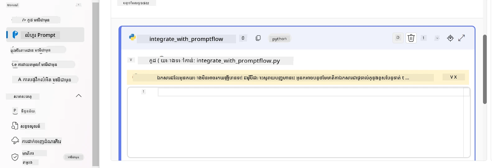

> [!NOTE]
> For more detailed information on using Prompt flow in Microsoft Foundry, you can refer to [Prompt flow in Microsoft Foundry](https://learn.microsoft.com/azure/ai-studio/how-to/prompt-flow).

1. ជ្រើស **Chat input**, **Chat output** ដើម្បីបើកប្រើការជជែកជាមួយម៉ូឌែលរបស់អ្នក។

    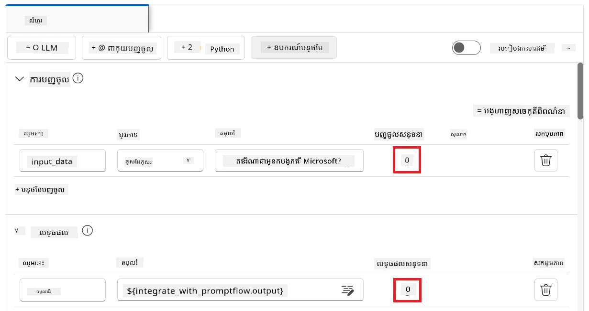

1. ឥឡូវអ្នករួចរាល់សម្រាប់ជជែកជាមួយម៉ូឌែល Phi-3 / Phi-3.5 ប្តូរតามបំណងរបស់អ្នក។ ក្នុងលំហាត់បន្ទាប់ អ្នកនឹងរៀនពីរបៀបចាប់ផ្តើម Prompt flow និងប្រើវាដើម្បីជជែកជាមួយម៉ូឌែល Phi-3 / Phi-3.5 ដែលបានបង្រៀនបន្ថែមរបស់អ្នក។

> [!NOTE]
>
> The rebuilt flow should look like the image below:
>
> 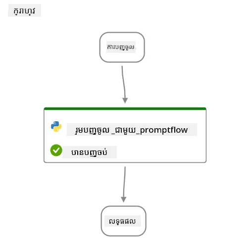
>

#### Start Prompt flow

1. ជ្រើស **Start compute sessions** ដើម្បីចាប់ផ្តើម Prompt flow។

    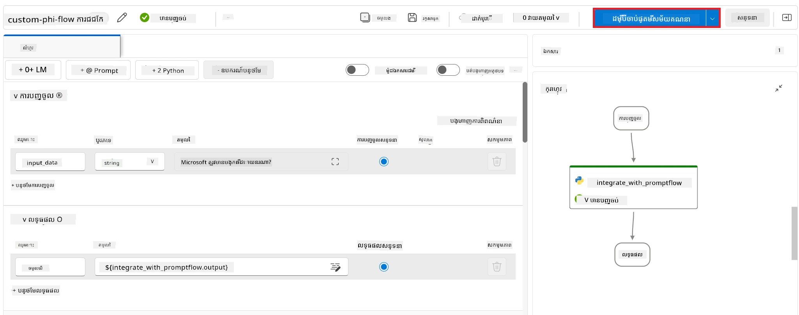

1. ជ្រើស **Validate and parse input** ដើម្បីធ្វើបច្ចុប្បន្នភាពប៉ារ៉ាម៉ែត្រ។

    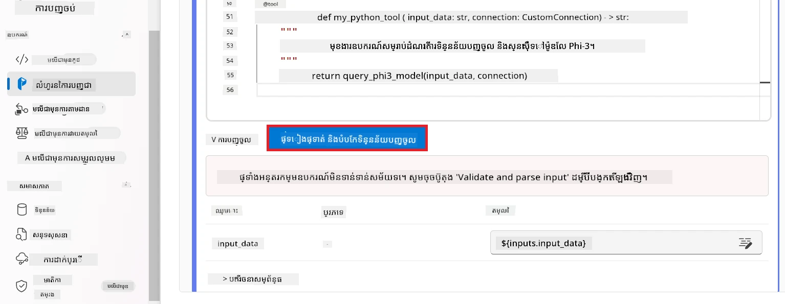

1. ជ្រើស **Value** នៃ **connection** ទៅការភ្ជាប់ប្តូរតាមបំណងដែលអ្នកបានបង្កើត។ ឧទាហរណ៍ *connection*។

    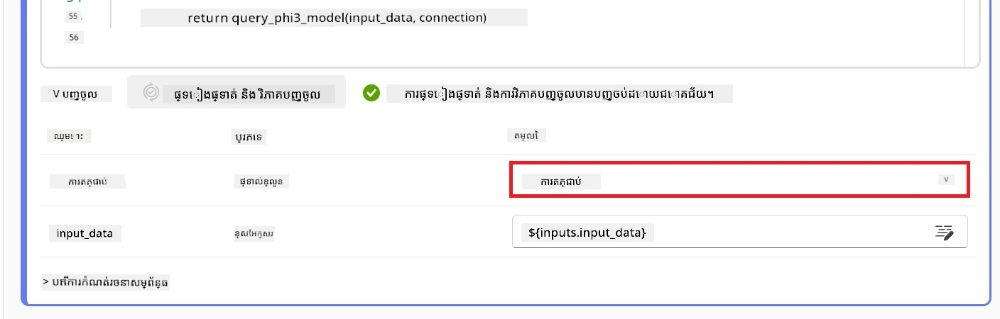

#### Chat with your custom Phi-3 / Phi-3.5 model

1. ជ្រើស **Chat**។

    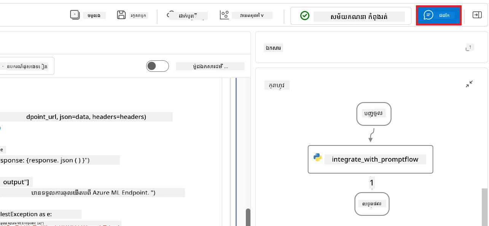

1. នេះគឺជាគំរូនៃលទ្ធផល៖ ឥឡូវនេះអ្នកអាចជជែកជាមួយម៉ូឌែល Phi-3 / Phi-3.5 ប្តូរតាមបំណងរបស់អ្នក។ យើងណែនាំឲ្យសួរពីសំណួរដែលផ្អែកលើទិន្នន័យដែលបានប្រើសម្រាប់ការបង្រៀនបន្ថែម។

    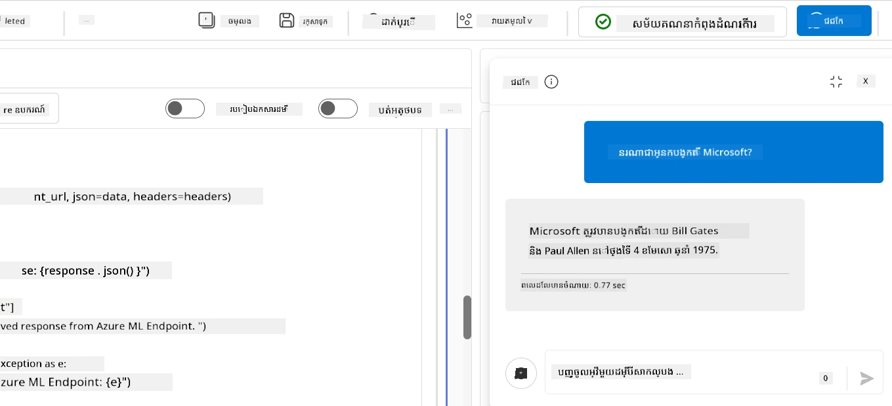

### Deploy Azure OpenAI to evaluate the Phi-3 / Phi-3.5 model

ដើម្បីវាយតម្លៃម៉ូឌែល Phi-3 / Phi-3.5 ក្នុង Microsoft Foundry អ្នកត្រូវដឹកនាំម៉ូឌែល Azure OpenAI។ ម៉ូឌែលនេះនឹងត្រូវប្រើសម្រាប់វាយតម្លៃការសម្តែងរបស់ម៉ូឌែល Phi-3 / Phi-3.5។

#### Deploy Azure OpenAI

1. បានចូលទៅ [Microsoft Foundry](https://ai.azure.com/?wt.mc_id=studentamb_279723)。

1. ទៅកាន់គម្រោង Microsoft Foundry ដែលអ្នកបានបង្កើត។

    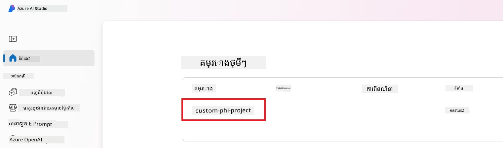

1. នៅក្នុងគម្រោងដែលអ្នកបានបង្កើត ជ្រើស **Deployments** ពីផ្នែកផ្ទាំងខាងឆ្វេង។

1. ជ្រើស **+ Deploy model** ពីម៉ឺនុយរាវិឌ្ឍន៍។

1. ជ្រើស **Deploy base model**។

    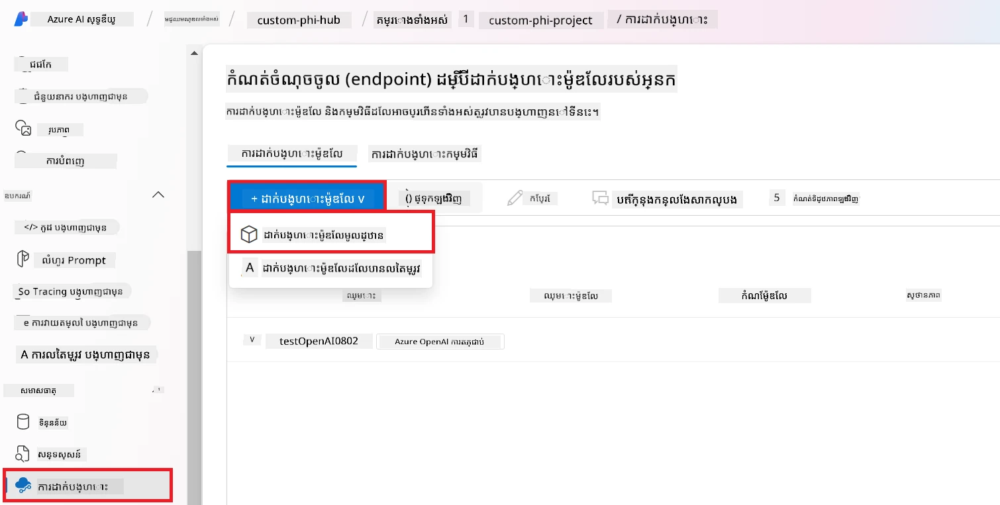

1. ជ្រើសម៉ូឌែល Azure OpenAI ដែលអ្នកចង់ប្រើ។ ឧទាហរណ៍ **gpt-4o**។

    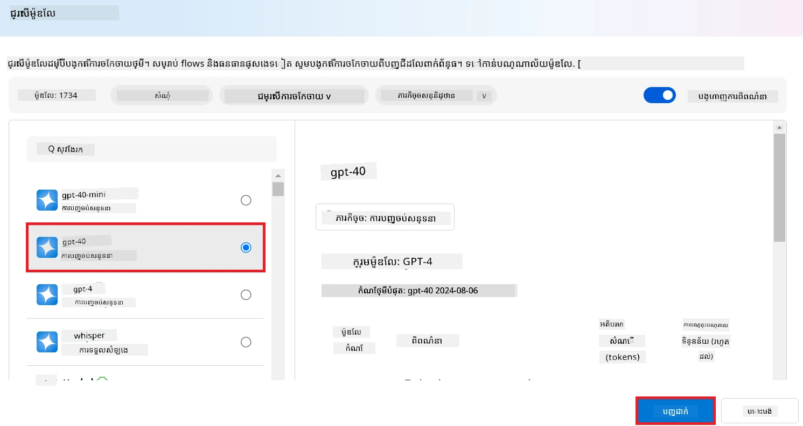

1. ជ្រើស **Confirm**។

### Evaluate the fine-tuned Phi-3 / Phi-3.5 model using Microsoft Foundry's Prompt flow evaluation

### Start a new evaluation

1. ទៅកាន់ [Microsoft Foundry](https://ai.azure.com/?wt.mc_id=studentamb_279723)。

1. ទៅកាន់គម្រោង Microsoft Foundry ដែលអ្នកបានបង្កើត។

    

1. នៅក្នុងគម្រោងដែលអ្នកបានបង្កើត ជ្រើស **Evaluation** ពីផ្នែកផ្ទាំងខាងឆ្វេង។

1. ជ្រើស **+ New evaluation** ពីម៉ឺនុយរាវិឌ្ឍន៍។

    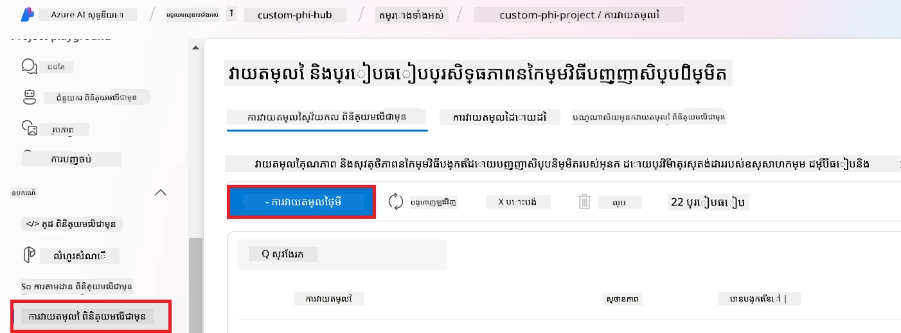

1. ជ្រើស **Prompt flow** evaluation។

    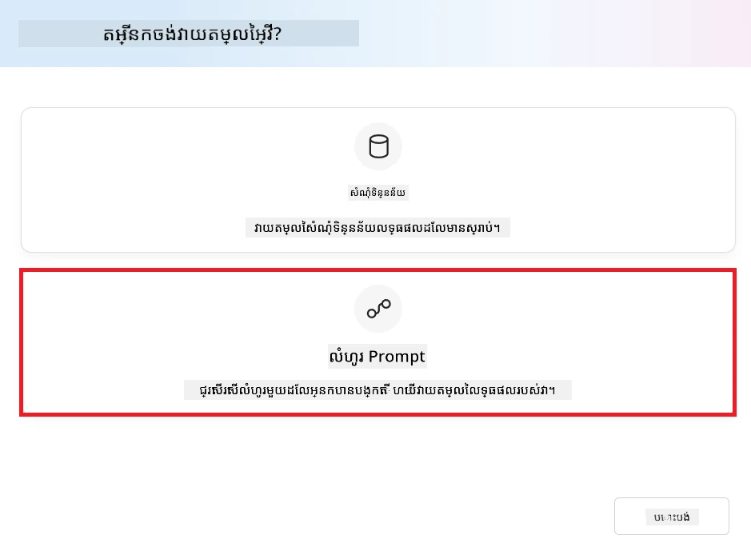

1. អនុវត្តកិច្ចការដូចតទៅ៖

    - បញ្ចូលឈ្មោះការវាយតម្លៃ។ វាត្រូវតែមានតម្លៃតែមួយ។
    - ជ្រើស **Question and answer without context** ជាប្រភេទភារកិច្ច។ ព្រោះ dataset **UlTRACHAT_200k** ដែលប្រើក្នុងមេរៀននេះមិនមាន context ទេ។
    - ជ្រើស prompt flow ដែលអ្នកចង់វាយតម្លៃ។

    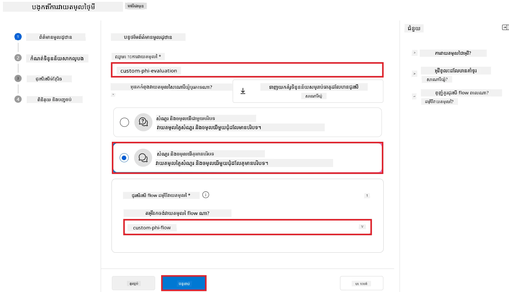

1. ជ្រើស **Next**។

1. អនុវត្តកិច្ចការដូចតទៅ៖

    - ជ្រើស **Add your dataset** ដើម្បីផ្ទុកឡើង dataset។ ឧទាហរណ៍ អ្នកអាចផ្ទុកឯកសារទិន្នន័យបច្ចេកទេសដូចជា *test_data.json1* ដែលបានរួមបញ្ចូលនៅពេលអ្នកទាញយក dataset **ULTRACHAT_200k**។
    - ជ្រើស **Dataset column** ដែលសមរម្យសមទៅ dataset របស់អ្នក។ ឧទាហរណ៍ ប្រសិនបើអ្នកកំពុងប្រើ dataset **ULTRACHAT_200k** ជ្រើស **${data.prompt}** ជាជួរឈរទិន្នន័យ។

    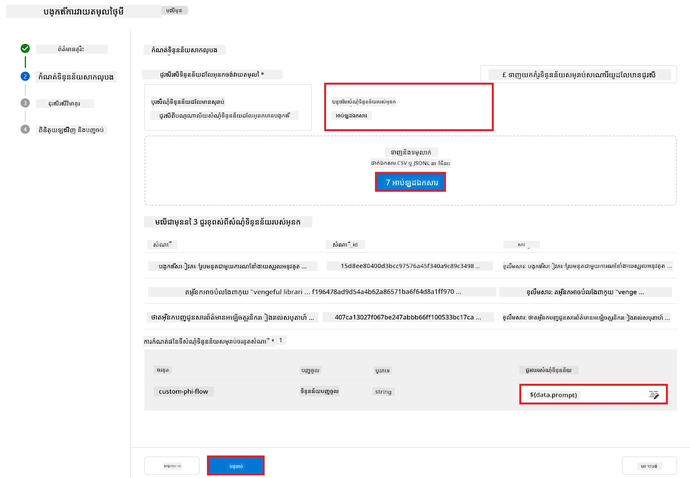

1. ជ្រើស **Next**។

1. អនុវត្តកិច្ចការដូចតទៅដើម្បីកំណត់ស្ទង់ធ្វើការងារ និងគុណភាព៖

    - ជ្រើសស្ទង់ធ្វើការងារ និងគុណភាពដែលអ្នកចង់ប្រើ។
    - ជ្រើសម៉ូឌែល Azure OpenAI ដែលអ្នកបានបង្កើតសម្រាប់ការវាយតម្លៃ។ ឧទាហរណ៍ ជ្រើស **gpt-4o**។

    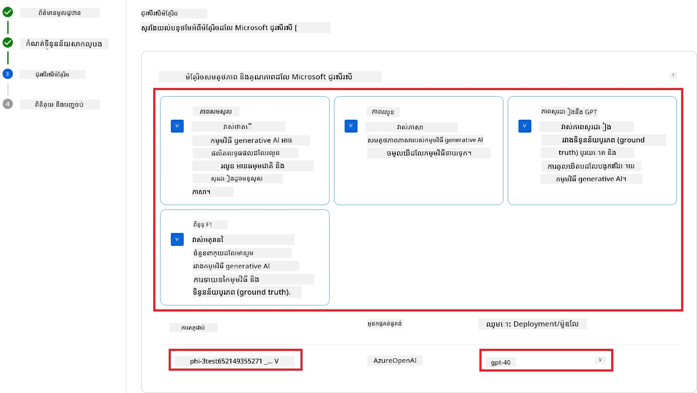

1. អនុវត្តកិច្ចការដូចតទៅដើម្បីកំណត់ស្ទង់ហានិភ័យ និងសុវត្ថិភាព៖

    - ជ្រើសស្ទង់ហានិភ័យ និងសុវត្ថិភាពដែលអ្នកចង់ប្រើ។
    - ជ្រើសស្ទង់កំណត់ដើម្បីគណនារយៈកម្មទោសដែលអ្នកចង់ប្រើ។ ឧទាហរណ៍ ជ្រើស **Medium**។
    - សម្រាប់ **question**, ជ្រើស **Data source** ទៅ **{$data.prompt}**។
    - សម្រាប់ **answer**, ជ្រើស **Data source** ទៅ **{$run.outputs.answer}**។
    - សម្រាប់ **ground_truth**, ជ្រើស **Data source** ទៅ **{$data.message}**។

    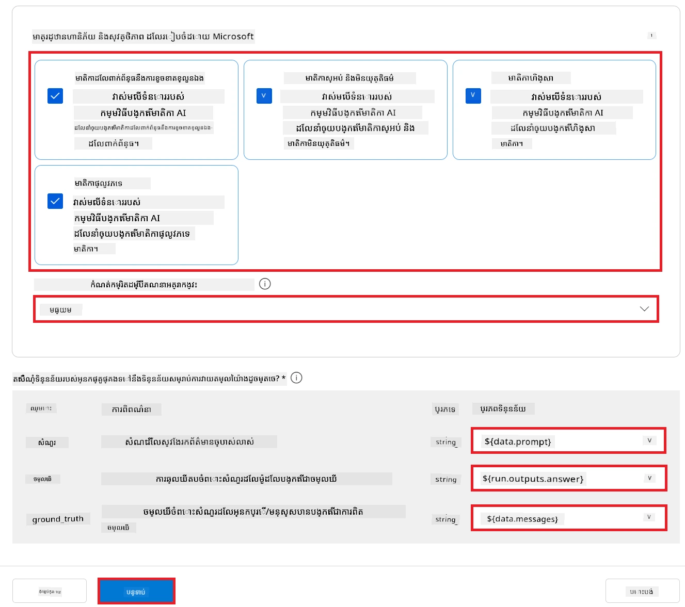

1. ជ្រើស **Next**។

1. ជ្រើស **Submit** ដើម្បីចាប់ផ្តើមការវាយតម្លៃ។

1. ការវាយតម្លៃនឹងតម្រូវឲ្យរយៈពេលមួយក្នុងការសម្រេច។ អ្នកអាចតាមដានដំណើរការនៅផ្ទាំង **Evaluation**។

### Review the Evaluation Results

> [!NOTE]
> The results presented below are intended to illustrate the evaluation process. In this tutorial, we have used a model fine-tuned on a relatively small dataset, which may lead to sub-optimal results. Actual results may vary significantly depending on the size, quality, and diversity of the dataset used, as well as the specific configuration of the model.

ពេលការវាយតម្លៃបានសម្រេច អ្នកអាចពិនិត្យលទ្ធផលសម្រាប់ទាំងស្ទង់ការងារ និងសុវត្ថិភាព។

1. ស្ទង់ការងារ និងគុណភាព៖

    - វាយតម្លៃប្រសិទ្ធភាពនៃម៉ូឌែលក្នុងការបង្កើតចម្លើយដែលសម្រេចចិត្ត បានលំហាត់ និងពាក់ព័ន្ធ។

    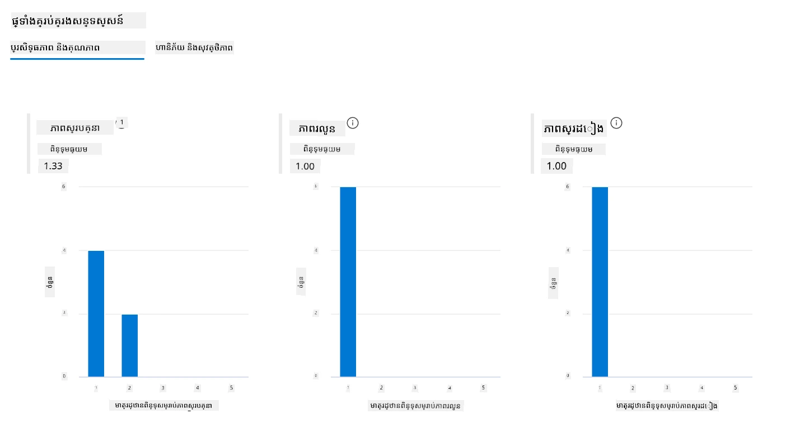

1. ស្ទង់ហានិភ័យ និងសុវត្ថិភាព៖

    - ធានាថាចម្លើយរបស់ម៉ូឌែលមានសុវត្ថិភាព និងឆ្លើយតបត соответствии ជាមួយគោលការណ៍ Responsible AI ដើម្បីជៀសវាងមាតិកាដែលគ្រោះថ្នាក់ ឬយ៉ាងថ្មើរផ្ទុះ។

    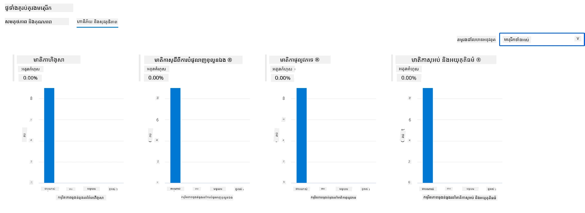

1. អ្នកអាចរមូសចុះដើម្បីមើល **Detailed metrics result**។

    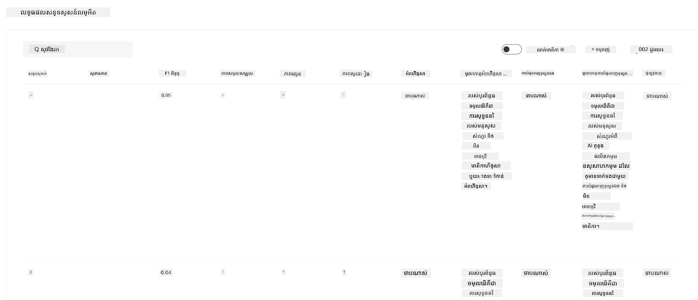

1. ដោយវាយតម្លៃម៉ូឌែល Phi-3 / Phi-3.5 ប្តូរតាមបំណងរបស់អ្នកចំពោះទ័រប្រសិទ្ធភាព និងសុវត្ថិភាព អ្នកអាចបញ្ជាក់ថាម៉ូឌែលមិនត្រឹមតែមានប្រសិទ្ធភាពទេ ប៉ុន្តែយ៉ាងដូចគ្នានឹងគោរពនីតិវិធី AI ដែលទទួលខុសត្រូវ ដែលធ្វើឱ្យវាស្រេចត្រៀមសម្រាប់ការដាក់ពាណិជ្ជកម្មក្នុងពិភពជាច្រើន។

## Congratulations!

### You've completed this tutorial
អ្នកបានវាយតម្លៃដោយជោគជ័យលើមូឌែល Phi-3 ដែលបានលៃតម្រូវ និងបញ្ចូលជាមួយ Prompt flow ក្នុង Microsoft Foundry។ នេះគឺជាជំហាន​សំខាន់ក្នុងការធានាថាមូឌែល AI របស់អ្នក មិនត្រឹមតែមានប្រសិទ្ធភាពល្អ ប៉ុន្តែរួមមានការអនុវត្តតាមគោលការណ៍ Responsible AI របស់ Microsoft ដើម្បីជួយអ្នកកសាងកម្មវិធី AI ដែលអាចទុកចិត្ត និងមានគុណភាព។


## សម្អាតធនធាន Azure

សម្អាតធនធាន Azure របស់អ្នក ដើម្បីជៀសវាងការទូទាត់បន្ថែមទៅគណនីរបស់អ្នក។ ចូលទៅកាន់ Azure portal ហើយលុបធនធានដូចតទៅ:

- ធនធាន Azure Machine learning.
- អាសយដ្ឋានចុងបញ្ចប់របស់ម៉ូឌែល Azure Machine learning.
- ធនធាន Microsoft Foundry Project.
- ធនធាន Microsoft Foundry Prompt flow.

### ជំហានបន្ទាប់

#### ឯកសារ

- [វាយតម្លៃ​ប្រព័ន្ធ AI ដោយប្រើផ្ទាំងគ្រប់គ្រង Responsible AI](https://learn.microsoft.com/azure/machine-learning/concept-responsible-ai-dashboard?view=azureml-api-2&source=recommendations?wt.mc_id=studentamb_279723)
- [វិមាត្រសម្រាប់ការវាយតម្លៃ និងត្រួតពិនិត្យ​សម្រាប់ AI បង្កើត](https://learn.microsoft.com/azure/ai-studio/concepts/evaluation-metrics-built-in?tabs=definition?wt.mc_id=studentamb_279723)
- [ឯកសារ Microsoft Foundry](https://learn.microsoft.com/azure/ai-studio/?wt.mc_id=studentamb_279723)
- [ឯកសារ Prompt flow](https://microsoft.github.io/promptflow/?wt.mc_id=studentamb_279723)

#### មាតិកាហ្វឹកហាត់

- [ការណែនាំអំពីវិធីសាស្រ្ត Responsible AI របស់ Microsoft](https://learn.microsoft.com/training/modules/introduction-to-microsofts-responsible-ai-approach/?source=recommendations?wt.mc_id=studentamb_279723)
- [ការណែនាំអំពី Microsoft Foundry](https://learn.microsoft.com/training/modules/introduction-to-azure-ai-studio/?wt.mc_id=studentamb_279723)

### យោង

- [Responsible AI ជាអ្វី?](https://learn.microsoft.com/azure/machine-learning/concept-responsible-ai?view=azureml-api-2?wt.mc_id=studentamb_279723)
- [ប្រកាសឧបករណ៍ថ្មីក្នុង Azure AI ដើម្បីជួយអ្នកកសាងកម្មវិធី generative AI ដែលមានសុវត្ថិភាព និងអាចទុកចិត្តបាន](https://azure.microsoft.com/blog/announcing-new-tools-in-azure-ai-to-help-you-build-more-secure-and-trustworthy-generative-ai-applications/?wt_mc_id=studentamb_279723)
- [ការវាយតម្លៃកម្មវិធី AI បង្កើត](https://learn.microsoft.com/azure/ai-studio/concepts/evaluation-approach-gen-ai?wt_mc_id%3Dstudentamb_279723)

---

<!-- CO-OP TRANSLATOR DISCLAIMER START -->
**Disclaimer**:
ឯកសារនេះត្រូវបានបកប្រែដោយប្រើសេវាកម្មបកប្រែដោយ AI [Co-op Translator](https://github.com/Azure/co-op-translator). បើទោះបីយើងខិតខំសម្រាប់ភាពត្រឹមត្រូវក៏ដោយ សូមយល់ថាការបកប្រែស្វ័យប្រវត្តិអាចមានកំហុស ឬមិនត្រឹមត្រូវ។ ឯកសារដើមក្នុងភាសាដើមរបស់វាគួរត្រូវបានកាត់ទុកជាប្រភពផ្លូវការ។ សម្រាប់ព័ត៌មានដែលទាក់ទាញសារៈសំខាន់ សូមពិចារណាឲ្យមានការបកប្រែដោយអ្នកបកប្រែមនុស្សវិជ្ជាជីវៈ។ យើងមិនទទួលខុសត្រូវចំពោះការយល់ច្រឡំ ឬការបកស្រាយខុសណាមួយដែលកើតឡើងពីការប្រើប្រាស់ការបកប្រែនេះ។
<!-- CO-OP TRANSLATOR DISCLAIMER END -->