# កែតម្រូវ (Fine-tune) និង បញ្ចូលម៉ូឌែល Phi-3 ផ្ទាល់ខ្លួន ជាមួយ Prompt flow

ឧទាហរណ៍ចាប់ពីដើមដល់ចប់ (E2E) នេះមានមូលដ្ឋានលើមគ្គុទេសក៍ "[កែតម្រូវ និង បញ្ចូលម៉ូឌែល Phi-3 ផ្ទាល់ខ្លួន ជាមួយ Prompt Flow: មគ្គុទេសក៍​ជំហ៊ាន​ដល់​ជំហ៊ាន](https://techcommunity.microsoft.com/t5/educator-developer-blog/fine-tune-and-integrate-custom-phi-3-models-with-prompt-flow/ba-p/4178612?WT.mc_id=aiml-137032-kinfeylo)" ពី Microsoft Tech Community។ វណែនាំដំណើរការការកែតម្រូវ (fine-tuning), ការតែងតាំង (deploy), និង ការបញ្ចូលម៉ូឌែល Phi-3 ផ្ទាល់ខ្លួន ជាមួយ Prompt flow។

## សង្ខេប

ក្នុងឧទាហរណ៍ E2E នេះ អ្នកនឹងរៀនពីរបៀបកែតម្រូវម៉ូឌែល Phi-3 ហើយបញ្ចូលវាជាមួយ Prompt flow។ ដោយប្រើប្រាស់ Azure Machine Learning និង Prompt flow អ្នកនឹងបង្កើតសូម្បី workflow សម្រាប់ការតែងតាំង និងប្រើម៉ូឌែល AI ផ្ទាល់ខ្លួន។ ឧទាហរណ៍ E2E នេះចែកចេញជា៣សេណារីយ៉ូ:

**សេណារីយ៉ូ 1៖ កំណត់ធនធាន Azure និង រៀបចំសម្រាប់ការកែតម្រូវ**

**សេណារីយ៉ូ 2៖ កែតម្រូវម៉ូឌែល Phi-3 និង តែងតាំងនៅក្នុង Azure Machine Learning Studio**

**សេណារីយ៉ូ 3៖ បញ្ចូលជាមួយ Prompt flow និង ប្រើជជែកជាមួយម៉ូឌែលផ្ទាល់ខ្លួនរបស់អ្នក**

នេះជាសង្ខេបនៃឧទាហរណ៍ E2E នេះ។

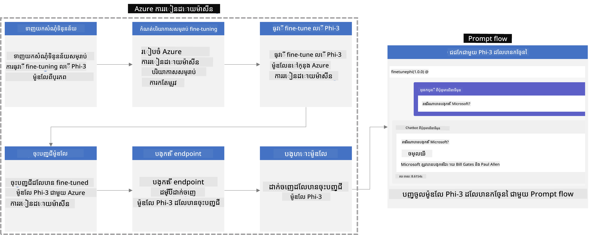

### តារាងមាតិក

1. **[សេណារីយ៉ូ 1៖ កំណត់ធនធាន Azure និង រៀបចំសម្រាប់ការកែតម្រូវ](#សេណារីយ៉ូ-1៖-កំណត់ធនធាន-azure-និង-រៀបចំសម្រាប់ការកែតម្រូវ)**
    - [បង្កើត Azure Machine Learning Workspace](#បង្កើត-azure-machine-learning-workspace)
    - [ស្នើសុំគណនា GPU quotas ក្នុង Azure Subscription](#ស្នើសុំគណនា-gpu-quotas-ក្នុង-azure-subscription)
    - [បន្ថែមការតែងតាំងតួនាទី (role assignment)](#បន្ថែមការតែងតាំងតួនាទី-role-assignment)
    - [កំណត់គម្រោង](#កំណត់គម្រោង)
    - [រៀបចំសំណុំទិន្នន័យសម្រាប់ការកែតម្រូវ](#prepare-dataset-for-fine-tuning)

1. **[សេណារីយ៉ូ 2៖ កែតម្រូវម៉ូឌែល Phi-3 និង តែងតាំងនៅក្នុង Azure Machine Learning Studio](#scenario-2-fine-tune-phi-3-model-and-deploy-in-azure-machine-learning-studio)**
    - [កំណត់ Azure CLI](#set-up-azure-cli)
    - [កែតម្រូវម៉ូឌែល Phi-3](#fine-tune-the-phi-3-model)
    - [តែងតាំងម៉ូឌែលដែលបានកែតម្រូវ](#deploy-the-fine-tuned-model)

1. **[សេណារីយ៉ូ 3៖ បញ្ចូលជាមួយ Prompt flow និង ប្រើជជែកជាមួយម៉ូឌែលផ្ទាល់ខ្លួនរបស់អ្នក](#ស្ថានភាព-3-រួមបញ្ចូលជាមួយ-prompt-flow-និង-សន្ទនាជាមួយម៉ូដែលផ្ទាល់ខ្លួនរបស់អ្នក)**
    - [បញ្ចូលម៉ូឌែល Phi-3 ផ្ទាល់ខ្លួនជាមួយ Prompt flow](#រួមបញ្ចូលម៉ូដែល-phi-3-ផ្ទាល់ខ្លួនទៅជាមួយ-prompt-flow)
    - [ជជែកជាមួយម៉ូឌែលផ្ទាល់ខ្លួនរបស់អ្នក](#សន្ទនាជាមួយម៉ូដែលផ្ទាល់ខ្លួនរបស់អ្នក)

## សេណារីយ៉ូ 1៖ កំណត់ធនធាន Azure និង រៀបចំសម្រាប់ការកែតម្រូវ

### បង្កើត Azure Machine Learning Workspace

1. វាយ *azure machine learning* នៅក្នុង **របារស្វែងរក** ខាងលើទំព័រប្រព័ន្ធ (portal) ហើយជ្រើស **Azure Machine Learning** ពីជម្រើសដែលបង្ហាញ។

    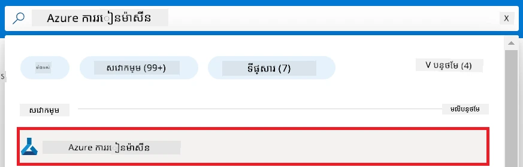

1. ជ្រើស **+ Create** ពីម៉ឺនុយរុករក។

1. ជ្រើស **New workspace** ពីម៉ឺនុយរុករក។

    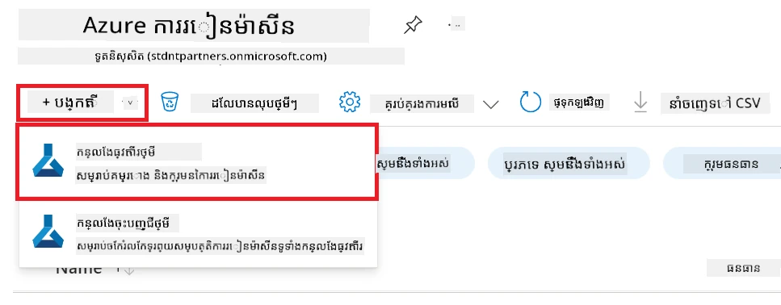

1. អនុវត្តការងារបន្ទាប់៖

    - ជ្រើស Azure **Subscription** របស់អ្នក។
    - ជ្រើស **Resource group** ដែលចង់ប្រើ (បង្កើតថ្មីប្រសិនបើត្រូវការ)។
    - បញ្ចូល **Workspace Name**។ វាត្រូវតែមានតម្លៃខុសគ្នា (unique)។
    - ជ្រើស **Region** ដែលអ្នកចង់ប្រើ។
    - ជ្រើស **Storage account** ដែលចង់ប្រើ (បង្កើតថ្មីប្រសិនបើត្រូវការ)។
    - ជ្រើស **Key vault** ដែលចង់ប្រើ (បង្កើតថ្មីប្រសិនបើត្រូវការ)។
    - ជ្រើស **Application insights** ដែលចង់ប្រើ (បង្កើតថ្មីប្រសិនបើត្រូវការ)។
    - ជ្រើស **Container registry** ដែលចង់ប្រើ (បង្កើតថ្មីប្រសិនបើត្រូវការ)។

    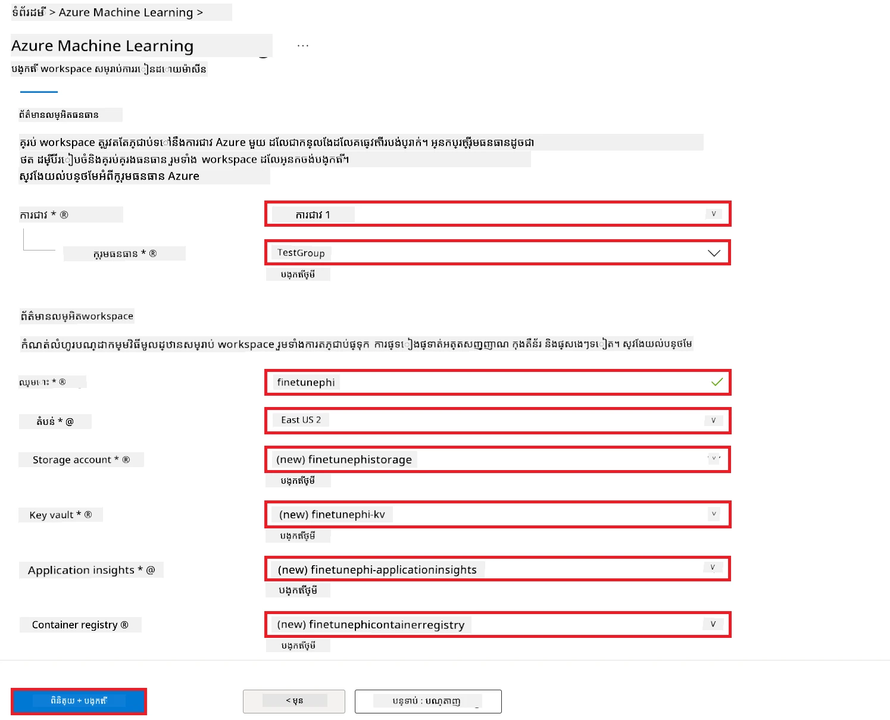

1. ជ្រើស **Review + Create**។

1. ជ្រើស **Create**។

### ស្នើសុំគណនា GPU quotas ក្នុង Azure Subscription

ក្នុងឧទាហរណ៍ E2E នេះ អ្នកនឹងប្រើ *Standard_NC24ads_A100_v4 GPU* សម្រាប់ការកែតម្រូវ ដែលទាមទារការស្នើសុំ quota, និង *Standard_E4s_v3* CPU សម្រាប់ការតែងតាំង ដែលមិនទាមទារស្នើសុំ quota។

> [!NOTE]
>
> រូបមន្ត Subscription ផ្តល់ប្រាក់តាម Pay-As-You-Go (ប្រភេទ Subscription រង្សីធម្មតា) តែប៉ុណ្ណោះដែលមានសិទ្ធិទទួលចែកចាយ GPU; subscription ប្រភេទ benefit មិនគាំទ្រនាក់នៅបច្ចុប្បន្ន។
>
> សម្រាប់អ្នកដែលប្រើ subscription ចំណេញ (ដូចជា Visual Studio Enterprise Subscription) ឬអ្នកចង់សាកល្បងប្រតិបត្តិការកែតម្រូវ និង តែងតាំងយ៉ាងឆាប់រហ័ស អ្នកអាចអនុវត្តការណែនាំនេះសម្រាប់កែតម្រូវជាមួយ dataset តិចតួចដោយប្រើ CPU។ ទោះជាយ៉ាងណា សូមចំណាំថា លទ្ធផលកែតម្រូវនឹងល្អប្រសើរជាច្រើនពេលប្រើ GPU ជាមួយ dataset ធំជាង។

1. ទៅកាន់ [Azure ML Studio](https://ml.azure.com/home?wt.mc_id=studentamb_279723)。

1. អនុវត្តការងារបន្ទាប់ ដើម្បីស្នើសុំ quota សម្រាប់ *Standard NCADSA100v4 Family*៖

    - ជ្រើស **Quota** ពីផ្នែកផ្នែកខាងឆ្វេង។
    - ជ្រើសក្រុម **Virtual machine family** ដែលចង់ប្រើ។ ឧ. ជ្រើស **Standard NCADSA100v4 Family Cluster Dedicated vCPUs** ដែលរួមបញ្ចូល *Standard_NC24ads_A100_v4* GPU។
    - ជ្រើស **Request quota** ពីម៉ឺនុយរុករក។

        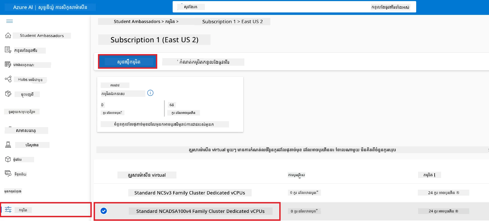

    - នៅក្នុងទំព័រ Request quota បញ្ចូល **New cores limit** ដែលអ្នកចង់ប្រើ។ ឧ. 24។
    - នៅក្នុងទំព័រ Request quota ជ្រើស **Submit** ដើម្បីស្នើសុំ GPU quota។

> [!NOTE]
> អ្នកអាចជ្រើស GPU ឬ CPU ដែលសមស្របសម្រាប់តម្រូវការរបស់អ្នកដោយយោងទៅកាន់ឯកសារ [Sizes for Virtual Machines in Azure](https://learn.microsoft.com/azure/virtual-machines/sizes/overview?tabs=breakdownseries%2Cgeneralsizelist%2Ccomputesizelist%2Cmemorysizelist%2Cstoragesizelist%2Cgpusizelist%2Cfpgasizelist%2Chpcsizelist)។

### បន្ថែមការតែងតាំងតួនាទី (role assignment)

ដើម្បីកែតម្រូវ និង តែងតាំងម៉ូឌែលរបស់អ្នក អ្នកត្រូវតែបង្កើត User Assigned Managed Identity (UAI) មួយ និង អនុវត្តការផ្ដល់សិទ្ធិទាក់ទាញ។ UAI នេះនឹងត្រូវបានប្រើសម្រាប់ការផ្ទៀងផ្ទាត់អត្តសញ្ញាណពេលបញ្ជូន (deployment)។

#### បង្កើត User Assigned Managed Identity(UAI)

1. វាយ *managed identities* នៅក្នុង **របារស្វែងរក** ខាងលើទំព័រប្រព័ន្ធ ហើយជ្រើស **Managed Identities** ពីជម្រើសដែលបង្ហាញ។

    

1. ជ្រើស **+ Create**។

    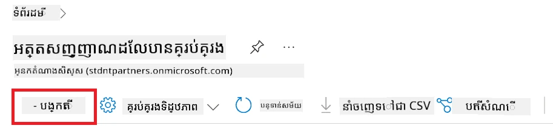

1. អនុវត្តការងារបន្ទាប់៖

    - ជ្រើស Azure **Subscription** របស់អ្នក។
    - ជ្រើស **Resource group** ដែលចង់ប្រើ (បង្កើតថ្មីប្រសិនបើត្រូវការ)।
    - ជ្រើស **Region** ដែលអ្នកចង់ប្រើ។
    - បញ្ចូល **Name**។ វាត្រូវតែមានតម្លៃខុសគ្នា (unique)។

1. ជ្រើស **Review + create**។

1. ជ្រើស **+ Create**។

#### បន្ថែមតួនាទី Contributor ទៅ Managed Identity

1. ទៅកាន់ធនធាន Managed Identity ដែលអ្នកបានបង្កើត។

1. ជ្រើស **Azure role assignments** ពីផ្នែកខាងឆ្វេង។

1. ជ្រើស **+Add role assignment** ពីម៉ឺនុយរុករក។

1. នៅក្នុងទំព័រ Add role assignment អនុវត្តការងារបន្ទាប់៖
    - ជ្រើស **Scope** ទៅ **Resource group**។
    - ជ្រើស Azure **Subscription** របស់អ្នក۔
    - ជ្រើស **Resource group** ដែលចង់ប្រើ។
    - ជ្រើស **Role** ទៅ **Contributor**។

    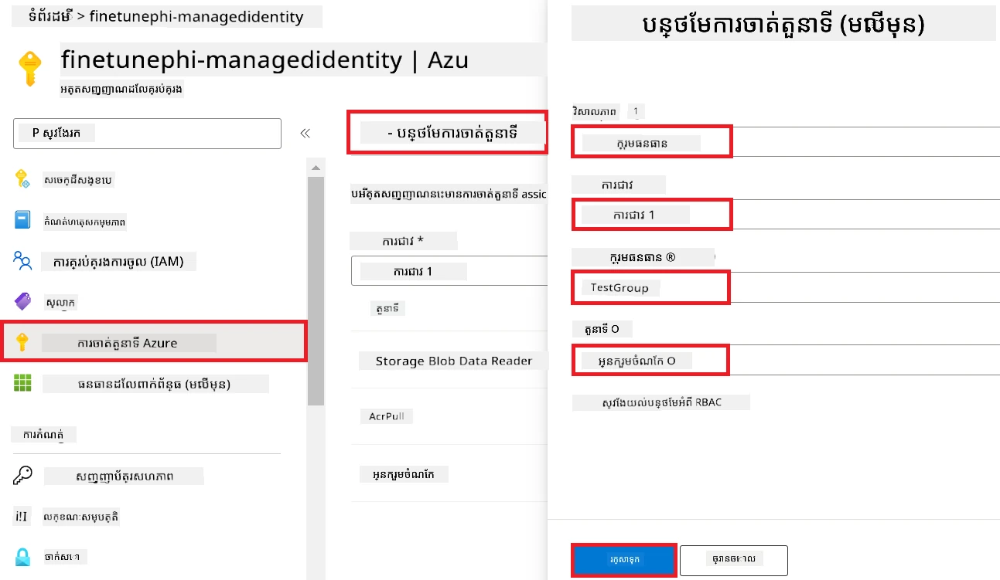

1. ជ្រើស **Save**។

#### បន្ថែមតួនាទី Storage Blob Data Reader ទៅ Managed Identity

1. វាយ *storage accounts* នៅក្នុង **របារស្វែងរក** ខាងលើទំព័រប្រព័ន្ធ ហើយជ្រើស **Storage accounts** ពីជម្រើសដែលបង្ហាញ។

    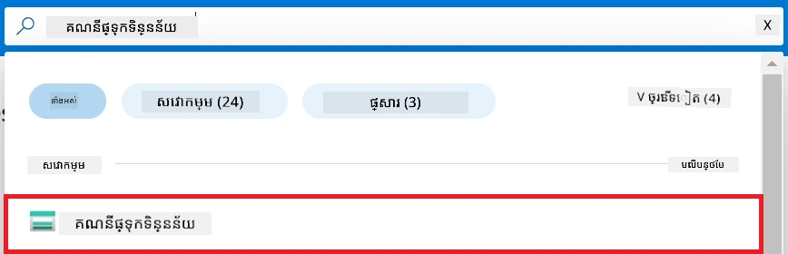

1. ជ្រើសគណនី storage ដែលសម្របសម្រាប់ Azure Machine Learning workspace ដែលអ្នកបានបង្កើត។ ឧ. *finetunephistorage*។

1. អនុវត្តការងារបន្ទាប់ដើម្បីទៅកាន់ទំព័រ Add role assignment៖

    - ទៅកាន់ Azure Storage account ដែលអ្នកបានបង្កើត។
    - ជ្រើស **Access Control (IAM)** ពីផ្នែកខាងឆ្វេង។
    - ជ្រើស **+ Add** ពីម៉ឺនុយរុករក។
    - ជ្រើស **Add role assignment** ពីម៉ឺនុយរុករក។

    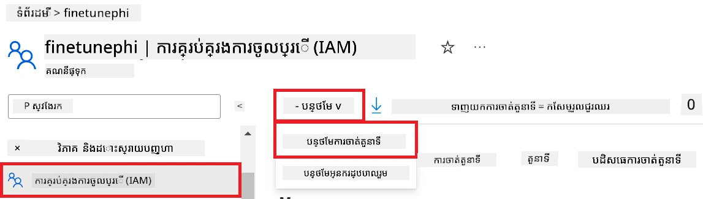

1. នៅក្នុងទំព័រ Add role assignment អនុវត្តការងារបន្ទាប់៖

    - នៅក្នុងទំព័រ Role វាយ *Storage Blob Data Reader* ក្នុង **របារស្វែងរក** ហើយជ្រើស **Storage Blob Data Reader** ពីជម្រើសដែលបង្ហាញ។
    - នៅក្នុងទំព័រ Role ជ្រើស **Next**។
    - នៅក្នុងទំព័រ Members ជ្រើស **Assign access to** **Managed identity**។
    - នៅក្នុងទំព័រ Members ជ្រើស **+ Select members**។
    - នៅក្នុងទំព័រ Select managed identities ជ្រើស Azure **Subscription** របស់អ្នក។
    - នៅក្នុងទំព័រ Select managed identities ជ្រើស **Managed identity** ទៅ **Manage Identity**។
    - នៅក្នុងទំព័រ Select managed identities ជ្រើស Manage Identity ដែលអ្នកបានបង្កើត។ ឧ. *finetunephi-managedidentity*។
    - នៅក្នុងទំព័រ Select managed identities ជ្រើស **Select**។

    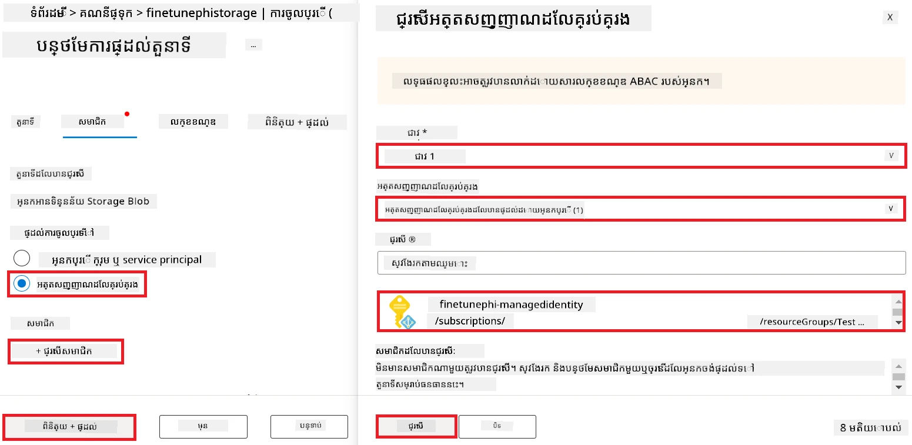

1. ជ្រើស **Review + assign**។

#### បន្ថែមតួនាទី AcrPull ទៅ Managed Identity

1. វាយ *container registries* នៅក្នុង **របារស្វែងរក** ខាងលើទំព័រប្រព័ន្ធ ហើយជ្រើស **Container registries** ពីជម្រើសដែលបង្ហាញ។

    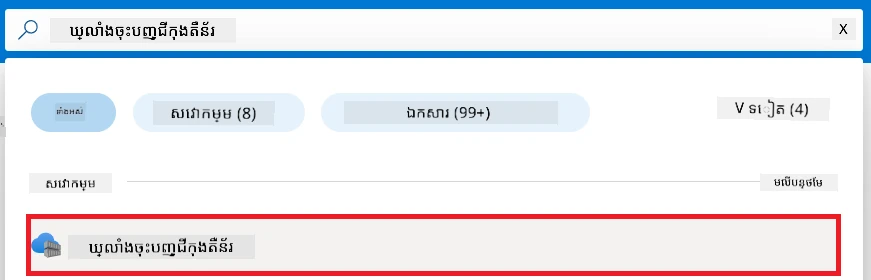

1.ជ្រើស container registry ដែលភ្ជាប់ជាមួយ Azure Machine Learning workspace។ ឧ. *finetunephicontainerregistries*

1. អនុវត្តការងារបន្ទាប់ដើម្បីទៅកាន់ទំព័រ Add role assignment:

    - ជ្រើស **Access Control (IAM)** ពីផ្នែកខាងឆ្វេង។
    - ជ្រើស **+ Add** ពីម៉ឺនុយរុករក។
    - ជ្រើស **Add role assignment** ពីម៉ឺនុយរុករក។

1. នៅក្នុងទំព័រ Add role assignment អនុវត្តការងារបន្ទាប់៖

    - នៅក្នុងទំព័រ Role វាយ *AcrPull* ក្នុង **របារស្វែងរក** ហើយជ្រើស **AcrPull** ពីជម្រើសដែលបង្ហាញ។
    - នៅក្នុងទំព័រ Role ជ្រើស **Next**។
    - នៅក្នុងទំព័រ Members ជ្រើស **Assign access to** **Managed identity**។
    - នៅក្នុងទំព័រ Members ជ្រើស **+ Select members**។
    - នៅក្នុងទំព័រ Select managed identities ជ្រើស Azure **Subscription** របស់អ្នក।
    - នៅក្នុងទំព័រ Select managed identities ជ្រើស **Managed identity** ទៅ **Manage Identity**។
    - នៅក្នុងទំព័រ Select managed identities ជ្រើស Manage Identity ដែលអ្នកបានបង្កើត។ ឧ. *finetunephi-managedidentity*។
    - នៅក្នុងទំព័រ Select managed identities ជ្រើស **Select**។
    - ជ្រើស **Review + assign**។

### កំណត់គម្រោង

ឥឡូវនេះ អ្នកនឹងបង្កើតថតម៉ាស៊ីនមួយដើម្បីធ្វើការ និង កំណត់បរិយាកាសវីដឺអឺ (virtual environment) ដើម្បីអភិវឌ្ឍកម្មវិធីមួយដែលអាចអន្តរកម្មជាមួយអ្នកប្រើ និង ប្រើប្រវត្តិការជជែកដែលបានរក្សាទុកពី Azure Cosmos DB ដើម្បីផ្សព្វផ្សាយការឆ្លើយតប។

#### បង្កើតថតមួយសម្រាប់ធ្វើការក្នុងវា

1. បើកបង្អួច terminal ហើយវាយពាក្យបញ្ជាខាងក្រោម ដើម្បីបង្កើតថតឈ្មោះ *finetune-phi* នៅក្នុងផ្លូវលំនាំដើម។

    ```console
    mkdir finetune-phi
    ```

1. វាយពាក្យបញ្ជាខាងក្រោមនៅក្នុង terminal របស់អ្នក ដើម្បីចូលទៅក្នុងថត *finetune-phi* ដែលបានបង្កើត។

    ```console
    cd finetune-phi
    ```

#### បង្កើតបរិយាកាសវីដឺអឺ (virtual environment)

1. វាយពាក្យបញ្ជាខាងក្រោមនៅក្នុង terminal របស់អ្នក ដើម្បីបង្កើត virtual environment ឈ្មោះ *.venv*។

    ```console
    python -m venv .venv
    ```

1. វាយពាក្យបញ្ជាខាងក្រោមនៅក្នុង terminal របស់អ្នក ដើម្បីបើក virtual environment ។

    ```console
    .venv\Scripts\activate.bat
    ```

> [!NOTE]
>
> ប្រសិនបើវាធ្វើការ អ្នកគួរតែឃើញ *(.venv)* មុន prompt នៃពាក្យបញ្ជា។

#### ដំឡើងកញ្ចប់ដែលត្រូវការ

1. វាយពាក្យបញ្ជាខាងក្រោមនៅក្នុង terminal របស់អ្នក ដើម្បីដំឡើងកញ្ចប់ដែលត្រូវការ។

    ```console
    pip install datasets==2.19.1
    pip install transformers==4.41.1
    pip install azure-ai-ml==1.16.0
    pip install torch==2.3.1
    pip install trl==0.9.4
    pip install promptflow==1.12.0
    ```

#### បង្កើតឯកសារ​គម្រោង

ក្នុងលំហាត់នេះ អ្នកនឹងបង្កើតឯកសារសំខាន់ៗសម្រាប់គម្រោងរបស់我們។ ឯកសារ​ទាំងនេះរួមមាន script សម្រាប់ទាញយកសំណុំទិន្នន័យ, កំណត់បរិយាកាស Azure Machine Learning, កែតម្រូវម៉ូឌែល Phi-3, និង តែងតាំងម៉ូឌែលដែលបានកែតម្រូវ។ អ្នកនឹងបង្កើតឯកសារ *conda.yml* មួយសម្រាប់កំណត់បរិយាកាសសម្រាប់ការកែតម្រូវផងដែរ។

ក្នុងលំហាត់នេះ អ្នកនឹង៖

- បង្កើតឯកសារ *download_dataset.py* មួយសម្រាប់ទាញយកសំណុំទិន្នន័យ។
- Create a *setup_ml.py* file to set up the Azure Machine Learning environment.
- Create a *fine_tune.py* file in the *finetuning_dir* folder to fine-tune the Phi-3 model using the dataset.
- Create a *conda.yml* file to setup fine-tuning environment.
- Create a *deploy_model.py* file to deploy the fine-tuned model.
- Create a *integrate_with_promptflow.py* file, to integrate the fine-tuned model and execute the model using Prompt flow.
- Create a flow.dag.yml file, to set up the workflow structure for Prompt flow.
- Create a *config.py* file to enter Azure information.

> [!NOTE]
>
> Complete folder structure:
>
> ```text
> └── YourUserName
> .    └── finetune-phi
> .        ├── finetuning_dir
> .        │      └── fine_tune.py
> .        ├── conda.yml
> .        ├── config.py
> .        ├── deploy_model.py
> .        ├── download_dataset.py
> .        ├── flow.dag.yml
> .        ├── integrate_with_promptflow.py
> .        └── setup_ml.py
> ```

1. Open **Visual Studio Code**.

1. Select **File** from the menu bar.

1. Select **Open Folder**.

1. Select the *finetune-phi* folder that you created, which is located at *C:\Users\yourUserName\finetune-phi*.

    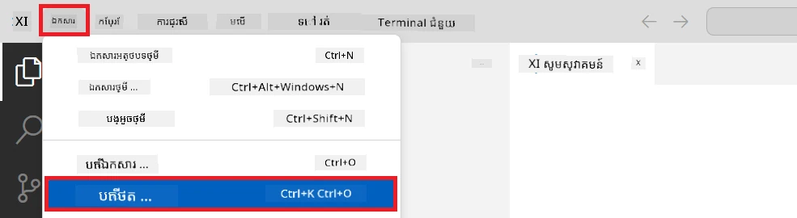

1. In the left pane of Visual Studio Code, right-click and select **New File** to create a new file named *download_dataset.py*.

1. In the left pane of Visual Studio Code, right-click and select **New File** to create a new file named *setup_ml.py*.

1. In the left pane of Visual Studio Code, right-click and select **New File** to create a new file named *deploy_model.py*.

    

1. In the left pane of Visual Studio Code, right-click and select **New Folder** to create a new forder named *finetuning_dir*.

1. In the *finetuning_dir* folder, create a new file named *fine_tune.py*.

#### Create and Configure *conda.yml* file

1. In the left pane of Visual Studio Code, right-click and select **New File** to create a new file named *conda.yml*.

1. Add the following code to the *conda.yml* file to set up the fine-tuning environment for the Phi-3 model.

    ```yml
    name: phi-3-training-env
    channels:
      - defaults
      - conda-forge
    dependencies:
      - python=3.10
      - pip
      - numpy<2.0
      - pip:
          - torch==2.4.0
          - torchvision==0.19.0
          - trl==0.8.6
          - transformers==4.41
          - datasets==2.21.0
          - azureml-core==1.57.0
          - azure-storage-blob==12.19.0
          - azure-ai-ml==1.16
          - azure-identity==1.17.1
          - accelerate==0.33.0
          - mlflow==2.15.1
          - azureml-mlflow==1.57.0
    ```

#### Create and Configure *config.py* file

1. In the left pane of Visual Studio Code, right-click and select **New File** to create a new file named *config.py*.

1. Add the following code to the *config.py* file to include your Azure information.

    ```python
    # ការកំណត់ Azure
    AZURE_SUBSCRIPTION_ID = "your_subscription_id"
    AZURE_RESOURCE_GROUP_NAME = "your_resource_group_name" # "TestGroup"

    # ការកំណត់ Azure Machine Learning
    AZURE_ML_WORKSPACE_NAME = "your_workspace_name" # "finetunephi-workspace"

    # ការកំណត់ អត្តសញ្ញាណគ្រប់គ្រងរបស់ Azure
    AZURE_MANAGED_IDENTITY_CLIENT_ID = "your_azure_managed_identity_client_id"
    AZURE_MANAGED_IDENTITY_NAME = "your_azure_managed_identity_name" # "finetune-phi-mangedidentity"
    AZURE_MANAGED_IDENTITY_RESOURCE_ID = f"/subscriptions/{AZURE_SUBSCRIPTION_ID}/resourceGroups/{AZURE_RESOURCE_GROUP_NAME}/providers/Microsoft.ManagedIdentity/userAssignedIdentities/{AZURE_MANAGED_IDENTITY_NAME}"

    # ផ្លូវ​ឯកសារទិន្នន័យ
    TRAIN_DATA_PATH = "data/train_data.jsonl"
    TEST_DATA_PATH = "data/test_data.jsonl"

    # ការកំណត់ម៉ូដែលដែលបានបង្វឹកបន្ថែម
    AZURE_MODEL_NAME = "your_fine_tuned_model_name" # "finetune-phi-model"
    AZURE_ENDPOINT_NAME = "your_fine_tuned_model_endpoint_name" # "finetune-phi-endpoint"
    AZURE_DEPLOYMENT_NAME = "your_fine_tuned_model_deployment_name" # "finetune-phi-deployment"

    AZURE_ML_API_KEY = "your_fine_tuned_model_api_key"
    AZURE_ML_ENDPOINT = "your_fine_tuned_model_endpoint_uri" # "https://{your-endpoint-name}.{your-region}.inference.ml.azure.com/score"
    ```

#### Add Azure environment variables

1. Perform the following tasks to add the Azure Subscription ID:

    - Type *subscriptions* in the **search bar** at the top of the portal page and select **Subscriptions** from the options that appear.
    - Select the Azure Subscription you are currently using.
    - Copy and paste your Subscription ID into the *config.py* file.

    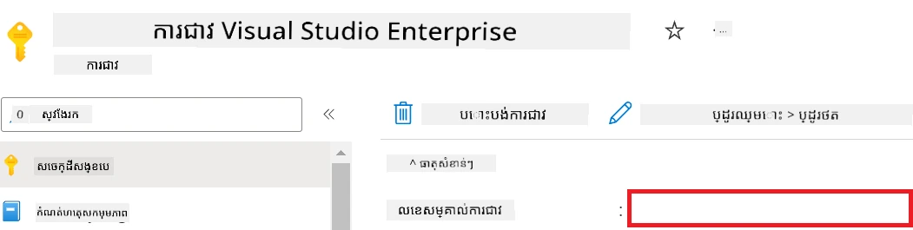

1. Perform the following tasks to add the Azure Workspace Name:

    - Navigate to the Azure Machine Learning resource that you created.
    - Copy and paste your account name into the *config.py* file.

    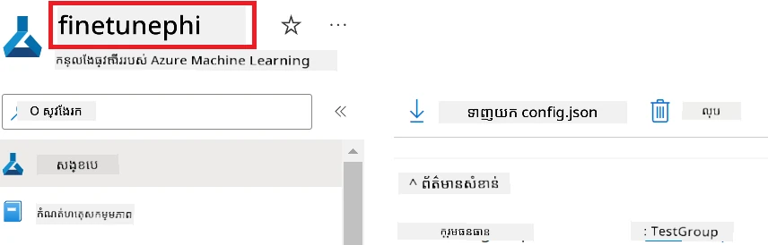

1. Perform the following tasks to add the Azure Resource Group Name:

    - Navigate to the Azure Machine Learning resource that you created.
    - Copy and paste your Azure Resource Group Name into the *config.py* file.

    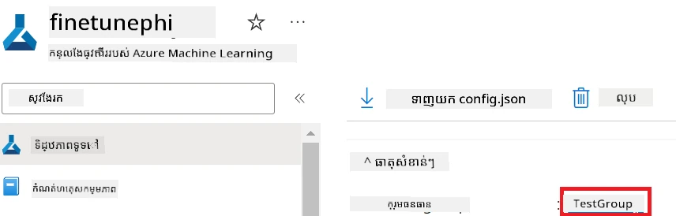

2. Perform the following tasks to add the Azure Managed Identity name

    - Navigate to the Managed Identities resource that you created.
    - Copy and paste your Azure Managed Identity name into the *config.py* file.

    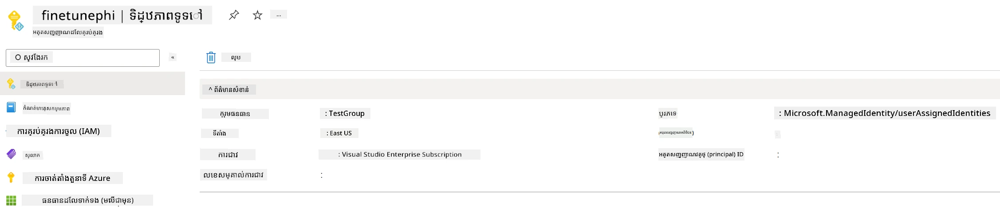

### Prepare dataset for fine-tuning

In this exercise, you will run the *download_dataset.py* file to download the *ULTRACHAT_200k* datasets to your local environment. You will then use this datasets to fine-tune the Phi-3 model in Azure Machine Learning.

#### Download your dataset using *download_dataset.py*

1. Open the *download_dataset.py* file in Visual Studio Code.

1. Add the following code into *download_dataset.py*.

    ```python
    import json
    import os
    from datasets import load_dataset
    from config import (
        TRAIN_DATA_PATH,
        TEST_DATA_PATH)

    def load_and_split_dataset(dataset_name, config_name, split_ratio):
        """
        Load and split a dataset.
        """
        # ផ្ទុកសំណុំទិន្នន័យដែលមានឈ្មោះ ការកំណត់រចនាសម្ព័ន្ធ និងអត្រាបំបែកដែលបានបញ្ជាក់
        dataset = load_dataset(dataset_name, config_name, split=split_ratio)
        print(f"Original dataset size: {len(dataset)}")
        
        # បំបែកសំណុំទិន្នន័យទៅជាសំណុំបណ្តុះបណ្តាល និងសំណុំសាកល្បង (80% សម្រាប់បណ្តុះបណ្តាល, 20% សម្រាប់សាកល្បង)
        split_dataset = dataset.train_test_split(test_size=0.2)
        print(f"Train dataset size: {len(split_dataset['train'])}")
        print(f"Test dataset size: {len(split_dataset['test'])}")
        
        return split_dataset

    def save_dataset_to_jsonl(dataset, filepath):
        """
        Save a dataset to a JSONL file.
        """
        # បង្កើតថតឯកសារបើវាមិនមានទេ
        os.makedirs(os.path.dirname(filepath), exist_ok=True)
        
        # បើកឯកសារនៅក្នុងរបៀបសរសេរ
        with open(filepath, 'w', encoding='utf-8') as f:
            # ធ្វើសកម្មភាពលើកំណត់ត្រារៀងរាល់មួយក្នុងសំណុំទិន្នន័យ
            for record in dataset:
                # បម្លែងកំណត់ត្រាបានជាវត្ថុ JSON ហើយសរសេរវាទៅឯកសារ
                json.dump(record, f)
                # សរសេរតួអក្សរបន្ទាត់ថ្មីដើម្បីបំបែកកំណត់ត្រា
                f.write('\n')
        
        print(f"Dataset saved to {filepath}")

    def main():
        """
        Main function to load, split, and save the dataset.
        """
        # ផ្ទុក និងបំបែកសំណុំទិន្នន័យ ULTRACHAT_200k ដោយមានការកំណត់រចនាសម្ព័ន្ធ និងអត្រាបំបែកជាក់លាក់
        dataset = load_and_split_dataset("HuggingFaceH4/ultrachat_200k", 'default', 'train_sft[:1%]')
        
        # យកសំណុំទិន្នន័យបណ្តុះបណ្តាល និងសំណុំទិន្នន័យសាកល្បងពីការបំបែក
        train_dataset = dataset['train']
        test_dataset = dataset['test']

        # រក្សាសំណុំទិន្នន័យបណ្តុះបណ្តាល​ជា​ឯកសារ JSONL
        save_dataset_to_jsonl(train_dataset, TRAIN_DATA_PATH)
        
        # រក្សាសំណុំទិន្នន័យសាកល្បងទៅឯកសារ JSONL ផ្សេងទៀត
        save_dataset_to_jsonl(test_dataset, TEST_DATA_PATH)

    if __name__ == "__main__":
        main()

    ```

> [!TIP]
>
> **Guidance for fine-tuning with a minimal dataset using a CPU**
>
> If you want to use a CPU for fine-tuning, this approach is ideal for those with benefit subscriptions (such as Visual Studio Enterprise Subscription) or to quickly test the fine-tuning and deployment process.
>
> Replace `dataset = load_and_split_dataset("HuggingFaceH4/ultrachat_200k", 'default', 'train_sft[:1%]')` with `dataset = load_and_split_dataset("HuggingFaceH4/ultrachat_200k", 'default', 'train_sft[:10]')`
>

1. Type the following command inside your terminal to run the script and download the dataset to your local environment.

    ```console
    python download_data.py
    ```

1. Verify that the datasets were saved successfully to your local *finetune-phi/data* directory.

> [!NOTE]
>
> **Dataset size and fine-tuning time**
>
> In this E2E sample, you use only 1% of the dataset (`train_sft[:1%]`). This significantly reduces the amount of data, speeding up both the upload and fine-tuning processes. You can adjust the percentage to find the right balance between training time and model performance. Using a smaller subset of the dataset reduces the time required for fine-tuning, making the process more manageable for a E2E sample.

## Scenario 2: Fine-tune Phi-3 model and Deploy in Azure Machine Learning Studio

### Set up Azure CLI

You need to set up Azure CLI to authenticate your environment. Azure CLI allows you to manage Azure resources directly from the command line and provides the credentials necessary for Azure Machine Learning to access these resources. To get started install [Azure CLI](https://learn.microsoft.com/cli/azure/install-azure-cli)

1. Open a terminal window and type the following command to log in to your Azure account.

    ```console
    az login
    ```

1. Select your Azure account to use.

1. Select your Azure subscription to use.

    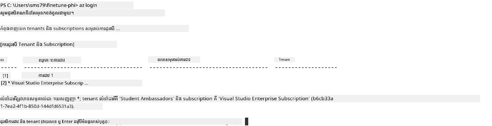

> [!TIP]
>
> If you're having trouble signing in to Azure, try using a device code. Open a terminal window and type the following command to sign in to your Azure account:
>
> ```console
> az login --use-device-code
> ```
>

### Fine-tune the Phi-3 model

In this exercise, you will fine-tune the Phi-3 model using the provided dataset. First, you will define the fine-tuning process in the *fine_tune.py* file. Then, you will configure the Azure Machine Learning environment and initiate the fine-tuning process by running the *setup_ml.py* file. This script ensures that the fine-tuning occurs within the Azure Machine Learning environment.

By running *setup_ml.py*, you will run the fine-tuning process in the Azure Machine Learning environment.

#### Add code to the *fine_tune.py* file

1. Navigate to the *finetuning_dir* folder and Open the *fine_tune.py* file in Visual Studio Code.

1. Add the following code into *fine_tune.py*.

    ```python
    import argparse
    import sys
    import logging
    import os
    from datasets import load_dataset
    import torch
    import mlflow
    from transformers import AutoModelForCausalLM, AutoTokenizer, TrainingArguments
    from trl import SFTTrainer

    # ដើម្បីជៀសវាងកំហុស INVALID_PARAMETER_VALUE ក្នុង MLflow សូមបិទការរួមបញ្ចូល MLflow
    os.environ["DISABLE_MLFLOW_INTEGRATION"] = "True"

    # ការកំណត់សម្រាប់ការចុះកំណត់ត្រា
    logging.basicConfig(
        format="%(asctime)s - %(levelname)s - %(name)s - %(message)s",
        datefmt="%Y-%m-%d %H:%M:%S",
        handlers=[logging.StreamHandler(sys.stdout)],
        level=logging.WARNING
    )
    logger = logging.getLogger(__name__)

    def initialize_model_and_tokenizer(model_name, model_kwargs):
        """
        Initialize the model and tokenizer with the given pretrained model name and arguments.
        """
        model = AutoModelForCausalLM.from_pretrained(model_name, **model_kwargs)
        tokenizer = AutoTokenizer.from_pretrained(model_name)
        tokenizer.model_max_length = 2048
        tokenizer.pad_token = tokenizer.unk_token
        tokenizer.pad_token_id = tokenizer.convert_tokens_to_ids(tokenizer.pad_token)
        tokenizer.padding_side = 'right'
        return model, tokenizer

    def apply_chat_template(example, tokenizer):
        """
        Apply a chat template to tokenize messages in the example.
        """
        messages = example["messages"]
        if messages[0]["role"] != "system":
            messages.insert(0, {"role": "system", "content": ""})
        example["text"] = tokenizer.apply_chat_template(
            messages, tokenize=False, add_generation_prompt=False
        )
        return example

    def load_and_preprocess_data(train_filepath, test_filepath, tokenizer):
        """
        Load and preprocess the dataset.
        """
        train_dataset = load_dataset('json', data_files=train_filepath, split='train')
        test_dataset = load_dataset('json', data_files=test_filepath, split='train')
        column_names = list(train_dataset.features)

        train_dataset = train_dataset.map(
            apply_chat_template,
            fn_kwargs={"tokenizer": tokenizer},
            num_proc=10,
            remove_columns=column_names,
            desc="Applying chat template to train dataset",
        )

        test_dataset = test_dataset.map(
            apply_chat_template,
            fn_kwargs={"tokenizer": tokenizer},
            num_proc=10,
            remove_columns=column_names,
            desc="Applying chat template to test dataset",
        )

        return train_dataset, test_dataset

    def train_and_evaluate_model(train_dataset, test_dataset, model, tokenizer, output_dir):
        """
        Train and evaluate the model.
        """
        training_args = TrainingArguments(
            bf16=True,
            do_eval=True,
            output_dir=output_dir,
            eval_strategy="epoch",
            learning_rate=5.0e-06,
            logging_steps=20,
            lr_scheduler_type="cosine",
            num_train_epochs=3,
            overwrite_output_dir=True,
            per_device_eval_batch_size=4,
            per_device_train_batch_size=4,
            remove_unused_columns=True,
            save_steps=500,
            seed=0,
            gradient_checkpointing=True,
            gradient_accumulation_steps=1,
            warmup_ratio=0.2,
        )

        trainer = SFTTrainer(
            model=model,
            args=training_args,
            train_dataset=train_dataset,
            eval_dataset=test_dataset,
            max_seq_length=2048,
            dataset_text_field="text",
            tokenizer=tokenizer,
            packing=True
        )

        train_result = trainer.train()
        trainer.log_metrics("train", train_result.metrics)

        mlflow.transformers.log_model(
            transformers_model={"model": trainer.model, "tokenizer": tokenizer},
            artifact_path=output_dir,
        )

        tokenizer.padding_side = 'left'
        eval_metrics = trainer.evaluate()
        eval_metrics["eval_samples"] = len(test_dataset)
        trainer.log_metrics("eval", eval_metrics)

    def main(train_file, eval_file, model_output_dir):
        """
        Main function to fine-tune the model.
        """
        model_kwargs = {
            "use_cache": False,
            "trust_remote_code": True,
            "torch_dtype": torch.bfloat16,
            "device_map": None,
            "attn_implementation": "eager"
        }

        # ឈ្មោះម៉ូដែលដែលបានបណ្តុះរួច = "microsoft/Phi-3-mini-4k-instruct"
        pretrained_model_name = "microsoft/Phi-3.5-mini-instruct"

        with mlflow.start_run():
            model, tokenizer = initialize_model_and_tokenizer(pretrained_model_name, model_kwargs)
            train_dataset, test_dataset = load_and_preprocess_data(train_file, eval_file, tokenizer)
            train_and_evaluate_model(train_dataset, test_dataset, model, tokenizer, model_output_dir)

    if __name__ == "__main__":
        parser = argparse.ArgumentParser()
        parser.add_argument("--train-file", type=str, required=True, help="Path to the training data")
        parser.add_argument("--eval-file", type=str, required=True, help="Path to the evaluation data")
        parser.add_argument("--model_output_dir", type=str, required=True, help="Directory to save the fine-tuned model")
        args = parser.parse_args()
        main(args.train_file, args.eval_file, args.model_output_dir)

    ```

1. Save and close the *fine_tune.py* file.

> [!TIP]
> **You can fine-tune Phi-3.5 model**
>
> In *fine_tune.py* file, you can change the `pretrained_model_name` from `"microsoft/Phi-3-mini-4k-instruct"` to any model you want to fine-tune. For example, if you change it to `"microsoft/Phi-3.5-mini-instruct"`, you'll be using the Phi-3.5-mini-instruct model for fine-tuning. To find and use the model name you prefer, visit [Hugging Face](https://huggingface.co/), search for the model you're interested in, and then copy and paste its name into the `pretrained_model_name` field in your script.
>
> <image type="content" src="../../../../imgs/02/FineTuning-PromptFlow/finetunephi3.5.png" alt-text="ហ្វាញថ្យុន Phi-3.5.">
>

#### Add code to the *setup_ml.py* file

1. Open the *setup_ml.py* file in Visual Studio Code.

1. Add the following code into *setup_ml.py*.

    ```python
    import logging
    from azure.ai.ml import MLClient, command, Input
    from azure.ai.ml.entities import Environment, AmlCompute
    from azure.identity import AzureCliCredential
    from config import (
        AZURE_SUBSCRIPTION_ID,
        AZURE_RESOURCE_GROUP_NAME,
        AZURE_ML_WORKSPACE_NAME,
        TRAIN_DATA_PATH,
        TEST_DATA_PATH
    )

    # ថេរ

    # លុប '#' ចេញពីបន្ទាត់ខាងក្រោម ដើម្បីប្រើម៉ាស៊ីន CPU សម្រាប់ការបណ្តុះបណ្តាល
    # COMPUTE_INSTANCE_TYPE = "Standard_E16s_v3" # CPU
    # COMPUTE_NAME = "cpu-e16s-v3"
    # DOCKER_IMAGE_NAME = "mcr.microsoft.com/azureml/openmpi4.1.0-ubuntu20.04:latest"

    # លុប '#' ចេញពីបន្ទាត់ខាងក្រោម ដើម្បីប្រើម៉ាស៊ីន GPU សម្រាប់ការបណ្តុះបណ្តាល
    COMPUTE_INSTANCE_TYPE = "Standard_NC24ads_A100_v4"
    COMPUTE_NAME = "gpu-nc24s-a100-v4"
    DOCKER_IMAGE_NAME = "mcr.microsoft.com/azureml/curated/acft-hf-nlp-gpu:59"

    CONDA_FILE = "conda.yml"
    LOCATION = "eastus2" # ប្តូរជាទីតាំងនៃក្រុមគណនេយ្យ (compute cluster) របស់អ្នក
    FINETUNING_DIR = "./finetuning_dir" # ផ្លូវទៅកាន់ស្គ្រីបសម្រាប់ការធ្វើ fine-tuning
    TRAINING_ENV_NAME = "phi-3-training-environment" # ឈ្មោះនៃបរិយាកាសបណ្តុះបណ្តាល
    MODEL_OUTPUT_DIR = "./model_output" # ផ្លូវទៅកាន់ថតលទ្ធផលម៉ូដែលនៅក្នុង Azure ML

    # ការកំណត់កំណត់ហេតុដើម្បីតាមដានដំណើរការ
    logger = logging.getLogger(__name__)
    logging.basicConfig(
        format="%(asctime)s - %(levelname)s - %(name)s - %(message)s",
        datefmt="%Y-%m-%d %H:%M:%S",
        level=logging.WARNING
    )

    def get_ml_client():
        """
        Initialize the ML Client using Azure CLI credentials.
        """
        credential = AzureCliCredential()
        return MLClient(credential, AZURE_SUBSCRIPTION_ID, AZURE_RESOURCE_GROUP_NAME, AZURE_ML_WORKSPACE_NAME)

    def create_or_get_environment(ml_client):
        """
        Create or update the training environment in Azure ML.
        """
        env = Environment(
            image=DOCKER_IMAGE_NAME,  # Docker image សម្រាប់បរិយាកាស
            conda_file=CONDA_FILE,  # ឯកសារបរិយាកាស Conda
            name=TRAINING_ENV_NAME,  # ឈ្មោះនៃបរិយាកាស
        )
        return ml_client.environments.create_or_update(env)

    def create_or_get_compute_cluster(ml_client, compute_name, COMPUTE_INSTANCE_TYPE, location):
        """
        Create or update the compute cluster in Azure ML.
        """
        try:
            compute_cluster = ml_client.compute.get(compute_name)
            logger.info(f"Compute cluster '{compute_name}' already exists. Reusing it for the current run.")
        except Exception:
            logger.info(f"Compute cluster '{compute_name}' does not exist. Creating a new one with size {COMPUTE_INSTANCE_TYPE}.")
            compute_cluster = AmlCompute(
                name=compute_name,
                size=COMPUTE_INSTANCE_TYPE,
                location=location,
                tier="Dedicated",  # កម្រិតនៃក្រុមគណនេយ្យ
                min_instances=0,  # ចំនួនម៉ាស៊ីន (instances) តិចបំផុត
                max_instances=1  # ចំនួនម៉ាស៊ីន (instances) ខ្ពស់បំផុត
            )
            ml_client.compute.begin_create_or_update(compute_cluster).wait()  # រង់ចាំឱ្យក្រុមត្រូវបានបង្កើត
        return compute_cluster

    def create_fine_tuning_job(env, compute_name):
        """
        Set up the fine-tuning job in Azure ML.
        """
        return command(
            code=FINETUNING_DIR,  # ផ្លូវទៅកាន់ fine_tune.py
            command=(
                "python fine_tune.py "
                "--train-file ${{inputs.train_file}} "
                "--eval-file ${{inputs.eval_file}} "
                "--model_output_dir ${{inputs.model_output}}"
            ),
            environment=env,  # បរិយាកាសបណ្តុះបណ្តាល
            compute=compute_name,  # ក្រុមគណនេយ្យដែលត្រូវប្រើ
            inputs={
                "train_file": Input(type="uri_file", path=TRAIN_DATA_PATH),  # ផ្លូវទៅកាន់ឯកសារទិន្នន័យសម្រាប់បណ្តុះបណ្តាល
                "eval_file": Input(type="uri_file", path=TEST_DATA_PATH),  # ផ្លូវទៅកាន់ឯកសារទិន្នន័យសម្រាប់ការវាយតម្លៃ
                "model_output": MODEL_OUTPUT_DIR
            }
        )

    def main():
        """
        Main function to set up and run the fine-tuning job in Azure ML.
        """
        # ចាប់ផ្ដើម ML Client
        ml_client = get_ml_client()

        # បង្កើតបរិយាកាស
        env = create_or_get_environment(ml_client)
        
        # បង្កើត ឬយកក្រុមគណនេយ្យដែលមានរួច
        create_or_get_compute_cluster(ml_client, COMPUTE_NAME, COMPUTE_INSTANCE_TYPE, LOCATION)

        # បង្កើត និងដាក់ស្នើការងារ Fine-Tuning
        job = create_fine_tuning_job(env, COMPUTE_NAME)
        returned_job = ml_client.jobs.create_or_update(job)  # ដាក់ស្នើការងារ
        ml_client.jobs.stream(returned_job.name)  # បង្ហាញកំណត់ហេតុការងារជាបន្ត
        
        # ចាប់យកឈ្មោះការងារ
        job_name = returned_job.name
        print(f"Job name: {job_name}")

    if __name__ == "__main__":
        main()

    ```

1. Replace `COMPUTE_INSTANCE_TYPE`, `COMPUTE_NAME`, and `LOCATION` with your specific details.

    ```python
   # ដកសញ្ញាកំណត់សម្គាល់ចេញពីបន្ទាត់ខាងក្រោម ដើម្បីប្រើម៉ាស៊ីន GPU សម្រាប់បណ្ដុះបណ្ដាល
    COMPUTE_INSTANCE_TYPE = "Standard_NC24ads_A100_v4"
    COMPUTE_NAME = "gpu-nc24s-a100-v4"
    ...
    LOCATION = "eastus2" # ប្ដូរជាមួយទីតាំងនៃក្រុមម៉ាស៊ីនគណនារបស់អ្នក
    ```

> [!TIP]
>
> **Guidance for fine-tuning with a minimal dataset using a CPU**
>
> If you want to use a CPU for fine-tuning, this approach is ideal for those with benefit subscriptions (such as Visual Studio Enterprise Subscription) or to quickly test the fine-tuning and deployment process.
>
> 1. Open the *setup_ml* file.
> 1. Replace `COMPUTE_INSTANCE_TYPE`, `COMPUTE_NAME`, and `DOCKER_IMAGE_NAME` with the following. If you do not have access to *Standard_E16s_v3*, you can use an equivalent CPU instance or request a new quota.
> 1. Replace `LOCATION` with your specific details.
>
>    ```python
>    # Uncomment the following lines to use a CPU instance for training
>    COMPUTE_INSTANCE_TYPE = "Standard_E16s_v3" # cpu
>    COMPUTE_NAME = "cpu-e16s-v3"
>    DOCKER_IMAGE_NAME = "mcr.microsoft.com/azureml/openmpi4.1.0-ubuntu20.04:latest"
>    LOCATION = "eastus2" # Replace with the location of your compute cluster
>    ```
>

1. Type the following command to run the *setup_ml.py* script and start the fine-tuning process in Azure Machine Learning.

    ```python
    python setup_ml.py
    ```

1. In this exercise, you successfully fine-tuned the Phi-3 model using Azure Machine Learning. By running the *setup_ml.py* script, you have set up the Azure Machine Learning environment and initiated the fine-tuning process defined in *fine_tune.py* file. Please note that the fine-tuning process can take a considerable amount of time. After running the `python setup_ml.py` command, you need to wait for the process to complete. You can monitor the status of the fine-tuning job by following the link provided in the terminal to the Azure Machine Learning portal.

    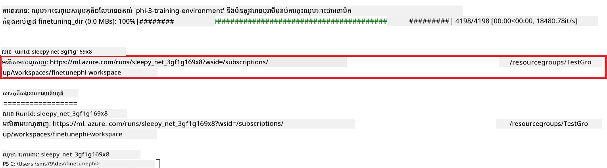

### Deploy the fine-tuned model

To integrate the fine-tuned Phi-3 model with Prompt Flow, you need to deploy the model to make it accessible for real-time inference. This process involves registering the model, creating an online endpoint, and deploying the model.

#### Set the model name, endpoint name, and deployment name for deployment

1. Open *config.py* file.

1. Replace `AZURE_MODEL_NAME = "your_fine_tuned_model_name"` with the desired name for your model.

1. Replace `AZURE_ENDPOINT_NAME = "your_fine_tuned_model_endpoint_name"` with the desired name for your endpoint.

1. Replace `AZURE_DEPLOYMENT_NAME = "your_fine_tuned_model_deployment_name"` with the desired name for your deployment.

#### Add code to the *deploy_model.py* file

Running the *deploy_model.py* file automates the entire deployment process. It registers the model, creates an endpoint, and executes the deployment based on the settings specified in the config.py file, which includes the model name, endpoint name, and deployment name.

1. Open the *deploy_model.py* file in Visual Studio Code.

1. Add the following code into *deploy_model.py*.

    ```python
    import logging
    from azure.identity import AzureCliCredential
    from azure.ai.ml import MLClient
    from azure.ai.ml.entities import Model, ProbeSettings, ManagedOnlineEndpoint, ManagedOnlineDeployment, IdentityConfiguration, ManagedIdentityConfiguration, OnlineRequestSettings
    from azure.ai.ml.constants import AssetTypes

    # ការនាំចូលការកំណត់
    from config import (
        AZURE_SUBSCRIPTION_ID,
        AZURE_RESOURCE_GROUP_NAME,
        AZURE_ML_WORKSPACE_NAME,
        AZURE_MANAGED_IDENTITY_RESOURCE_ID,
        AZURE_MANAGED_IDENTITY_CLIENT_ID,
        AZURE_MODEL_NAME,
        AZURE_ENDPOINT_NAME,
        AZURE_DEPLOYMENT_NAME
    )

    # ថេរ
    JOB_NAME = "your-job-name"
    COMPUTE_INSTANCE_TYPE = "Standard_E4s_v3"

    deployment_env_vars = {
        "SUBSCRIPTION_ID": AZURE_SUBSCRIPTION_ID,
        "RESOURCE_GROUP_NAME": AZURE_RESOURCE_GROUP_NAME,
        "UAI_CLIENT_ID": AZURE_MANAGED_IDENTITY_CLIENT_ID,
    }

    # ការកំណត់កំណត់ហេតុ
    logging.basicConfig(
        format="%(asctime)s - %(levelname)s - %(name)s - %(message)s",
        datefmt="%Y-%m-%d %H:%M:%S",
        level=logging.DEBUG
    )
    logger = logging.getLogger(__name__)

    def get_ml_client():
        """Initialize and return the ML Client."""
        credential = AzureCliCredential()
        return MLClient(credential, AZURE_SUBSCRIPTION_ID, AZURE_RESOURCE_GROUP_NAME, AZURE_ML_WORKSPACE_NAME)

    def register_model(ml_client, model_name, job_name):
        """Register a new model."""
        model_path = f"azureml://jobs/{job_name}/outputs/artifacts/paths/model_output"
        logger.info(f"Registering model {model_name} from job {job_name} at path {model_path}.")
        run_model = Model(
            path=model_path,
            name=model_name,
            description="Model created from run.",
            type=AssetTypes.MLFLOW_MODEL,
        )
        model = ml_client.models.create_or_update(run_model)
        logger.info(f"Registered model ID: {model.id}")
        return model

    def delete_existing_endpoint(ml_client, endpoint_name):
        """Delete existing endpoint if it exists."""
        try:
            endpoint_result = ml_client.online_endpoints.get(name=endpoint_name)
            logger.info(f"Deleting existing endpoint {endpoint_name}.")
            ml_client.online_endpoints.begin_delete(name=endpoint_name).result()
            logger.info(f"Deleted existing endpoint {endpoint_name}.")
        except Exception as e:
            logger.info(f"No existing endpoint {endpoint_name} found to delete: {e}")

    def create_or_update_endpoint(ml_client, endpoint_name, description=""):
        """Create or update an endpoint."""
        delete_existing_endpoint(ml_client, endpoint_name)
        logger.info(f"Creating new endpoint {endpoint_name}.")
        endpoint = ManagedOnlineEndpoint(
            name=endpoint_name,
            description=description,
            identity=IdentityConfiguration(
                type="user_assigned",
                user_assigned_identities=[ManagedIdentityConfiguration(resource_id=AZURE_MANAGED_IDENTITY_RESOURCE_ID)]
            )
        )
        endpoint_result = ml_client.online_endpoints.begin_create_or_update(endpoint).result()
        logger.info(f"Created new endpoint {endpoint_name}.")
        return endpoint_result

    def create_or_update_deployment(ml_client, endpoint_name, deployment_name, model):
        """Create or update a deployment."""

        logger.info(f"Creating deployment {deployment_name} for endpoint {endpoint_name}.")
        deployment = ManagedOnlineDeployment(
            name=deployment_name,
            endpoint_name=endpoint_name,
            model=model.id,
            instance_type=COMPUTE_INSTANCE_TYPE,
            instance_count=1,
            environment_variables=deployment_env_vars,
            request_settings=OnlineRequestSettings(
                max_concurrent_requests_per_instance=3,
                request_timeout_ms=180000,
                max_queue_wait_ms=120000
            ),
            liveness_probe=ProbeSettings(
                failure_threshold=30,
                success_threshold=1,
                period=100,
                initial_delay=500,
            ),
            readiness_probe=ProbeSettings(
                failure_threshold=30,
                success_threshold=1,
                period=100,
                initial_delay=500,
            ),
        )
        deployment_result = ml_client.online_deployments.begin_create_or_update(deployment).result()
        logger.info(f"Created deployment {deployment.name} for endpoint {endpoint_name}.")
        return deployment_result

    def set_traffic_to_deployment(ml_client, endpoint_name, deployment_name):
        """Set traffic to the specified deployment."""
        try:
            # ទាញយកព័ត៌មានលម្អិតនៃចំណុចបញ្ចប់បច្ចុប្បន្ន
            endpoint = ml_client.online_endpoints.get(name=endpoint_name)
            
            # កត់ហេតុការចែកចាយចរាចរបច្ចុប្បន្នសម្រាប់ការដោះស្រាយបញ្ហា
            logger.info(f"Current traffic allocation: {endpoint.traffic}")
            
            # កំណត់ការចែកចាយចរាចរសម្រាប់ការដាក់ឱ្យដំណើរការ
            endpoint.traffic = {deployment_name: 100}
            
            # ធ្វើបច្ចុប្បន្នភាពចំណុចបញ្ចប់ជាមួយការចែកចាយចរាចរថ្មី
            endpoint_poller = ml_client.online_endpoints.begin_create_or_update(endpoint)
            updated_endpoint = endpoint_poller.result()
            
            # កត់ហេតុការចែកចាយចរាចរដែលបានធ្វើបច្ចុប្បន្នភាពសម្រាប់ការដោះស្រាយបញ្ហា
            logger.info(f"Updated traffic allocation: {updated_endpoint.traffic}")
            logger.info(f"Set traffic to deployment {deployment_name} at endpoint {endpoint_name}.")
            return updated_endpoint
        except Exception as e:
            # កត់ហេតុកំហុសដែលកើតឡើងក្នុងដំណើរការនេះ
            logger.error(f"Failed to set traffic to deployment: {e}")
            raise


    def main():
        ml_client = get_ml_client()

        registered_model = register_model(ml_client, AZURE_MODEL_NAME, JOB_NAME)
        logger.info(f"Registered model ID: {registered_model.id}")

        endpoint = create_or_update_endpoint(ml_client, AZURE_ENDPOINT_NAME, "Endpoint for finetuned Phi-3 model")
        logger.info(f"Endpoint {AZURE_ENDPOINT_NAME} is ready.")

        try:
            deployment = create_or_update_deployment(ml_client, AZURE_ENDPOINT_NAME, AZURE_DEPLOYMENT_NAME, registered_model)
            logger.info(f"Deployment {AZURE_DEPLOYMENT_NAME} is created for endpoint {AZURE_ENDPOINT_NAME}.")

            set_traffic_to_deployment(ml_client, AZURE_ENDPOINT_NAME, AZURE_DEPLOYMENT_NAME)
            logger.info(f"Traffic is set to deployment {AZURE_DEPLOYMENT_NAME} at endpoint {AZURE_ENDPOINT_NAME}.")
        except Exception as e:
            logger.error(f"Failed to create or update deployment: {e}")

    if __name__ == "__main__":
        main()

    ```

1. Perform the following tasks to get the `JOB_NAME`:

    - Navigate to Azure Machine Learning resource that you created.
    - Select **Studio web URL** to open the Azure Machine Learning workspace.
    - Select **Jobs** from the left side tab.
    - Select the experiment for fine-tuning. For example, *finetunephi*.
    - Select the job that you created.
    - Copy and paste your job Name into the `JOB_NAME = "your-job-name"` in *deploy_model.py* file.

1. Replace `COMPUTE_INSTANCE_TYPE` with your specific details.

1. Type the following command to run the *deploy_model.py* script and start the deployment process in Azure Machine Learning.

    ```python
    python deploy_model.py
    ```

> [!WARNING]
> To avoid additional charges to your account, make sure to delete the created endpoint in the Azure Machine Learning workspace.
>

#### Check deployment status in Azure Machine Learning Workspace

1. Visit [Azure ML Studio](https://ml.azure.com/home?wt.mc_id=studentamb_279723).

1. Navigate to Azure Machine Learning workspace that you created.
1. ជ្រើស **Studio web URL** ដើម្បីបើកកន្លែងធ្វើការនៅ Azure Machine Learning។

1. ជ្រើស **Endpoints** ពីផ្ទាំងនៅខាងឆ្វេង។

    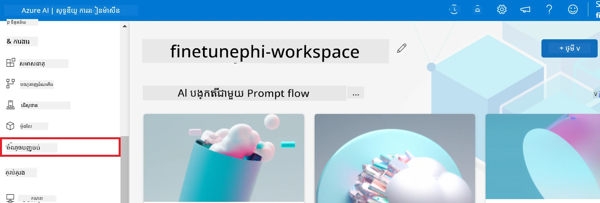

2. ជ្រើស endpoint ដែលអ្នកបានបង្កើត។

    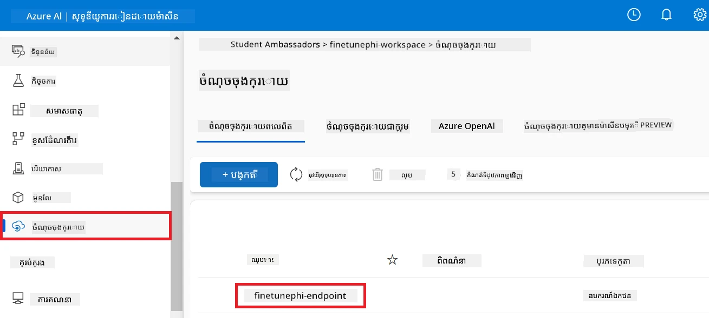

3. នៅលើទំព័រនេះ អ្នកអាចគ្រប់គ្រង endpoints ដែលបានបង្កើតក្នុងខណៈដំណើរការដាក់ចេញ (deployment)។

## ស្ថានភាព 3: រួមបញ្ចូលជាមួយ Prompt flow និង សន្ទនាជាមួយម៉ូដែលផ្ទាល់ខ្លួនរបស់អ្នក

### រួមបញ្ចូលម៉ូដែល Phi-3 ផ្ទាល់ខ្លួនទៅជាមួយ Prompt flow

បន្ទាប់ពីបានដាក់ចេញម៉ូដែលដែលបានធ្វើ fine-tuning ជោគជ័យរួច អ្នកអាចឥឡូវនេះរួមបញ្ចូលវាជាមួយ Prompt flow ដើម្បីប្រើម៉ូដែលរបស់អ្នកនៅក្នុងកម្មវិធីពេលពិត (real-time) ដែលអនុញ្ញាតឱ្យមានបេសកកម្មអន្តរកម្មផ្សេងៗជាមួយម៉ូដែល Phi-3 ផ្ទាល់ខ្លួនរបស់អ្នក។

#### កំណត់ API key និង endpoint URI របស់ម៉ូដែល Phi-3 ដែលបានធ្វើ fine-tuning

1. ចូលទៅកាន់ Azure Machine Learning workspace ដែលអ្នកបានបង្កើត។
1. ជ្រើស **Endpoints** ពីផ្ទាំងនៅខាងឆ្វេង។
1. ជ្រើស endpoint ដែលអ្នកបានបង្កើត។
1. ជ្រើស **Consume** ពីម៉ឺនុយរុករក។
1. ចម្លង និងបិទបញ្ចូល **REST endpoint** របស់អ្នកទៅក្នុងឯកសារ *config.py*, ជំនួស `AZURE_ML_ENDPOINT = "your_fine_tuned_model_endpoint_uri"` ជាមួយ **REST endpoint** របស់អ្នក។
1. ចម្លង និងបិទបញ្ចូល **Primary key** របស់អ្នកទៅក្នុងឯកសារ *config.py*, ជំនួស `AZURE_ML_API_KEY = "your_fine_tuned_model_api_key"` ជាមួយ **Primary key** របស់អ្នក។

    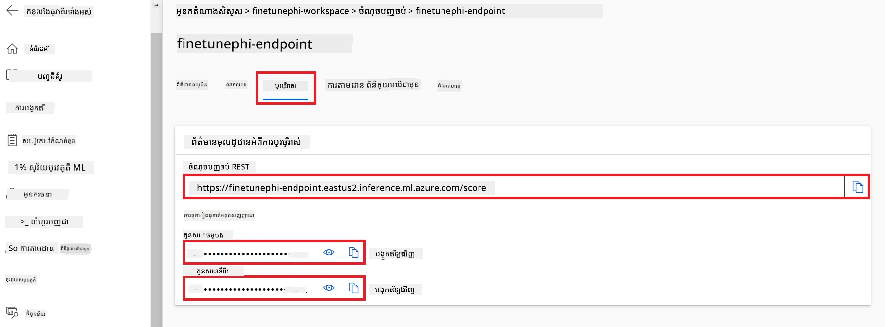

#### បន្ថែមកូដទៅឯកសារ *flow.dag.yml*

1. បើកឯកសារ *flow.dag.yml* នៅក្នុង Visual Studio Code។

1. បន្ថែមកូដដូចខាងក្រោមចូលទៅក្នុង *flow.dag.yml*។

    ```yml
    inputs:
      input_data:
        type: string
        default: "Who founded Microsoft?"

    outputs:
      answer:
        type: string
        reference: ${integrate_with_promptflow.output}

    nodes:
    - name: integrate_with_promptflow
      type: python
      source:
        type: code
        path: integrate_with_promptflow.py
      inputs:
        input_data: ${inputs.input_data}
    ```

#### បន្ថែមកូដទៅឯកសារ *integrate_with_promptflow.py*

1. បើកឯកសារ *integrate_with_promptflow.py* នៅក្នុង Visual Studio Code។

1. បន្ថែមកូដដូចខាងក្រោមចូលទៅក្នុង *integrate_with_promptflow.py*។

    ```python
    import logging
    import requests
    from promptflow.core import tool
    import asyncio
    import platform
    from config import (
        AZURE_ML_ENDPOINT,
        AZURE_ML_API_KEY
    )

    # ការកំណត់កត់ត្រា
    logging.basicConfig(
        format="%(asctime)s - %(levelname)s - %(name)s - %(message)s",
        datefmt="%Y-%m-%d %H:%M:%S",
        level=logging.DEBUG
    )
    logger = logging.getLogger(__name__)

    def query_azml_endpoint(input_data: list, endpoint_url: str, api_key: str) -> str:
        """
        Send a request to the Azure ML endpoint with the given input data.
        """
        headers = {
            "Content-Type": "application/json",
            "Authorization": f"Bearer {api_key}"
        }
        data = {
            "input_data": [input_data],
            "params": {
                "temperature": 0.7,
                "max_new_tokens": 128,
                "do_sample": True,
                "return_full_text": True
            }
        }
        try:
            response = requests.post(endpoint_url, json=data, headers=headers)
            response.raise_for_status()
            result = response.json()[0]
            logger.info("Successfully received response from Azure ML Endpoint.")
            return result
        except requests.exceptions.RequestException as e:
            logger.error(f"Error querying Azure ML Endpoint: {e}")
            raise

    def setup_asyncio_policy():
        """
        Setup asyncio event loop policy for Windows.
        """
        if platform.system() == 'Windows':
            asyncio.set_event_loop_policy(asyncio.WindowsSelectorEventLoopPolicy())
            logger.info("Set Windows asyncio event loop policy.")

    @tool
    def my_python_tool(input_data: str) -> str:
        """
        Tool function to process input data and query the Azure ML endpoint.
        """
        setup_asyncio_policy()
        return query_azml_endpoint(input_data, AZURE_ML_ENDPOINT, AZURE_ML_API_KEY)

    ```

### សន្ទនាជាមួយម៉ូដែលផ្ទាល់ខ្លួនរបស់អ្នក

1. វាយពាក្យបញ្ជាដូចខាងក្រោមដើម្បីរត់ស្គ្រីប *deploy_model.py* និងចាប់ផ្តើមដំណើរការដាក់ចេញនៅក្នុង Azure Machine Learning។

    ```python
    pf flow serve --source ./ --port 8080 --host localhost
    ```

1. នេះគឺជាឧទាហរណ៍នៃលទ្ធផល៖ ឥឡូវនេះអ្នកអាចសន្ទនាជាមួយម៉ូដែល Phi-3 ផ្ទាល់ខ្លួនរបស់អ្នក។ សូមណែនាំឱ្យសួរទៅលើទិន្នន័យដែលបានប្រើសម្រាប់ការធ្វើ fine-tuning។

    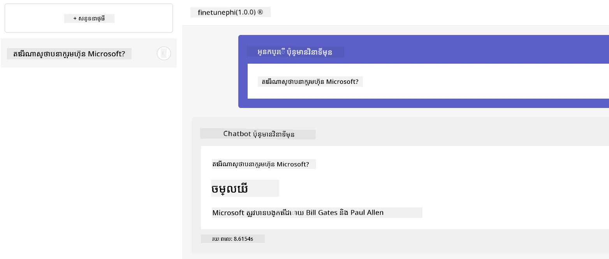

---

<!-- CO-OP TRANSLATOR DISCLAIMER START -->
**ការបដិសេធ**:
ឯកសារនេះត្រូវបានបកប្រែដោយប្រើសេវាកម្មបកប្រែ AI [Co-op Translator](https://github.com/Azure/co-op-translator)។ ខណៈដែលយើងខិតខំរកភាពត្រឹមត្រូវ សូមយកចិត្តទុកដាក់ថាការបកប្រែដោយស្វ័យប្រវត្តិអាចមានកំហុស ឬមានព័ត៌មានដែលមិនត្រឹមត្រូវ។ ឯកសារដើមនៅក្នុងភាសាមាតុភូមិគួរត្រូវបានចាត់ទុកថាជាប្រភពដែលមានសុពលភាព។ សម្រាប់ព័ត៌មានសំខាន់ៗ យើងផ្ដល់អនុសាសន៍ឱ្យស្វែងរកការបកប្រែដោយមនុស្សជំនាញ។ យើងមិនទទួលខុសត្រូវចំពោះការយល់ច្រឡំ ឬការបកស្រាយខុសណាមួយដែលកើតមានពីការប្រើប្រាស់ការបកប្រែនេះទេ។
<!-- CO-OP TRANSLATOR DISCLAIMER END -->