# ដល់កម្រិត Fine-tune និង បញ្ចូលម៉ូឌែល Phi-3 ផ្ទាល់ប៊ូតុងជាមួយ Prompt flow ក្នុង Microsoft Foundry

ឧទាហរណ៍ចន្លោះបញ្ចប់នេះ (E2E) មានមូលដ្ឋានលើមគ្គុទេសក៍ "[Fine-Tune and Integrate Custom Phi-3 Models with Prompt Flow in Microsoft Foundry](https://techcommunity.microsoft.com/t5/educator-developer-blog/fine-tune-and-integrate-custom-phi-3-models-with-prompt-flow-in/ba-p/4191726?WT.mc_id=aiml-137032-kinfeylo)" ពី Microsoft Tech Community។ វណែនាំពីដំណើរការនៃការលៃតម្រូវ (fine-tuning), ការបង្ហោះ (deploying), និងការបញ្ចូលម៉ូឌែល Phi-3 ផ្ទាល់ខ្លួនជាមួយ Prompt flow នៅក្នុង Microsoft Foundry។
ខុសពីឧទាហរណ៍ E2E "[Fine-Tune and Integrate Custom Phi-3 Models with Prompt Flow](./E2E_Phi-3-FineTuning_PromptFlow_Integration.md)" ដែលបានរត់កូដនៅក្នុងម៉ាស៊ីនបណ្ដាញផ្ទាល់ខ្លួន, មេរៀននេះផ្តោតទាំងស្រុងលើការលៃតម្រូវ និងការបញ្ចូលម៉ូឌែលរបស់អ្នកនៅក្នុង Azure AI / ML Studio។

## សង្ខេប

ក្នុងឧទាហរណ៍ E2E នេះ អ្នកនឹងរៀនវិធីលៃតម្រូវម៉ូឌែល Phi-3 និងបញ្ចូលវាជាមួយ Prompt flow ក្នុង Microsoft Foundry។ ដោយប្រើប្រាស់ Azure AI / ML Studio អ្នកនឹងបង្កើត Workflows សម្រាប់បង្ហោះ និងប្រើម៉ូឌែល AI ផ្ទាល់ខ្លួន។ ឧទាហរណ៍ E2E នេះត្រូវបានបែងចែកជាស្ទូពីបីសេណារីយ៉ូ៖

**សេណារីយ៉ូ 1: ដាក់បន្ថែមធនធាន Azure និង រៀបចំសម្រាប់ការលៃតម្រូវ**

**សេណារីយ៉ូ 2: លៃតម្រូវម៉ូឌែល Phi-3 និងបង្ហោះក្នុង Azure Machine Learning Studio**

**សេណារីយ៉ូ 3: បញ្ចូលជាមួយ Prompt flow និង ចាតជាមួយម៉ូឌែលផ្ទាល់ខ្លួនរបស់អ្នកក្នុង Microsoft Foundry**

នេះជាសង្ខេបនៃឧទាហរណ៍ E2E នេះ។

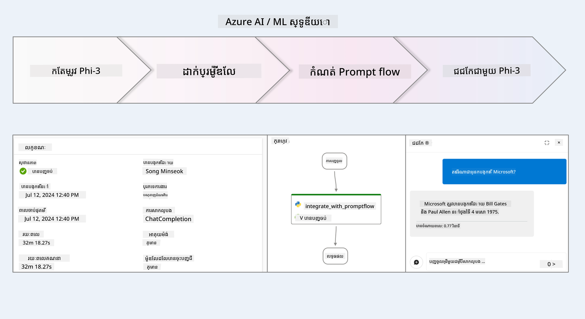

### តារាងមាតិក

1. **[សេណារីយ៉ូ 1: ដាក់បន្ថែមធនធាន Azure និង រៀបចំសម្រាប់ការលៃតម្រូវ](#សេណារីយ៉ូ-1-ដាក់បន្ថែមធនធាន-azure-និង-រៀបចំសម្រាប់ការលៃតម្រូវ)**
    - [បង្កើត Azure Machine Learning Workspace](#បង្កើត-azure-machine-learning-workspace)
    - [សុំអនុញ្ញាត GPU ក្នុង Subscription Azure](#សុំអនុញ្ញាត-gpu-ក្នុង-subscription-azure)
    - [បន្ថែមការបែងចែកតួនាទី](#បន្ថែមការបែងចែកតួនាទី)
    - [រៀបចំផ_Project](#រៀបចំ-project)
    - [រៀបចំ dataset សម្រាប់ការលៃតម្រុត](#prepare-dataset-for-fine-tuning)

1. **[សេណារីយ៉ូ 2: លៃតម្រូវម៉ូឌែល Phi-3 និង បង្ហោះក្នុង Azure Machine Learning Studio](#scenario-2-fine-tune-phi-3-model-and-deploy-in-azure-machine-learning-studio)**
    - [លៃតម្រូវម៉ូឌែល Phi-3](#fine-tune-the-phi-3-model)
    - [បង្ហោះម៉ូឌែល Phi-3 ដែលបានលៃតម្រូវ](#deploy-the-fine-tuned-phi-3-model)

1. **[សេណារីយ៉ូ 3: បញ្ចូលជាមួយ Prompt flow និង ចាតជាមួយម៉ូឌែលផ្ទាល់ខ្លួនក្នុង Microsoft Foundry](#scenario-3-integrate-with-prompt-flow-and-chat-with-your-custom-model-in-azure-ai-studio)**
    - [បញ្ចូលម៉ូឌែល Phi-3 ផ្ទាល់ខ្លួនជាមួយ Prompt flow](#integrate-the-custom-phi-3-model-with-prompt-flow)
    - [ចាតជាមួយម៉ូឌែល Phi-3 ផ្ទាល់ខ្លួនរបស់អ្នក](#chat-with-your-custom-phi-3-model)

## សេណារីយ៉ូ 1: ដាក់បន្ថែមធនធាន Azure និង រៀបចំសម្រាប់ការលៃតម្រូវ

### បង្កើត Azure Machine Learning Workspace

1. ដាក់ពាក្យ *azure machine learning* នៅក្នុង **ផ្សារស្វែងរក** នៅកំពូលទំព័រព័រថល និងជ្រើស **Azure Machine Learning** ពីជម្រើសដែលបង្ហាញ។

    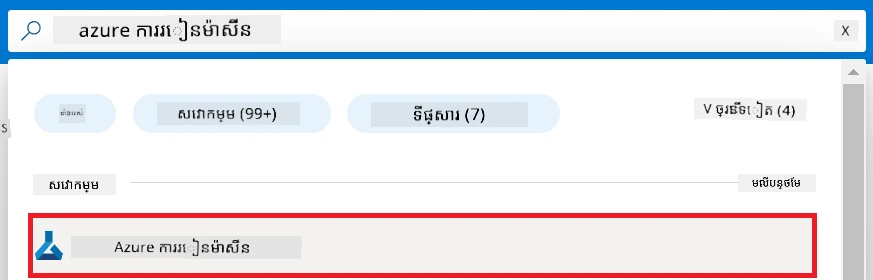

2. ជ្រើស **+ Create** ពីម៉ឺនុយនាវីហ្គេសិន។

3. ជ្រើស **New workspace** ពីម៉ឺនុយនាវីហ្គេសិន។

    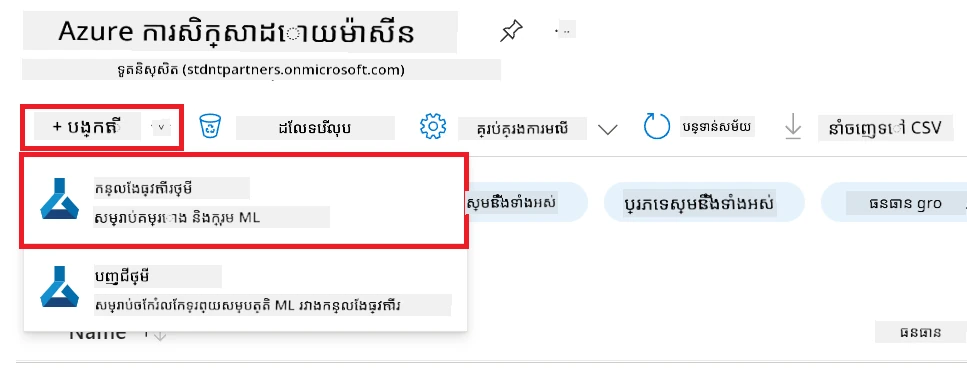

4. បំពេញភារកិច្ចដូចខាងក្រោម៖

    - ជ្រើស **Subscription** នៅលើ Azure របស់អ្នក។
    - ជ្រើស **Resource group** ដែលចង់ប្រើ (បង្កើតថ្មីបើចាំបាច់)។
    - បញ្ចូល **Workspace Name**។ វាត្រូវតែជាតម្លៃមិនទាន់មានពីមុន។
    - ជ្រើស **Region** ដែលអ្នកចង់ប្រើ។
    - ជ្រើស **Storage account** ដែលចង់ប្រើ (បង្កើតថ្មីបើចាំបាច់)។
    - ជ្រើស **Key vault** ដែលចង់ប្រើ (បង្កើតថ្មីបើចាំបាច់)។
    - ជ្រើស **Application insights** ដែលចង់ប្រើ (បង្កើតថ្មីបើចាំបាច់)។
    - ជ្រើស **Container registry** ដែលចង់ប្រើ (បង្កើតថ្មីបើចាំបាច់)។

    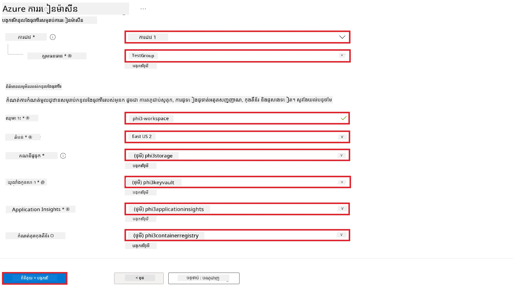

5. ជ្រើស **Review + Create**។

6. ជ្រើស **Create**។

### សុំអនុញ្ញាត GPU ក្នុង Subscription Azure

ក្នុងមេរៀននេះ អ្នកនឹងរៀនរបៀបលៃតម្រូវ និងបង្ហោះម៉ូឌែល Phi-3 ដោយប្រើ GPUs។ សម្រាប់ការលៃតម្រូវ អ្នកនឹងប្រើ GPU ជា *Standard_NC24ads_A100_v4* ដែលត្រូវការសុំកម្រិត (quota)។ សម្រាប់ការបង្ហោះ អ្នកនឹងប្រើ GPU ជា *Standard_NC6s_v3* ដែលក៏ត្រូវការសុំកម្រិតដែរ។

> [!NOTE]
>
> Only Pay-As-You-Go subscriptions (the standard subscription type) are eligible for GPU allocation; benefit subscriptions are not currently supported.
>

1. ចូលទៅកាន់ [Azure ML Studio](https://ml.azure.com/home?wt.mc_id=studentamb_279723)។

1. សូមអនុវត្តភារកិច្ចទាំងនេះសម្រាប់សុំកម្រិត *Standard NCADSA100v4 Family*៖

    - ជ្រើស **Quota** ពីបាតខាងឆ្វេង។
    - ជ្រើស **Virtual machine family** ដែលចង់ប្រើ។ ឧទាហរណ៍ ជ្រើស **Standard NCADSA100v4 Family Cluster Dedicated vCPUs**, ដែលរួមមាន GPU *Standard_NC24ads_A100_v4*។
    - ជ្រើស **Request quota** ពីម៉ឺនុយនាវីហ្គេសិន។

        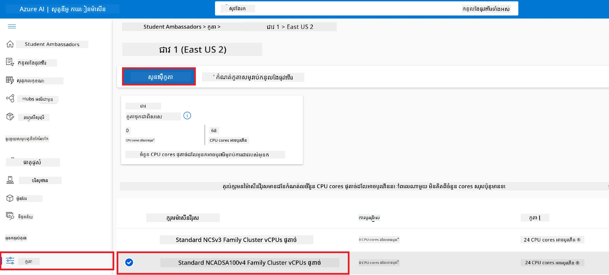

    - នៅក្នុងទំព័រ Request quota, បញ្ចូល **New cores limit** ដែលអ្នកចង់ប្រើ។ ឧទាហរណ៍ 24។
    - នៅក្នុងទំព័រ Request quota, ជ្រើស **Submit** ដើម្បីស្នើសុំកម្រិត GPU។

1. សូមអនុវត្តភារកិច្ចទាំងនេះសម្រាប់សុំកម្រិត *Standard NCSv3 Family*៖

    - ជ្រើស **Quota** ពីបាតខាងឆ្វេង។
    - ជ្រើស **Virtual machine family** ដែលចង់ប្រើ។ ឧទាហរណ៍ ជ្រើស **Standard NCSv3 Family Cluster Dedicated vCPUs**, ដែលរួមមាន GPU *Standard_NC6s_v3*។
    - ជ្រើស **Request quota** ពីម៉ឺនុយនាវីហ្គេសិន។
    - នៅក្នុងទំព័រ Request quota, បញ្ចូល **New cores limit** ដែលអ្នកចង់ប្រើ។ ឧទាហរណ៍ 24។
    - នៅក្នុងទំព័រ Request quota, ជ្រើស **Submit** ដើម្បីស្នើសុំកម្រិត GPU។

### បន្ថែមការបែងចែកតួនាទី

ដើម្បីលៃតម្រូវ និងបង្ហោះម៉ូឌែលរបស់អ្នក អ្នកត្រូវបង្កើត User Assigned Managed Identity (UAI) មុនហើយផ្តល់សិទ្ធិដល់វា។ UAI នេះនឹងត្រូវប្រើសម្រាប់សុញ្ញាភាពនៅពេលបង្ហោះ។

#### បង្កើត User Assigned Managed Identity(UAI)

1. វាយពាក្យ *managed identities* នៅក្នុង **ផ្សារស្វែងរក** នៅកំពូលទំព័រព័រថល និងជ្រើស **Managed Identities** ពីជម្រើសដែលបង្ហាញ។

    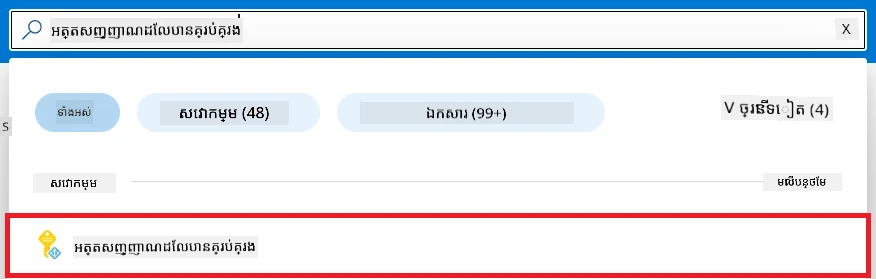

1. ជ្រើស **+ Create**។

    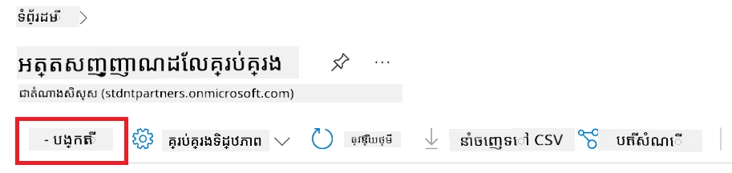

1. បំពេញភារកិច្ចដូចខាងក្រោម៖

    - ជ្រើស **Subscription** របស់ Azure យោងរបស់អ្នក។
    - ជ្រើស **Resource group** ដែលចង់ប្រើ (បង្កើតថ្មីបើចាំបាច់)۔
    - ជ្រើស **Region** ដែលអ្នកចង់ប្រើ។
    - បញ្ចូល **Name**។ វាត្រូវតែជាតម្លៃមិនទាន់មានពីមុន។

    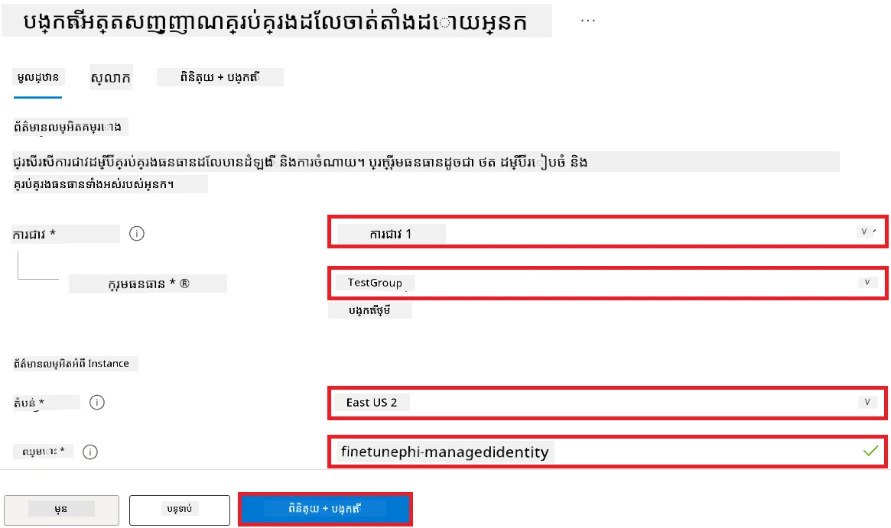

1. ជ្រើស **Review + create**។

1. ជ្រើស **+ Create**។

#### បន្ថែមតួនាទី Contributor ទៅ Managed Identity

1. ទៅកាន់ធនធាន Managed Identity ដែលបានបង្កើត។

1. ជ្រើស **Azure role assignments** ពីបាតខាងឆ្វេង។

1. ជ្រើស **+Add role assignment** ពីម៉ឺនុយនាវីហ្គេសិន។

1. នៅក្នុងទំព័រ Add role assignment, អនុវត្តភារកិច្ចដូចខាងក្រោម៖
    - ជ្រើស **Scope** ទៅ **Resource group**។
    - ជ្រើស **Subscription** របស់ Azure របស់អ្នក។
    - ជ្រើស **Resource group** ដែលចង់ប្រើ។
    - ជ្រើស **Role** ទៅ **Contributor**។

    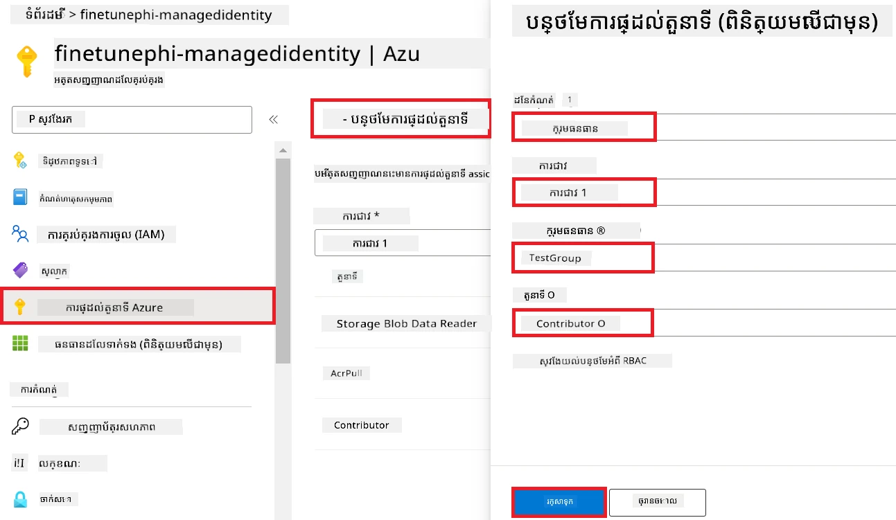

2. ជ្រើស **Save**។

#### បន្ថែមតួនាទី Storage Blob Data Reader ទៅ Managed Identity

1. វាយពាក្យ *storage accounts* នៅក្នុង **ផ្សារស្វែងរក** នៅកំពូលទំព័រព័រថល និងជ្រើស **Storage accounts** ពីជម្រើសដែលបង្ហាញ។

    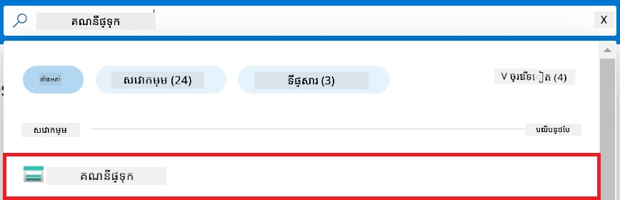

1. ជ្រើស storage account ដែលទាក់ទងជាមួយ Azure Machine Learning workspace ដែលបានបង្កើតរួច។ ឧទាហរណ៍ *finetunephistorage*។

1. អនុវត្តភារកិច្ចដើម្បីទៅកាន់ទំព័រ Add role assignment៖

    - ទៅកាន់ Azure Storage account ដែលបានបង្កើត។
    - ជ្រើស **Access Control (IAM)** ពីបាតខាងឆ្វេង។
    - ជ្រើស **+ Add** ពីម៉ឺនុយនាវីហ្គេសិន។
    - ជ្រើស **Add role assignment** ពីម៉ឺនុយនាវីហ្គេសិន។

    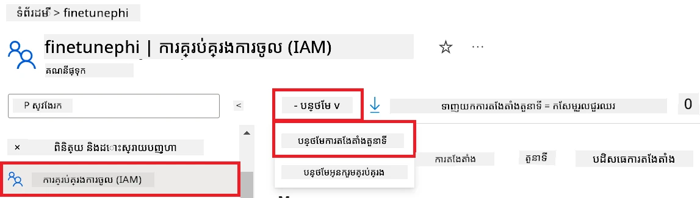

1. នៅក្នុងទំព័រ Add role assignment, អនុវត្តភារកិច្ចដូចខាងក្រោម៖

    - នៅក្នុងទំព័រ Role, វាយ *Storage Blob Data Reader* ក្នុង **ផ្សារស្វែងរក** ហើយជ្រើស **Storage Blob Data Reader** ពីជម្រើសដែលបង្ហាញ។
    - នៅក្នុងទំព័រ Role, ជ្រើស **Next**។
    - នៅក្នុងទំព័រ Members, ជ្រើស **Assign access to** **Managed identity**។
    - នៅក្នុងទំព័រ Members, ជ្រើស **+ Select members**។
    - ក្នុងទំព័រ Select managed identities, ជ្រើស **Subscription** របស់ Azure របស់អ្នក។
    - ក្នុងទំព័រ Select managed identities, ជ្រើស **Managed identity** ដែលជា **Manage Identity**។
    - ក្នុងទំព័រ Select managed identities, ជ្រើស Manage Identity ដែលបានបង្កើត។ ឧទាហរណ៍ *finetunephi-managedidentity*។
    - ក្នុងទំព័រ Select managed identities, ជ្រើស **Select**។

    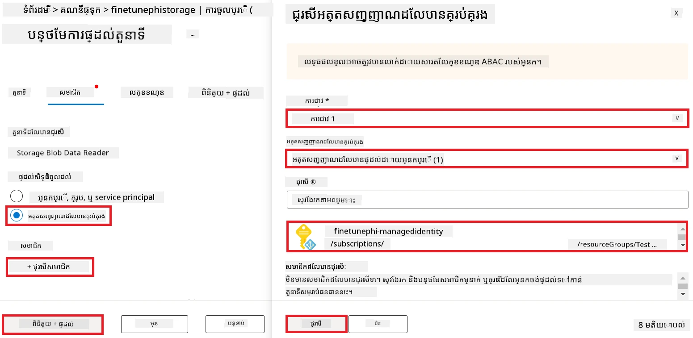

1. ជ្រើស **Review + assign**។

#### បន្ថែមតួនាទី AcrPull ទៅ Managed Identity

1. វាយពាក្យ *container registries* នៅក្នុង **ផ្សារស្វែងរក** នៅកំពូលទំព័រព័រថល និងជ្រើស **Container registries** ពីជម្រើសដែលបង្ហាញ។

    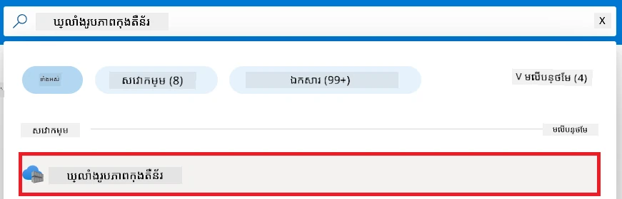

1. ជ្រើស container registry ដែលទាក់ទងជាមួយ Azure Machine Learning workspace។ ឧទាហរណ៍ *finetunephicontainerregistry*

1. អនុវត្តភារកិច្ចដើម្បីទៅកាន់ទំព័រ Add role assignment៖

    - ជ្រើស **Access Control (IAM)** ពីបាតខាងឆ្វេង។
    - ជ្រើស **+ Add** ពីម៉ឺនុយនាវីហ្គេសិន។
    - ជ្រើស **Add role assignment** ពីម៉ឺនុយនាវីហ្គេសិន។

1. នៅក្នុងទំព័រ Add role assignment, អនុវត្តភារកិច្ចដូចខាងក្រោម៖

    - នៅក្នុងទំព័រ Role, វាយ *AcrPull* នៅក្នុង **ផ្សារស្វែងរក** ហើយជ្រើស **AcrPull** ពីជម្រើសដែលបង្ហាញ។
    - នៅក្នុងទំព័រ Role, ជ្រើស **Next**។
    - នៅក្នុងទំព័រ Members, ជ្រើស **Assign access to** **Managed identity**។
    - នៅក្នុងទំព័រ Members, ជ្រើស **+ Select members**។
    - ក្នុងទំព័រ Select managed identities, ជ្រើស **Subscription** របស់ Azure របស់អ្នក។
    - ក្នុងទំព័រ Select managed identities, ជ្រើស **Managed identity** ដែលជា **Manage Identity**។
    - ក្នុងទំព័រ Select managed identities, ជ្រើស Manage Identity ដែលបានបង្កើត។ ឧទាហរណ៍ *finetunephi-managedidentity*។
    - ក្នុងទំព័រ Select managed identities, ជ្រើស **Select**។
    - ជ្រើស **Review + assign**។

### រៀបចំ Project

ដើម្បីទាញយក datasets ដែលត្រូវការសម្រាប់ការលៃតម្រូវ អ្នកនឹងរៀបចំបរិយាកាសក្នុងកុំព្យូទ័រផ្ទាល់ខ្លួន។

ក្នុងលំហាត់នេះ អ្នកនឹង

- បង្កើតថត (folder) មួយសម្រាប់ធ្វើការងារ។
- បង្កើតបរិយាកាសវើឆ្វាល់ (virtual environment)។
- ដំឡើងកញ្ចប់ដែលត្រូវការ។
- បង្កើតឯកសារ *download_dataset.py* ដើម្បីទាញយក dataset។

#### បង្កើតថតសម្រាប់ធ្វើការ

1. បើកផ្ទាំង Terminal ហើយវាយពាក្យបញ្ជានេះដើម្បីបង្កើតថតឈ្មោះ *finetune-phi* នៅក្នុងផ្លូវលំនាំដើម។

    ```console
    mkdir finetune-phi
    ```

2. វាយបញ្ជាខាងក្រោមនៅក្នុង Terminal របស់អ្នក ដើម្បីចូលទៅថត *finetune-phi* ដែលបានបង្កើត។

    ```console
    cd finetune-phi
    ```

#### បង្កើត Virtual Environment

1. វាយបញ្ជាខាងក្រោមនៅក្នុង Terminal របស់អ្នក ដើម្បីបង្កើត virtual environment ឈ្មោះ *.venv*។
    ```console
    python -m venv .venv
    ```

2. វាយពាក្យបញ្ជាខាងក្រោមក្នុង terminal របស់អ្នក ដើម្បី activate លើ virtual environment.

    ```console
    .venv\Scripts\activate.bat
    ```

> [!NOTE]
> បើវាដំណើរការ កុំភ្លេចមើលឃើញ *(.venv)* មុនបញ្ជារបាំងបញ្ជា។

#### Install the required packages

1. វាយពាក្យបញ្ជាខាងក្រោមក្នុង terminal របស់អ្នក ដើម្បីតំឡើងកញ្ចប់ដែលត្រូវការ។

    ```console
    pip install datasets==2.19.1
    ```

#### Create `donload_dataset.py`

> [!NOTE]
> រចនាសម្ព័ន្ធថតពេញលេញៈ
>
> ```text
> └── YourUserName
> .    └── finetune-phi
> .        └── download_dataset.py
> ```

1. បើក **Visual Studio Code**។

1. ជ្រើស **File** ពីរបារមឺនុយ។

1. ជ្រើស **Open Folder**។

1. ជ្រើសថត *finetune-phi* ដែលអ្នកបានបង្កើត ដែលមានទីតាំងនៅ *C:\Users\yourUserName\finetune-phi*។

    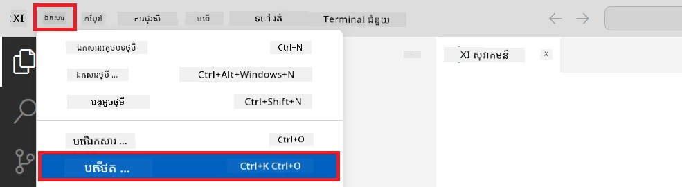

1. នៅផ្ទាំងខាងឆ្វេងនៃ Visual Studio Code, ចុច​ម៉ៅ​ស្ដាំ ហើយជ្រើស **New File** ដើម្បីបង្កើតឯកសារថ្មីមួយឈ្មោះ *download_dataset.py*។

    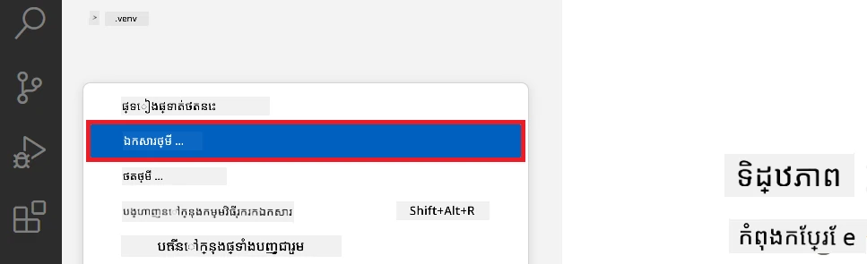

### Prepare dataset for fine-tuning

ក្នុងលំហាត់នេះ អ្នកនឹងរត់ឯកសារ *download_dataset.py* ដើម្បីទាញយក dataset *ultrachat_200k* ទៅក្នុងបរិយាកាសក្នុងម៉ាស៊ីនក្នុងស្រុករបស់អ្នក។ បន្ទាប់មក អ្នកនឹងប្រើ dataset ទាំងនេះ ដើម្បី fine-tune ម៉ូឌែល Phi-3 នៅក្នុង Azure Machine Learning។

ក្នុងលំហាត់នេះ អ្នកនឹងធ្វើ៖

- បន្ថែមកូដទៅក្នុងឯកសារ *download_dataset.py* ដើម្បីទាញយក datasets។
- រត់ឯកសារ *download_dataset.py* ដើម្បីទាញយក datasets ទៅក្នុងបរិយាកាសក្នុងស្រុករបស់អ្នក។

#### Download your dataset using *download_dataset.py*

1. បើកឯកសារ *download_dataset.py* ក្នុង Visual Studio Code។

1. បន្ថែមកូដដូចខាងក្រោមទៅក្នុងឯកសារ *download_dataset.py*។

    ```python
    import json
    import os
    from datasets import load_dataset

    def load_and_split_dataset(dataset_name, config_name, split_ratio):
        """
        Load and split a dataset.
        """
        # ផ្ទុកសំណុំទិន្នន័យដោយឈ្មោះ ការកំណត់រចនាសម្ព័ន្ធ និងអត្រាបំបែកដែលបានបញ្ជាក់
        dataset = load_dataset(dataset_name, config_name, split=split_ratio)
        print(f"Original dataset size: {len(dataset)}")
        
        # បំបែកសំណុំទិន្នន័យទៅជាសំណុំហ្វឹកហាត់ និងសំណុំសាកល្បង (80% សម្រាប់ហ្វឹកហាត់, 20% សម្រាប់សាកល្បង)
        split_dataset = dataset.train_test_split(test_size=0.2)
        print(f"Train dataset size: {len(split_dataset['train'])}")
        print(f"Test dataset size: {len(split_dataset['test'])}")
        
        return split_dataset

    def save_dataset_to_jsonl(dataset, filepath):
        """
        Save a dataset to a JSONL file.
        """
        # បង្កើតថតប្រសិនបើវាមិនមាន
        os.makedirs(os.path.dirname(filepath), exist_ok=True)
        
        # បើកឯកសារនៅក្នុងរបៀបសរសេរ
        with open(filepath, 'w', encoding='utf-8') as f:
            # ដំណើរការជាលំដាប់លើកំណត់ត្រាទីមួយៗក្នុងសំណុំទិន្នន័យ
            for record in dataset:
                # បម្លែងកំណត់ត្រាជាវត្ថុ JSON ហើយសរសេរចូលឯកសារ
                json.dump(record, f)
                # សរសេរបន្ទាត់ថ្មីដើម្បីបំបែកកំណត់ត្រា
                f.write('\n')
        
        print(f"Dataset saved to {filepath}")

    def main():
        """
        Main function to load, split, and save the dataset.
        """
        # ផ្ទុក និងបំបែកសំណុំទិន្នន័យ ULTRACHAT_200k ជាមួយការកំណត់រចនាសម្ព័ន្ធ និងអត្រាបំបែកដែលបានកំណត់
        dataset = load_and_split_dataset("HuggingFaceH4/ultrachat_200k", 'default', 'train_sft[:1%]')
        
        # ដកសំណុំទិន្នន័យសម្រាប់ហ្វឹកហាត់ និងសម្រាប់សាកល្បងចេញពីការបំបែក
        train_dataset = dataset['train']
        test_dataset = dataset['test']

        # រក្សាសំណុំទិន្នន័យហ្វឹកហាត់ទៅឯកសារ JSONL
        save_dataset_to_jsonl(train_dataset, "data/train_data.jsonl")
        
        # រក្សាសំណុំទិន្នន័យសាកល្បងទៅឯកសារ JSONL ផ្សេង
        save_dataset_to_jsonl(test_dataset, "data/test_data.jsonl")

    if __name__ == "__main__":
        main()

    ```

1. វាយពាក្យបញ្ជាខាងក្រោមក្នុង terminal របស់អ្នក ដើម្បីរត់ស្គ្រីប និងទាញយក dataset ទៅក្នុងបរិយាកាសក្នុងស្រុករបស់អ្នក។

    ```console
    python download_dataset.py
    ```

1. បញ្ជាក់ថា datasets ត្រូវបានរក្សាទុកដោយជោគជ័យនៅក្នុងថតក្នុងស្រុក *finetune-phi/data* របស់អ្នក។

> [!NOTE]
>
> #### កំណត់សម្គាល់អំពីទំហំ dataset និងពេលវេលា fine-tuning
>
> ក្នុងមេរៀននេះ អ្នកប្រើតែ 1% នៃ dataset (`split='train[:1%]'`)។ វាកាត់បន្ថយចំនួនទិន្នន័យយ៉ាងមានន័យ ដែលធ្វើឲ្យដំណើរការផ្ទុកឡើង និងការបង្វឹកដោយ fine-tuning រហ័សឡើង។ អ្នកអាចកែប្រែភាគរយនេះ ដើម្បីស្វែងរកតុល្យភាពរវាងពេលវេលាបង្វឹក និងប្រសិទ្ធភាពម៉ូឌែល។ ការប្រើចំណែកតូចជាងនៃ dataset នឹងកាត់បន្ថយពេលវេលាដែលត្រូវការសម្រាប់ fine-tuning ធ្វើឲ្យដំណើរការជាផ្នែកមួយនៃមេរៀននេះងាយស្រួលជាងមុន។

## Scenario 2: Fine-tune Phi-3 model and Deploy in Azure Machine Learning Studio

### Fine-tune the Phi-3 model

ក្នុងលំហាត់នេះ អ្នកនឹង fine-tune ម៉ូឌែល Phi-3 នៅក្នុង Azure Machine Learning Studio។

ក្នុងលំហាត់នេះ អ្នកនឹងធ្វើ៖

- បង្កើតក្លាស់តើកុំព្យូទ័រសម្រាប់ fine-tuning។
- Fine-tune ម៉ូឌែល Phi-3 នៅក្នុង Azure Machine Learning Studio។

#### Create computer cluster for fine-tuning

1. បើក [Azure ML Studio](https://ml.azure.com/home?wt.mc_id=studentamb_279723)។

1. ជ្រើស **Compute** ពីផ្ទាំងខាងឆ្វេង។

1. ជ្រើស **Compute clusters** ពីម៉ឺនុយបណ្តង។

1. ជ្រើស **+ New**។

    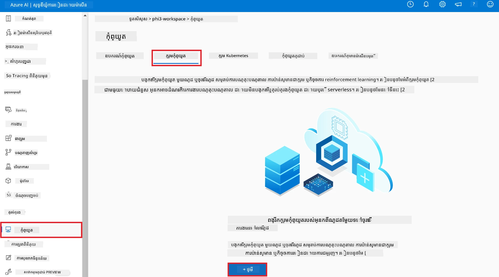

1. ធ្វើការបំពេញដូចខាងក្រោម៖

    - ជ្រើស **Region** ដែលអ្នកចង់ប្រើ។
    - ជ្រើស **Virtual machine tier** ទៅ **Dedicated**।
    - ជ្រើស **Virtual machine type** ទៅ **GPU**។
    - ជ្រើស <span>**Virtual machine size**</span> ត្រូវតែជាការតំណាង **Select from all options**។
    - ជ្រើស **Virtual machine size** ទៅ **Standard_NC24ads_A100_v4**។

    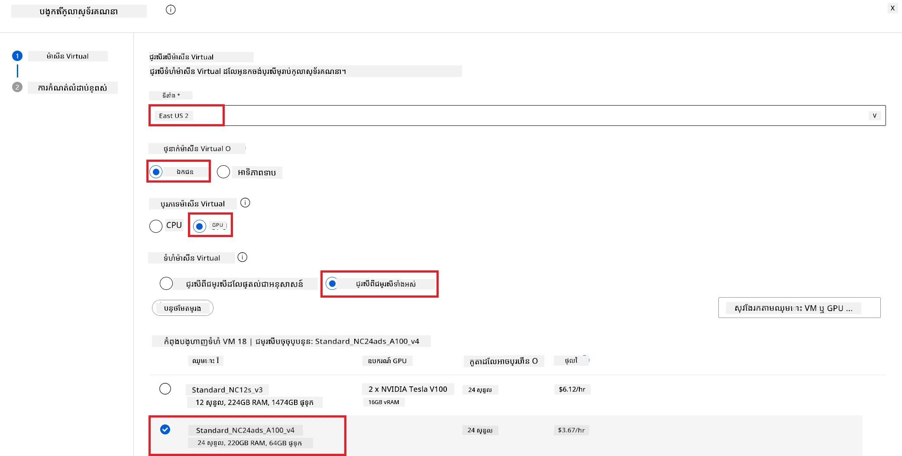

1. ជ្រើស **Next**។

1. ធ្វើការបំពេញដូចខាងក្រោម៖

    - បញ្ចូល **Compute name**។ វាត្រូវតែមានតម្លៃមួយដែលមិនទាន់មានហើយ។
    - ជ្រើស **Minimum number of nodes** ទៅ **0**។
    - ជ្រើស **Maximum number of nodes** ទៅ **1**។
    - ជ្រើស **Idle seconds before scale down** ទៅ **120**។

    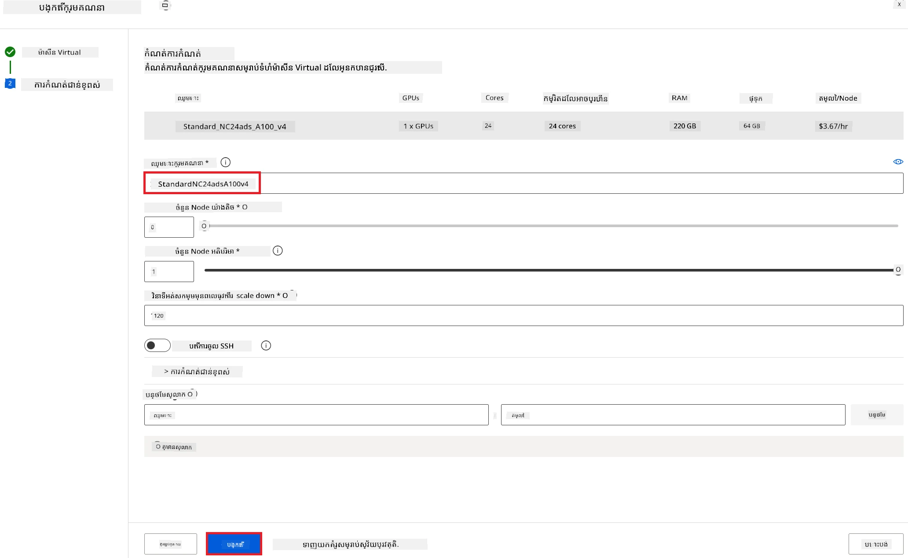

1. ជ្រើស **Create**។

#### Fine-tune the Phi-3 model

1. បើក [Azure ML Studio](https://ml.azure.com/home?wt.mc_id=studentamb_279723)។

1. ជ្រើស Azure Machine Learning workspace ដែលអ្នកបានបង្កើត។

    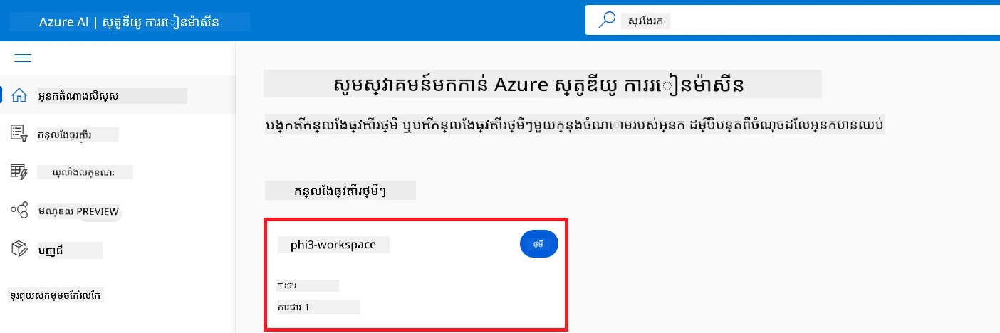

1. ធ្វើការបំពេញដូចខាងក្រោម៖

    - ជ្រើស **Model catalog** ពីផ្ទាំងខាងឆ្វេង។
    - វាយ *phi-3-mini-4k* ក្នុង **search bar** ហើយជ្រើស **Phi-3-mini-4k-instruct** ពីជម្រើសដែលបង្ហាញ។

    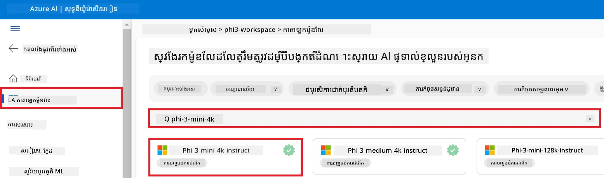

1. ជ្រើស **Fine-tune** ពីម៉ឺនុយបណ្តង។

    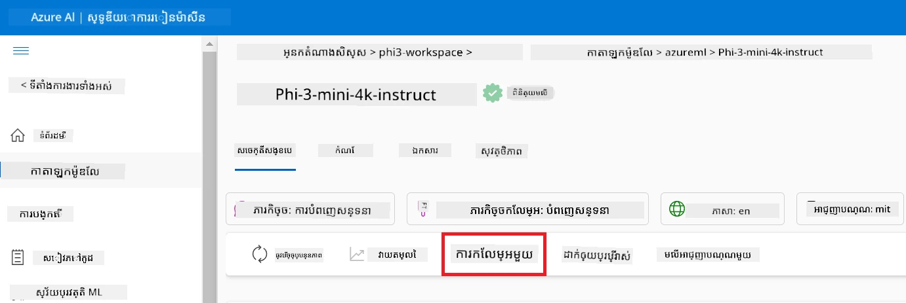

1. ធ្វើការបំពេញដូចខាងក្រោម៖

    - ជ្រើស **Select task type** ទៅ **Chat completion**។
    - ជ្រើស **+ Select data** ដើម្បីផ្ទុកឡើង **Traning data**។
    - ជ្រើស ប្រភេទការផ្ទុកឡើង Validation data ទៅ **Provide different validation data**។
    - ជ្រើស **+ Select data** ដើម្បីផ្ទុកឡើង **Validation data**។

    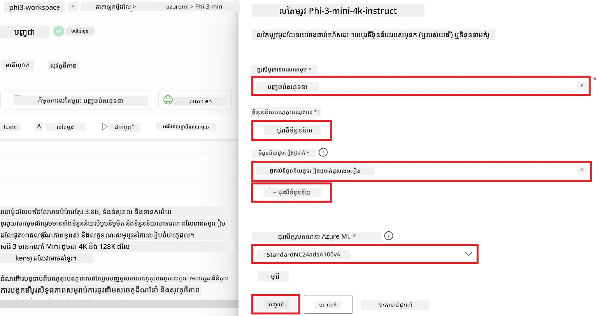

> [!TIP]
>
> អ្នកអាចជ្រើស **Advanced settings** ដើម្បីប្ដូរកំណត់រចនាសម្ព័ន្ធដូចជា **learning_rate** និង **lr_scheduler_type** ដើម្បីអប្បបរិមាប្រសិទ្ធភាពនៃដំណើរការ fine-tuning តាមតម្រូវការពិសេសរបស់អ្នក។

1. ជ្រើស **Finish**។

1. ក្នុងលំហាត់នេះ អ្នកបាន fine-tune ម៉ូឌែល Phi-3 ជោគជ័យដោយប្រើ Azure Machine Learning។ សូមចំណាំថា ដំណើរការបង្វឹក (fine-tuning) អាចចំណាយពេលយូរ។ បន្ទាប់ពីចាប់ផ្តើមការងារ fine-tuning អ្នកត្រូវរង់ចាំដល់វាជាស្ថិតិ។ អ្នកអាចត្រួតពិនិត្យស្ថានភាពនៃការងារ fine-tuning ដោយទៅកាន់ផ្ទាំង Jobs នៅផ្នែកខាងឆ្វេងនៃ Azure Machine Learning Workspace របស់អ្នក។ ក្នុងជុំក្រោយ អ្នកនឹងធ្វើការដាក់ដំណើរការម៉ូឌែលដែលបាន fine-tune ហើយបញ្ចូលវាជាមួយ Prompt flow។

    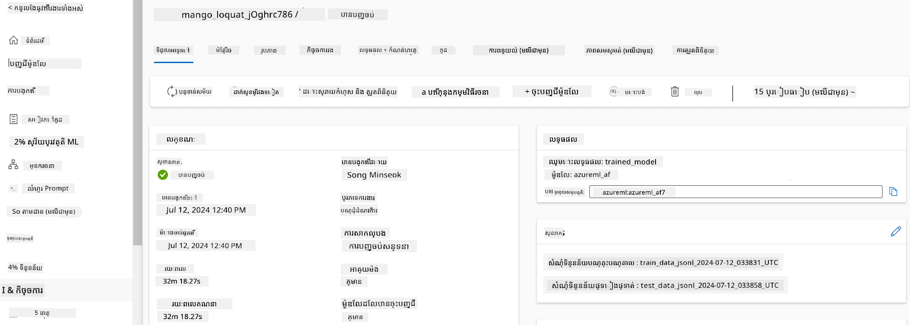

### Deploy the fine-tuned Phi-3 model

ដើម្បីបញ្ចូលម៉ូឌែល Phi-3 ដែលបាន fine-tune ជាមួយ Prompt flow អ្នកត្រូវដាក់ដំណើរការ (deploy) ម៉ូឌែល ដើម្បីឲ្យវាអាចប្រើសម្រាប់ inference ពេលវេលាចម្លើយភ្លាម។ ដំណើរការនេះរួមមានការចុះបញ្ជីម៉ូឌែល បង្កើត online endpoint និងដាក់ពាក្យដាក់ដំណើរការម៉ូឌែល។

ក្នុងលំហាត់នេះ អ្នកនឹងធ្វើ៖

- ចុះបញ្ជីម៉ូឌែលដែលបាន fine-tune នៅក្នុង Azure Machine Learning workspace។
- បង្កើត online endpoint។
- ដាក់ពាក្យដាក់ដំណើរការ (deploy) ម៉ូឌែល Phi-3 ដែលបានចុះបញ្ជី។

#### Register the fine-tuned model

1. បើក [Azure ML Studio](https://ml.azure.com/home?wt.mc_id=studentamb_279723)។

1. ជ្រើស Azure Machine Learning workspace ដែលអ្នកបានបង្កើត។

    

1. ជ្រើស **Models** ពីផ្ទាំងខាងឆ្វេង។
1. ជ្រើស **+ Register**។
1. ជ្រើស **From a job output**។

    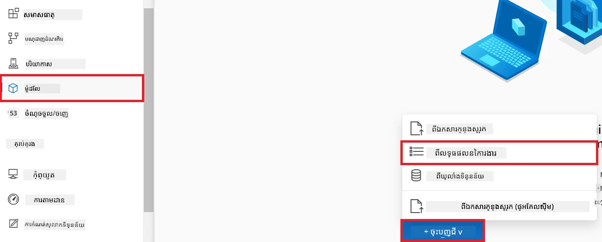

1. ជ្រើសការងារដែលអ្នកបានបង្កើត។

    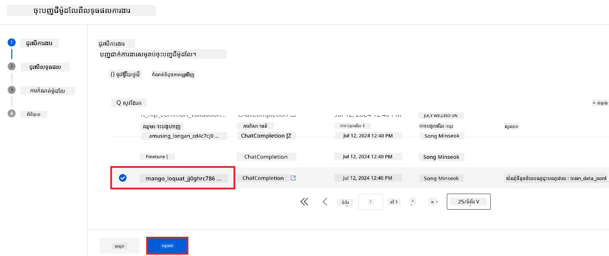

1. ជ្រើស **Next**។

1. ជ្រើស **Model type** ទៅ **MLflow**។

1. ធានាថា **Job output** ត្រូវបានជ្រើស; វាគួរតែជ្រើសដោយស្វ័យប្រវត្តិ។

    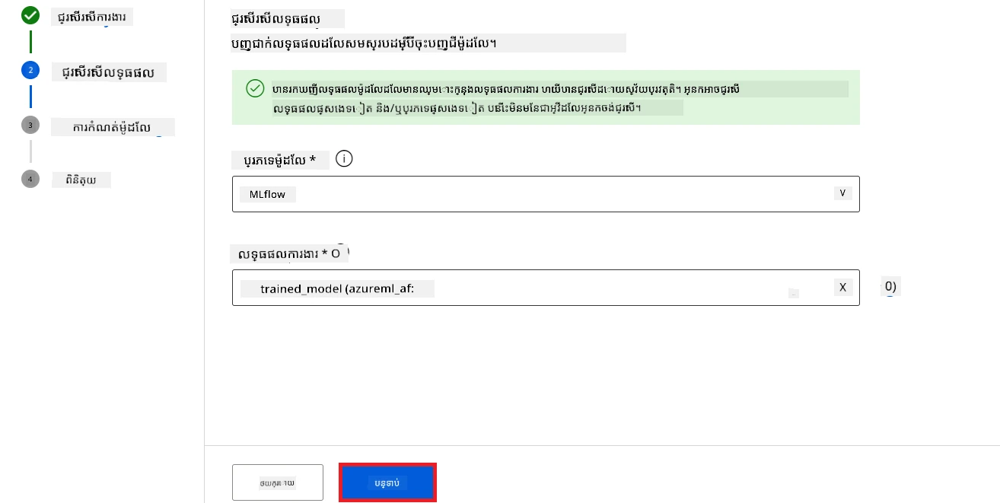

2. ជ្រើស **Next**។

3. ជ្រើស **Register**។

    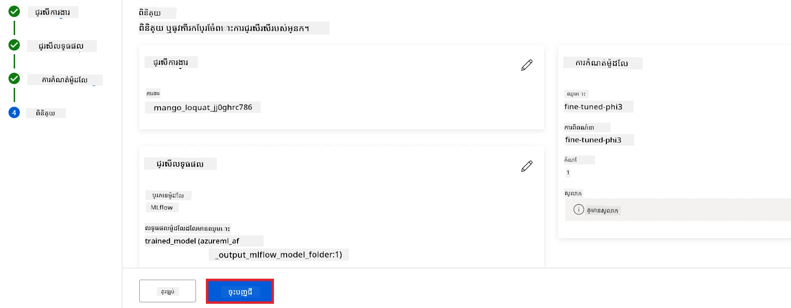

4. អ្នកអាចមើលម៉ូឌែលដែលបានចុះបញ្ជី ដោយទៅកាន់ម៉ឺនុយ **Models** ពីផ្ទាំងខាងឆ្វេង។

    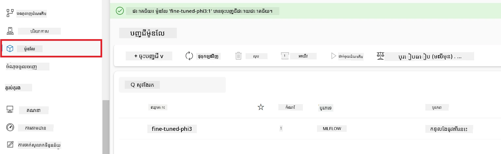

#### Deploy the fine-tuned model

1. ទៅកាន់ Azure Machine Learning workspace ដែលអ្នកបានបង្កើត។

1. ជ្រើស **Endpoints** ពីផ្ទាំងខាងឆ្វេង។

1. ជ្រើស **Real-time endpoints** ពីម៉ឺនុយបណ្តង។

    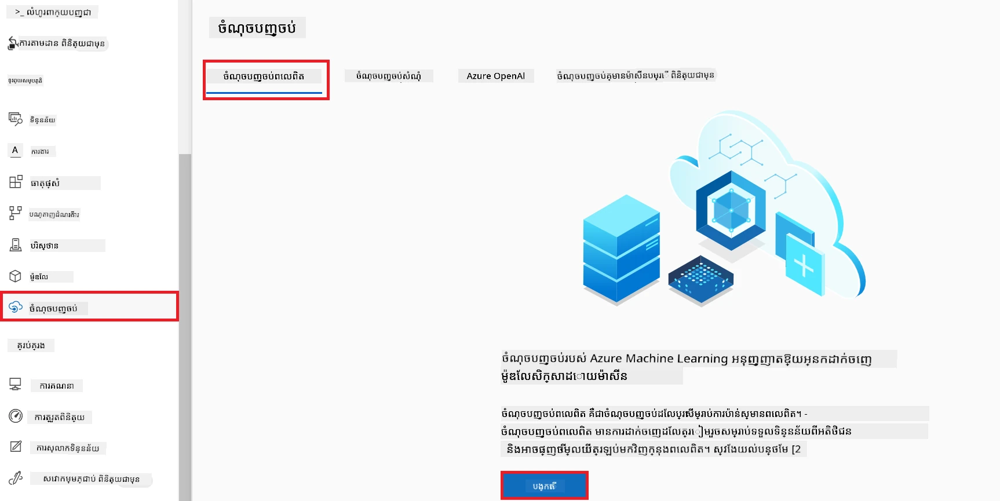

1. ជ្រើស **Create**។

1. ជ្រើសម៉ូឌែលដែលបានចុះបញ្ជីដែលអ្នកបានបង្កើត។

    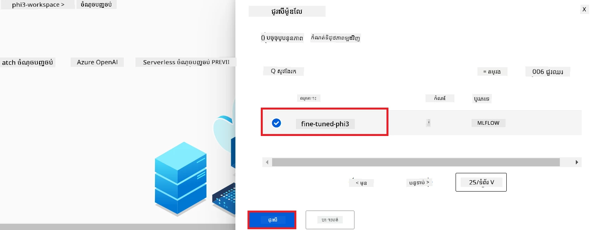

1. ជ្រើស **Select**។

1. ធ្វើការបំពេញដូចខាងក្រោម៖

    - ជ្រើស **Virtual machine** ទៅ *Standard_NC6s_v3*។
    - ជ្រើស **Instance count** ដែលអ្នកចង់ប្រើ។ ឧទាហរណ៍ *1*।
    - ជ្រើស **Endpoint** ទៅ **New** ដើម្បីបង្កើត endpoint ថ្មី។
    - បញ្ចូល **Endpoint name**។ វាត្រូវតែមានតម្លៃមួយដែលមិនទាន់មានហើយ។
    - បញ្ចូល **Deployment name**។ វាត្រូវតែមានតម្លៃមួយដែលមិនទាន់មានហើយ។

    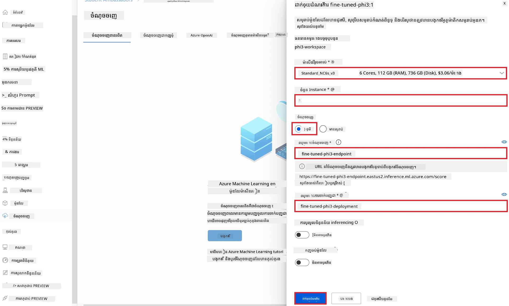

1. ជ្រើស **Deploy**។

> [!WARNING]
> ដើម្បីជៀសវាងការចំណាយបន្ថែមលើគណនីរបស់អ្នក សូមប្រាកដលុប endpoint ដែលបានបង្កើតនៅក្នុង Azure Machine Learning workspace។

#### Check deployment status in Azure Machine Learning Workspace

1. ទៅកាន់ Azure Machine Learning workspace ដែលអ្នកបានបង្កើត។

1. ជ្រើស **Endpoints** ពីផ្ទាំងខាងឆ្វេង។

1. ជ្រើស endpoint ដែលអ្នកបានបង្កើត។

    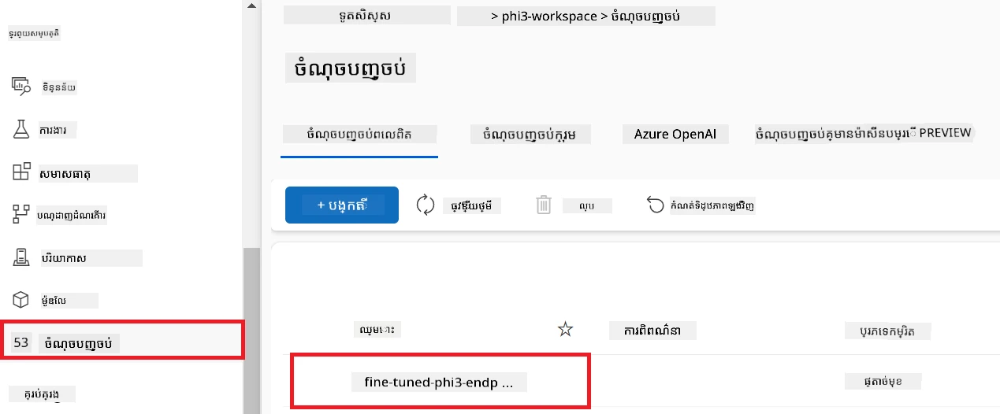

1. នៅលើទំព័រនេះ អ្នកអាចគ្រប់គ្រង endpoints ពេលដំណើរការដាក់ពាក្យដំណើរការ (deployment) ។

> [!NOTE]
> បន្ទាប់ពីការដាក់ពាក្យដាក់ដំណើរការ សម្រេច សូមធ្វើឲ្យ **Live traffic** បានកំណត់ទៅ **100%**។ ប្រសិនបើវាមិនមែន 100% សូមជ្រើស **Update traffic** ដើម្បីកែតម្រូវការកំណត់ចរាចរណ៍។ សូមចំណាំមួយទៀតថា អ្នកមិនអាចសាកល្បងម៉ូឌែលបាន ប្រសិនបើចរាចរណ៍ត្រូវបានកំណត់ទៅ 0% ទេ។
>
> 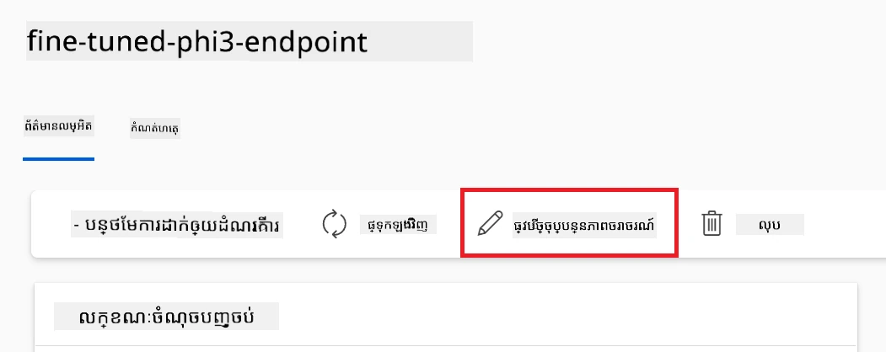
>

## Scenario 3: Integrate with Prompt flow and Chat with your custom model in Microsoft Foundry

### Integrate the custom Phi-3 model with Prompt flow

បន្ទាប់ពីបានដាក់ដំណើរការម៉ូឌែលដែលបាន fine-tune ជារួច អ្នកឥឡូវនេះអាចបញ្ចូលវាជាមួយ Prompt Flow ដើម្បីប្រើម៉ូឌែលរបស់អ្នកក្នុងកម្មវិធីពេលជាក់ស្តែង (real-time) ដែលអាចធ្វើភារកិច្ចអន្តរជាមួយបានជាច្រើនជាមួយម៉ូឌែល Phi-3 ផ្ទាល់ខ្លួនរបស់អ្នក។

ក្នុងលំហាត់នេះ អ្នកនឹងធ្វើ៖

- បង្កើត Microsoft Foundry Hub។
- បង្កើត Microsoft Foundry Project។
- បង្កើត Prompt flow។
- បន្ថែមកាស្ស៊ីសន៍ (connection) ផ្ទាល់ខ្លួនសម្រាប់ម៉ូឌែល Phi-3 ដែលបាន fine-tune។
- រៀបចំ Prompt flow ដើម្បីសន្ទនាជាមួយម៉ូឌែល Phi-3 ផ្ទាល់ខ្លួនរបស់អ្នក។

> [!NOTE]
> អ្នកអាចបញ្ចូលជាមួយ Promptflow ដោយប្រើ Azure ML Studio ផងដែរ។ ដំណើរការបញ្ចូលដូចគ្នានេះអាចអនុវត្តទៅលើ Azure ML Studio ។

#### Create Microsoft Foundry Hub

អ្នកត្រូវបង្កើត Hub មុនពេលបង្កើត Project។ Hub មានតួនាទីដូចជា Resource Group ដែលអនុញ្ញាតឲ្យអ្នករៀបចំ និងគ្រប់គ្រង Projects ច្រើននៅខាងក្នុង Microsoft Foundry។

1. បើក [Microsoft Foundry](https://ai.azure.com/?WT.mc_id=aiml-137032-kinfeylo)។

1. ជ្រើស **All hubs** ពីផ្ទាំងខាងឆ្វេង។

1. ជ្រើស **+ New hub** ពីម៉ឺនុយបណ្តង។

    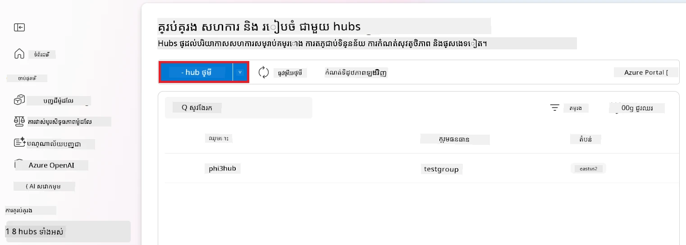

1. ធ្វើការបំពេញដូចខាងក្រោម៖

    - បញ្ចូល **Hub name**។ វាត្រូវតែមានតម្លៃមួយដែលមិនទាន់មានហើយ।
    - ជ្រើស **Subscription** របស់អ្នក។
    - ជ្រើស **Resource group** ដែលត្រូវប្រើ (បង្កើតថ្មី ប្រសិនបើទាមទារ)។
    - ជ្រើស **Location** ដែលអ្នកចង់ប្រើ។
    - ជ្រើស **Connect Azure AI Services** ដែលត្រូវប្រើ (បង្កើតថ្មី ប្រសិនបើទាមទារ)。
    - ជ្រើស **Connect Azure AI Search** ដើម្បី **Skip connecting**.

    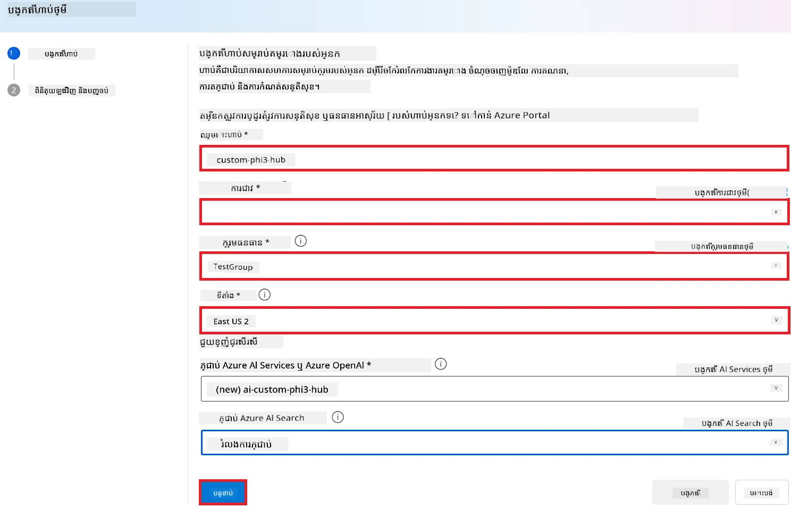

1. ជ្រើស **Next**.

#### Create Microsoft Foundry Project

1. នៅក្នុង Hub ដែលអ្នកបានបង្កើត ជ្រើស **All projects** ពីផ្ទាំងខាងឆ្វេង។

1. ជ្រើស **+ New project** ពីម៉ឺនុយនាវីហ្គេស៊ិន។

    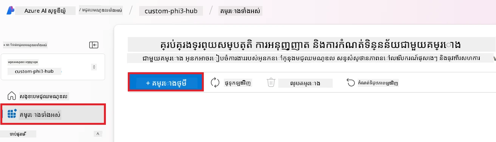

1. បញ្ចូល **Project name**។ វាត្រូវតែមានតម្លៃតែមួយ។

    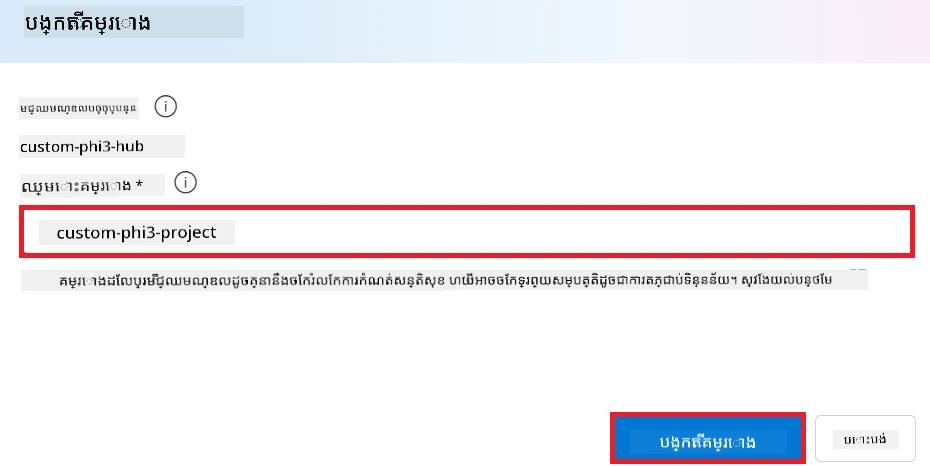

1. ជ្រើស **Create a project**។

#### Add a custom connection for the fine-tuned Phi-3 model

ដើម្បីបញ្ចូលម៉ូឌែល Phi-3 ផ្ទាល់ខ្លួនរបស់អ្នកទៅក្នុង Prompt flow អ្នកត្រូវរក្សាទុក endpoint និង key របស់ម៉ូឌែលក្នុងការតភ្ជាប់ផ្ទាល់ខ្លួន។ ការកំណត់នេះធានាថាអ្នកអាចចូលប្រើម៉ូឌែល Phi-3 ផ្ទាល់ខ្លួនរបស់អ្នកនៅក្នុង Prompt flow បាន។

#### Set api key and endpoint uri of the fine-tuned Phi-3 model

1. ចូលទៅកាន់ [Azure ML Studio](https://ml.azure.com/home?WT.mc_id=aiml-137032-kinfeylo).

1. នាវីហ្គាតទៅកាន់ Azure Machine learning workspace ដែលអ្នកបានបង្កើត។

1. ជ្រើស **Endpoints** ពីផ្ទាំងខាងឆ្វេង។

    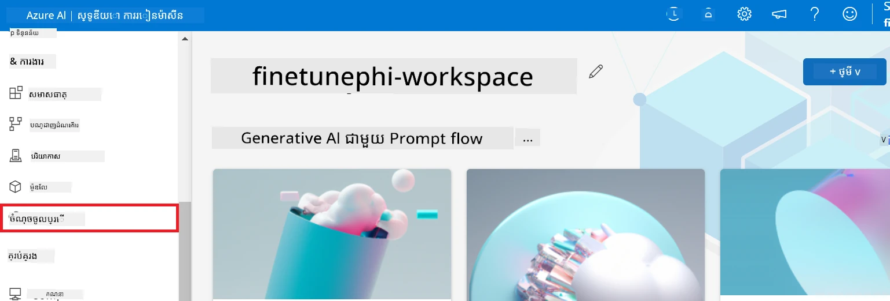

1. ជ្រើស endpoint ដែលអ្នកបានបង្កើត។

    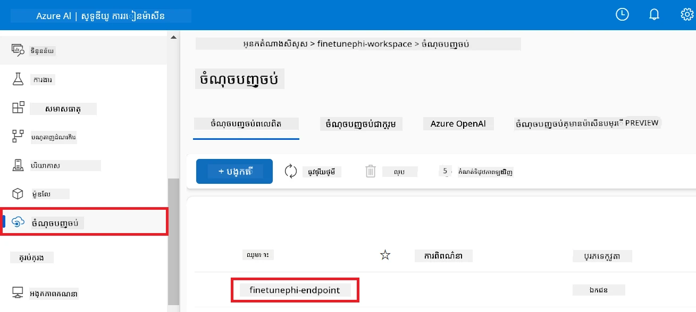

1. ជ្រើស **Consume** ពីម៉ឺនុយនាវីហ្គេស៊ិន។

1. ចម្លង **REST endpoint** និង **Primary key** របស់អ្នក។

    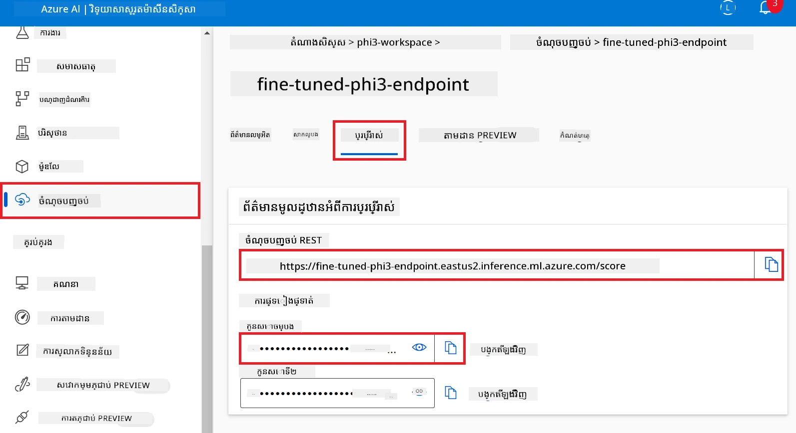

#### Add the Custom Connection

1. ចូលទៅកាន់ [Microsoft Foundry](https://ai.azure.com/?WT.mc_id=aiml-137032-kinfeylo).

1. នាវីហ្គាតទៅកាន់គម្រោង Microsoft Foundry ដែលអ្នកបានបង្កើត។

1. នៅក្នុងគម្រោងដែលអ្នកបានបង្កើត ជ្រើស **Settings** ពីផ្ទាំងខាងឆ្វេង។

1. ជ្រើស **+ New connection**។

    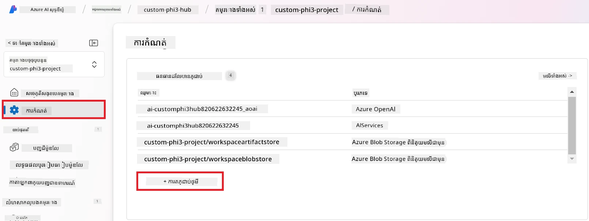

1. ជ្រើស **Custom keys** ពីម៉ឺនុយនាវីហ្គេស៊ិន។

    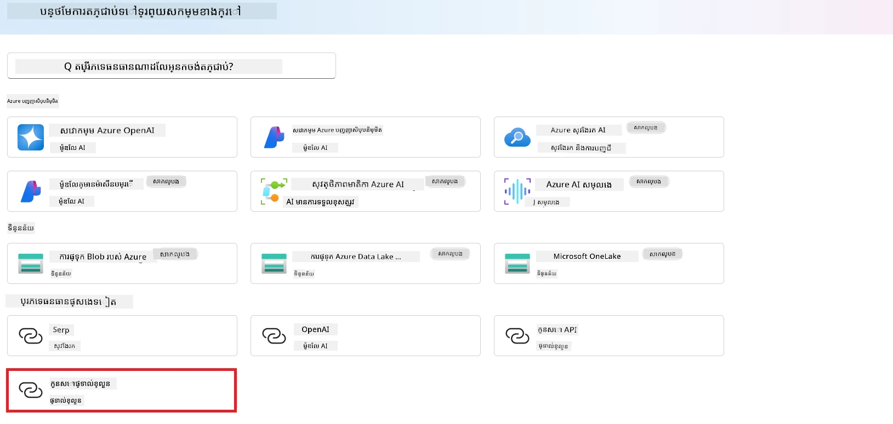

1. ធ្វើតាមការងារដូចខាងក្រោម៖

    - ជ្រើស **+ Add key value pairs**។
    - សម្រាប់ឈ្មោះ key បញ្ចូល **endpoint** ហើយចម្លង(endpoint) ដែលអ្នកបានចម្លងពី Azure ML Studio ទៅក្នុងវាល value។
    - ជ្រើស **+ Add key value pairs** ម្តងទៀត។
    - សម្រាប់ឈ្មោះ key បញ្ចូល **key** ហើយចម្លង key ដែលអ្នកបានចម្លងពី Azure ML Studio ទៅក្នុងវាល value។
    - បន្ទាប់ពីបានបញ្ចូល keys ជ្រើស **is secret** ដើម្បីការពារមិនឲ្យ key បង្ហាញខាងក្រៅ។

    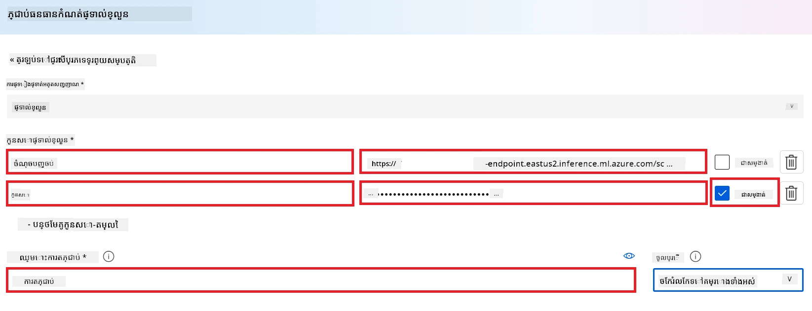

1. ជ្រើស **Add connection**។

#### Create Prompt flow

អ្នកបានបន្ថែមការតភ្ជាប់ផ្ទាល់ខ្លួនក្នុង Microsoft Foundry ឥឡូវនេះ យើងនឹងបង្កើត Prompt flow ដោយអនុវត្តតាមជំហានខាងក្រោម។ បន្ទាប់មក អ្នកនឹងភ្ជាប់ Prompt flow នេះទៅកាន់ការតភ្ជាប់ផ្ទាល់ខ្លួន ដើម្បីអនុវត្តម៉ូឌែលដែលបាន fine-tune ក្នុង Prompt flow ។

1. នាវីហ្គាតទៅកាន់គម្រោង Microsoft Foundry ដែលអ្នកបានបង្កើត។

1. ជ្រើស **Prompt flow** ពីផ្ទាំងខាងឆ្វេង។

1. ជ្រើស **+ Create** ពីម៉ឺនុយនាវីហ្គេស៊ិន។

    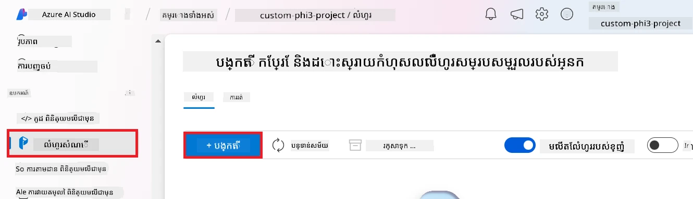

1. ជ្រើស **Chat flow** ពីម៉ឺនុយនាវីហ្គេស៊ិន។

    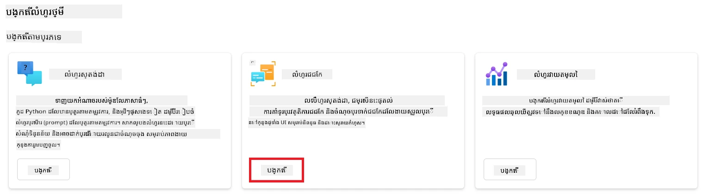

1. បញ្ចូល **Folder name** សម្រាប់ប្រើ។

    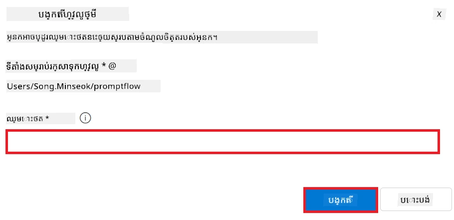

2. ជ្រើស **Create**។

#### Set up Prompt flow to chat with your custom Phi-3 model

អ្នកត្រូវបញ្ចូលម៉ូឌែល Phi-3 ដែលបាន fine-tune ទៅក្នុង Prompt flow។ ទោះយ៉ាងណា Prompt flow ដែលមានស្រាប់មិនបានរចនាឡើយសម្រាប់បំណងនេះ ដូច្នេះ អ្នកត្រូវបណ្តុះសាងឡើងវិញ Prompt flow ដើម្បីអនុញ្ញាតឲ្យភ្ជាប់ម៉ូឌែលផ្ទាល់ខ្លួនបាន។

1. ក្នុង Prompt flow ធ្វើកិច្ចការដូចខាងក្រោម ដើម្បីសាងសង់ឡើងវិញ flow ដែលមានស្រាប់៖

    - ជ្រើស **Raw file mode**។
    - លុបកូដដែលមានស្រាប់ទាំងអស់ក្នុងឯកសារ *flow.dag.yml*។
    - បន្ថែមកូដដូចខាងក្រោមទៅក្នុងឯកសារ *flow.dag.yml*។

        ```yml
        inputs:
          input_data:
            type: string
            default: "Who founded Microsoft?"

        outputs:
          answer:
            type: string
            reference: ${integrate_with_promptflow.output}

        nodes:
        - name: integrate_with_promptflow
          type: python
          source:
            type: code
            path: integrate_with_promptflow.py
          inputs:
            input_data: ${inputs.input_data}
        ```

    - ជ្រើស **Save**។

    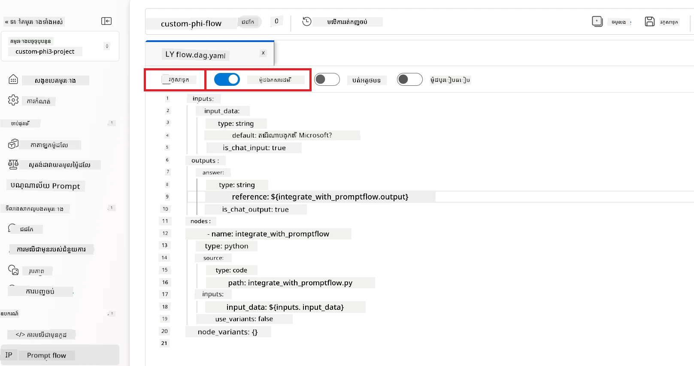

1. បន្ថែមកូដដូចខាងក្រោមទៅក្នុងឯកសារ *integrate_with_promptflow.py* ដើម្បីប្រើម៉ូឌែល Phi-3 ផ្ទាល់ខ្លួនក្នុង Prompt flow។

    ```python
    import logging
    import requests
    from promptflow import tool
    from promptflow.connections import CustomConnection

    # ការកំណត់កំណត់ហេតុ
    logging.basicConfig(
        format="%(asctime)s - %(levelname)s - %(name)s - %(message)s",
        datefmt="%Y-%m-%d %H:%M:%S",
        level=logging.DEBUG
    )
    logger = logging.getLogger(__name__)

    def query_phi3_model(input_data: str, connection: CustomConnection) -> str:
        """
        Send a request to the Phi-3 model endpoint with the given input data using Custom Connection.
        """

        # "connection" គឺជាឈ្មោះនៃ Custom Connection, "endpoint" និង "key" ជាកូនសោនៅក្នុង Custom Connection
        endpoint_url = connection.endpoint
        api_key = connection.key

        headers = {
            "Content-Type": "application/json",
            "Authorization": f"Bearer {api_key}"
        }
        data = {
            "input_data": {
                "input_string": [
                    {"role": "user", "content": input_data}
                ],
                "parameters": {
                    "temperature": 0.7,
                    "max_new_tokens": 128
                }
            }
        }
        try:
            response = requests.post(endpoint_url, json=data, headers=headers)
            response.raise_for_status()
            
            # កត់ហេតុការឆ្លើយតប JSON ទាំងមូល
            logger.debug(f"Full JSON response: {response.json()}")

            result = response.json()["output"]
            logger.info("Successfully received response from Azure ML Endpoint.")
            return result
        except requests.exceptions.RequestException as e:
            logger.error(f"Error querying Azure ML Endpoint: {e}")
            raise

    @tool
    def my_python_tool(input_data: str, connection: CustomConnection) -> str:
        """
        Tool function to process input data and query the Phi-3 model.
        """
        return query_phi3_model(input_data, connection)

    ```

    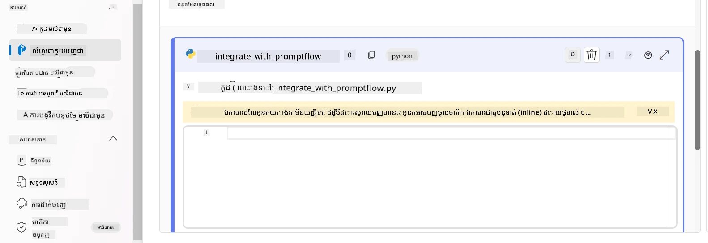

> [!NOTE]
> សម្រាប់ព័ត៌មានលម្អិតបន្ថែមអំពីការប្រើ Prompt flow ក្នុង Microsoft Foundry អ្នកអាចយោងទៅកាន់ [Prompt flow in Microsoft Foundry](https://learn.microsoft.com/azure/ai-studio/how-to/prompt-flow).

1. ជ្រើស **Chat input**, **Chat output** ដើម្បីអនុញ្ញាតឲ្យជជែកជាមួយម៉ូឌែលរបស់អ្នក។

    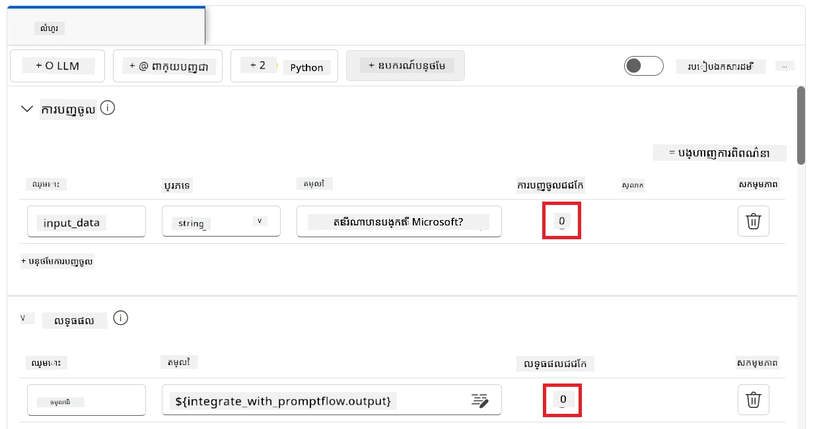

1. ឥឡូវនេះ អ្នកបានត្រៀមខ្លួនសម្រាប់ជជែកជាមួយម៉ូឌែល Phi-3 ផ្ទាល់ខ្លួនរបស់អ្នក។ នៅក្នុងលំហាត់បន្ទាប់ អ្នកនឹងរៀនពីរបៀបចាប់ផ្តើម Prompt flow និងប្រើវាសម្រាប់ជជែកជាមួយម៉ូឌែល Phi-3 ដែលបាន fine-tune។

> [!NOTE]
>
> Flow ដែលបានសាងសង់ឡើងវិញគួរតែមានរូបរាងដូចរូបភាពខាងក្រោម៖
>
> 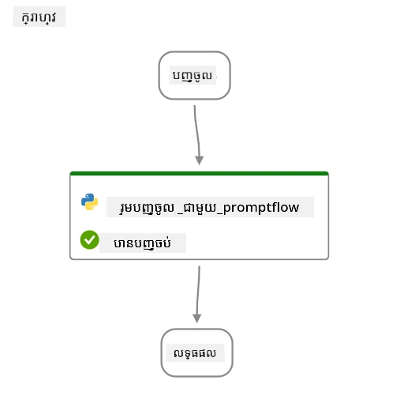
>

### Chat with your custom Phi-3 model

ឥឡូវនេះ បន្ទាប់ពីអ្នកបាន fine-tune និងភ្ជាប់ម៉ូឌែល Phi-3 ផ្ទាល់ខ្លួនរបស់អ្នកជាមួយ Prompt flow ខ្លះៗ អ្នកបានត្រៀមខ្លួនសម្រាប់ចាប់ផ្តើមទំនាក់ទំនងជាមួយវា។ លំហាត់នេះ នឹងណែនាំអ្នកពីដំណើរការ ការកំណត់ និងការចាប់ផ្តើមជជែកជាមួយម៉ូឌែល ដោយប្រើ Prompt flow។ ដោយអនុវត្តតាមជំហានទាំងនេះ អ្នកនឹងអាចប្រើសមត្ថភាពពេញលេញរបស់ម៉ូឌែល Phi-3 ដែលបាន fine-tune សម្រាប់កិច្ចការ និងការសន្ទនានានា។

- ជជែកជាមួយម៉ូឌែល Phi-3 ផ្ទាល់ខ្លួនរបស់អ្នកដោយប្រើ Prompt flow។

#### Start Prompt flow

1. ជ្រើស **Start compute sessions** ដើម្បីចាប់ផ្តើម Prompt flow។

    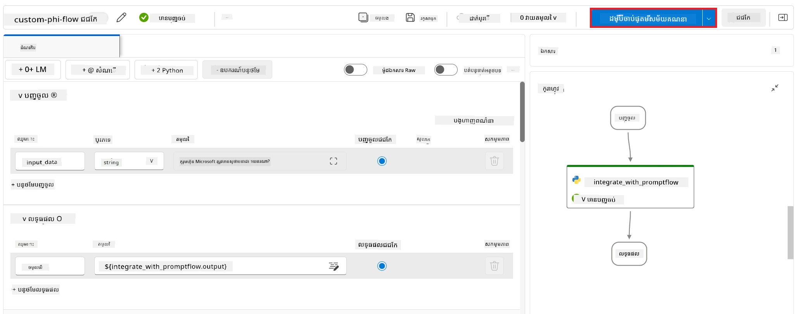

1. ជ្រើស **Validate and parse input** ដើម្បីបន្ទាន់សម័យប៉ារ៉ាម៉ែត្រ។

    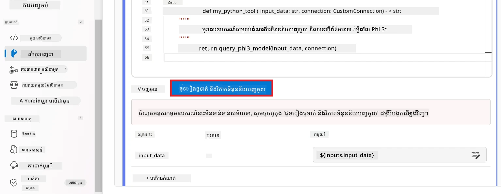

1. ជ្រើស **Value** របស់ **connection** ទៅកាន់ការតភ្ជាប់ផ្ទាល់ខ្លួនដែលអ្នកបានបង្កើត។ ឧទាហរណ៍ *connection*។

    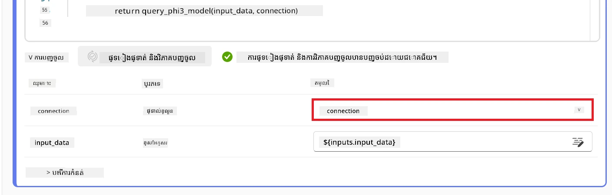

#### Chat with your custom model

1. ជ្រើស **Chat**។

    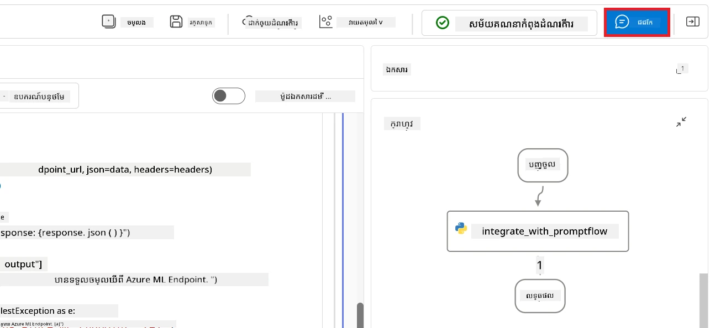

1. នេះជាឧទាហរណ៍នៃលទ្ធផល៖ ឥឡូវនេះអ្នកអាចជជែកជាមួយម៉ូឌែល Phi-3 ផ្ទាល់ខ្លួនរបស់អ្នក។ គួរពិចារណាសួរពីសំណួរដែលផ្អែកលើទិន្នន័យដែលបានប្រើសម្រាប់ការធ្វើ fine-tuning។

    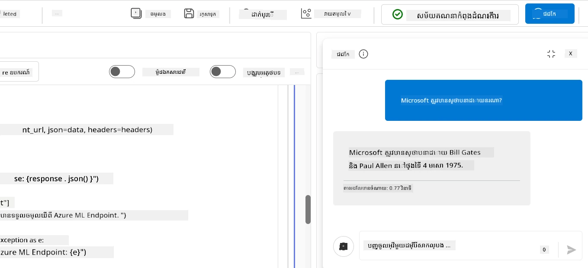

---

<!-- CO-OP TRANSLATOR DISCLAIMER START -->
**ការមិនទទួលខុសត្រូវ**:
ឯកសារនេះត្រូវបានបកប្រែដោយប្រើសេវាបកប្រែ AI [Co-op Translator](https://github.com/Azure/co-op-translator)។ ទោះបីយើងខិតខំធ្វើឱ្យបានត្រឹមត្រូវ ក៏សូមចំណាំថា ការបកប្រែដោយស្វ័យ​ប្រវត្តិអាចមានកំហុស ឬមិនត្រឹមត្រូវ។ ឯកសារដើមនៅក្នុងភាសាដើមគួរត្រូវបានចាត់ទុកថាជាឯកសារយោងដែលមានសុពលភាព។ សម្រាប់ព័ត៌មានសំខាន់ យើងសូមណែនាំឱ្យប្រើការបកប្រែដោយអ្នកបកប្រែវិជ្ជាជីវៈ។ យើងមិនទទួលខុសត្រូវចំពោះការយល់ច្រឡំ ឬការបកស្រាយខុស ដែលកើតឡើងពីការប្រើប្រាស់ការបកប្រែនេះទេ។
<!-- CO-OP TRANSLATOR DISCLAIMER END -->