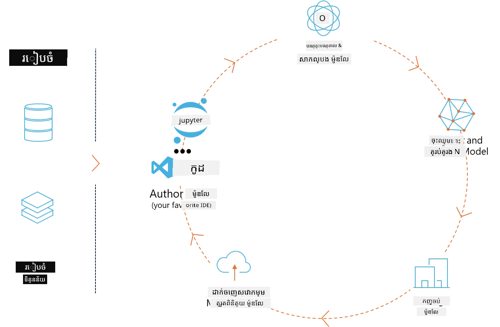
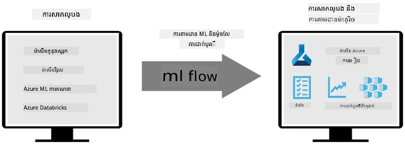
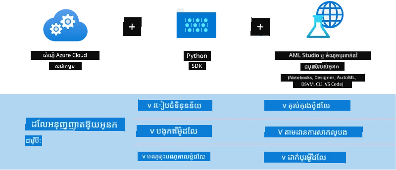

# MLflow

[MLflow](https://mlflow.org/) គឺជា​វេទិកាបើកដែលបានរចនា​ដើម្បីគ្រប់គ្រង រង្វង់ជីវិតទាំងមូលនៃម៉ាស៊ីនរៀន។



MLFlow ត្រូវបានប្រើដើម្បីគ្រប់គ្រង រង្វង់ជីវិត ML រួមទាំង ការសាកល្បង (experimentation), ការធានាថាអាចធ្វើឡើងវិញ (reproducibility), ការដាក់បញ្ចូល (deployment) និង ស្តុកកាលិការ​ម៉ូឌែល​កណ្តាល។ MLflow ឥឡូវនេះ ផ្តល់ជូនបួនផ្នែក។

- **MLflow Tracking:** កត់ត្រា និងស្វែងរកការសាកល្បង, កូដ, កំណត់រចនាសម្ព័ន្ធទិន្នន័យ និងលទ្ធផល។
- **MLflow Projects:** បញ្ចប់កូដវិទ្យាសាស្ត្រទិន្នន័យទៅក្នុងទ្រង់ទ្រាយមួយ ដើម្បីអាចធ្វើឡើងវិញនៅលើបណ្តាញមេដ្ឋានណាមួយ។
- **Mlflow Models:** ដាក់ឲ្យដំណើរការម៉ូឌែលម៉ាស៊ីនរៀនក្នុងបរិយាកាសបម្រើនានា។
- **Model Registry:** រក្សាទុក, សម្គាល់ និងគ្រប់គ្រងម៉ូឌែលនៅក្នុងឃ្លាំងកណ្តាល។

វាមានសមត្ថភាពសម្រាប់តាមដានការសាកល្បង, បញ្ចុះកូដទៅក្នុងការរត់ដែលអាចធ្វើឡើងវិញ, និងចែករំលែកនិងដាក់បញ្ចូលម៉ូឌែល។ MLFlow ស៊ីណ្តេនជាមួយ Databricks ហើយគាំទ្រក្រុមបណ្ណាល័យ ML ជាច្រើន ដូច្នេះវានៅលើសិនទេីបផ្អែកលើបណ្ណាល័យណាមួយ។ វាអាចប្រើបានជាមួយបណ្ណាល័យម៉ាស៊ីនរៀនណាមួយ និងនៅក្នុងភាសាកម្មវិធីណាមួយ ពីព្រោះវាផ្ដល់ REST API និង CLI សម្រាប់ភាពងាយស្រួល។



លក្ខណៈសំខាន់ៗរបស់ MLFlow មានដូចជា៖

- **Experiment Tracking:** កត់ត្រា និងប្រៀបធៀបប៉ារ៉ាម៉ែត្រ និងលទ្ធផល។
- **Model Management:** គ្រប់គ្រងម៉ូឌែល៖ ដាក់ប្រើម៉ូឌែលលើបរិយាកាសបម្រើ និងប្លាតហ្វ័មសម្រាប់Inference។
- **Model Registry:** គ្រប់គ្រងរួមគ្នាពីរង្វង់ជីវិតរបស់ម៉ូឌែល MLflow រួមទាំងការកំណត់កំណែ និងការកត់សម្គាល់។
- **Projects:** បញ្ចុះកូដ ML សម្រាប់ចែករំលែក ឬសម្រាប់ប្រើក្នុងផលិតកម្ម។

MLFlow ក៏គាំទ្រគ្រប់ជំហានរបស់ MLOps ផងដែរ ដែលរួមមាន ការរៀបចំទិន្នន័យ, ការចុះបញ្ជី និងគ្រប់គ្រងម៉ូឌែល, ការវេចខ្ចប់ម៉ូឌែលសម្រាប់ការប្រតិបត្តិ, ការដាក់សេវាកម្ម និងការតាមដានម៉ូឌែល។ វាមានគោលបំណងដើម្បីសាមញ្ញភាពនៅក្នុងដំណាក់កាលផ្ទេរពីគំរូសាកល្បងទៅដំណើរការផលិត ជាពិសេសនៅលើបរិស្ថាន cloud និង edge។

## E2E Scenario - Building a wrapper and using Phi-3 as an MLFlow model

ក្នុងគំរូ E2E នេះ យើងនឹងបង្ហាញពីវិធីសាស្រ្តពីរផ្សេងគ្នា ក្នុងការបង្កើត wrapper ជុំវិញម៉ូឌែលភាសាតូច Phi-3 (SLM) ហើយបន្ទាប់មកវិញដំណើរការ​វា ជាម៉ូឌែល MLFlow ពីក្នុងម៉ាស៊ីនក្នុងដែនកន្លែងឬក្នុងពពក ដូចជា ក្នុង Azure Machine Learning workspace។



| Project | Description | Location |
| ------------ | ----------- | -------- |
| Transformer Pipeline | Transformer Pipeline គឺជាជម្រើសងាយស្រួលបំផុតសម្រាប់បង្កើត wrapper ប្រសិនបើអ្នកចង់ប្រើម៉ូឌែល HuggingFace ជាមួយមុខងារ experimental របស់ MLFlow សម្រាប់ transformers. | [**TransformerPipeline.ipynb**](../../../../code/06.E2E/E2E_Phi-3-MLflow_TransformerPipeline.ipynb) |
| Custom Python Wrapper | នៅពេលនិពន្ធនេះ transformer pipeline មិនគាំទ្រការបង្កើត MLFlow wrapper សម្រាប់ម៉ូឌែល HuggingFace ក្នុងទ្រង់ទ្រាយ ONNX ទេ ទោះបីជាមានកញ្ចប់ optimum Python សាកល្បងក៏ដោយ។ សម្រាប់ករណីដូចនេះ អ្នកអាចបង្កើត wrapper Python ផ្ទាល់ខ្លួនសម្រាប់ម៉ូឌែល MLFlow។ | [**CustomPythonWrapper.ipynb**](../../../../code/06.E2E/E2E_Phi-3-MLflow_CustomPythonWrapper.ipynb) |

## Project: Transformer Pipeline

1. You would require relevant Python packages from MLFlow and HuggingFace:

    ``` Python
    import mlflow
    import transformers
    ```

2. Next, you should initiate a transformer pipeline by referring to the target Phi-3 model in the HuggingFace registry. As can be seen from the _Phi-3-mini-4k-instruct_’s model card, its task is of a “Text Generation” type:

    ``` Python
    pipeline = transformers.pipeline(
        task = "text-generation",
        model = "microsoft/Phi-3-mini-4k-instruct"
    )
    ```

3. You can now save your Phi-3 model’s transformer pipeline into MLFlow format and provide additional details such as the target artifacts path, specific model configuration settings and inference API type:

    ``` Python
    model_info = mlflow.transformers.log_model(
        transformers_model = pipeline,
        artifact_path = "phi3-mlflow-model",
        model_config = model_config,
        task = "llm/v1/chat"
    )
    ```

## Project: Custom Python Wrapper

1. We can utilise here Microsoft's [ONNX Runtime generate() API](https://github.com/microsoft/onnxruntime-genai) for the ONNX model's inference and tokens encoding / decoding. You have to choose _onnxruntime_genai_ package for your target compute, with the below example targeting CPU:

    ``` Python
    import mlflow
    from mlflow.models import infer_signature
    import onnxruntime_genai as og
    ```

1. Our custom class implements two methods: _load_context()_ to initialise the **ONNX model** of Phi-3 Mini 4K Instruct, **generator parameters** and **tokenizer**; and _predict()_ to generate output tokens for the provided prompt:

    ``` Python
    class Phi3Model(mlflow.pyfunc.PythonModel):
        def load_context(self, context):
            # កំពុងទាញយកម៉ូដែលពីឯកសារ
            model_path = context.artifacts["phi3-mini-onnx"]
            model_options = {
                 "max_length": 300,
                 "temperature": 0.2,         
            }
        
            # កំណត់ម៉ូដែល
            self.phi3_model = og.Model(model_path)
            self.params = og.GeneratorParams(self.phi3_model)
            self.params.set_search_options(**model_options)
            
            # កំណត់ឧបករណ៍ចែកពាក្យ
            self.tokenizer = og.Tokenizer(self.phi3_model)
    
        def predict(self, context, model_input):
            # ទាញយកសំណើពីការបញ្ចូល
            prompt = model_input["prompt"][0]
            self.params.input_ids = self.tokenizer.encode(prompt)
    
            # បង្កើតចម្លើយរបស់ម៉ូដែល
            response = self.phi3_model.generate(self.params)
    
            return self.tokenizer.decode(response[0][len(self.params.input_ids):])
    ```

1. You can use now _mlflow.pyfunc.log_model()_ function to generate a custom Python wrapper (in pickle format) for the Phi-3 model, along with the original ONNX model and required dependencies:

    ``` Python
    model_info = mlflow.pyfunc.log_model(
        artifact_path = artifact_path,
        python_model = Phi3Model(),
        artifacts = {
            "phi3-mini-onnx": "cpu_and_mobile/cpu-int4-rtn-block-32-acc-level-4",
        },
        input_example = input_example,
        signature = infer_signature(input_example, ["Run"]),
        extra_pip_requirements = ["torch", "onnxruntime_genai", "numpy"],
    )
    ```

## Signatures of generated MLFlow models

1. In step 3 of the Transformer Pipeline project above, we set the MLFlow model’s task to “_llm/v1/chat_”. Such instruction generates a model’s API wrapper, compatible with OpenAI’s Chat API as shown below:

    ``` Python
    {inputs: 
      ['messages': Array({content: string (required), name: string (optional), role: string (required)}) (required), 'temperature': double (optional), 'max_tokens': long (optional), 'stop': Array(string) (optional), 'n': long (optional), 'stream': boolean (optional)],
    outputs: 
      ['id': string (required), 'object': string (required), 'created': long (required), 'model': string (required), 'choices': Array({finish_reason: string (required), index: long (required), message: {content: string (required), name: string (optional), role: string (required)} (required)}) (required), 'usage': {completion_tokens: long (required), prompt_tokens: long (required), total_tokens: long (required)} (required)],
    params: 
      None}
    ```

1. As a result, you can submit your prompt in the following format:

    ``` Python
    messages = [{"role": "user", "content": "What is the capital of Spain?"}]
    ```

1. Then, use OpenAI API-compatible post-processing, e.g., _response[0][‘choices’][0][‘message’][‘content’]_, to beautify your output to something like this:

    ``` JSON
    Question: What is the capital of Spain?
    
    Answer: The capital of Spain is Madrid. It is the largest city in Spain and serves as the political, economic, and cultural center of the country. Madrid is located in the center of the Iberian Peninsula and is known for its rich history, art, and architecture, including the Royal Palace, the Prado Museum, and the Plaza Mayor.
    
    Usage: {'prompt_tokens': 11, 'completion_tokens': 73, 'total_tokens': 84}
    ```

1. In step 3 of the Custom Python Wrapper project above, we allow the MLFlow package to generate the model’s signature from a given input example. Our MLFlow wrapper's signature will look like this:

    ``` Python
    {inputs: 
      ['prompt': string (required)],
    outputs: 
      [string (required)],
    params: 
      None}
    ```

1. So, our prompt would need to contain "prompt" dictionary key, similar to this:

    ``` Python
    {"prompt": "<|system|>You are a stand-up comedian.<|end|><|user|>Tell me a joke about atom<|end|><|assistant|>",}
    ```

1. The model's output will be provided then in string format:

    ``` JSON
    Alright, here's a little atom-related joke for you!
    
    Why don't electrons ever play hide and seek with protons?
    
    Because good luck finding them when they're always "sharing" their electrons!
    
    Remember, this is all in good fun, and we're just having a little atomic-level humor!
    ```

---

<!-- CO-OP TRANSLATOR DISCLAIMER START -->
**ការបដិសេធ**:
ឯកសារ​នេះ​ត្រូវ​បាន​ប្រែ​សម្រួល​ដោយ​ប្រើ​សេវាកម្ម​ប្រែសម្រួល AI [Co-op Translator](https://github.com/Azure/co-op-translator)។ ខណៈពេល​ដែលយើង​ព្យាយាម​រក្សា​ភាព​ត្រឹមត្រូវ សូម​ដឹង​ថា​ការ​ប្រែសម្រួល​ដោយ​ស្វ័យប្រវត្តិ​អាច​មាន​កំហុស ឬ​មិន​ត្រឹមត្រូវ។ ឯកសារ​ដើម​ក្នុង​ភាសា​ដើម​គួរត្រូវបាន​គេចាត់ទុក​ជា​ប្រភព​ដែល​អាច​ទុកចិត្ត​បាន។ សម្រាប់​ព័ត៌មាន​សំខាន់ៗ យើង​ផ្តល់​អនុសាសន៍​ឲ្យ​ប្រើ​ការ​ប្រែសម្រួល​ដោយ​មនុស្ស​ជំនាញ (អ្នកប្រែ​វិជ្ជាជីវៈ)។ យើង​មិន​ទទួល​ខុសត្រូវ​ចំពោះ​ការ​យល់​ច្រឡំ ឬ​ការ​ពន្យល់​ផ្ទុយ​អ្វីៗ​ដែល​កើត​ឡើង​ពី​ការ​ប្រើប្រាស់​ការ​ប្រែ​សម្រួល​នេះ។
<!-- CO-OP TRANSLATOR DISCLAIMER END -->