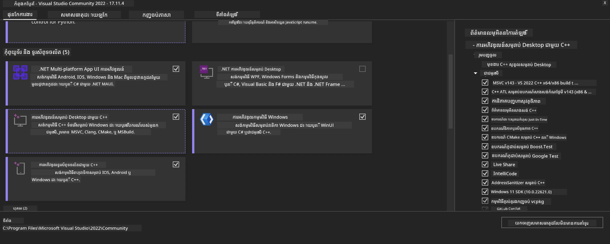
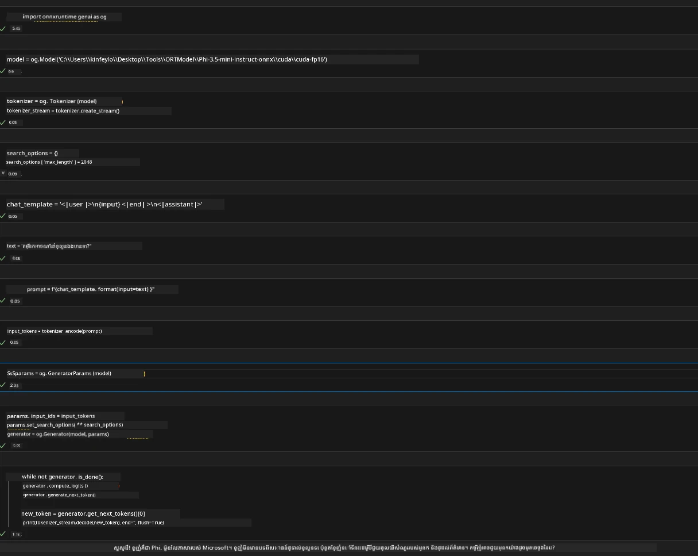
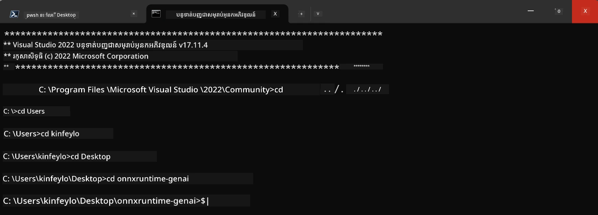

# **មគ្គុទេសក៍សម្រាប់ OnnxRuntime GenAI  GPU លើ Windows**

មគ្គុទេសក៍នេះផ្តល់ជំហានសម្រាប់ការកំណត់ និងប្រើ ONNX Runtime (ORT) ជាមួយ GPU លើ Windows។ វាត្រូវបានដាក់ប្លង់ដើម្បីជួយអ្នកក្នុងការប្រើប្រាស់​ការបញ្ចុងកម្រិត GPU សម្រាប់​ម៉ូដែល​របស់អ្នក ដើម្បីបង្កើនសមត្ថភាព និងប្រសិទ្ធភាព។

ឯកសារនេះផ្តល់ការណែនាំអំពី៖

- ការកំណត់បរិយាកាស៖ សេចក្តីណែនាំអំពីការដំឡើងឧបករណ៍ចាំបាច់ដូចជា CUDA, cuDNN និង ONNX Runtime។
- ការ​កំណត់​រចនាសម្ព័ន្ធ៖ របៀបកំណត់បរិយាកាស និង ONNX Runtime ដើម្បីប្រើធនធាន GPU យ៉ាងមានប្រសិទ្ធភាព។
- ក្រុមហ៊ុនអុប្សុបធ្វើឲ្យប្រសើរ៖ គន្លឹះទាក់ទងនឹងរបៀបខ្លះៗក្នុងការប៉ាន់ប្រមាណលំអិតលើការកំណត់ GPU សម្រាប់សមត្ថភាពអតិបរមា។

### **1. Python 3.10.x /3.11.8**

   ***កំណត់សម្គាល់*** ណែនាំឲ្យប្រើ [miniforge](https://github.com/conda-forge/miniforge/releases/latest/download/Miniforge3-Windows-x86_64.exe) ជាបរិយាកាស Python របស់អ្នក

   ```bash

   conda create -n pydev python==3.11.8

   conda activate pydev

   ```

   ***កំណត់ចងចាំ*** ប្រសិនបើអ្នកបានដំឡើងបណ្ណាល័យ ONNX សម្រាប់ Python សូមលុបវាចេញ

### **2. តំឡើង CMake ជាមួយ winget**


   ```bash

   winget install -e --id Kitware.CMake

   ```

### **3. តំឡើង Visual Studio 2022 - Desktop Development with C++**

   ***កំណត់សម្គាល់*** បើអ្នកមិនចង់សរុបកូដ អ្នកអាចរំលងជំហាននេះបាន




### **4. តំឡើងឌ្រាយវ័រ NVIDIA**

1. **ឌ្រាយវ័រ GPU របស់ NVIDIA**  [https://www.nvidia.com/en-us/drivers/](https://www.nvidia.com/en-us/drivers/)

2. **NVIDIA CUDA 12.4** [https://developer.nvidia.com/cuda-12-4-0-download-archive](https://developer.nvidia.com/cuda-12-4-0-download-archive)

3. **NVIDIA CUDNN 9.4**  [https://developer.nvidia.com/cudnn-downloads](https://developer.nvidia.com/cudnn-downloads)

***កំណត់ចងចាំ*** សូមប្រើការកំណត់លំនាំដើមនៅក្នុងលំនិចដំឡើង

### **5. Set NVIDIA Env**

ចម្លង lib, bin, include ពី NVIDIA CUDNN 9.4 ទៅ NVIDIA CUDA 12.4 lib,bin,include

- ចម្លង *'C:\Program Files\NVIDIA\CUDNN\v9.4\bin\12.6'* ឯកសារ ទៅ  *'C:\Program Files\NVIDIA GPU Computing Toolkit\CUDA\v12.4\bin*
- ចម្លង *'C:\Program Files\NVIDIA\CUDNN\v9.4\include\12.6'* ឯកសារ ទៅ  *'C:\Program Files\NVIDIA GPU Computing Toolkit\CUDA\v12.4\include*
- ចម្លង *'C:\Program Files\NVIDIA\CUDNN\v9.4\lib\12.6'* ឯកសារ ទៅ  *'C:\Program Files\NVIDIA GPU Computing Toolkit\CUDA\v12.4\lib\x64'*


### **6. Download Phi-3.5-mini-instruct-onnx**


   ```bash

   winget install -e --id Git.Git

   winget install -e --id GitHub.GitLFS

   git lfs install

   git clone https://huggingface.co/microsoft/Phi-3.5-mini-instruct-onnx

   ```

### **7. Runing InferencePhi35Instruct.ipynb**

   បើក [Notebook](../../../../code/09.UpdateSamples/Aug/ortgpu-phi35-instruct.ipynb) ហើយអនុវត្ត





### **8. បង្កើត ORT GenAI GPU**


   ***កំណត់សម្គាល់*** 
   
   1. សូមលុបដំឡើងទាំងអស់ដែលទាក់ទងនឹង onnx និង onnxruntime និង onnxruntime-genai ជាមុន​នៅមុន

   
   ```bash

   pip list 
   
   ```

   បន្ទាប់មក លុបបណ្ណាល័យ onnxruntime ទាំងអស់ ឧទាហរណ៍


   ```bash

   pip uninstall onnxruntime

   pip uninstall onnxruntime-genai

   pip uninstall onnxruntume-genai-cuda
   
   ```

   2. ពិនិត្យការគាំទ្រ Visual Studio Extension 

   ពិនិត្យ C:\Program Files\NVIDIA GPU Computing Toolkit\CUDA\v12.4\extras ដើម្បីធានាថា C:\Program Files\NVIDIA GPU Computing Toolkit\CUDA\v12.4\extras\visual_studio_integration ត្រូវបានរកឃើញ។ 
   
   បើមិនមាន សូមពិនិត្យថតឯកសារ Cuda toolkit ផ្សេងទៀត ហើយចម្លងថត visual_studio_integration និងមាតិកាទៅ C:\Program Files\NVIDIA GPU Computing Toolkit\CUDA\v12.4\extras\visual_studio_integration


   - បើអ្នកមិនចង់បង្កើត (compile) អ្នកអាចរំលងជំហាននេះបាន


   ```bash

   git clone https://github.com/microsoft/onnxruntime-genai

   ```

   - ទាញ​យក [https://github.com/microsoft/onnxruntime/releases/download/v1.19.2/onnxruntime-win-x64-gpu-1.19.2.zip](https://github.com/microsoft/onnxruntime/releases/download/v1.19.2/onnxruntime-win-x64-gpu-1.19.2.zip)

   - ដោះថត onnxruntime-win-x64-gpu-1.19.2.zip , ហើយប្តូរឈ្មោះវា​ទៅជា **ort**, ចម្លងថត ort ទៅ onnxruntime-genai

   - ប្រើ Windows Terminal, ទៅកាន់ Deveopler Command Prompt for VS 2022 ហើយទៅកាន់ onnxruntime-genai 



   - បង្កើតវាជាមួយបរិយាកាស Python របស់អ្នក

   
   ```bash

   cd onnxruntime-genai

   python build.py --use_cuda  --cuda_home "C:\Program Files\NVIDIA GPU Computing Toolkit\CUDA\v12.4" --config Release
 

   cd build/Windows/Release/Wheel

   pip install .whl

   ```

---

<!-- CO-OP TRANSLATOR DISCLAIMER START -->
**Disclaimer**:
ឯកសារនេះត្រូវបានបកប្រែដោយប្រើសេវាបកប្រែ AI [Co-op Translator](https://github.com/Azure/co-op-translator)។ ទោះបីយើងខិតខំក្នុងការធានាថាមានភាពត្រឹមត្រូវក៏ដោយ សូមចំណាំថាការបកប្រែដោយស្វ័យប្រវត្តិអាចមានកំហុស ឬភាពមិនច្បាស់លាស់។ ឯកសារដើមក្នុងភាសាមូលដ្ឋានគួរត្រូវបានចាត់ទុកជាប្រភពដើមដែលមានអាទិភាព។ សម្រាប់ព័ត៌មានដែលសំខាន់ សូមណែនាំឲ្យប្រើការបកប្រែដោយមនុស្សជំនាញ។ យើងមិនទទួលខុសត្រូវចំពោះការយល់ច្រឡំ ឬការបកស្រាយខុសណាមួយដែលកើតឡើងពីការប្រើប្រាស់ការបកប្រែនេះឡើយ។
<!-- CO-OP TRANSLATOR DISCLAIMER END -->