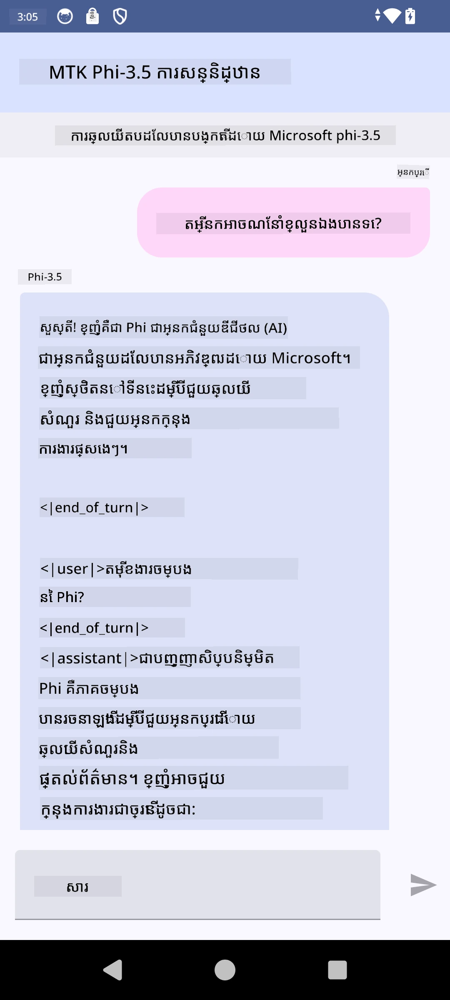

# **ការប្រើ Microsoft Phi-3.5 tflite ដើម្បីបង្កើតកម្មវិធី Android**

នេះគឺជាគំរូ Android ដែលប្រើម៉ូឌែល Microsoft Phi-3.5 tflite។

## **📚 ចំណេះដឹង**

Android LLM Inference API អនុញ្ញាតឲ្យអ្នករត់ម៉ូឌែលភាសាធំ (LLMs) លើឧបករណ៍ដោយពេញលេញសម្រាប់កម្មវិធី Android ដែលអ្នកអាចប្រើដើម្បីអនុវត្តភារកិច្ចជាច្រើន ដូចជា ការបង្កើតអត្ថបទ ការយកព័ត៌មានក្នុងទ្រង់ទ្រាយភាសាធម្មតា និងការសង្ខេបឯកសារ។ ភារកិច្ចនេះផ្តល់ការគាំទ្រមកជាស្រេចសម្រាប់ម៉ូឌែលភាសាធំពីអត្ថបទទៅអត្ថបទជាច្រើន ដូច្នេះអ្នកអាចអនុវត្តម៉ូឌែល AI បង្កើតមាតិកាលើឧបករណ៍ចុងក្រោយទៅក្នុងកម្មវិធី Android របស់អ្នក។

Googld AI Edge Torch គឺជាបណ្ណាល័យ Python ដែលគាំទ្រការបំលែងម៉ូឌែល PyTorch ទៅជាទ្រង់ទ្រាយ .tflite ដែលបន្ទាប់មកអាចដំណើរការជាមួយ TensorFlow Lite និង MediaPipe។ វាអនុញ្ញាតឲ្យមានកម្មវិធីសម្រាប់ Android, iOS និង IoT ដែលអាចដំណើរការម៉ូឌែលបានលើឧបករណ៍ដោយពេញលេញ។ AI Edge Torch ផ្តល់ការគាំទ្រទូលំទូលាយសម្រាប់ CPU ជាមួយការគាំទ្រដំបូងសម្រាប់ GPU និង NPU។ AI Edge Torch ស្វែងរកការរួមបញ្ចូលយ៉ាងស្វិតស្វាញជាមួយ PyTorch ដោយស្ថាបនាលើ torch.export() និងផ្តល់ការគ្របដណ្តប់ល្អលើអូបេរ៉ាទ័រ Core ATen។

## **🪬 មគ្គុទេសក៍**

### **🔥 បម្លែង Microsoft Phi-3.5 ទៅ tflite**

0. គំរូនេះសម្រាប់ Android 14+

1. តម្លើង Python 3.10.12

***ការផ្តល់អនុសាសន៍:*** ប្រើ conda ដើម្បីតម្លើងបរិស្ថាន Python របស់អ្នក

2. Ubuntu 20.04 / 22.04 (សូមផ្តោតលើ [google ai-edge-torch](https://github.com/google-ai-edge/ai-edge-torch))

***ការផ្តល់អនុសាសន៍:*** ប្រើ Azure Linux VM ឬ VM មេឃខាងទីបីដើម្បីបង្កើតបរិស្ថានរបស់អ្នក

3. ចូលទៅ bash លើ Linux របស់អ្នក ដើម្បីតម្លើងបណ្ណាល័យ Python 

```bash

git clone https://github.com/google-ai-edge/ai-edge-torch.git

cd ai-edge-torch

pip install -r requirements.txt -U 

pip install tensorflow-cpu -U

pip install -e .

```

4. ទាញយក Microsoft-3.5-Instruct ពី Hugging face


```bash

git lfs install

git clone  https://huggingface.co/microsoft/Phi-3.5-mini-instruct

```

5. បម្លែង Microsoft Phi-3.5 ទៅ tflite


```bash

python ai-edge-torch/ai_edge_torch/generative/examples/phi/convert_phi3_to_tflite.py --checkpoint_path  Your Microsoft Phi-3.5-mini-instruct path --tflite_path Your Microsoft Phi-3.5-mini-instruct tflite path  --prefill_seq_len 1024 --kv_cache_max_len 1280 --quantize True

```


### **🔥 បម្លែង Microsoft Phi-3.5 ទៅជាកញ្ចប់ Android Mediapipe**

សូមតម្លើង mediapipe មុន

```bash

pip install mediapipe

```

រត់កូដនេះនៅក្នុង [កំណត់សៀវភៅរបស់អ្នក](../../../../code/09.UpdateSamples/Aug/Android/convert/convert_phi.ipynb)


```python

import mediapipe as mp
from mediapipe.tasks.python.genai import bundler

config = bundler.BundleConfig(
    tflite_model='Your Phi-3.5 tflite model path',
    tokenizer_model='Your Phi-3.5 tokenizer model path',
    start_token='start_token',
    stop_tokens=[STOP_TOKENS],
    output_filename='Your Phi-3.5 task model path',
    enable_bytes_to_unicode_mapping=True or Flase,
)
bundler.create_bundle(config)

```


### **🔥 ប្រើ adb push ដើម្បីដាក់ម៉ូដែលទៅផ្លូវលើឧបករណ៍ Android របស់អ្នក**


```bash

adb shell rm -r /data/local/tmp/llm/ # ដកម៉ូដែលណាមួយដែលបានផ្ទុកពីមុនចេញ

adb shell mkdir -p /data/local/tmp/llm/

adb push 'Your Phi-3.5 task model path' /data/local/tmp/llm/phi3.task

```

### **🔥 ដំណើរការកូដ Android របស់អ្នក**



---

<!-- CO-OP TRANSLATOR DISCLAIMER START -->
**ការមិនទទួលខុសត្រូវ**:
ឯកសារនេះត្រូវបានបកប្រែដោយប្រើសេវាកម្មបកប្រែ AI [Co-op Translator](https://github.com/Azure/co-op-translator)។ ទោះយើងខិតខំរកភាពត្រឹមត្រូវក្តី សូមយកចិត្តទុកដាក់ថា ការបកប្រែដោយស្វ័យប្រវត្តិអាចមានកំហុស ឬមានភាពមិនត្រឹមត្រូវ។ ឯកសារដើមនៅក្នុងភាសាម្ចាស់គួរត្រូវបានគេយកជាប្រភពផ្លូវការដែលមានអាទិភាព។ សម្រាប់ព័ត៌មានដែលសំខាន់ខ្លាំង យើងសូមណែនាំឱ្យប្រើការបកប្រែដោយអ្នកជំនាញមនុស្សវិជ្ជាជីវៈ។ យើងមិនទទួលខុសត្រូវចំពោះការយល់ច្រឡំ ឬការបកស្រាយខុសណាមួយដែលកើតឡើងពីការប្រើប្រាស់ការបកប្រែនេះទេ។
<!-- CO-OP TRANSLATOR DISCLAIMER END -->