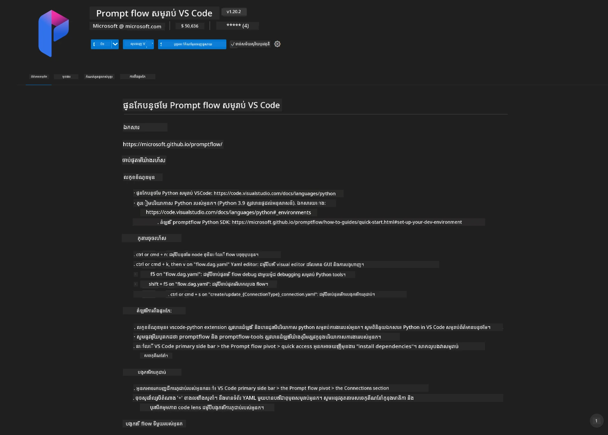
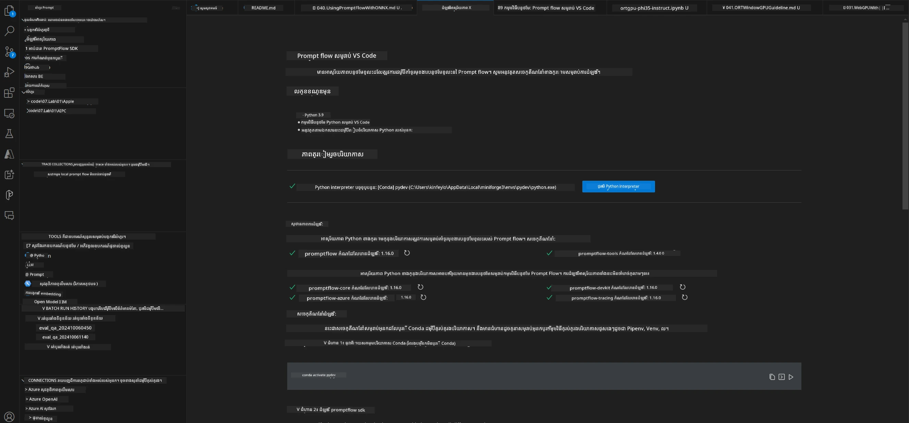
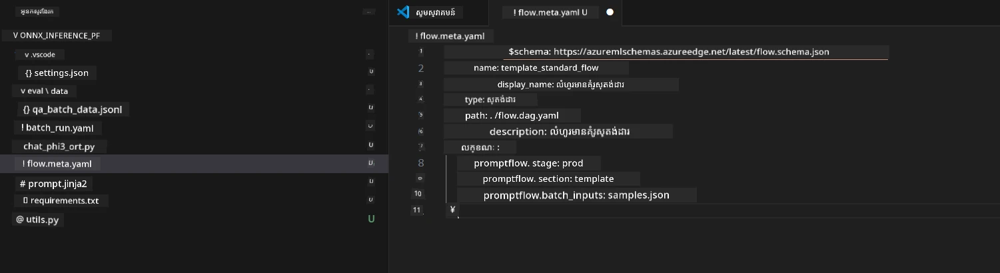
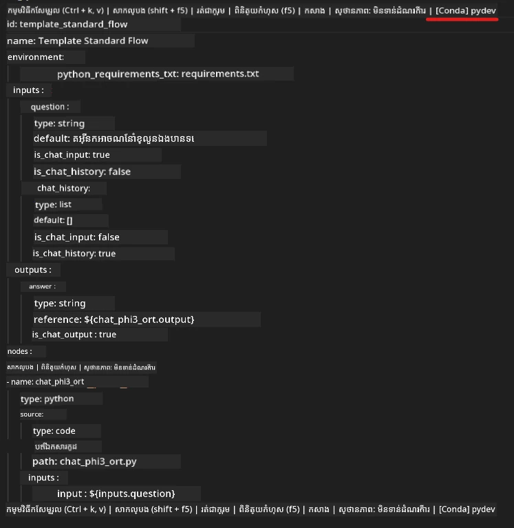
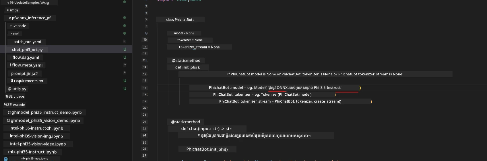
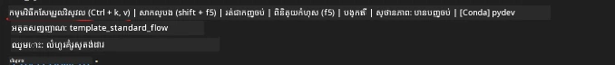
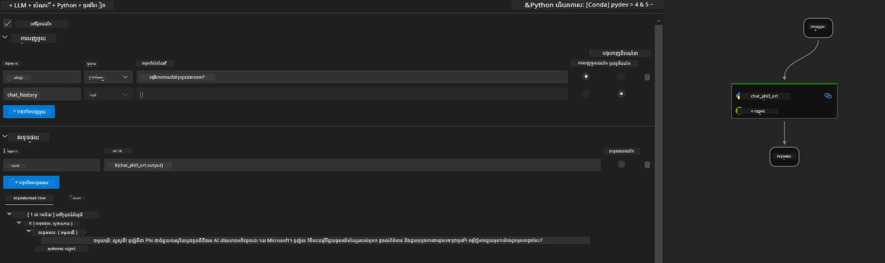
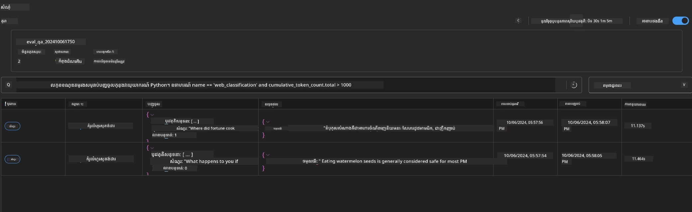

# ការប្រើ GPU លើ Windows ដើម្បីបង្កើតដំណោះស្រាយ Prompt flow ជាមួយ Phi-3.5-Instruct ONNX 

ឯកសារ​ខាងក្រោម​គឺជាឧទាហរណ៍ពីរបៀប​ប្រើ PromptFlow ជាមួយ ONNX (Open Neural Network Exchange) សម្រាប់អភិវឌ្ឍកម្មវិធី AI ដែលមូលដ្ឋានលើម៉ូដែល Phi-3។

PromptFlow គឺជាស៊ុមឧបករណ៍អភិវឌ្ឍន៍ ដែលបានអភិរក្សឡើងដើម្បីសម្រួលដំណើរការអភិវឌ្ឍពីដើមដល់ចប់ នៃកម្មវិធី AI ដែលផ្អែកលើ LLM (Large Language Model) ចាប់ពីការគូរគំនិត និងការសម្លើមគំរូ រហូតដល់ការធ្វើតេស្ត និងការវាយតម្លៃ។

ដោយការរួមបញ្ចូល PromptFlow ជាមួយ ONNX អ្នកអភិវឌ្ឍន៍អាចៈ

- កែលម្អសមត្ថភាពម៉ូដែល: ប្រើ ONNX សម្រាប់ inference និង deployment ឱ្យមានប្រសិទ្ធភាព។
- ធ្វើឲ្យការអភិវឌ្ឍងាយស្រួល: ប្រើ PromptFlow ដើម្បីគ្រប់គ្រងលំហូរការងារ និងស្វ័យប្រវត្តិការងារដែលធ្វើរៀងរាល់។
- កែលម្អការសហការ: ធ្វើឲ្យមានការសហការល្អប្រសើររវាងសមាជិកក្រុម ដោយផ្តល់បរិយាកាសអភិវឌ្ឍតែមួយ។

**Prompt flow** គឺជា​ស៊ុមឧបករណ៍អភិវឌ្ឍដែលបានរចនាឡើងដើម្បីសម្រួលដំណើរការអភិវឌ្ឍពីដើមដល់ចប់ នៃកម្មវិធី AI ដែលផ្អែកលើ LLM ដូចជា ideation, prototyping, testing, evaluation ទៅដល់ production deployment និង monitoring។ វាធ្វើឲ្យការរចនាប័ណ្ណ prompt งាយស្រួលជាងមុន និងអនុញ្ញាតឱ្យអ្នកសាងសង់កម្មវិធី LLM ដោយមានគុណភាពសម្រាប់ផលិតកម្ម។

Prompt flow អាចភ្ជាប់ទៅកាន់ OpenAI, Azure OpenAI Service និងម៉ូដែលដែលអាចប្ដូរបាន (Huggingface, local LLM/SLM)។ យើងមានគម្រោងដាក់ចេញម៉ូដែល ONNX ដែលបាន quantize របស់ Phi-3.5 ដោយសំដៅលើកម្មវិធីមូលដ្ឋានក្នុងតំបន់។ Prompt flow អាចជួយយើងផែនការជាងល្អសម្រាប់អាជីវកម្ម និងបញ្ចប់ដំណោះស្រាយក្នុងស្រុកដែលផ្អែកលើ Phi-3.5។ ក្នុងឧទាហរណ៍នេះ យើងនឹងបុណ្យការភ្ជាប់បណ្ណាល័យ ONNX Runtime GenAI ដើម្បីបញ្ចប់ដំណោះស្រាយ Prompt flow ដែលផ្អែកលើ Windows GPU។

## **Installation**

### **ONNX Runtime GenAI for Windows GPU**

អានណែនាំនេះដើម្បីកំណត់ ONNX Runtime GenAI សម្រាប់ Windows GPU  [ចុចទីនេះ](./ORTWindowGPUGuideline.md)

### **Set up Prompt flow in VSCode**

1. តម្លើង Prompt flow VS Code Extension



2. បន្ទាប់ពីបានដំឡើង Prompt flow VS Code Extension，ចុចលើ extension，ហើយជ្រើស **Installation dependencies** តាមណែនាំនេះដើម្បីដំឡើង Prompt flow SDK ក្នុង env របស់អ្នក



3. ទាញយក [កូដគំរូ](../../../../../../code/09.UpdateSamples/Aug/pf/onnx_inference_pf) ហើយប្រើ VS Code ដើម្បីបើកគំរូនេះ



4. បើក **flow.dag.yaml** ដើម្បីជ្រើស Python env របស់អ្នក



   បើក **chat_phi3_ort.py** ដើម្បីផ្លាស់ទីទីតាំងម៉ូឌែល Phi-3.5-instruct ONNX របស់អ្នក



5. រត់ prompt flow ដើម្បីធ្វើតេស្ត

បើក **flow.dag.yaml** ហើយចុច visual editor



បន្ទាប់ពីចុចនេះ，រត់វាដើម្បីសាកល្បង



1. អ្នកអាចរត់ជាបាច់ (batch) ក្នុង terminal ដើម្បីពិនិត្យលទ្ធផលបន្ថែម


```bash

pf run create --file batch_run.yaml --stream --name 'Your eval qa name'    

```

អ្នកអាចពិនិត្យលទ្ធផល​នៅក្នុងកម្មវិធីរុករកលំនាំដើមរបស់អ្នក




---

<!-- CO-OP TRANSLATOR DISCLAIMER START -->
**ការបដិសេធ**:
ឯកសារនេះត្រូវបានបកប្រែដោយប្រើសេវាកម្មបកប្រែ AI [Co-op Translator](https://github.com/Azure/co-op-translator). ទោះបីយើងខិតខំរកភាពត្រឹមត្រូវក៏ដោយ សូមយកចិត្តទុកដាក់ថាការបកប្រែដោយស្វ័យប្រវត្តិអាចមានកំហុស ឬភាពមិនត្រឹមត្រូវ។ ឯកសារដើមនៅក្នុងភាសាគោលគួរត្រូវបានចាត់ទុកថាជាប្រភពផ្លូវការ។ សម្រាប់ព័ត៌មានសំខាន់ៗ យើងសូមផ្តល់អភិបាលកម្មឬអនុសាសន៍ឲ្យធ្វើការបកប្រែដោយអ្នកបកប្រែវិជ្ជាជីវៈជាមនុស្ស។ យើងមិនទទួលខុសត្រូវចំពោះការយល់ច្រឡំនិងការបកសំដែងមិនបានត្រឹមត្រូវណាមួយដែលកើតឡើងពីការប្រើប្រាស់ការបកប្រែនេះ។
<!-- CO-OP TRANSLATOR DISCLAIMER END -->