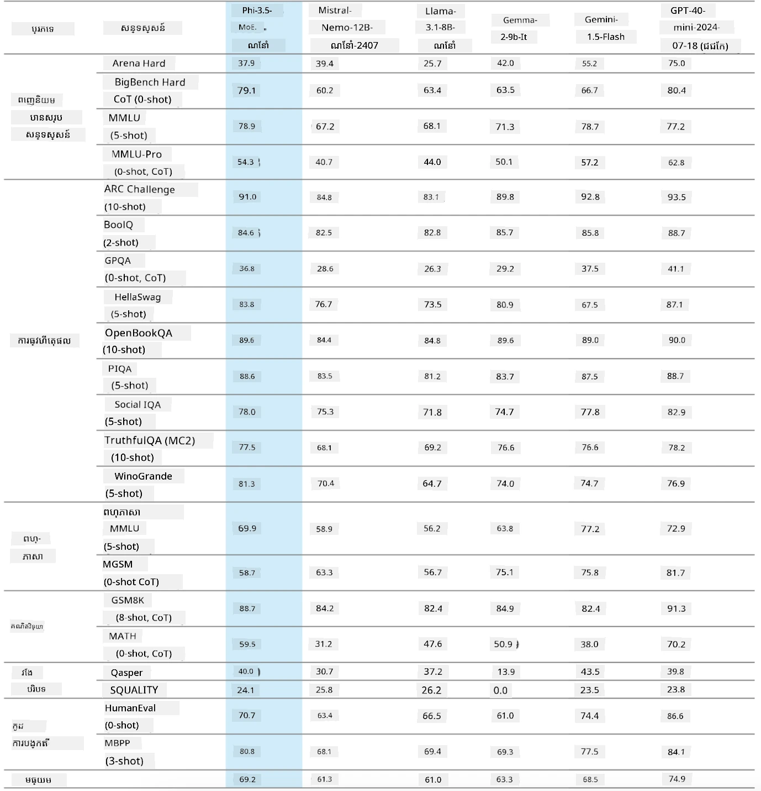
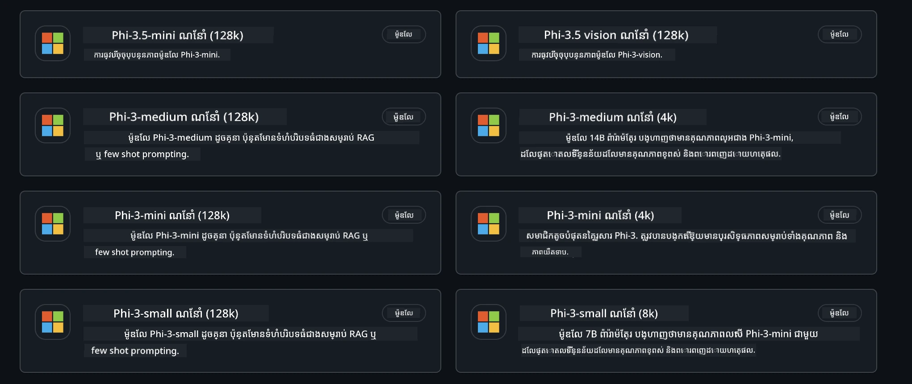
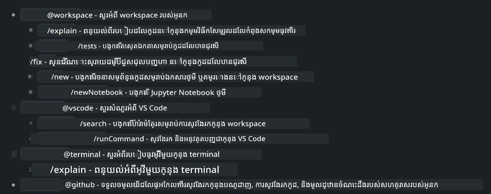
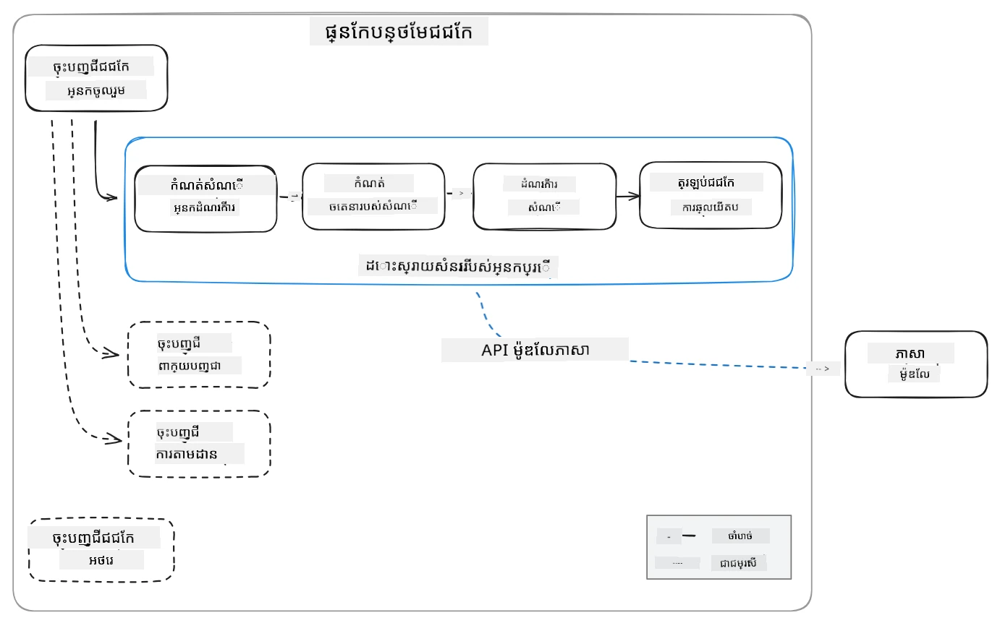
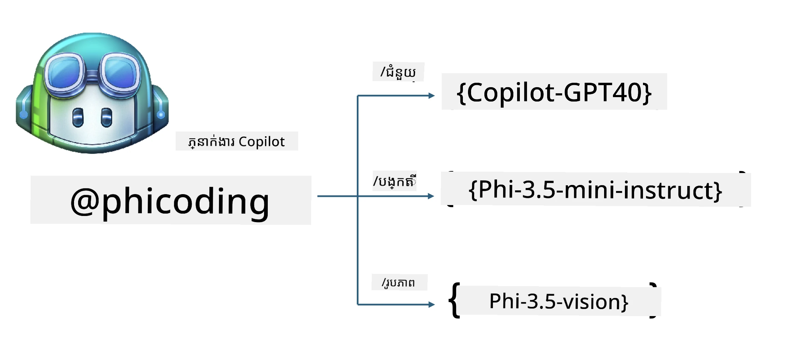
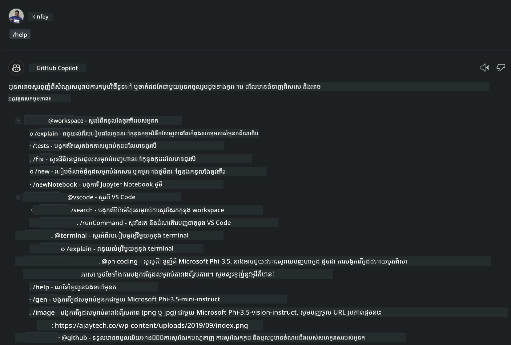
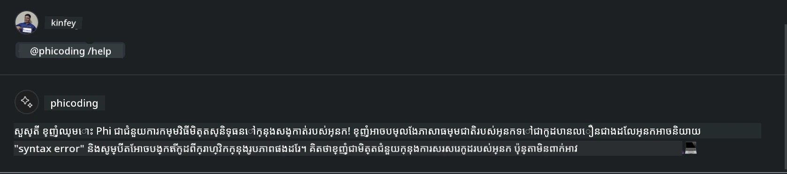
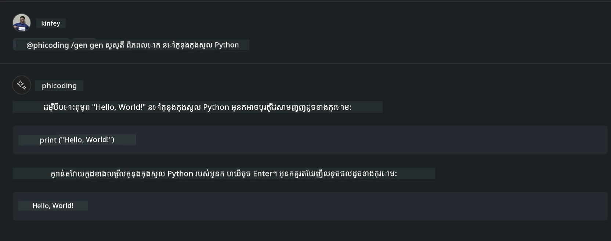
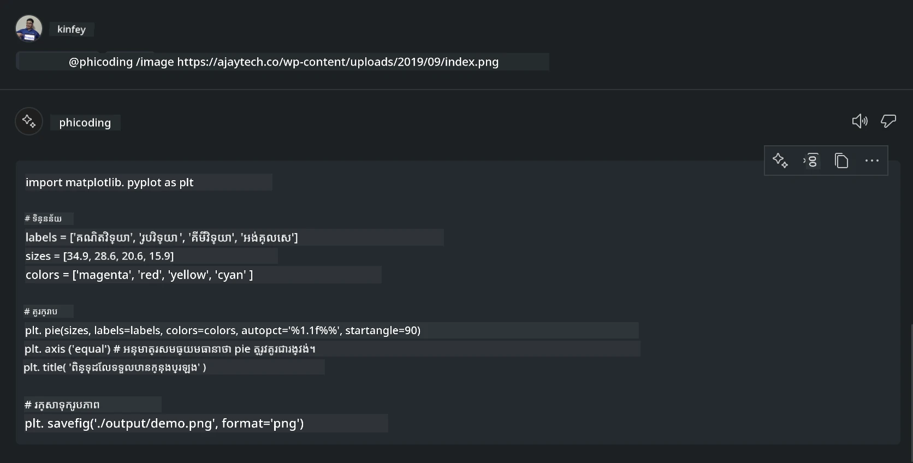

# **បង្កើតភ្នាក់ងារ Visual Studio Code Chat Copilot របស់អ្នកដោយប្រើ Phi-3.5 នៃ GitHub Models**

តើអ្នកកំពុងប្រើ Visual Studio Code Copilot មែនទេ? ជាពិសេសនៅក្នុង Chat អ្នកអាចប្រើភ្នាក់ងារផ្សេងៗដើម្បីបង្កើនសមត្ថភាពក្នុងការបង្កើត សរសេរ និងថែរក្សាគម្រោងនៅក្នុង Visual Studio Code។ Visual Studio Code ផ្ដល់ API ដែលអនុញ្ញាតឱ្យក្រុមហ៊ុន និងបុគ្គលបង្កើតភ្នាក់ងារផ្សេងៗដែលផ្អែកលើអាជីវកម្មរបស់ពួកគេ ដើម្បីពង្រីកសមត្ថភាពក្នុងវិស័យប្តិចប្ដៅផ្សេងៗ។ នៅក្នុងអត្ថបទនេះ យើងនឹងផ្តោតលើ **Phi-3.5-mini-instruct (128k)** និង **Phi-3.5-vision-instruct (128k)** របស់ GitHub Models ដើម្បីបង្កើតភ្នាក់ងារ Visual Studio Code របស់អ្នក។

## **អំពី Phi-3.5 លើ GitHub Models**

យើងជ្រាបថា Phi-3/3.5-mini-instruct ក្នុងក្រុម Phi-3/3.5 មានសមត្ថភាពយល់ដឹង និងបង្កើតកូដខ្លាំង ហើយមានអធិការសិទ្ធិលើ Gemma-2-9b និង Mistral-Nemo-12B-instruct-2407។



ម៉ូដែល GitHub ថ្មីៗបានផ្ដល់ការចូលដំណើរការ Phi-3.5-mini-instruct (128k) និង Phi-3.5-vision-instruct (128k)។ អ្នកអភិវឌ្ឍអាចចូលដំណើរការពួកវាមាតាម OpenAI SDK, Azure AI Inference SDK, និង REST API។



***ចំណាំ:*** ណែនាំឱ្យប្រើ Azure AI Inference SDK នៅទីនេះ ពីព្រោះវាអាចប្តូរជាមួយ Azure Model Catalog ក្នុងបរិបទផលិតកម្មបានល្អជាង

ខាងក្រោមជាផលលទ្ធផលនៃ **Phi-3.5-mini-instruct (128k)** និង **Phi-3.5-vision-instruct (128k)** ក្នុងឈុតសេណារីយ៉ូការបង្កើតកូដ បន្ទាប់ពីដាក់ភ្ជាប់ជាមួយ GitHub Models ហើយក៏ឆ្លpreparedសម្រាប់ឧទាហរណ៍ដូចខាងក្រោម

**Demo: GitHub Models Phi-3.5-mini-instruct (128k) ដើម្បីបង្កើតកូដពី Prompt** ([ចុចតំណនេះ](../../../../code/09.UpdateSamples/Aug/ghmodel_phi35_instruct_demo.ipynb))

**Demo: GitHub Models Phi-3.5-vision-instruct (128k) ដើម្បីបង្កើតកូដពីរូបភាព** ([ចុចតំណនេះ](../../../../code/09.UpdateSamples/Aug/ghmodel_phi35_vision_demo.ipynb))


## **អំពី GitHub Copilot Chat Agent**

GitHub Copilot Chat Agent អាចបញ្ចប់កាតព្វកិច្ចដូចជា ក្នុងសេណារីយ៉ូគំរោងផ្សេងៗដោយផ្អែកលើកូដ។ ប្រព័ន្ធមានភ្នាក់ងារ​បួនប្រភេទ: workspace, github, terminal, vscode



ដោយបន្ថែមឈ្មោះភ្នាក់ងារជាមួយ ‘@’ អ្នកអាចបញ្ចប់ការងារត្រូវបានភ្ជាប់បានយ៉ាងលឿន សម្រាប់សហគ្រាស ប្រសិនបើអ្នកបន្ថែមមាតិកាសម្រាប់អាជីវកម្មរបស់អ្នកដូចជា តម្រូវការ កូដ ស្បក្ថានតេស្ត និងការបញ្ជាក់ផ្សាយចេញ អ្នកអាចមានមុខងារលឿនឯកជនសម្រាប់សហគ្រាសដោយផ្អែកលើ GitHub Copilot។

Visua Studio Code Chat Agent ឥឡូវនេះបានចេញផ្សាយ API ជារដ្ឋប្រហែល ដើម្បីអនុញ្ញាតឱ្យសហគ្រាស ឬអ្នកអភិវឌ្ឍន៍សហគ្រាសអភិវឌ្ឍភ្នាក់ងារ ដើម្បីផ្អែកលើអេកូស៊ីស្តង់អាជីវកម្មកម្មវិធីផ្សេងៗ។ ដោយផ្អែកលើវិធានការអភិវឌ្ឍន៍ Visual Studio Code Extension Development អ្នកអាចចូលដំណើរការជាសង្វាក់ដល់ចំណុចប្រទាក់ Visual Studio Code Chat Agent API បានយ៉ាងងាយស្រ្តី។ យើងអាចអភិវឌ្ឍបានដោយផ្អែកលើដំណើរការ​នេះ



សេណារីយ៉ូអភិវឌ្ឍអាចគាំទ្រការចូលដំណើរការ API ម៉ូឌែលភាគីទីបី (ដូចជា GitHub Models, Azure Model Catalog, និងសេវាកម្មដែលបង្កើតដោយខ្លួនឯងផ្អែកលើម៉ូឌែលសូម្បី) ហើយក៏អាចប្រើម៉ូឌែល gpt-35-turbo, gpt-4, និង gpt-4o ដែលផ្ដល់ដោយ GitHub Copilot។

## **បន្ថែមភ្នាក់ងារ @phicoding ដោយផ្អែកលើ Phi-3.5**

យើងព្យាយាមបញ្ចូលសមត្ថភាពកម្មវិធីនៃ Phi-3.5 ដើម្បីបំពេញការសរសេរកូដ កូដបង្កើតរូបភាព និងការងារផ្សេងទៀត។ បញ្ចប់ការបង្កើតភ្នាក់ងារមួយដែលផ្តោតជុំវិញ Phi-3.5 - @PHI ខាងក្រោមជាមុខងារមួយចំនួន

1. បង្កើតការណែនាំខ្លួនឯងដោយផ្អែកលើ GPT-4o ដែលផ្ដល់ដោយ GitHub Copilot តាមរយៈពាក្យបញ្ជា **@phicoding /help**

2. បង្កើតកូដសម្រាប់ភាសា​កម្មវិធីផ្សេងៗ ដោយផ្អែកលើ **Phi-3.5-mini-instruct (128k)** តាមរយៈពាក្យបញ្ជា **@phicoding /gen**

3. បង្កើតកូដដោយផ្អែកលើ **Phi-3.5-vision-instruct (128k)** និងបំពេញរូបភាព តាមរយៈពាក្យបញ្ជា **@phicoding /image**



## **ជំហានដែលទាក់ទង**

1. Install Visual Studio Code Extension development support using npm

```bash

npm install --global yo generator-code 

```
2. Create a Visual Studio Code Extension plugin (using Typescript development mode, named phiext)


```bash

yo code 

```

3. Open the created project and modify package.json. Here are the related instructions and configurations, as well as the configuration of GitHub Models. Note that you need to add your GitHub Models token here.


```json

{
  "name": "phiext",
  "displayName": "phiext",
  "description": "",
  "version": "0.0.1",
  "engines": {
    "vscode": "^1.93.0"
  },
  "categories": [
    "AI",
    "Chat"
  ],
  "activationEvents": [],
  "enabledApiProposals": [
      "chatVariableResolver"
  ],
  "main": "./dist/extension.js",
  "contributes": {
    "chatParticipants": [
        {
            "id": "chat.phicoding",
            "name": "phicoding",
            "description": "Hey! I am Microsoft Phi-3.5, She can help me with coding problems, such as generation code with your natural language, or even generation code about chart from images. Just ask me anything!",
            "isSticky": true,
            "commands": [
                {
                    "name": "help",
                    "description": "Introduce myself to you"
                },
                {
                    "name": "gen",
                    "description": "Generate code for you with Microsoft Phi-3.5-mini-instruct"
                },
                {
                    "name": "image",
                    "description": "Generate code for chart from image(png or jpg) with Microsoft Phi-3.5-vision-instruct, please add image url like this : https://ajaytech.co/wp-content/uploads/2019/09/index.png"
                }
            ]
        }
    ],
    "commands": [
        {
            "command": "phicoding.namesInEditor",
            "title": "Use Microsoft Phi 3.5 in Editor"
        }
    ],
    "configuration": {
      "type": "object",
      "title": "githubmodels",
      "properties": {
        "githubmodels.endpoint": {
          "type": "string",
          "default": "https://models.inference.ai.azure.com",
          "description": "Your GitHub Models Endpoint",
          "order": 0
        },
        "githubmodels.api_key": {
          "type": "string",
          "default": "Your GitHub Models Token",
          "description": "Your GitHub Models Token",
          "order": 1
        },
        "githubmodels.phi35instruct": {
          "type": "string",
          "default": "Phi-3.5-mini-instruct",
          "description": "Your Phi-35-Instruct Model",
          "order": 2
        },
        "githubmodels.phi35vision": {
          "type": "string",
          "default": "Phi-3.5-vision-instruct",
          "description": "Your Phi-35-Vision Model",
          "order": 3
        }
      }
    }
  },
  "scripts": {
    "vscode:prepublish": "npm run package",
    "compile": "webpack",
    "watch": "webpack --watch",
    "package": "webpack --mode production --devtool hidden-source-map",
    "compile-tests": "tsc -p . --outDir out",
    "watch-tests": "tsc -p . -w --outDir out",
    "pretest": "npm run compile-tests && npm run compile && npm run lint",
    "lint": "eslint src",
    "test": "vscode-test"
  },
  "devDependencies": {
    "@types/vscode": "^1.93.0",
    "@types/mocha": "^10.0.7",
    "@types/node": "20.x",
    "@typescript-eslint/eslint-plugin": "^8.3.0",
    "@typescript-eslint/parser": "^8.3.0",
    "eslint": "^9.9.1",
    "typescript": "^5.5.4",
    "ts-loader": "^9.5.1",
    "webpack": "^5.94.0",
    "webpack-cli": "^5.1.4",
    "@vscode/test-cli": "^0.0.10",
    "@vscode/test-electron": "^2.4.1"
  },
  "dependencies": {
    "@types/node-fetch": "^2.6.11",
    "node-fetch": "^3.3.2",
    "@azure-rest/ai-inference": "latest",
    "@azure/core-auth": "latest",
    "@azure/core-sse": "latest"
  }
}


```

4. កែប្រែ src/extension.ts


```typescript

// ម៉ូឌុល 'vscode' មាន API សម្រាប់ពង្រីករបស់ VS Code
// នាំចូលម៉ូឌុល និងយោងវាជាឈ្មោះជំនួស vscode ក្នុងកូដខាងក្រោម
import * as vscode from 'vscode';
import ModelClient from "@azure-rest/ai-inference";
import { AzureKeyCredential } from "@azure/core-auth";


interface IPhiChatResult extends vscode.ChatResult {
    metadata: {
        command: string;
    };
}


const MODEL_SELECTOR: vscode.LanguageModelChatSelector = { vendor: 'copilot', family: 'gpt-4o' };

function isValidImageUrl(url: string): boolean {
    const regex = /^(https?:\/\/.*\.(?:png|jpg))$/i;
    return regex.test(url);
}
  

// វិធីសាស្ត្រនេះត្រូវបានហៅនៅពេលផ្នែកបន្ថែមរបស់អ្នកត្រូវបានចាប់ផ្ដើម
// ផ្នែកបន្ថែមរបស់អ្នកត្រូវបានចាប់ផ្ដើមជាលើកដំបូងតែម្ដង នៅពេលពាក្យបញ្ជាត្រូវបានអនុវត្ត
export function activate(context: vscode.ExtensionContext) {

    const codinghandler: vscode.ChatRequestHandler = async (request: vscode.ChatRequest, context: vscode.ChatContext, stream: vscode.ChatResponseStream, token: vscode.CancellationToken): Promise<IPhiChatResult> => {


        const config : any = vscode.workspace.getConfiguration('githubmodels');
        const endPoint: string = config.get('endpoint');
        const apiKey: string = config.get('api_key');
        const phi35instruct: string = config.get('phi35instruct');
        const phi35vision: string = config.get('phi35vision');
        
        if (request.command === 'help') {

            const content = "Welcome to Coding assistant with Microsoft Phi-3.5"; 
            stream.progress(content);


            try {
                const [model] = await vscode.lm.selectChatModels(MODEL_SELECTOR);
                if (model) {
                    const messages = [
                        vscode.LanguageModelChatMessage.User("Please help me express this content in a humorous way: I am a programming assistant who can help you convert natural language into code and generate code based on the charts in the images. output format like this : Hey I am Phi ......")
                    ];
                    const chatResponse = await model.sendRequest(messages, {}, token);
                    for await (const fragment of chatResponse.text) {
                        stream.markdown(fragment);
                    }
                }
            } catch(err) {
                console.log(err);
            }


            return { metadata: { command: 'help' } };

        }

        
        if (request.command === 'gen') {

            const content = "Welcome to use phi-3.5 to generate code";

            stream.progress(content);

            const client = new ModelClient(endPoint, new AzureKeyCredential(apiKey));

            const response = await client.path("/chat/completions").post({
              body: {
                messages: [
                  { role:"system", content: "You are a coding assistant.Help answer all code generation questions." },
                  { role:"user", content: request.prompt }
                ],
                model: phi35instruct,
                temperature: 0.4,
                max_tokens: 1000,
                top_p: 1.
              }
            });

            stream.markdown(response.body.choices[0].message.content);

            return { metadata: { command: 'gen' } };

        }


        
        if (request.command === 'image') {


            const content = "Welcome to use phi-3.5 to generate code from image(png or jpg),image url like this:https://ajaytech.co/wp-content/uploads/2019/09/index.png";

            stream.progress(content);

            if (!isValidImageUrl(request.prompt)) {
                stream.markdown('Please provide a valid image URL');
                return { metadata: { command: 'image' } };
            }
            else
            {

                const client = new ModelClient(endPoint, new AzureKeyCredential(apiKey));
    
                const response = await client.path("/chat/completions").post({
                    body: {
                      messages: [
                        { role: "system", content: "You are a helpful assistant that describes images in details." },
                        { role: "user", content: [
                            { type: "text", text: "Please generate code according to the chart in the picture according to the following requirements\n1. Keep all information in the chart, including data and text\n2. Do not generate additional information that is not included in the chart\n3. Please extract data from the picture, do not generate it from csv\n4. Please save the regenerated chart as a chart and save it to ./output/demo.png"},
                            { type: "image_url", image_url: {url: request.prompt}
                            }
                          ]
                        }
                      ],
                      model: phi35vision,
                      temperature: 0.4,
                      max_tokens: 2048,
                      top_p: 1.
                    }
                  });
    
                
                stream.markdown(response.body.choices[0].message.content);
    
                return { metadata: { command: 'image' } };
            }


        }


        return { metadata: { command: '' } };
    };


    const phi_ext = vscode.chat.createChatParticipant("chat.phicoding", codinghandler);

    phi_ext.iconPath = new vscode.ThemeIcon('sparkle');


    phi_ext.followupProvider = {
        provideFollowups(result: IPhiChatResult, context: vscode.ChatContext, token: vscode.CancellationToken) {
            return [{
                prompt: 'Let us coding with Phi-3.5 😋😋😋😋',
                label: vscode.l10n.t('Enjoy coding with Phi-3.5'),
                command: 'help'
            } satisfies vscode.ChatFollowup];
        }
    };

    context.subscriptions.push(phi_ext);
}

// វិធីសាស្ត្រនេះត្រូវបានហៅនៅពេលផ្នែកបន្ថែមរបស់អ្នកត្រូវបានផ្អាក
export function deactivate() {}


```

6. រត់

***/help***



***@phicoding /help***



***@phicoding /gen***




***@phicoding /image***




អ្នកអាចទាញយកកូដគំរូ៖[ចុច](../../../../../../code/09.UpdateSamples/Aug/vscode)

## **ធនធាន**

1. ចុះឈ្មោះសម្រាប់ GitHub Models [https://gh.io/models]

2. រៀន Visual Studio Code Extension Development [https://code.visualstudio.com/api/get-started/your-first-extension]

3. រៀនអំពី Visual Studio Code Coilot Chat API [https://code.visualstudio.com/api/extension-guides/chat]

---

<!-- CO-OP TRANSLATOR DISCLAIMER START -->
**Disclaimer**:
ឯកសារនេះត្រូវបានបកប្រែដោយប្រើសេវាបកប្រែAI [Co-op Translator](https://github.com/Azure/co-op-translator)। ខណៈពេលដែលយើងខំប្រឹងក្នុងការធ្វើឱ្យបានត្រឹមត្រូវ សូមចំណាំថាការបកប្រែដោយស្វ័យប្រវត្តិអាចមានកំហុស ឬមិនត្រឹមត្រូវ។ ឯកសារដើមក្នុងភាសាដើមគួរត្រូវបានចាត់ទុកជាប្រភពដែលមានសុពលភាព។ សម្រាប់ព័ត៌មានដែលមានសារៈសំខាន់ សូមពិចារណាការបកប្រែដោយអ្នកបកប្រែវិជ្ជាជីវៈ។ យើងមិនទទួលខុសត្រូវចំពោះការយល់ច្រឡំ ឬការបកប្រែខុសៗណាមួយដែលកើតឡើងពីការប្រើប្រាស់ការបកប្រែនេះទេ។
<!-- CO-OP TRANSLATOR DISCLAIMER END -->