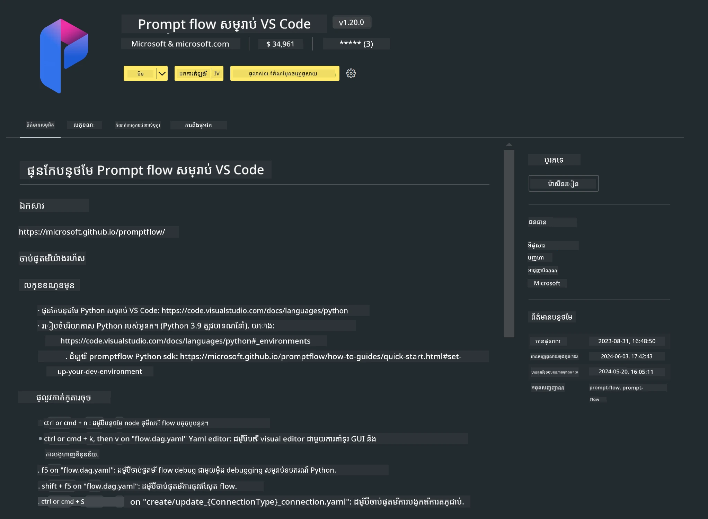

# **Lab 0 - ការដំឡើង**

When we enter the Lab, we need to configure the relevant environment :


### **1. Python 3.11+**

It is recommended to use miniforge to configure your Python environment 

To configure miniforge, please refer to [https://github.com/conda-forge/miniforge](https://github.com/conda-forge/miniforge)

After configuring miniforge, run the following command in Power Shell

```bash

conda create -n pyenv python==3.11.8 -y

conda activate pyenv

```


### **2. Install Prompt flow SDK**

In Lab 1, we use Prompt flow, so you need to configure the Prompt flow SDK.

```bash

pip install promptflow --upgrade

```

You can check promptflow sdk in this command


```bash

pf --version

```

### **3. Install Visual Studio Code Prompt flow Extension**




### **4. Intel NPU Acceleration Library**

Intel's new generation processors support NPU. If you want to use NPU to run LLMs / SLMs locally, you can use ***Intel NPU Acceleration Library*** . If you want to know more, you can read [https://github.com/microsoft/PhiCookBook/blob/main/md/01.Introduction/03/AIPC_Inference.md](https://github.com/microsoft/PhiCookBook/blob/main/md/01.Introduction/03/AIPC_Inference.md).

Install Intel NPU Acceleration Library in bash


```bash

pip install intel-npu-acceleration-library

```

***ចំណាំ***: សូមចំណាំថាបណ្ណាល័យនេះគាំទ្រក្នុង transformers ***4.40.2*** , សូមបញ្ជាក់កំណែ


### **5. Other Python Library**


create requirements.txt and add this content

```txt

notebook
numpy 
scipy 
scikit-learn 
matplotlib 
pandas 
pillow 
graphviz

```


### **6. Install NVM**

install nvm in Powershell 


```bash

winget install -e --id CoreyButler.NVMforWindows

```

install nodejs 18.20


```bash

nvm install 18.20.0

nvm use 18.20.0

```

### **7. Install Visual Studio Code Development Support**


```bash

npm install --global yo generator-code

```

Congratulations! You have successfully configured the SDK. Next, proceed to the hands-on steps.

---

<!-- CO-OP TRANSLATOR DISCLAIMER START -->
**Disclaimer**:
ឯកសារនេះត្រូវបានបកប្រែដោយប្រើសេវាកម្មបកប្រែ AI [Co-op Translator](https://github.com/Azure/co-op-translator)។ ខណៈពេលដែលយើងខិតខំក្នុងការធានាភាពត្រឹមត្រូវ សូមយកចិត្តទុកដាក់ថា ការបកប្រែដោយស្វ័យប្រវត្តិអាចមានកំហុស ឬមិនបានត្រឹមត្រូវ។ ឯកសារដើមក្នុងភាសាដើមគួរត្រូវបានចាត់ទុកថាជាប្រភពដែលគួរទុកចិត្ត។ សម្រាប់ព័ត៌មានសំខាន់ៗ យើងផ្តល់អនុសាសន៍ឱ្យប្រើការបកប្រែដោយអ្នកបកប្រែមនុស្សដែលមានវិជ្ជាជីវៈ។ យើងមិនទទួលខុសត្រូវចំពោះការយល់ច្រឡំ ឬការបកស្រាយខុសណាមួយដែលកើតឡើងពីការប្រើប្រាស់ការបកប្រែនេះទេ។
<!-- CO-OP TRANSLATOR DISCLAIMER END -->