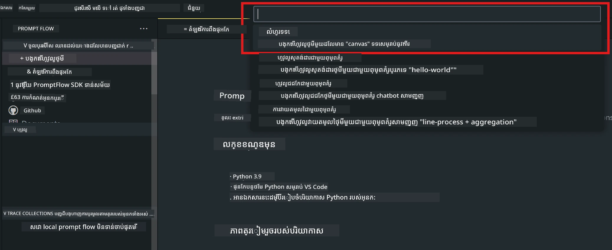
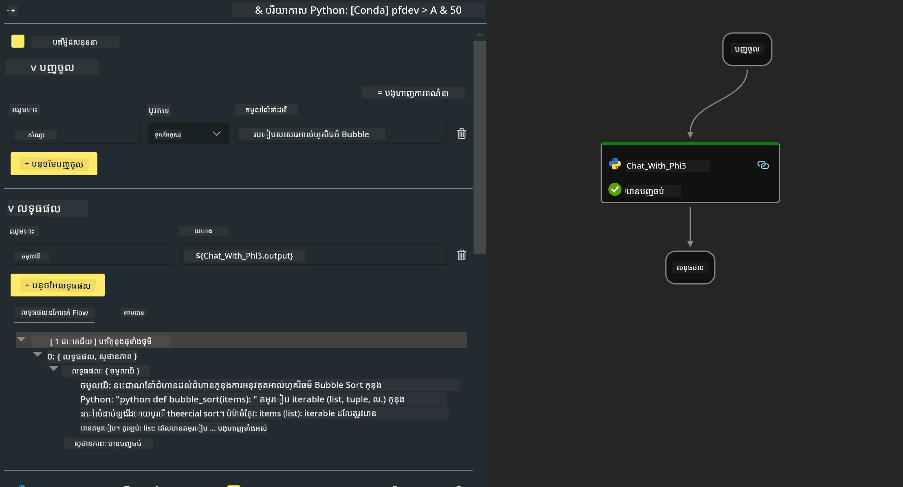

# **Lab 2 -  រត់ Prompt flow ជាមួយ Phi-3-mini ក្នុង AIPC**

## **Prompt flow គឺ​អ្វី?**

Prompt flow គឺជាកញ្ចប់ឧបករណ៍អភិវឌ្ឍន៍ដែលរៀបចំឡើងដើម្បីផ្លាស់ប្ដូរជំលោះដល់ដំណើរការអភិវឌ្ឍន៍ទាំងមូលសម្រាប់កម្មវិធី AI ដែលអាស្រ័យលើ LLM ពីការគិតគរការគំរូ ការសាកល្បង ការវាយតម្លៃ ដល់ការដាក់បញ្ចូលផលិតកម្ម និងការត្រួតពិនិត្យ។ វាធ្វើឱ្យការបច្ចេកវិទ្យាបង្កើត prompt ងាយស្រួលជាងមុន និងអនុញ្ញាតឱ្យអ្នកសាងសង់កម្មវិធី LLM ដែលមានគុណភាពសម្រាប់ផលិតកម្ម។

ជាមួយ Prompt flow អ្នកអាច៖

- បង្កើត flow ដែលភ្ជាប់ LLMs, prompts, កូដ Python និងឧបករណ៍ផ្សេងទៀតជា workflow ដែលអាចរត់បាន។

- ខកខាន និងធ្វើការកែសម្រួល flow របស់អ្នក ជាពិសេសការជួបប្រទៈជាមួយ LLMs បានយ៉ាងងាយស្រួល។

- វាយតម្លៃ flow របស់អ្នក គណនាម៉ែត្រិចគុណភាព និងការសម្តែងជាមួយ datasets ធំៗ។

- បញ្ចូលការសាកល្បង និងការវាយតម្លៃទៅក្នុងប្រព័ន្ធ CI/CD របស់អ្នក ដើម្បីធានាគុណភាពនៃ flow ។

- ចេញផ្សាយ flow ទៅកាន់ម៉ាស៊ីនបម្រើដែលអ្នកជ្រើស ឬបញ្ចូលទៅក្នុង codebase នៃកម្មវិធីរបស់អ្នកបានយ៉ាងងាយស្រួល។

- (ជាជម្រើស ប៉ុន្តែនៅសល់ណែនាំយ៉ាងខ្លាំង) សហការជាមួយក្រុមដោយប្រើកំណែ cloud នៃ Prompt flow នៅលើ Azure AI។

## **ការសង់ flow កូដសម្រាប់បង្កើតលទ្ធផលលើ Apple Silicon**

***កំណត់សម្គាល់*** ：ប្រសិនបើអ្នកមិនទាន់បញ្ចប់ការដំឡើងបរិយាកាស សូមចូលទៅកាន់ [Lab 0 -Installations](./01.Installations.md)

1. បើក Prompt flow Extension នៅក្នុង Visual Studio Code ហើយបង្កើត គម្រោង flow ទទេមួយ



2. បន្ថែមប៉ារ៉ាម៉ែត្រ Inputs និង Outputs ហើយបន្ថែម Python Code ជា flow ថ្មី




You can refer to this structure (flow.dag.yaml) to construct your flow

```yaml

inputs:
  prompt:
    type: string
    default: Write python code for Fibonacci serie. Please use markdown as output
outputs:
  result:
    type: string
    reference: ${gen_code_by_phi3.output}
nodes:
- name: gen_code_by_phi3
  type: python
  source:
    type: code
    path: gen_code_by_phi3.py
  inputs:
    prompt: ${inputs.prompt}


```

3. បម្លែងគណនា (Quantize) សម្រាប់ phi-3-mini

យើងសង្ឃឹមថានឹងអាចបញ្ជាលើ SLM លើឧបករណ៍មូលដ្ឋានបានល្អប្រសើរជាងមុន។ ជាទូទៅ យើងធ្វើការបម្លែងម៉ូដែល (quantize) ទៅជា INT4, FP16, FP32


```bash

python -m mlx_lm.convert --hf-path microsoft/Phi-3-mini-4k-instruct

```

**កំណត់សម្គាល់:** default folder is mlx_model 

4. ដាក់កូដនៅក្នុង ***Chat_With_Phi3.py***


```python


from promptflow import tool

from mlx_lm import load, generate


# ផ្នែកបញ្ចូលនឹងផ្លាស់ប្តូរតាមប៉ារ៉ាម៉ែត្រនៃមុខងារឧបករណ៍ បន្ទាប់ពីអ្នករក្សាទុកកូដ
# ការបន្ថែមប្រភេទទៅលើប៉ារ៉ាម៉ែត្រ និងតម្លៃដែលមុខងារត្រឡប់វិញ នឹងជួយប្រព័ន្ធបង្ហាញប្រភេទបានយ៉ាងត្រឹមត្រូវ
# សូមអាប់ដេតឈ្មោះ និងសញ្ញារ៉ូ(signature) នៃមុខងារ តាមតម្រូវការ
@tool
def my_python_tool(prompt: str) -> str:

    model_id = './mlx_model_phi3_mini'

    model, tokenizer = load(model_id)

    # <|user|>\nសរសេរកូដ Python សម្រាប់ស៊េរី Fibonacci។ សូមប្រើ Markdown ជាលទ្ធផល<|end|>\n<|assistant|>

    response = generate(model, tokenizer, prompt="<|user|>\n" + prompt  + "<|end|>\n<|assistant|>", max_tokens=2048, verbose=True)

    return response


```

4. អ្នកអាចសាកល្បង flow ពី Debug ឬ Run ដើម្បីពិនិត្យថាកូដបង្កើតធ្វើការបានត្រឹមត្រូវឬអត់


5. រត់ flow ជា development API នៅក្នុង terminal

```

pf flow serve --source ./ --port 8080 --host localhost   

```

អ្នកអាចសាកល្បងវា​នៅក្នុង Postman / Thunder Client


### **កំណត់សម្គាល់**

1. ការរត់ដំបូងនឹងយកពេលយូរ។ ត្រូវបានណែនាំឱ្យទាញយកម៉ូដែល phi-3 ពី Hugging face CLI។

2. ដើម្បីគិតទុកពីកម្លាំងកុំព្យូទ័រដែលមានកំណត់របស់ Intel NPU អាចនិយាយបានថា ត្រូវបានណែនាំឱ្យប្រើ Phi-3-mini-4k-instruct

3. យើងប្រើ Intel NPU Acceleration ដើម្បីធ្វើការបម្លែងទៅ INT4, ប៉ុន្តែប្រសិនបើអ្នករត់សេវាឡើងវិញ អ្នកត្រូវលុបថត cache និង nc_workshop។

## **ធនធាន**

1. រៀនអំពី Promptflow [https://microsoft.github.io/promptflow/](https://microsoft.github.io/promptflow/)

2. រៀនអំពី Intel NPU Acceleration [https://github.com/intel/intel-npu-acceleration-library](https://github.com/intel/intel-npu-acceleration-library)

3. គំរូកូដ - ទាញយក [Local NPU Agent Sample Code](../../../../../../../../../code/07.Lab/01/AIPC/local-npu-agent)

---

<!-- CO-OP TRANSLATOR DISCLAIMER START -->
**ការបដិសេធ**:
ឯកសារ​នេះ​ត្រូវបាន​បកប្រែ​ដោយ​ប្រើ​សេវាបកប្រែ AI [Co-op Translator](https://github.com/Azure/co-op-translator)។ ខណៈដែលយើងខិតខំដើម្បីភាពត្រឹមត្រូវ សូមចំណាំថា ការបកប្រែដោយស្វ័យប្រវត្តិអាចមានកំហុស ឬភាពមិនត្រឹមត្រូវ។ ឯកសារដើមក្នុងភាសាមាតុភាសាគួរត្រូវបានចាត់ទុកថាជាប្រភពផ្លូវការ។ សម្រាប់ព័ត៌មានសំខាន់ៗ យើងណែនាំឱ្យប្រើការបកប្រែដោយមនុស្សជំនាញវិជ្ជាជីវៈ។ យើងមិនទទួលខុសត្រូវចំពោះការយល់ច្រឡំ ឬការបកស្រាយខុសណាមួយដែលកើតឡើងពីការប្រើប្រាស់ការបកប្រែនេះទេ។
<!-- CO-OP TRANSLATOR DISCLAIMER END -->