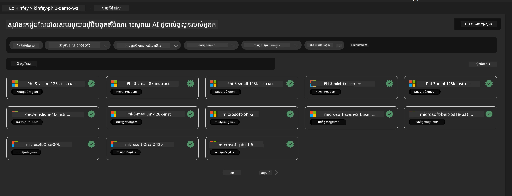
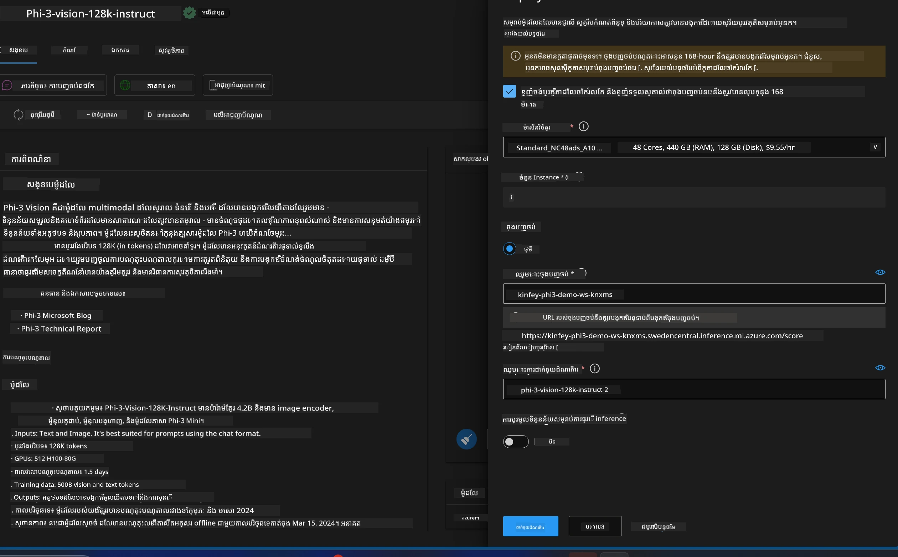
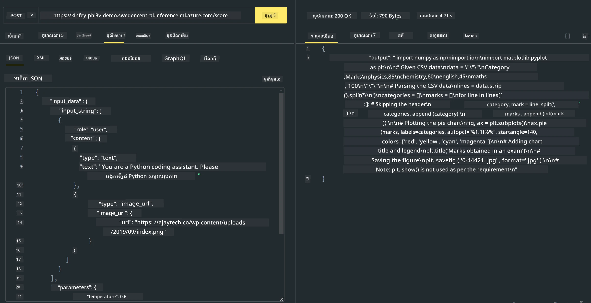

# **លាប 3 - ដាក់ចេញ Phi-3-vision លើ Azure Machine Learning Service**

យើងប្រើ NPU ដើម្បីបញ្ចប់ការដាក់ចេញផលិតកម្មនៃកូដក្នុងតំបន់ (local) ហើយបន្ទាប់មកយើងចង់បន្ថែមសមត្ថភាពក្នុងការ បញ្ចូល PHI-3-VISION តាមរយៈវា ដើម្បីបម្លែងរូបភាពទៅកូដ។

ក្នុងការណែនាំនេះ យើងអាចសាងសង់សេវា Phi-3 Vision ជា ម៉ូដែលជាសេវា លឿនៗ នៅក្នុង Azure Machine Learning Service។

***ចំណាំ***： Phi-3 Vision ត្រូវការកម្លាំងគណនា ដើម្បីបង្កើតមាតិកា ឱ្យបានលឿន។ យើងត្រូវការកម្លាំងគណនាពីពពកដើម្បីជួយឱ្យអនុវត្តបាននេះ។


### **1. បង្កើត Azure Machine Learning Service**

យើងត្រូវបង្កើត Azure Machine Learning Service នៅក្នុង Azure Portal។ ប្រសិនបើអ្នកចង់រៀនពីរបៀប សូមចូលទៅកាន់តំណនេះ [https://learn.microsoft.com/azure/machine-learning/quickstart-create-resources?view=azureml-api-2](https://learn.microsoft.com/azure/machine-learning/quickstart-create-resources?view=azureml-api-2)


### **2. ជ្រើស Phi-3 Vision ក្នុង Azure Machine Learning Service**




### **3. ដាក់ចេញ Phi-3-Vision លើ Azure**





### **4. សាកល្បង Endpoint ក្នុង Postman**





***ចំណាំ***

1. ប៉ារ៉ាម៉ែត្រ​ដែលត្រូវផ្ញើត្រូវរួមបញ្ចូល Authorization, azureml-model-deployment, និង Content-Type។ អ្នកត្រូវពិនិត្យព័ត៌មានដាក់ចេញ ដើម្បីទទួលបានវា។

2. ដើម្បីផ្ញើប៉ារ៉ាម៉ែត្រ Phi-3-Vision ត្រូវការផ្ញើតំណររូបភាព។ សូមយោងទៅវិធីសាស្រ្ត GPT-4-Vision សម្រាប់ផ្ញើប៉ារ៉ាម៉ែត្រដូចជា

```json

{
  "input_data":{
    "input_string":[
      {
        "role":"user",
        "content":[ 
          {
            "type": "text",
            "text": "You are a Python coding assistant.Please create Python code for image "
          },
          {
              "type": "image_url",
              "image_url": {
                "url": "https://ajaytech.co/wp-content/uploads/2019/09/index.png"
              }
          }
        ]
      }
    ],
    "parameters":{
          "temperature": 0.6,
          "top_p": 0.9,
          "do_sample": false,
          "max_new_tokens": 2048
    }
  }
}

```

3. ហៅ **/score** ដោយប្រើវិធីសាស្រ្ត Post

**អបអរសាទរ**！អ្នកបានបញ្ចប់ការដាក់ចេញ PHI-3-VISION ដោយលឿន និងបានសាកល្បងរបៀបប្រើរូបភាពដើម្បីបង្កើតកូដ។ បន្ទាប់មក យើងអាចសាងសង់កម្មវិធីដោយចងក្រងជាមួយ NPU និង ពពក។

---

<!-- CO-OP TRANSLATOR DISCLAIMER START -->
**Disclaimer**:
ឯកសារនេះត្រូវបានបកប្រែដោយប្រើសេវាកម្មបកប្រែដោយ AI [Co-op Translator](https://github.com/Azure/co-op-translator)។ ខណៈដែលយើងខិតខំសម្រាប់ភាពត្រឹមត្រូវ សូមយកចិត្តទុកដាក់ថា ការបកប្រែដោយស្វ័យប្រវត្តិនេះអាចមានកំហុស ឬព័ត៌មានមិនត្រឹមត្រូវ។ ឯកសារដើមក្នុងភាសាដើមគួរត្រូវបានគេចាត់ទុកថាជាប្រភពផ្លូវការ។ សម្រាប់ព័ត៌មានដ៏សំខាន់ យើងសូមណែនាំឲ្យមានការបកប្រែដោយអ្នកបកប្រែវិជ្ជាជីវៈ។ យើងមិនទទួលខុសត្រូវចំពោះការយល់ច្រឡំ ឬការបកស្រាយខុសណាមួយដែលកើតឡើងពីការប្រើប្រាស់ការបកប្រែនេះ។
<!-- CO-OP TRANSLATOR DISCLAIMER END -->