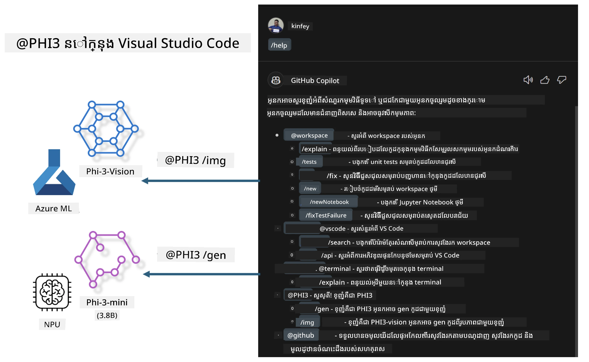

# **សាងសង់ Chat GitHub Copilot របស់អ្នក ក្នុង Visual Studio Code ជាមួយក្រុម Microsoft Phi-3**

តើអ្នកបានប្រើប្រាស់ workspace agent នៅក្នុង GitHub Copilot Chat ឬยัง? តើអ្នកចង់បង្កើត agent កូដ សម្រាប់ក្រុមរបស់អ្នក​ដែរឬទេ? មេរៀនអនុវត្តនេះមានគោលបំណងបញ្ចូលម៉ូដែល open source ដើម្បីសាងសង់ agent អាជីវកម្មកូដ នៅកម្រិតស្ថាប័ន។

## **Foundation**

### **ហេតុអ្វីបានជាជ្រើស Microsoft Phi-3**

Phi-3 គឺជាស៊េរីមួយ ដែលមាន phi-3-mini, phi-3-small, និង phi-3-medium ធ្វើលើប៉ារ៉ាម៉ែត្រហ្វឹកហាត់ខុសៗគ្នាសម្រាប់ការបង្កើតអត្ថបទ ការបំពេញស៦ងការប្រាស្រ័យ និងការបង្កើតកូដ។ វានៅមាន phi-3-vision ដែលផ្អែកលើ Vision។ វាសមសម្រាប់ស្ថាប័ន ឬក្រុមផ្សេងៗក្នុងការបង្កើតដំណោះស្រាយ generative AI បញ្ចុះក្រៅអ៊ីនធឺណិត។

ផ្ដល់អនុសាសន៍ឲ្យអានតំណនេះ [https://github.com/microsoft/PhiCookBook/blob/main/md/01.Introduction/01/01.PhiFamily.md](https://github.com/microsoft/PhiCookBook/blob/main/md/01.Introduction/01/01.PhiFamily.md)

### **Microsoft GitHub Copilot Chat**

ពង្រីក GitHub Copilot Chat ផ្ដល់ផ្ទាំងសន្ទនា ដែលអនុញ្ញាតឲ្យអ្នកធ្វើអន្តរកម្មជាមួយ GitHub Copilot និងទទួលបានចម្លើយចំពោះសំណួរពាក់ព័ន្ធនឹងកូដ ដោយស្ថិត​ក្នុង VS Code ដោយមិនចាំបាច់រកឯកសារ ឬស្វែងរកក្នុងវេទិកាអនឡាញ។

Copilot Chat អាចប្រើការភ្ជាប់សញ្ញាសរសេរ (syntax highlighting), លំនាំចុះជួរ (indentation), និងលក្ខណៈបង្ហាញផ្សេងៗដើម្បីបន្ថែមភាពច្បាស់លាស់ទៅចម្លើយដែលបានបង្កើត។ អាស្រ័យលើប្រភេទសំណួរពីអ្នកប្រើ លទ្ធផលអាចរួមមានតំណទៅកន្សោមដែល Copilot បានប្រើសម្រាប់បង្កើតចម្លើយ ដូចជា ឯកសារភាគីដើម ឬឯកសារយោង ឬប៊ូតុងសម្រាប់ចូលប្រើមុខងារនៅក្នុង VS Code។

- Copilot Chat បានផ្សំពេញក្នុងចរន្តអភិវឌ្ឍន៍របស់អ្នក ហើយផ្តល់ជំនួយនៅកន្លែងដែលអ្នកត្រូវការ៖

- ចាប់ផ្តើមសន្ទនា inline ពីឯកសារ ឬ terminal ដោយផ្ទាល់ សម្រាប់ជំនួយពេលដែលអ្នកកំពុងកូដ

- ប្រើទិដ្ឋភាព Chat ដើម្បីមានជំនួយ AI នៅក្បែរខណៈដែលអ្នកអាចទាមទារពេលណាមួយ

- បើក Quick Chat ដើម្បីសួរសំណួរពីរបី ហើយត្រឡប់ទៅធ្វើការរបស់អ្នកវិញ

អ្នកអាចប្រើ GitHub Copilot Chat នៅក្នុងសេណារីយ៉ូវិញាៈ ដូចជា:

- ตอบសំណួរពាក់ព័ន្ធនឹងវិធីដោះស្រាយបញ្ហារបៀបល្អបំផុត

- ពន្យល់កូដរបស់អ្នកផ្សេង និងផ្តល់យោបល់ប្រែកែ

- ស្នើសង្វេកកូដដែលបង្កើតកំហុស

- បង្កើតករណី unit test

- បង្កើតឯកសារសម្រាប់កូដ

ផ្ដល់អនុសាសន៍ឲ្យអានតំណនេះ [https://code.visualstudio.com/docs/copilot/copilot-chat](https://code.visualstudio.com/docs/copilot/copilot-chat?WT.mc_id=aiml-137032-kinfeylo)

###  **Microsoft GitHub Copilot Chat @workspace**

ការយោង **@workspace** នៅក្នុង Copilot Chat អនុញ្ញាតឲ្យអ្នកសួរអំពីទិន្នន័យកូដទាំងមូលរបស់អ្នក។ អាស្រ័យលើសំណួរ Copilot នឹងយកឯកសារ និងពាក្យសញ្ញាដែលពាក់ព័ន្ធ មកប្រើ និងយោងទៅក្នុងចម្លើយជាតំណ និង ឧទាហរណ៍កូដ។

ដើម្បីឆ្លើយសំណួររបស់អ្នក **@workspace** ធ្វើការស្វែងក្នុងប្រភពដូចដែលអ្នកអភិវឌ្ឍន៍នឹងប្រើពេលរុករកនៅក្នុង VS Code:

- ឯកសារទាំងអស់នៅក្នុង workspace លើកលែងឯកសារ​ដែល​ត្រូវ​បាន​ដកចេញ​ដោយ​ឯកសារ .gitignore

- រចនាសម្ព័ន្ធថត និងឈ្មោះថត និងឈ្មោះឯកសារយោងខ្នះខ្នែង

- ការស្វែងរកកូដរបស់ GitHub ដូចជា workspace គឺជា GitHub repository និងបាន index ដោយ code search

- ពាក្យសញ្ញា និង definition នៅក្នុង workspace

- អត្ថបទបានជ្រើសយកបច្ចុប្បន្ន ឬអត្ថបទ​ដែលមើលឃើញនៅក្នុង editor ដែលកំពុងសកម្ម

Note: .gitignore នឹងត្រូវលើកកម្រិតបដិសេធ ប្រសិនបើអ្នកបានបើកឯកសារ ឬបានជ្រើសអត្ថបទក្នុងឯកសារដែលត្រូវបានចោល។

ផ្ដល់អនុសាសន៍ឲ្យអានតំណនេះ [[https://code.visualstudio.com/docs/copilot/copilot-chat](https://code.visualstudio.com/docs/copilot/workspace-context?WT.mc_id=aiml-137032-kinfeylo)]

## **ស្វែងយល់​បន្ថែមអំពីមេរៀននេះ**

GitHub Copilot បានធ្វើឲ្យ​ប្រសើរឡើងយ៉ាងខ្លាំងចំពោះប្រសិទ្ធភាពក្នុងការសរសេរកម្មវិធីសម្រាប់ស្ថាប័ន ហើយរាល់ស្ថាប័នគ្រប់គ្នាក៏មានចង់កែតម្រង់មុខងារពាក់ព័ន្ធនៃ GitHub Copilot ផ្ទាល់ខ្លួន។ មានស្ថាប័នជាច្រើនបានប្តេជ្ញាបង្កើត Extensions ផ្ទាល់ខ្លួនដែលស្រដៀងនឹង GitHub Copilot ដោយផ្អែកលើស្ថានភាពអាជីវកម្មនិងម៉ូដែល open source ។ សម្រាប់ស្ថាប័ន ការបង្កើត Extensions ផ្ទាល់ខ្លួនងាយស្រួលក្នុងការគ្រប់គ្រង ប៉ុន្តែវាអាចប៉ះពាល់ដល់បទពិសោធន៍អ្នកប្រើផងដែរ។ បើអាចរក្សាបទពិសោធន៍ឲ្យស្រដៀងគ្នា នោះការប្តេជ្ញាជា Extension ផ្ទាល់ខ្លួនសម្រាប់ស្ថាប័ននឹងល្អប្រសើរជាងមុន។ GitHub Copilot Chat ផ្គត់ផ្គង់ API ដែលពាក់ព័ន្ធសម្រាប់ស្ថាប័នក្នុងការពង្រីកបទពិសោធន៍ Chat។ ការសម្គាល់បទពិសោធន៍តែមួយ និងមានមុខងារផ្ទាល់ខ្លួនគឺជាបទពិសោធន៍ប្រើប្រាស់ល្អជាង។

មេរៀននេះចម្បងប្រើម៉ូដែល Phi-3 រួមជាមួយ NPU ក្នុងម៉ាស៊ីនក្នុងមូលដ្ឋាន (local NPU) និង Azure hybrid ដើម្បីសាងសង់ Agent ផ្ទាល់ខ្លួនក្នុង GitHub Copilot Chat ***@PHI3*** ដើម្បីជួយអ្នកអភិវឌ្ឍន៍នៅស្ថាប័នបញ្ចប់ការបង្កើតកូដ***(@PHI3 /gen)*** និងបង្កើតកូដទៅលើរូបភាព***(@PHI3 /img)***។

### ***ចំណាំ:*** 

មេរៀននេះបានអនុវត្តនៅលើ AIPC របស់ Intel CPU និង Apple Silicon បច្ចុប្បន្ន។ យើងនឹងបន្តធ្វើបច្ចុប្បន្នភាពសម្រាប់កំណែ Qualcomm នៃ NPU។

## **Lab**

| ឈ្មោះ | ការពិពណ៌នា | AIPC | Apple |
| ------------ | ----------- | -------- |-------- |
| Lab0 - Installations(✅) | កំណត់រចនាសម្ព័ន្ធ និងដំឡើងបរិយាកាស និងឧបករណ៍ដំឡើងដែលពាក់ព័ន្ធ | [ចូល](./HOL/AIPC/01.Installations.md) |[ចូល](./HOL/Apple/01.Installations.md) |
| Lab1 - Run Prompt flow with Phi-3-mini (✅) | ប្រើរួមជាមួយ AIPC / Apple Silicon ដោយប្រើ local NPU ដើម្បីបង្កើតការបង្កើតកូដ តាមរយៈ Phi-3-mini | [ចូល](./HOL/AIPC/02.PromptflowWithNPU.md) |  [ចូល](./HOL/Apple/02.PromptflowWithMLX.md) |
| Lab2 - Deploy Phi-3-vision on Azure Machine Learning Service(✅) | បង្កើតកូដដោយដាក់ឲ្យដំណើរការ​រូបភាព Phi-3-vision ពី Model Catalog របស់ Azure Machine Learning Service | [ចូល](./HOL/AIPC/03.DeployPhi3VisionOnAzure.md) |[ចូល](./HOL/Apple/03.DeployPhi3VisionOnAzure.md) |
| Lab3 - Create a @phi-3 agent in GitHub Copilot Chat(✅)  | បង្កើត agent ផ្ទាល់ខ្លួន Phi-3 ក្នុង GitHub Copilot Chat ដើម្បីបញ្ចប់ការបង្កើតកូដ, កូដបង្កើតក្រាប, RAG, ល។ | [ចូល](./HOL/AIPC/04.CreatePhi3AgentInVSCode.md) | [ចូល](./HOL/Apple/04.CreatePhi3AgentInVSCode.md) |
| Sample Code (✅)  | ទាញយកកូដគំរូ | [ចូល](../../../../../../../code/07.Lab/01/AIPC) | [ចូល](../../../../../../../code/07.Lab/01/Apple) |

## **ធនធាន**

1. Phi-3 Cookbook [https://github.com/microsoft/Phi-3CookBook](https://github.com/microsoft/Phi-3CookBook)

2. ស្វែងយល់បន្ថែមអំពី GitHub Copilot [https://learn.microsoft.com/training/paths/copilot/](https://learn.microsoft.com/training/paths/copilot/?WT.mc_id=aiml-137032-kinfeylo)

3. ស្វែងយល់បន្ថែមអំពី GitHub Copilot Chat [https://learn.microsoft.com/training/paths/accelerate-app-development-using-github-copilot/](https://learn.microsoft.com/training/paths/accelerate-app-development-using-github-copilot/?WT.mc_id=aiml-137032-kinfeylo)

4. ស្វែងយល់បន្ថែមអំពី GitHub Copilot Chat API [https://code.visualstudio.com/api/extension-guides/chat](https://code.visualstudio.com/api/extension-guides/chat?WT.mc_id=aiml-137032-kinfeylo)

5. ស្វែងយល់បន្ថែមអំពី Microsoft Foundry [https://learn.microsoft.com/training/paths/create-custom-copilots-ai-studio/](https://learn.microsoft.com/training/paths/create-custom-copilots-ai-studio/?WT.mc_id=aiml-137032-kinfeylo)

6. ស្វែងយល់បន្ថែមអំពី Model Catalog របស់ Microsoft Foundry [https://learn.microsoft.com/azure/ai-studio/how-to/model-catalog-overview](https://learn.microsoft.com/azure/ai-studio/how-to/model-catalog-overview)

---

<!-- CO-OP TRANSLATOR DISCLAIMER START -->
**Disclaimer**:
ឯកសារនេះត្រូវបានបកប្រែដោយប្រើសេវាកម្មបកប្រែ AI [Co-op Translator](https://github.com/Azure/co-op-translator)。 ទោះបីយើងខិតខំធ្វើឲ្យមានភាពត្រឹមត្រូវក៏ដោយ សូមយកចិត្តទុកដាក់ថាការបកប្រែដោយប្រព័ន្ធស្វ័យប្រវត្តិសម្រេចអាចមានកំហុស ឬភាពមិនត្រឹមត្រូវ។ ឯកសារដើមក្នុងភាសាម្ចាស់ដើមគួរត្រូវបានចាត់ទុកថាជាប្រភពដែលមានសុពលភាព។ សម្រាប់ព័ត៌មានសំខាន់ៗ យើងសូមផ្តល់អនុសាសន៍ឲ្យប្រើការបកប្រែដោយមនុស្សវិជ្ជាជីវៈ។ យើងមិនទទួលខុសត្រូវចំពោះការយល់ច្រឡំ ឬការបកប្រែខុសណាមួយដែលកើតមានពីការប្រើប្រាស់ការបកប្រែនេះឡើយ។
<!-- CO-OP TRANSLATOR DISCLAIMER END -->