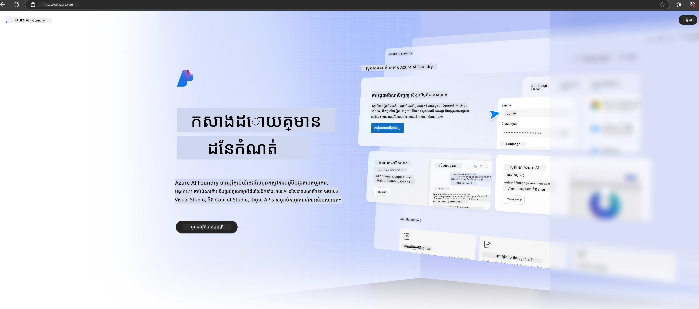

# **ការប្រើប្រាស់ Phi-3 ក្នុង Microsoft Foundry**

ជាមួយការអភិវឌ្ឍន៍នៃ Generative AI យើងសង្ឃឹមថានឹងប្រើវេទិកាដាច់ដោយឡែកដើម្បីគ្រប់គ្រង LLM និង SLM ផ្សេងៗ ការចូលរួមទិន្នន័យស្ថាប័ន ការតំឡើងលំអិត/RAG និងការវាយតម្លៃអាជីវកម្មស្ថាប័នផ្សេងៗបន្ទាប់ពីបានរួមបញ្ចូល LLM និង SLM ។ ដូចនេះ generative AI អាចអនុវត្តកម្មវិធី Smart បានល្អបំផុត [Microsoft Foundry](https://ai.azure.com) គឺជាវេទិកាកម្មវិធី generative AI កម្រិតស្ថាប័ន។

ជាមួយ Microsoft Foundry អ្នកអាចវាយតម្លៃការឆ្លើយតបរបស់ម៉ូដែលភាសាប្រភេទធំ (LLM) និងរៀបចំអង្គធាតុប្រើប្រាស់ prompt ជាមួយ prompt flow ដើម្បីកែលម្អកម្រិតអនុវត្តបានល្អជាងមុន។ វេទិកានេះគាំទ្រដល់ការកើនឡើងសមត្ថភាពសម្រាប់បម្លែងការបង្ហាញគំនិតទៅជាការផលិតពេញលេញបានយ៉ាងងាយស្រួល។ ការត្រួតពិនិត្យនិងកែប្រែបន្តទៅមុខគាំទ្រជោគជ័យរយៈពេលវែង។

យើងអាចបង្ហោះម៉ូដែល Phi-3 លឿនៗ លើ Microsoft Foundry តាមជំហានសាមញ្ញហើយបន្ទាប់មកប្រើ Microsoft Foundry ដើម្បីបញ្ចប់ការងារពាក់ព័ន្ធ Playground/Chat, Fine-tuning, វាយតម្លៃ និងការងារពាក់ព័ន្ធផ្សេងទៀតរបស់ Phi-3។

## **1. ការរៀបចំ**

ប្រសិនបើអ្នកមាន [Azure Developer CLI](https://learn.microsoft.com/azure/developer/azure-developer-cli/overview?WT.mc_id=aiml-138114-kinfeylo) តម្លើងរួចនៅលើម៉ាស៊ីនរបស់អ្នក ការប្រើប្រាស់សំណុំទម្រង់នេះ គ្រាន់តែដំណើរការបញ្ជា នេះក្នុងថតថ្មីបាន៕

## ការបង្កើតដោយដៃ

ការបង្កើតគម្រោងនិងថាស Microsoft Foundry គឺជាវិធីល្អក្នុងការរៀបចំនិងគ្រប់គ្រងកិច្ចការ AI របស់អ្នក។ នេះគឺជាណែនាំជំហានទៅជំហានដើម្បីចាប់ផ្តើម៖

### ការបង្កើតគម្រោងនៅ Microsoft Foundry

1. **ចូលទៅ Microsoft Foundry**៖ ចុះឈ្មោះនៅក្នុងបរិវេណ Microsoft Foundry។
2. **បង្កើតគម្រោង**៖
   - ប្រសិនបើអ្នកនៅក្នុងគម្រោងមួយ សូមជ្រើស "Microsoft Foundry" នៅខាងស្តាំលើដើម្បីទៅកាន់ទំព័រដើម។
   - ជ្រើស "+ Create project"។
   - បញ្ចូលឈ្មោះសម្រាប់គម្រោង។
   - ប្រសិនបើអ្នកមានថាស វានឹងត្រូវបានជ្រើសដោយលំនាំដើម។ ប្រសិនបើអ្នកអាចចូលប្រើថាសច្រើនជាងមួយ អ្នកអាចជ្រើសថាសផ្សេងពីប៉ារ៉ាម៉ែត្រផ្ទាំងចុច។ ប្រសិនបើអ្នកចង់បង្កើតថាសថ្មី ជ្រើស "Create new hub" ហើយផ្តល់ឈ្មោះ។
   - ជ្រើស "Create"។

### ការបង្កើតថាសនៅ Microsoft Foundry

1. **ចូលទៅ Microsoft Foundry**៖ ចុះឈ្មោះជាមួយគណនី Azure របស់អ្នក។
2. **បង្កើតថាស**៖
   - ជ្រើសច្បាប់គ្រប់គ្រងពីម៉ឺនុយខាងឆ្វេង។
   - ជ្រើស "All resources" បន្ទាប់មកចំនុចបញ្ជូនក្រោម "+ New project" ហើយជ្រើស "+ New hub"។
   - នៅក្នុងប្រអប់សន្ទនា "Create a new hub" បញ្ចូលឈ្មោះសម្រាប់ថាសរបស់អ្នក (ឧ. contoso-hub) ហើយកែប្រែវាលផ្សេងៗតាមចំណង់ចំណូលចិត្ត។
   - ជ្រើស "Next" ពិនិត្យព័ត៌មាន ហើយបន្ទាប់មកជ្រើស "Create"។

សម្រាប់ការណែនាំលម្អិតបន្ថែម អ្នកអាចយោងទៅឯកសារផ្លូវការរបស់ [Microsoft](https://learn.microsoft.com/azure/ai-studio/how-to/create-projects) ។

បន្ទាប់ពីបានបង្កើតជោគជ័យ អ្នកអាចចូលទៅកាន់ស្ទូឌីយ៉ូដែលបានបង្កើតតាមរយៈ [ai.azure.com](https://ai.azure.com/)

អាចមានគម្រោងជាច្រើននៅលើ AI Foundry មួយ។ សូមបង្កើតគម្រោងនៅក្នុង AI Foundry ដើម្បីរៀបចំ។

បង្កើត Microsoft Foundry [QuickStarts](https://learn.microsoft.com/azure/ai-studio/quickstarts/get-started-code)

## **2. បង្ហោះម៉ូដែល Phi នៅ Microsoft Foundry**

ចុចជម្រើស Explore របស់គម្រោងដើម្បីចូលទៅកាន់សៀវភៅម៉ូដែល និងជ្រើស Phi-3

ជ្រើស Phi-3-mini-4k-instruct

ចុច 'Deploy' ដើម្បីបង្ហោះម៉ូដែល Phi-3-mini-4k-instruct

> [!NOTE]
>
> អ្នកអាចជ្រើសឈាមគណនីកំលាំងគណនា ពេលបង្ហោះ។

## **3. ផ្ទះលេង Chat Phi នៅ Microsoft Foundry**

ទៅទំព័របង្ហោះ សូមជ្រើស Playground ហើយនិយាយជាមួយ Phi-3 របស់ Microsoft Foundry

## **4. ការបង្ហោះម៉ូដែលពី Microsoft Foundry**

ដើម្បីបង្ហោះម៉ូដែលពី Azure Model Catalog អ្នកអាចអនុវត្តជំហានដូចខាងក្រោម៖

- ចុះឈ្មោះរក្សាសិទ្ធនៅ Microsoft Foundry។
- ជ្រើសម៉ូដែលដែលអ្នកចង់បង្ហោះពីសៀវភៅម៉ូដែល Microsoft Foundry។
- នៅទំព័រព័ត៌មានម៉ូដែល ជ្រើស Deploy បន្ទាប់មកជ្រើស Serverless API ជាមួយ Azure AI Content Safety។
- ជ្រើសគម្រោងដែលអ្នកចង់បង្ហោះម៉ូដែល។ ដើម្បីប្រើសេវា Serverless API កន្លែងធ្វើការរបស់អ្នកត្រូវតែស្ថិតនៅតំបន់ East US 2 ឬ Sweden Central។ អាចកែប្រែឈ្មោះ Deployment បាន។
- នៅវីឌ្យូកម្មបង្ហោះេរប្រាប់ពីតម្លៃនិងលក្ខខណ្ឌដើម្បីរៀនពីតម្លៃ និងលក្ខខណ្ឌប្រើប្រាស់។
- ជ្រើស Deploy។ រង់ចាំរហូតដល់ការបង្ហោះរួចហើយវានឹងបង្វិលទៅទំព័របង្ហោះ។
- ជ្រើស Open in playground ដើម្បីចាប់ផ្តើមអន្តរកម្មជាមួយម៉ូដែល។
- អ្នកអាចត្រឡប់ទៅទំព័របង្ហោះ ជ្រើសការបង្ហោះ ហើយចំណាំ Target URL និង Secret Key នៃ endpoint ដែលអាចប្រើសម្រាប់ហៅការបង្ហោះនិងបង្កើតការសម្រួល។
- អ្នកអាចរកឃើញព័ត៌មានលម្អិត URL និងកូនសោចូលប្រើបានជានិច្ច ដោយទៅកាន់ផ្ទាំង Build ហើយជ្រើស Deployments ពីផ្នែក Components។

> [!NOTE]
> សូមចំណាំថាគណនីរបស់អ្នកត្រូវតែមានសិទ្ធិតួនាទី Azure AI Developer លើ Resource Group ដើម្បីអនុវត្តជំហានទាំងនេះ។

## **5. ការប្រើ Phi API នៅ Microsoft Foundry**

អ្នកអាចចូល https://{Your project name}.region.inference.ml.azure.com/swagger.json តាមរយៈ Postman GET ហើយបញ្ចូល Key ដើម្បីស្គាល់ចំណុចផ接口ផ្តល់ជូន។

អ្នកអាចទទួលបានប៉ារ៉ាម៉ែត្រសំណើរ និងប៉ារ៉ាម៉ែត្រ ផ្លាស់បត់បានយ៉ាងងាយស្រួល។

---

<!-- CO-OP TRANSLATOR DISCLAIMER START -->
**ការបដិសេធ**៖  
ឯកសារនេះត្រូវបានបកប្រែដោយប្រើសេវាបកប្រែ AI [Co-op Translator](https://github.com/Azure/co-op-translator)។ ខណៈពេលដែលយើងខំប្រឹងរកភាពត្រឹមត្រូវ សូមជ្រាបថាការបកប្រែដោយស្វ័យប្រវត្តិអាចមានកំហុសឬការមិនត្រឹមត្រូវ។ ឯកសារដើមជាភាសាដើមគួរត្រូវបានទទួលស្គាល់ជាមូលដ្ឋានដ៏មានអំណាចមួយ។ សម្រាប់ព័ត៌មានសំខាន់ណាស់ គួរលុបចំណងជើងបកប្រែដោយមនុស្សជំនាញ។ យើងមិនទទួលខុសត្រូវចំពោះការយល់ច្រឡំ ឬការប្រែច្រឡំណាមួយដែលបានកើតឡើងពីការប្រើប្រាស់ការបកប្រែនេះឡើយ។
<!-- CO-OP TRANSLATOR DISCLAIMER END -->