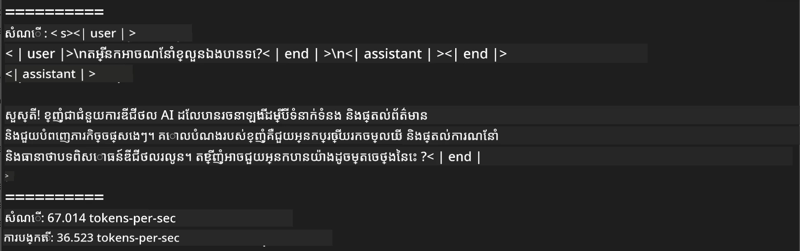
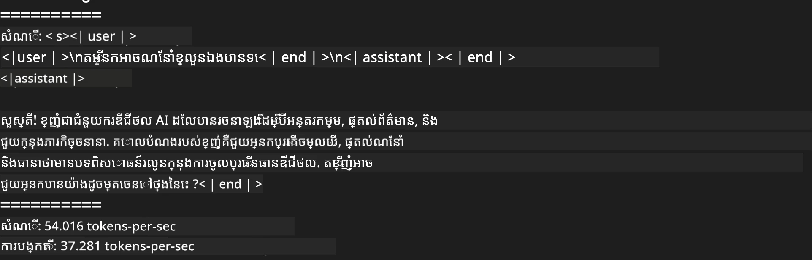
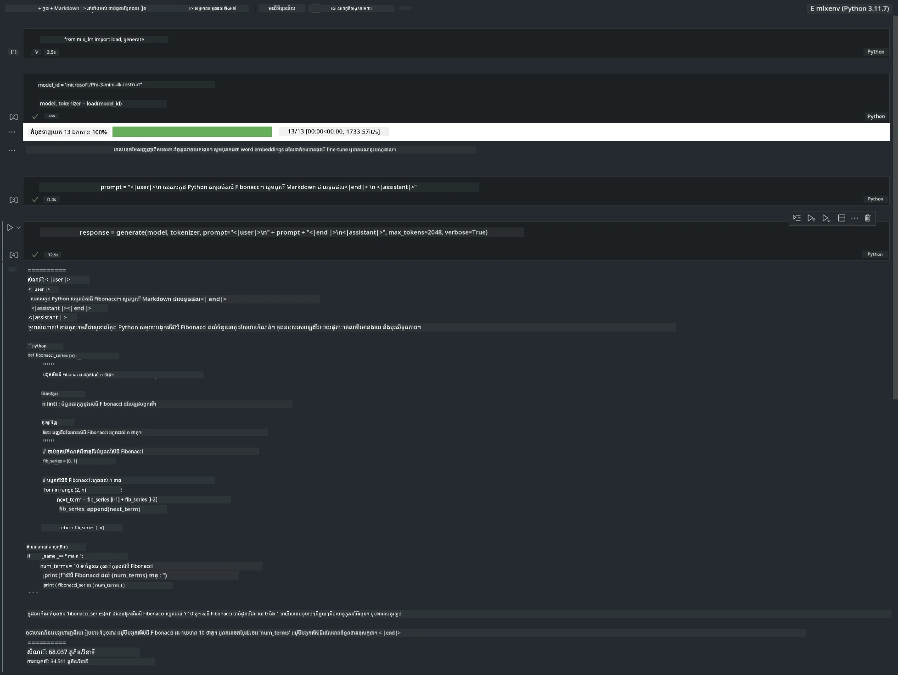

# **ធ្វើ Inference សម្រាប់ Phi-3 ជាមួយ Apple MLX Framework**

## **MLX Framework គឺជាអ្វី**

MLX គឺជាផ្នែកបណ្ណាល័យ array សម្រាប់ការស្រាវជ្រាវ machine learning លើ Apple silicon ដែលផ្តល់ដោយក្រុមស្រាវជ្រាវ machine learning របស់ Apple។

MLX ត្រូវបានរចនាឡើងដោយអ្នកស្រាវជ្រាវ machine learning សម្រាប់អ្នកស្រាវជ្រាវ machine learning។ ហៅ Framework នេះមានបំណងឱ្យប្រើបានងាយស្រួល ដូច្នេះនៅពេលដើរបង្រៀន និងដាក់ចេញម៉ូដែល វាក៏មានប្រសិទ្ធភាពផងដែរ។ ការរចនានៃ Framework ផ្ទាល់ខ្លួនក៏មានគំនិតរឹងមាំ និងសាមញ្ញផងដែរ។ យើងមានគោលបំណងឲ្យវាងាយស្រួលសម្រាប់អ្នកស្រាវជ្រាវក្នុងការពង្រីក និងបង្កើតយើង MLX ដើម្បីស្វែងរកគំនិតថ្មីៗយ៉ាងឆាប់រហ័ស។

LLMs អាចត្រូវបានហ្សូបឱ្យរហ័សនៅលើយន្តប័ណ្ណ Apple Silicon តាមរយៈ MLX ហើយអាចរត់ម៉ូដែលនៅក្នុងកុំព្យូទ័របុគ្គលបានយ៉ាងងាយស្រួល។

## **ប្រើ MLX ដើម្បីធ្វើ Inference លើ Phi-3-mini**

### **1. Set up you MLX env**

1. Python 3.11.x
2. ដំឡើងបណ្ណាល័យ MLX


```bash

pip install mlx-lm

```

### **2. Running Phi-3-mini in Terminal with MLX**


```bash

python -m mlx_lm.generate --model microsoft/Phi-3-mini-4k-instruct --max-token 2048 --prompt  "<|user|>\nCan you introduce yourself<|end|>\n<|assistant|>"

```

លទ្ធផល (បរិយាកាសរបស់ខ្ញុំគឺ Apple M1 Max,64GB) គឺ



### **3. Quantizing Phi-3-mini with MLX in Terminal**


```bash

python -m mlx_lm.convert --hf-path microsoft/Phi-3-mini-4k-instruct

```

***ចំណាំ：*** ម៉ូដែលអាចត្រូវបាន quantized តាមរយៈ mlx_lm.convert ហើយការកំណត់ quantization រឹងជា default គឺ INT4។ ឧទាហរណ៍នេះបាន quantize Phi-3-mini ទៅជា INT4

ម៉ូដែលអាចត្រូវបាន quantized តាមរយៈ mlx_lm.convert ហើយការកំណត់ quantization ពីលំនាំដើមគឺ INT4។ ឧទាហរណ៍នេះគឺដើម្បី quantize Phi-3-mini ទៅជា INT4។ បន្ទាប់ពីបាន quantize វានឹងត្រូវបានរក្សាទុកក្នុងថតលំនាំដើម ./mlx_model

យើងអាចសាកល្បងម៉ូដែលដែលបាន quantize ជាមួយ MLX ពី terminal


```bash

python -m mlx_lm.generate --model ./mlx_model/ --max-token 2048 --prompt  "<|user|>\nCan you introduce yourself<|end|>\n<|assistant|>"

```

លទ្ធផលគឺ




### **4. Running Phi-3-mini with MLX in Jupyter Notebook**




***ចំណាំ:*** សូមអានឧទាហរណ៍នេះ [click this link](../../../code/03.Inference/MLX/MLX_DEMO.ipynb)


## **ធនធាន**

1. ស្វែងយល់អំពី Apple MLX Framework [https://ml-explore.github.io](https://ml-explore.github.io/mlx/build/html/index.html)

2. Apple MLX GitHub Repo [https://github.com/ml-explore](https://github.com/ml-explore)

---

<!-- CO-OP TRANSLATOR DISCLAIMER START -->
**Disclaimer**:
ឯកសារនេះបានបកប្រែដោយប្រើសេវាកម្មបកប្រែ AI [Co-op Translator](https://github.com/Azure/co-op-translator)។ នៅពេលដែលយើងខិតខំសម្រាប់ភាពត្រឹមត្រូវ សូមចំណាំថាការបកប្រែដោយស្វ័យប្រវត្តិអាចមានកំហុស ឬភាពមិនត្រឹមត្រូវ។ ឯកសារដើមក្នុងភាសាម្ចាស់របស់វាគួរត្រូវបានចាត់ទុកជា​ប្រភពផ្លូវការ។ សម្រាប់ព័ត៌មានសំខាន់ៗ សូមពិចារណាបកប្រែដោយអ្នកជំនាញមនុស្សដែលមានវិជ្ជាជីវៈ។ យើងមិនទទួលខុសត្រូវចំពោះការយល់ច្រឡំ ឬការបកប្រែខុសណាមួយដែលកើតឡើងពីការប្រើប្រាស់ការបកប្រែនេះទេ។
<!-- CO-OP TRANSLATOR DISCLAIMER END -->