# ការតម្រុយ Phi-3 ជាមួយ Microsoft Foundry

 មកប្រាប់ពីរបៀបតម្រុយម៉ូដែលភាសា Phi-3 Mini របស់ Microsoft ដោយប្រើ Microsoft Foundry។ ការតម្រុយអនុញ្ញាតឲ្យអ្នកធ្វើឲ្យ Phi-3 Mini ឆាប់ដំណើរការសម្រាប់ភារកិច្ចជាក់លាក់ ដូច្នេះវានឹងមានអំណាច និងយល់ព្រម context មួយចំនួន។

## ការពិចារណា

- **សមត្ថភាព:** ម៉ូដែលណាអាចតម្រុយបាន? ម៉ូដែលមូលដ្ឋានអាចត្រូវបានតម្រុយឲ្យធ្វើអ្វីបានខ្លះ?
- **ថ្លៃដើម:** ម៉ូដែលម៉េចដែលមានតម្លៃសម្រាប់ការតម្រុយ?
- **ការប្ដូរតាមតម្រូវការ:** ខ្ញុំអាចកែប្រែមូលដ្ឋានម៉ូដែលបានប៉ុន្មាន និងតាមរបៀបណា?
- **ភាពងាយស្រួល:** តើការតម្រុយកើតឡើងដូចម្តេច - តើខ្ញុំត្រូវសរសេរកូដផ្ទាល់ខ្លួនទេ? តើខ្ញុំត្រូវយកកុំព្យូទ័រផ្ទាល់ខ្លួនមកទេ?
- **សុវត្ថិភាព:** ម៉ូដែលដែលត្រូវបានតម្រូវខុសគ្នាបានបង្ហាញពីហានិភ័យសុវត្ថិភាព - តើមានការការពារណាមួយដើម្បីការពារប្រឆាំងនឹងការខូចខាតដែលមិនចង់ឲ្យកើតមានទេ?

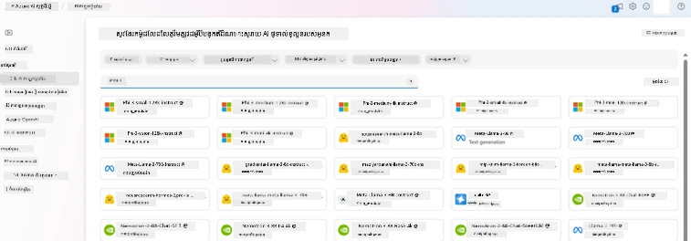

## ការប្រមូលផ្តុំសម្រាប់ការតម្រូវ

### ទាមទារមុន

> [!NOTE]
> សម្រាប់ម៉ូដែលក្រុម Phi-3 ការផ្តល់ជូនសេវាកម្មតម្រូវដោយគិតលើកំណត់ត្រាជាដែលមាននៅតែក្នុងតំបន់ **East US 2** ប៉ុណ្ណោះ។

- មានការជាវ Azure។ ប្រសិនបើអ្នកមិនមានការជាវ Azure, បង្កើត [គណនី Azure ដែលមានទូទាត់បាន](https://azure.microsoft.com/pricing/purchase-options/pay-as-you-go) ដើម្បីចាប់ផ្តើម។

- មាន [គម្រោង AI Foundry](https://ai.azure.com?WT.mc_id=aiml-138114-kinfeylo)។
- ការត្រួតពិនិត្យចូលដោយផ្អែកលើតួនាទី Azure (Azure RBAC) ត្រូវបានប្រើដើម្បីផ្តល់សិទ្ធិចូលដំណើរការក្នុង Microsoft Foundry។ ដើម្បីអនុវត្តជំហានក្នុងអត្ថបទនេះ ត្រូវតែលេខាសម្គាល់អ្នកប្រើរបស់អ្នកត្រូវបានផ្ដល់តួនាទី __Azure AI Developer__ នៅលើក្រុមធនធាន។

### ការចុះឈ្មោះអោយអ្នកផ្គត់ផ្គង់ជាវ

បញ្ជាក់ថាការជាវត្រូវបានចុះឈ្មោះជាមួយអ្នកផ្គត់ផ្គង់ធនធាន `Microsoft.Network`។

1. ចូលទៅកាន់ [ផត់ហ្សែល Azure](https://portal.azure.com)។
1. ជ្រើសរើស **Subscriptions** ពីម៉ឺនុយខាងឆ្វេង។
1. ជ្រើសរើសការជាវដែលអ្នកចង់ប្រើ។
1. ជ្រើសរើស **AI project settings** > **Resource providers** ពីម៉ឺនុយខាងឆ្វេង។
1. បញ្ជាក់ថា **Microsoft.Network** មាននៅក្នុងបញ្ជីអ្នកផ្គត់ផ្គង់ធនធាន។ ប្រសិនបើមិនមាន សូមបន្ថែមវា។

### ការរៀបចំទិន្នន័យ

រៀបចំទិន្នន័យបណ្តុះបណ្តាល និងត្រួតពិនិត្យរបស់អ្នកសម្រាប់ការតម្រុយម៉ូដែល។ ទិន្នន័យបណ្តុះបណ្តាល និងទិន្នន័យត្រួតពិនិត្យរបស់អ្នក​មានឧទាហរណ៍បញ្ចូល និងលទ្ធផលសម្រាប់របៀបដែលអ្នកចង់ឲ្យម៉ូដែលដំណើរការ។

ប្រាកដថាឧទាហរណ៍បណ្តុះបណ្តាលទាំងអស់របស់អ្នក​ត្រូវអនុវត្តតាមទ្រង់ទ្រាយដែលរំពឹងទុកសម្រាប់ការព្យាករណ៍។ ដើម្បីតម្រុយម៉ូដែលបានយ៉ាងមានប្រសិទ្ធភាព ប្រាកដថាផ្ទុកទិន្នន័យមានសមភាព និងចម្រង់ល្អ។

ខាងលើរួមមានការរក្សាតុល្យភាពទិន្នន័យ, មានស្ថានការណ៍នានា និងធ្វើការកែលម្អទិន្នន័យបណ្តុះបណ្តាលវេជ្ជសាស្ត្រជាប្រចាំ ដើម្បីឲ្យសមតុល្យនិងភាពច្បាស់លាស់ក្នុងការឆ្លើយតបរបស់ម៉ូដែល។

ម៉ូដែលប្រភេទផ្សេងៗតម្រូវការទ្រង់ទ្រាយទិន្នន័យបណ្តុះបណ្តាលផ្សេងគ្នា។

### បញ្ចប់ការជជែក

ទិន្នន័យបណ្តុះបណ្តាល និងត្រួតពិនិត្យដែលអ្នកប្រើ **ត្រូវតែ** នៅក្នុងទ្រង់ទ្រាយឯកសារ JSON Lines (JSONL)។ សម្រាប់ `Phi-3-mini-128k-instruct` សំណុំនៃការតម្រុយត្រូវតែកំណត់នៅក្នុងទ្រង់ទ្រាយជជែកដែលប្រើដោយ API ហៅថា Chat completions។

### គំរូទ្រង់ទ្រាយឯកសារ

```json
    {"messages": [{"role": "system", "content": "You are an Xbox customer support agent whose primary goal is to help users with issues they are experiencing with their Xbox devices. You are friendly and concise. You only provide factual answers to queries, and do not provide answers that are not related to Xbox."}, {"role": "user", "content": "Is Xbox better than PlayStation?"}, {"role": "assistant", "content": "I apologize, but I cannot provide personal opinions. My primary job is to assist you with any issues related to your Xbox device. Do you have any Xbox-related issues that need addressing?"}]}
    {"messages": [{"role": "system", "content": "You are an Xbox customer support agent whose primary goal is to help users with issues they are experiencing with their Xbox devices. You are friendly and concise. You only provide factual answers to queries, and do not provide answers that are not related to Xbox."}, {"role": "user", "content": "Can I play PC games on my Xbox?"}, {"role": "assistant", "content": "While Xbox consoles don't natively support PC games, they can play an array of Xbox games, many of which are also available on PC. Can I assist you with finding games compatible with your Xbox device?"}]}
    {"messages": [{"role": "system", "content": "You are an Xbox customer support agent whose primary goal is to help users with issues they are experiencing with their Xbox devices. You are friendly and concise. You only provide factual answers to queries, and do not provide answers that are not related to Xbox."}, {"role": "user", "content": "I'm having trouble connecting my Xbox to the Wi-Fi."}, {"role": "assistant", "content": "No worries, let's go through the network settings on your Xbox. Can you please tell me what happens when you try to connect it to the Wi-Fi?"}]}
```
  
ប្រភេទឯកសារដែលគាំទ្រនេះគឺ JSON Lines។ ឯកសារត្រូវបានផ្ទុកឡើងទៅហាងទិន្នន័យស្តង់ដានិងអាចប្រើនៅក្នុងគម្រោងរបស់អ្នក។

## ការតម្រុយ Phi-3 ជាមួយ Microsoft Foundry

Microsoft Foundry អនុញ្ញាតឲ្យអ្នកផ្ទាល់ខ្លួនបន្ថែមម៉ូដែលភាសាធំៗទៅកាន់សំណុំទិន្នន័យផ្ទាល់ខ្លួនដោយប្រើដំណើរការដែលហៅថាការតម្រុយ។ ការតម្រុយ ផ្តល់តម្លៃយ៉ាងសំខាន់ថាគឺអាចប្ដូរតាមតម្រូវការ និងអាប់ធែមសម្រាប់ភារកិច្ចនិងកម្មវិធីជាក់លាក់។ វាបំពេញសមត្ថភាពប្រសើរឡើង, ការចំណាយប្រាក់កន្លែង, ការពន្យារពេលតិចជាងមុន និងលទ្ធផលត្រឹមត្រូវ។

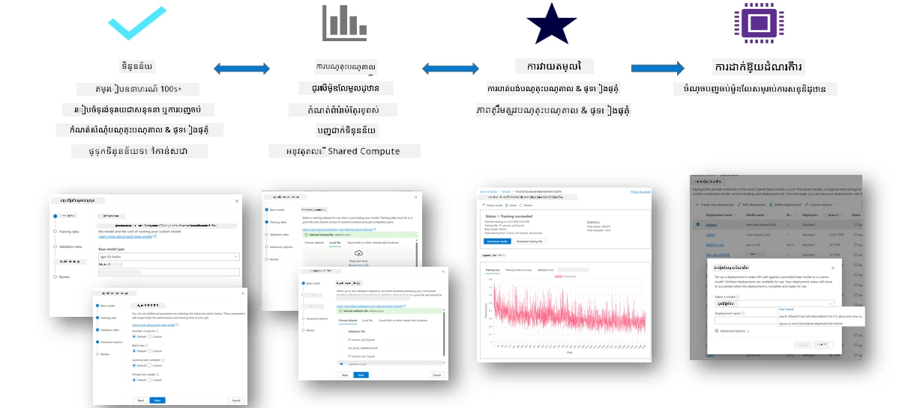

### បង្កើតគម្រោងថ្មី

1. ចូលទៅកាន់ [Microsoft Foundry](https://ai.azure.com)។

1. ជ្រើសរើស **+New project** ដើម្បីបង្កើតគម្រោងថ្មីនៅ Microsoft Foundry។

    

1. ធ្វើការងារដូចខាងក្រោម៖

    - ឈ្មោះ **Hub** ពីគម្រោង។ វាត្រូវតែជាតម្លៃដាច់ដោយឡែក។
    - ជ្រើសរើស **Hub** ដើម្បីប្រើ (បង្កើតថ្មី ប្រសិនបើចាំបាច់)។

    

1. ធ្វើការងារដូចខាងក្រោមដើម្បីបង្កើត hub ថ្មី៖

    - បញ្ចូលឈ្មោះ **Hub**។ វាត្រូវតែជាតម្លៃដាច់ដោយឡែក។
    - ជ្រើសរើស **Subscription** របស់ Azure របស់អ្នក។
    - ជ្រើសរើស **Resource group** ដើម្បីប្រើ (បង្កើតថ្មី ប្រសិនបើចាំបាច់)។
    - ជ្រើសរើស **Location** ដែលអ្នកចង់ប្រើ។
    - ជ្រើសរើស **Connect Azure AI Services** ដើម្បីប្រើ (បង្កើតថ្មី ប្រសិនបើចាំបាច់)។
    - ជ្រើសរើស **Connect Azure AI Search** ដើម្បី **Skip connecting**។

    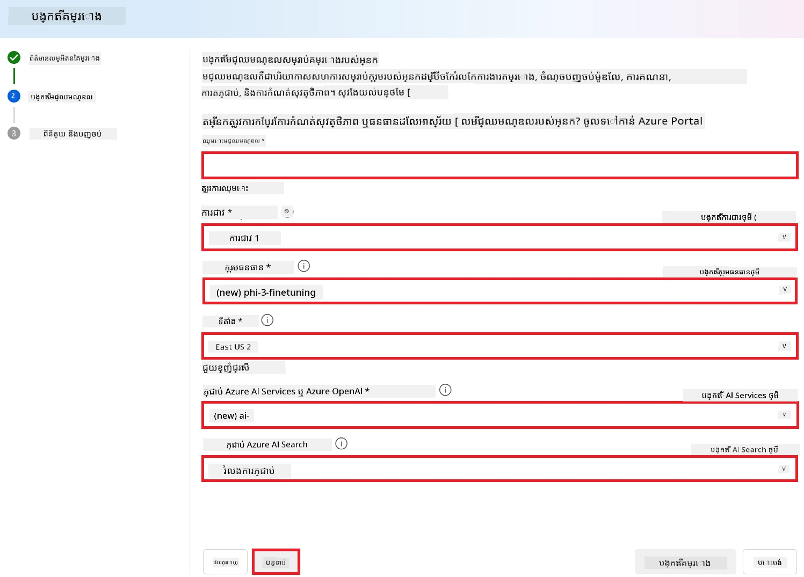

1. ជ្រើសរើស **Next**។
1. ជ្រើសរើស **Create a project**។

### ការរៀបចំទិន្នន័យ

មុនការតម្រូវ សូមប្រមូល ឬបង្កើតសំណុំទិន្នន័យដែលពាក់ព័ន្ធនឹងភារកិច្ចរបស់អ្នក ដូចជា សេចក្ដីណែនាំជជែក, គូសំណួរ-ចម្លើយ, ឬទិន្នន័យអត្ថបទផ្សេងទៀតដែលពាក់ព័ន្ធ។ ត្រូវធ្វើការសម្អាតនិងបូកបញ្ចូលទិន្នន័យនេះ ដោយកំចាត់កំហុស, ការដោះស្រាយតម្លៃខ្វះ, និងបំបែកអត្ថបទឱ្យបានដូចម្ដេចត្រូវ។

### តម្រុយម៉ូដែល Phi-3 ក្នុង Microsoft Foundry

> [!NOTE]
> ការតម្រុយម៉ូដែល Phi-3 ត្រូវបានគាំទ្រនៅគម្រោងដែលស្ថិតនៅក្នុងតំបន់ East US 2 តែប៉ុណ្ណោះ។

1. ជ្រើសរើស **Model catalog** ពីផ្ទាំងខាងឆ្វេង។

1. វាយពាក្យ *phi-3* នៅក្នុង **search bar** ហើយជ្រើសរើសម៉ូដែល phi-3 ដែលអ្នកចង់ប្រើ។

    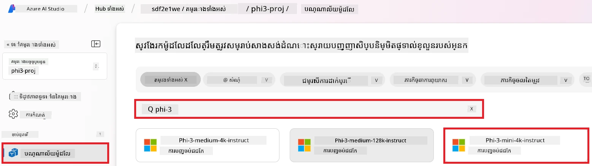

1. ជ្រើសរើស **Fine-tune**។

    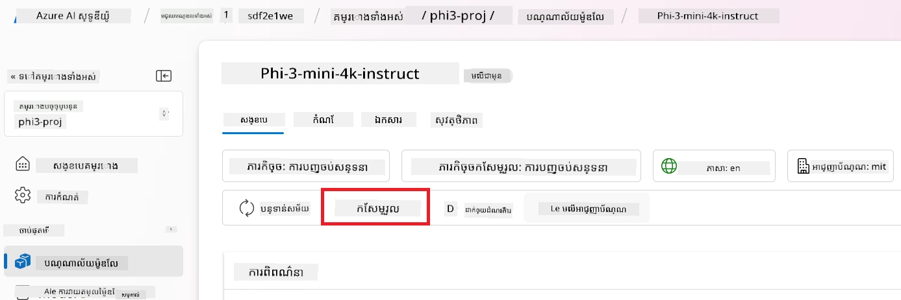

1. បញ្ចូលឈ្មោះ **Fine-tuned model name**។

    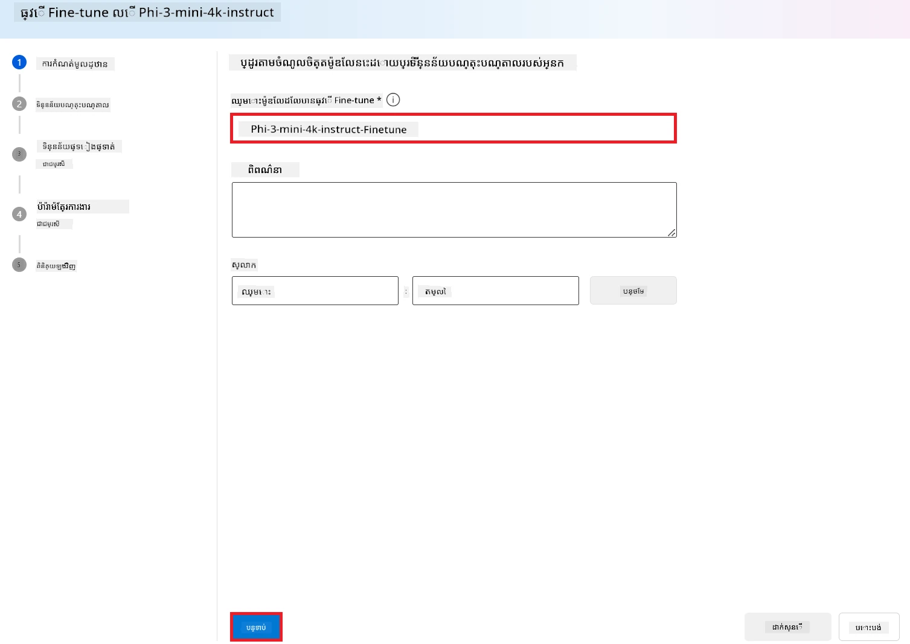

1. ជ្រើសរើស **Next**។

1. ធ្វើការងារដូចខាងក្រោម៖

    - ជ្រើសរើសប្រភេទ **task type** ជា **Chat completion**។
    - ជ្រើសរើស **Training data** ដែលអ្នកចង់ប្រើ។ អ្នកអាចផ្ទុកឡើងតាមទិន្នន័យ Microsoft Foundry ឬពីផ្ទៃតំបន់មូលដ្ឋានរបស់អ្នក។

    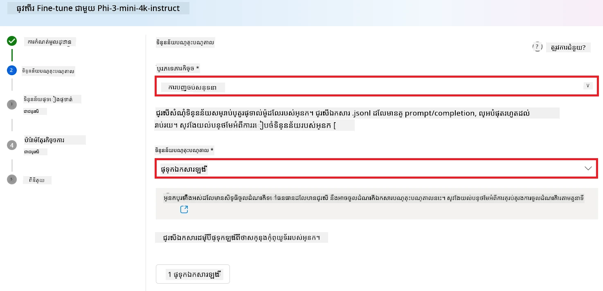

1. ជ្រើសរើស **Next**។

1. ផ្ទុកឡើង **Validation data** ដែលអ្នកចង់ប្រើ។ ឬ អ្នកអាចជ្រើសរើស **Automatic split of training data**។

    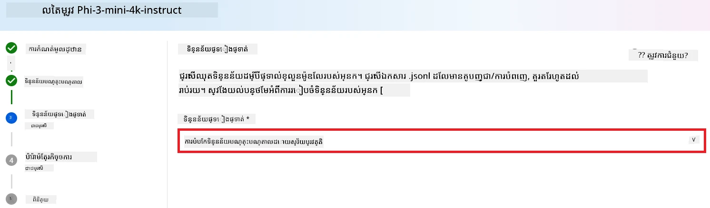

1. ជ្រើសរើស **Next**។

1. ធ្វើការងារដូចខាងក្រោម៖

    - ជ្រើសរើស **Batch size multiplier** ដែលអ្នកចង់ប្រើ។
    - ជ្រើសរើស **Learning rate** ដែលអ្នកចង់ប្រើ។
    - ជ្រើសរើស **Epochs** ដែលអ្នកចង់ប្រើ។

    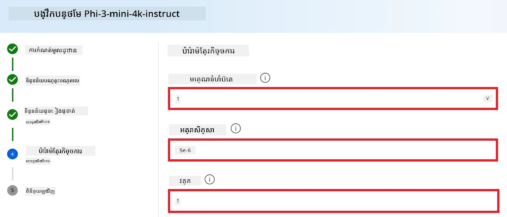

1. ជ្រើសរើស **Submit** ដើម្បីចាប់ផ្តើមដំណើរការតម្រុយ។

    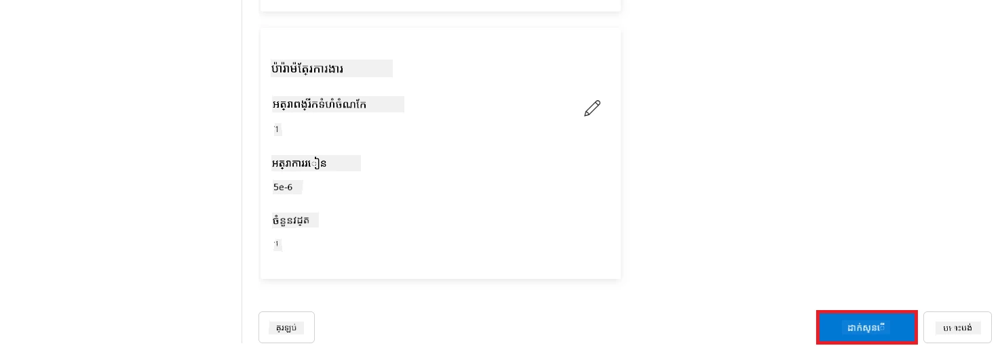


1. ពេលដែលម៉ូដែលរបស់អ្នកត្រូវបានតម្រុយរួច ស្ថានភាពនឹងបង្ហាញថា **Completed** ដូចដែលបង្ហាញនៅក្នុងរូបភាពខាងក្រោម។ ឥឡូវនេះ អ្នកអាចបញ្ចេញម៉ូដែលនិងប្រើវា ក្នុងកម្មវិធីផ្ទាល់ខ្លួន, នៅក្នុងបរិវេណកន្លែងលេង (playground), ឬក្នុង prompt flow។ សម្រាប់ព័ត៌មានបន្ថែម សូមមើល [របៀបបញ្ចេញម៉ូដែលក្នុងក្រុម Phi-3 ជាមួយ Microsoft Foundry](https://learn.microsoft.com/azure/ai-studio/how-to/deploy-models-phi-3?tabs=phi-3-5&pivots=programming-language-python)។

    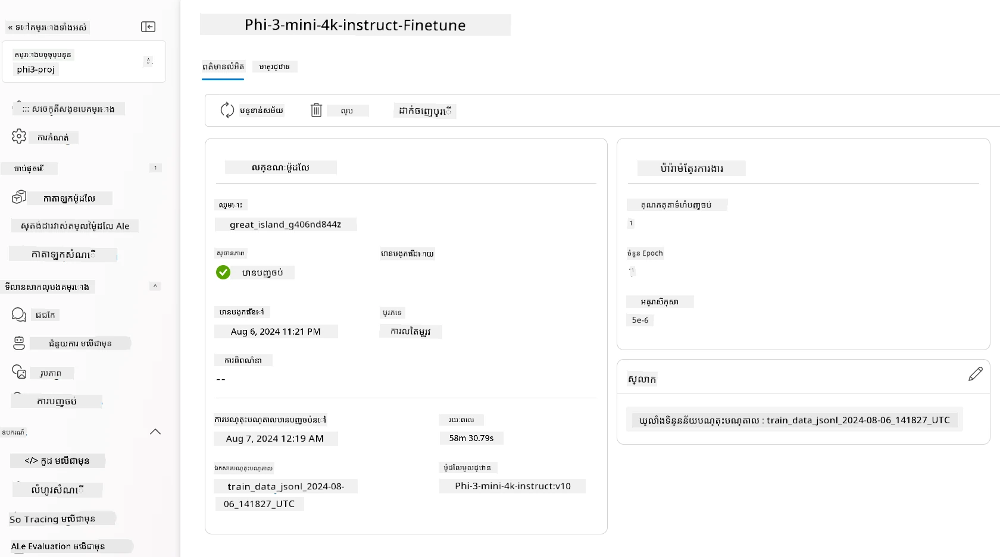

> [!NOTE]
> សម្រាប់ព័ត៌មានលម្អិតបន្ថែមអំពីការតម្រុយ Phi-3, សូមទៅកាន់ [Fine-tune Phi-3 models in Microsoft Foundry](https://learn.microsoft.com/azure/ai-studio/how-to/fine-tune-phi-3?tabs=phi-3-mini)។

## ការសម្អាតម៉ូដែលដែលបានតម្រុយរួច

អ្នកអាចលុបម៉ូដែលដែលបានតម្រុយមួយចេញពីបញ្ជីម៉ូដែលតម្រុយនៅក្នុង [Microsoft Foundry](https://ai.azure.com) ឬពីទំព័រព័ត៌មានម៉ូដែល។ ជ្រើសរើសម៉ូដែលតម្រុយដែលត្រូវលុបនៅលើទំព័រតម្រុយ បន្ទាប់មកជ្រើសរើសប៊ូតុង Delete ដើម្បីលុបម៉ូដែលតម្រុយនេះ។

> [!NOTE]
> អ្នកមិនអាចលុបម៉ូដែលផ្ទាល់ខ្លួន ប្រសិនបើវាមានការបញ្ចេញប្រើរួចហើយ។ ត្រូវលុបការបញ្ចេញម៉ូដែលរបស់អ្នកមុនពេលអាចលុបម៉ូដែលផ្ទាល់ខ្លួនបាន។

## តម្លៃ និងគោលការណ៍កំណត់

### ការពិចារណាថ្លៃ និងគោលការណ៍កំណត់សម្រាប់ម៉ូដែល Phi-3 ដែលត្រូវបានតម្រុយជាសេវា

ម៉ូដែល Phi ត្រូវបានតម្រុយជាសេវាដោយ Microsoft និងរួមបញ្ចូលជាមួយ Microsoft Foundry ដើម្បីប្រើ។ អ្នកអាចមើលតម្លៃនៅពេល [បញ្ចេញ](https://learn.microsoft.com/azure/ai-studio/how-to/deploy-models-phi-3?tabs=phi-3-5&pivots=programming-language-python) ឬតម្រុយម៉ូដែលនៅផ្នែក Pricing and terms នៅក្នុង ដែលមាន wizard បញ្ចេញ។

## សំណល់ការចម្រាស់ខ្លឹមសារ

ម៉ូដែលដែលបានបញ្ចេញជាសេវាជាមួយគ្រប់គ្រងចំណាយនេះ ត្រូវបានការពារដោយ Azure AI Content Safety។ នៅពេលបានបញ្ចេញទៅវេទិកាដំណើរការពេលវេលា​ពិត អ្នកអាចជ្រើសតាមចាកចេញពីមុខងារនេះបាន។ ជាមួយមុខងារ Azure AI Content Safety សកម្ម បញ្ចូលនូវស្នាដៃនៃការបញ្ចូល និងលទ្ធផលត្រូវបានបញ្ជូនតាមដំណើរម៉ូដែលចម្រោះ ការបែងចែកគោលដៅដើម្បីរកឃើញ និងការពារការផលិតខ្លឹមសារមានគ្រោះសម្រាប់ទាំងក្នុងសំណើនិងលទ្ធផលវត្ថុ។ ប្រព័ន្ធចម្រាស់ខ្លឹមសារនេះស្វែងរក និងយកសកម្មភាពលើប្រភេទខ្លឹមសារមានហានិភ័យនៅទាំង Input prompts និង Output completions។ សូមស្វែងយល់បន្ថែមអំពី [Azure AI Content Safety](https://learn.microsoft.com/azure/ai-studio/concepts/content-filtering)។

**ការកំណត់រចនាសម្ព័ន្ធការតម្រុយ**

ប៉ារ៉ាម៉ែត្រ៖ កំណត់ប៉ារ៉ាម៉ែត្រដូចជា Learning rate, ទំហំតំណក់, និងចំនួន epoch ក្នុងការបណ្ដុះបណ្ដាល។

**មុខងារបាត់បង់**

ជ្រើសរើសមុខងារបាត់បង់សមរម្យសម្រាប់ភារកិច្ចរបស់អ្នក (ឧ. cross-entropy)។

**កម្មវិធីបញ្ចេញ Optimizer**

ជ្រើសរើស Optimizer (ឧ. Adam) សម្រាប់កំណែបន្ថែម gradient ក្នុងការបណ្តុះបណ្ដាល។

**ដំណើរការតម្រូយ**

- ផ្ទុកម៉ូដែល Pre-Trained: ផ្ទុក checkpoint របស់ Phi-3 Mini។
- បន្ថែមស្រទាប់ផ្ទាល់ខ្លួន: បន្ថែមស្រទាប់សម្រាប់ភារកិច្ចជាក់លាក់ (ឧ. មុខក្បាល classification សម្រាប់ការណែនាំជជែក)។

**បណ្តុះបណ្ដាលម៉ូដែល**  
តម្រុយម៉ូដែលជាមួយសំណុំទិន្នន័យដែលបានរៀបចំ។ តាមដានការវិវឌ្ឍបណ្តុះបណ្ដាល និងកែសម្រួលប៉ារ៉ាម៉ែត្រយ៉ាងត្រឹមត្រូវ។

**ការវាយតម្លៃ និងការត្រួតពិនិត្យ**

សំណុំត្រួតពិនិត្យ: ចែកទិន្នន័យរបស់អ្នកទៅជាសំណុំបណ្តុះបណ្តាល និងសំណុំត្រួតពិនិត្យ។

**វាយតម្លៃប្រសិទ្ធភាព**

ប្រើមានត្រីកោណមាត្រដូចជា accuracy, F1-score រឺ perplexity ដើម្បីវាយតម្លៃប្រសិទ្ធភាពម៉ូដែល។

## រក្សាទុកម៉ូដែលតម្រុយរួច

**Checkpoint**  
រក្សាទុក checkpoint នៃម៉ូដែលដែលបានតម្រុយសម្រាប់ប្រើបន្តលើ។

## ការបញ្ចេញប្រើ

- បញ្ចេញជាសេវាវេបសាយ: បញ្ចេញម៉ូដែលដែលត្រូវបានតម្រុយជា web service នៅ Microsoft Foundry។
- សាកល្បងវេបសាយ៖ បញ្ចូនសំណួរតេស្តទៅវេបសាយដែលបានបញ្ចេញ ដើម្បីផ្ទៀងផ្ទាត់មុខងារ។

## កែប្រែ និងធ្វើឲ្យប្រសើរឡើង

ធ្វើជាបន្ទន្ទាប់បន្ទាត់៖ ប្រសិនបើប្រសិទ្ធភាពមិនពេញចិត្ត ជ្រើសប៉ារ៉ាម៉ែត្រថ្មី បន្ថែមទិន្នន័យឬតម្រុយបន្ថែមសម្រាប់ epoch បន្ថែម។

## ត្រួតពិនិត្យ និងកែលម្អ

តាមដានជាបន្តបន្ទាប់នូវអាកប្បកិរិយារបស់ម៉ូដែលហើយកែប្រែតាមការតម្រូវ។

## ប្ដូរ និងពង្រីក

ភារកិច្ចផ្ទាល់ខ្លួន៖ Phi-3 Mini អាចត្រូវបានតម្រុយសម្រាប់ភារកិច្ចផ្សេងទៀតក្រៅពីការណែនាំជជែក។ ស្វែងរកករណីប្រើប្រាស់ផ្សេងទៀត!  
សាកល្បង៖ ព្យាយាមអាគិចតិចចមთხვევ, រួមផ្សំនៃស្រទាប់, និងបច្ចេកទេសដើម្បីបន្ថែមប្រសិទ្ធភាព។

> [!NOTE]
> ការតម្រុយគឺជាដំណើរការក្រោមគ្នា។ សាកល្បង រៀន ហើយប្ដូរម៉ូដែលរបស់អ្នកដើម្បីទទួលបានលទ្ធផលល្អបំផុតសម្រាប់ភារកិច្ចជាក់លាក់របស់អ្នក!

---

<!-- CO-OP TRANSLATOR DISCLAIMER START -->
**ការបដិសេធ**:  
ឯកសារនេះត្រូវបានបកប្រែដោយប្រើសេវាកម្មបកប្រែ AI [Co-op Translator](https://github.com/Azure/co-op-translator) ។ ខណៈពេលដែលយើងខិតខំរកភាពត្រឹមត្រូវ សូមយកចិត្តទុកដាក់ថាការបកប្រែដោយស្វ័យប្រវត្តិអាចមានកំហុស ឬមិនត្រឹមត្រូវ។ ឯកសារដើមជាភាសាដើមគួរត្រូវបានគិតថាជាឯកសារដែលមានអំណាចជាដើម។ សម្រាប់ព័ត៌មានសំខាន់ អ្នកគួរតែប្រើការបកប្រែដោយមនុស្សជំនាញ។ យើងមិនទទួលខុសត្រូវចំពោះការយល់ច្រឡំហ ឬការបកស្រាយខុសណាមួយដែលកើតមានពីការប្រើប្រាស់ការបកប្រែនេះឡើយ។
<!-- CO-OP TRANSLATOR DISCLAIMER END -->