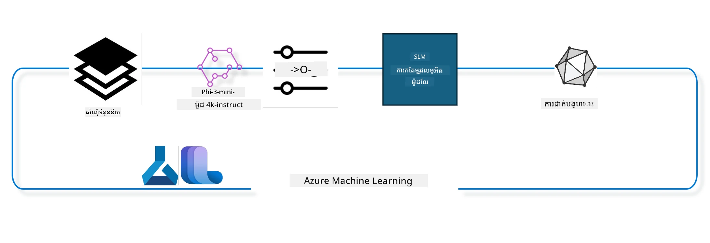

## របៀបប្រើធាតុ chat-completion ពី Azure ML system registry ដើម្បីបន្ទាន់សម្រួលម៉ូដែល

ក្នុងឧទាហរណ៍នេះ យើងនឹងធ្វើការបន្ទាន់សម្រួលម៉ូដែល Phi-3-mini-4k-instruct ដើម្បីបំពេញការសន្ទនារវាងមនុស្ស ២ នាក់ដោយប្រើបណ្ណាល័យ ultrachat_200k ។



ឧទាហរណ៍នេះនឹងបង្ហាញអ្នកពីរបៀបធ្វើ fine tuning ដោយប្រើ Azure ML SDK និង Python ហើយបន្ទាប់មកដាក់បញ្ចូលម៉ូដែលបានគេ fine tuned ទៅកាន់ endpoint អនឡាញសម្រាប់ការព្យាករណ៍ពេលវេលាពិតប្រាកដ។

### ទិន្នន័យបណ្តុះបណ្តាល

យើងនឹងប្រើបណ្ណាល័យ ultrachat_200k។ នេះគឺជាកំណែដែលបានតម្រៀបយ៉ាងខ្លាំងពីបណ្ណាល័យ UltraChat ហើយត្រូវបានប្រើសម្រាប់បណ្តុះបណ្តាល Zephyr-7B-β ដែលជាម៉ូដែល chat 7b ចុងក្រោយបច្ចេកវិទ្យា។

### ម៉ូដែល

យើងនឹងប្រើម៉ូដែល Phi-3-mini-4k-instruct ដើម្បីបង្ហាញរបៀបដែលអ្នកអាច fine-tune ម៉ូដែលសម្រាប់ភារកិច្ច chat-completion។ ប្រសិនបើអ្នកបានបើកកំណត់ត្រានេះពីបណ្ណាញម៉ូដែលជាក់លាក់ សូមចងចាំផ្លាស់ប្តូរឈ្មោះម៉ូដែលជាក់លាក់នេះ។

### ភារកិច្ច

- ជ្រើសរើសម៉ូដែលសម្រាប់ fine tune។
- ជ្រើសរើស និងស្វែងយល់ពីទិន្នន័យបណ្តុះបណ្តាល។
- កំណត់ការងារ fine tuning។
- ប្រតិបត្តិការងារ fine tuning។
- ពិនិត្យមើលមេត្រិចបណ្តុះបណ្តាល និងវាយតម្លៃ។
- ចុះបញ្ជីម៉ូដែលបាន fine tune។
- ដាក់បញ្ចូលម៉ូដែលបាន fine tune សម្រាប់ការព្យាករណ៍ពេលវេលាពិតប្រាកដ។
- លុបធនធាន។

## 1. រៀបចំតម្រូវការជាមុន

- ធ្វើការដំឡើងតម្រូវការ
- តភ្ជាប់ទៅកាន់ AzureML Workspace។ សូមរៀនបន្ថែមនៅការតំឡើង SDK authentication។ ផ្លាស់ប្តូរ <WORKSPACE_NAME>, <RESOURCE_GROUP> និង <SUBSCRIPTION_ID> ខាងក្រោម។
- តភ្ជាប់ទៅកាន់ azureml system registry
- កំណត់ឈ្មោះការប្រឡងជាជម្រើស
- ពិនិត្យឬបង្កើត compute ។

> [!NOTE]
> តម្រូវការមាន node GPU តែមួយអាចមានកាត GPU ច្រើន។ ឧទាហរណ៍ នៅក្នុង node មួយនៃ Standard_NC24rs_v3 មានកាត NVIDIA V100 GPU 4 ខ្នង ខណៈដែលនៅ Standard_NC12s_v3 មានចំនួន 2 NVIDIA V100 GPU។ សូមយោងទៅឯកសារសម្រាប់ព័ត៌មាននេះ។ ចំនួនកាត GPU ក្នុង node ត្រូវបានកំណត់ក្នុងប៉ារ៉ាមម៉ែត្រ gpus_per_node ខាងក្រោម។ ការកំណត់តម្លៃនេះត្រឹមត្រូវ នឹងធានាថាប្រើប្រាស់ GPU ទាំងអស់ក្នុង node។ SKU គណនា GPU ដែលបានផ្ដល់អនុសាសន៍ អាចរកបាននៅទីនេះ និងទីនេះ។

### បណ្ណាល័យ Python

ធ្វើការដំឡើងតម្រូវការដោយរត់កូដខាងក្រោម។ នេះមិនមែនជជម្រើសទេ ប្រសិនបើរត់នៅបរិវេណថ្មី។

```bash
pip install azure-ai-ml
pip install azure-identity
pip install datasets==2.9.0
pip install mlflow
pip install azureml-mlflow
```

### ប្រតិបត្តិការជាមួយ Azure ML

1. ស្គ្រីប Python នេះត្រូវបានប្រើសម្រាប់ប្រតិបត្តិការជាមួយសេវាកម្ម Azure Machine Learning (Azure ML)។ នេះជាការបំបែកលម្អិតនូវអ្វីដែលវាធ្វើ៖

    - វាណាំចូលមូឌុលដែលបានតម្រូវពី azure.ai.ml, azure.identity, និង អនុគមន៍ azure.ai.ml.entities។ វានាំចូលតែមូឌុល time ផងដែរ។

    - វាព្យាយាមធ្វើ authentication ដោយប្រើ DefaultAzureCredential() ដែលផ្តល់បទពិសោធន៍ authentication ងាយស្រួលសម្រាប់ការចាប់ផ្តើមបង្កើតកម្មវិធី បញ្ជាក់ក្នុង Azure cloud។ ប្រសិនបើបរាជ័យ វានឹងបន្ដទៅកន្លែងដំណើរការចូលប្រព័ន្ធ InteractiveBrowserCredential() ដែលផ្ដល់ prompt ចូលដោយអន្តរកម្ម។

    - រួចវានឹងព្យាយាមបង្កើតឧបករណ៍ MLClient ដោយប្រើវិធីសាស្រ្ត from_config ដែលអានការកំណត់ពីឯកសារ config មួួយ (config.json)។ ប្រសិនបើបរាជ័យ វានឹងបង្កើត MLClient ដោយផ្ដល់ព័ត៌មាន subscription_id, resource_group_name, និង workspace_name តាមដៃ។

    - វាបង្កើត MLClient មួយទៀត សម្រាប់ registry Azure ML ឈ្មោះ "azureml"។ registry នេះជាទីតាំងរក្សាប្រមូលម៉ូដែល, បំពង់ fine-tuning, និងបរិស្ថាន។

    - វាកំណត់ experiment_name ជា "chat_completion_Phi-3-mini-4k-instruct"។

    - វាបង្កើត timestamp មួយចម្លែក ដោយបម្លែងពេលវេលាបច្ចុប្បន្ន (ជាវិនាទីក depuis epoch, ជាចំនួនទសភាគ) ទៅជា int រួចបម្លែងទៅជា string។ timestamp នេះអាចប្រើសម្រាប់បង្កើតឈ្មោះ និង គម្លាតប្លែកៗ។

    ```python
    # នាំចូលម៉ូឌុលដែលចាំបាច់ពី Azure ML និង Azure Identity
    from azure.ai.ml import MLClient
    from azure.identity import (
        DefaultAzureCredential,
        InteractiveBrowserCredential,
    )
    from azure.ai.ml.entities import AmlCompute
    import time  # នាំចូលម៉ូឌុលពេលវេលា
    
    # ព្យាយាមផ្ទៀងផ្ទាត់ដោយប្រើ DefaultAzureCredential
    try:
        credential = DefaultAzureCredential()
        credential.get_token("https://management.azure.com/.default")
    except Exception as ex:  # ប្រសិនបើ DefaultAzureCredential បរាជ័យ ចូរប្រើ InteractiveBrowserCredential
        credential = InteractiveBrowserCredential()
    
    # ព្យាយាមបង្កើតអ实例idence MLClient ដោយប្រើឯកសារកំណត់រចនាសម្ព័ន្ធលំនាំដើម
    try:
        workspace_ml_client = MLClient.from_config(credential=credential)
    except:  # ប្រសិនបើបរាជ័យ ចូរបង្កើតអ实例idence MLClient ដោយផ្ដល់ព័ត៌មានដោយដៃ
        workspace_ml_client = MLClient(
            credential,
            subscription_id="<SUBSCRIPTION_ID>",
            resource_group_name="<RESOURCE_GROUP>",
            workspace_name="<WORKSPACE_NAME>",
        )
    
    # បង្កើតអ实例idence MLClient ផ្សេងទៀតសម្រាប់របារភាព Azure ML ដែលមានឈ្មោះ "azureml"
    # របារភាពនេះគឺជកន្លែងផ្ទុកម៉ូដែល ទន្លឹមបញ្ចូល និងបរិយាកាស
    registry_ml_client = MLClient(credential, registry_name="azureml")
    
    # កំណត់ឈ្មោះសាកល្បង
    experiment_name = "chat_completion_Phi-3-mini-4k-instruct"
    
    # បង្កើតពេលវេលាដែលមានភាពមិន​ដូចគ្នា ដែលអាចប្រើសម្រាប់ឈ្មោះនិងកំណែដែលត្រូវមានភាពមិន​ដូចគ្នា
    timestamp = str(int(time.time()))
    ```

## 2. ជ្រើសរើសម៉ូដែលមូលដ្ឋានសម្រាប់ fine tune

1. Phi-3-mini-4k-instruct គឺជាម៉ូដែលដែលមាន 3.8B parameters, មានទម្ងន់ស្រាល, និងឈានមុខបច្ចេកវិទ្យា ដែលបានបង្កើតលើ datasets ប្រើសម្រាប់ Phi-2។ ម៉ូដែលនេះជាគ្រួសារម៉ូដែល Phi-3 ហើយវាផ្តល់ជាកំណែ Mini ចំនួនពីរដែលមាន context length (ជាចំនួន token) គឺ 4K និង 128K ដែលសម្រង់បាន។ យើងត្រូវការធ្វើ fine tune ម៉ូដែលសម្រាប់គោលបំណងជាក់លាក់របស់យើង។ អ្នកអាចស្វែងរកម៉ូដែលទាំងនេះក្នុងប្រព័ន្ធ Model Catalog របស់ AzureML Studio ដោយបំណងតាមភារកិច្ច chat-completion។ ក្នុងឧទាហរណ៍នេះ យើងប្រើម៉ូដែល Phi-3-mini-4k-instruct។ ប្រសិនបើអ្នកបានបើកកំណត់ត្រានេះសម្រាប់ម៉ូដែលផ្សេងទៀត សូមប្រើប្រាស់ឈ្មោះម៉ូដែល និងកំណែដែលចាំបាច់។

> [!NOTE]
> អចលនវត្ថុ id នៃម៉ូដែលនេះ។ វានឹងត្រូវផ្គាប់ជាអីនប៊ុតទៅកាន់ការងារប្រើ fine tuning។ វាក៏មានក្នុងប្រអប់ Asset ID នៅលើទំព័រព័ត៌មានម៉ូដែលក្នុង AzureML Studio Model Catalog ផងដែរ។

2. ស្គ្រីប Python នេះប្រតិបត្តិការជាមួយសេវាកម្ម Azure Machine Learning (Azure ML)។ នេះជាការបំបែកបន្ថែមអំពីអ្វីដែលវាធ្វើ៖

    - វាកំណត់ model_name ជា "Phi-3-mini-4k-instruct"។

    - វាប្រើវិធីសាស្រ្ត get នៃអចលនវត្ថុ models របស់ registry_ml_client ដើម្បីទាញយកកំណែបច្ចុប្បន្នបំផុតនៃម៉ូដែលដែលមានឈ្មោះនោះពី registry Azure ML ។ វាអំពាវនាវ get ជាមួយអាគុយម៉ង់ពីរគឺឈ្មោះម៉ូដែល និងស្លាកសម្រាប់បញ្ជាក់ថាត្រូវទាញយកកំណែបច្ចុប្បន្នបំផុតនៃម៉ូដែល។

    - វាផ្ដល់សារទៅ console បង្ហាញឈ្មោះ, កំណែ, និង id នៃម៉ូដែលដែលនឹងប្រើសម្រាប់ fine-tuning។ វាប្រើវិធីសាស្រ្ត format នៃ string ដើម្បីបញ្ចូលឈ្មោះ, កំណែ និង id ក្នុងសារនេះ។ ឈ្មោះ, កំណែ និង id ត្រូវបានស្មបញ្ចូលជាគុណលក្ខណៈរបស់ foundation_model។

    ```python
    # កំណត់ឈ្មោះម៉ូឌែល
    model_name = "Phi-3-mini-4k-instruct"
    
    # ទទួលយកកំណែចុងក្រោយនៃម៉ូឌែលពីทะเบียน Azure ML
    foundation_model = registry_ml_client.models.get(model_name, label="latest")
    
    # បង្ហាញឈ្មោះម៉ូឌែល កំណែ និងអត្តសញ្ញាណ
    # ព័ត៌មាននេះមានប្រយោជន៍សម្រាប់តាមដាន និងដោះស្រាយបញ្ហា
    print(
        "\n\nUsing model name: {0}, version: {1}, id: {2} for fine tuning".format(
            foundation_model.name, foundation_model.version, foundation_model.id
        )
    )
    ```

## 3. បង្កើតគណនា (compute) សម្រាប់ប្រើជាមួយការងារ

ការងារ fine tune ដំណើរការតែជាមួយគណនាគ្រាប់កុំព្យូទ័រ GPU ប៉ុណ្ណោះ។ ទំហំគណនាគឺអាស្រ័យលើទំហំម៉ូដែល ហើយភាគច្រើនវាមានកម្រិតច្របូកច្របល់ក្នុងការជ្រើសរើសគណនាដែលត្រឹមត្រូវសម្រាប់ការងារ។ ក្នុងកូដនេះ យើងណែនាំអ្នកជ្រើសរើសគណនាដែលល្អសម្រាប់ការងារ។

> [!NOTE]
> គណនាដែលបញ្ជីខាងក្រោមដំណើរការជាមួយកំណត់រចនាសម្ព័ន្ធដែលមានប្រសិទ្ធភាពបំផុត។ ការផ្លាស់ប្តូរណាមួយក្នុងរចនាសម្ព័ន្ធអាចនាំឲ្យកើតកំហុស Cuda Out Of Memory។ ក្នុងករណីទាំងនោះ សូមព្យាយាមលើកកំពស់គណនាទៅទំហំធំជាង៕

> [!NOTE]
> នៅពេលជ្រើសរើស compute_cluster_size ខាងក្រោម សូមធានាថាគណនានោះមាននៅក្នុងក្រុមធនធានរបស់អ្នក។ ប្រសិនបើគណនាមួយមិនមាន អ្នកអាចស្នើសុំការចូលប្រើធនធានគណនា។

### ពិនិត្យម៉ូដែលសម្រាប់ការគាំទ្រការបណ្តុះបណ្តាលបន្ទាន់ (fine tuning)

1. ស្គ្រីប Python នេះប្រតិបត្តិការជាមួយម៉ូដែល Azure Machine Learning (Azure ML)។ នេះជាការបំបែកអ្វីដែលវាធ្វើ៖

    - វានាំចូលបណ្ណាល័យ ast ដែលផ្ដល់មុខងារសម្រាប់ដំណើរការទ្រឹស្តីវង់អក្សរកម្មវិធី Python។

    - វាពិនិត្យថា foundation_model (ដែលតំណាងឲ្យម៉ូដែលមួយនៅក្នុង Azure ML) មាន tag ឈ្មោះ finetune_compute_allow_list ឬទេ។ tag នៅ Azure ML គឺជាគូទៅ-ស្ដើងដែលអ្នកអាចបង្កើត និងប្រើសម្រាប់តម្រៀប និងចម្រាញ់ម៉ូដែល។

    - ប្រសិនបើមាន tag finetune_compute_allow_list វាប្រើ ast.literal_eval ដើម្បីវាយតម្លៃតម្លៃ tag (ជា string) ឲ្យទៅជា list ជាផ្លូវការនៃ Python ហើយកំណត់ទៅគូអរដោនេ compute_allow_list។ រួចវាបញ្ជាក់ថាគួរតែបង្កើត compute ពីបញ្ជីមួយ។

    - ប្រសិនបើ tag finetune_compute_allow_list មិនមាន វាកំណត់ compute_allow_list ជា None ហើយផ្តល់សារថា tag នេះមិនស្ថិតក្នុង tag របស់ម៉ូដែល។

    - សង្ខេបស្គ្រីបនេះពិនិត្យ tag មួយជាក់លាក់ក្នុងមេតាដាតាក្នុងម៉ូដែល បម្លែងតម្លៃ tag ទៅជា list ប្រសិនបើមាន ហើយផ្តល់មតិប្រតិកម្មទៅអ្នកប្រើប្រាស់។

    ```python
    # នាំចូល​ម៉ូឌុល ast ដែលផ្ដល់អនុគមន៍សម្រាប់ដំណើរការទំរង់ដើមនៃវេយ្យាករណ៍ទន់ភាសា Python
    import ast
    
    # ពិនិត្យមើលថាតើស្លាក 'finetune_compute_allow_list' មានក្នុងស្លាករបស់ម៉ូដែលឬអត់
    if "finetune_compute_allow_list" in foundation_model.tags:
        # ប្រសិនបើស្លាកមាន ប្រើ ast.literal_eval ដើម្បីវាយតម្លៃតម្លៃស្លាក (ជា string) ឲ្យបានយ៉ាងមានសុវត្ថិភាពទៅជា បញ្ជី Python
        computes_allow_list = ast.literal_eval(
            foundation_model.tags["finetune_compute_allow_list"]
        )  # បម្លែង string ទៅបញ្ជី python
        # បោះពុម្ពសារបង្ហាញថា គួរតែបង្កើត compute ពីបញ្ជីនេះ
        print(f"Please create a compute from the above list - {computes_allow_list}")
    else:
        # ប្រសិនបើស្លាកមិនមាន កំណត់ computes_allow_list ទៅ None
        computes_allow_list = None
        # បោះពុម្ពសារបង្ហាញថា ស្លាក 'finetune_compute_allow_list' មិនមែនជាមួយនឹងស្លាករបស់ម៉ូដែលក៏ប៉ុនោះទេ
        print("`finetune_compute_allow_list` is not part of model tags")
    ```

### ពិនិត្យ Compute Instance

1. ស្គ្រីប Python នេះប្រតិបត្តិការជាមួយ Azure Machine Learning (Azure ML) ហើយបង្កើតការត្រួតពិនិត្យច្រើនលើ compute instance មួយ។ នេះជាការបំបែកអ្វីដែលវា​ធ្វើ៖

    - វាព្យាយាមទាញយក compute instance ដែលមានឈ្មោះ compute_cluster ពី Azure ML workspace។ ប្រសិនបើ provisioning state របស់ compute instance ជា "failed" វានឹងបង្កើតកំហុស ValueError ។

    - វាពិនិត្យថា computes_allow_list មិនមែន None។ ប្រសិនបើមិនមែន វាបម្លែងទំហំ compute ទាំងអស់ក្នុងបញ្ជីគ្រប់គ្រងទៅជា case lowercase ហើយពិនិត្យថាទំហំ compute instance បច្ចុប្បន្នមាននៅក្នុងបញ្ជីនោះ។ ប្រសិនបើមិនមាន វានឹងបង្កើតកំហុស ValueError ។

    - ប្រសិនបើ computes_allow_list ជា None វាពិនិត្យទំហំ compute instance បច្ចុប្បន្នមើលថាតើគឺនៅក្នុងបញ្ជី GPU VM ទំហំមិនគាំទ្រឬទេ។ ប្រសិនបើមាន វានឹងបង្កើតកំហុស ValueError ។

    - វានាំចេញបញ្ជីទំហំ compute ទាំងអស់ដែលមាននៅក្នុង workspace ហើយវិតាមបញ្ជីនោះ សម្រាប់ទំហំ compute នីមួយៗ វាពិនិត្យឈ្មោះជាមួយទំហំ compute instance បច្ចុប្បន្ន។ ប្រសិនបើកើតមាន វាទាញយកចំនួន GPU នៃ compute នោះ និងកំណត់ gpu_count_found ជា True ។

    - ប្រសិនបើ gpu_count_found ជា True វាបង្ហាញចំនួន GPU នៅក្នុង compute instance។ ប្រសិនបើ gpu_count_found ជា False វានឹងបង្កើតកំហុស ValueError ។

    - សង្ខេប វាសកម្មភាពត្រួតពិនិត្យជាច្រើនលើ compute instance ក្នុង Azure ML workspace រួមមាន ពិនិត្យ provisioning state, ទំហំ instance ទល់នឹងបញ្ជីអនុញ្ញាត ឬ បញ្ជីច្រានចោល, និងចំនួន GPU មាន។

    ```python
    # បោះពុម្ពសារការព្យួរ
    print(e)
    # បញ្ចេញកំហុស ValueError ប្រសិនបើទំហំកំណត់គណនានៅក្នុងកន្លែងធ្វើការ​មិនមាន
    raise ValueError(
        f"WARNING! Compute size {compute_cluster_size} not available in workspace"
    )
    
    # ទាញយកឧបករណ៍គណនាពីកន្លែងធ្វើការ Azure ML
    compute = workspace_ml_client.compute.get(compute_cluster)
    # ពិនិត្យមើលថា ស្ថានភាពផ្គត់ផ្គង់របស់ឧបករណ៍គណនាមាន "បរាជ័យ" ទេឬไม่
    if compute.provisioning_state.lower() == "failed":
        # បញ្ចេញកំហុស ValueError ប្រសិនបើស្ថានភាពផ្គត់ផ្គង់គឺ "បរាជ័យ"
        raise ValueError(
            f"Provisioning failed, Compute '{compute_cluster}' is in failed state. "
            f"please try creating a different compute"
        )
    
    # ពិនិត្យមើលថា computes_allow_list មិនមែនជា None
    if computes_allow_list is not None:
        # បម្លែងទំហំគណនាទាំងអស់ក្នុង computes_allow_list ទៅជាអក្សរតូច
        computes_allow_list_lower_case = [x.lower() for x in computes_allow_list]
        # ពិនិត្យថាទំហំឧបករណ៍គណនាមាននៅក្នុង computes_allow_list_lower_case ឬអត់
        if compute.size.lower() not in computes_allow_list_lower_case:
            # បញ្ចេញកំហុស ValueError ប្រសិនបើទំហំឧបករណ៍គណនាមិនមាននៅក្នុង computes_allow_list_lower_case
            raise ValueError(
                f"VM size {compute.size} is not in the allow-listed computes for finetuning"
            )
    else:
        # កំណត់បញ្ជីទំហំ GPU VM មិនគាំទ្រ
        unsupported_gpu_vm_list = [
            "standard_nc6",
            "standard_nc12",
            "standard_nc24",
            "standard_nc24r",
        ]
        # ពិនិត្យថាទំហំឧបករណ៍គណនាមាននៅក្នុង unsupported_gpu_vm_list ឬអត់
        if compute.size.lower() in unsupported_gpu_vm_list:
            # បញ្ចេញកំហុស ValueError ប្រសិនបើទំហំឧបករណ៍គណនាមាននៅក្នុង unsupported_gpu_vm_list
            raise ValueError(
                f"VM size {compute.size} is currently not supported for finetuning"
            )
    
    # ចាប់ផ្តើមគោលបំណងមួយសម្រាប់ពិនិត្យថាចំនួន GPU នៅក្នុងឧបករណ៍គណនាត្រូវបានរកឃើញ
    gpu_count_found = False
    # ទាញយកបញ្ជីទំហំគណនាដែលមាននៅក្នុងកន្លែងធ្វើការ
    workspace_compute_sku_list = workspace_ml_client.compute.list_sizes()
    available_sku_sizes = []
    # ស្វែងរកតាមបញ្ជីទំហំគណនាដែលមាន
    for compute_sku in workspace_compute_sku_list:
        available_sku_sizes.append(compute_sku.name)
        # ពិនិត្យថាឈ្មោះទំហំគណនាអាចត្រូវនឹងទំហំឧបករណ៍គណនាទេ
        if compute_sku.name.lower() == compute.size.lower():
            # ប្រសិនបើត្រូវ, ទាញយកចំនួន GPU សម្រាប់ទំហំគណនានោះ ហើយកំណត់ gpu_count_found ទៅ True
            gpus_per_node = compute_sku.gpus
            gpu_count_found = True
    # ប្រសិនបើ gpu_count_found គឺ True, បោះពុម្ពចំនួន GPU នៅក្នុងឧបករណ៍គណនាឡើងវិញ
    if gpu_count_found:
        print(f"Number of GPU's in compute {compute.size}: {gpus_per_node}")
    else:
        # ប្រសិនបើ gpu_count_found គឺ False, បញ្ចេញកំហុស ValueError
        raise ValueError(
            f"Number of GPU's in compute {compute.size} not found. Available skus are: {available_sku_sizes}."
            f"This should not happen. Please check the selected compute cluster: {compute_cluster} and try again."
        )
    ```

## 4. ជ្រើសរើស dataset សម្រាប់ fine-tuning ម៉ូដែល

1. យើងប្រើ dataset ultrachat_200k។ Dataset មានបីចែក ច្រើនសមរម្យសម្រាប់ Supervised fine-tuning (sft)។
Generation ranking (gen)។ ចំនួនឧទាហរណ៍ក្នុងចំណែកបង្ហាញដូចខាងក្រោម៖

    ```bash
    train_sft test_sft  train_gen  test_gen
    207865  23110  256032  28304
    ```

1. កូដបន្ទាប់បង្ហាញពីការរៀបចំទិន្នន័យមូលដ្ឋានសម្រាប់ fine tuning៖

### វិចិត្រសិល្ប៏របស់ជួរទិន្នន័យខ្លះៗ

យើងចង់ឲ្យគំរូនេះរត់យ៉ាងលឿន ដូច្នេះសូមរក្សាទុកកឯកសារ train_sft, test_sft មានបរិមាណ 5% នៃជួរដែលបាន Trim រួចមក។ នេះមានន័យថា ម៉ូដែលដែលបាន fine tuned នឹងមានភាពត្រឹមត្រូវទាប ដូច្នេះគួរមិនប្រើសម្រាប់ការប្រើប្រាស់ពិត។

script download-dataset.py ត្រូវបានប្រើសម្រាប់ទាញយក dataset ultrachat_200k ហើយបម្លែង dataset ទៅក្នុងទ្រង់ទ្រាយដែលអាចប្រើបានសម្រាប់ pipeline fine tune។ ព្រោះ dataset មានទំហំព្លេច យើងទទួលបានតែផ្នែកមួយនៃ dataset តែប៉ុណ្ណោះ។

1. រត់ script ខាងក្រោម គ្រាន់តែទាញយកទិន្នន័យ 5% ប៉ុណ្ណោះ។ អាចបង្កើនដោយផ្លាស់ប្តូរប៉ារ៉ាម៉ែត្រ dataset_split_pc ទៅតាមភាគរយដែលចង់បាន។

> [!NOTE]
> ម៉ូដែលភាសាខ្លះមានកូដភាសាផ្សេងៗ ហើយដូច្នេះឈ្មោះជួរដេតានៅក្នុង dataset គួរតែផ្ទៀងផ្ទាត់ស្របទៅនឹងកូដភាសាចាស់។

1. នេះជាគំរូរបស់ទិន្នន័យដែលគួរតែមាន
dataset chat-completion ត្រូវបានរក្សាទុកជាទ្រង់ទ្រាយ parquet ដោយការចូលត ប្រើ schema ខាងក្រោម៖

    - នេះជាបទបិទ-json (JavaScript Object Notation) ដែលជារបៀបល្បីសម្រាប់ប្ដូរទិន្នន័យ។ វាមិនមែនជាកូដអាចប្រតិបត្តិបានទេ ប៉ុន្តែជារបៀបរក្សាទុក និងដឹកជញ្ជូនទិន្នន័យ។ នេះជាការបង្ហាញរចនាសម្ព័ន្ធរបស់វា៖

    - "prompt": កូនសោនេះមានតំម្លៃ string ជារឿងចំពោះភារកិច្ច ឬសំណួរដែលផ្ដល់ទៅកម្មវិធី AI។

    - "messages": កូនសោនេះមានអារេនៃវត្ថុ។ វត្ថុគ្រប់មួយតំណាងឲ្យសារមួយក្នុងការសន្ទនា រវាងអ្នកប្រើ និងប្រព័ន្ធជំនួយ AI។ សារនីមួយៗមានគូនៃសោ៖

    - "content": សារស្ទឹងតម្លៃ string របស់មាតិកាសារនោះ។
    - "role": សារស្ទឹងតម្លៃ string ដែលបង្ហាញតួនាទីរបស់អ្នដែលផ្ញើសារ (អាចជា "user" រឺ "assistant")។
    - "prompt_id": សារស្ទឹងតម្លៃ string ដែលជាអត្តសញ្ញាណប្លែកសម្រាប់ prompt នោះ។

1. ក្នុងឯកសារ JSON ជាក់លាក់នេះ ការសន្ទនាត្រូវបានតំណាងដោយអ្នកប្រើសួរឱ្យ AI សាជាតិផ្គើតបុគ្គលភាគីសំខាន់សម្រាប់រឿង dystopian។ ជំនួយការ ឆ្លើយតបហើយអ្នកប្រើសុំព័ត៌មានលម្អិតបន្ថែម។ ជំនួយការ ព្រមទទួលផ្តល់ព័ត៌មានលម្អិតបន្ថែម។ ការសន្ទនាទាំងមូលត្រូវបានភ្ជាប់ជាមួយ prompt id ជាក់លាក់។

    ```python
    {
        // The task or question posed to an AI assistant
        "prompt": "Create a fully-developed protagonist who is challenged to survive within a dystopian society under the rule of a tyrant. ...",
        
        // An array of objects, each representing a message in a conversation between a user and an AI assistant
        "messages":[
            {
                // The content of the user's message
                "content": "Create a fully-developed protagonist who is challenged to survive within a dystopian society under the rule of a tyrant. ...",
                // The role of the entity that sent the message
                "role": "user"
            },
            {
                // The content of the assistant's message
                "content": "Name: Ava\n\n Ava was just 16 years old when the world as she knew it came crashing down. The government had collapsed, leaving behind a chaotic and lawless society. ...",
                // The role of the entity that sent the message
                "role": "assistant"
            },
            {
                // The content of the user's message
                "content": "Wow, Ava's story is so intense and inspiring! Can you provide me with more details.  ...",
                // The role of the entity that sent the message
                "role": "user"
            }, 
            {
                // The content of the assistant's message
                "content": "Certainly! ....",
                // The role of the entity that sent the message
                "role": "assistant"
            }
        ],
        
        // A unique identifier for the prompt
        "prompt_id": "d938b65dfe31f05f80eb8572964c6673eddbd68eff3db6bd234d7f1e3b86c2af"
    }
    ```

### ទាញយកទិន្នន័យ

1. ស្គ្រីប Python នេះត្រូវបានប្រើសម្រាប់ទាញយក dataset ដោយប្រើ script ជំនួយមួយឈ្មោះ download-dataset.py។ នេះជាការបំបែកអ្វីដែលវាធ្វើ៖

    - វានាំចូលមូឌុល os ដែលផ្ដល់មុខងារភ្ជាប់ដោយអាជ្ញាប័ណ្ណកម្មដំណើរការប្រព័ន្ធ​ប្រតិបត្តិការ។

    - វាប្រើ os.system ដើម្បីរត់ script download-dataset.py ក្នុង shell ជាមួយ​ប៉ារ៉ាម៉ែត្រតាមបញ្ជាដែលបញ្ជាក់ dataset ដែលត្រូវទាញយក (HuggingFaceH4/ultrachat_200k), គោលដៅទាញ (ultrachat_200k_dataset), និងភាគរយចែក dataset (5)។ os.system ផ្ដល់តម្លៃ exit status ដែលត្រូវបានរក្សាទុកក្នុង exit_status variable។

    - វាពិនិត្យថា exit_status មិនស្មើ 0។ នៅប្រព័ន្ធប្រតិបត្តិការ Unix-ទ្វេដង exit status ០ មានន័យថា command ធ្វើបានដោយជោគជ័យ ខណៈលេខផ្សេងទៀតបង្ហាញកំហុស។ ប្រសិនបើ exit_status មិនស្មើ 0 វានឹងបង្កើតកំហុស Exception ជាមួយសារបង្ហាញថាមានកំហុសពេលទាញយក dataset។

    - សង្ខេប script នេះកំពុងរត់ command ដើម្បីទាញ dataset ដោយប្រើ script ជំនួយ ហើយបង្កើត Exception ប្រសិនបើ command បរាជ័យ។

    ```python
    # នាំចូលម៉ូឌុល os ដែលផ្តល់វិធីសាស្រ្តក្នុងការប្រើមុខងារដែលអាស្រ័យលើប្រព័ន្ធប្រតិបត្ដិការ
    import os
    
    # ប្រើមុខវិធី os.system ដើម្បីរត់ស្គ្រីប download-dataset.py នៅក្នុងផ្ទៃកំណត់ត្រា shell ជាមួយប៉ារ៉ាម៉ែត្របញ្ជាលើបញ្ជា
    # ប៉ារ៉ាម៉ែត្រទាំងនេះកំណត់ឯកសារដែលត្រូវទាញយក (HuggingFaceH4/ultrachat_200k),ថតក្នុងដែលត្រូវទាញយកទៅ (ultrachat_200k_dataset), និងភាគរយនៃឯកសារដែលត្រូវបំបែក (5)
    # មុខវិធី os.system សងតម្លៃស្ថានភាពចេញពីពាក្យបញ្ជាដែលបានបញ្ចេញ; ស្ថានភាពនេះត្រូវបានរក្សាទុកក្នុងអថេរ exit_status
    exit_status = os.system(
        "python ./download-dataset.py --dataset HuggingFaceH4/ultrachat_200k --download_dir ultrachat_200k_dataset --dataset_split_pc 5"
    )
    
    # ពិនិត្យមើលថា exit_status មិនស្មើ 0 ឬទេ
    # នៅក្នុងប្រព័ន្ធប្រតិបត្ដិការដូច Unix ស្ថានភាពចេញ 0 ជាទូទៅមានន័យថាពាក្យបញ្ជាបានជោគជ័យ ខណៈដែលលេខផ្សេងទៀតមានន័យថាមានកំហុស
    # ប្រសិនបើ exit_status មិនស្មើ 0, បញ្ចេញករណី Exception ជាមួយសារ​ដែលបង្ហាញថាមានកំហុសក្នុងការទាញយកឯកសារ
    if exit_status != 0:
        raise Exception("Error downloading dataset")
    ```

### ផ្ទុកទិន្នន័យចូលទៅក្នុង DataFrame

1. ស្គ្រីប Python នេះកំពុងផ្ទុកឯកសារ JSON Lines ទៅក្នុង pandas DataFrame ហើយបង្ហាញ 5ជួរដំបូង។ នេះជាការបំបែកអ្វីដែលវាធ្វើ៖

    - វានាំចូលបណ្ណាល័យ pandas ដែលជាបណ្ណាល័យមានសមត្ថភាពខ្លាំងសម្រាប់កែប្រែ និងវិភាគទិន្នន័យ។

    - វាកំណត់កំណត់ទទឹងជួរឈរ ឲ្យ pandas បង្ហាញពេញលេញដោយកំណត់សម្រាប់ pandas display option ទៅ 0។

    - វាប្រើ pd.read_json ដើម្បីផ្ទុកឯកសារ train_sft.jsonl ពីថត ultrachat_200k_dataset ទៅក្នុង DataFrame។ parameter lines=True បង្ហាញថា​ឯកសារជាទ្រង់ទ្រាយ JSON Lines ដែលម្នាក់មួយជួរជារបស់ JSON មួយ។


- វា​ប្រើ​វិធីសាស្ត្រមុខតំណែងដើម្បីបង្ហាញជួរដែល 5 ដំបូងនៃ DataFrame។ ប្រសិនបើ DataFrame មានជួរតិចជាង 5 វានឹងបង្ហាញទាំងអស់។

- នៅក្នុងការសង្ខេប ស្គ្រីបនេះកំពុងផ្ទុកឯកសារ JSON Lines ទៅក្នុង DataFrame ហើយបង្ហាញជួរដែល 5 ដំបូងជាមួយអត្ថបទពេញទាំងជួរឈរ។

    ```python
    # នាំចូលបណ្ណាល័យ pandas ដែលជាបណ្ណាល័យមានប្រសិទ្ធភាពសម្រាប់កែសម្រួល និងវិភាគទិន្នន័យ
    import pandas as pd
    
    # កំណត់ទទឹងជួរឈរបញ្ជូនអតិបរមាសម្រាប់ជម្រើសបង្ហាញយ៉ាង pandas ទៅ 0
    # នេះមានន័យថាអត្ថបទពេញនៃជួរឈរនីមួយៗនឹងត្រូវបង្ហាញដោយគ្មានកាត់ខ្លីពេល DataFrame ត្រូវបានបោះពុម្ព
    pd.set_option("display.max_colwidth", 0)
    
    # ប្រើមុខងារ pd.read_json ដើម្បីផ្ទុកឯកសារ train_sft.jsonl ពីថត ultrachat_200k_dataset ទៅក្នុង DataFrame
    # អាគុយម៉ង់ lines=True បង្ហាញថា ឯកសារនេះមានទ្រង់ទ្រាយ JSON Lines ដែលជាជួរដេកមួយមួយសម្រាប់វត្ថុ JSON ខុសគ្នា
    df = pd.read_json("./ultrachat_200k_dataset/train_sft.jsonl", lines=True)
    
    # ប្រើវិធីសាស្រ្ត head ដើម្បីបង្ហាញជួរដេក 5 មុខដំបូងនៃ DataFrame
    # ប្រសិនបើ DataFrame មានជួរដេកតិចជាង 5 វានឹងបង្ហាញទាំងអស់
    df.head()
    ```

## 5. ស្នើសុំការងារត្រួតពិនិត្យល្អប្រសើរដោយប្រើម៉ូដែល និងទិន្នន័យជាឧបករណ៍បញ្ចូល

បង្កើតការងារដែលប្រើបំបែកនៃ chat-completion pipeline។ សូមរៀនបន្ថែមអំពីប៉ារ៉ាម៉ែត្រទាំងអស់ដែលគាំទ្រការត្រួតពិនិត្យល្អប្រសើរ។

### កំណត់ប៉ារ៉ាម៉ែត្រត្រួតពិនិត្យល្អប្រសើរ

1. ប៉ារ៉ាម៉ែត្រត្រួតពិនិត្យល្អប្រសើរអាចចែកចេញជា 2 ប្រភេទ - ប៉ារ៉ាម៉ែត្របណ្តុះបណ្តាល និងប៉ារ៉ាម៉ែត្របង្កើនប្រសិទ្ធភាព

1. ប៉ារ៉ាម៉ែត្របណ្តុះបណ្តាលកំណត់ជំហានបណ្តុះបណ្តាលដូចជា -

    - អ្នកបង្កើតម៉ាស៊ីនបង្កើត (optimizer), អ្នកកំណត់ពេលវេលា (scheduler) ដែលត្រូវប្រើ
    - តម្លៃវិមាត្រដើម្បីបង្កើនប្រសិទ្ធភាពត្រួតពិនិត្យល្អប្រសើរ
    - ចំនួនជំហានបណ្តុះបណ្តាលជាដង និងទំហំជាន់ (batch size) និងផ្សេងទៀត
    - ប៉ារ៉ាម៉ែត្របង្កើនប្រសិទ្ធភាពជួយក្នុងការបង្កើនប្រសិទ្ធភាពមេម៉ូរី GPU និងប្រើប្រាស់ធនធានគណនាដូចម្យ៉ាងមានប្រសិទ្ធភាព។

1. ខាងក្រោមគឺជាប៉ារ៉ាម៉ែត្រថ្មីខ្លះៗដែលស្ថិតក្នុងប្រភេទនេះ។ ប៉ារ៉ាម៉ែត្របង្កើនប្រសិទ្ធភាពខុសគ្នាសម្រាប់ម៉ូដែលនីមួយៗ ហើយត្រូវបានបង្ហាប់ជាមួយម៉ូដែលដើម្បីដោះស្រាយភាពខុសគ្នាទាំងនេះ។

    - បើកការប្រើ deepspeed និង LoRA
    - បើកបរិច្ឆេទបណ្តុះបណ្តាលប្រភេទប្រែប្រួលលាយ (mixed precision training)
    - បើកបណ្តុះបណ្តាលជាច្រើន Node

> [!NOTE]
> ការត្រួតពិនិត្យល្អប្រសើរ supervised អាចនាំឲ្យបាត់បង់ការអនុវត្តន៍ឬការចងចាំយ៉ាងសូវអ្នក។ យើងផ្តល់អនុសាសន៍អោយពិនិត្យចំពោះបញ្ហានេះ ហើយដំណើរការជំហាន alignment បន្ទាប់ពីធ្វើ finetune។

### ប៉ារ៉ាម៉ែត្រត្រួតពិនិត្យល្អប្រសើរ

1. ស្គ្រីប Python នេះកំពុងកំណត់ប៉ារ៉ាម៉ែត្រសម្រាប់ការត្រួតពិនិត្យល្អប្រសើរម៉ូដែល Machine Learning។ ខាងក្រោមជាការពិពណ៌នាអំពីអ្វីដែលវាធ្វើ៖

    - វាកំណត់ប៉ារ៉ាម៉ែត្របណ្តុះបណ្តាលលំហែភាពដូចជាចំនួន epoch ចំនួនជាន់សម្រាប់បណ្តុះបណ្តាល និងវាយតម្លៃ, អត្រាកំណើតសម្គាល់ (learning rate), និងប្រភេទ scheduler អត្រាផ្លាស់ប្តូរហ្វឹកហាត់។

    - វាកំណត់ប៉ារ៉ាម៉ែត្របង្កើនប្រសិទ្ធភាពលំហែភាពដូចជាតើត្រូវប្រើ Layer-wise Relevance Propagation (LoRa) និង DeepSpeed ឬទេ និងជំហាន DeepSpeed។

    - វាបញ្ចូលប៉ារ៉ាម៉ែត្របណ្តុះបណ្តាល និងប៉ារ៉ាម៉ែត្របង្កើនប្រសិទ្ធភាពជារូបមន្តតែមួយហៅថា finetune_parameters។

    - វាស្ទង់មើលថាតើ foundation_model មានប៉ារ៉ាម៉ែត្រដើមដែលជាគំរូរបស់សម្រាប់ម៉ូដែលដែរឬទេ។ ប្រសិនបើមាន វាបង្ហាញសារ cảnh báo ហើយធ្វើបច្ចុប្បន្នភាព finetune_parameters ដោយប៉ារ៉ាម៉ែត្រទាំងនេះ។ ហាង ast.literal_eval ត្រូវបានប្រើដើម្បីបំលែងចេញពី string ទៅជា Python dictionary។

    - វាបង្ហាញការកំណត់ប៉ារ៉ាម៉ែត្រត្រួតពិនិត្យល្អប្រសើរចុងក្រោយដែលនឹងប្រើសម្រាប់រត់។

    - នៅក្នុងសង្ខេប ស្គ្រីបនេះកំពុងកំណត់ និងបង្ហាញប៉ារ៉ាម៉ែត្រសម្រាប់ការត្រួតពិនិត្យល្អប្រសើរម៉ូដែល Machine Learning ជាមួយសមត្ថភាពបញ្ចូលប៉ារ៉ាម៉ែត្រដើមដោយម៉ូដែលជាពិសេស។

    ```python
    # កំណត់ប៉ារ៉ាម៉ែត្រប្រព័ន្ធហ្វឹកហាត់ដើមដូចជា​ចំនួនរយៈពេលហ្វឹកហាត់, ទំហំកញ្ចប់សម្រាប់ហ្វឹកហាត់ និងការវាយតម្លៃ, អត្រាការរៀន, និងប្រភេទកម្មវិធីរៀបចំអត្រាការរៀន
    training_parameters = dict(
        num_train_epochs=3,
        per_device_train_batch_size=1,
        per_device_eval_batch_size=1,
        learning_rate=5e-6,
        lr_scheduler_type="cosine",
    )
    
    # កំណត់ប៉ារ៉ាម៉ែត្រ​បូក​បញ្ចូល​ដូចជា​បើក​ប្រើ Layer-wise Relevance Propagation (LoRa) និង DeepSpeed និងជំហាន DeepSpeed
    optimization_parameters = dict(
        apply_lora="true",
        apply_deepspeed="true",
        deepspeed_stage=2,
    )
    
    # ផ្គុំប៉ារ៉ាម៉ែត្រហ្វឹកហាត់ និងប៉ារ៉ាម៉ែត្រ​ប្រសើរឡើង​ទាំងអស់​ទៅក្នុង​កាដា​រសម្គាល់​មួយ​ហៅថា finetune_parameters
    finetune_parameters = {**training_parameters, **optimization_parameters}
    
    # ពិនិត្យមើលថា foundation_model មានប៉ារ៉ាម៉ែត្រដើមជាក់លាក់ទៅមូឌែលណាមួយដែរឬទេ
    # ប្រសិនបើមាន បោះពុម្ពសារព្រមាន និងអាប់ដេតកាដារសម្គាល់ finetune_parameters ជាមួយប៉ារ៉ាម៉ែត្រដើមជាក់លាក់របស់មូឌែលទាំងនោះ
    # មុខងារ ast.literal_eval ត្រូវបានប្រើ ដើម្បីបម្លែងប៉ារ៉ាម៉ែត្រដើមជាប់ទាក់ទងមូឌែលពីខ្សែអក្សរទៅជា​កាដា​រសម្គាល់ Python
    if "model_specific_defaults" in foundation_model.tags:
        print("Warning! Model specific defaults exist. The defaults could be overridden.")
        finetune_parameters.update(
            ast.literal_eval(  # បម្លែងខ្សែអក្សរទៅជា​កាដារ Python
                foundation_model.tags["model_specific_defaults"]
            )
        )
    
    # បោះពុម្ពប៉ារ៉ាម៉ែត្របញ្ចប់នៃការតំណួសដែលនឹងត្រូវប្រើសម្រាប់រត់កម្មវិធី
    print(
        f"The following finetune parameters are going to be set for the run: {finetune_parameters}"
    )
    ```

### បណ្តុះបណ្តាល Pipeline

1. ស្គ្រីប Python នេះកំពុងកំណត់មុខងារមួយដើម្បីបង្កើតឈ្មោះបង្ហាញសម្រាប់បណ្តុះបណ្តាល pipeline របស់ម៉ាស៊ីនរៀន ហើយបន្ទាប់មកហៅមុខងារនេះដើម្បីបង្កើតនិងបោះពុម្ពឈ្មោះបង្ហាញ។ ខាងក្រោមជាការពិពណ៌នា៖

1. មុខងារ get_pipeline_display_name ត្រូវបានកំណត់។ មុខងារនេះបង្កើតឈ្មោះបង្ហាញដោយផ្អែកលើប៉ារ៉ាម៉ែត្រផ្សេងៗដែលទាក់ទងនឹងបណ្តុះបណ្តាល pipeline។

1. ក្នុងមុខងារ វាគណនាប្រតិបត្ដិផលសរុបនៃទំហំជាន់ដោយគុណទំហំជាន់ក្នុងឧបករណ៍តែមួយ ចំនួនជំហានការប្រមូលសូន្យ ការចំណាយ GPUs ក្នុង Node មួយ និងចំនួន Node ដែលប្រើសម្រាប់ fine-tuning។

1. វាដកយកប៉ារ៉ាម៉ែត្រផ្សេងៗដូចជាប្រភេទ scheduler នៃអត្រាកំណើត, តើមាន DeepSpeed ឬទេ, ជំហាន DeepSpeed, តើមាន LoRa ឬទេ, ចំនួនខ្ទង់ម៉ូដែលដែលរក្សា, និងប្រវែងអតិបរមានៃអនុគមន៍។

1. វាផ្គុំខ្សែអក្សរដែលរួមមានប៉ារ៉ាម៉ែត្រទាំងអស់ជាមួយដោយដាក់ពាក្យបញ្ចប់ជា "hyphens"។ ប្រសិនបើមាន DeepSpeed ឬ LoRa ខ្សែអក្សរនឹងមាន "ds" បន្ទាប់ពីជំហាន DeepSpeed ឬ "lora" តាមលំដាប់។ ប្រសិនបើមិនមាន វានឹងមាន "nods" ឬ "nolora" តាមលំដាប់។

1. មុខងារនេះត្រូវឲ្យខ្សែអក្សរនេះដែលដំណើរការជាឈ្មោះបង្ហាញសម្រាប់បណ្តុះបណ្តាល pipeline។

1. បន្ទាប់ពីកំណត់មុខងារនេះ វាត្រូវបានហៅដើម្បីបង្កើតឈ្មោះបង្ហាញ ហើយបោះពុម្ពវា។

1. និយាយក្នុងសង្ខេប ស្គ្រីបនេះកំពុងបង្កើតឈ្មោះបង្ហាញសម្រាប់បណ្តុះបណ្តាល pipeline នៅលើប៉ារ៉ាម៉ែត្រផ្សេងៗ ហើយបោះពុម្ពឈ្មោះបង្ហាញនេះ។

    ```python
    # កំណត់ហៅមួយសម្រាប់បង្កើតឈ្មោះបង្ហាញសម្រាប់ខ្សែបណ្តាញបណ្តុះបណ្តាល
    def get_pipeline_display_name():
        # គណនាប្រេកង់ចំណុះបញ្ចូលសរុបដោយគុណប្រេកង់ចំណុះបញ្ចូលក្នុងឧបករណ៍មួយៗ ចំនួនជំហានបូកបន្ថែមក្រាឌីយ៉ង់ ចំនួន GPU ក្នុងមួយកណ្តុរ និងចំនួនកណ្តុរដែលប្រើសម្រាប់ការបង្ហាត់បន្ថែម
        batch_size = (
            int(finetune_parameters.get("per_device_train_batch_size", 1))
            * int(finetune_parameters.get("gradient_accumulation_steps", 1))
            * int(gpus_per_node)
            * int(finetune_parameters.get("num_nodes_finetune", 1))
        )
        # ទាញយកប្រភេទកាលកំណត់អត្រាសិក្សា
        scheduler = finetune_parameters.get("lr_scheduler_type", "linear")
        # ទាញយកថាតើ DeepSpeed ត្រូវបានអនុវត្ត
        deepspeed = finetune_parameters.get("apply_deepspeed", "false")
        # ទាញយកជំហាន DeepSpeed
        ds_stage = finetune_parameters.get("deepspeed_stage", "2")
        # ប្រសិនបើ DeepSpeed ត្រូវបានអនុវត្ត បញ្ចូល "ds" បន្ទាប់ពីជំហាន DeepSpeed នៅក្នុងឈ្មោះបង្ហាញ; ប្រសិនមិនដូច្នោះ វាយបញ្ចូល "nods"
        if deepspeed == "true":
            ds_string = f"ds{ds_stage}"
        else:
            ds_string = "nods"
        # ទាញយកថាតើ Layer-wise Relevance Propagation (LoRa) ត្រូវបានអនុវត្ត
        lora = finetune_parameters.get("apply_lora", "false")
        # ប្រសិនបើ LoRa ត្រូវបានអនុវត្ត បញ្ចូល "lora" ក្នុងឈ្មោះបង្ហាញ; ប្រសិនមិនដូច្នោះ វាយបញ្ចូល "nolora"
        if lora == "true":
            lora_string = "lora"
        else:
            lora_string = "nolora"
        # ទាញយកកំណត់លើចំនួនកំណត់ព័ត៌មានម៉ូដែលដែលត្រូវរក្សាទុក
        save_limit = finetune_parameters.get("save_total_limit", -1)
        # ទាញយកប្រវែងលំដាប់អតិបរមា
        seq_len = finetune_parameters.get("max_seq_length", -1)
        # បង្កើតឈ្មោះបង្ហាញដោយភ្ជាប់ប៉ារ៉ាម៉ែត្រទាំងអស់ទាំងនេះដោយបំបែកជាមួយសញ្ញាគូង
        return (
            model_name
            + "-"
            + "ultrachat"
            + "-"
            + f"bs{batch_size}"
            + "-"
            + f"{scheduler}"
            + "-"
            + ds_string
            + "-"
            + lora_string
            + f"-save_limit{save_limit}"
            + f"-seqlen{seq_len}"
        )
    
    # ហៅហៅមួយដើម្បីបង្កើតឈ្មោះបង្ហាញ
    pipeline_display_name = get_pipeline_display_name()
    # បោះពុម្ពឈ្មោះបង្ហាញ
    print(f"Display name used for the run: {pipeline_display_name}")
    ```

### កំណត់រចនាសម្ព័ន្ធ Pipeline

ស្គ្រីប Python នេះកំពុងកំណត់និងកែប្រែ pipeline ម៉ាស៊ីនរៀនដោយប្រើ Azure Machine Learning SDK។ ខាងក្រោមជាការពិពណ៌នា៖

1. វានាំចូលម៉ូឌុលដែលត្រូវការ ពី Azure AI ML SDK។

1. វាទាញយកផ្សំនៃ pipeline ដែលមានឈ្មោះ "chat_completion_pipeline" ពី registry។

1. វាកំណត់ការងារ pipeline ដោយប្រើ `@pipeline` និងមុខងារ `create_pipeline` ។ ឈ្មោះ pipeline ត្រូវបានកំណត់ជា `pipeline_display_name`។

1. ក្នុងមុខងារ `create_pipeline` វាបង្កើតផ្សំនៃ pipeline ដែលទាញយកដោយមានប៉ារ៉ាម៉ែត្រផ្សេងៗ រួមមានផ្លូវម៉ូដែល ក្រុមហ៊ុនគណនាសម្រាប់ជំហានផ្សេងៗ បំបែក dataset សម្រាប់បណ្តុះបណ្តាល និងសាកល្បង ចំនួន GPU សម្រាប់ fine-tuning និងប៉ារ៉ាម៉ែត្រត្រួតពិនិត្យល្អប្រសើរផ្សេងទៀត។

1. វាមានផែនការបង្ហាញលទ្ធផលនៃការងារត្រួតពិនិត្យល្អប្រសើរទៅលទ្ធផលនៃការងារ pipeline។ វាត្រូវធ្វើដូចនេះដើម្បីឲ្យម៉ូដែល fine-tuned អាចចុះបញ្ជីបានយ៉ាងងាយស្រួល ដែលតម្រូវឲ្យដាក់ម៉ូដែលទៅអ្នកប្រើប្រាស់នៅតម្រង់អនឡាញ ឬក៏ batch endpoint។

1. វាបង្កើតអនុស្សាវរីយ៍ pipeline ដោយហៅមុខងារ `create_pipeline`។

1. វាកំណត់ការកំណត់ `force_rerun` នៃ pipeline ទៅជា `True` មានន័យថា បរិច្ឆេទដែលបានរក្សាទុកពីការងារមុននឹងមិនត្រូវប្រើទេ។

1. វាកំណត់ការកំណត់ `continue_on_step_failure` នៃ pipeline ទៅជា `False` មានន័យថា pipeline នឹងបញ្ឈប់ ប្រសិនបើជំហានណាមួយបរាជ័យ។

1. សង្ខេប ស្គ្រីបនេះកំពុងកំណត់និងកែប្រែ pipeline ម៉ាស៊ីនរៀនសម្រាប់ភារកិច្ច chat completion ដោយប្រើ Azure Machine Learning SDK។

    ```python
    # នាំចូលម៉ូឌុលចាំបាច់ពី Azure AI ML SDK
    from azure.ai.ml.dsl import pipeline
    from azure.ai.ml import Input
    
    # តាមរយៈផ្នែកបង្ហាប់ដែលមានឈ្មោះ "chat_completion_pipeline" ពីកំណត់ហេតុ
    pipeline_component_func = registry_ml_client.components.get(
        name="chat_completion_pipeline", label="latest"
    )
    
    # កំណត់ការងារបង្ហាប់ដោយប្រើ @pipeline decorator និងមុខងារ create_pipeline
    # ឈ្មោះបង្ហាប់ត្រូវបានកំណត់ជា pipeline_display_name
    @pipeline(name=pipeline_display_name)
    def create_pipeline():
        # ចាប់ផ្តើមផ្នែកបង្ហាប់ដែលបានយកជាមួយប៉ារ៉ាម៉ែត្រផ្សេងៗ
        # រួមមានផ្លូវម៉ូដែល ក្រុមកុំព្យូទ័រសម្រាប់ជំហានផ្សេងៗ ការបែងចែកទិន្នន័យសម្រាប់បណ្តុះបណ្តាល និងសាកល្បង ចំនួន GPU ដែលត្រូវប្រើសម្រាប់លៃតម្រូវប្រសិទ្ធិភាព និងប៉ារ៉ាម៉ែត្រលៃតម្រូវផ្សេងទៀត
        chat_completion_pipeline = pipeline_component_func(
            mlflow_model_path=foundation_model.id,
            compute_model_import=compute_cluster,
            compute_preprocess=compute_cluster,
            compute_finetune=compute_cluster,
            compute_model_evaluation=compute_cluster,
            # ដាក់ប៉ារ៉ាម៉ែត្របែងចែកទិន្នន័យ
            train_file_path=Input(
                type="uri_file", path="./ultrachat_200k_dataset/train_sft.jsonl"
            ),
            test_file_path=Input(
                type="uri_file", path="./ultrachat_200k_dataset/test_sft.jsonl"
            ),
            # ការកំណត់សម្រាប់បណ្តុះបណ្តាល
            number_of_gpu_to_use_finetuning=gpus_per_node,  # កំណត់ទៅលើចំនួន GPU មានក្នុងកុំព្យូទ័រ
            **finetune_parameters
        )
        return {
            # បញ្ជាក់លទ្ធផលនៃការងារលៃតម្រូវទៅលទ្ធផលនៃការងារបង្ហាប់
            # នេះអាចធ្វើឲ្យយើងចុះបញ្ជីម៉ូដែលដែលបានលៃតម្រូវបានយ៉ាងងាយស្រួល
            # ការចុះបញ្ជីម៉ូដែលត្រូវបានទាមទារដើម្បីចាប់ផ្តើមម៉ូដែលទៅកាន់ចំណុចបញ្ចូលអនឡាញ ឬចំណុចបញ្ចូលប៉ះមាន
            "trained_model": chat_completion_pipeline.outputs.mlflow_model_folder
        }
    
    # បង្កើតអំពីបង្ហាប់ដោយហៅមុខងារ create_pipeline
    pipeline_object = create_pipeline()
    
    # កុំប្រើលទ្ធផលដែលបានរក្សាទុកពីការងារមុន
    pipeline_object.settings.force_rerun = True
    
    # កំណត់របៀបបន្តបើមានជំហានបរាជ័យទៅ False
    # មានន័យថាបង្ហាប់នឹងឈប់បើជំហានណាមួយបរាជ័យ
    pipeline_object.settings.continue_on_step_failure = False
    ```

### បញ្ជូនការងារ

1. ស្គ្រីប Python នេះកំពុងបញ្ជូនការងារ pipeline ម៉ាស៊ីនរៀនទៅកាន់ Azure Machine Learning workspace ហើយរង់ចាំការងារបញ្ចប់។ ខាងក្រោមជាការពិពណ៌នា៖

    - វាហៅវិធីសាស្ត្រ create_or_update មួយក្នុង jobs នៅ workspace_ml_client ដើម្បីបញ្ជូនការងារ pipeline។ pipeline ដែលត្រូវរត់ត្រូវបានកំណត់តាម pipeline_object ហើយការសាកល្បងដែលមានការងារនេះត្រូវរត់ត្រូវបានកំណត់តាម experiment_name។

    - បន្ទាប់មកវាហៅវិធីសាស្ត្រ stream ក្នុង jobs នៅ workspace_ml_client ដើម្បីរង់ចាំការងារ pipeline បញ្ចប់។ ការងារដែលរង់ចាំត្រូវបានកំណត់តាម name នៃ pipeline_job។

    - សង្ខេប ស្គ្រីបនេះកំពុងបញ្ជូនការងារ pipeline ម៉ាស៊ីនរៀនទៅកាន់ Azure Machine Learning workspace ហើយរង់ចាំការងារបញ្ចប់។

    ```python
    # ដាក់ស្នើការងារ pipeline ទៅកាន់កន្លែងការងារ Azure Machine Learning
    # pipeline ដែលត្រូវរត់ត្រូវបានបញ្ជាក់ដោយ pipeline_object
    # ប្រវត្តិការសាកល្បងដែលការងារត្រូវបានរត់ត្រូវបានបញ្ជាក់ដោយ experiment_name
    pipeline_job = workspace_ml_client.jobs.create_or_update(
        pipeline_object, experiment_name=experiment_name
    )
    
    # រង់ចាំឲ្យការងារ pipeline បញ្ចប់
    # ការងារដែលត្រូវរង់ចាំត្រូវបានបញ្ជាក់ដោយ attribute ឈ្មោះ (name) នៃ object pipeline_job
    workspace_ml_client.jobs.stream(pipeline_job.name)
    ```

## 6. ចុះបញ្ជីម៉ូដែលត្រួតពិនិត្យល្អប្រសើរជាមួយ workspace

យើងនឹងចុះបញ្ជីម៉ូដែលពីលទ្ធផលនៃការងារត្រួតពិនិត្យល្អប្រសើរ។ វានឹងតាមដានសម្រង់នៃម៉ូដែល fine-tuned និងការងារត្រួតពិនិត្យល្អប្រសើរ។ ការងារត្រួតពិនិត្យល្អប្រសើរនេះ ក៏តាមដានសម្រង់ទៅម៉ូដែលគោល ដំណើរការទិន្នន័យ និងកូដបណ្តុះបណ្តាលផងដែរ។

### ចុះបញ្ជីម៉ូដែល ML

1. ស្គ្រីប Python នេះកំពុងចុះបញ្ជីម៉ូដែលម៉ាស៊ីនរៀនដែលបានបណ្តុះបណ្តាលក្នុង Azure Machine Learning pipeline. ខាងក្រោមជាការពិពណ៌នា៖

    - វានាំចូលម៉ូឌុលដែលត្រូវការ ពី Azure AI ML SDK។

    - វាស្ទង់មើលថាតើផលិតផល trained_model មាននៅពីការងារ pipeline ដោយហៅវិធីសាស្ត្រ get ក្នុង jobs នៅ workspace_ml_client ហើយចូលទៅលើ outputs របស់វា។

    - វាបង្កើតផ្លូវទៅម៉ូដែលដែលបានបណ្តុះដោយរៀបចំខ្សែអក្សរ មានឈ្មោះកម្មវិធី pipeline និងឈ្មោះលទ្ធផល (“trained_model”)។

    - វាកំណត់ឈ្មោះសម្រាប់ម៉ូដែល fine-tuned ដោយបន្ថែម "-ultrachat-200k" ទៅឈ្មោះម៉ូដែលដើម ហើយបម្លែងស្លាក / ទាំងអស់ទៅជា -។

    - វាផ្ទៀងផ្ទាត់ការចុះបញ្ជីម៉ូដែលដោយបង្កើតអង្គភាព Model មួយជាមួយប៉ារ៉ាម៉ែត្រ ផ្លូវទៅម៉ូដែល ប្រភេទម៉ូដែល (MLflow) ឈ្មោះនិងចំណាត់ថ្នាក់ម៉ូដែល និងពណ៌នាអំពីម៉ូដែល។

    - វាចុះបញ្ជីម៉ូដែលដោយហៅវិធីសាស្ត្រ create_or_update នៅ models ក្នុង workspace_ml_client ជាមួយអង្គភាព Model ជាអ្នកថ្លែង។

    - វាបោះពុម្ពម៉ូដែលដែលបានចុះបញ្ជី។

1. សង្ខេបស្គ្រីបនេះកំពុងចុះបញ្ជីម៉ូដែលម៉ាស៊ីនរៀនដែលបានបណ្តុះបណ្តាលក្នុង Azure Machine Learning pipeline។

    ```python
    # នាំចូលម៉ូឌុលដែលចាំបាច់ពី Azure AI ML SDK
    from azure.ai.ml.entities import Model
    from azure.ai.ml.constants import AssetTypes
    
    # ពិនិត្យមើលថាតើ `trained_model` ឆុងទិន្នផលអាចប្រើបានពីការងារលំហូរ ប៉ាយប៊ឡាញឬអត់
    print("pipeline job outputs: ", workspace_ml_client.jobs.get(pipeline_job.name).outputs)
    
    # បង្កើតផ្លូវទៅកាន់ម៉ូទឺរត្រៀមដោយការបង្កើតខ្សែអក្សរជាមួយឈ្មោះការងារលំហូរ ប៉ាយប៊ឡាញ និងឈ្មោះនៃទិន្នផល ("trained_model")
    model_path_from_job = "azureml://jobs/{0}/outputs/{1}".format(
        pipeline_job.name, "trained_model"
    )
    
    # កំណត់ឈ្មោះសម្រាប់ម៉ូទឺរ fine-tuned ដោយបន្ថែម "-ultrachat-200k" ទៅឈ្មោះម៉ូទឺរដើម ហើយបដិសេធស្លេសនឹងខ្សែដាច់
    finetuned_model_name = model_name + "-ultrachat-200k"
    finetuned_model_name = finetuned_model_name.replace("/", "-")
    
    print("path to register model: ", model_path_from_job)
    
    # រៀបចំសម្រាប់ចុះបញ្ជីម៉ូទឺរដោយបង្កើតអ объект Model ជាមួយប៉ារ៉ាម៉ែត្រផ្សេងៗ
    # រួមមានផ្លូវទៅម៉ូទឺរ ប្រភេទម៉ូទឺរ (ម៉ូទឺរ MLflow) ឈ្មោះ និងកំណែម៉ូទឺរ និងការពណ៌នា គ្នារបស់ម៉ូទឺរ
    prepare_to_register_model = Model(
        path=model_path_from_job,
        type=AssetTypes.MLFLOW_MODEL,
        name=finetuned_model_name,
        version=timestamp,  # ប្រើពេលវេលាទំនាក់កាលជាកំណែ ដើម្បីជៀសវាងការជម្លោះកំណែ
        description=model_name + " fine tuned model for ultrachat 200k chat-completion",
    )
    
    print("prepare to register model: \n", prepare_to_register_model)
    
    # ចុះបញ្ជីម៉ូទឺរដោយហៅម៉ethode create_or_update នៃអ объект models នៅក្នុង workspace_ml_client ជាមួយអ объект Model ជាអាគុយម៉ង់
    registered_model = workspace_ml_client.models.create_or_update(
        prepare_to_register_model
    )
    
    # បោះពុម្ពម៉ូទឺរដែលបានចុះបញ្ជី
    print("registered model: \n", registered_model)
    ```

## 7. ផ្ទុកម៉ូដែល fine-tuned ទៅទីតាំងអនឡាញ

ទីតាំងអនឡាញផ្តល់ជូន REST API ដែលមានភាពរឹងមាំដែលអាចប្រើសម្រាប់ភ្ជាប់ជាមួយកម្មវិធីដែលត្រូវការប្រើម៉ូដែល។

### គ្រប់គ្រង Endpoint

1. ស្គ្រីប Python នេះកំពុងបង្កើត managed online endpoint នៅក្នុង Azure Machine Learning សម្រាប់ម៉ូដែលដែលបានចុះបញ្ជី។ ខាងក្រោមជាការពិពណ៌នា៖

    - វានាំចូលម៉ូឌុលដែលត្រូវការពី Azure AI ML SDK។

    - វាកំណត់ឈ្មោះដូចជាពេលវេលាដ៍ពិសេសសម្រាប់ endpoint អនឡាញ ដោយបន្ថែមពេលវេលាទៅ string "ultrachat-completion-"។

    - វាធ្វើការរៀបចំដើម្បីបង្កើត online endpoint ដោយបង្កើតអង្គភាព ManagedOnlineEndpoint ជាមួយប៉ារ៉ាម៉ែត្រម្ខាង មានឈ្មោះ endpoint ពិពណ៌នារបស់ endpoint និងរបៀបការពារ ("key")។

    - វាបង្កើត online endpoint ដោយហៅវិធីសាស្ត្រ begin_create_or_update នៅ workspace_ml_client ជាមួយអង្គភាព ManagedOnlineEndpoint ហើយរង់ចាំការបញ្ចប់ប្រតិបត្តិការដោយហៅវិធីសាស្ត្រ wait។

1. សង្ខេប ស្គ្រីបនេះកំពុងបង្កើត managed online endpoint ក្នុង Azure Machine Learning សម្រាប់ម៉ូដែលដែលបានចុះបញ្ជី។

    ```python
    # នាំចូលម៉ូឌុលដែលត្រូវការពី Azure AI ML SDK
    from azure.ai.ml.entities import (
        ManagedOnlineEndpoint,
        ManagedOnlineDeployment,
        ProbeSettings,
        OnlineRequestSettings,
    )
    
    # កំណត់ឈ្មោះតែមួយសម្រាប់ចំណុចបញ្ចូលអនឡាញដោយបង្ហាប់ពេលវេលាចុងក្រោយទៅខ្សែអក្សរ "ultrachat-completion-"
    online_endpoint_name = "ultrachat-completion-" + timestamp
    
    # រៀបចំបង្កើតចំណុចបញ្ចូលអនឡាញដោយបង្កើតវត្ថុ ManagedOnlineEndpoint ជាមួយប៉ារ៉ាម៉ែត្រ នានា
    # រួមមានឈ្មោះចំណុចបញ្ចូល ការពិពណ៌នាអំពីចំណុចបញ្ចូល និងរបៀបផ្ទៀងផ្ទាត់ ("key")
    endpoint = ManagedOnlineEndpoint(
        name=online_endpoint_name,
        description="Online endpoint for "
        + registered_model.name
        + ", fine tuned model for ultrachat-200k-chat-completion",
        auth_mode="key",
    )
    
    # បង្កើតចំណុចបញ្ចូលអនឡាញដោយហៅមETHOD begin_create_or_update នៃ workspace_ml_client ជាមួយវត្ថុ ManagedOnlineEndpoint ជា arguments
    # បន្ទាប់មករង់ចាំដំណើរការបង្កើតសម្រេចដោយហៅមETHOD wait
    workspace_ml_client.begin_create_or_update(endpoint).wait()
    ```

> [!NOTE]
> អ្នកអាចស្វែងរកបញ្ជី SKU ដែលគាំទ្រសម្រាប់ការបញ្ចូននៅទីនេះ - [Managed online endpoints SKU list](https://learn.microsoft.com/azure/machine-learning/reference-managed-online-endpoints-vm-sku-list)

### បញ្ចូនម៉ូដែល ML

1. ស្គ្រីប Python នេះកំពុងបញ្ចូនម៉ូដែលម៉ាស៊ីនរៀនដែលបានចុះបញ្ជីទៅ managed online endpoint ក្នុង Azure Machine Learning។ ខាងក្រោមជាការពិពណ៌នា៖

    - វានាំចូលម៉ូឌុល ast ដែលផ្តល់មុខងារដើម្បីដំណើរការទីផ្សារសំណំាក់ទ្រឹស្ដីភាសា Python។

    - វាកំណត់ប្រភេទអង្គភាពសម្រាប់ការបញ្ចូនទៅជា "Standard_NC6s_v3"។

    - វាស្ទង់មើលថាតើស្លាក inference_compute_allow_list មាននៅក្នុងម៉ូដែល foundation ឬទេ។ ប្រសិនបើមាន វាបំលែងតម្លៃស្លាកពី string ទៅជា Python list និងផ្តល់ទៅ inference_computes_allow_list។ ប្រសិនបើគ្មាន វាកំណត់ inference_computes_allow_list ទៅ None។

    - វាស្ទង់មើលថាតើប្រភេទអង្គភាពបានកំណត់មានក្នុងតារាងអនុញ្ញាតឬទេ។ ប្រសិនបើគ្មាន វាបង្ហាញសារ អំពាវនាវឲ្យអ្នកប្រើជ្រើសប្រភេទសមស្របពីតារាងអនុញ្ញាត។

    - វាស្រេចចិត្តបង្កើតការបញ្ចូនដោយបង្កើតអង្គភាព ManagedOnlineDeployment ជាមួយប៉ារ៉ាម៉ែត្រផ្សេងៗ រួមមានឈ្មោះការបញ្ចូន ឈ្មោះគោលដៅ ID ម៉ូដែល ប្រភេទអង្គភាព និងចំនួនលើក បរិក្ខារប៉Probe និងការកំណត់សំណើ។

    - វាបង្កើតការបញ្ចូនដោយហៅវិធីសាស្ត្រ begin_create_or_update នៅ workspace_ml_client ជាមួយ ManagedOnlineDeployment ហើយរង់ចាំការបញ្ចប់ដោយហៅ wait។

    - វាកំណត់ចរាចររបស់គោលដៅដើម្បីផ្ញើចរាចរយើង១ពិភពទៅការបញ្ចូន "demo"។

    - វាធ្វើបច្ចុប្បន្នភាពគោលដៅដោយហៅ begin_create_or_update ជាមួយ endpoint ហើយរង់ចាំឲ្យបច្ចុប​បន្នភាពបញ្ចប់ដោយហៅ result។

1. សង្ខេប ស្គ្រីបនេះកំពុងបញ្ចូនម៉ូដែលម៉ាស៊ីនរៀនដែលបានចុះបញ្ជីទៅ managed online endpoint ក្នុង Azure Machine Learning។

    ```python
    # នាំចូលម៉ូឌុល ast ដែលផ្តល់នូវមុខងារសម្រាប់ដំណើរការមេដឹកនាំនៃវេយ្យាករណ៍សង្ខេប Python
    import ast
    
    # កំណត់ប្រភេទគំរូសម្រាប់ការតំឡើង
    instance_type = "Standard_NC6s_v3"
    
    # ពិនិត្យមើលថាតើស្លាក `inference_compute_allow_list` មាននៅក្នុងគំរូមូលដ្ឋានឬអត់
    if "inference_compute_allow_list" in foundation_model.tags:
        # ប្រសិនបើមាន បម្លែងតម្លៃស្លាកពីខ្សែអក្សរទៅជាបញ្ជី Python ហើយផ្ទេរទៅកាន់ `inference_computes_allow_list`
        inference_computes_allow_list = ast.literal_eval(
            foundation_model.tags["inference_compute_allow_list"]
        )
        print(f"Please create a compute from the above list - {computes_allow_list}")
    else:
        # ប្រសិនបើគ្មាន កំណត់ `inference_computes_allow_list` ទៅជា `None`
        inference_computes_allow_list = None
        print("`inference_compute_allow_list` is not part of model tags")
    
    # ពិនិត្យមើលថាតើប្រភេទគំរូដែលបានបញ្ជាក់មាននៅក្នុងបញ្ជីអនុញ្ញាតឬអត់
    if (
        inference_computes_allow_list is not None
        and instance_type not in inference_computes_allow_list
    ):
        print(
            f"`instance_type` is not in the allow listed compute. Please select a value from {inference_computes_allow_list}"
        )
    
    # រៀបចំបង្កើតការតំឡើងដោយបង្កើតវត្ថុ `ManagedOnlineDeployment` ជាមួយប៉ារ៉ាម៉ែត្រផ្សេងៗ
    demo_deployment = ManagedOnlineDeployment(
        name="demo",
        endpoint_name=online_endpoint_name,
        model=registered_model.id,
        instance_type=instance_type,
        instance_count=1,
        liveness_probe=ProbeSettings(initial_delay=600),
        request_settings=OnlineRequestSettings(request_timeout_ms=90000),
    )
    
    # បង្កើតការតំឡើងដោយហៅវិធានការ `begin_create_or_update` នៃ `workspace_ml_client` ជាមួយវត្ថុ `ManagedOnlineDeployment` ជាអាគុយម៉ង់
    # បន្ទាប់មករង់ចាំដំណើរការបង្កើតឲ្យបញ្ចប់ដោយហៅវិធានការ `wait`
    workspace_ml_client.online_deployments.begin_create_or_update(demo_deployment).wait()
    
    # កំណត់ចរាចរណ៏នៃចំណុចបញ្ចប់ឲ្យផ្ញើចរាចរណ៍ ១០០% ទៅការតំឡើង "demo"
    endpoint.traffic = {"demo": 100}
    
    # បន្ទាន់សម័យចំណុចបញ្ចប់ដោយហៅវិធានការ `begin_create_or_update` នៃ `workspace_ml_client` ជាមួយវត្ថុ `endpoint` ជាអាគុយម៉ង់
    # បន្ទាប់មករង់ចាំដំណើរការបន្ទាន់សម័យឲ្យបញ្ចប់ដោយហៅវិធានការ `result`
    workspace_ml_client.begin_create_or_update(endpoint).result()
    ```

## 8. សាកល្បង endpoint ជាមួយទិន្នន័យគំរូ

យើងនឹងទាញយកទិន្នន័យគំរូពី dataset សាកល្បង ហើយដាក់បញ្ជូនទៅ endpoint អនឡាញសម្រាប់ព្យាករណ៍។ បន្ទាប់មកយើងបង្ហាញស្លាកដែលបានពិនិត្យជាមួយស្លាកពិតប្រាកដ។

### ការអានលទ្ធផល

1. ស្គ្រីប Python នេះកំពុងអានឯកសារ JSON Lines ទៅក្នុង pandas DataFrame, ចាត់តំណាងចៃដន្យមួយ ហើយកំណត់តំណាងឡើងវិញ។ ខាងក្រោមជាការពិពណ៌នា៖

    - វាអានឯកសារ ./ultrachat_200k_dataset/test_gen.jsonl ទៅក្នុង pandas DataFrame។ មុខងារ read_json ត្រូវបានប្រើជាមួយពាក្យបញ្ជា lines=True ពោលគឺឯកសារនេះមានទ្រង់ទ្រាយ JSON Lines ដែលនៅរៀងរាល់បន្ទាត់គឺជា JSON Object ផ្ទាល់ខ្លួន។

    - វាចាត់តំណាងចៃដន្យ 1 ជួរពី DataFrame។ មុខងារ sample ត្រូវបានប្រើជាមួយ n=1 ដើម្បីកំណត់ចំនួនជួរដែលត្រូវយកចៃដន្យ។

    - វាកំណត់តំណាងឡើងវិញ DataFrame ដោយប្រើ reset_index ជាមួយ drop=True ដើម្បីលុបទំព័រចាស់ ហើយដាក់ប្ដូរជាមួយតំណាងថ្មីជាលេខគត់ស្វ័យប្រវត្តិ។

    - វាបង្ហាញជួរដែល 2 ដំបូងរបស់ DataFrame ដោយប្រើមុខងារ head ជាមួយអាជ្ញាបណ្ណ 2។ ទោះជាយ៉ាងណា ព្រោះ DataFrame មានតែជួរតែមួយ បន្ទាប់ពីការចាត់តំណាងសម៉ោតដូច្នេះវានឹងបង្ហាញតែជួរដែក។

1. សង្ខេប ស្គ្រីបនេះកំពុងអានឯកសារ JSON Lines ទៅក្នុង pandas DataFrame, ចាត់តំណាងចៃដន្យ 1 ជួរ, កំណត់តំណាងឡើងវិញ, ហើយបង្ហាញជួរដែលដំបូង។

    ```python
    # នាំចូលបណ្ណាល័យ pandas
    import pandas as pd
    
    # អានកំហិត JSON Lines './ultrachat_200k_dataset/test_gen.jsonl' ទៅក្នុង pandas DataFrame
    # អាគុណ 'lines=True' បង្ហាញថា ឯកសារនេះមានទ្រង់ទ្រាយ JSON Lines ដែលជាកំណត់ត្រាមួយក្នុងមួយបន្ទាត់ JSON ផ្សេងៗ
    test_df = pd.read_json("./ultrachat_200k_dataset/test_gen.jsonl", lines=True)
    
    # អូសចំនួន 1 ជួរពី DataFrame ពីការចៃដន្យ
    # អាគុណ 'n=1' បញ្ជាក់ចំនួនជួរចៃដន្យដែលត្រូវយក
    test_df = test_df.sample(n=1)
    
    # ធ្វើបញ្ជីសន្ទស្សន៍ (index) ក្នុង DataFrame ឡើងវិញ
    # អាគុណ 'drop=True' បង្ហាញថា ត្រូវលុបសន្ទស្សន៍ដើម និងជំនួសជាមួយសន្ទស្សន៍ថ្មីមានតម្លៃគន្លងពេញ
    # អាគុណ 'inplace=True' បង្ហាញថា DataFrame ត្រូវបានកែប្រែ នៅក្នុងទីតាំងដើម (ដោយមិនបង្កើតវត្ថុថ្មី)
    test_df.reset_index(drop=True, inplace=True)
    
    # បង្ហាញជួរដើម 2 ជួរពី DataFrame
    # ទោះយ៉ាងណា ពីព្រោះ DataFrame មានតែជួរតែមួយបន្ទាប់ពីចៃដន្យ ខុសពីនេះ ការបង្ហាញគឺនឹងបង្ហាញតែជួរតែមួយនោះទេ
    test_df.head(2)
    ```

### បង្កើតវត្ថុ JSON

1. ស្គ្រីប Python នេះកំពុងបង្កើតវត្ថុ JSON ជាមួយប៉ារ៉ាម៉ែត្រ ពិសេស ហើយរក្សាទុកវាទៅឯកសារ។ ខាងក្រោមជាការពិពណ៌នា៖

    - វានាំចូលម៉ូឌុល json ដែលផ្តល់មុខងារចំណេញសម្រាប់គិតការជាមួយទិន្នន័យ JSON។

    - វាបង្កើត dictionary parameters ដែលមានកូនសោ និងតម្លៃដែលតំណាងឲ្យប៉ារ៉ាម៉ែត្រសម្រាប់ម៉ូដែលម៉ាស៊ីនរៀន សូចនាករ "temperature", "top_p", "do_sample", និង "max_new_tokens" ដែលមានតម្លៃ 0.6, 0.9, True និង 200 តាមលំដាប់។

    - វាបង្កើត dictionary ផ្សេងមួយ test_json មានកូនសោ 2 គឺ "input_data" និង "params"។ តម្លៃរបស់ "input_data" គឺ dictionary ផ្សេងទៀតដែលមានកូនសោ "input_string" និង "parameters" ។ តម្លៃ "input_string" គឺបញ្ជីដែលមានសារដំបូងពី test_df DataFrame។ តម្លៃ "parameters" គឺ parameters dictionary ដែលបានបង្កើតជាមុន។ តម្លៃ "params" គឺ dictionary ទទេ។

    - វាបើកឯកសារដែលមានឈ្មោះ sample_score.json

    ```python
    # នាំចូលម៉ូឌុល json ដែលផ្តល់មុខងារដើម្បីធ្វើការជាមួយទិន្នន័យ JSON
    import json
    
    # បង្កើតវចនានុក្រម `parameters` ដែលមានកូនសោក្នុងការតំណាងឱ្យប៉ារ៉ាម៉ែត្រ​សម្រាប់ម៉ូឌែលរៀនម៉ាស៊ីន
    # កូនសោមាន "temperature", "top_p", "do_sample", និង "max_new_tokens" និងតម្លៃផ្គូផ្គង 0.6, 0.9, True និង 200 តាមលំដាប់
    parameters = {
        "temperature": 0.6,
        "top_p": 0.9,
        "do_sample": True,
        "max_new_tokens": 200,
    }
    
    # បង្កើតវចនានុក្រមមួយទៀត `test_json` ដែលមានកូនសោពីរគឺ "input_data" និង "params"
    # តម្លៃរបស់ "input_data" គឺវចនានុក្រមមួយទៀតដែលមានកូនសោ "input_string" និង "parameters"
    # តម្លៃរបស់ "input_string" គឺបញ្ជីមួយដែលមានសារដំបូងពី DataFrame `test_df`
    # តម្លៃរបស់ "parameters" គឺវចនានុក្រម `parameters` ដែលបានបង្កើតមុន
    # តម្លៃរបស់ "params" គឺវចនានុក្រមទទេ
    test_json = {
        "input_data": {
            "input_string": [test_df["messages"][0]],
            "parameters": parameters,
        },
        "params": {},
    }
    
    # បើកឯកសារដោយឈ្មោះ `sample_score.json` ក្នុងថត `./ultrachat_200k_dataset` ក្នុងរបៀបសរសេរ
    with open("./ultrachat_200k_dataset/sample_score.json", "w") as f:
        # សរសេរវចនានុក្រម `test_json` ទៅឯកសារដោយប្រើមុខងារ `json.dump` ជា​ទ្រង់ទ្រាយ JSON
        json.dump(test_json, f)
    ```

### ហៅ Endpoint
1. ស្គ្រីប Python នេះកំពុងហៅ endpoint តាមអ៊ិនធឺរណែតនៅក្នុង Azure Machine Learning ដើម្បីវាយតម្លៃឯកសារ JSON មួយ។ នេះគឺជាការបំបែកអ្វីដែលវាធ្វើ៖

    - វាហៅវិធីសាស្រ្ត invoke របស់ទ្រព្យសម្បត្តិ online_endpoints នៃវត្ថុ workspace_ml_client។ វិធីសាស្រ្តនេះត្រូវបានប្រើដើម្បីផ្ញើសំណើទៅ endpoint តាមអ៊ិនធឺរណែត និងទទួលបានការឆ្លើយតប។

    - វាកំណត់ឈ្មោះនៃ endpoint និងការបញ្ចេញផ្សាយជាមួយអាក្សរបញ្ជា endpoint_name និង deployment_name។ នៅក្នុងករណីនេះ ឈ្មោះ endpoint ត្រូវបានផ្ទុកនៅក្នុងអថេរ online_endpoint_name និងឈ្មោះការបញ្ចេញផ្សាយ គឺ "demo"។

    - វាកំណត់​ផ្លូវឯកសារ JSON ដែលត្រូវបានវាយតម្លៃ​ជាមួយអាក្សរបញ្ជា request_file។ នៅក្នុងករណីនេះ ឯកសារគឺ ./ultrachat_200k_dataset/sample_score.json។

    - វាផ្ទុកការឆ្លើយតបពី endpoint នៅក្នុងអថេរ response។

    - វាបោះពុម្ពការឆ្លើយតបដើម។

1. សរុបហើយ ស្គ្រីបនេះកំពុងហៅ endpoint តាមអ៊ិនធឺរណែតនៅក្នុង Azure Machine Learning ដើម្បីវាយតម្លៃឯកសារ JSON មួយ និងបោះពុម្ពចេញការឆ្លើយតប។

    ```python
    # ចូលប្រើចំណុចផ្ដល់សេវាអនឡាញនៅក្នុង Azure Machine Learning ដើម្បីពិន្ទុឯកសារ `sample_score.json`
    # វិធីសាស្រ្ត `invoke` នៃគុណលក្ខណៈ `online_endpoints` របស់អ็อบជែក `workspace_ml_client` ត្រូវបានប្រើដើម្បីផ្ញើសំណើទៅចំណុចផ្ដល់សេវាអនឡាញ និងទទួលបានការឆ្លើយតប
    # អាវ៉ារ្យ៉ាប់ `endpoint_name` បញ្ជាក់ឈ្មោះរបស់ចំណុចផ្ដល់សេវា ដែលបានរក្សាទុកនៅក្នុងអថេរ `online_endpoint_name`
    # អាវ៉ារ្យាប់ `deployment_name` បញ្ជាក់ឈ្មោះនៃការតំឡើង ដែលគឺ "demo"
    # អាវ៉ារ្យាប់ `request_file` បញ្ជាក់ផ្លូវទៅឯកសារ JSON ដែលត្រូវបានពិន្ទុ គឺ `./ultrachat_200k_dataset/sample_score.json`
    response = workspace_ml_client.online_endpoints.invoke(
        endpoint_name=online_endpoint_name,
        deployment_name="demo",
        request_file="./ultrachat_200k_dataset/sample_score.json",
    )
    
    # បោះពុម្ពចម្លើយដើមពីចំណុចផ្ដល់សេវា
    print("raw response: \n", response, "\n")
    ```

## 9. លុប endpoint តាមអ៊ិនធឺរណែត

1. កុំភ្លេចបម្លែង endpoint តាមអ៊ិនធឺរណែតចេញ ឬមិនដូច្នោះទេ អ្នកនឹងអោយម៉ាស៊ីនចំណាយប្រាក់ស្វ័យប្រវត្តិបន្តសម្រាប់កម្លាំងកុំព្យូទ័រដែល endpoint បានប្រើ។ បន្ទាត់ Python នេះកំពុងលុប endpoint តាមអ៊ិនធឺរណែតនៅក្នុង Azure Machine Learning។ នេះជាការបំបែកអ្វីដែលវាធ្វើ៖

    - វាហៅវិធីសាស្រ្ត begin_delete នៃទ្រព្យសម្បត្តិ online_endpoints នៃវត្ថុ workspace_ml_client។ វិធីសាស្ត្រនេះត្រូវបានប្រើដើម្បីចាប់ផ្តើមការលុប endpoint តាមអ៊ិនធឺរណែតមួយ។

    - វាកំណត់ឈ្មោះនៃ endpoint ដែលត្រូវលុបជាមួយអាក្សរបញ្ជា name។ នៅក្នុងករណីនេះ ឈ្មោះ endpoint ត្រូវបានផ្ទុកក្នុងអថេរ online_endpoint_name។

    - វាហៅវិធីសាស្រ្ត wait ដើម្បីរង់ចាំការបញ្ចប់ដំណើរការលុប។ នេះគឺជារបៀបចាំ បិទ ឬរាំងស្ទះ ដែលអនុញ្ញាតឲ្យស្គ្រីបឈប់បន្តរហូតដល់ការលុបបានបញ្ចប់។

    - សរុបហើយ បន្ទាត់កូដនេះកំពុងចាប់ផ្តើមការលុប endpoint តាមអ៊ិនធឺរណែតនៅក្នុង Azure Machine Learning និងរង់ចាំដំណើរការឲ្យបានរួចរាល់។

    ```python
    # លុបចំនុចបញ្ចប់អនឡាញក្នុង Azure Machine Learning
    # វិធីសាស្ត្រ `begin_delete` នៃគ្រឿងសម្បត្តិ `online_endpoints` នៃវត្ថុ `workspace_ml_client` ត្រូវបានប្រើដើម្បីចាប់ផ្តើមការលុបចោលចំពោះចំនុចបញ្ចប់អនឡាញ
    # អាគុយម៉ង់ `name` បញ្ជាក់ឈ្មោះនៃចំណុចបញ្ចប់ដែលត្រូវបានលុប ហើយត្រូវបានរក្សាទុកនៅក្នុងអថេរ `online_endpoint_name`
    # វិធីសាស្ត្រ `wait` ត្រូវបានហៅដើម្បីរង់ចាំចំពោះប្រតិបត្តិការលុបចោលឲ្យសម្រេច។ នេះគឺជាប្រតិបត្ដិការដែលរាំងខ្ទប់ ភាពនេះមានន័យថាវានឹងទប់ស្កាត់ស្គ្រីបពីការបន្តរហូតដល់ការលុបចោលបានបញ្ចប់
    workspace_ml_client.online_endpoints.begin_delete(name=online_endpoint_name).wait()
    ```

---

<!-- CO-OP TRANSLATOR DISCLAIMER START -->
**ការបដិសេធ**៖  
ឯកសារនេះត្រូវបានបកប្រែក្នុងការប្រើសេវាកម្មបកប្រែ AI [Co-op Translator](https://github.com/Azure/co-op-translator)។ ខណៈពេលដែលយើងខំប្រឹងប្រែងសម្រាប់ភាពត្រឹមត្រូវ សូមជ្រាបថាការបកប្រែដោយស្វ័យប្រវត្តិអាចមានកំហុស ឬមិនបានត្រឹមត្រូវ។ ឯកសារដើមនៅភាសាដើមគួរត្រូវបានពិចារណាថាជាឧទាហរណ៍ដ៏មានសុពលភាព។ សម្រាប់ព័ត៌មានសំខាន់ ការបកប្រែដោយមនុស្សដែលមានជំនាញត្រូវបានផ្តល់អនុសាសន៍។ យើងមិនទទួលខុសត្រូវចំពោះការយល់ច្រឡំ ឬការបកស្រាយខុសពីការប្រើប្រាស់ការបកប្រែនេះឡើយ។
<!-- CO-OP TRANSLATOR DISCLAIMER END -->