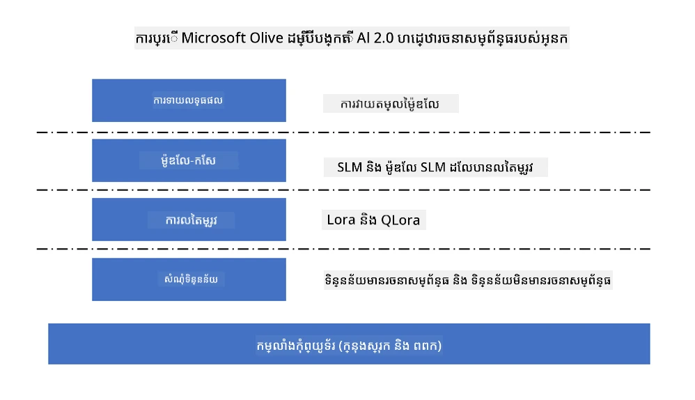
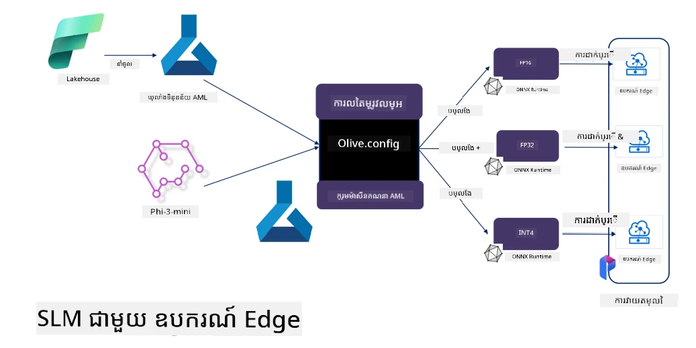

# **ធ្វើ Fine-tuning Phi-3 ជាមួយ Microsoft Olive**

[Olive](https://github.com/microsoft/OLive?WT.mc_id=aiml-138114-kinfeylo) គឺជាឧបករណ៍អូបទីម៉ាយស៊ីញមីតដែលមានចំណេះដឹងអំពីរឹងរ៉ឹងដែលងាយស្រួលប្រើ ដែលនាំអវិជ្ជមានបច្ចេកទេសដឹកនាំឧស្សាហកម្មក្នុងការបង្ហាប់ម៉ូឌែល, អូបទីម៉ាយ, និងកំណត់កូដ។

វាត្រូវបានរចនាឡើងដើម្បីធ្វើឲ្យដំណើរការអូបទីម៉ាយម៉ូឌែលម៉ាស៊ីនរៀនកាន់តែងាយស្រួល ដើម្បីធានាថាវាអាចប្រើប្រាស់ទ្រព្យសម្បត្តិរឹងម៉ាស៊ីនជាក់លាក់បានកាន់តែប្រសើរ។

មិនថាអ្នកកំពុងបំពងនៅលើកម្មវិធីមេឃឬឧបករណ៍កំពូលគ្នា Olive អនុញ្ញាតឱ្យអ្នកអូបទីម៉ាយម៉ូឌែលរបស់អ្នកយ៉ាងងាយស្រួល និងមានប្រសិទ្ធភាព។

## លក្ខណៈសំខាន់ៗ៖
- Olive ប្រមូលផ្តុំ និងស្វ័យប្រវត្តិក្នុងបច្ចេកទេសអូបទីម៉ាយសម្រាប់គោលដៅរឹងរ៉ឹងដែលត្រូវការ។
- បច្ចេកទេសអូបទីម៉ាយមួយតែមួយមិនអាចសម្របសម្រួលបានគ្រប់ស្ថានการณ์ទាំងអស់ ដូច្នេះ Olive អនុញ្ញាតឱ្យពង្រីកដោយឲ្យអ្នកជំនាញឧស្សាហកម្មអាចបញ្ចូលបច្ចេកទេសអូបទីម៉ាយថ្មីៗរបស់ខ្លួន។

## បន្ថយកិច្ចការជាងវិស្វកម្ម៖
- អ្នកអភិវឌ្ឍន៍ជាញឹកញាប់ត្រូវរៀន និងប្រើប្រាស់ឧបករណ៍ច្រើនរបស់អ្នកផ្គត់ផ្គង់រឹងរ៉ឹងផ្សេងៗដើម្បីរៀបចំ និងអូបទីម៉ាយម៉ូឌែលបានហ្វឹកហ្វឺនសម្រាប់ប្រើប្រាស់។
- Olive ងាយស្រួលភាពនេះដោយធ្វើស្វ័យប្រវត្តិបច្ចេកទេសអូបទីម៉ាយសម្រាប់រឹងរ៉ឹងដែលត្រូវការ។

## ដំណោះស្រាយអូបទីម៉ាយ E2E ដែលត្រៀមប្រើ:

ដោយការរួមបញ្ចូល និងកំណត់បច្ចេកទេសវិស្វកម្ម Olive ផ្តល់នូវដំណោះស្រាយតែមួយសម្រាប់អូបទីម៉ាយពីមួយចុងដល់មួយចុង។
វាគិតគូរនឹងការកំណត់ដូចជាកម្រិតត្រឹមត្រូវ និងពេលវេលាបញ្ចាក់ខណៈពេលអូបទីម៉ាយម៉ូឌែល។

## ការប្រើប្រាស់ Microsoft Olive ដើម្បីធ្វើ Fine-tuning

Microsoft Olive គឺជាឧបករណ៍អូបទីម៉ាយម៉ូឌែលប្រភពបើកដែលងាយស្រួលប្រើមួយដែលអាចគ្របដណ្តប់ការធ្វើ fine-tuning និងយោងក្នុងវិស័យបញ្ញាសិប្បនិម្មិតបង្កើត។ វាត្រូវការការកំណត់រចនាសម្ព័ន្ធល្អៗប៉ុណ្ណោះ ព្រមទាំងការប្រើម៉ូឌែលភាសារតូចប្រភពបើក និងបរិយាកាសរត់ពាក់ព័ន្ធ (AzureML / GPU តំបន់មូលដ្ឋាន, CPU, DirectML) អ្នកអាចបញ្ចប់ការធ្វើ fine-tuning ឬយោងម៉ូឌែលតាមរយៈអូបទីម៉ាយស្វ័យប្រវត្ត ហើយស្វែងរកម៉ូឌែលល្អបំផុតសម្រាប់ចែកចាយទៅមេឃ ឬទៅលើឧបករណ៍កំពូល។ អនុញ្ញាតឲ្យសហគ្រាសបង្កើតម៉ូឌែលឧស្សាហកម្មផ្ទាល់ខ្លួននៅលើដីកាន់ និងនៅលើមេឃ។



## Phi-3 Fine Tuning ជាមួយ Microsoft Olive



## កូដឧទាហរណ៍ Phi-3 Olive និងឧទាហរណ៍
ក្នុងឧទាហរណ៍នេះ អ្នកនឹងប្រើ Olive ដើម្បី៖

- ធ្វើ fine-tune ឧបករណ៍ LoRA មួយដើម្បីចាត់ថ្នាក់អក្សរជា Sad, Joy, Fear, Surprise។
- លាយទំងន់ឧបករណ៍ទៅក្នុងម៉ូឌែលមូលដ្ឋាន។
- អូបទីម៉ាយ និងប្រែម៉ូឌែលទៅជា int4។

[Sample Code](../../code/03.Finetuning/olive-ort-example/README.md)

### ការតំឡើង Microsoft Olive

ការតំឡើង Microsoft Olive គឺសាមញ្ញណាស់ ហើយអាចតំឡើងសម្រាប់ CPU, GPU, DirectML និង Azure ML ផងដែរ

```bash
pip install olive-ai
```

បើអ្នកចង់រត់ម៉ូឌែល ONNX ជាមួយ CPU អ្នកអាចប្រើ

```bash
pip install olive-ai[cpu]
```

បើអ្នកចង់រត់ម៉ូឌែល ONNX ជាមួយ GPU អ្នកអាចប្រើ

```python
pip install olive-ai[gpu]
```

បើអ្នកចង់ប្រើ Azure ML សូមប្រើ

```python
pip install git+https://github.com/microsoft/Olive#ស៊ុត=olive-ai[azureml]
```

**សម្គាល់**
តម្រូវការប្រព័ន្ធប្រតិបត្តិការ៖ Ubuntu 20.04 / 22.04 

### **Config.json របស់ Microsoft Olive**

បន្ទាប់ពីតំឡើង អ្នកអាចកំណត់ការកំណត់ម៉ូឌែលជាក់លាក់ផ្សេងៗតាមរយៈឯកសារ Config រួមមានទិន្នន័យ, ការគណនា, ការបណ្តុះបណ្តាល, ការចែកចាយ, និងការបង្កើតម៉ូឌែល។

**1. ទិន្នន័យ**

នៅលើ Microsoft Olive អាចគាំទ្រការបណ្តុះបណ្តាលលើទិន្នន័យមូលដ្ឋាន និងទិន្នន័យក្នុងមេឃ ហើយអាចកំណត់នៅក្នុងការកំណត់បាន។

*ការកំណត់ទិន្នន័យមូលដ្ឋាន*

អ្នកអាចកំណត់ឲ្យមានការបណ្តុះបណ្តាលសំណុំទិន្នន័យដែលត្រូវធ្វើ fine-tuning យ៉ាងងាយស្រួល ជាទូទៅនៅក្នុងទ្រង់ទ្រាយ json ហើយសម្រួលវាជាមួយពុម្ពទិន្នន័យ។ វាត្រូវបានកែសម្រួលអាស្រ័យលើតម្រូវការការទាញយកម៉ូឌែល (ឧទាហរណ៍ សម្រួលទៅទ្រង់ទ្រាយដែល Microsoft Phi-3-mini បង្ហាញ។ បើអ្នកមានម៉ូឌែលផ្សេង សូមយោងទៅតាមទ្រង់ទ្រាយ fine-tuning ដែលត្រូវការរបស់ម៉ូឌែលផ្សេងទៀតសម្រាប់ដំណើរការ)

```json

    "data_configs": [
        {
            "name": "dataset_default_train",
            "type": "HuggingfaceContainer",
            "load_dataset_config": {
                "params": {
                    "data_name": "json", 
                    "data_files":"dataset/dataset-classification.json",
                    "split": "train"
                }
            },
            "pre_process_data_config": {
                "params": {
                    "dataset_type": "corpus",
                    "text_cols": [
                            "phrase",
                            "tone"
                    ],
                    "text_template": "### Text: {phrase}\n### The tone is:\n{tone}",
                    "corpus_strategy": "join",
                    "source_max_len": 2048,
                    "pad_to_max_len": false,
                    "use_attention_mask": false
                }
            }
        }
    ],
```

**ការកំណត់ប្រភពទិន្នន័យមេឃ**

ដោយភ្ជាប់ datastore របស់ Azure AI Studio / Azure Machine Learning Service ដើម្បីភ្ជាប់ទិន្នន័យក្នុងមេឃ អ្នកអាចជ្រើសរើសឡើងទិន្នន័យផ្សេងៗមកជាប់ក្នុ Microsoft Fabric និង Azure Data ដើម្បីគាំទ្រការធ្វើ fine-tuning ទិន្នន័យ។

```json

    "data_configs": [
        {
            "name": "dataset_default_train",
            "type": "HuggingfaceContainer",
            "load_dataset_config": {
                "params": {
                    "data_name": "json", 
                    "data_files": {
                        "type": "azureml_datastore",
                        "config": {
                            "azureml_client": {
                                "subscription_id": "Your Azure Subscrition ID",
                                "resource_group": "Your Azure Resource Group",
                                "workspace_name": "Your Azure ML Workspaces name"
                            },
                            "datastore_name": "workspaceblobstore",
                            "relative_path": "Your train_data.json Azure ML Location"
                        }
                    },
                    "split": "train"
                }
            },
            "pre_process_data_config": {
                "params": {
                    "dataset_type": "corpus",
                    "text_cols": [
                            "Question",
                            "Best Answer"
                    ],
                    "text_template": "<|user|>\n{Question}<|end|>\n<|assistant|>\n{Best Answer}\n<|end|>",
                    "corpus_strategy": "join",
                    "source_max_len": 2048,
                    "pad_to_max_len": false,
                    "use_attention_mask": false
                }
            }
        }
    ],
    
```

**2. កំណត់ការគណនា**

ប្រសិនបើអ្នកត្រូវការប្រើមូលដ្ឋាន អ្នកអាចប្រើធនធានទិន្នន័យក្នុងតំបន់ទាំងតែប៉ុណ្ណោះ។ ប្រសិនបើចង់ប្រើធនធានរបស់ Azure AI Studio / Azure Machine Learning Service អ្នកត្រូវតែកំណត់ប៉ារ៉ាម៉ែត្រ Azure, ឈ្មោះថាមពលគណនា ជាដើម។

```json

    "systems": {
        "aml": {
            "type": "AzureML",
            "config": {
                "accelerators": ["gpu"],
                "hf_token": true,
                "aml_compute": "Your Azure AI Studio / Azure Machine Learning Service Compute Name",
                "aml_docker_config": {
                    "base_image": "Your Azure AI Studio / Azure Machine Learning Service docker",
                    "conda_file_path": "conda.yaml"
                }
            }
        },
        "azure_arc": {
            "type": "AzureML",
            "config": {
                "accelerators": ["gpu"],
                "aml_compute": "Your Azure AI Studio / Azure Machine Learning Service Compute Name",
                "aml_docker_config": {
                    "base_image": "Your Azure AI Studio / Azure Machine Learning Service docker",
                    "conda_file_path": "conda.yaml"
                }
            }
        }
    },
```

***សម្គាល់***

ដោយសារតែវារត់តាម container លើ Azure AI Studio / Azure Machine Learning Service ការកំណត់បរិស្ថានត្រូវបានកំណត់។ វាត្រូវបានកំណត់នៅក្នុងបរិយាកាស conda.yaml។

```yaml

name: project_environment
channels:
  - defaults
dependencies:
  - python=3.8.13
  - pip=22.3.1
  - pip:
      - einops
      - accelerate
      - azure-keyvault-secrets
      - azure-identity
      - bitsandbytes
      - datasets
      - huggingface_hub
      - peft
      - scipy
      - sentencepiece
      - torch>=2.2.0
      - transformers
      - git+https://github.com/microsoft/Olive@jiapli/mlflow_loading_fix#egg=olive-ai[gpu]
      - --extra-index-url https://aiinfra.pkgs.visualstudio.com/PublicPackages/_packaging/ORT-Nightly/pypi/simple/ 
      - ort-nightly-gpu==1.18.0.dev20240307004
      - --extra-index-url https://aiinfra.pkgs.visualstudio.com/PublicPackages/_packaging/onnxruntime-genai/pypi/simple/
      - onnxruntime-genai-cuda

    

```

**3. ជ្រើសរើស SLM របស់អ្នក**

អ្នកអាចប្រើម៉ូឌែលផ្ទាល់ពី Hugging face ឬអ្នកអាចភ្ជាប់ដោយផ្ទាល់ជាមួយបណ្ណាល័យម៉ូឌែលរបស់ Azure AI Studio / Azure Machine Learning ដើម្បីជ្រើសរើសម៉ូឌែលប្រើ។ នៅខាងក្រោម យើងនឹងប្រើ Microsoft Phi-3-mini ជាឧទាហរណ៍។

បើអ្នកមានម៉ូឌែលនៅក្នុងតំបន់ អ្នកអាចប្រើវិធីនេះ

```json

    "input_model":{
        "type": "PyTorchModel",
        "config": {
            "hf_config": {
                "model_name": "model-cache/microsoft/phi-3-mini",
                "task": "text-generation",
                "model_loading_args": {
                    "trust_remote_code": true
                }
            }
        }
    },
```

បើអ្នកចង់ប្រើម៉ូឌែលពី Azure AI Studio / Azure Machine Learning Service អ្នកអាចប្រើវិធីនេះ


```json

    "input_model":{
        "type": "PyTorchModel",
        "config": {
            "model_path": {
                "type": "azureml_registry_model",
                "config": {
                    "name": "microsoft/Phi-3-mini-4k-instruct",
                    "registry_name": "azureml-msr",
                    "version": "11"
                }
            },
             "model_file_format": "PyTorch.MLflow",
             "hf_config": {
                "model_name": "microsoft/Phi-3-mini-4k-instruct",
                "task": "text-generation",
                "from_pretrained_args": {
                    "trust_remote_code": true
                }
            }
        }
    },
```

**សម្គាល់:**
យើងត្រូវការរួមបញ្ចូលជាមួយ Azure AI Studio / Azure Machine Learning Service ដូច្នេះពេលរៀបចំម៉ូឌែល សូមយោងទៅលេខកំណែ និងឈ្មោះពាក់ព័ន្ធ។

ម៉ូឌែលទាំងអស់នៅលើ Azure ត្រូវតែបានកំណត់ជា PyTorch.MLflow

អ្នកត្រូវមានគណនី Hugging face និងភ្ជាប់key ទៅកាន់ Key value របស់ Azure AI Studio / Azure Machine Learning

**4. អាល់កុរីធម៉ិច**

Microsoft Olive សន្ទះការពិសេស Lora និង QLora សម្រាប់ការធ្វើ fine-tuning យ៉ាងល្អ។ អ្វីដែលអ្នកត្រូវកំណត់គឺប៉ារ៉ាម៉ែត្រពាក់ព័ន្ធខ្លះៗ។ នៅទីនេះខ្ញុំយក QLora ជាឧទាហរណ៍។

```json
        "lora": {
            "type": "LoRA",
            "config": {
                "target_modules": [
                    "o_proj",
                    "qkv_proj"
                ],
                "double_quant": true,
                "lora_r": 64,
                "lora_alpha": 64,
                "lora_dropout": 0.1,
                "train_data_config": "dataset_default_train",
                "eval_dataset_size": 0.3,
                "training_args": {
                    "seed": 0,
                    "data_seed": 42,
                    "per_device_train_batch_size": 1,
                    "per_device_eval_batch_size": 1,
                    "gradient_accumulation_steps": 4,
                    "gradient_checkpointing": false,
                    "learning_rate": 0.0001,
                    "num_train_epochs": 3,
                    "max_steps": 10,
                    "logging_steps": 10,
                    "evaluation_strategy": "steps",
                    "eval_steps": 187,
                    "group_by_length": true,
                    "adam_beta2": 0.999,
                    "max_grad_norm": 0.3
                }
            }
        },
```

បើអ្នកចង់បម្លែងគុណភាព Microsoft Olive main branch រួចហើយគាំទ្រពីវិធី onnxruntime-genai។ អ្នកអាចកំណត់វាអាស្រ័យលើតម្រូវការ៖

1. លាយទំងន់ឧបករណ៍ទៅក្នុងម៉ូឌែលមូលដ្ឋាន
2. បម្លែងម៉ូឌែលទៅម៉ូឌែល onnx ជាមួយភាពត្រឹមត្រូវដែលត្រូវការដោយ ModelBuilder

ដូចជាការបម្លែងទៅជា quantized INT4


```json

        "merge_adapter_weights": {
            "type": "MergeAdapterWeights"
        },
        "builder": {
            "type": "ModelBuilder",
            "config": {
                "precision": "int4"
            }
        }
```

**សម្គាល់** 
- ប្រសិនបើអ្នកប្រើ QLoRA ការបម្លែងគុណភាព ONNXRuntime-genai មិនទាន់គាំទ្រនៅពេលនេះទេ។

- ត្រូវបញ្ជាក់នៅទីនេះថាអ្នកអាចកំណត់ជំហានខាងលើដោយផ្អែកលើតម្រូវការរបស់ខ្លួន មិនចាំបាច់ត្រូវបំពេញគ្រប់ជំហានទាំងអស់។ អាស្រ័យលើតម្រូវការអ្នក អ្នកអាចប្រើវិធីអាល់កុរីធមិចដោយគ្មានការធ្វើ fine-tuning។ ចុងក្រោយអ្នកត្រូវកំណត់ម៉ាស៊ីនពាក់ព័ន្ធ។

```json

    "engine": {
        "log_severity_level": 0,
        "host": "aml",
        "target": "aml",
        "search_strategy": false,
        "execution_providers": ["CUDAExecutionProvider"],
        "cache_dir": "../model-cache/models/phi3-finetuned/cache",
        "output_dir" : "../model-cache/models/phi3-finetuned"
    }
```

**5. បញ្ចប់ការធ្វើ fine-tuning**

លើបន្ទាត់បញ្ជា ប្រតិបត្តិការនៅក្នុងថត olive-config.json

```bash
olive run --config olive-config.json  
```

---

<!-- CO-OP TRANSLATOR DISCLAIMER START -->
**ការបដិសេធ**៖  
ឯកសារនេះត្រូវបានបកប្រែដោយប្រើសេវាបកប្រែ AI [Co-op Translator](https://github.com/Azure/co-op-translator)។ ក្នុងការខំប្រឹងប្រែងរកភាពត្រឹមត្រូវ យើងសូមជម្រាបជូនថា ការបកប្រែដោយស្វ័យប្រវត្តិនេះអាចមានកំហុសឬការជ្រុះចុះកម្រិតខុសគ្នា។ ឯកសារដើមជាភាសាតិចតួចគួរត្រូវបានគិតថាជាដើមទុនដែលមានអំណាច។ សម្រាប់ព័ត៌មានសំខាន់ៗ ការបកប្រែដោយអ្នកជំនាញផ្ទាល់ត្រូវបានផ្តល់អនុសាសន៍។ យើងមិនទទួលខុសត្រូវចំពោះការយល់ច្រឡំ ឬការបកប្រែខុសពីការប្រើប្រាស់ការបកប្រែនេះឡើយ។
<!-- CO-OP TRANSLATOR DISCLAIMER END -->